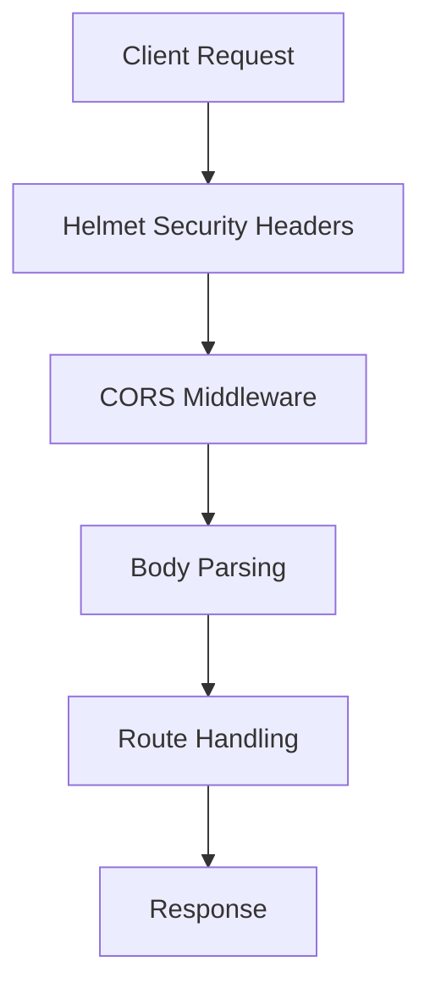
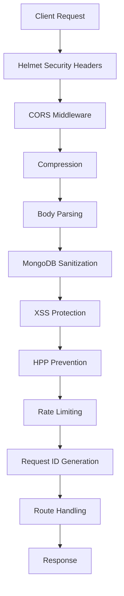
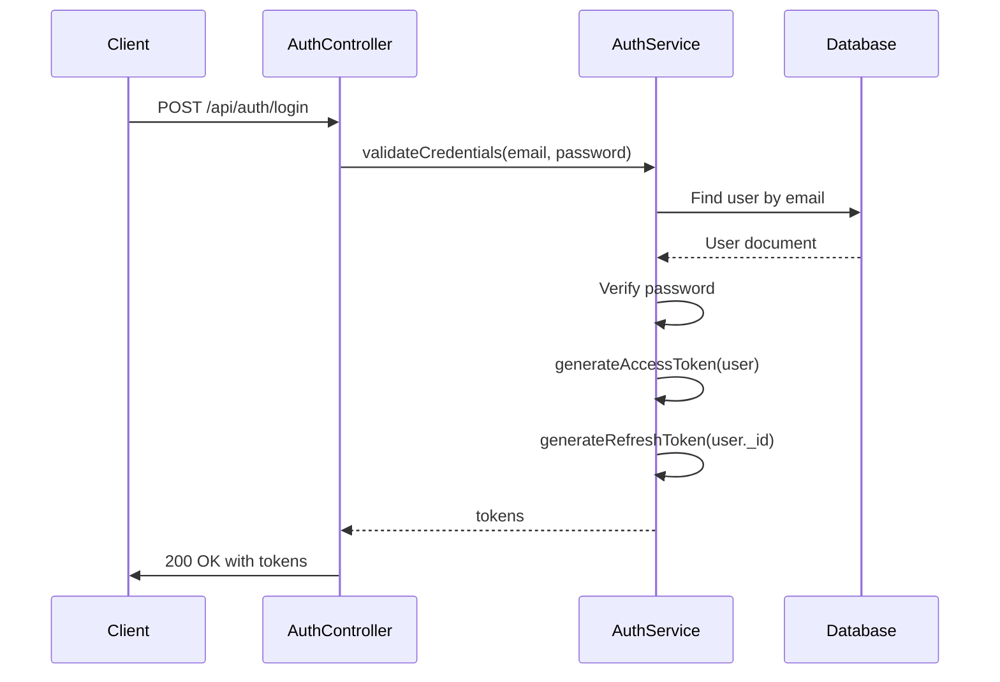
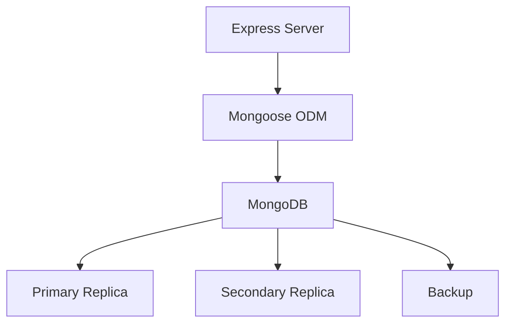
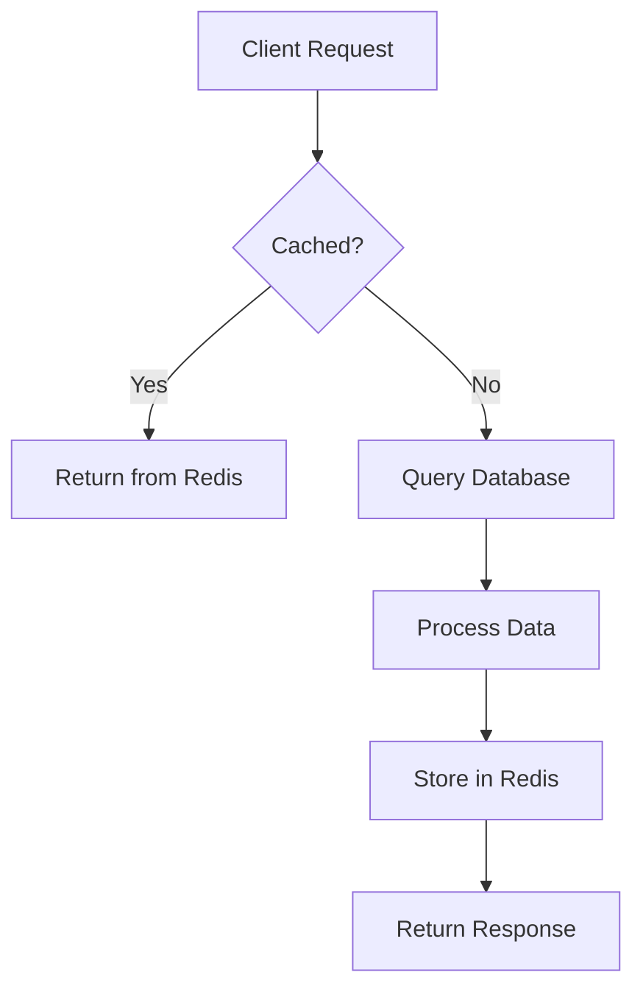

# REST API Examples

<cite>
**Referenced Files in This Document**   
- [server.js](file://examples/05-swarm-apps/rest-api/src/server.js)
- [index.js](file://examples/05-swarm-apps/rest-api/src/routes/index.js)
- [usersController.js](file://examples/05-swarm-apps/rest-api/src/controllers/usersController.js)
- [userModel.js](file://examples/05-swarm-apps/rest-api/src/models/userModel.js)
- [server.js](file://examples/05-swarm-apps/rest-api-advanced/server.js)
- [database.js](file://examples/05-swarm-apps/rest-api-advanced/src/config/database.js)
- [redis.js](file://examples/05-swarm-apps/rest-api-advanced/src/config/redis.js)
- [auth.controller.js](file://examples/05-swarm-apps/rest-api-advanced/src/controllers/auth.controller.js)
- [auth.service.js](file://examples/05-swarm-apps/rest-api-advanced/src/services/auth.service.js)
- [README.md](file://examples/05-swarm-apps/rest-api/README.md)
- [README.md](file://examples/05-swarm-apps/rest-api-advanced/README.md)
</cite>

## Table of Contents
1. [Introduction](#introduction)
2. [Basic REST API Example](#basic-rest-api-example)
3. [Advanced REST API Example](#advanced-rest-api-example)
4. [Server Architecture Comparison](#server-architecture-comparison)
5. [Routing and Controller Design](#routing-and-controller-design)
6. [Middleware and Security Implementation](#middleware-and-security-implementation)
7. [Authentication and Authorization](#authentication-and-authorization)
8. [Data Validation and Error Handling](#data-validation-and-error-handling)
9. [Database and Caching Strategies](#database-and-caching-strategies)
10. [Performance and Scalability Considerations](#performance-and-scalability-considerations)
11. [Testing and Deployment](#testing-and-deployment)
12. [Conclusion](#conclusion)

## Introduction
This document provides a comprehensive analysis of REST API examples within the Claude-Flow repository, focusing on both basic and advanced implementations. The analysis covers server architecture, routing patterns, controller design, middleware usage, and the relationship between API endpoints and underlying agent coordination. The examples demonstrate how specialized agents (coder, architect, tester) collaborate to generate complete API implementations using swarm intelligence principles. The document examines concrete implementations from the rest-api and rest-api-advanced applications, detailing request handling, error responses, and data validation patterns. Configuration options for API versioning, CORS, and security headers are explained, along with common issues such as endpoint collision, payload validation failures, and authentication integration. Performance considerations for API scalability, including connection pooling, request batching, and response caching strategies, are also addressed.

## Basic REST API Example

The basic REST API example demonstrates fundamental principles of API development using Node.js and Express. This implementation focuses on simplicity and best practices for API design, providing a foundation for understanding more complex implementations.

### Features and Structure
The basic REST API includes the following key features:
- **RESTful Design**: Full CRUD operations for Users and Products
- **Validation**: Input validation using express-validator
- **Error Handling**: Centralized error handling middleware
- **Security**: Helmet for security headers, CORS support
- **Testing**: Comprehensive test suite with Jest and Supertest
- **Pagination**: Built-in pagination support for list endpoints
- **Filtering**: Query parameter filtering for products
- **Documentation**: Clear API documentation and examples

The project structure follows a conventional pattern with separate directories for controllers, models, routes, and middleware. This organization promotes separation of concerns and makes the codebase easier to navigate and maintain.

### API Endpoints
The API exposes endpoints for health checks, user management, and product management. Health checks are available at `GET /health`, while API information is accessible at `GET /api/v1`. User endpoints include listing all users, retrieving a user by ID, creating, updating, and deleting users. Product endpoints provide similar CRUD operations with additional features like filtering by category and price range, and pagination support.

**Section sources**
- [README.md](file://examples/05-swarm-apps/rest-api/README.md#L1-L227)

## Advanced REST API Example

The advanced REST API example represents a production-ready implementation with comprehensive features for enterprise applications. This implementation builds upon the basic example by adding authentication, role-based access control, database integration, caching, and enhanced security measures.

### Enhanced Features
The advanced API includes several additional features:
- **Authentication & Authorization**: JWT-based authentication with refresh tokens
- **Role-Based Access Control**: User and admin roles with permission-based routing
- **Database**: MongoDB with Mongoose ODM
- **Caching**: Redis integration for performance optimization
- **Validation**: Request validation using Joi and express-validator
- **Logging**: Structured logging with Winston
- **Security**: Comprehensive security measures including rate limiting, helmet, CORS, XSS protection
- **API Documentation**: Auto-generated Swagger/OpenAPI documentation
- **File Upload**: Multer integration for product images and avatars
- **Email**: Email service for notifications, verification, and password reset
- **Monitoring**: Health checks and readiness endpoints

### E-commerce Functionality
The advanced API includes specialized e-commerce features:
- **Product Management**: Full CRUD operations with categories, tags, and specifications
- **Inventory Tracking**: Real-time stock management with bulk operations
- **Product Reviews**: User reviews with ratings and helpful votes
- **Order Processing**: Complete order lifecycle from creation to delivery
- **Shopping Cart**: Session-based cart management
- **Payment Integration**: Support for multiple payment methods
- **Order Tracking**: Shipping information and status updates
- **Sales Reports**: Admin analytics and reporting

**Section sources**
- [README.md](file://examples/05-swarm-apps/rest-api-advanced/README.md#L1-L544)

## Server Architecture Comparison

The server architecture differs significantly between the basic and advanced REST API examples, reflecting their respective complexity and production readiness.

### Basic API Architecture
The basic API server is configured with essential middleware for security, logging, and body parsing. It uses Helmet for security headers, CORS for cross-origin requests, and Morgan for logging. The server setup is straightforward, with minimal configuration required.



**Diagram sources**
- [server.js](file://examples/05-swarm-apps/rest-api/src/server.js#L1-L56)

### Advanced API Architecture
The advanced API server includes additional layers of security, performance optimization, and monitoring. It implements rate limiting, request sanitization, compression, and comprehensive logging. The server also integrates Swagger for API documentation and includes graceful shutdown handling.



**Diagram sources**
- [server.js](file://examples/05-swarm-apps/rest-api-advanced/server.js#L1-L243)

## Routing and Controller Design

The routing and controller design patterns in both examples follow RESTful principles, with clear separation between route definitions and business logic.

### Route Organization
Both APIs organize routes by resource type, with separate route files for users, products, and authentication. The basic API uses a simple index.js file to mount route modules, while the advanced API has dedicated route files for each resource.

```mermaid
graph TD
A[/api/v1] --> B[Users Routes]
A --> C[Products Routes]
A --> D[Auth Routes]
A --> E[Order Routes]
B --> F[GET /users]
B --> G[GET /users/:id]
B --> H[POST /users]
B --> I[PUT /users/:id]
B --> J[DELETE /users/:id]
```

**Diagram sources**
- [index.js](file://examples/05-swarm-apps/rest-api/src/routes/index.js#L1-L24)
- [auth.routes.js](file://examples/05-swarm-apps/rest-api-advanced/src/routes/auth.routes.js#L1-L100)

### Controller Implementation
Controllers handle the business logic for each endpoint, interacting with models or services to process requests. The basic API controllers use a simple pattern with try-catch blocks for error handling, while the advanced API uses asyncHandler middleware to simplify error handling.

```javascript
// Basic API controller pattern
const usersController = {
  getAllUsers: async (req, res, next) => {
    try {
      const { page = 1, limit = 10, sort = 'id' } = req.query;
      const users = await userModel.findAll({ page, limit, sort });
      
      res.json({
        success: true,
        data: users,
        pagination: {
          page: parseInt(page),
          limit: parseInt(limit),
          total: users.length
        }
      });
    } catch (error) {
      next(error);
    }
  },
  // Additional methods...
};
```

**Section sources**
- [usersController.js](file://examples/05-swarm-apps/rest-api/src/controllers/usersController.js#L1-L117)

## Middleware and Security Implementation

Middleware plays a crucial role in both API examples, providing essential functionality for security, validation, and request processing.

### Security Middleware
The basic API implements fundamental security measures using Helmet and CORS. Helmet sets various HTTP headers to protect against common web vulnerabilities, while CORS configuration allows cross-origin requests from specified origins.

The advanced API enhances security with additional middleware:
- **Rate Limiting**: Prevents abuse by limiting requests per IP address
- **MongoDB Sanitization**: Protects against NoSQL injection attacks
- **XSS Protection**: Sanitizes input to prevent cross-site scripting
- **HTTP Parameter Pollution Prevention**: Handles duplicate query parameters
- **Content Security Policy**: Restricts resources that can be loaded

```javascript
// Advanced API security middleware
app.use(helmet({
  contentSecurityPolicy: {
    directives: {
      defaultSrc: ["'self'"],
      scriptSrc: ["'self'", "'unsafe-inline'", 'cdnjs.cloudflare.com'],
      styleSrc: ["'self'", "'unsafe-inline'", 'cdnjs.cloudflare.com'],
      imgSrc: ["'self'", 'data:', 'https:'],
    },
  },
}));
```

**Section sources**
- [server.js](file://examples/05-swarm-apps/rest-api-advanced/server.js#L1-L243)

### Custom Middleware
Both APIs include custom middleware for error handling and request processing. The basic API has a centralized errorHandler middleware, while the advanced API adds notFound middleware for 404 responses and request ID tracking for monitoring.

```javascript
// Request ID middleware
app.use((req, res, next) => {
  req.id = require('uuid').v4();
  res.setHeader('X-Request-ID', req.id);
  next();
});
```

**Section sources**
- [errorHandler.js](file://examples/05-swarm-apps/rest-api/src/middleware/errorHandler.js#L1-L50)
- [server.js](file://examples/05-swarm-apps/rest-api-advanced/server.js#L1-L243)

## Authentication and Authorization

The advanced API implements a comprehensive authentication system using JWT (JSON Web Tokens) with refresh tokens and role-based access control.

### JWT Authentication Flow
The authentication system follows a standard JWT pattern with access and refresh tokens. Access tokens are short-lived (7 days by default), while refresh tokens are longer-lived (30 days) and used to obtain new access tokens without requiring the user to log in again.



**Diagram sources**
- [auth.controller.js](file://examples/05-swarm-apps/rest-api-advanced/src/controllers/auth.controller.js#L1-L337)
- [auth.service.js](file://examples/05-swarm-apps/rest-api-advanced/src/services/auth.service.js#L1-L200)

### Authentication Endpoints
The API provides a complete set of authentication endpoints:
- **Registration**: Create new user accounts with email verification
- **Login**: Authenticate users and return JWT tokens
- **Logout**: Invalidate tokens and clear session
- **Token Refresh**: Obtain new access token using refresh token
- **Password Management**: Forgot password, reset password flows
- **Email Verification**: Verify email addresses with tokens
- **Account Status**: Check current user and password strength

```javascript
// Authentication controller methods
const authController = {
  register: asyncHandler(async (req, res, next) => {
    // Implementation...
  }),
  login: asyncHandler(async (req, res, next) => {
    // Implementation...
  }),
  logout: asyncHandler(async (req, res, next) => {
    // Implementation...
  }),
  // Additional methods...
};
```

**Section sources**
- [auth.controller.js](file://examples/05-swarm-apps/rest-api-advanced/src/controllers/auth.controller.js#L1-L337)

## Data Validation and Error Handling

Both API examples implement robust data validation and error handling to ensure data integrity and provide meaningful feedback to clients.

### Validation Strategies
The basic API uses express-validator for input validation, checking that required fields are present and data types are correct. The advanced API enhances validation with Joi for more complex schema validation and custom validation functions.

Validation rules include:
- **Users**: Name and valid email required, age must be 0-120
- **Products**: Name, price, and category required, stock must be non-negative
- **Authentication**: Password strength requirements, email format validation

```json
{
  "errors": [
    {
      "type": "field",
      "msg": "Valid email is required",
      "path": "email",
      "location": "body"
    }
  ]
}
```

### Error Response Format
Both APIs use a consistent error response format that includes error codes, messages, and details for debugging:

```json
{
  "success": false,
  "error": {
    "code": "VALIDATION_ERROR",
    "message": "Validation failed",
    "details": [
      {
        "field": "email",
        "message": "Invalid email format"
      }
    ]
  },
  "requestId": "550e8400-e29b-41d4-a716-446655440000"
}
```

The advanced API includes additional error handling features:
- **Custom Error Classes**: ApiError class for consistent error creation
- **Structured Logging**: Error details logged with request context
- **Error Code System**: Standardized error codes for client handling
- **Graceful Degradation**: Services continue to function when Redis is unavailable

**Section sources**
- [README.md](file://examples/05-swarm-apps/rest-api/README.md#L1-L227)
- [README.md](file://examples/05-swarm-apps/rest-api-advanced/README.md#L1-L544)

## Database and Caching Strategies

The database and caching strategies differ significantly between the basic and advanced API examples, reflecting their different use cases and scalability requirements.

### Basic API Data Storage
The basic API uses in-memory storage for demonstration purposes, with data stored in JavaScript arrays. This approach is suitable for development and testing but not for production use.

```javascript
// In-memory data store
let users = [
  { id: 1, name: 'John Doe', email: 'john@example.com', age: 30, createdAt: new Date() },
  { id: 2, name: 'Jane Smith', email: 'jane@example.com', age: 25, createdAt: new Date() }
];
```

**Section sources**
- [userModel.js](file://examples/05-swarm-apps/rest-api/src/models/userModel.js#L1-L81)

### Advanced API Database Integration
The advanced API uses MongoDB with Mongoose ODM for persistent data storage. The database configuration includes connection pooling, error handling, and graceful shutdown.



**Diagram sources**
- [database.js](file://examples/05-swarm-apps/rest-api-advanced/src/config/database.js#L1-L45)

### Caching with Redis
The advanced API implements Redis for caching frequently accessed data, improving performance and reducing database load. Redis is used for:
- **Session Storage**: Storing user sessions and authentication tokens
- **Response Caching**: Caching API responses for high-traffic endpoints
- **Rate Limiting**: Tracking request counts for rate limiting
- **Temporary Data**: Storing password reset and email verification tokens

```javascript
// Redis configuration
const initializeRedis = async () => {
  try {
    redisClient = new Redis({
      host: process.env.REDIS_HOST || 'localhost',
      port: process.env.REDIS_PORT || 6379,
      password: process.env.REDIS_PASSWORD,
      db: process.env.REDIS_DB || 0,
      retryStrategy: (times) => {
        const delay = Math.min(times * 50, 2000);
        return delay;
      },
      maxRetriesPerRequest: 3,
      enableReadyCheck: true,
      enableOfflineQueue: true,
    });
  } catch (error) {
    logger.error('Redis initialization failed:', error);
    return null;
  }
};
```

**Section sources**
- [redis.js](file://examples/05-swarm-apps/rest-api-advanced/src/config/redis.js#L1-L80)

## Performance and Scalability Considerations

The API examples demonstrate different approaches to performance optimization and scalability based on their complexity and intended use cases.

### Performance Optimization Techniques
The advanced API implements several performance optimization techniques:

**Caching Strategies**
- Redis caching for frequently accessed data
- Response compression with gzip
- Database indexing on commonly queried fields
- Query optimization with Mongoose lean()

**Request Handling**
- Rate limiting to prevent abuse
- Connection pooling for database
- Pagination for large datasets
- Request batching for bulk operations



**Diagram sources**
- [redis.js](file://examples/05-swarm-apps/rest-api-advanced/src/config/redis.js#L1-L80)

### Scalability Features
The advanced API includes features designed for scalability:
- **Docker Support**: Containerization for consistent deployment
- **Environment Configuration**: Different settings for development, staging, and production
- **Health Checks**: Readiness and liveness probes for orchestration
- **Graceful Shutdown**: Proper cleanup during service termination
- **Monitoring Integration**: Support for external monitoring tools

### Load Balancing and High Availability
The advanced API can be deployed in a clustered configuration with load balancing:
- Multiple API instances behind a load balancer
- Shared Redis instance for session storage
- MongoDB replica set for database high availability
- Separate services for different API domains

**Section sources**
- [README.md](file://examples/05-swarm-apps/rest-api-advanced/README.md#L1-L544)

## Testing and Deployment

Both API examples include comprehensive testing and deployment strategies, with the advanced API providing more sophisticated tooling.

### Testing Strategies
The basic API includes unit and integration tests using Jest and Supertest:

```bash
# Run all tests
npm test

# Run tests with coverage
npm test -- --coverage

# Run tests in watch mode
npm run test:watch
```

The advanced API enhances testing with:
- **Unit Tests**: Auth service, validation, utility functions
- **Integration Tests**: Authentication, product management, order processing
- **Test Isolation**: MongoDB Memory Server for isolated testing
- **Test Coverage**: Comprehensive coverage reporting

```bash
# Run unit tests
npm run test:unit

# Run integration tests
npm run test:integration

# Run tests with coverage
npm run test:coverage
```

**Section sources**
- [README.md](file://examples/05-swarm-apps/rest-api/README.md#L1-L227)
- [README.md](file://examples/05-swarm-apps/rest-api-advanced/README.md#L1-L544)

### Deployment Options
The advanced API provides multiple deployment options:

**Docker Deployment**
```bash
docker build -t rest-api-advanced .
docker run -p 3000:3000 --env-file .env rest-api-advanced
```

**PM2 Deployment**
```bash
pm2 start ecosystem.config.js --env production
```

**Docker Compose**
```bash
docker-compose up --build
```

The deployment checklist includes:
- Setting environment variables
- Configuring security settings
- Setting up monitoring
- Configuring backups
- Implementing auto-scaling

**Section sources**
- [README.md](file://examples/05-swarm-apps/rest-api-advanced/README.md#L1-L544)

## Conclusion
The REST API examples in the Claude-Flow repository demonstrate a progression from basic to advanced implementations, showcasing best practices in API development. The basic example provides a solid foundation with essential features like RESTful design, validation, and error handling. The advanced example builds upon this foundation with production-ready features including authentication, database integration, caching, and comprehensive security measures.

Both examples illustrate the power of swarm intelligence in generating complete API implementations, with specialized agents collaborating to produce well-structured, maintainable code. The architecture patterns, middleware usage, and design decisions reflect current best practices in API development.

Key takeaways include:
- The importance of separation of concerns in API design
- The value of comprehensive error handling and validation
- The benefits of using established security practices
- The performance advantages of caching and query optimization
- The necessity of thorough testing and deployment strategies

These examples serve as valuable references for developers building RESTful services, providing practical implementations that can be adapted to various use cases and complexity levels.