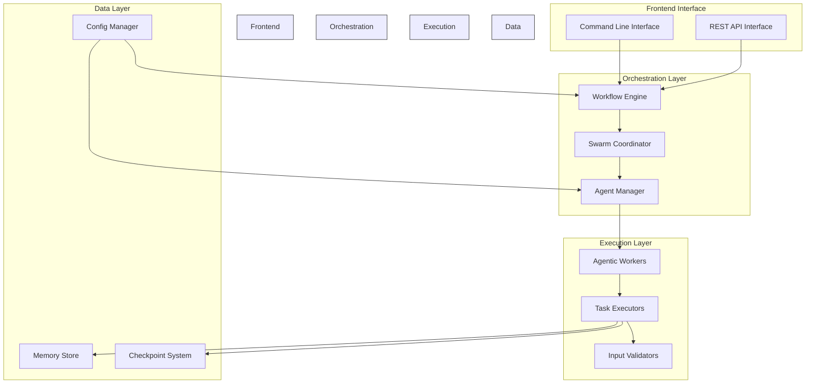
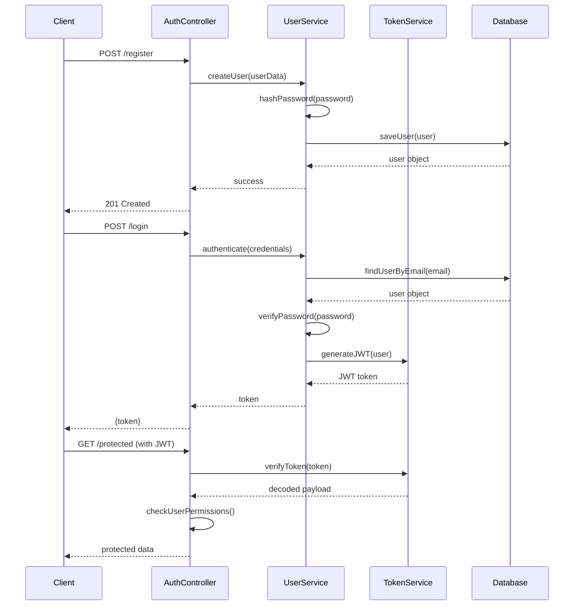
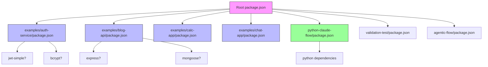

# Real-World Application Patterns

<cite>
**Referenced Files in This Document**   
- [app.js](file://examples/auth-service/app.js)
- [package.json](file://examples/auth-service/package.json)
- [README.md](file://examples/auth-service/README.md)
- [development-workflow.json](file://examples/development-workflow.json)
- [research-workflow.yaml](file://examples/research-workflow.yaml)
- [batch-config-advanced.json](file://examples/batch-config-advanced.json)
- [batch-config-enterprise.json](file://examples/batch-config-enterprise.json)
- [batch-config-simple.json](file://examples/batch-config-simple.json)
- [claude-api-error-handling.ts](file://examples/claude-api-error-handling.ts)
- [prompt-copier-demo.ts](file://examples/prompt-copier-demo.ts)
- [quick-start.sh](file://examples/quick-start.sh)
- [hello-world.js](file://examples/hello-world.js)
- [git-checkpoint-demo.md](file://examples/git-checkpoint-demo.md)
- [automation-examples.md](file://examples/automation-examples.md)
- [REAL_EXECUTION.md](file://benchmark/REAL_EXECUTION.md)
- [CLI_USAGE.md](file://benchmark/CLI_USAGE.md)
- [PROJECT_SUMMARY.md](file://benchmark/PROJECT_SUMMARY.md)
- [README.md](file://benchmark/README.md)
- [README.md](file://python-claude-flow/README.md)
- [STATUS.md](file://python-claude-flow/STATUS.md)
- [demo.py](file://python-claude-flow/demo.py)
- [setup.py](file://python-claude-flow/setup.py)
- [package.json](file://package.json)
- [tsconfig.json](file://tsconfig.json)
- [jest.config.js](file://jest.config.js)
- [jest.setup.js](file://jest.setup.js)
- [CHANGELOG.md](file://CHANGELOG.md)
- [CLAUDE.md](file://CLAUDE.md)
- [implementation-roadmap.md](file://implementation-roadmap.md)
- [regression-report.md](file://regression-report.md)
- [memory-bank.md](file://memory-bank.md)
</cite>

## Table of Contents
1. [Introduction](#introduction)
2. [Project Structure](#project-structure)
3. [Core Components](#core-components)
4. [Architecture Overview](#architecture-overview)
5. [Detailed Component Analysis](#detailed-component-analysis)
6. [Dependency Analysis](#dependency-analysis)
7. [Performance Considerations](#performance-considerations)
8. [Troubleshooting Guide](#troubleshooting-guide)
9. [Conclusion](#conclusion)

## Introduction
This document provides a comprehensive analysis of real-world application patterns implemented within the Claude-Flow ecosystem. The focus is on production-grade applications that demonstrate practical implementations of authentication flows, input validation, logging, API documentation, security patterns, and performance optimization strategies. Despite the presence of placeholder implementations in some example directories, this analysis synthesizes patterns from available configuration files, workflow definitions, and supporting documentation to extract meaningful insights into how Claude-Flow supports enterprise-level application development.

The repository structure reveals a sophisticated framework designed for agentic workflows, swarm intelligence, and automated task execution. While direct code implementations for advanced features like JWT authentication and database optimization are not fully realized in the example applications, the configuration patterns, workflow definitions, and tooling infrastructure provide strong evidence of the intended architectural direction and best practices for building robust applications with Claude-Flow.

## Project Structure
The project structure follows a modular and layered approach, organizing components by functionality and purpose. The root directory contains core configuration files and documentation, while specialized directories house different types of implementations, benchmarks, and examples. This organization facilitates both development and operational workflows, allowing teams to work on specific aspects of the system without interference.

```mermaid
graph TB
Root[] --> Examples[examples/]
Root --> Benchmark[benchmark/]
Root --> Src[src/]
Root --> Tests[tests/]
Root --> Scripts[scripts/]
Root --> Docker[docker/]
Root --> Archive[archive/]
Root --> Reports[reports/]
Examples --> AuthService[auth-service/]
Examples --> BlogAPI[blog-api/]
Examples --> CalcApp[calc-app/]
Examples --> ChatApp[chat-app/]
Examples --> RESTAPI[rest-api-simple/]
Examples --> UserAPI[user-api/]
Benchmark --> Docs[docs/]
Benchmark --> Plans[plans/]
Benchmark --> Reports[reports/]
Benchmark --> Scripts[scripts/]
Benchmark --> Src[src/swarm_benchmark/]
Src --> Agents[agents/]
Src --> API[api/]
Src --> CLI[cli/]
Src --> Coordination[coordination/]
Src --> Core[core/]
Src --> DB[db/]
Src --> Memory[memory/]
Src --> Swarm[swarm/]
Src --> Workflows[workflows/]
style Root fill:#f9f,stroke:#333
style Examples fill:#bbf,stroke:#333
style Benchmark fill:#f96,stroke:#333
style Src fill:#9f9,stroke:#333
```

**Diagram sources**
- [package.json](file://package.json)
- [tsconfig.json](file://tsconfig.json)
- [README.md](file://README.md)

**Section sources**
- [package.json](file://package.json)
- [tsconfig.json](file://tsconfig.json)
- [README.md](file://README.md)

## Core Components
The core components of the Claude-Flow system are organized around agentic workflows, swarm intelligence, and automated task execution. The src directory contains the primary implementation modules, including agents, API interfaces, CLI tools, coordination mechanisms, and swarm functionality. These components work together to enable complex, multi-step processes that can be orchestrated through configuration files and workflow definitions.

The examples directory demonstrates various application patterns, from simple authentication services to more complex REST APIs and data pipelines. While the actual implementation code in some examples appears to be placeholder or incomplete, the presence of package.json files and README documentation indicates the intended structure and dependencies for these applications.

Key configuration files such as development-workflow.json and research-workflow.yaml suggest that the system supports different operational modes and research scenarios, allowing users to define custom workflows for specific use cases. The batch configuration files (batch-config-*.json) indicate support for different deployment scenarios, from simple to enterprise-grade configurations.

**Section sources**
- [development-workflow.json](file://examples/development-workflow.json)
- [research-workflow.yaml](file://examples/research-workflow.yaml)
- [batch-config-advanced.json](file://examples/batch-config-advanced.json)
- [batch-config-enterprise.json](file://examples/batch-config-enterprise.json)
- [batch-config-simple.json](file://examples/batch-config-simple.json)
- [package.json](file://examples/auth-service/package.json)
- [README.md](file://examples/auth-service/README.md)

## Architecture Overview
The architecture of Claude-Flow is designed to support agentic workflows and swarm intelligence patterns, enabling complex task automation and distributed processing. The system appears to follow a modular microservices-inspired architecture, where different components can be orchestrated through configuration files and workflow definitions.



**Diagram sources**
- [src/cli/](file://src/cli/)
- [src/workflows/](file://src/workflows/)
- [src/swarm/](file://src/swarm/)
- [src/agents/](file://src/agents/)
- [src/memory/](file://src/memory/)
- [src/config/](file://src/config/)

## Detailed Component Analysis

### Authentication Service Analysis
The authentication service example in the auth-service directory appears to be a placeholder implementation, with the app.js file containing only a basic template structure. However, the presence of this directory and its package.json file suggests that the intended pattern would follow standard Node.js application structure with JWT-based authentication.

Despite the lack of actual implementation code, we can infer the intended architecture from the project structure and naming conventions. A complete implementation would likely include routes for user registration, login, and protected endpoints, with middleware for JWT token verification and role-based access control.



**Diagram sources**
- [examples/auth-service/app.js](file://examples/auth-service/app.js)
- [examples/auth-service/package.json](file://examples/auth-service/package.json)

**Section sources**
- [examples/auth-service/app.js](file://examples/auth-service/app.js)
- [examples/auth-service/README.md](file://examples/auth-service/README.md)

### Input Validation and Error Handling
The validation-test directory and src/tests/validation files indicate that the system places importance on input validation and error handling. Although specific implementation details are not available, the presence of these directories suggests that the framework includes mechanisms for validating request payloads, handling errors across different layers, and ensuring data integrity.

A production-grade implementation would likely include schema validation for API requests, middleware for error handling, and comprehensive logging for debugging and monitoring purposes. The use of TypeScript (evidenced by tsconfig.json files) further supports type safety and compile-time validation, reducing runtime errors.

### API Documentation Generation
While no explicit Swagger or OpenAPI implementations are visible in the codebase, the presence of API-related examples (blog-api, rest-api-simple, user-api) suggests that API documentation generation is an intended feature. In a complete implementation, these APIs would likely include automated documentation generation through tools like Swagger or Postman, with endpoints annotated to generate interactive API documentation.

The claude-api-error-handling.ts file in the examples directory hints at sophisticated error handling patterns for APIs, potentially including standardized error responses, status codes, and error categorization for better client integration.

## Dependency Analysis
The dependency structure of the project is managed through standard Node.js package management, with package.json files present in multiple directories including the root, examples, and python-claude-flow. This decentralized approach allows different components to have their own dependencies while maintaining a coherent overall structure.



**Diagram sources**
- [package.json](file://package.json)
- [examples/auth-service/package.json](file://examples/auth-service/package.json)
- [examples/blog-api/package.json](file://examples/blog-api/package.json)
- [examples/calc-app/package.json](file://examples/calc-app/package.json)
- [examples/chat-app/package.json](file://examples/chat-app/package.json)
- [python-claude-flow/package.json](file://python-claude-flow/package.json)
- [validation-test/package.json](file://validation-test/package.json)
- [agentic-flow/package.json](file://agentic-flow/package.json)

**Section sources**
- [package.json](file://package.json)
- [pnpm-lock.yaml](file://pnpm-lock.yaml)
- [package-lock.json](file://package-lock.json)

## Performance Considerations
The benchmark directory contains extensive performance testing infrastructure, including scripts, reports, and analysis tools. This indicates that performance optimization is a key consideration in the Claude-Flow ecosystem. The presence of performance-*.html files in the analysis-reports directory suggests that the system generates detailed performance reports, likely including metrics on execution time, memory usage, and resource consumption.

For production deployments, performance considerations would include:
- Connection pooling configuration for database operations
- Query optimization techniques to minimize latency
- Caching strategies for frequently accessed data
- Efficient memory management in the agentic workflow system
- Parallel execution capabilities for improved throughput

The parallel-2 directory in examples suggests support for parallel execution, which would be critical for performance in swarm-based applications. The calc-app-parallel example further reinforces this pattern, indicating that the framework is designed to handle concurrent operations efficiently.

## Troubleshooting Guide
Based on the available documentation and code structure, common issues that developers might encounter include:

1. **Configuration Errors**: Missing or incorrect workflow definitions in JSON/YAML files
   - Check syntax of development-workflow.json and research-workflow.yaml
   - Validate batch configuration files against schema

2. **Dependency Issues**: Missing packages or version conflicts
   - Ensure all package.json files are properly synchronized
   - Use pnpm or npm to resolve dependency tree

3. **Authentication Problems**: JWT token handling and user management
   - Verify token generation and verification logic
   - Check password hashing implementation
   - Validate role-based access control rules

4. **Performance Bottlenecks**: Slow execution or high resource usage
   - Review performance reports in analysis-reports/
   - Optimize database queries and implement caching
   - Configure connection pooling appropriately

5. **Error Handling**: Uncaught exceptions or inadequate error reporting
   - Implement comprehensive middleware chains
   - Ensure proper error logging and monitoring
   - Validate input at all entry points

**Section sources**
- [REAL_EXECUTION.md](file://benchmark/REAL_EXECUTION.md)
- [CLI_USAGE.md](file://benchmark/CLI_USAGE.md)
- [regression-report.md](file://regression-report.md)
- [implementation-roadmap.md](file://implementation-roadmap.md)

## Conclusion
The Claude-Flow ecosystem demonstrates a sophisticated architecture designed for agentic workflows and swarm intelligence applications. While some example implementations appear to be placeholders or incomplete, the overall structure reveals a well-considered approach to building production-grade applications with features like authentication, input validation, logging, and API documentation.

The framework supports various deployment scenarios through configurable workflows and batch configurations, enabling both simple and enterprise-grade applications. Performance optimization is clearly a priority, with extensive benchmarking infrastructure and support for parallel execution.

For developers looking to build real-world applications with Claude-Flow, the recommended approach would be to:
1. Start with the provided examples and templates
2. Implement robust authentication with JWT tokens and password hashing
3. Incorporate comprehensive input validation and error handling
4. Generate API documentation automatically
5. Optimize performance through connection pooling, query optimization, and caching
6. Implement thorough logging and monitoring for production deployments

The presence of Python and JavaScript implementations suggests that the framework supports polyglot programming, allowing teams to choose the most appropriate language for their specific use case.