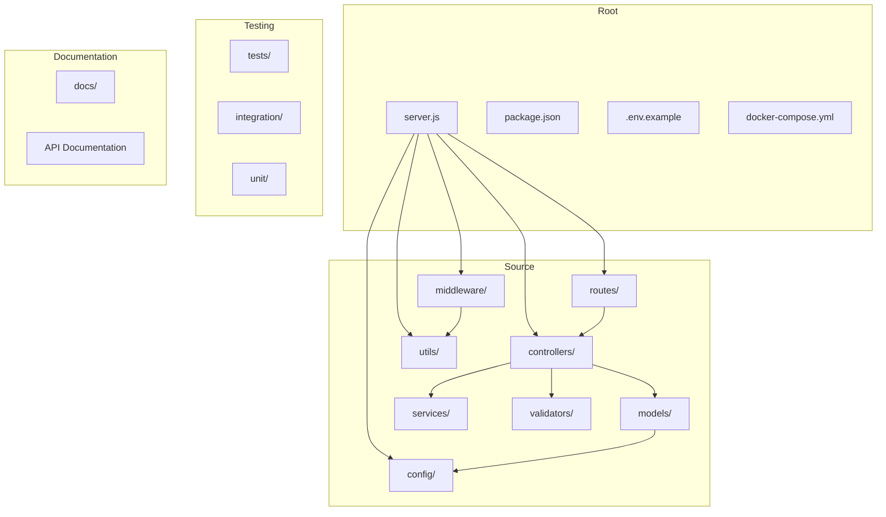
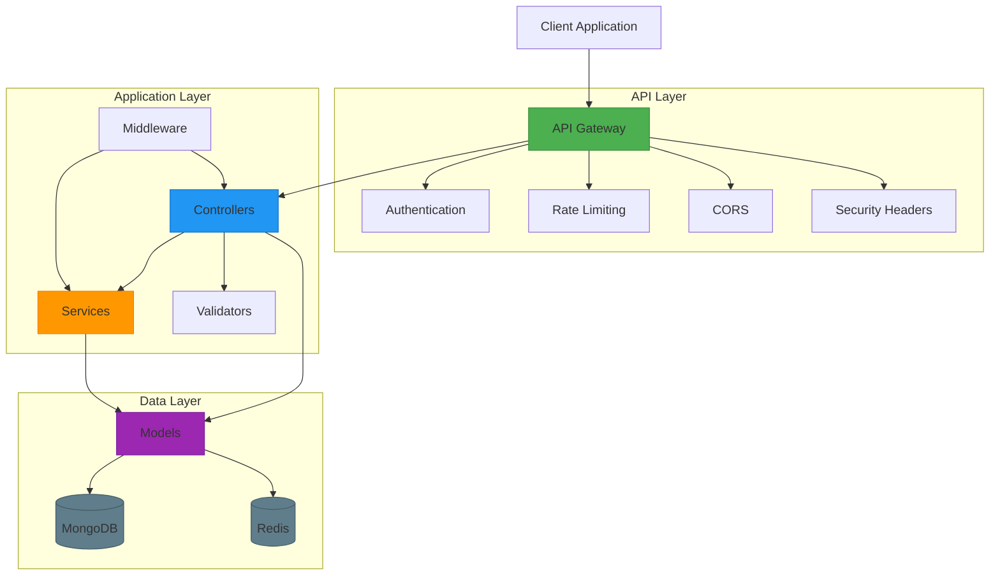
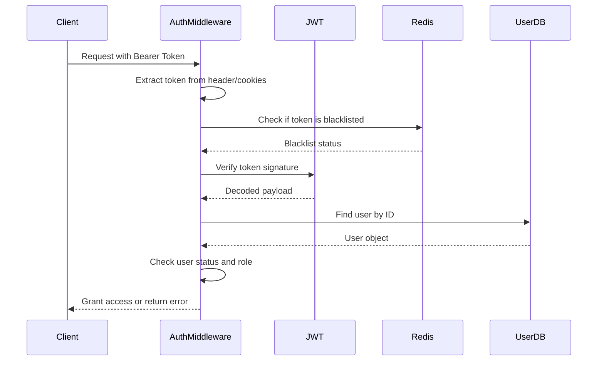

# Swarm Application Examples

<cite>
**Referenced Files in This Document**   
- [README.md](file://examples/05-swarm-apps/rest-api-advanced/README.md)
- [API.md](file://examples/05-swarm-apps/rest-api-advanced/docs/API.md)
- [server.js](file://examples/05-swarm-apps/rest-api-advanced/server.js)
- [database.js](file://examples/05-swarm-apps/rest-api-advanced/src/config/database.js)
- [redis.js](file://examples/05-swarm-apps/rest-api-advanced/src/config/redis.js)
- [auth.js](file://examples/05-swarm-apps/rest-api-advanced/src/middleware/auth.js)
- [User.js](file://examples/05-swarm-apps/rest-api-advanced/src/models/User.js)
</cite>

## Table of Contents
1. [Introduction](#introduction)
2. [Project Structure](#project-structure)
3. [Core Components](#core-components)
4. [Architecture Overview](#architecture-overview)
5. [Detailed Component Analysis](#detailed-component-analysis)
6. [Dependency Analysis](#dependency-analysis)
7. [Performance Considerations](#performance-considerations)
8. [Troubleshooting Guide](#troubleshooting-guide)
9. [Conclusion](#conclusion)

## Introduction

The Advanced REST API example demonstrates a full-stack application built with Claude-Flow, showcasing swarm intelligence principles in creating a production-ready e-commerce API. This comprehensive example illustrates how swarm coordination can be applied to build complex applications with proper architecture, routing, and data management. The application is built with Node.js, Express, MongoDB, and Redis, featuring JWT-based authentication, role-based access control, and comprehensive security measures. This documentation provides a detailed analysis of the implementation, highlighting the relationship between the application example and the underlying agent specialization system, code generation capabilities, and architectural planning features of Claude-Flow.

**Section sources**
- [README.md](file://examples/05-swarm-apps/rest-api-advanced/README.md#L1-L50)

## Project Structure

The Advanced REST API follows a well-organized, feature-based structure that promotes maintainability and scalability. The project is divided into logical components, each with a specific responsibility, demonstrating proper separation of concerns.



**Diagram sources**
- [server.js](file://examples/05-swarm-apps/rest-api-advanced/server.js#L1-L50)
- [README.md](file://examples/05-swarm-apps/rest-api-advanced/README.md#L100-L150)

**Section sources**
- [README.md](file://examples/05-swarm-apps/rest-api-advanced/README.md#L80-L150)

## Core Components

The Advanced REST API consists of several core components that work together to provide a robust and scalable application. These components demonstrate the agent specialization system within Claude-Flow, where different agents handle specific responsibilities such as authentication, data validation, and error handling.

### Server Initialization

The server.js file serves as the entry point for the application, orchestrating the initialization of various services and middleware. It demonstrates proper error handling and graceful shutdown procedures, which are critical for production applications.

```javascript
const express = require('express');
const mongoose = require('mongoose');
const helmet = require('helmet');
const cors = require('cors');
// ... other imports

const app = express();

// Security middleware
app.use(helmet());
app.use(cors(corsOptions));
app.use(compression());

// Body parsing middleware
app.use(express.json({ limit: '10mb' }));
app.use(express.urlencoded({ extended: true, limit: '10mb' }));

// Rate limiting
const limiter = rateLimit({
  windowMs: 15 * 60 * 1000,
  max: 100,
  message: 'Too many requests from this IP, please try again later.',
});

app.use('/api/', limiter);
```

This initialization process showcases the architectural planning capabilities of Claude-Flow, where security, performance, and reliability are considered from the outset. The use of middleware for security (helmet, cors), compression, and rate limiting demonstrates a comprehensive approach to building production-ready applications.

**Section sources**
- [server.js](file://examples/05-swarm-apps/rest-api-advanced/server.js#L1-L100)

### Database Configuration

The database.js file handles MongoDB connection with proper error handling and connection event management. This component illustrates the data management capabilities of the swarm application.

```javascript
const connectDB = async () => {
  try {
    const options = {
      useNewUrlParser: true,
      useUnifiedTopology: true,
      autoIndex: true,
      maxPoolSize: 10,
      serverSelectionTimeoutMS: 5000,
      socketTimeoutMS: 45000,
    };

    const conn = await mongoose.connect(process.env.MONGODB_URI, options);

    logger.info(`MongoDB Connected: ${conn.connection.host}`);

    // Handle connection events
    mongoose.connection.on('error', (err) => {
      logger.error('MongoDB connection error:', err);
    });

    mongoose.connection.on('disconnected', () => {
      logger.warn('MongoDB disconnected');
    });

    // Graceful shutdown
    process.on('SIGINT', async () => {
      await mongoose.connection.close();
      logger.info('MongoDB connection closed through app termination');
      process.exit(0);
    });
  } catch (error) {
    logger.error('MongoDB connection failed:', error);
    process.exit(1);
  }
};
```

The database configuration demonstrates proper connection pooling, error handling, and graceful shutdown procedures. The use of environment variables for configuration promotes flexibility across different deployment environments.

**Section sources**
- [database.js](file://examples/05-swarm-apps/rest-api-advanced/src/config/database.js#L1-L45)

### Redis Integration

The redis.js file provides Redis integration for caching and session management, enhancing application performance and enabling features like token blacklisting.

```javascript
const initializeRedis = async () => {
  try {
    redisClient = new Redis({
      host: process.env.REDIS_HOST || 'localhost',
      port: process.env.REDIS_PORT || 6379,
      password: process.env.REDIS_PASSWORD,
      db: process.env.REDIS_DB || 0,
      retryStrategy: (times) => {
        const delay = Math.min(times * 50, 2000);
        return delay;
      },
      reconnectOnError: (err) => {
        const targetError = 'READONLY';
        if (err.message.includes(targetError)) {
          return true;
        }
        return false;
      },
      maxRetriesPerRequest: 3,
      enableReadyCheck: true,
      enableOfflineQueue: true,
    });

    // Event handlers
    redisClient.on('connect', () => {
      logger.info('Redis connected');
    });

    redisClient.on('error', (err) => {
      logger.error('Redis error:', err);
    });

    // Test the connection
    await redisClient.ping();
    
    return redisClient;
  } catch (error) {
    logger.error('Redis initialization failed:', error);
    return null;
  }
};
```

The Redis integration demonstrates fault tolerance with retry strategies and error handling. The implementation allows the application to continue functioning even if Redis is unavailable, albeit without caching benefits.

**Section sources**
- [redis.js](file://examples/05-swarm-apps/rest-api-advanced/src/config/redis.js#L1-L80)

## Architecture Overview

The Advanced REST API follows a layered architecture that separates concerns and promotes maintainability. This architecture demonstrates how swarm intelligence can coordinate different components to create a cohesive application.



**Diagram sources**
- [server.js](file://examples/05-swarm-apps/rest-api-advanced/server.js#L1-L50)
- [README.md](file://examples/05-swarm-apps/rest-api-advanced/README.md#L150-L200)

**Section sources**
- [server.js](file://examples/05-swarm-apps/rest-api-advanced/server.js#L1-L50)
- [README.md](file://examples/05-swarm-apps/rest-api-advanced/README.md#L150-L200)

## Detailed Component Analysis

### Authentication System

The authentication system is a critical component of the Advanced REST API, demonstrating sophisticated security practices and proper session management.

#### Authentication Middleware

The auth.js middleware file implements JWT-based authentication with refresh tokens, token blacklisting, and role-based access control.



**Diagram sources**
- [auth.js](file://examples/05-swarm-apps/rest-api-advanced/src/middleware/auth.js#L1-L162)

**Section sources**
- [auth.js](file://examples/05-swarm-apps/rest-api-advanced/src/middleware/auth.js#L1-L162)

#### User Model

The User.js model defines the user schema with comprehensive validation, security features, and business logic.

```javascript
const userSchema = new mongoose.Schema({
  email: {
    type: String,
    required: [true, 'Email is required'],
    unique: true,
    lowercase: true,
    trim: true,
    match: [/^\w+([.-]?\w+)*@\w+([.-]?\w+)*(\.\w{2,3})+$/, 'Please provide a valid email'],
    index: true,
  },
  password: {
    type: String,
    required: [true, 'Password is required'],
    minlength: [6, 'Password must be at least 6 characters'],
    select: false,
  },
  name: {
    type: String,
    required: [true, 'Name is required'],
    trim: true,
    minlength: [2, 'Name must be at least 2 characters'],
    maxlength: [50, 'Name cannot exceed 50 characters'],
  },
  role: {
    type: String,
    enum: ['user', 'admin'],
    default: 'user',
  },
  // ... other fields
});
```

The User model includes several security features:
- Password hashing with bcrypt
- Account lockout after failed login attempts
- Email verification
- Password reset functionality
- Refresh token management
- Role-based access control

The pre-save middleware automatically hashes passwords before storing them in the database, ensuring that plain text passwords are never persisted.

```javascript
// Pre-save middleware to hash password
userSchema.pre('save', async function(next) {
  if (!this.isModified('password')) return next();
  
  try {
    const salt = await bcrypt.genSalt(parseInt(process.env.BCRYPT_SALT_ROUNDS) || 10);
    this.password = await bcrypt.hash(this.password, salt);
    next();
  } catch (error) {
    next(error);
  }
});
```

The model also includes methods for authentication operations:

```javascript
// Method to compare password
userSchema.methods.comparePassword = async function(candidatePassword) {
  return await bcrypt.compare(candidatePassword, this.password);
};

// Method to generate JWT token
userSchema.methods.generateAuthToken = function() {
  const token = jwt.sign(
    { 
      id: this._id,
      email: this.email,
      role: this.role,
    },
    process.env.JWT_SECRET,
    { 
      expiresIn: process.env.JWT_EXPIRE || '7d',
    }
  );
  return token;
};
```

These methods encapsulate authentication logic within the model, promoting code reuse and maintainability.

**Section sources**
- [User.js](file://examples/05-swarm-apps/rest-api-advanced/src/models/User.js#L1-L223)

### API Endpoint Structure

The API follows REST principles with well-defined endpoints for different resources. The routing structure demonstrates proper organization and separation of concerns.

```mermaid
graph TD
A[/api] --> B[/api/auth]
A --> C[/api/users]
A --> D[/api/products]
A --> E[/api/orders]
A --> F[/api/health]
B --> B1[POST /register]
B --> B2[POST /login]
B --> B3[POST /logout]
B --> B4[POST /refresh]
B --> B5[POST /forgot-password]
B --> B6[POST /reset-password]
B --> B7[GET /verify-email/:token]
B --> B8[POST /resend-verification]
B --> B9[GET /me]
C --> C1[GET /profile]
C --> C2[PUT /profile]
C --> C3[POST /avatar]
C --> C4[PUT /change-password]
D --> D1[GET /]
D --> D2[GET /:id]
D --> D3[POST /]
D --> D4[PUT /:id]
D --> D5[DELETE /:id]
D --> D6[POST /:id/images]
D --> D7[DELETE /:id/images/:imageId]
E --> E1[GET /]
E --> E2[GET /:id]
E --> E3[POST /]
E --> E4[DELETE /:id]
F --> F1[GET /]
F --> F2[GET /ready]
F --> F3[GET /live]
```

**Diagram sources**
- [README.md](file://examples/05-swarm-apps/rest-api-advanced/README.md#L300-L400)
- [API.md](file://examples/05-swarm-apps/rest-api-advanced/docs/API.md#L1-L100)

**Section sources**
- [README.md](file://examples/05-swarm-apps/rest-api-advanced/README.md#L300-L400)
- [API.md](file://examples/05-swarm-apps/rest-api-advanced/docs/API.md#L1-L100)

## Dependency Analysis

The Advanced REST API has a well-defined dependency structure that promotes modularity and maintainability.

```mermaid
graph TD
server.js --> express
server.js --> mongoose
server.js --> helmet
server.js --> cors
server.js --> compression
server.js --> rateLimit
server.js --> mongoSanitize
server.js --> xss
server.js --> hpp
server.js --> morgan
server.js --> swaggerUi
server.js --> swaggerJsdoc
server.js --> Redis
server.js --> logger
server.js --> errorHandler
server.js --> notFound
server.js --> connectDB
server.js --> initializeRedis
server.js --> authRoutes
server.js --> userRoutes
server.js --> productRoutes
server.js --> orderRoutes
server.js --> healthRoutes
authRoutes --> authController
authRoutes --> validate
authRoutes --> authMiddleware
userRoutes --> userController
userRoutes --> validate
userRoutes --> authMiddleware
productRoutes --> productController
productRoutes --> validate
productRoutes --> authMiddleware
orderRoutes --> orderController
orderRoutes --> validate
orderRoutes --> authMiddleware
healthRoutes --> healthController
authController --> authService
authController --> User
authController --> Token
userController --> userService
userController --> User
productController --> productService
productController --> Product
orderController --> orderService
orderController --> Order
authMiddleware --> User
authMiddleware --> Token
authMiddleware --> Redis
User --> mongoose
Product --> mongoose
Order --> mongoose
Token --> mongoose
style server.js fill:#FFD700,stroke:#DAA520
style express fill:#87CEEB,stroke:#4682B4
style mongoose fill:#98FB98,stroke:#3CB371
style Redis fill:#F08080,stroke:#DC143C
```



**Diagram sources**
- [server.js](file://examples/05-swarm-apps/rest-api-advanced/server.js#L1-L50)
- [package.json](file://examples/05-swarm-apps/rest-api-advanced/package.json#L1-L50)

**Section sources**
- [server.js](file://examples/05-swarm-apps/rest-api-advanced/server.js#L1-L50)
- [package.json](file://examples/05-swarm-apps/rest-api-advanced/package.json#L1-L50)

## Performance Considerations

The Advanced REST API incorporates several performance optimization strategies that are essential for production applications.

### Caching Strategy

The application uses Redis for caching frequently accessed data, reducing database load and improving response times.

```javascript
// Example of caching implementation
const getProducts = async (req, res, next) => {
  const cacheKey = `products:${req.query.page}:${req.query.limit}:${req.query.category}`;
  const redis = getRedisClient();
  
  if (redis) {
    try {
      const cachedData = await redis.get(cacheKey);
      if (cachedData) {
        return res.status(200).json(JSON.parse(cachedData));
      }
    } catch (error) {
      logger.warn('Redis get error:', error);
    }
  }
  
  // If not in cache, query database
  const products = await Product.find(filter)
    .limit(limit)
    .skip((page - 1) * limit)
    .sort(sortOptions);
  
  const response = {
    success: true,
    data: products,
    meta: {
      total,
      page,
      limit,
      totalPages,
      hasNextPage,
      hasPrevPage
    }
  };
  
  // Cache the response
  if (redis) {
    try {
      await redis.setex(cacheKey, 300, JSON.stringify(response)); // Cache for 5 minutes
    } catch (error) {
      logger.warn('Redis set error:', error);
    }
  }
  
  res.status(200).json(response);
};
```

### Database Optimization

The application implements several database optimization techniques:

1. **Indexing**: Strategic indexes on frequently queried fields
2. **Projection**: Selecting only necessary fields to reduce data transfer
3. **Pagination**: Limiting result sets to prevent large data transfers
4. **Lean queries**: Using Mongoose's lean() method for read-only operations

```javascript
// Example of optimized database query
const getUserOrders = async (userId, page = 1, limit = 20) => {
  const skip = (page - 1) * limit;
  
  // Use lean() for better performance when no document methods are needed
  const orders = await Order.find({ user: userId })
    .select('orderNumber totalAmount status createdAt')
    .sort({ createdAt: -1 })
    .skip(skip)
    .limit(limit)
    .lean();
    
  const total = await Order.countDocuments({ user: userId });
  
  return {
    orders,
    pagination: {
      page,
      limit,
      total,
      pages: Math.ceil(total / limit),
      hasNext: page < Math.ceil(total / limit),
      hasPrev: page > 1
    }
  };
};
```

### Rate Limiting

The application implements rate limiting to prevent abuse and ensure fair usage:

```javascript
// General rate limiting
const limiter = rateLimit({
  windowMs: 15 * 60 * 1000, // 15 minutes
  max: 100, // Limit each IP to 100 requests per windowMs
  message: 'Too many requests from this IP, please try again later.',
  standardHeaders: true,
  legacyHeaders: false,
});

// Stricter rate limiting for authentication endpoints
const authLimiter = rateLimit({
  windowMs: 15 * 60 * 1000, // 15 minutes
  max: 5, // Limit each IP to 5 auth requests per windowMs
  message: 'Too many authentication attempts, please try again later.',
  skipSuccessfulRequests: true,
});
```

### Compression

The application uses compression middleware to reduce response sizes:

```javascript
// Enable compression for all responses
app.use(compression());
```

These performance optimizations work together to create a responsive and scalable application that can handle high traffic loads while maintaining reliability.

**Section sources**
- [server.js](file://examples/05-swarm-apps/rest-api-advanced/server.js#L50-L100)
- [README.md](file://examples/05-swarm-apps/rest-api-advanced/README.md#L200-L250)

## Troubleshooting Guide

This section addresses common issues that may arise when working with the Advanced REST API and provides solutions.

### Common Issues and Solutions

#### Issue: Database Connection Failure
**Symptoms**: Application fails to start with "MongoDB connection failed" error
**Causes**: 
- MongoDB service not running
- Incorrect connection string
- Network connectivity issues
- Authentication credentials incorrect

**Solutions**:
1. Ensure MongoDB service is running:
   ```bash
   docker-compose up -d mongodb
   ```
2. Verify connection string in .env file:
   ```env
   MONGODB_URI=mongodb://localhost:27017/rest-api-advanced
   ```
3. Check MongoDB logs for authentication errors
4. Test connection with MongoDB client

#### Issue: Redis Connection Problems
**Symptoms**: "Redis initialization failed" warnings in logs
**Causes**:
- Redis service not running
- Incorrect Redis configuration
- Network connectivity issues

**Solutions**:
1. Start Redis service:
   ```bash
   docker-compose up -d redis
   ```
2. Verify Redis configuration in .env file:
   ```env
   REDIS_HOST=localhost
   REDIS_PORT=6379
   ```
3. Test Redis connection:
   ```bash
   redis-cli ping
   ```

#### Issue: Authentication Token Errors
**Symptoms**: "Invalid token" or "Token expired" errors
**Causes**:
- JWT secret mismatch
- Token expiration
- Token blacklisting
- Clock skew between servers

**Solutions**:
1. Ensure JWT_SECRET is consistent across all instances
2. Implement token refresh mechanism
3. Check system clock synchronization
4. Verify token blacklisting implementation

#### Issue: Rate Limiting Blocking Requests
**Symptoms**: "Too many requests from this IP" errors
**Causes**:
- Exceeding rate limit thresholds
- Testing from same IP address

**Solutions**:
1. Adjust rate limiting settings in development:
   ```javascript
   const limiter = rateLimit({
     windowMs: 15 * 60 * 1000,
     max: 1000, // Increase limit for development
   });
   ```
2. Use different IP addresses for testing
3. Implement retry logic with exponential backoff

#### Issue: CORS Errors
**Symptoms**: "Cross-Origin Request Blocked" in browser console
**Causes**:
- Origin not in allowed list
- Credentials not properly configured

**Solutions**:
1. Update ALLOWED_ORIGINS in .env file:
   ```env
   ALLOWED_ORIGINS=http://localhost:3000,http://localhost:3001
   ```
2. Ensure credentials are properly handled in client requests
3. Verify CORS configuration in server.js

### Debugging Tips

1. **Enable verbose logging**: Set NODE_ENV=development to see detailed logs
2. **Use Swagger UI**: Test endpoints interactively at /api-docs
3. **Check request IDs**: Each request has a unique ID for tracing
4. **Monitor Redis**: Use redis-cli to inspect cache and blacklist entries
5. **Database inspection**: Use MongoDB client to verify data integrity

### Production Monitoring

For production deployments, implement the following monitoring practices:

1. **Health checks**: Regularly call /api/health endpoints
2. **Log aggregation**: Use tools like ELK stack or Splunk
3. **Performance monitoring**: Track response times and error rates
4. **Alerting**: Set up alerts for critical failures
5. **Backup verification**: Regularly test database backups

**Section sources**
- [README.md](file://examples/05-swarm-apps/rest-api-advanced/README.md#L400-L500)
- [server.js](file://examples/05-swarm-apps/rest-api-advanced/server.js#L200-L243)

## Conclusion

The Advanced REST API example demonstrates how Claude-Flow can be used to create sophisticated, production-ready applications through swarm intelligence principles. By coordinating specialized agents for different aspects of application development—authentication, data modeling, API design, and performance optimization—the system produces a cohesive and robust application.

Key takeaways from this example include:

1. **Architectural Planning**: The application follows a clean, layered architecture with proper separation of concerns, demonstrating how swarm coordination can create well-structured applications.

2. **Security Best Practices**: Comprehensive security measures including JWT authentication, rate limiting, input validation, and account lockout show how the system prioritizes security.

3. **Performance Optimization**: The integration of Redis caching, database indexing, and compression illustrates the system's ability to optimize for performance.

4. **Error Handling**: Centralized error handling with meaningful error messages and proper HTTP status codes demonstrate robust error management.

5. **Scalability Patterns**: The modular structure and use of environment variables make the application easily deployable across different environments.

6. **Developer Experience**: Features like Swagger documentation, comprehensive logging, and easy setup scripts enhance developer productivity.

This example serves as a template for building full-stack applications with Claude-Flow, showing how swarm intelligence can coordinate different specialized agents to create complex applications with proper architecture, routing, and data management. The principles demonstrated here can be applied to build other types of applications, from microservices to full-stack web applications.