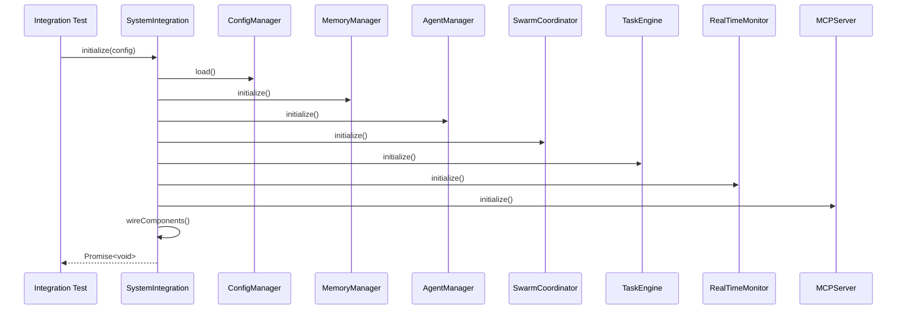
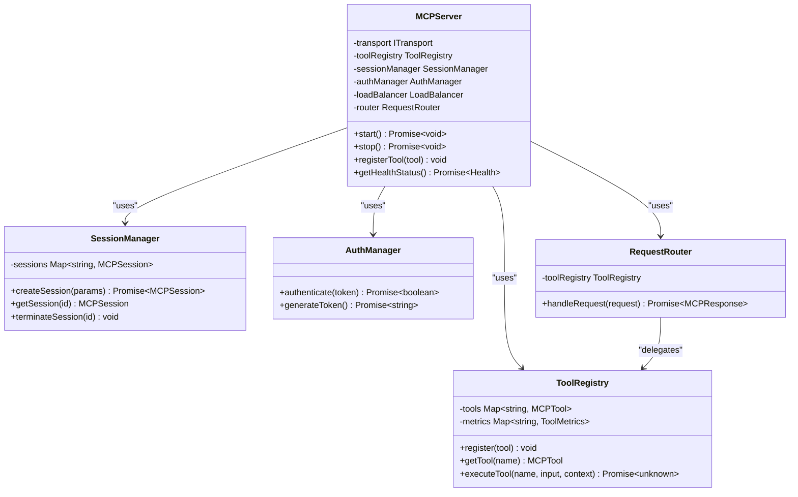
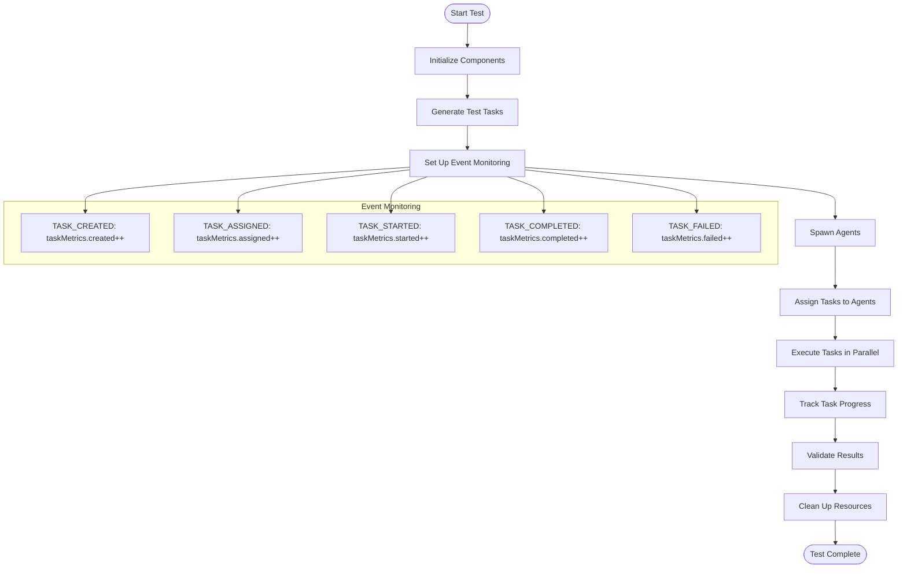

# Integration Testing Examples

<cite>
**Referenced Files in This Document**   
- [system-integration.test.ts](file://tests/integration/system-integration.test.ts#L0-L280)
- [mcp.test.ts](file://tests/integration/mcp.test.ts#L0-L579)
- [batch-task-test.ts](file://tests/integration/batch-task-test.ts#L0-L442)
- [system-integration.ts](file://src/integration/system-integration.ts#L17-L518)
- [server.ts](file://src/mcp/server.ts#L0-L647)
- [orchestrator.ts](file://src/core/orchestrator.ts#L0-L1314)
- [tools.ts](file://src/mcp/tools.ts#L0-L553)
</cite>

## Table of Contents
1. [Introduction](#introduction)
2. [Workflow Execution Tests](#workflow-execution-tests)
3. [Component Coordination Validation](#component-coordination-validation)
4. [End-to-End Scenario Verification](#end-to-end-scenario-verification)
5. [Orchestration Framework Integration](#orchestration-framework-integration)
6. [Common Integration Issues](#common-integration-issues)
7. [Best Practices for Integration Testing](#best-practices-for-integration-testing)

## Introduction
This document provides comprehensive examples of integration testing in Claude-Flow applications, focusing on how multiple components interact within the system. The integration tests validate the coordination between agents, memory systems, command processors, and other core components that make up the agentic workflow. These tests ensure that the system functions correctly as a whole, rather than just verifying individual components in isolation.

The integration testing approach in Claude-Flow emphasizes end-to-end validation of complex workflows, including swarm initialization, task processing pipelines, and state persistence across system components. By testing the interactions between components, these tests identify issues that might not be apparent when testing components individually, such as timing dependencies, resource contention, and cross-component error handling.

**Section sources**
- [system-integration.test.ts](file://tests/integration/system-integration.test.ts#L0-L280)
- [mcp.test.ts](file://tests/integration/mcp.test.ts#L0-L579)

## Workflow Execution Tests

### System Initialization Testing
The integration tests validate the complete workflow of system initialization, ensuring that all components are properly initialized in the correct order and that dependencies are correctly established. The `SystemIntegration` class orchestrates the initialization of core components including the orchestrator, configuration manager, memory manager, agent manager, swarm coordinator, task engine, monitor, and MCP server.



**Diagram sources**
- [system-integration.test.ts](file://tests/integration/system-integration.test.ts#L0-L280)
- [system-integration.ts](file://src/integration/system-integration.ts#L17-L518)

**Section sources**
- [system-integration.test.ts](file://tests/integration/system-integration.test.ts#L0-L280)
- [system-integration.ts](file://src/integration/system-integration.ts#L17-L518)

The system initialization test verifies that all components are initialized in the correct sequence and that the system reports proper initialization status. The test confirms that the system can handle initialization errors gracefully and prevents reinitialization when already initialized.

```typescript
it('should initialize all components in correct order', async () => {
  const config: IntegrationConfig = {
    logLevel: 'info',
    environment: 'testing'
  };

  await systemIntegration.initialize(config);
  
  expect(systemIntegration.isReady()).toBe(true);
  
  // Verify initialization status
  const status = systemIntegration.getInitializationStatus();
  expect(status.initialized).toBe(true);
  expect(status.components).toContain('config');
  expect(status.components).toContain('orchestrator');
  expect(status.components).toContain('memory');
  expect(status.components).toContain('agents');
  expect(status.components).toContain('swarm');
  expect(status.components).toContain('tasks');
  expect(status.components).toContain('monitor');
  expect(status.components).toContain('mcp');
});
```

## Component Coordination Validation

### Message Control Protocol Integration
The MCP (Model Context Protocol) integration tests validate the interaction between the MCP server and other system components, including the orchestrator, agent manager, swarm coordinator, task engine, and memory manager. The MCP server acts as a central communication hub, enabling different components to exchange messages and coordinate their activities.



**Diagram sources**
- [server.ts](file://src/mcp/server.ts#L0-L647)
- [tools.ts](file://src/mcp/tools.ts#L0-L553)

**Section sources**
- [mcp.test.ts](file://tests/integration/mcp.test.ts#L0-L579)
- [server.ts](file://src/mcp/server.ts#L0-L647)

The MCP integration tests use a mock orchestrator to simulate the behavior of the actual orchestrator component, allowing the tests to focus on the MCP server's functionality without requiring the entire system to be running. The mock orchestrator implements key methods for agent management, task creation, memory operations, and system status queries.

```typescript
class MockOrchestrator {
  private agents = new Map();
  private tasks = new Map();
  private memory = new Map();
  private idCounter = 1;

  async spawnAgent(profile: any): Promise<string> {
    const sessionId = `session_${this.idCounter++}`;
    this.agents.set(profile.id, { ...profile, sessionId, status: 'active' });
    return sessionId;
  }

  async createTask(task: any): Promise<string> {
    const taskId = `task_${this.idCounter++}`;
    this.tasks.set(taskId, { ...task, id: taskId });
    return taskId;
  }

  async queryMemory(query: any): Promise<any[]> {
    let entries = Array.from(this.memory.values());
    
    if (query.agentId) {
      entries = entries.filter(entry => entry.agentId === query.agentId);
    }
    if (query.type) {
      entries = entries.filter(entry => entry.type === query.type);
    }
    
    return entries.slice(query.offset || 0, (query.offset || 0) + (query.limit || 50));
  }
}
```

## End-to-End Scenario Verification

### Batch Task Processing Workflow
The batch task integration test demonstrates a comprehensive end-to-end scenario that validates the coordination between multiple components in a parallel batch processing workflow. This test covers task creation and queuing, agent spawning and assignment, parallel task execution, batch tool usage, task completion tracking, and system coordination.



**Diagram sources**
- [batch-task-test.ts](file://tests/integration/batch-task-test.ts#L0-L442)

**Section sources**
- [batch-task-test.ts](file://tests/integration/batch-task-test.ts#L0-L442)

The batch task test initializes all core components with specific test configurations, including orchestrator settings, memory configuration, terminal settings, coordination parameters, and MCP configuration. It then generates a set of test tasks with varying types, priorities, and dependencies to simulate realistic workloads.

```typescript
function generateTestTasks(count: number): Task[] {
  const tasks: Task[] = [];
  const taskTypes = ['research', 'implement', 'test', 'analyze', 'document'];
  
  for (let i = 0; i < count; i++) {
    const type = taskTypes[i % taskTypes.length];
    const hasDependency = i > 5 && Math.random() > 0.5;
    
    const task: Task = {
      id: `task-${i + 1}`,
      type,
      description: `${type} task ${i + 1}: Perform ${type} operation on dataset ${i + 1}`,
      priority: Math.floor(Math.random() * 100),
      dependencies: hasDependency ? [`task-${Math.max(1, i - Math.floor(Math.random() * 5))}`] : [],
      status: 'pending',
      input: {
        datasetId: `dataset-${i + 1}`,
        parameters: {
          complexity: Math.random() > 0.5 ? 'high' : 'low',
          urgent: Math.random() > 0.8,
        },
      },
      createdAt: new Date(),
      metadata: {
        batchId: Math.floor(i / 5),
        requiredCapabilities: getRequiredCapabilities(type),
      },
    };
    
    tasks.push(task);
  }
  
  return tasks;
}
```

## Orchestration Framework Integration

### Component Wiring and Event Handling
The integration tests validate the proper wiring of components within the orchestration framework, ensuring that all components can communicate effectively through the event bus and that cross-component dependencies are correctly established. The SystemIntegration class handles the wiring of components during initialization, connecting the orchestrator to agents, the swarm coordinator to agents and tasks, the monitor to all components, and the MCP server to core components.

```mermaid
graph TB
subgraph "Core Components"
Orchestrator[Orchestrator]
ConfigManager[ConfigManager]
MemoryManager[MemoryManager]
AgentManager[AgentManager]
SwarmCoordinator[SwarmCoordinator]
TaskEngine[TaskEngine]
Monitor[RealTimeMonitor]
MCPServer[MCPServer]
EventBus[EventBus]
end
Orchestrator --> AgentManager : "setAgentManager"
AgentManager --> Orchestrator : "setOrchestrator"
SwarmCoordinator --> AgentManager : "setAgentManager"
SwarmCoordinator --> TaskEngine : "setTaskEngine"
TaskEngine --> SwarmCoordinator : "setSwarmCoordinator"
Monitor --> Orchestrator : "attachToOrchestrator"
Monitor --> AgentManager : "attachToAgentManager"
Monitor --> SwarmCoordinator : "attachToSwarmCoordinator"
Monitor --> TaskEngine : "attachToTaskEngine"
MCPServer --> Orchestrator : "attachToOrchestrator"
MCPServer --> AgentManager : "attachToAgentManager"
MCPServer --> SwarmCoordinator : "attachToSwarmCoordinator"
MCPServer --> TaskEngine : "attachToTaskEngine"
MCPServer --> MemoryManager : "attachToMemoryManager"
EventBus --> All[All Components] : "event communication"
```

**Diagram sources**
- [system-integration.ts](file://src/integration/system-integration.ts#L17-L518)

**Section sources**
- [system-integration.ts](file://src/integration/system-integration.ts#L17-L518)
- [orchestrator.ts](file://src/core/orchestrator.ts#L0-L1314)

The event handling system is a critical part of the orchestration framework, enabling components to communicate asynchronously and react to system events. The integration tests verify that the system properly handles various events, including system ready events, component status updates, and system errors.

```typescript
private setupEventHandlers(): void {
  // System health monitoring
  this.eventBus.on('component:status', (event) => {
    this.updateComponentStatus(event.component, event.status, event.message);
  });

  // Error handling
  this.eventBus.on('system:error', (event) => {
    this.logger.error(`System Error in ${event.component}:`, event.error);
    this.updateComponentStatus(event.component, 'unhealthy', event.error.message);
  });

  // Performance monitoring
  this.eventBus.on('performance:metric', (event) => {
    this.logger.debug(`Performance Metric: ${event.metric} = ${event.value}`);
  });
}
```

## Common Integration Issues

### Timing Dependencies and Resource Contention
Integration tests in Claude-Flow address common issues such as timing dependencies and resource contention that can arise when multiple components interact simultaneously. The tests use various strategies to handle these issues, including proper initialization sequencing, component status tracking, and graceful error handling.

The system integration test demonstrates how timing dependencies are managed by initializing components in a specific order (core infrastructure, memory and configuration, agents and coordination, task management, monitoring and MCP) and by using asynchronous initialization with proper error handling.

```typescript
async initialize(config?: IntegrationConfig): Promise<void> {
  if (this.initialized) {
    this.logger.warn('System already initialized');
    return;
  }

  this.logger.info('🚀 Starting Claude Flow v2.0.0 System Integration');

  try {
    // Phase 1: Core Infrastructure
    await this.initializeCore(config);

    // Phase 2: Memory and Configuration
    await this.initializeMemoryAndConfig();

    // Phase 3: Agents and Coordination
    await this.initializeAgentsAndCoordination();

    // Phase 4: Task Management
    await this.initializeTaskManagement();

    // Phase 5: Monitoring and MCP
    await this.initializeMonitoringAndMcp();

    // Phase 6: Cross-component wiring
    await this.wireComponents();

    this.initialized = true;
    this.logger.info('✅ Claude Flow v2.0.0 System Integration Complete');
  } catch (error) {
    this.logger.error('❌ System Integration Failed:', getErrorMessage(error));
    throw error;
  }
}
```

Resource contention is addressed through the use of proper component lifecycle management, including graceful shutdown procedures that clean up resources in reverse order of initialization. The integration tests verify that components can be properly shut down without leaving orphaned resources or causing system instability.

```typescript
async shutdown(): Promise<void> {
  this.logger.info('🛑 Shutting down Claude Flow v2.0.0');

  // Shutdown in reverse order
  if (this.mcpServer) {
    await this.mcpServer.shutdown();
  }

  if (this.monitor) {
    await this.monitor.shutdown();
  }

  if (this.taskEngine) {
    await this.taskEngine.shutdown();
  }

  if (this.swarmCoordinator) {
    await this.swarmCoordinator.shutdown();
  }

  if (this.agentManager) {
    await this.agentManager.shutdown();
  }

  if (this.memoryManager) {
    await this.memoryManager.shutdown();
  }

  if (this.orchestrator) {
    await this.orchestrator.shutdown();
  }

  this.initialized = false;
  this.logger.info('✅ Claude Flow v2.0.0 Shutdown Complete');
}
```

## Best Practices for Integration Testing

### Test Environment Management
Effective integration testing in Claude-Flow requires careful management of test environments to ensure reliable and repeatable test execution. The best practices include using isolated test configurations, in-memory databases for testing, random ports for network services, and proper cleanup of resources after tests.

The batch task test demonstrates these best practices by using an in-memory SQLite database for memory storage and a random port for the MCP server:

```typescript
const testConfig: Config = {
  memory: {
    defaultBackend: 'sqlite',
    backends: {
      sqlite: {
        type: 'sqlite',
        path: ':memory:', // Use in-memory DB for tests
      },
    },
    cacheSize: 1000,
    cacheTTL: 300000,
  },
  mcp: {
    serverPort: 0, // Use random port for test
    maxConnections: 50,
    authRequired: false,
    enabledTransports: ['stdio'],
  },
};
```

### Cross-Component Error Handling
Robust integration tests must address cross-component error handling to ensure that the system can gracefully handle failures in any component. The tests verify that errors are properly propagated, logged, and handled without causing cascading failures.

The system integration test includes a test case for handling initialization errors gracefully:

```typescript
it('should handle initialization errors gracefully', async () => {
  // Mock a component to fail initialization
  const mockOrchestrator = {
    initialize: jest.fn().mockRejectedValue(new Error('Orchestrator init failed'))
  };

  await expect(systemIntegration.initialize()).rejects.toThrow('Orchestrator init failed');
  expect(systemIntegration.isReady()).toBe(false);
});
```

### Reliable Test Execution
To ensure reliable test execution across different deployment scenarios, the integration tests use consistent patterns for setup and teardown, proper use of asynchronous operations, and comprehensive error handling. The tests also include health monitoring and status verification to confirm that the system is in the expected state before and after each test.

The MCP integration test demonstrates reliable test execution with proper setup and teardown:

```typescript
beforeEach(async () => {
  logger = new Logger();
  await logger.configure({
    level: 'debug',
    format: 'text',
    destination: 'console',
  });

  eventBus = new EventBus(logger);
  mockOrchestrator = new MockOrchestrator();
});

afterEach(async () => {
  if (server) {
    await server.stop();
  }
});
```

These practices ensure that integration tests are reliable, maintainable, and effective at catching issues in the interaction between components in Claude-Flow applications.

**Section sources**
- [system-integration.test.ts](file://tests/integration/system-integration.test.ts#L0-L280)
- [mcp.test.ts](file://tests/integration/mcp.test.ts#L0-L579)
- [batch-task-test.ts](file://tests/integration/batch-task-test.ts#L0-L442)