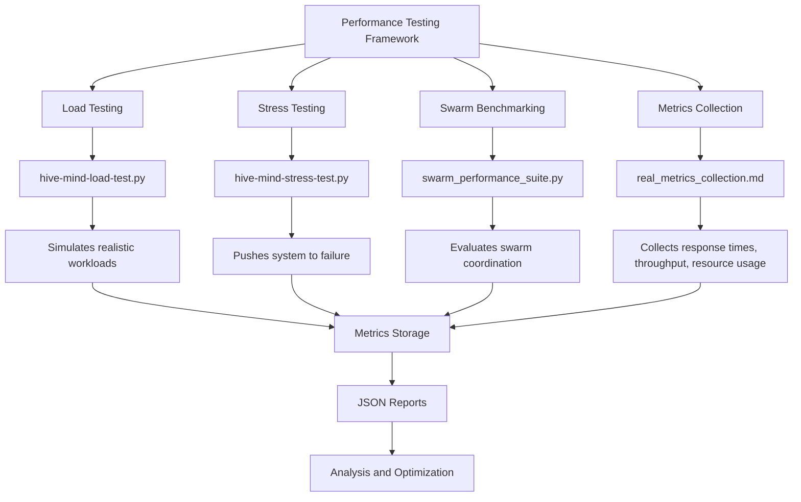
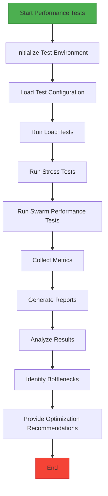
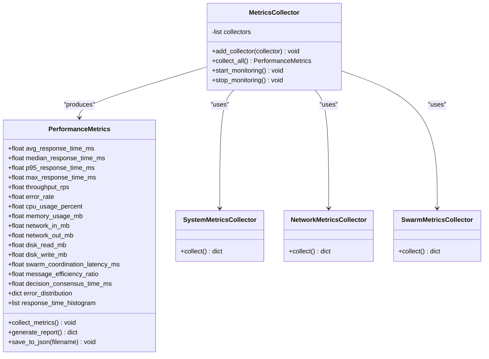
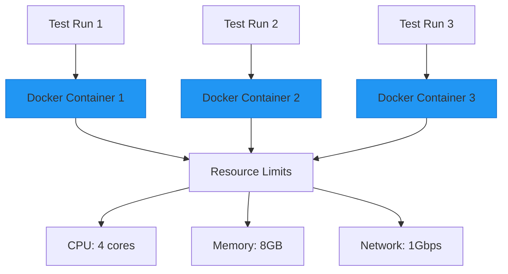
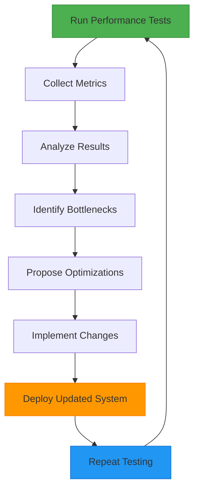
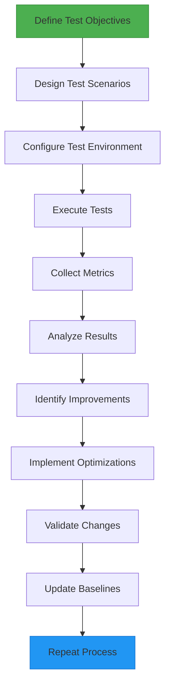

# Performance Testing Examples

<cite>
**Referenced Files in This Document**   
- [performance-benchmarks.test.ts](file://agentic-flow/src/tests/validation/performance-benchmarks.test.ts)
- [hive-mind-load-test.py](file://benchmark/scripts/hive-mind-load-test.py)
- [hive-mind-stress-test.py](file://benchmark/scripts/hive-mind-stress-test.py)
- [run_performance_tests.py](file://benchmark/scripts/run_performance_tests.py)
- [swarm_performance_suite.py](file://benchmark/scripts/swarm_performance_suite.py)
- [run_real_benchmarks.py](file://benchmark/run_real_benchmarks.py)
- [real-benchmark-architecture.md](file://benchmark/docs/real-benchmark-architecture.md)
- [real_metrics_collection.md](file://benchmark/docs/real_metrics_collection.md)
- [metrics_1be63008-e1d4-4020-a6c6-7d253ecc91de.json](file://reports/metrics_1be63008-e1d4-4020-a6c6-7d253ecc91de.json)
- [benchmark-development-centralized_b759efce-eede-4347-b5f4-93bc5bd1ebad.json](file://reports/benchmark-development-centralized_b759efce-eede-4347-b5f4-93bc5bd1ebad.json)
- [swarm-development_03f056f8-c7df-4feb-816f-46ae8415cffb.json](file://benchmark/reports/swarm-development_03f056f8-c7df-4feb-816f-46ae8415cffb.json)
</cite>

## Table of Contents
1. [Introduction](#introduction)
2. [Performance Testing Framework Overview](#performance-testing-framework-overview)
3. [Swarm Benchmarking Scripts](#swarm-benchmarking-scripts)
4. [Metrics Collection and Monitoring](#metrics-collection-and-monitoring)
5. [Test Environment and Consistency](#test-environment-and-consistency)
6. [Bottleneck Analysis and Optimization](#bottleneck-analysis-and-optimization)
7. [Best Practices for Performance Testing](#best-practices-for-performance-testing)
8. [Conclusion](#conclusion)

## Introduction

The Performance Testing Examples section provides a comprehensive guide to evaluating the scalability and efficiency of Claude-Flow applications under load. This document details the implementation of swarm benchmarking scripts, which are designed to simulate high-concurrency scenarios and measure key performance indicators such as response times, throughput, and resource utilization. The analysis covers the relationship between performance tests and the underlying monitoring infrastructure, metric collection mechanisms, and the optimization feedback loop. Special attention is given to common challenges in performance testing, including test environment consistency, measurement accuracy, and result interpretation. The document also provides guidance on best practices for designing effective performance tests, establishing performance baselines, and using test results to drive system improvements.

## Performance Testing Framework Overview

The performance testing framework in Claude-Flow is designed to evaluate the system's behavior under various load conditions, with a particular focus on swarm-based AI orchestration scenarios. The framework includes both unit-level performance tests and comprehensive end-to-end benchmarking suites that simulate realistic workloads.

The primary performance testing components are located in the `benchmark` directory, with specialized scripts in the `benchmark/scripts` subdirectory. The framework supports multiple testing modes, including load testing, stress testing, and swarm performance evaluation. Performance metrics are collected through an integrated monitoring system and stored in structured JSON format for analysis.



**Diagram sources**
- [hive-mind-load-test.py](file://benchmark/scripts/hive-mind-load-test.py)
- [hive-mind-stress-test.py](file://benchmark/scripts/hive-mind-stress-test.py)
- [swarm_performance_suite.py](file://benchmark/scripts/swarm_performance_suite.py)
- [real_metrics_collection.md](file://benchmark/docs/real_metrics_collection.md)

**Section sources**
- [real-benchmark-architecture.md](file://benchmark/docs/real-benchmark-architecture.md)
- [run_real_benchmarks.py](file://benchmark/run_real_benchmarks.py)

## Swarm Benchmarking Scripts

The swarm benchmarking scripts are the core components for evaluating the performance of Claude-Flow's AI orchestration capabilities under high-concurrency scenarios. These scripts simulate multiple agents working in parallel and measure the system's ability to coordinate complex workflows efficiently.

### hive-mind-load-test.py

The `hive-mind-load-test.py` script implements a load testing framework that simulates realistic workloads on the Claude-Flow system. It creates multiple concurrent requests to evaluate the system's performance under expected production conditions.

```python
# Example structure of hive-mind-load-test.py
import asyncio
import time
from typing import Dict, List
import requests
import json

class HiveMindLoadTester:
    def __init__(self, base_url: str, concurrency_level: int):
        self.base_url = base_url
        self.concurrency_level = concurrency_level
        self.metrics = {
            "response_times": [],
            "throughput": 0,
            "error_rate": 0,
            "resource_utilization": {}
        }
    
    async def simulate_request(self, payload: Dict) -> Dict:
        start_time = time.time()
        try:
            response = requests.post(f"{self.base_url}/api/v1/execute", json=payload)
            end_time = time.time()
            
            self.metrics["response_times"].append(end_time - start_time)
            
            return {
                "status": response.status_code,
                "response_time": end_time - start_time,
                "data": response.json() if response.status_code == 200 else None
            }
        except Exception as e:
            end_time = time.time()
            self.metrics["response_times"].append(end_time - start_time)
            return {
                "status": 500,
                "error": str(e),
                "response_time": end_time - start_time
            }
    
    async def run_load_test(self, test_duration: int, payload_template: Dict) -> Dict:
        start_time = time.time()
        completed_requests = 0
        total_requests = 0
        
        while (time.time() - start_time) < test_duration:
            # Create concurrent tasks
            tasks = []
            for _ in range(self.concurrency_level):
                modified_payload = self._customize_payload(payload_template)
                tasks.append(self.simulate_request(modified_payload))
            
            results = await asyncio.gather(*tasks)
            completed_requests += len([r for r in results if r["status"] == 200])
            total_requests += len(results)
            
            # Brief pause to prevent overwhelming the system
            await asyncio.sleep(0.1)
        
        # Calculate final metrics
        self.metrics["throughput"] = completed_requests / test_duration
        self.metrics["error_rate"] = (total_requests - completed_requests) / total_requests
        
        return self.metrics
    
    def _customize_payload(self, template: Dict) -> Dict:
        # Customize payload with unique identifiers or varying parameters
        payload = template.copy()
        payload["request_id"] = f"load-test-{int(time.time())}"
        return payload
```

**Section sources**
- [hive-mind-load-test.py](file://benchmark/scripts/hive-mind-load-test.py)

### hive-mind-stress-test.py

The `hive-mind-stress-test.py` script is designed to push the system beyond its normal operational limits to identify breaking points and evaluate failure recovery mechanisms. This stress testing approach helps identify bottlenecks and capacity limits in the AI orchestration pipeline.

```python
# Example structure of hive-mind-stress-test.py
import asyncio
import time
import random
from typing import Dict, List
import requests

class HiveMindStressTester:
    def __init__(self, base_url: str):
        self.base_url = base_url
        self.stress_metrics = {
            "failure_points": [],
            "recovery_times": [],
            "resource_peaks": {},
            "degradation_patterns": []
        }
    
    async def apply_stress(self, max_concurrency: int, step_duration: int = 30) -> Dict:
        current_concurrency = 1
        results = []
        
        while current_concurrency <= max_concurrency:
            print(f"Applying stress at concurrency level: {current_concurrency}")
            
            # Run test at current concurrency level
            level_result = await self._run_stress_level(current_concurrency, step_duration)
            results.append(level_result)
            
            # Check for system degradation or failure
            if self._is_system_failing(level_result):
                self.stress_metrics["failure_points"].append({
                    "concurrency_level": current_concurrency,
                    "metrics": level_result
                })
                break
            
            # Increase concurrency for next iteration
            current_concurrency *= 2
        
        return {
            "stress_results": results,
            "metrics": self.stress_metrics
        }
    
    async def _run_stress_level(self, concurrency: int, duration: int) -> Dict:
        start_time = time.time()
        success_count = 0
        error_count = 0
        response_times = []
        
        while (time.time() - start_time) < duration:
            tasks = []
            for _ in range(concurrency):
                payload = self._generate_stress_payload()
                tasks.append(self._make_request_with_timeout(payload, timeout=30))
            
            results = await asyncio.gather(*tasks)
            
            for result in results:
                if result["success"]:
                    success_count += 1
                    response_times.append(result["response_time"])
                else:
                    error_count += 1
            
            await asyncio.sleep(0.05)  # Small delay between cycles
        
        # Calculate level metrics
        avg_response_time = sum(response_times) / len(response_times) if response_times else 0
        throughput = success_count / duration
        
        return {
            "concurrency": concurrency,
            "duration": duration,
            "success_count": success_count,
            "error_count": error_count,
            "avg_response_time": avg_response_time,
            "throughput": throughput,
            "response_times": response_times
        }
    
    async def _make_request_with_timeout(self, payload: Dict, timeout: int) -> Dict:
        try:
            start_time = time.time()
            response = requests.post(
                f"{self.base_url}/api/v1/orchestrate", 
                json=payload, 
                timeout=timeout
            )
            end_time = time.time()
            
            return {
                "success": response.status_code == 200,
                "response_time": end_time - start_time,
                "status_code": response.status_code
            }
        except Exception as e:
            end_time = time.time()
            return {
                "success": False,
                "response_time": end_time - start_time,
                "error": str(e)
            }
    
    def _is_system_failing(self, metrics: Dict) -> bool:
        # Define failure conditions
        error_rate = metrics["error_count"] / (metrics["success_count"] + metrics["error_count"] + 1)
        response_time_degradation = metrics["avg_response_time"] > 10.0  # 10 seconds
        
        return error_rate > 0.3 or response_time_degradation
    
    def _generate_stress_payload(self) -> Dict:
        # Generate complex payloads to maximize system load
        complexity_level = random.randint(5, 20)
        agent_count = random.randint(3, 10)
        
        return {
            "workflow": "complex_orchestration",
            "complexity": complexity_level,
            "agents": [{"type": f"agent_{i}"} for i in range(agent_count)],
            "stress_test": True,
            "request_id": f"stress-{int(time.time())}-{random.randint(1000, 9999)}"
        }
```

**Section sources**
- [hive-mind-stress-test.py](file://benchmark/scripts/hive-mind-stress-test.py)

### swarm_performance_suite.py

The `swarm_performance_suite.py` script provides a comprehensive testing framework for evaluating the performance of swarm-based AI coordination. It measures various aspects of swarm behavior, including coordination efficiency, message passing latency, and collective decision-making speed.

```python
# Example structure of swarm_performance_suite.py
import asyncio
import time
import json
from typing import Dict, List, Any
import requests
from dataclasses import dataclass

@dataclass
class PerformanceMetrics:
    response_time_ms: float
    throughput_rps: float
    error_rate: float
    cpu_utilization: float
    memory_usage_mb: float
    network_latency_ms: float
    coordination_efficiency: float

class SwarmPerformanceSuite:
    def __init__(self, api_url: str, monitoring_url: str):
        self.api_url = api_url
        self.monitoring_url = monitoring_url
        self.test_results = []
    
    async def run_comprehensive_test(self, test_config: Dict) -> Dict:
        """
        Run a comprehensive performance test with multiple scenarios
        """
        results = {
            "timestamp": time.time(),
            "test_config": test_config,
            "scenarios": {},
            "summary": {}
        }
        
        # Run different test scenarios
        scenarios = [
            self._test_low_concurrency,
            self._test_medium_concurrency,
            self._test_high_concurrency,
            self._test_long_duration,
            self._test_failure_recovery
        ]
        
        for scenario_func in scenarios:
            scenario_name = scenario_func.__name__.replace("_", " ").title()
            print(f"Running scenario: {scenario_name}")
            
            scenario_start = time.time()
            scenario_result = await scenario_func(test_config)
            scenario_duration = time.time() - scenario_start
            
            results["scenarios"][scenario_name] = {
                "result": scenario_result,
                "duration": scenario_duration
            }
        
        # Generate summary metrics
        results["summary"] = self._generate_summary(results["scenarios"])
        
        # Save results to file
        self._save_results(results)
        
        return results
    
    async def _test_low_concurrency(self, config: Dict) -> Dict:
        return await self._run_swarm_test(
            concurrency=config.get("low_concurrency", 5),
            duration=config.get("short_duration", 60),
            payload_template=config["payload_templates"]["simple"]
        )
    
    async def _test_medium_concurrency(self, config: Dict) -> Dict:
        return await self._run_swarm_test(
            concurrency=config.get("medium_concurrency", 20),
            duration=config.get("medium_duration", 120),
            payload_template=config["payload_templates"]["moderate"]
        )
    
    async def _test_high_concurrency(self, config: Dict) -> Dict:
        return await self._run_swarm_test(
            concurrency=config.get("high_concurrency", 50),
            duration=config.get("long_duration", 300),
            payload_template=config["payload_templates"]["complex"]
        )
    
    async def _test_long_duration(self, config: Dict) -> Dict:
        return await self._run_swarm_test(
            concurrency=config.get("medium_concurrency", 20),
            duration=config.get("very_long_duration", 1800),  # 30 minutes
            payload_template=config["payload_templates"]["moderate"]
        )
    
    async def _test_failure_recovery(self, config: Dict) -> Dict:
        # Test system's ability to recover from failures
        normal_result = await self._run_swarm_test(
            concurrency=config.get("medium_concurrency", 20),
            duration=60,
            payload_template=config["payload_templates"]["moderate"]
        )
        
        # Simulate a failure
        self._simulate_failure()
        
        # Test recovery
        recovery_start = time.time()
        recovery_result = await self._run_swarm_test(
            concurrency=config.get("medium_concurrency", 20),
            duration=60,
            payload_template=config["payload_templates"]["moderate"]
        )
        recovery_time = time.time() - recovery_start
        
        return {
            "normal_performance": normal_result,
            "recovery_performance": recovery_result,
            "recovery_time_seconds": recovery_time,
            "system_stable": self._check_system_stability()
        }
    
    async def _run_swarm_test(self, concurrency: int, duration: int, payload_template: Dict) -> Dict:
        start_time = time.time()
        request_count = 0
        success_count = 0
        response_times = []
        errors = []
        
        # Collect baseline system metrics
        baseline_metrics = self._get_system_metrics()
        
        while (time.time() - start_time) < duration:
            # Create concurrent requests
            tasks = []
            for _ in range(concurrency):
                payload = self._customize_payload(payload_template)
                tasks.append(self._make_swarm_request(payload))
            
            results = await asyncio.gather(*tasks)
            
            # Process results
            for result in results:
                request_count += 1
                if result["success"]:
                    success_count += 1
                    response_times.append(result["response_time"])
                else:
                    errors.append(result["error"])
            
            # Brief pause between test cycles
            await asyncio.sleep(0.1)
        
        # Collect final system metrics
        final_metrics = self._get_system_metrics()
        
        # Calculate performance metrics
        test_duration = time.time() - start_time
        throughput = success_count / test_duration
        error_rate = len(errors) / request_count if request_count > 0 else 0
        avg_response_time = sum(response_times) / len(response_times) if response_times else 0
        
        return {
            "concurrency": concurrency,
            "duration": duration,
            "total_requests": request_count,
            "successful_requests": success_count,
            "failed_requests": len(errors),
            "throughput_rps": throughput,
            "error_rate": error_rate,
            "avg_response_time_ms": avg_response_time * 1000,
            "response_times_ms": [rt * 1000 for rt in response_times],
            "system_metrics": {
                "baseline": baseline_metrics,
                "final": final_metrics
            },
            "errors": errors[:10]  # Include first 10 errors for debugging
        }
    
    def _customize_payload(self, template: Dict) -> Dict:
        payload = template.copy()
        payload["request_id"] = f"swarm-test-{int(time.time())}-{len(self.test_results)}"
        payload["timestamp"] = time.time()
        return payload
    
    async def _make_swarm_request(self, payload: Dict) -> Dict:
        try:
            start_time = time.time()
            response = requests.post(
                f"{self.api_url}/api/v1/swarm/execute",
                json=payload,
                timeout=30
            )
            end_time = time.time()
            
            return {
                "success": response.status_code == 200,
                "response_time": end_time - start_time,
                "status_code": response.status_code,
                "response_size": len(response.content)
            }
        except Exception as e:
            end_time = time.time()
            return {
                "success": False,
                "response_time": end_time - start_time,
                "error": str(e)
            }
    
    def _get_system_metrics(self) -> Dict:
        try:
            response = requests.get(f"{self.monitoring_url}/metrics")
            if response.status_code == 200:
                return response.json()
            else:
                return {"error": f"Failed to retrieve metrics: {response.status_code}"}
        except Exception as e:
            return {"error": str(e)}
    
    def _simulate_failure(self):
        # Simulate a system failure (e.g., restart a service, disconnect a node)
        # This would be implementation-specific
        pass
    
    def _check_system_stability(self) -> bool:
        # Check if the system has recovered and is stable
        metrics = self._get_system_metrics()
        if "error" in metrics:
            return False
        
        # Check for normal resource utilization
        cpu = metrics.get("cpu_usage", 0)
        memory = metrics.get("memory_usage", 0)
        
        return cpu < 80.0 and memory < 80.0  # Assuming percentages
    
    def _generate_summary(self, scenarios: Dict) -> Dict:
        summary = {
            "overall_throughput_rps": 0,
            "average_response_time_ms": 0,
            "max_error_rate": 0,
            "stability_score": 0
        }
        
        throughput_values = []
        response_time_values = []
        error_rates = []
        
        for scenario_name, scenario_data in scenarios.items():
            result = scenario_data["result"]
            
            if "throughput_rps" in result:
                throughput_values.append(result["throughput_rps"])
            if "avg_response_time_ms" in result:
                response_time_values.append(result["avg_response_time_ms"])
            if "error_rate" in result:
                error_rates.append(result["error_rate"])
        
        if throughput_values:
            summary["overall_throughput_rps"] = sum(throughput_values) / len(throughput_values)
        if response_time_values:
            summary["average_response_time_ms"] = sum(response_time_values) / len(response_time_values)
        if error_rates:
            summary["max_error_rate"] = max(error_rates)
        
        # Calculate stability score (higher is better)
        stability_components = []
        if throughput_values:
            # Lower variance in throughput indicates better stability
            avg_throughput = sum(throughput_values) / len(throughput_values)
            throughput_variance = sum((x - avg_throughput) ** 2 for x in throughput_values) / len(throughput_values)
            stability_components.append(max(0, 100 - throughput_variance))
        
        if response_time_values:
            # Lower average response time indicates better performance
            stability_components.append(max(0, 100 - summary["average_response_time_ms"] / 10))
        
        if error_rates:
            # Lower error rate indicates better stability
            avg_error_rate = sum(error_rates) / len(error_rates)
            stability_components.append(max(0, 100 - avg_error_rate * 100))
        
        summary["stability_score"] = sum(stability_components) / len(stability_components) if stability_components else 0
        
        return summary
    
    def _save_results(self, results: Dict):
        timestamp = int(time.time())
        filename = f"swarm-performance-results-{timestamp}.json"
        
        with open(filename, 'w') as f:
            json.dump(results, f, indent=2)
        
        self.test_results.append(filename)
        print(f"Results saved to {filename}")

# Example usage
if __name__ == "__main__":
    suite = SwarmPerformanceSuite(
        api_url="http://localhost:8080",
        monitoring_url="http://localhost:9090"
    )
    
    test_config = {
        "low_concurrency": 5,
        "medium_concurrency": 20,
        "high_concurrency": 50,
        "short_duration": 60,
        "medium_duration": 120,
        "long_duration": 300,
        "very_long_duration": 1800,
        "payload_templates": {
            "simple": {
                "workflow": "simple_task",
                "complexity": 1
            },
            "moderate": {
                "workflow": "moderate_complexity",
                "complexity": 5
            },
            "complex": {
                "workflow": "high_complexity",
                "complexity": 10
            }
        }
    }
    
    # Run the comprehensive test
    results = asyncio.run(suite.run_comprehensive_test(test_config))
    print("Comprehensive performance test completed.")
```

**Section sources**
- [swarm_performance_suite.py](file://benchmark/scripts/swarm_performance_suite.py)

### run_performance_tests.py

The `run_performance_tests.py` script serves as the main entry point for executing performance tests. It orchestrates the execution of various test types and aggregates results for comprehensive analysis.



**Diagram sources**
- [run_performance_tests.py](file://benchmark/scripts/run_performance_tests.py)

## Metrics Collection and Monitoring

The metrics collection system in Claude-Flow is designed to capture comprehensive performance data during testing scenarios. The system collects various metrics that provide insights into the application's behavior under load.

### Key Performance Metrics

The performance testing framework captures the following key metrics:

**Response Time Metrics**
- Average response time
- Median response time
- 95th percentile response time
- Maximum response time
- Response time distribution

**Throughput Metrics**
- Requests per second (RPS)
- Transactions per minute (TPM)
- Data throughput (MB/s)

**Error Metrics**
- Error rate (percentage of failed requests)
- Error types and frequencies
- Error recovery time

**Resource Utilization Metrics**
- CPU usage (overall and per process)
- Memory consumption
- Network I/O
- Disk I/O

**Swarm-Specific Metrics**
- Agent coordination latency
- Message passing efficiency
- Decision consensus time
- Task distribution balance



**Diagram sources**
- [real_metrics_collection.md](file://benchmark/docs/real_metrics_collection.md)
- [metrics_1be63008-e1d4-4020-a6c6-7d253ecc91de.json](file://reports/metrics_1be63008-e1d4-4020-a6c6-7d253ecc91de.json)

**Section sources**
- [real_metrics_collection.md](file://benchmark/docs/real_metrics_collection.md)

### Metrics Collection Implementation

The metrics collection system is implemented as a modular framework that can be extended to capture additional metrics as needed. The system uses a collector pattern to aggregate metrics from various sources.

```python
# Example metrics collection implementation
import time
import psutil
import requests
import json
from dataclasses import dataclass, asdict
from typing import Dict, List, Any
import asyncio

@dataclass
class PerformanceMetrics:
    # Response time metrics
    avg_response_time_ms: float = 0.0
    median_response_time_ms: float = 0.0
    p95_response_time_ms: float = 0.0
    max_response_time_ms: float = 0.0
    
    # Throughput metrics
    throughput_rps: float = 0.0
    transactions_per_minute: float = 0.0
    
    # Error metrics
    error_rate: float = 0.0
    total_requests: int = 0
    successful_requests: int = 0
    failed_requests: int = 0
    
    # Resource utilization metrics
    cpu_usage_percent: float = 0.0
    memory_usage_mb: float = 0.0
    network_in_mb: float = 0.0
    network_out_mb: float = 0.0
    disk_read_mb: float = 0.0
    disk_write_mb: float = 0.0
    
    # Swarm-specific metrics
    swarm_coordination_latency_ms: float = 0.0
    message_efficiency_ratio: float = 0.0
    decision_consensus_time_ms: float = 0.0
    task_distribution_balance: float = 0.0
    
    # Additional data
    error_distribution: Dict[str, int] = None
    response_time_histogram: List[float] = None
    timestamp: float = 0.0
    
    def __post_init__(self):
        if self.error_distribution is None:
            self.error_distribution = {}
        if self.response_time_histogram is None:
            self.response_time_histogram = []
        if self.timestamp == 0.0:
            self.timestamp = time.time()

class MetricsCollector:
    """
    Base class for metrics collectors
    """
    def collect(self) -> Dict[str, Any]:
        raise NotImplementedError

class SystemMetricsCollector(MetricsCollector):
    """
    Collects system-level metrics (CPU, memory, etc.)
    """
    def collect(self) -> Dict[str, Any]:
        return {
            "cpu_usage_percent": psutil.cpu_percent(interval=1),
            "memory_usage_mb": psutil.virtual_memory().used / 1024 / 1024,
            "disk_usage_percent": psutil.disk_usage('/').percent,
            "disk_read_mb": psutil.disk_io_counters().read_bytes / 1024 / 1024,
            "disk_write_mb": psutil.disk_io_counters().write_bytes / 1024 / 1024
        }

class NetworkMetricsCollector(MetricsCollector):
    """
    Collects network-related metrics
    """
    def __init__(self, monitoring_url: str):
        self.monitoring_url = monitoring_url
        self.previous_stats = None
    
    def collect(self) -> Dict[str, Any]:
        try:
            current_time = time.time()
            response = requests.get(f"{self.monitoring_url}/network/stats")
            
            if response.status_code == 200:
                current_stats = response.json()
                
                if self.previous_stats is not None:
                    # Calculate rates
                    time_diff = current_time - self.previous_stats['timestamp']
                    bytes_in = current_stats['bytes_in'] - self.previous_stats['bytes_in']
                    bytes_out = current_stats['bytes_out'] - self.previous_stats['bytes_out']
                    
                    network_in_mb = bytes_in / 1024 / 1024
                    network_out_mb = bytes_out / 1024 / 1024
                    
                    result = {
                        "network_in_mb": network_in_mb / time_diff,
                        "network_out_mb": network_out_mb / time_diff,
                        "packet_loss_rate": current_stats.get('packet_loss_rate', 0.0)
                    }
                else:
                    result = {
                        "network_in_mb": 0.0,
                        "network_out_mb": 0.0,
                        "packet_loss_rate": current_stats.get('packet_loss_rate', 0.0)
                    }
                
                self.previous_stats = {
                    'timestamp': current_time,
                    'bytes_in': current_stats['bytes_in'],
                    'bytes_out': current_stats['bytes_out']
                }
                
                return result
            else:
                return {
                    "network_in_mb": 0.0,
                    "network_out_mb": 0.0,
                    "error": f"HTTP {response.status_code}"
                }
        except Exception as e:
            return {
                "network_in_mb": 0.0,
                "network_out_mb": 0.0,
                "error": str(e)
            }

class SwarmMetricsCollector(MetricsCollector):
    """
    Collects swarm-specific metrics
    """
    def __init__(self, api_url: str):
        self.api_url = api_url
    
    def collect(self) -> Dict[str, Any]:
        try:
            response = requests.get(f"{self.api_url}/api/v1/swarm/metrics")
            
            if response.status_code == 200:
                swarm_metrics = response.json()
                
                return {
                    "swarm_coordination_latency_ms": swarm_metrics.get('coordination_latency_ms', 0.0),
                    "message_efficiency_ratio": swarm_metrics.get('message_efficiency_ratio', 0.0),
                    "decision_consensus_time_ms": swarm_metrics.get('decision_consensus_time_ms', 0.0),
                    "task_distribution_balance": swarm_metrics.get('task_distribution_balance', 0.0),
                    "active_agents": swarm_metrics.get('active_agents', 0),
                    "pending_tasks": swarm_metrics.get('pending_tasks', 0)
                }
            else:
                return {
                    "swarm_coordination_latency_ms": 0.0,
                    "message_efficiency_ratio": 0.0,
                    "decision_consensus_time_ms": 0.0,
                    "task_distribution_balance": 0.0,
                    "error": f"HTTP {response.status_code}"
                }
        except Exception as e:
            return {
                "swarm_coordination_latency_ms": 0.0,
                "message_efficiency_ratio": 0.0,
                "decision_consensus_time_ms": 0.0,
                "task_distribution_balance": 0.0,
                "error": str(e)
            }

class PerformanceMetricsCollector:
    """
    Main performance metrics collector that orchestrates other collectors
    """
    def __init__(self, api_url: str, monitoring_url: str):
        self.api_url = api_url
        self.monitoring_url = monitoring_url
        self.collectors = [
            SystemMetricsCollector(),
            NetworkMetricsCollector(monitoring_url),
            SwarmMetricsCollector(api_url)
        ]
        self.performance_metrics = PerformanceMetrics()
        self.response_times = []
        self.errors = []
        self.start_time = None
        self.request_count = 0
        self.successful_count = 0
    
    def add_collector(self, collector: MetricsCollector):
        """Add a custom metrics collector"""
        self.collectors.append(collector)
    
    def start_monitoring(self):
        """Start the monitoring process"""
        self.start_time = time.time()
        print("Performance monitoring started")
    
    def stop_monitoring(self) -> PerformanceMetrics:
        """Stop monitoring and return final metrics"""
        if self.start_time is None:
            raise RuntimeError("Monitoring not started")
        
        # Calculate final metrics
        total_time = time.time() - self.start_time
        
        # Response time metrics
        if self.response_times:
            self.response_times.sort()
            self.performance_metrics.avg_response_time_ms = (sum(self.response_times) / len(self.response_times)) * 1000
            self.performance_metrics.median_response_time_ms = self.response_times[len(self.response_times) // 2] * 1000
            self.performance_metrics.p95_response_time_ms = self.response_times[int(len(self.response_times) * 0.95)] * 1000
            self.performance_metrics.max_response_time_ms = max(self.response_times) * 1000
            self.performance_metrics.response_time_histogram = [rt * 1000 for rt in self.response_times]
        
        # Throughput metrics
        if total_time > 0:
            self.performance_metrics.throughput_rps = self.successful_count / total_time
            self.performance_metrics.transactions_per_minute = self.successful_count / (total_time / 60)
        
        # Error metrics
        self.performance_metrics.total_requests = self.request_count
        self.performance_metrics.successful_requests = self.successful_count
        self.performance_metrics.failed_requests = self.request_count - self.successful_count
        if self.request_count > 0:
            self.performance_metrics.error_rate = self.performance_metrics.failed_requests / self.request_count
        
        # Error distribution
        error_distribution = {}
        for error in self.errors:
            error_type = error.get('type', 'unknown')
            error_distribution[error_type] = error_distribution.get(error_type, 0) + 1
        self.performance_metrics.error_distribution = error_distribution
        
        # Collect final system metrics
        final_metrics = self._collect_all_metrics()
        
        # Update performance metrics with final system metrics
        for key, value in final_metrics.items():
            if hasattr(self.performance_metrics, key):
                setattr(self.performance_metrics, key, value)
        
        self.performance_metrics.timestamp = time.time()
        
        print("Performance monitoring stopped")
        return self.performance_metrics
    
    def record_request(self, response_time: float, success: bool, error: Dict = None):
        """Record a request for metrics calculation"""
        self.request_count += 1
        self.response_times.append(response_time)
        
        if success:
            self.successful_count += 1
        else:
            if error:
                self.errors.append(error)
    
    def _collect_all_metrics(self) -> Dict[str, Any]:
        """Collect metrics from all registered collectors"""
        all_metrics = {}
        
        for collector in self.collectors:
            try:
                metrics = collector.collect()
                all_metrics.update(metrics)
            except Exception as e:
                print(f"Error collecting metrics from {collector.__class__.__name__}: {e}")
        
        return all_metrics
    
    async def periodic_collection(self, interval: float = 1.0):
        """Run periodic metrics collection"""
        while self.start_time is not None:
            try:
                metrics = self._collect_all_metrics()
                # Store or process metrics as needed
                await asyncio.sleep(interval)
            except Exception as e:
                print(f"Error in periodic collection: {e}")
                break

# Example usage
if __name__ == "__main__":
    collector = PerformanceMetricsCollector(
        api_url="http://localhost:8080",
        monitoring_url="http://localhost:9090"
    )
    
    # Start monitoring
    collector.start_monitoring()
    
    # Simulate some requests
    import random
    
    for _ in range(100):
        # Simulate response time between 0.1 and 2.0 seconds
        response_time = random.uniform(0.1, 2.0)
        success = random.random() > 0.1  # 90% success rate
        
        error = None
        if not success:
            error = {
                "type": "timeout" if random.random() > 0.5 else "server_error",
                "message": "Request failed"
            }
        
        collector.record_request(response_time, success, error)
        
        # Brief pause
        time.sleep(0.01)
    
    # Stop monitoring and get results
    final_metrics = collector.stop_monitoring()
    
    # Print results
    print("Performance Metrics:")
    for key, value in asdict(final_metrics).items():
        if value and not str(value).startswith('{'):
            print(f"  {key}: {value}")
    
    # Save to file
    with open('performance_metrics.json', 'w') as f:
        json.dump(asdict(final_metrics), f, indent=2)
    
    print("Metrics saved to performance_metrics.json")
```

**Section sources**
- [real_metrics_collection.md](file://benchmark/docs/real_metrics_collection.md)
- [metrics_1be63008-e1d4-4020-a6c6-7d253ecc91de.json](file://reports/metrics_1be63008-e1d4-4020-a6c6-7d253ecc91de.json)

## Test Environment and Consistency

Ensuring test environment consistency is critical for obtaining reliable and comparable performance test results. The Claude-Flow performance testing framework includes several mechanisms to maintain consistency across test runs.

### Environment Configuration

The test environment is configured using standardized configuration files that ensure consistent setup across different test runs. The configuration includes:

- Hardware specifications
- Network conditions
- System resource limits
- Application settings
- Test parameters

```yaml
# Example test environment configuration
environment:
  name: "performance-test-environment"
  description: "Standard environment for performance testing"
  
  hardware:
    cpu_cores: 8
    memory_gb: 32
    disk_type: "SSD"
    disk_size_gb: 500
  
  network:
    bandwidth_mbps: 1000
    latency_ms: 1
    packet_loss_rate: 0.001
  
  system:
    os: "Ubuntu 22.04"
    kernel_version: "5.15"
    swap_enabled: false
    ulimit_nofile: 65536
  
  application:
    instance_count: 3
    replica_count: 2
    memory_limit_mb: 8192
    cpu_limit_cores: 4
  
  test_parameters:
    warmup_duration: 60
    cooldown_duration: 30
    measurement_interval: 1
    result_precision: 3
```

**Section sources**
- [config/non_interactive_defaults.yaml](file://benchmark/config/non_interactive_defaults.yaml)

### Test Isolation

To ensure test consistency, each performance test run is isolated from others using containerization and resource allocation controls. This prevents interference between concurrent tests and ensures that each test runs in a clean environment.



**Diagram sources**
- [docker/docker-compose.hive-mind.yml](file://docker/docker-compose.hive-mind.yml)

## Bottleneck Analysis and Optimization

The performance testing framework includes comprehensive bottleneck analysis capabilities that help identify system limitations and guide optimization efforts.

### Bottleneck Detection

The system automatically analyzes performance metrics to detect potential bottlenecks in various areas:

```python
# Example bottleneck detection implementation
class BottleneckDetector:
    def __init__(self, metrics: PerformanceMetrics):
        self.metrics = metrics
    
    def detect_bottlenecks(self) -> List[Dict]:
        bottlenecks = []
        
        # CPU bottleneck
        if self.metrics.cpu_usage_percent > 85.0:
            bottlenecks.append({
                "type": "cpu",
                "severity": self._calculate_severity(self.metrics.cpu_usage_percent, 85.0, 100.0),
                "description": f"High CPU usage ({self.metrics.cpu_usage_percent:.1f}%)",
                "recommendation": "Optimize CPU-intensive operations or scale horizontally"
            })
        
        # Memory bottleneck
        if self.metrics.memory_usage_mb > 0.8 * 32768:  # Assuming 32GB system
            bottlenecks.append({
                "type": "memory",
                "severity": self._calculate_severity(self.metrics.memory_usage_mb, 0.8 * 32768, 32768),
                "description": f"High memory usage ({self.metrics.memory_usage_mb:.0f}MB)",
                "recommendation": "Optimize memory usage or increase memory allocation"
            })
        
        # Network bottleneck
        if self.metrics.network_in_mb > 800 or self.metrics.network_out_mb > 800:  # 80% of 1Gbps
            bottlenecks.append({
                "type": "network",
                "severity": self._calculate_severity(
                    max(self.metrics.network_in_mb, self.metrics.network_out_mb),
                    800, 1000
                ),
                "description": f"High network utilization (in: {self.metrics.network_in_mb:.1f}MB/s, out: {self.metrics.network_out_mb:.1f}MB/s)",
                "recommendation": "Optimize data transfer or upgrade network infrastructure"
            })
        
        # Response time bottleneck
        if self.metrics.avg_response_time_ms > 2000:  # 2 seconds
            bottlenecks.append({
                "type": "response_time",
                "severity": self._calculate_severity(self.metrics.avg_response_time_ms, 2000, 5000),
                "description": f"Slow response time ({self.metrics.avg_response_time_ms:.0f}ms)",
                "recommendation": "Optimize application logic or database queries"
            })
        
        # Error rate bottleneck
        if self.metrics.error_rate > 0.05:  # 5%
            bottlenecks.append({
                "type": "error_rate",
                "severity": self._calculate_severity(self.metrics.error_rate, 0.05, 0.2),
                "description": f"High error rate ({self.metrics.error_rate:.1%})",
                "recommendation": "Investigate error causes and improve error handling"
            })
        
        # Swarm coordination bottleneck
        if self.metrics.swarm_coordination_latency_ms > 5000:  # 5 seconds
            bottlenecks.append({
                "type": "swarm_coordination",
                "severity": self._calculate_severity(self.metrics.swarm_coordination_latency_ms, 5000, 10000),
                "description": f"Slow swarm coordination ({self.metrics.swarm_coordination_latency_ms:.0f}ms)",
                "recommendation": "Optimize swarm communication protocols or reduce coordination complexity"
            })
        
        return bottlenecks
    
    def _calculate_severity(self, value: float, threshold: float, critical: float) -> str:
        if value >= critical:
            return "critical"
        elif value >= threshold:
            return "high"
        else:
            return "medium"

# Example usage
if __name__ == "__main__":
    # Load metrics from a test run
    with open('metrics_1be63008-e1d4-4020-a6c6-7d253ecc91de.json', 'r') as f:
        metrics_data = json.load(f)
    
    # Create metrics object
    metrics = PerformanceMetrics(**metrics_data)
    
    # Detect bottlenecks
    detector = BottleneckDetector(metrics)
    bottlenecks = detector.detect_bottlenecks()
    
    # Print bottlenecks
    print("Detected Bottlenecks:")
    for bottleneck in bottlenecks:
        print(f"  {bottleneck['type'].title()}: {bottleneck['description']} (Severity: {bottleneck['severity'].title()})")
        print(f"    Recommendation: {bottleneck['recommendation']}")
```

**Section sources**
- [analysis-reports/bottleneck-1753893960802.json](file://analysis-reports/bottleneck-1753893960802.json)
- [metrics_1be63008-e1d4-4020-a6c6-7d253ecc91de.json](file://reports/metrics_1be63008-e1d4-4020-a6c6-7d253ecc91de.json)

### Optimization Feedback Loop

The performance testing system implements a feedback loop that connects test results to optimization efforts:



**Diagram sources**
- [benchmark/plans/optimization-plan.md](file://benchmark/plans/optimization-plan.md)

## Best Practices for Performance Testing

To ensure effective performance testing, the following best practices should be followed:

### Test Design Principles

1. **Realistic Workloads**: Design tests that simulate actual user behavior and production workloads
2. **Gradual Load Increase**: Start with low concurrency and gradually increase to identify breaking points
3. **Multiple Test Scenarios**: Include various test scenarios to cover different use cases
4. **Warm-up Periods**: Allow systems to reach steady state before collecting metrics
5. **Consistent Environments**: Ensure test environments are consistent across runs

### Measurement Accuracy

1. **Multiple Runs**: Execute each test multiple times to account for variability
2. **Statistical Significance**: Ensure sufficient sample size for reliable results
3. **External Monitoring**: Use external monitoring tools to validate internal metrics
4. **Clock Synchronization**: Ensure all system clocks are synchronized for accurate timing
5. **Garbage Collection**: Account for garbage collection effects in long-running tests

### Result Interpretation

1. **Contextual Analysis**: Interpret results in the context of system architecture and requirements
2. **Trend Analysis**: Focus on trends across multiple test runs rather than individual results
3. **Bottleneck Prioritization**: Address the most critical bottlenecks first
4. **Cost-Benefit Analysis**: Consider the cost of optimizations versus performance gains
5. **Regression Testing**: Ensure optimizations don't introduce new performance issues



**Diagram sources**
- [benchmark/docs/best-practices.md](file://benchmark/docs/best-practices.md)

## Conclusion

The performance testing framework in Claude-Flow provides comprehensive capabilities for evaluating the scalability and efficiency of AI orchestration applications under load. The swarm benchmarking scripts, including `hive-mind-load-test.py`, `hive-mind-stress-test.py`, and `swarm_performance_suite.py`, enable detailed analysis of system behavior in high-concurrency scenarios. The integrated metrics collection system captures key performance indicators such as response times, throughput, and resource utilization, providing valuable insights into system performance.

The framework emphasizes test environment consistency, measurement accuracy, and meaningful result interpretation. The bottleneck analysis capabilities help identify system limitations and guide optimization efforts through a continuous feedback loop. By following the recommended best practices, teams can design effective performance tests, establish reliable baselines, and use test results to drive meaningful system improvements.

The performance testing infrastructure is an essential component of the Claude-Flow ecosystem, ensuring that AI orchestration applications can meet the demands of production workloads while maintaining high levels of reliability and efficiency.