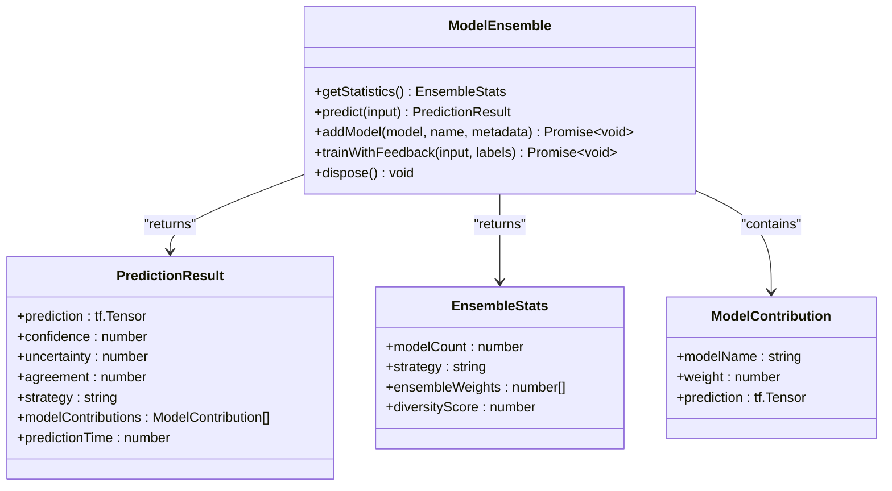
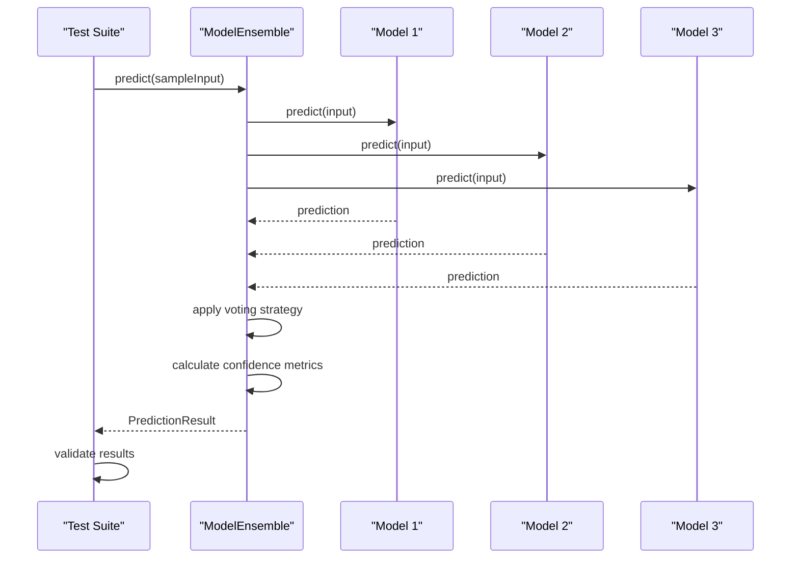
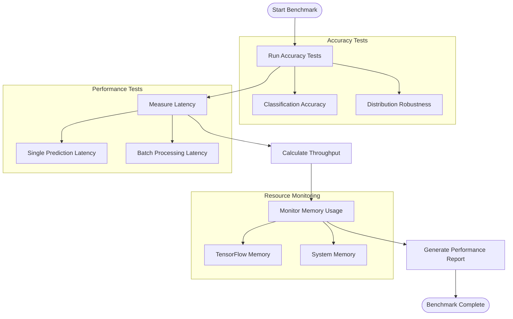
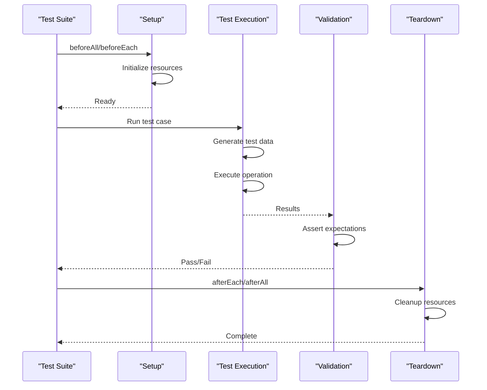
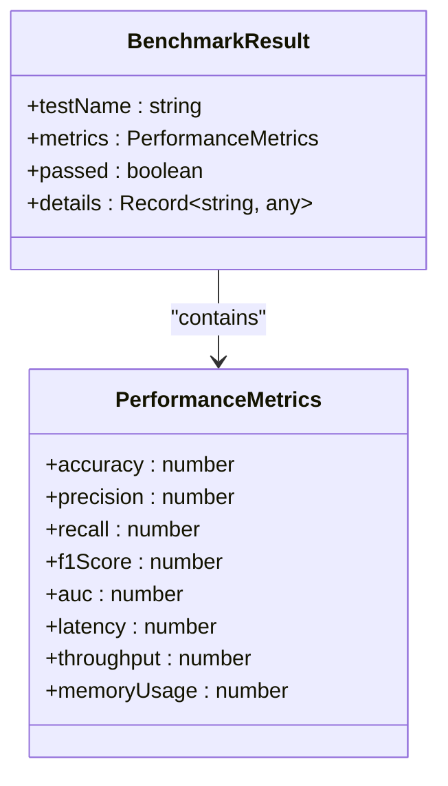

# Testing Examples

<cite>
**Referenced Files in This Document**   
- [mle-star-validation-suite.test.ts](file://agentic-flow/src/tests/validation/mle-star-validation-suite.test.ts)
- [performance-benchmarks.test.ts](file://agentic-flow/src/tests/validation/performance-benchmarks.test.ts)
- [ModelEnsemble.ts](file://agentic-flow/src/neural/optimization/ModelEnsemble.ts)
- [mle_star_benchmark_example.py](file://benchmark/examples/advanced/mle_star_benchmark_example.py)
- [ml_scenarios.py](file://benchmark/src/swarm_benchmark/mle_star/ml_scenarios.py)
- [ensemble_executor.py](file://benchmark/src/swarm_benchmark/mle_star/ensemble_executor.py)
- [voting_strategies.py](file://benchmark/src/swarm_benchmark/mle_star/voting_strategies.py)
- [model_coordinator.py](file://benchmark/src/swarm_benchmark/mle_star/model_coordinator.py)
- [performance_tracker.py](file://benchmark/src/swarm_benchmark/mle_star/performance_tracker.py)
</cite>

## Table of Contents
1. [Introduction](#introduction)
2. [Unit Testing Strategy](#unit-testing-strategy)
3. [Integration Testing Approach](#integration-testing-approach)
4. [Performance Benchmarking](#performance-benchmarking)
5. [Validation Framework Architecture](#validation-framework-architecture)
6. [Test Execution Patterns](#test-execution-patterns)
7. [Result Validation and Assertion System](#result-validation-and-assertion-system)
8. [Common Testing Challenges](#common-testing-challenges)
9. [Best Practices for Test Development](#best-practices-for-test-development)

## Introduction
The Testing Examples section demonstrates comprehensive testing strategies for Claude-Flow applications, with a focus on the MLE-STAR ensemble system. This document details the implementation of unit, integration, and performance tests that validate agent behavior, workflow correctness, and system performance. The testing framework combines TypeScript/Jest for unit validation with Python-based performance benchmarking to ensure both functional correctness and production readiness. The examples showcase how test scripts verify complex AI-driven workflows, ensemble model behavior, and system-level performance characteristics.

## Unit Testing Strategy

The unit testing strategy for the MLE-STAR system focuses on validating individual components and their interactions within the model ensemble framework. The primary test suite, `mle-star-validation-suite.test.ts`, implements comprehensive validation for the ModelEnsemble class and its associated functionality.

The test suite uses Jest as the testing framework with TensorFlow.js for generating test data and mocking model behavior. Key aspects of the unit testing approach include:

- **Mock model creation**: The `createMockModel` function generates TensorFlow models with controlled accuracy characteristics for consistent testing
- **Test data generation**: Functions like `generateTestData` and `generateTestLabels` create synthetic datasets for classification tasks
- **Lifecycle management**: The `beforeAll`, `beforeEach`, `afterEach`, and `afterAll` hooks ensure proper initialization and cleanup of test resources



**Diagram sources**
- [ModelEnsemble.ts](file://agentic-flow/src/neural/optimization/ModelEnsemble.ts#L1-L200)

**Section sources**
- [mle-star-validation-suite.test.ts](file://agentic-flow/src/tests/validation/mle-star-validation-suite.test.ts#L1-L495)

## Integration Testing Approach

The integration testing approach validates the interaction between multiple components in the MLE-STAR system, particularly focusing on the ensemble's ability to coordinate multiple models and produce reliable predictions. The tests verify complex workflows that involve model initialization, prediction generation, and result aggregation.

Key integration test cases include:

- **Ensemble strategy validation**: Testing all supported ensemble strategies (simple_average, weighted_average, voting, stacking, dynamic_selection) to ensure they produce valid predictions
- **Model failure handling**: Verifying the system's resilience when individual models fail during prediction
- **Performance-based weight adjustment**: Testing the ensemble's ability to update model weights based on performance feedback

The integration tests use a comprehensive test configuration that defines expected thresholds for accuracy, loss, confidence, and uncertainty. This ensures that the ensemble not only functions correctly but also meets production-quality standards.



**Diagram sources**
- [mle-star-validation-suite.test.ts](file://agentic-flow/src/tests/validation/mle-star-validation-suite.test.ts#L150-L200)
- [ModelEnsemble.ts](file://agentic-flow/src/neural/optimization/ModelEnsemble.ts#L50-L100)

**Section sources**
- [mle-star-validation-suite.test.ts](file://agentic-flow/src/tests/validation/mle-star-validation-suite.test.ts#L1-L495)

## Performance Benchmarking

The performance benchmarking system evaluates the MLE-STAR ensemble across multiple dimensions including accuracy, latency, throughput, and resource utilization. The `performance-benchmarks.test.ts` file implements a comprehensive suite of performance tests that validate the system under various conditions.

The benchmarking strategy includes:

- **Accuracy benchmarks**: Testing classification accuracy on various datasets and ensuring the ensemble meets target thresholds
- **Distribution robustness**: Validating consistent performance across different data distributions (normal, uniform, skewed)
- **Latency measurements**: Measuring single prediction latency and calculating percentiles (P95, P99) to understand performance characteristics
- **Throughput analysis**: Calculating predictions per second to evaluate system capacity



**Diagram sources**
- [performance-benchmarks.test.ts](file://agentic-flow/src/tests/validation/performance-benchmarks.test.ts#L1-L605)

**Section sources**
- [performance-benchmarks.test.ts](file://agentic-flow/src/tests/validation/performance-benchmarks.test.ts#L1-L605)

## Validation Framework Architecture

The validation framework architecture for the MLE-STAR system is built around a multi-layered approach that combines unit testing, integration testing, and performance benchmarking. The architecture is implemented across both TypeScript and Python components, providing comprehensive validation for the ensemble system.

The Python-based validation framework in the benchmark directory provides additional testing capabilities focused on ensemble learning scenarios. Key components include:

- **MLE-STAR Benchmark Example**: Demonstrates integration of MLE-STAR ensemble capabilities with the benchmark system
- **ML Scenarios**: Defines predefined benchmark scenarios for classification, regression, and custom ensembles
- **Ensemble Executor**: Coordinates multiple ML models with voting strategies and performance tracking
- **Voting Strategies**: Implements various consensus mechanisms for combining predictions
- **Model Coordinator**: Manages model agent lifecycle and coordination
- **Performance Tracker**: Collects and analyzes performance metrics

```mermaid
graph TD
subgraph "Validation Framework"
MLEStarExample[mle_star_benchmark_example.py]
MLSenarios[ml_scenarios.py]
EnsembleExecutor[ensemble_executor.py]
VotingStrategies[voting_strategies.py]
ModelCoordinator[model_coordinator.py]
PerformanceTracker[performance_tracker.py]
end
MLEStarExample --> MLSenarios : "uses"
MLEStarExample --> EnsembleExecutor : "uses"
EnsembleExecutor --> VotingStrategies : "uses"
EnsembleExecutor --> ModelCoordinator : "uses"
EnsembleExecutor --> PerformanceTracker : "uses"
ModelCoordinator --> PerformanceTracker : "reports to"
```

**Diagram sources**
- [mle_star_benchmark_example.py](file://benchmark/examples/advanced/mle_star_benchmark_example.py#L1-L229)
- [ml_scenarios.py](file://benchmark/src/swarm_benchmark/mle_star/ml_scenarios.py#L1-L687)
- [ensemble_executor.py](file://benchmark/src/swarm_benchmark/mle_star/ensemble_executor.py#L1-L487)
- [voting_strategies.py](file://benchmark/src/swarm_benchmark/mle_star/voting_strategies.py#L1-L569)
- [model_coordinator.py](file://benchmark/src/swarm_benchmark/mle_star/model_coordinator.py#L1-L714)
- [performance_tracker.py](file://benchmark/src/swarm_benchmark/mle_star/performance_tracker.py#L1-L593)

**Section sources**
- [mle_star_benchmark_example.py](file://benchmark/examples/advanced/mle_star_benchmark_example.py#L1-L229)

## Test Execution Patterns

The test execution patterns in the MLE-STAR validation framework follow a consistent structure across both TypeScript and Python test suites. These patterns ensure reliable and repeatable test results while providing comprehensive coverage of the system's functionality.

Key execution patterns include:

- **Setup and teardown**: Using lifecycle hooks to initialize and clean up test resources
- **Data generation**: Creating synthetic datasets for consistent testing
- **Mocking and stubbing**: Replacing external dependencies with controlled implementations
- **Batch processing**: Testing the system with both single and batch inputs
- **Iterative testing**: Running tests multiple times to measure performance characteristics

The TypeScript tests use Jest's asynchronous testing capabilities to handle the asynchronous nature of TensorFlow operations, while the Python tests leverage asyncio for coordinating asynchronous operations in the ensemble system.



**Diagram sources**
- [mle-star-validation-suite.test.ts](file://agentic-flow/src/tests/validation/mle-star-validation-suite.test.ts#L50-L100)
- [performance-benchmarks.test.ts](file://agentic-flow/src/tests/validation/performance-benchmarks.test.ts#L50-L100)

**Section sources**
- [mle-star-validation-suite.test.ts](file://agentic-flow/src/tests/validation/mle-star-validation-suite.test.ts#L1-L495)
- [performance-benchmarks.test.ts](file://agentic-flow/src/tests/validation/performance-benchmarks.test.ts#L1-L605)

## Result Validation and Assertion System

The result validation and assertion system in the MLE-STAR testing framework ensures that both functional correctness and performance requirements are met. The system uses a combination of Jest assertions in TypeScript and custom validation logic in Python to verify test outcomes.

Key aspects of the assertion system include:

- **Accuracy thresholds**: Validating that model predictions meet minimum accuracy requirements
- **Performance targets**: Ensuring latency, throughput, and resource usage stay within acceptable bounds
- **Statistical validation**: Using percentiles (P95, P99) to understand performance distribution
- **Consistency checks**: Verifying consistent behavior across different data distributions

The framework also implements a benchmark results collection system that tracks test outcomes and generates comprehensive performance reports. This allows for historical comparison and trend analysis of system performance.



**Diagram sources**
- [performance-benchmarks.test.ts](file://agentic-flow/src/tests/validation/performance-benchmarks.test.ts#L20-L50)

**Section sources**
- [performance-benchmarks.test.ts](file://agentic-flow/src/tests/validation/performance-benchmarks.test.ts#L1-L605)

## Common Testing Challenges

The MLE-STAR testing framework addresses several common challenges in testing AI-driven systems:

- **Test flakiness**: Addressed through controlled mock models and synthetic data generation
- **Environment dependencies**: Mitigated by using self-contained test environments and dependency injection
- **Performance measurement accuracy**: Ensured through multiple iterations and statistical analysis
- **Resource management**: Handled through proper cleanup of TensorFlow tensors and model instances
- **Asynchronous operations**: Managed using async/await patterns and proper lifecycle hooks

The framework also deals with the inherent stochasticity of machine learning models by using fixed random seeds and controlled accuracy parameters in mock models, ensuring consistent test results across runs.

## Best Practices for Test Development

Based on the MLE-STAR testing examples, several best practices emerge for developing effective tests in AI-driven systems:

- **Use realistic mock data**: Generate synthetic datasets that reflect real-world characteristics
- **Test edge cases**: Include scenarios with model failures and unusual data distributions
- **Measure performance comprehensively**: Track accuracy, latency, throughput, and resource usage
- **Ensure proper cleanup**: Dispose of resources to prevent memory leaks
- **Use consistent configuration**: Define test parameters in a central configuration object
- **Implement comprehensive reporting**: Collect and analyze test results for historical comparison
- **Test multiple strategies**: Validate different ensemble approaches and voting mechanisms
- **Monitor resource usage**: Track memory and CPU utilization during testing

These practices ensure that tests are reliable, comprehensive, and provide meaningful insights into system behavior and performance.