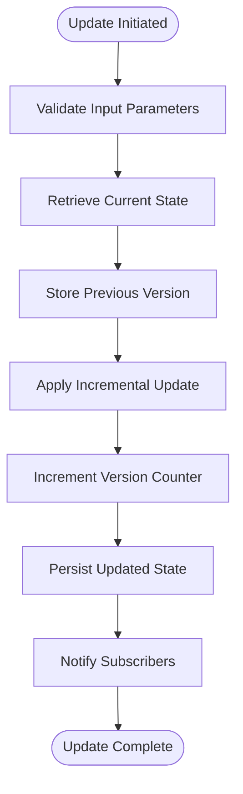
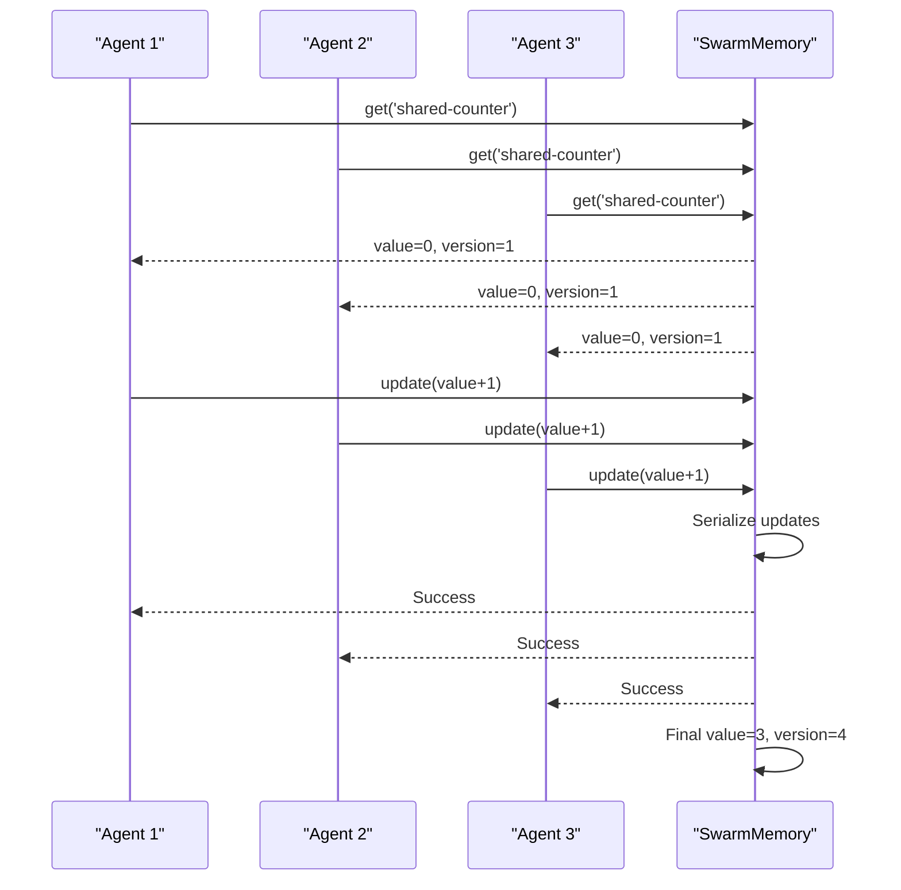
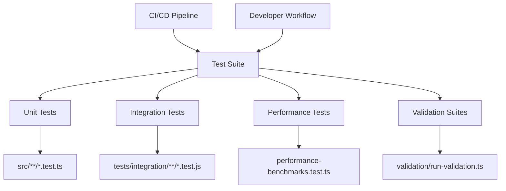
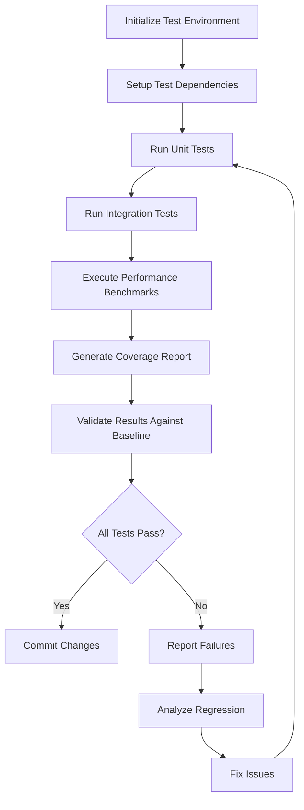
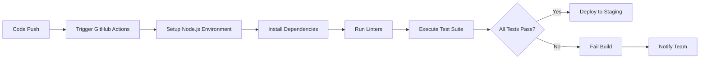

# Testing Guides and Methodologies

<cite>
**Referenced Files in This Document**   
- [test-incremental-updates.js](file://examples/04-testing/test-incremental-updates.js)
- [test-incremental-demo.js](file://examples/04-testing/test-incremental-demo.js)
- [README.md](file://README.md)
- [jest.config.js](file://jest.config.js)
- [run-validation.ts](file://agentic-flow/src/tests/validation/run-validation.ts)
- [.github/workflows/test-suite.yml](file://benchmark/.github/workflows/test-suite.yml)
</cite>

## Table of Contents
1. [Introduction](#introduction)
2. [Incremental Update Testing Principles](#incremental-update-testing-principles)
3. [Testing Methodologies and Frameworks](#testing-methodologies-and-frameworks)
4. [Validation and Test Execution](#validation-and-test-execution)
5. [CI/CD Integration](#cicd-integration)
6. [Best Practices for Test Organization](#best-practices-for-test-organization)
7. [Troubleshooting Common Testing Issues](#troubleshooting-common-testing-issues)
8. [Conclusion](#conclusion)

## Introduction
The Claude-Flow platform employs a comprehensive testing strategy focused on ensuring system stability during iterative development. This document details the testing methodologies used to validate agent behavior, memory management, and workflow logic through incremental updates. The testing framework supports both unit and integration testing, with a strong emphasis on regression prevention and version compatibility. By leveraging automated validation suites and CI/CD pipelines, the project maintains high code quality throughout the development lifecycle.

**Section sources**
- [README.md](file://README.md#L1-L50)

## Incremental Update Testing Principles

### Version Tracking and State Management
Incremental update testing in Claude-Flow focuses on validating changes to system state while preserving existing functionality. The framework uses version tracking to monitor changes to data structures, ensuring that updates do not disrupt established behavior. The `SwarmMemory` class implements versioned storage, where each update increments a version counter and maintains a history of previous states.



**Diagram sources**
- [test-incremental-updates.js](file://examples/04-testing/test-incremental-updates.js#L30-L60)

**Section sources**
- [test-incremental-updates.js](file://examples/04-testing/test-incremental-updates.js#L1-L100)

### Concurrent Update Testing
The system validates concurrent updates to shared resources, simulating multiple agents modifying the same data. This testing pattern ensures thread safety and proper state management under concurrent access. The test suite creates multiple asynchronous processes that increment a shared counter, verifying that the final value matches the expected sum of all increments.



**Diagram sources**
- [test-incremental-updates.js](file://examples/04-testing/test-incremental-updates.js#L180-L220)

### Deep Merge Validation
The testing framework validates deep merge operations to ensure that partial configuration updates preserve existing settings while incorporating new values. This is critical for maintaining system stability during incremental configuration changes. The `deepMerge` function recursively merges objects, preserving properties in the target that are not present in the source.

```javascript
// Test demonstrating deep merge functionality
const baseConfig = {
  server: {
    port: 3000,
    host: 'localhost',
    ssl: { enabled: false }
  },
  features: ['search', 'export']
};

const update = {
  server: {
    port: 8080,
    ssl: { enabled: true }
  }
};

// Result preserves host and features while updating port and ssl
```

**Section sources**
- [test-incremental-demo.js](file://examples/04-testing/test-incremental-demo.js#L150-L180)

## Testing Methodologies and Frameworks

### Test Suite Architecture
Claude-Flow utilizes a multi-layered testing approach combining unit tests, integration tests, and performance benchmarks. The primary testing framework is Jest, configured through `jest.config.js`, which provides a comprehensive environment for test execution, code coverage, and mocking.



**Diagram sources**
- [jest.config.js](file://jest.config.js#L1-L20)
- [run-validation.ts](file://agentic-flow/src/tests/validation/run-validation.ts#L1-L10)

**Section sources**
- [jest.config.js](file://jest.config.js#L1-L50)

### Test Categorization
The testing framework categorizes tests by their purpose and scope:

**Unit Tests**: Validate individual functions and classes in isolation
- Located in `src/tests/unit/` and `tests/unit/`
- Focus on pure functions and simple class methods
- Use mocking to isolate dependencies

**Integration Tests**: Verify interactions between components
- Located in `tests/integration/`
- Test API endpoints and module interactions
- Use real database connections and external services

**Performance Tests**: Measure system efficiency and scalability
- Located in `src/tests/validation/performance-benchmarks.test.ts`
- Track execution time, memory usage, and resource consumption
- Establish performance baselines for regression detection

**Validation Suites**: Comprehensive system verification
- Located in `agentic-flow/src/tests/validation/`
- Combine multiple test types into cohesive workflows
- Validate end-to-end functionality

## Validation and Test Execution

### Test Execution Workflow
The validation process follows a structured workflow to ensure comprehensive coverage:



**Diagram sources**
- [run-validation.ts](file://agentic-flow/src/tests/validation/run-validation.ts#L1-L50)

### Test Validation Criteria
Tests are evaluated against multiple criteria to ensure system quality:

**Functional Correctness**: Output matches expected results
- Verify return values and side effects
- Validate error handling and edge cases

**Performance Requirements**: Execution within acceptable thresholds
- Response time under 500ms for critical operations
- Memory usage within predefined limits

**Compatibility**: Works across supported environments
- Node.js 18+ compatibility
- Cross-platform functionality (Windows, Linux, macOS)

**Regression Prevention**: No degradation from previous versions
- Performance metrics compared to historical baselines
- Feature functionality preserved during updates

## CI/CD Integration

### Automated Testing Pipeline
The GitHub Actions workflow `test-suite.yml` orchestrates automated testing on every push and pull request. This ensures that all changes are validated before integration into the main codebase.



**Diagram sources**
- [.github/workflows/test-suite.yml](file://benchmark/.github/workflows/test-suite.yml#L1-L30)

**Section sources**
- [.github/workflows/test-suite.yml](file://benchmark/.github/workflows/test-suite.yml#L1-L50)

### Continuous Integration Practices
The CI/CD pipeline implements several best practices:

**Automated Testing**: All tests run automatically on every code change
- Unit, integration, and performance tests executed in sequence
- Code coverage threshold enforced (minimum 80%)

**Environment Consistency**: Identical environments across development and CI
- Docker containers ensure consistent dependencies
- Configuration parity between local and remote execution

**Early Feedback**: Rapid test execution for quick developer feedback
- Parallel test execution to reduce total runtime
- Immediate notification of test failures

**Artifact Preservation**: Test results and coverage reports stored
- Historical data for trend analysis
- Debugging information for failed builds

## Best Practices for Test Organization

### Test File Structure
The project follows a consistent directory structure for test files:

```
tests/
├── unit/
│   ├── memory/
│   │   └── memory-store.test.ts
│   ├── config/
│   │   └── config-manager.test.ts
│   └── utils/
│       └── helpers.test.ts
├── integration/
│   ├── cli/
│   │   └── cli-commands.test.ts
│   ├── mcp/
│   │   └── mcp-endpoints.test.ts
│   └── swarm/
│       └── swarm-orchestration.test.ts
├── performance/
│   ├── memory-benchmark.test.ts
│   └── workflow-benchmark.test.ts
└── fixtures/
    ├── config/
    │   └── test-config.json
    └── memory/
        └── test-memory.json
```

This structure enables easy navigation and ensures tests are colocated with the functionality they validate.

### Test Documentation and Onboarding
To ensure consistent application of testing standards, the project includes comprehensive documentation:

**Test READMEs**: Each test directory contains a README explaining its purpose
- Guidelines for writing new tests
- Examples of proper test patterns
- Common pitfalls to avoid

**Code Comments**: Tests include detailed comments explaining their purpose
- Why the test exists
- What edge cases it covers
- How it relates to system requirements

**Onboarding Materials**: New team members receive training on testing practices
- Overview of testing frameworks and tools
- Walkthrough of key test suites
- Best practices for test maintenance

## Troubleshooting Common Testing Issues

### Test Maintenance Challenges
As the codebase evolves, tests require ongoing maintenance to remain effective:

**Flaky Tests**: Intermittent failures that undermine confidence
- Solution: Eliminate timing dependencies and external service calls
- Use deterministic data and mock external dependencies

**Version Compatibility**: Tests failing due to dependency updates
- Solution: Pin critical dependencies in package.json
- Implement compatibility testing matrix

**Test Duplication**: Multiple tests covering the same functionality
- Solution: Regular test suite reviews and consolidation
- Maintain a test coverage map to identify redundancy

### Regression Prevention Strategies
To minimize regressions during iterative development:

**Comprehensive Test Coverage**: Ensure critical paths are thoroughly tested
- Focus on high-risk areas and complex logic
- Maintain coverage metrics and enforce thresholds

**Incremental Testing**: Validate changes in small, manageable increments
- Test each update individually before integration
- Use feature flags to isolate new functionality

**Historical Comparison**: Compare current performance to historical baselines
- Track metrics over time to identify degradation
- Set alerts for significant performance changes

## Conclusion
The testing methodologies in Claude-Flow provide a robust framework for ensuring system stability during iterative development. By focusing on incremental update testing, the project can safely evolve its agent behavior, memory management, and workflow logic without disrupting existing functionality. The combination of automated validation suites, CI/CD integration, and comprehensive documentation ensures that testing standards are consistently applied across the project. This approach enables the team to maintain high code quality while rapidly iterating on new features and improvements.