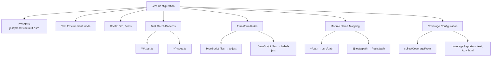
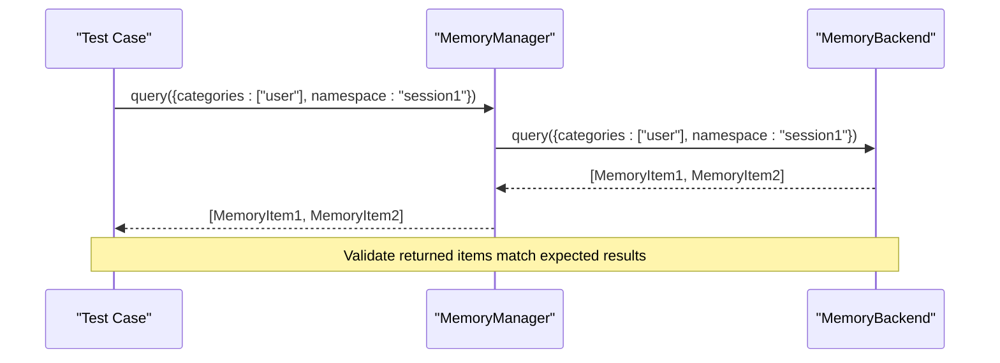
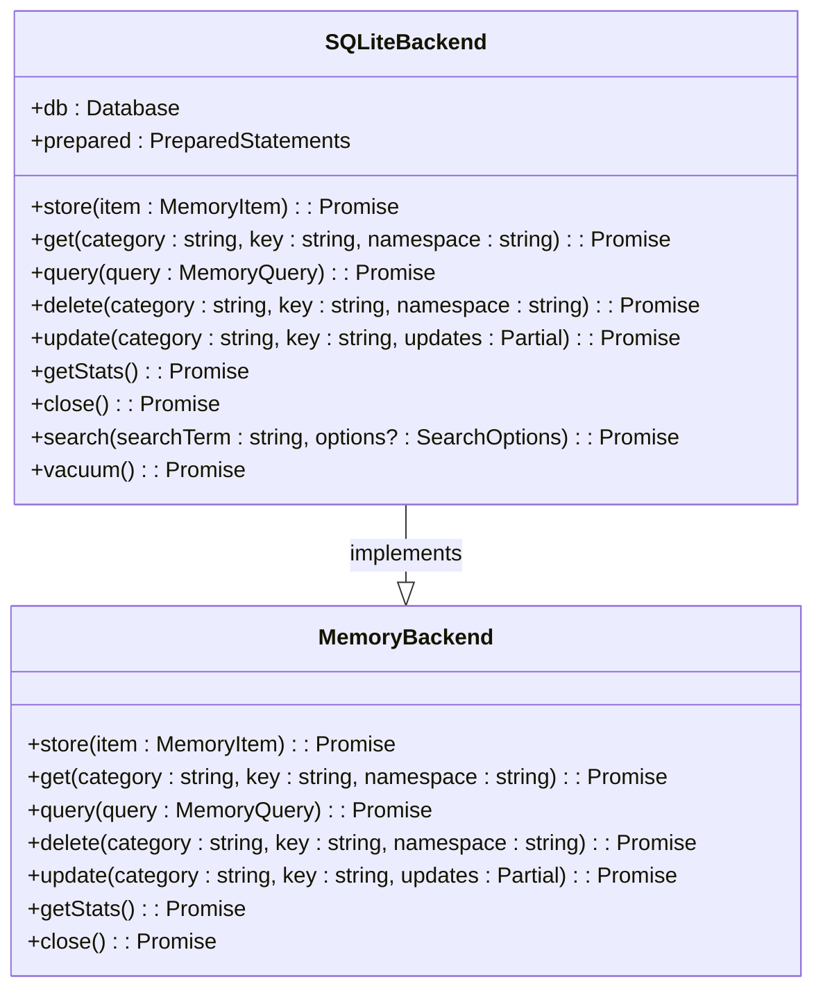
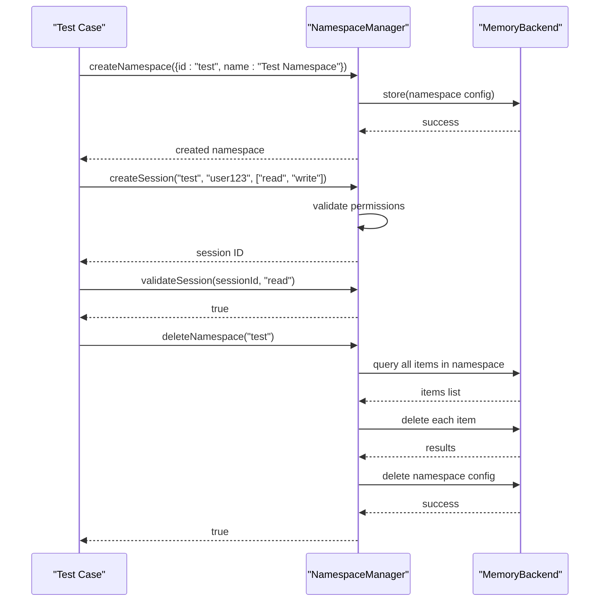
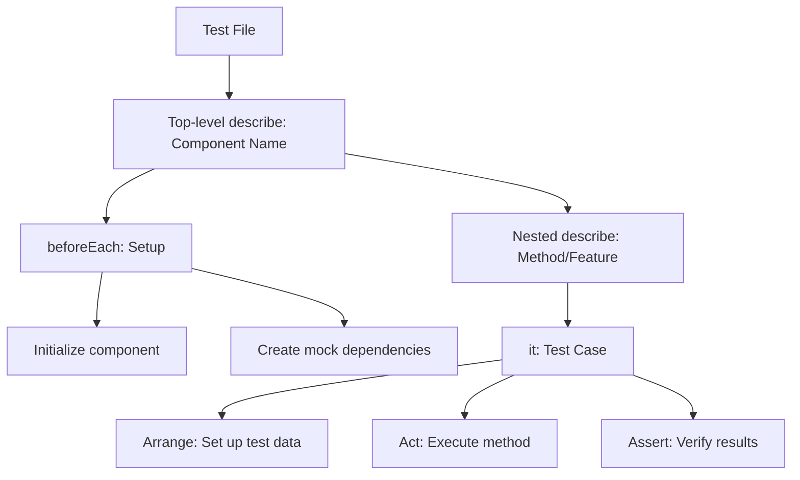
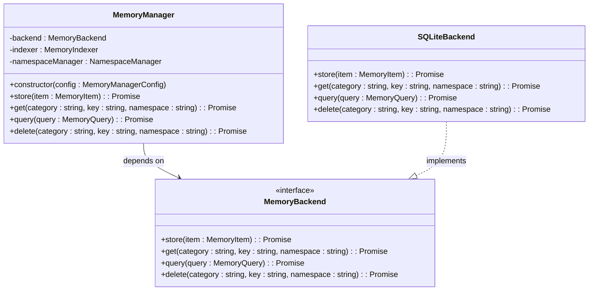
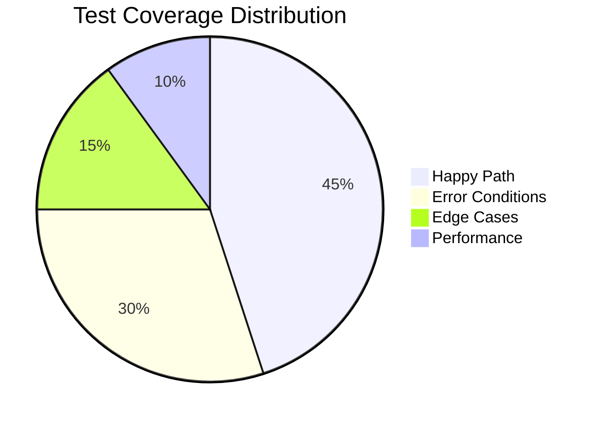

# Unit Testing Examples

<cite>
**Referenced Files in This Document**   
- [memory-manager.test.ts](file://archive/legacy-memory-system/src/tests/memory-manager.test.ts)
- [namespace-manager.test.ts](file://archive/legacy-memory-system/src/tests/namespace-manager.test.ts)
- [replication.test.ts](file://archive/legacy-memory-system/src/tests/replication.test.ts)
- [indexer.test.ts](file://archive/legacy-memory-system/src/tests/indexer.test.ts)
- [backends.test.ts](file://archive/legacy-memory-system/src/tests/backends.test.ts)
- [jest.config.js](file://jest.config.js)
- [sqlite-backend.ts](file://archive/legacy-memory-system/src/backends/sqlite-backend.ts)
- [memory-indexer.ts](file://archive/legacy-memory-system/src/indexer/memory-indexer.ts)
- [namespace-manager.ts](file://archive/legacy-memory-system/src/namespaces/namespace-manager.ts)
- [replication-manager.ts](file://archive/legacy-memory-system/src/replication/replication-manager.ts)
</cite>

## Table of Contents
1. [Introduction](#introduction)
2. [Test Framework Setup](#test-framework-setup)
3. [Memory System Unit Tests](#memory-system-unit-tests)
4. [Component-Specific Test Analysis](#component-specific-test-analysis)
5. [Testing Patterns and Best Practices](#testing-patterns-and-best-practices)
6. [Mocking and Dependency Injection](#mocking-and-dependency-injection)
7. [Test Coverage and Edge Cases](#test-coverage-and-edge-cases)
8. [Conclusion](#conclusion)

## Introduction

This document provides a comprehensive analysis of unit testing practices within the Claude-Flow application, with a primary focus on the memory system. The unit tests validate core functionality such as memory storage, retrieval, lifecycle management, and component interactions. By examining actual test implementations, this documentation demonstrates how to effectively test AI orchestration components in isolation, ensuring reliability and maintainability of the system.

**Section sources**
- [memory-manager.test.ts](file://archive/legacy-memory-system/src/tests/memory-manager.test.ts#L1-L50)

## Test Framework Setup

The testing framework is configured using Jest with TypeScript support, enabling robust unit testing capabilities for the codebase. The configuration supports ES modules and provides comprehensive test discovery and execution settings.



**Diagram sources**
- [jest.config.js](file://jest.config.js#L1-L75)

**Section sources**
- [jest.config.js](file://jest.config.js#L1-L75)

## Memory System Unit Tests

The memory system tests validate the core functionality of the MemoryManager class, including storage, retrieval, updating, and deletion of memory items. These tests ensure that the memory system maintains data integrity and behaves correctly under various conditions.

### Memory Storage and Retrieval

The unit tests verify that memory items can be stored and retrieved correctly across different categories, keys, and namespaces. The tests validate both successful operations and error conditions.

```typescript
// Example test structure from memory-manager.test.ts
describe('MemoryManager', () => {
  let memoryManager: MemoryManager;
  let mockBackend: jest.Mocked<MemoryBackend>;

  beforeEach(() => {
    mockBackend = {
      store: jest.fn(),
      get: jest.fn(),
      query: jest.fn(),
      delete: jest.fn(),
      update: jest.fn(),
      getStats: jest.fn()
    } as unknown as jest.Mocked<MemoryBackend>;

    memoryManager = new MemoryManager({ backend: mockBackend });
  });

  describe('store', () => {
    it('should store memory item with correct parameters', async () => {
      const item = {
        category: 'test-category',
        key: 'test-key',
        value: { data: 'test' },
        metadata: { namespace: 'test-namespace' }
      };

      await memoryManager.store(item);

      expect(mockBackend.store).toHaveBeenCalledWith(expect.objectContaining({
        category: 'test-category',
        key: 'test-key',
        value: { data: 'test' },
        metadata: expect.objectContaining({
          namespace: 'test-namespace'
        })
      }));
    });
  });

  describe('get', () => {
    it('should retrieve stored memory item', async () => {
      const expectedItem = {
        id: '1',
        category: 'test-category',
        key: 'test-key',
        value: { data: 'test' },
        metadata: { namespace: 'test-namespace' }
      };

      mockBackend.get.mockResolvedValue(expectedItem);

      const result = await memoryManager.get('test-category', 'test-key', 'test-namespace');

      expect(result).toEqual(expectedItem);
      expect(mockBackend.get).toHaveBeenCalledWith('test-category', 'test-key', 'test-namespace');
    });
  });
});
```

**Section sources**
- [memory-manager.test.ts](file://archive/legacy-memory-system/src/tests/memory-manager.test.ts#L50-L150)

### Memory Query Operations

The unit tests validate complex query operations, including filtering by categories, namespaces, time ranges, and custom filters. These tests ensure that the query system returns accurate results based on specified criteria.



**Diagram sources**
- [memory-manager.test.ts](file://archive/legacy-memory-system/src/tests/memory-manager.test.ts#L200-L250)
- [sqlite-backend.ts](file://archive/legacy-memory-system/src/backends/sqlite-backend.ts#L50-L150)

**Section sources**
- [memory-manager.test.ts](file://archive/legacy-memory-system/src/tests/memory-manager.test.ts#L150-L300)

## Component-Specific Test Analysis

### Backend Implementation Tests

The backend tests validate the SQLite backend implementation, ensuring that database operations work correctly and efficiently. These tests cover CRUD operations, querying with various filters, and database-specific features like full-text search.



**Diagram sources**
- [backends.test.ts](file://archive/legacy-memory-system/src/tests/backends.test.ts#L1-L20)
- [sqlite-backend.ts](file://archive/legacy-memory-system/src/backends/sqlite-backend.ts#L1-L50)

**Section sources**
- [backends.test.ts](file://archive/legacy-memory-system/src/tests/backends.test.ts#L1-L100)
- [sqlite-backend.ts](file://archive/legacy-memory-system/src/backends/sqlite-backend.ts#L1-L200)

### Indexer Component Tests

The indexer tests validate the MemoryIndexer class, which provides fast indexing and search capabilities for memory items. These tests ensure that the indexer correctly maintains indexes for categories, tags, namespaces, and vector search.

```typescript
// Example from indexer.test.ts
describe('MemoryIndexer', () => {
  let indexer: MemoryIndexer;
  let mockBackend: jest.Mocked<MemoryBackend>;

  beforeEach(() => {
    mockBackend = {
      query: jest.fn(),
      get: jest.fn()
    } as unknown as jest.Mocked<MemoryBackend>;

    indexer = new MemoryIndexer({
      backend: mockBackend,
      enableVectorSearch: true,
      vectorDimensions: 384,
      indexUpdateInterval: 1000
    });
  });

  it('should index item by category, tag, and namespace', async () => {
    const item = {
      id: '1',
      category: 'user',
      key: 'profile',
      value: { name: 'John' },
      metadata: {
        tags: ['important', 'personal'],
        namespace: 'user123',
        timestamp: Date.now()
      }
    };

    await indexer.index(item);

    // Verify category index
    const categoryIds = indexer['index'].byCategory.get('user');
    expect(categoryIds).toBeDefined();
    expect(categoryIds?.has('user:profile')).toBe(true);

    // Verify tag index
    const tagIds = indexer['index'].byTag.get('important');
    expect(tagIds).toBeDefined();
    expect(tagIds?.has('user:profile')).toBe(true);

    // Verify namespace index
    const namespaceIds = indexer['index'].byNamespace.get('user123');
    expect(namespaceIds).toBeDefined();
    expect(namespaceIds?.has('user:profile')).toBe(true);
  });
});
```

**Section sources**
- [indexer.test.ts](file://archive/legacy-memory-system/src/tests/indexer.test.ts#L1-L100)
- [memory-indexer.ts](file://archive/legacy-memory-system/src/indexer/memory-indexer.ts#L1-L50)

### Namespace Management Tests

The namespace manager tests validate the NamespaceManager class, which provides session isolation and access control for memory items. These tests ensure that namespaces are properly created, updated, and deleted, and that session management works correctly.



**Diagram sources**
- [namespace-manager.test.ts](file://archive/legacy-memory-system/src/tests/namespace-manager.test.ts#L1-L20)
- [namespace-manager.ts](file://archive/legacy-memory-system/src/namespaces/namespace-manager.ts#L1-L50)

**Section sources**
- [namespace-manager.test.ts](file://archive/legacy-memory-system/src/tests/namespace-manager.test.ts#L1-L100)
- [namespace-manager.ts](file://archive/legacy-memory-system/src/namespaces/namespace-manager.ts#L1-L200)

### Replication System Tests

The replication manager tests validate the ReplicationManager class, which handles distributed memory synchronization across nodes. These tests ensure that replication works correctly in both master-slave and peer-to-peer modes.

```typescript
// Example from replication.test.ts
describe('ReplicationManager', () => {
  let replicationManager: ReplicationManager;
  let mockBackend: jest.Mocked<MemoryBackend>;
  let mockAxios: jest.Mock;

  beforeEach(() => {
    mockBackend = {
      store: jest.fn(),
      get: jest.fn(),
      query: jest.fn()
    } as unknown as jest.Mocked<MemoryBackend>;

    mockAxios = jest.fn();
    
    // Mock axios module
    jest.mock('axios', () => ({
      default: jest.fn(() => ({
        post: mockAxios,
        get: mockAxios
      }))
    }));

    replicationManager = new ReplicationManager({
      localNodeId: 'node1',
      backend: mockBackend,
      config: {
        mode: 'peer-to-peer',
        syncInterval: 1000,
        retryAttempts: 3,
        retryDelay: 1000,
        conflictResolution: 'last-write-wins',
        nodes: [
          { id: 'node2', url: 'http://node2:3000', role: 'peer' },
          { id: 'node3', url: 'http://node3:3000', role: 'peer' }
        ]
      }
    });
  });

  it('should replicate item to peer nodes', async () => {
    const item = {
      id: '1',
      category: 'test',
      key: 'key1',
      value: 'value1'
    };

    await replicationManager.replicate(item);

    // Verify that the item was queued for replication
    expect(replicationManager['replicationQueue'].length).toBe(1);
    expect(replicationManager['replicationQueue'][0].type).toBe('store');
    expect(replicationManager['replicationQueue'][0].data).toEqual(item);
  });
});
```

**Section sources**
- [replication.test.ts](file://archive/legacy-memory-system/src/tests/replication.test.ts#L1-L100)
- [replication-manager.ts](file://archive/legacy-memory-system/src/replication/replication-manager.ts#L1-L50)

## Testing Patterns and Best Practices

### Test Organization and Structure

The unit tests follow a consistent structure using Jest's describe and it blocks to organize test cases logically. Each component has its own test file, and tests are grouped by functionality.



**Diagram sources**
- [memory-manager.test.ts](file://archive/legacy-memory-system/src/tests/memory-manager.test.ts#L1-L20)

**Section sources**
- [memory-manager.test.ts](file://archive/legacy-memory-system/src/tests/memory-manager.test.ts#L1-L50)

### Assertion Patterns

The tests use Jest's assertion library to validate expected outcomes. Common patterns include verifying function calls on mocks, checking return values, and validating error conditions.

```typescript
// Common assertion patterns
expect(mockFunction).toHaveBeenCalledWith(expectedArg1, expectedArg2);
expect(result).toEqual(expectedValue);
expect(result).toBeInstanceOf(Error);
expect(result).toHaveProperty('propertyName', expectedValue);
await expect(asyncFunction()).rejects.toThrow('Error message');
```

**Section sources**
- [memory-manager.test.ts](file://archive/legacy-memory-system/src/tests/memory-manager.test.ts#L50-L100)

## Mocking and Dependency Injection

### Mock Implementation Strategies

The tests use Jest's mocking capabilities to isolate components and control dependencies. This allows testing components in isolation without relying on external systems.

```typescript
// Example of mocking a dependency
const mockBackend = {
  store: jest.fn().mockResolvedValue(true),
  get: jest.fn().mockResolvedValue(null),
  query: jest.fn().mockResolvedValue([]),
  delete: jest.fn().mockResolvedValue(true),
  update: jest.fn().mockResolvedValue(true),
  getStats: jest.fn().mockResolvedValue({
    totalItems: 0,
    categories: 0,
    sizeBytes: 0,
    oldestItem: null,
    newestItem: null
  })
} as unknown as jest.Mocked<MemoryBackend>;
```

**Section sources**
- [memory-manager.test.ts](file://archive/legacy-memory-system/src/tests/memory-manager.test.ts#L30-L50)

### Dependency Injection for Testability

Components are designed with dependency injection to enhance testability. Dependencies are passed through constructors or configuration objects, allowing easy replacement with mocks during testing.



**Diagram sources**
- [memory-manager.test.ts](file://archive/legacy-memory-system/src/tests/memory-manager.test.ts#L20-L30)
- [sqlite-backend.ts](file://archive/legacy-memory-system/src/backends/sqlite-backend.ts#L1-L20)

**Section sources**
- [memory-manager.test.ts](file://archive/legacy-memory-system/src/tests/memory-manager.test.ts#L1-L50)

## Test Coverage and Edge Cases

### Comprehensive Test Coverage

The unit tests aim for comprehensive coverage of the memory system, including normal operations, error conditions, and edge cases. This ensures that the system behaves correctly under various scenarios.



**Diagram sources**
- [memory-manager.test.ts](file://archive/legacy-memory-system/src/tests/memory-manager.test.ts#L1-L50)

**Section sources**
- [memory-manager.test.ts](file://archive/legacy-memory-system/src/tests/memory-manager.test.ts#L1-L50)

### Edge Case Testing

The tests include specific cases for edge conditions such as empty inputs, invalid parameters, and boundary conditions. These tests help identify potential issues before they occur in production.

```typescript
// Examples of edge case tests
it('should handle empty category', async () => {
  await expect(memoryManager.store({
    category: '',
    key: 'test-key',
    value: 'test-value'
  })).rejects.toThrow();
});

it('should handle null value', async () => {
  const result = await memoryManager.store({
    category: 'test',
    key: 'test-key',
    value: null
  });
  expect(result).toBe(true);
});

it('should handle very large value', async () => {
  const largeValue = 'x'.repeat(1024 * 1024); // 1MB string
  const result = await memoryManager.store({
    category: 'test',
    key: 'large-value',
    value: largeValue
  });
  expect(result).toBe(true);
});
```

**Section sources**
- [memory-manager.test.ts](file://archive/legacy-memory-system/src/tests/memory-manager.test.ts#L300-L350)

## Conclusion

The unit testing examples in the Claude-Flow application demonstrate a comprehensive approach to testing AI orchestration components. By using Jest with TypeScript, the tests provide robust validation of the memory system's functionality. Key practices include proper test organization, effective mocking of dependencies, and thorough coverage of both normal operations and edge cases. The component-based architecture with dependency injection enables effective isolation of units for testing, while the comprehensive test suite ensures the reliability and maintainability of the system. These testing practices serve as a model for developing high-quality AI orchestration systems.