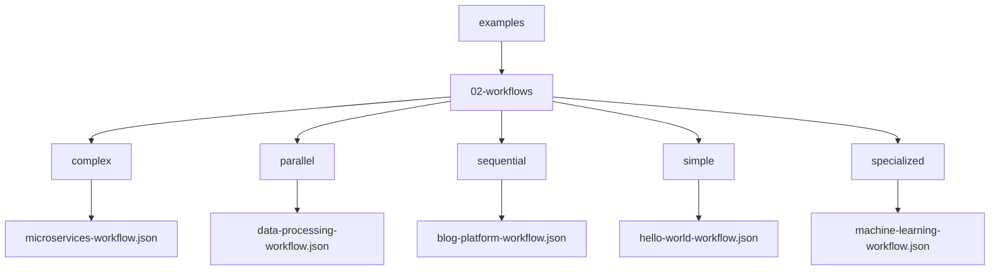
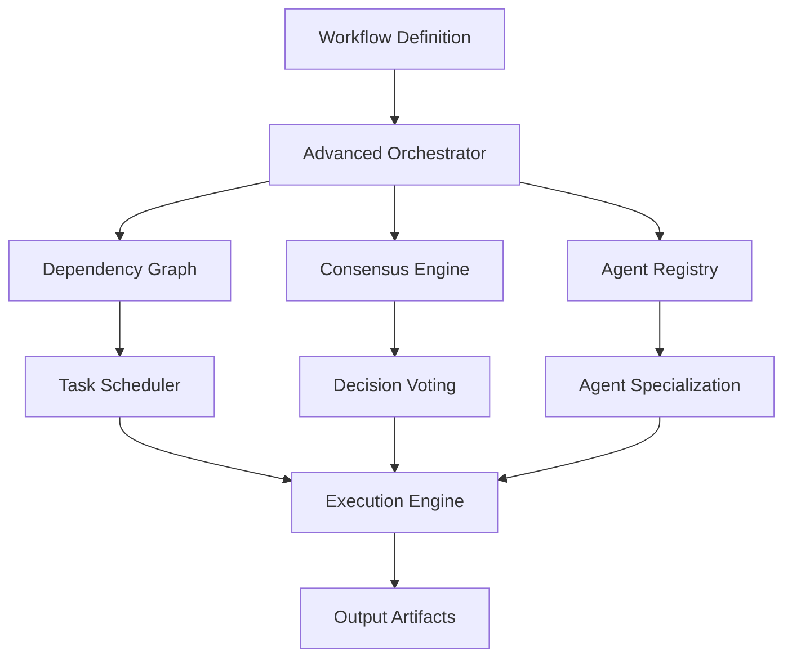
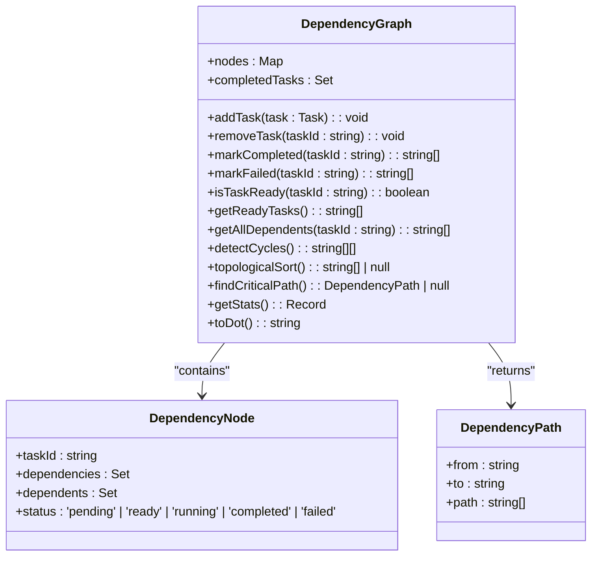
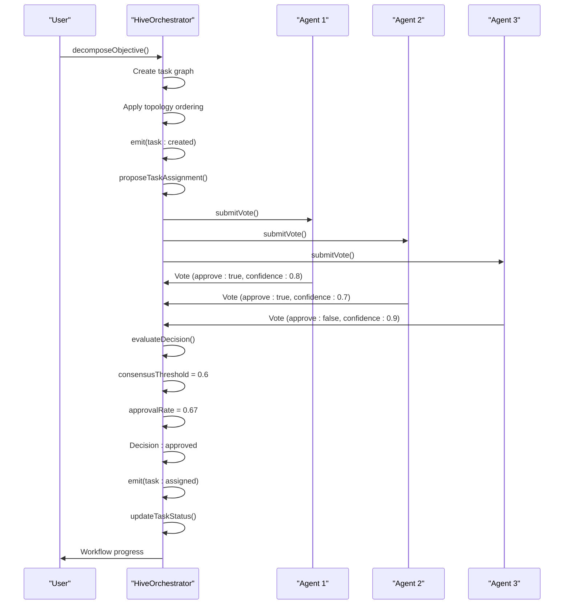
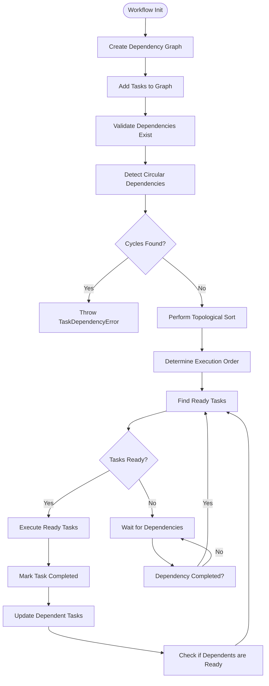

# Complex Workflows

<cite>
**Referenced Files in This Document**   
- [microservices-workflow.json](file://examples/02-workflows/complex/microservices-workflow.json)
- [dependency-graph.ts](file://src/coordination/dependency-graph.ts)
- [hive-orchestrator.ts](file://src/coordination/hive-orchestrator.ts)
- [orchestrator.ts](file://src/core/orchestrator.ts)
</cite>

## Table of Contents
1. [Introduction](#introduction)
2. [Project Structure and Workflow Examples](#project-structure-and-workflow-examples)
3. [Core Components of Complex Workflows](#core-components-of-complex-workflows)
4. [Architecture Overview](#architecture-overview)
5. [Detailed Component Analysis](#detailed-component-analysis)
6. [Dependency Analysis](#dependency-analysis)
7. [Performance Considerations](#performance-considerations)
8. [Troubleshooting Guide](#troubleshooting-guide)
9. [Conclusion](#conclusion)

## Introduction
Complex workflows in Claude-Flow represent advanced orchestration patterns that enable multi-agent coordination, conditional branching, and hybrid execution models. These workflows are designed to manage sophisticated software development processes involving multiple specialized agents, such as architects, developers, testers, and DevOps engineers. This document provides a comprehensive analysis of the implementation details, focusing on the microservices-workflow.json example to illustrate how complex workflows coordinate agent specialization, dynamic task routing, and adaptive execution paths. The analysis covers the interaction between workflow definitions and core components like the advanced orchestrator, dependency graph, and consensus engine.

## Project Structure and Workflow Examples
The project structure reveals a well-organized repository with dedicated directories for examples, source code, and configuration. The workflows are categorized by complexity and pattern type, with the complex workflows directory containing specialized orchestration patterns.



**Diagram sources**
- [microservices-workflow.json](file://examples/02-workflows/complex/microservices-workflow.json)

**Section sources**
- [microservices-workflow.json](file://examples/02-workflows/complex/microservices-workflow.json)

## Core Components of Complex Workflows
Complex workflows in Claude-Flow are built around three core components: the workflow definition, the dependency graph, and the advanced orchestrator (HiveOrchestrator). These components work together to manage agent specialization, task dependencies, and execution coordination.

The workflow definition (e.g., microservices-workflow.json) specifies the agents, tasks, and execution parameters. The dependency graph manages task relationships and execution order, while the HiveOrchestrator implements consensus-based decision making and agent coordination.

**Section sources**
- [microservices-workflow.json](file://examples/02-workflows/complex/microservices-workflow.json)
- [dependency-graph.ts](file://src/coordination/dependency-graph.ts)
- [hive-orchestrator.ts](file://src/coordination/hive-orchestrator.ts)

## Architecture Overview
The architecture of complex workflows in Claude-Flow follows a hierarchical pattern with specialized components handling different aspects of workflow management. The system is designed to support multi-agent coordination, conditional branching, and hybrid execution models.



**Diagram sources**
- [microservices-workflow.json](file://examples/02-workflows/complex/microservices-workflow.json)
- [hive-orchestrator.ts](file://src/coordination/hive-orchestrator.ts)
- [dependency-graph.ts](file://src/coordination/dependency-graph.ts)

## Detailed Component Analysis

### Workflow Definition Analysis
The microservices-workflow.json file demonstrates a comprehensive workflow for building a microservices application. It defines eight specialized agents with distinct capabilities and nine interdependent tasks that follow a logical development sequence.

```json
{
  "name": "Microservices Architecture Workflow",
  "agents": [
    {
      "id": "architect",
      "name": "System Architect",
      "type": "architect",
      "capabilities": ["system-design", "api-design", "documentation"]
    },
    {
      "id": "auth-dev",
      "name": "Auth Service Developer",
      "type": "developer",
      "capabilities": ["backend", "authentication", "security"]
    }
  ],
  "tasks": [
    {
      "id": "design-architecture",
      "name": "Design System Architecture",
      "agentId": "architect",
      "type": "design",
      "priority": "high",
      "output": {
        "artifacts": ["architecture.md", "api-specs.yaml", "database-schema.sql"]
      }
    },
    {
      "id": "create-auth-service",
      "name": "Build Authentication Service",
      "agentId": "auth-dev",
      "type": "development",
      "dependencies": ["design-architecture"],
      "parallel": true,
      "input": {
        "framework": "express",
        "features": ["jwt", "oauth2", "refresh-tokens"]
      }
    }
  ],
  "execution": {
    "mode": "smart",
    "parallelism": {
      "max": 4,
      "strategy": "resource-based"
    },
    "checkpoints": ["design-architecture", "create-api-gateway", "integration-tests"],
    "rollback": true
  }
}
```

This workflow demonstrates several key features:
- **Agent Specialization**: Each agent has specific capabilities that match their role
- **Task Dependencies**: Tasks are sequenced based on dependencies (e.g., development tasks depend on design)
- **Parallel Execution**: Independent tasks can execute in parallel (parallel: true)
- **Checkpoints**: Critical points in the workflow for validation and rollback
- **Quality Gates**: Code review, security scanning, and performance thresholds

**Section sources**
- [microservices-workflow.json](file://examples/02-workflows/complex/microservices-workflow.json)

### Dependency Graph Analysis
The DependencyGraph class manages task dependencies and determines execution order in complex workflows. It implements a directed acyclic graph (DAG) structure to represent task relationships and ensure proper execution sequencing.



**Diagram sources**
- [dependency-graph.ts](file://src/coordination/dependency-graph.ts#L1-L474)

**Section sources**
- [dependency-graph.ts](file://src/coordination/dependency-graph.ts#L1-L474)

### Advanced Orchestrator Analysis
The HiveOrchestrator implements advanced coordination patterns with consensus-based decision making. It manages task decomposition, agent assignment, and workflow execution with support for different coordination topologies.



**Diagram sources**
- [hive-orchestrator.ts](file://src/coordination/hive-orchestrator.ts#L1-L422)

**Section sources**
- [hive-orchestrator.ts](file://src/coordination/hive-orchestrator.ts#L1-L422)

## Dependency Analysis
The dependency analysis reveals how complex workflows manage task relationships and execution order. The DependencyGraph class implements a comprehensive system for tracking task dependencies, detecting cycles, and determining execution readiness.



**Diagram sources**
- [dependency-graph.ts](file://src/coordination/dependency-graph.ts#L1-L474)

**Section sources**
- [dependency-graph.ts](file://src/coordination/dependency-graph.ts#L1-L474)

## Performance Considerations
Complex workflows in Claude-Flow are designed with performance optimization in mind. The system implements several techniques to reduce coordination costs and improve decision efficiency:

1. **Parallel Execution**: Tasks with no dependencies can execute in parallel, limited by the max parallelism setting
2. **Resource-Based Scheduling**: The "resource-based" strategy optimizes task execution based on available resources
3. **Efficient Dependency Checking**: The dependency graph uses sets for O(1) lookups and efficient dependency validation
4. **Batch Processing**: Ready tasks are identified in batches to minimize coordination overhead
5. **Caching**: Completed task status is cached to avoid redundant dependency checks

The system also includes performance monitoring through the getPerformanceMetrics method, which tracks key metrics such as:
- Total task completion rate
- Average execution time
- Consensus approval rate
- Task status distribution

For large agent populations, the system can be optimized by:
- Adjusting the consensus threshold to balance decision quality and speed
- Using hierarchical topology to reduce communication overhead
- Implementing work stealing to balance agent workload
- Utilizing checkpoints to enable rollback without re-execution

**Section sources**
- [hive-orchestrator.ts](file://src/coordination/hive-orchestrator.ts#L1-L422)
- [dependency-graph.ts](file://src/coordination/dependency-graph.ts#L1-L474)

## Troubleshooting Guide
When working with complex workflows, several common issues may arise. This section addresses the most frequent problems and their solutions.

### Coordination Overhead
**Issue**: High coordination overhead due to excessive voting and consensus processes.
**Solution**: Adjust the consensus threshold or use a different topology (e.g., hierarchical instead of mesh).

### Decision Latency
**Issue**: Delays in task assignment due to slow voting processes.
**Solution**: Reduce the required participation rate or implement timeout-based decision making.

### Complexity-Induced Failures
**Issue**: Workflow failures due to complex dependency chains.
**Solution**: Use the detectCycles method to identify circular dependencies and simplify the workflow structure.

### Agent Selection Issues
**Issue**: Suboptimal agent assignment due to capability mismatches.
**Solution**: Review and update agent capabilities using registerAgentCapabilities, and verify task scoring with calculateAgentTaskScore.

### Execution Bottlenecks
**Issue**: Performance bottlenecks in task execution.
**Solution**: Analyze the critical path using findCriticalPath and optimize the longest task sequences.

### Debugging Tools
The system provides several debugging tools:
- toDot method for visualizing the dependency graph
- getStats method for detailed graph statistics
- getTaskGraph method for inspecting the current task state
- Event emitters for monitoring workflow progress

**Section sources**
- [hive-orchestrator.ts](file://src/coordination/hive-orchestrator.ts#L1-L422)
- [dependency-graph.ts](file://src/coordination/dependency-graph.ts#L1-L474)

## Conclusion
Complex workflows in Claude-Flow represent a sophisticated orchestration system that enables advanced multi-agent coordination patterns. The architecture combines a declarative workflow definition with a robust execution engine that manages dependencies, agent specialization, and consensus-based decision making. The system is designed to handle complex software development processes through features like conditional branching, parallel execution, and hybrid coordination models. By leveraging the dependency graph and advanced orchestrator components, Claude-Flow can efficiently manage workflows with hundreds of interdependent tasks and multiple specialized agents. The system provides comprehensive performance monitoring and troubleshooting capabilities, making it suitable for both small-scale development tasks and large-scale enterprise applications.