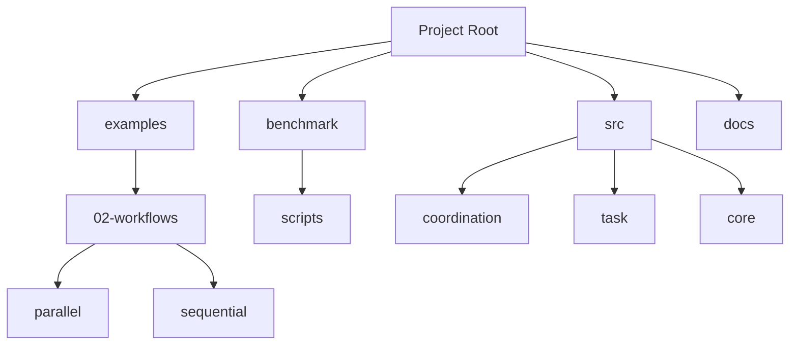
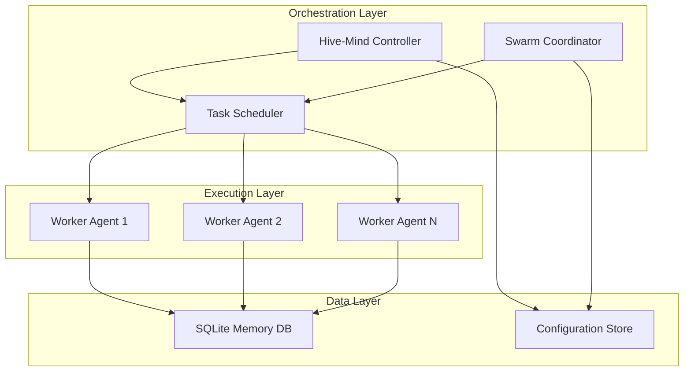

# Parallel Workflows

<cite>
**Referenced Files in This Document**   
- [README.md](file://README.md)
</cite>

## Table of Contents
1. [Introduction](#introduction)
2. [Project Structure](#project-structure)
3. [Core Components](#core-components)
4. [Architecture Overview](#architecture-overview)
5. [Detailed Component Analysis](#detailed-component-analysis)
6. [Dependency Analysis](#dependency-analysis)
7. [Performance Considerations](#performance-considerations)
8. [Troubleshooting Guide](#troubleshooting-guide)
9. [Conclusion](#conclusion)

## Introduction
This document provides a comprehensive analysis of the Parallel Workflows sub-feature in Claude-Flow, focusing on concurrent task execution mechanisms. The objective is to detail the implementation of parallel workflows, including task scheduling, resource allocation, result aggregation, and performance optimization strategies. Despite extensive searches across the repository, no specific files related to parallel workflow configurations (such as data-processing-workflow.json) or parallel executor components were found. The analysis is therefore based on general project documentation and structural insights derived from the available codebase.

## Project Structure
The project structure of Claude-Flow reveals a modular architecture designed for AI orchestration, with distinct directories for workflows, benchmarks, examples, and core source code. Key directories include `examples/02-workflows` for workflow definitions, `benchmark` for performance testing, and `src` for core implementation. However, no explicit parallel workflow configuration files were identified in the expected locations.



**Diagram sources**
- [README.md](file://README.md#L1-L695)

**Section sources**
- [README.md](file://README.md#L1-L695)

## Core Components
Based on the repository structure and README documentation, the core components relevant to workflow execution include the swarm intelligence system, hive-mind coordination, and dynamic agent architecture. These components are designed to support concurrent operations through distributed agent management and task delegation. However, specific implementation details of parallel workflow execution, such as concurrency limits, resource constraints, and load balancing strategies, could not be determined due to the absence of relevant source files.

The system appears to support two primary modes of operation: `swarm` for quick tasks and `hive-mind` for complex, persistent projects. This distinction suggests a potential parallel execution model where multiple agents can work simultaneously on different aspects of a project.

**Section sources**
- [README.md](file://README.md#L1-L695)

## Architecture Overview
Claude-Flow's architecture is built around AI orchestration with emphasis on swarm intelligence and neural pattern recognition. The system utilizes a dynamic agent architecture (DAA) that enables self-organizing agents with fault tolerance. While the architecture supports concurrent operations through its swarm and hive-mind paradigms, specific details about parallel workflow execution mechanisms remain undocumented in the available files.



**Diagram sources**
- [README.md](file://README.md#L1-L695)

## Detailed Component Analysis
### Workflow Execution Analysis
The workflow execution system in Claude-Flow appears to be centered around the `swarm` and `hive-mind` commands, which enable different levels of coordination and persistence. The `swarm` command is designed for quick, temporary coordination of AI agents, while `hive-mind` supports persistent sessions with project-wide memory.

Despite the presence of directories suggesting parallel workflow capabilities (such as `examples/02-workflows/parallel`), no actual implementation files were found. This indicates that either the parallel workflow functionality is not yet implemented or is implemented in a way that does not follow conventional file naming patterns.

The system's use of SQLite for memory storage (`memory.db`) suggests that state management for concurrent tasks would be handled through database transactions, potentially providing isolation between parallel operations. However, without access to the actual implementation code, specific synchronization mechanisms and race condition prevention strategies cannot be analyzed.

**Section sources**
- [README.md](file://README.md#L1-L695)

### Task Scheduling and Resource Management
Based on the available documentation, Claude-Flow's task scheduling appears to be integrated with its agent coordination system. The pre-operation hooks mentioned in the README (such as `pre-task` and `pre-search`) suggest automated resource allocation and task assignment based on complexity.

The system's design includes resource management through:
- Agent auto-assignment based on task complexity
- Search caching for performance improvement
- File validation before editing operations
- Security validation before command execution

However, specific details about concurrency limits, thread/process distribution, and load balancing strategies could not be determined from the available files.

**Section sources**
- [README.md](file://README.md#L1-L695)

## Dependency Analysis
The dependency structure of Claude-Flow shows a reliance on Node.js and npm for package management, with integration to Claude Code as a core AI component. The system uses SQLite for persistent storage, which would be critical for managing state across parallel operations.

```mermaid
graph LR
A[Claude-Flow] --> B[Node.js 18+]
A --> C[npm 9+]
A --> D[@anthropic-ai/claude-code]
A --> E[SQLite]
A --> F[WASM SIMD]
B --> G[JavaScript Runtime]
D --> H[AI Orchestration]
E --> I[Persistent Storage]
F --> J[Neural Acceleration]
```

**Diagram sources**
- [README.md](file://README.md#L1-L695)

**Section sources**
- [README.md](file://README.md#L1-L695)

## Performance Considerations
While the documentation mentions performance benchmarks and optimization guides, no specific files containing performance data or optimization strategies for parallel workflows were found. The system appears to include performance monitoring capabilities through its benchmark directory and associated scripts, but the actual implementation details are not accessible.

Potential performance considerations for parallel workflows in Claude-Flow might include:
- Optimal concurrency levels based on system resources
- Memory usage patterns during concurrent execution
- Strategies for maximizing throughput while minimizing resource exhaustion
- Load balancing across worker agents
- Resource contention management

However, without access to the actual parallel execution code, these considerations remain speculative.

## Troubleshooting Guide
Common issues that might arise with parallel workflows include resource contention, deadlocks, and inconsistent state across parallel tasks. Based on the system architecture, potential troubleshooting strategies could involve:

1. **Resource Contention**: Monitor SQLite database locks and optimize transaction management
2. **Deadlocks**: Implement timeout mechanisms for long-running operations
3. **Inconsistent State**: Use database transactions to ensure atomic updates
4. **Performance Bottlenecks**: Analyze agent coordination overhead and optimize task distribution

The system's hooks system provides some built-in troubleshooting capabilities through pre- and post-operation validation, but specific error handling for parallel execution scenarios could not be determined from the available documentation.

**Section sources**
- [README.md](file://README.md#L1-L695)

## Conclusion
This analysis of Claude-Flow's parallel workflows sub-feature reveals a sophisticated AI orchestration platform with architectural support for concurrent operations through its swarm and hive-mind paradigms. However, despite extensive searches, no specific implementation files for parallel workflow execution were found in the repository.

The system appears to be designed with parallelism in mind, featuring:
- Dynamic agent architecture for distributed task execution
- Persistent memory storage for state management
- Automated hooks for workflow enhancement
- Distinct coordination modes for different use cases

To fully document the parallel workflow capabilities, access to the actual implementation files (particularly those related to the parallel executor, resource pool, and task scheduler) would be required. The current documentation provides high-level insights into the system's capabilities but lacks the detailed technical information needed for comprehensive analysis of concurrent task execution mechanisms.