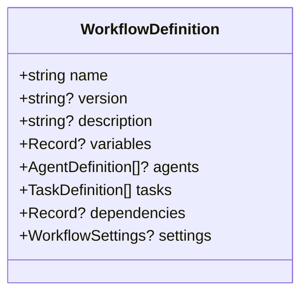
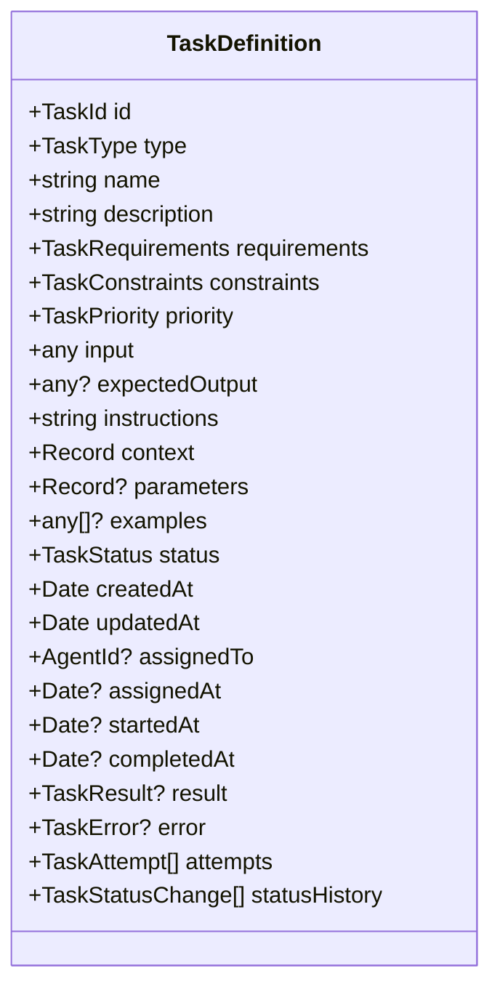
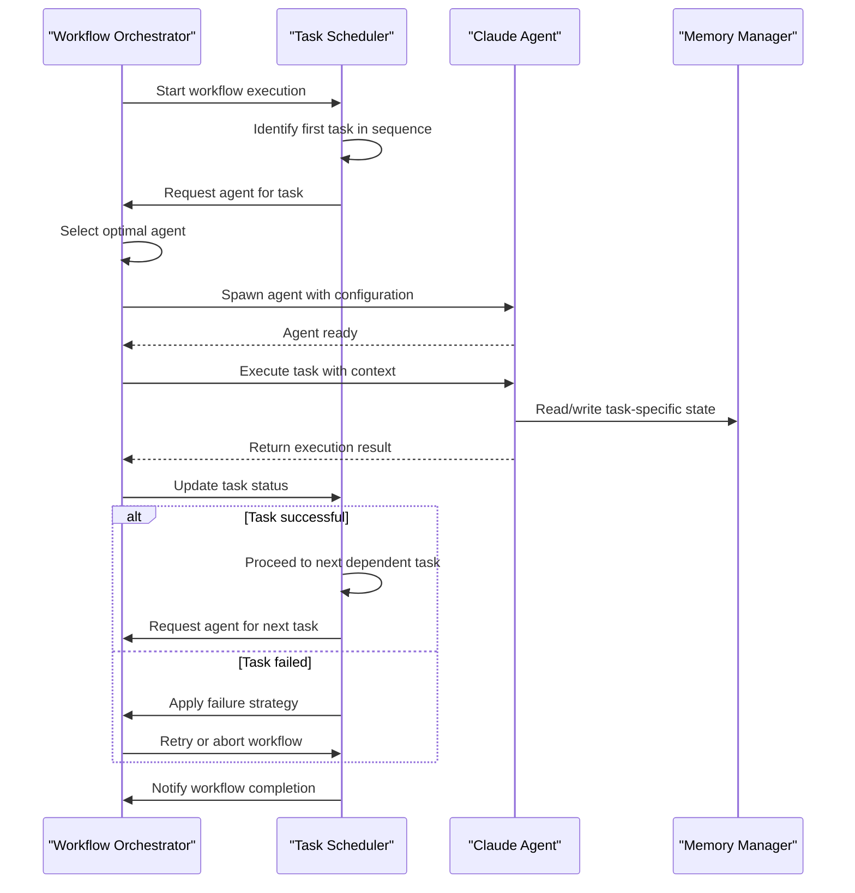
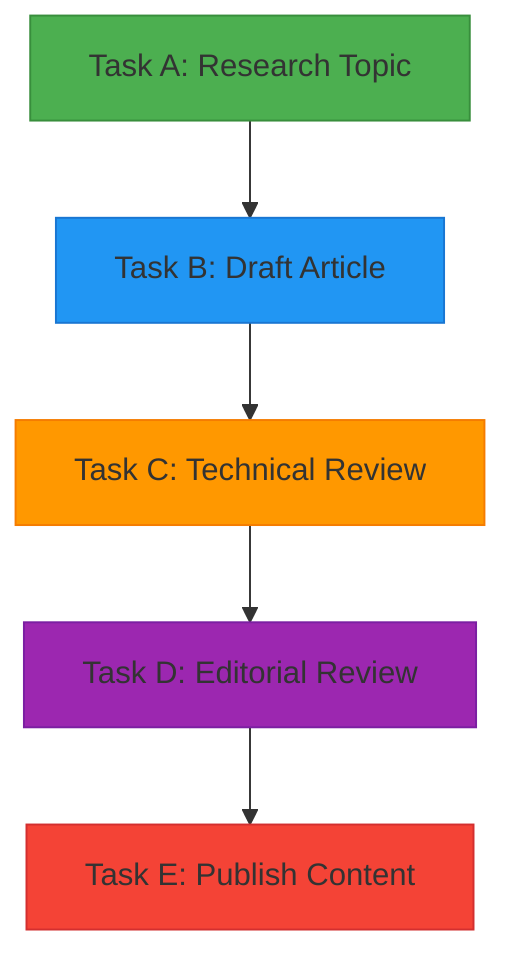
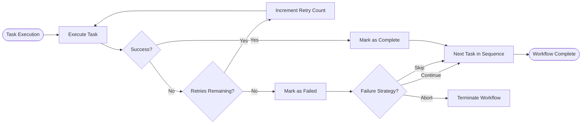
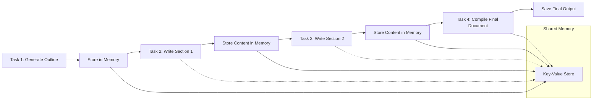
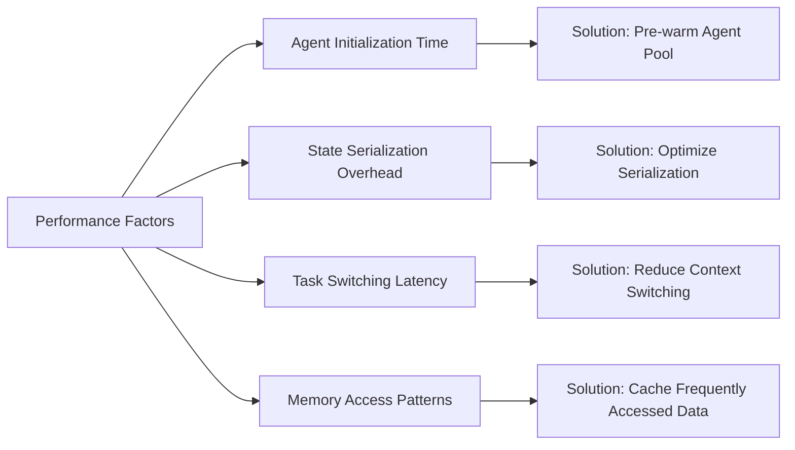
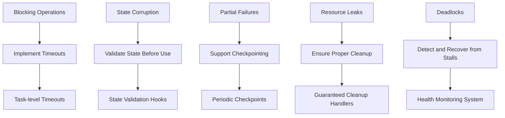

# Sequential Workflows

<cite>
**Referenced Files in This Document**   
- [workflow.ts](file://src/cli/commands/workflow.ts#L67-L76)
- [types.ts](file://src/swarm/types.ts#L352-L391)
- [claude-code-interface.ts](file://src/swarm/claude-code-interface.ts#L115-L1265)
- [examples/02-workflows/sequential](file://examples/02-workflows/sequential)
</cite>

## Table of Contents
1. [Introduction](#introduction)
2. [Workflow Definition Structure](#workflow-definition-structure)
3. [Task Definition and Execution](#task-definition-and-execution)
4. [Sequential Execution Flow](#sequential-execution-flow)
5. [Dependency Management](#dependency-management)
6. [Error Handling and Failure Strategies](#error-handling-and-failure-strategies)
7. [State Propagation Between Tasks](#state-propagation-between-tasks)
8. [Performance Considerations](#performance-considerations)
9. [Common Issues and Solutions](#common-issues-and-solutions)

## Introduction
Sequential Workflows in Claude-Flow enable ordered execution of tasks where each step depends on the successful completion of the previous one. This pattern ensures predictable execution flow, making it ideal for processes requiring strict ordering such as content publishing pipelines, data processing chains, or multi-step validation workflows. The system orchestrates task scheduling, agent assignment, and state management to maintain consistency across sequential operations.

## Workflow Definition Structure

The structure of a workflow is defined by the `WorkflowDefinition` interface, which specifies the core components including tasks, dependencies, variables, and settings.

**Diagram sources**  
- [workflow.ts](file://src/cli/commands/workflow.ts#L67-L76)

**Section sources**  
- [workflow.ts](file://src/cli/commands/workflow.ts#L67-L76)

## Task Definition and Execution

Each task within a sequential workflow is defined using the `TaskDefinition` interface, which includes execution parameters, constraints, input/output specifications, and tracking metadata.

**Diagram sources**  
- [types.ts](file://src/swarm/types.ts#L352-L391)

**Section sources**  
- [types.ts](file://src/swarm/types.ts#L352-L391)

## Sequential Execution Flow

The sequential execution process follows a strict order where tasks are executed one after another based on dependency relationships. The orchestrator manages this flow through the `ClaudeCodeInterface`, which handles agent selection, task execution, and status updates.

**Diagram sources**  
- [claude-code-interface.ts](file://src/swarm/claude-code-interface.ts#L115-L1265)

**Section sources**  
- [claude-code-interface.ts](file://src/swarm/claude-code-interface.ts#L115-L1265)

## Dependency Management

Dependencies between tasks are managed through the `dependencies` field in the workflow definition, which maps task IDs to arrays of prerequisite task IDs. This enables the orchestrator to determine execution order and block subsequent tasks until all dependencies are satisfied.

**Diagram sources**  
- [workflow.ts](file://src/cli/commands/workflow.ts#L67-L76)

**Section sources**  
- [workflow.ts](file://src/cli/commands/workflow.ts#L67-L76)

## Error Handling and Failure Strategies

The system implements robust error handling mechanisms for sequential workflows, including retry logic, failure propagation, and configurable recovery strategies. When a task fails, the orchestrator can either retry the task or terminate the entire workflow based on configuration.

**Section sources**  
- [claude-code-interface.ts](file://src/swarm/claude-code-interface.ts#L115-L1265)

## State Propagation Between Tasks

State is propagated between sequential tasks through shared memory and context objects. Each completed task can store results in the memory manager, which subsequent tasks can access as input for their operations.

**Section sources**  
- [claude-code-interface.ts](file://src/swarm/claude-code-interface.ts#L115-L1265)

## Performance Considerations

Sequential workflows may introduce performance bottlenecks due to their linear nature. Key optimization strategies include agent pre-warming, efficient state management, and minimizing I/O operations between tasks.

**Section sources**  
- [claude-code-interface.ts](file://src/swarm/claude-code-interface.ts#L115-L1265)

## Common Issues and Solutions

Common challenges in sequential workflows include blocking operations, state corruption, and partial failure recovery. The system addresses these through timeout mechanisms, state validation, and checkpointing.

**Section sources**  
- [claude-code-interface.ts](file://src/swarm/claude-code-interface.ts#L115-L1265)