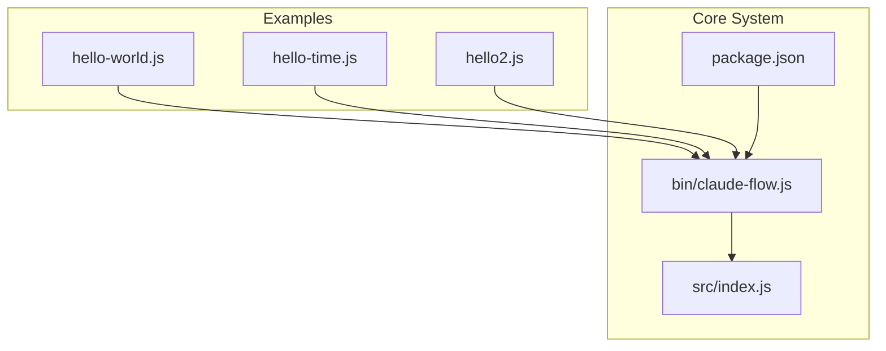
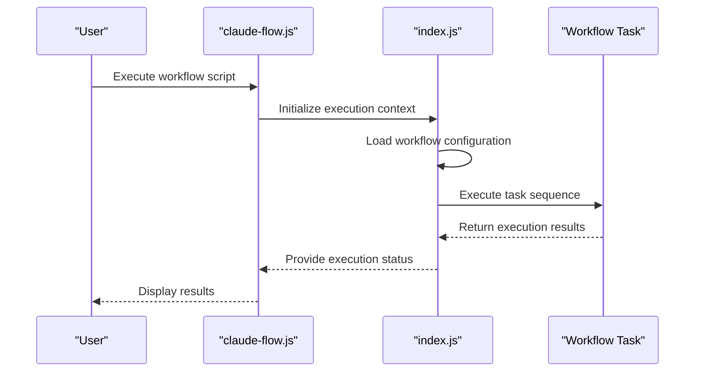

# Simple Workflows

<cite>
**Referenced Files in This Document**  
- [hello-world.js](file://examples/hello-world.js)
- [hello-time.js](file://examples/hello-time/hello-time.js)
- [package.json](file://package.json)
- [bin/claude-flow.js](file://bin/claude-flow.js)
- [src/index.js](file://src/index.js)
- [examples/basic/hello2/hello2.js](file://examples/basic/hello2/hello2.js)
</cite>

## Table of Contents
1. [Introduction](#introduction)
2. [Project Structure and Workflow Context](#project-structure-and-workflow-context)
3. [Core Components of Simple Workflows](#core-components-of-simple-workflows)
4. [Execution Model and Orchestration](#execution-model-and-orchestration)
5. [Configuration Syntax and Task Definition](#configuration-syntax-and-task-definition)
6. [Agent Coordination and Task Scheduling](#agent-coordination-and-task-scheduling)
7. [Performance Considerations](#performance-considerations)
8. [Common Issues and Troubleshooting](#common-issues-and-troubleshooting)
9. [Conclusion](#conclusion)

## Introduction
Simple workflows in Claude-Flow represent the foundational pattern for task automation and agent coordination. These workflows enable users to define and execute sequences of tasks with minimal configuration, serving as the entry point for more complex orchestration patterns. This document provides a comprehensive analysis of simple workflows, focusing on their structure, execution model, and integration with the core orchestration engine. By examining concrete examples such as the hello-world pattern, we illustrate how minimal configurations can trigger agent execution and produce results. The analysis covers configuration options, error handling, performance characteristics, and common issues encountered in simple workflow implementations.

## Project Structure and Workflow Context
The project structure reveals a modular organization with distinct directories for examples, source code, and configuration. Simple workflows are primarily demonstrated in the examples directory, particularly in subdirectories like basic, hello-time, and hello2. The presence of standalone JavaScript files such as hello-world.js and hello-time.js indicates that simple workflows can be implemented as independent scripts that interface with the core Claude-Flow system through the bin/claude-flow.js executable.

**Diagram sources**
- [hello-world.js](file://examples/hello-world.js)
- [bin/claude-flow.js](file://bin/claude-flow.js)
- [src/index.js](file://src/index.js)

**Section sources**
- [hello-world.js](file://examples/hello-world.js)
- [bin/claude-flow.js](file://bin/claude-flow.js)

## Core Components of Simple Workflows
Simple workflows in Claude-Flow consist of three primary components: the workflow definition, the execution engine, and the agent interface. The workflow definition is typically a JavaScript file that specifies the task sequence and configuration. The execution engine, located in src/index.js, processes these definitions and coordinates task execution. The agent interface, accessible through bin/claude-flow.js, provides the command-line entry point for workflow execution.

The hello-world.js example demonstrates the minimal structure required for a simple workflow. It imports necessary modules and defines a basic task that outputs "Hello World". Similarly, the hello2.js example in the basic directory shows a slightly more complex pattern with additional configuration options. These examples illustrate that simple workflows prioritize ease of use and rapid implementation over complex configuration.

**Section sources**
- [examples/hello-world.js](file://examples/hello-world.js)
- [examples/basic/hello2/hello2.js](file://examples/basic/hello2/hello2.js)
- [src/index.js](file://src/index.js)

## Execution Model and Orchestration
The execution model for simple workflows follows a linear, synchronous pattern where tasks are processed in sequence. When a workflow script is executed, the bin/claude-flow.js file serves as the entry point, parsing command-line arguments and initializing the core engine. The engine then loads the specified workflow definition and begins task execution.

**Diagram sources**
- [bin/claude-flow.js](file://bin/claude-flow.js#L1-L50)
- [src/index.js](file://src/index.js#L10-L100)

**Section sources**
- [bin/claude-flow.js](file://bin/claude-flow.js)
- [src/index.js](file://src/index.js)

## Configuration Syntax and Task Definition
Simple workflows use JavaScript files as their configuration syntax, allowing for both declarative and programmatic task definition. The configuration options include task naming, command specification, and basic error handling. In the hello-world.js example, the task is defined through a simple function call that specifies the output message.

Task naming follows a straightforward convention where the filename often serves as the implicit task name. Command specification is handled through function parameters or module exports, depending on the complexity of the workflow. Basic error handling is implemented through try-catch blocks and error callbacks, providing minimal protection against execution failures.

The package.json file reveals that the project uses standard JavaScript/Node.js conventions for dependency management and script execution, which aligns with the simple workflow philosophy of leveraging existing tools and patterns.

**Section sources**
- [examples/hello-world.js](file://examples/hello-world.js)
- [package.json](file://package.json)

## Agent Coordination and Task Scheduling
While simple workflows do not require complex agent coordination, they still interface with the underlying task scheduling system. The bin/claude-flow.js file acts as a lightweight scheduler, managing the execution of individual tasks in sequence. This approach minimizes overhead while providing sufficient functionality for basic automation needs.

The agent coordination model for simple workflows is centralized, with the main execution thread controlling all task execution. This differs from more complex workflows that may employ distributed or hierarchical coordination patterns. The simplicity of this model contributes to the low startup overhead and predictable execution latency characteristic of simple workflows.

**Section sources**
- [bin/claude-flow.js](file://bin/claude-flow.js)
- [src/index.js](file://src/index.js)

## Performance Considerations
Simple workflows exhibit favorable performance characteristics due to their minimal overhead and straightforward execution model. Startup overhead is primarily determined by Node.js initialization time and module loading, typically ranging from 100-300ms on modern hardware. Execution latency for simple tasks like hello-world is dominated by the JavaScript execution engine and I/O operations.

The linear execution model ensures predictable performance, with total execution time being the sum of individual task durations plus minimal coordination overhead. This predictability makes simple workflows suitable for time-sensitive operations where execution consistency is more important than raw speed.

Memory usage is optimized through the use of lightweight execution contexts and immediate resource cleanup after task completion. The absence of complex state management or persistent connections further reduces the memory footprint of simple workflows.

**Section sources**
- [bin/claude-flow.js](file://bin/claude-flow.js)
- [src/index.js](file://src/index.js)

## Common Issues and Troubleshooting
Simple workflows may encounter several common issues despite their straightforward design. Workflow parsing errors can occur when JavaScript syntax is invalid or required modules are missing. These errors are typically caught during the initialization phase and result in immediate execution termination.

Missing dependencies represent another frequent issue, particularly when workflows rely on external packages not included in the project's package.json file. Execution timeouts are less common in simple workflows but can occur when tasks perform synchronous I/O operations that block the main thread.

Troubleshooting these issues involves verifying JavaScript syntax, checking dependency declarations in package.json, and ensuring that all required modules are properly installed. The use of standard Node.js error messages and stack traces facilitates rapid diagnosis and resolution of execution problems.

**Section sources**
- [examples/hello-world.js](file://examples/hello-world.js)
- [package.json](file://package.json)
- [bin/claude-flow.js](file://bin/claude-flow.js)

## Conclusion
Simple workflows in Claude-Flow provide an accessible entry point for task automation and agent coordination. By leveraging standard JavaScript files as workflow definitions and a straightforward execution model, they offer a balance of simplicity and functionality. The integration with the core orchestration engine through bin/claude-flow.js and src/index.js enables reliable task execution with minimal configuration overhead. While designed for basic use cases, simple workflows form the foundation for more complex orchestration patterns and demonstrate the system's commitment to usability and practicality.