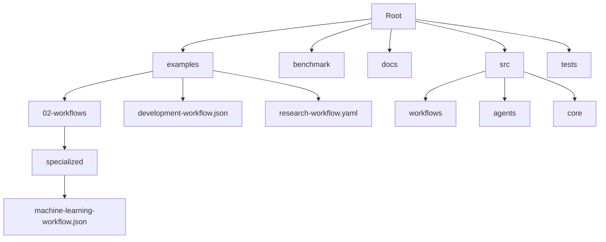
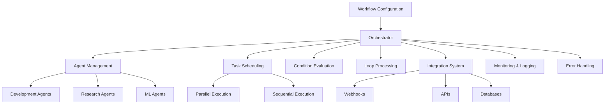
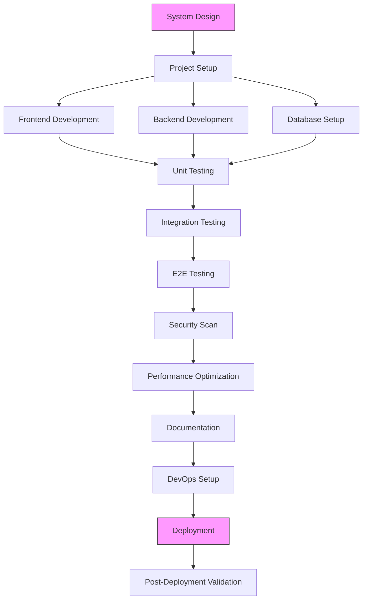
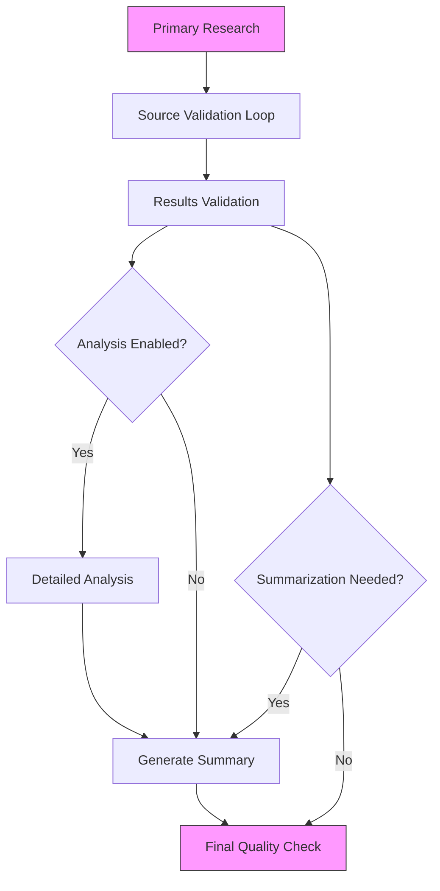
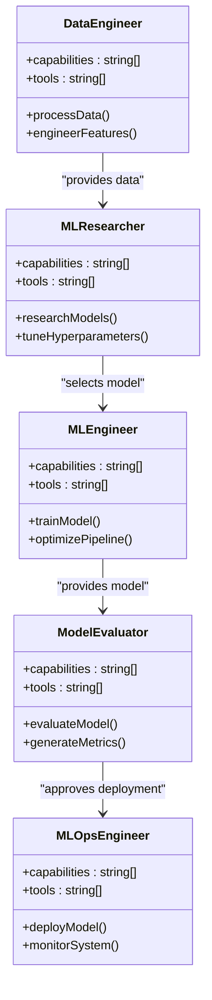
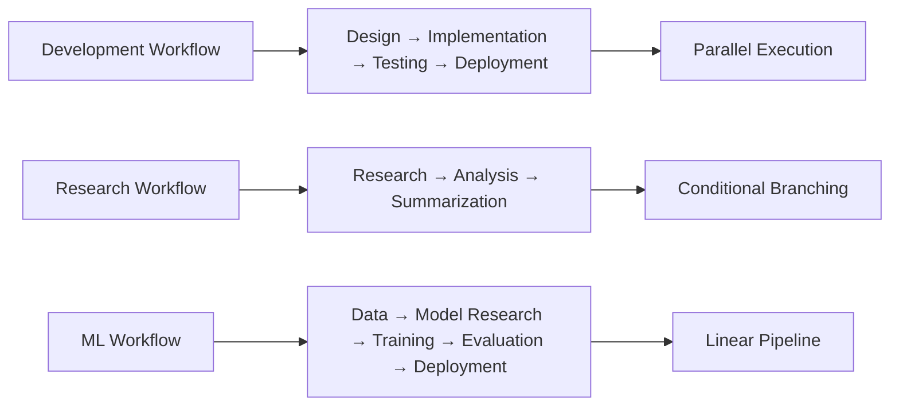

# Specialized Workflows

<cite>
**Referenced Files in This Document**   
- [development-workflow.json](file://examples/development-workflow.json)
- [research-workflow.yaml](file://examples/research-workflow.yaml)
- [machine-learning-workflow.json](file://examples/02-workflows/specialized/machine-learning-workflow.json)
</cite>

## Table of Contents
1. [Introduction](#introduction)
2. [Project Structure](#project-structure)
3. [Core Components](#core-components)
4. [Architecture Overview](#architecture-overview)
5. [Detailed Component Analysis](#detailed-component-analysis)
6. [Dependency Analysis](#dependency-analysis)
7. [Performance Considerations](#performance-considerations)
8. [Troubleshooting Guide](#troubleshooting-guide)
9. [Conclusion](#conclusion)

## Introduction
Specialized workflows in Claude-Flow represent domain-specific orchestration patterns designed to optimize execution for particular use cases such as software development, research, and machine learning. These workflows leverage domain-optimized configurations, specialized agents, and tool integrations to deliver efficient and effective outcomes. This document provides a comprehensive analysis of three specialized workflow examples: development-workflow.json, research-workflow.yaml, and machine-learning-workflow.json, illustrating how Claude-Flow implements domain-specific execution models.

## Project Structure
The project structure reveals a well-organized repository with dedicated directories for examples, benchmarks, documentation, and source code. Specialized workflows are primarily located in the examples directory, with subdirectories categorizing different types of workflows. The presence of both JSON and YAML configuration files indicates flexible workflow definition formats. The structure supports modular design with clear separation between general framework components and domain-specific implementations.

**Diagram sources**
- [examples/development-workflow.json](file://examples/development-workflow.json)
- [examples/research-workflow.yaml](file://examples/research-workflow.yaml)
- [examples/02-workflows/specialized/machine-learning-workflow.json](file://examples/02-workflows/specialized/machine-learning-workflow.json)

**Section sources**
- [examples/development-workflow.json](file://examples/development-workflow.json)
- [examples/research-workflow.yaml](file://examples/research-workflow.yaml)
- [examples/02-workflows/specialized/machine-learning-workflow.json](file://examples/02-workflows/specialized/machine-learning-workflow.json)

## Core Components
The core components of specialized workflows in Claude-Flow consist of domain-specific agents, tasks, conditions, loops, and integrations. Each workflow is configured with specialized agents tailored to particular domains, such as developers for software development, researchers for academic research, and data scientists for machine learning. These agents are assigned specific tasks that follow domain-optimized execution patterns, with dependencies and conditions ensuring proper sequencing and quality control.

**Section sources**
- [examples/development-workflow.json](file://examples/development-workflow.json#L1-L100)
- [examples/research-workflow.yaml](file://examples/research-workflow.yaml#L1-L50)
- [examples/02-workflows/specialized/machine-learning-workflow.json](file://examples/02-workflows/specialized/machine-learning-workflow.json#L1-L30)

## Architecture Overview
The architecture of specialized workflows in Claude-Flow follows a domain-driven design pattern where each workflow type is optimized for specific operational requirements. The system employs a workflow orchestrator that manages the execution of tasks by specialized agents, coordinates dependencies, evaluates conditions, and handles errors according to domain-specific policies. The architecture supports parallel execution, conditional branching, looping constructs, and integration with external systems through webhooks and APIs.

**Diagram sources**
- [examples/development-workflow.json](file://examples/development-workflow.json#L1-L50)
- [examples/research-workflow.yaml](file://examples/research-workflow.yaml#L1-L50)
- [examples/02-workflows/specialized/machine-learning-workflow.json](file://examples/02-workflows/specialized/machine-learning-workflow.json#L1-L20)

## Detailed Component Analysis

### Development Workflow Analysis
The development-workflow.json represents a comprehensive software development lifecycle workflow with specialized agents for architecture, coding, testing, security, and DevOps. This workflow demonstrates domain-optimized execution for software development projects.

**Diagram sources**
- [examples/development-workflow.json](file://examples/development-workflow.json#L150-L200)

**Section sources**
- [examples/development-workflow.json](file://examples/development-workflow.json#L1-L631)

### Research Workflow Analysis
The research-workflow.yaml implements a multi-stage research process with conditional execution and loops for source validation. This workflow is optimized for academic and market research domains.

**Diagram sources**
- [examples/research-workflow.yaml](file://examples/research-workflow.yaml#L80-L120)

**Section sources**
- [examples/research-workflow.yaml](file://examples/research-workflow.yaml#L1-L302)

### Machine Learning Workflow Analysis
The machine-learning-workflow.json defines an end-to-end ML pipeline from data preparation to model deployment. This workflow is specifically designed for machine learning operations with specialized agents for data engineering, model research, and MLOps.

**Diagram sources**
- [examples/02-workflows/specialized/machine-learning-workflow.json](file://examples/02-workflows/specialized/machine-learning-workflow.json#L10-L50)

**Section sources**
- [examples/02-workflows/specialized/machine-learning-workflow.json](file://examples/02-workflows/specialized/machine-learning-workflow.json#L1-L135)

## Dependency Analysis
The specialized workflows demonstrate clear dependency chains that reflect domain-specific execution patterns. In the development workflow, tasks follow a logical progression from design to deployment with parallel execution of frontend and backend development. The research workflow uses conditional dependencies to control analysis and summarization based on data quality and configuration. The machine learning workflow establishes a linear pipeline from data preparation to model deployment, ensuring proper sequencing of ML-specific operations.

**Diagram sources**
- [examples/development-workflow.json](file://examples/development-workflow.json#L200-L250)
- [examples/research-workflow.yaml](file://examples/research-workflow.yaml#L150-L180)
- [examples/02-workflows/specialized/machine-learning-workflow.json](file://examples/02-workflows/specialized/machine-learning-workflow.json#L50-L80)

**Section sources**
- [examples/development-workflow.json](file://examples/development-workflow.json#L200-L250)
- [examples/research-workflow.yaml](file://examples/research-workflow.yaml#L150-L180)
- [examples/02-workflows/specialized/machine-learning-workflow.json](file://examples/02-workflows/specialized/machine-learning-workflow.json#L50-L80)

## Performance Considerations
Specialized workflows in Claude-Flow incorporate several performance optimization strategies tailored to their respective domains. The development workflow enables parallel execution of frontend and backend development tasks, significantly reducing overall execution time. The research workflow limits source validation to a maximum of 10 iterations to prevent excessive processing. The machine learning workflow supports distributed training for computationally intensive model training tasks. Resource allocation is explicitly defined for each agent, ensuring appropriate compute resources are allocated based on task requirements.

**Section sources**
- [examples/development-workflow.json](file://examples/development-workflow.json#L500-L550)
- [examples/research-workflow.yaml](file://examples/research-workflow.yaml#L250-L280)
- [examples/02-workflows/specialized/machine-learning-workflow.json](file://examples/02-workflows/specialized/machine-learning-workflow.json#L100-L120)

## Troubleshooting Guide
Common issues in specialized workflows include domain knowledge gaps, tool compatibility problems, and specialized error conditions. The development workflow addresses potential test failures through a retry loop with a maximum of three iterations. The research workflow includes a fallback research task that executes if the primary research task fails, ensuring workflow completion even under suboptimal conditions. The machine learning workflow defines quality thresholds for both model performance and data quality, preventing deployment of substandard models.

**Section sources**
- [examples/development-workflow.json](file://examples/development-workflow.json#L300-L350)
- [examples/research-workflow.yaml](file://examples/research-workflow.yaml#L200-L230)
- [examples/02-workflows/specialized/machine-learning-workflow.json](file://examples/02-workflows/specialized/machine-learning-workflow.json#L120-L135)

## Conclusion
Specialized workflows in Claude-Flow demonstrate sophisticated domain-specific orchestration patterns that optimize execution for particular use cases. By leveraging specialized agents, domain-optimized task sequences, and configurable execution parameters, these workflows deliver efficient and effective outcomes in software development, research, and machine learning domains. The implementation shows careful consideration of performance, reliability, and quality control, with features like parallel execution, conditional branching, looping constructs, and comprehensive error handling. These workflows serve as excellent examples of how to design and implement domain-specific orchestration patterns in agentic systems.