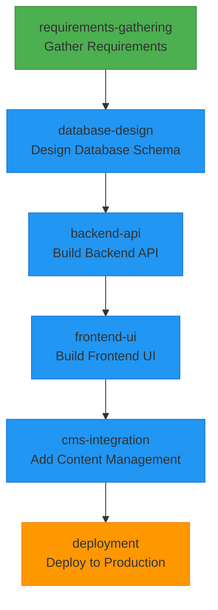
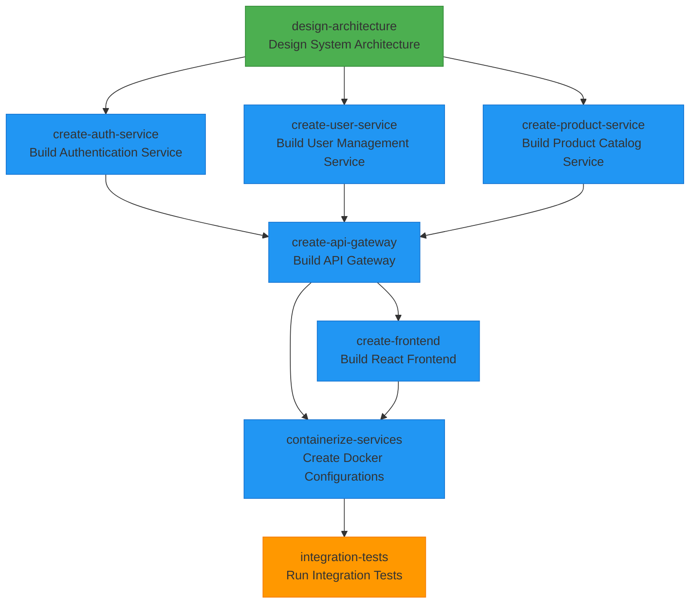
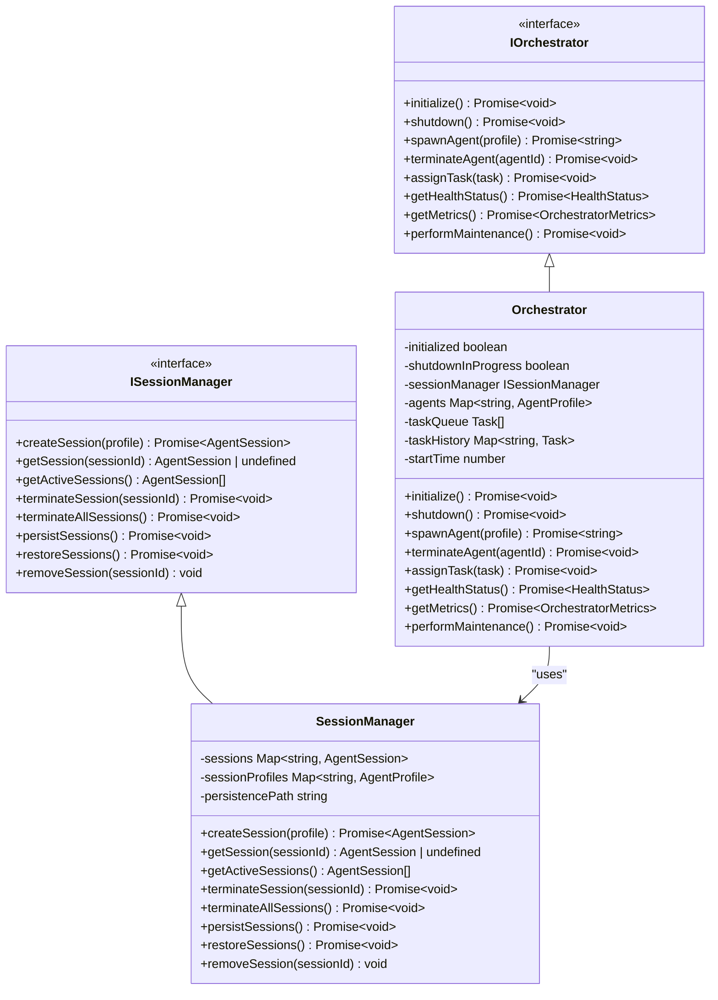
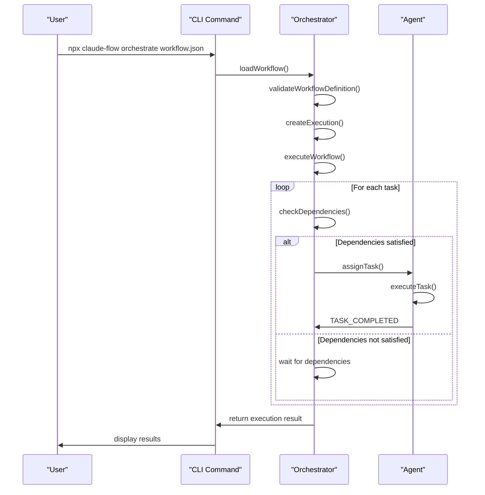
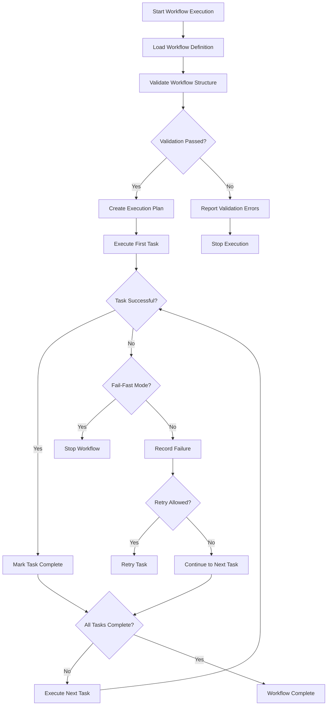

# Workflow Examples

<cite>
**Referenced Files in This Document**   
- [hello-world-workflow.json](file://examples/02-workflows/simple/hello-world-workflow.json)
- [blog-platform-workflow.json](file://examples/02-workflows/sequential/blog-platform-workflow.json)
- [data-processing-workflow.json](file://examples/02-workflows/parallel/data-processing-workflow.json)
- [microservices-workflow.json](file://examples/02-workflows/complex/microservices-workflow.json)
- [workflow.ts](file://src/cli/commands/workflow.ts)
- [orchestrator.ts](file://src/core/orchestrator.ts)
</cite>

## Table of Contents
1. [Introduction](#introduction)
2. [Workflow Patterns Overview](#workflow-patterns-overview)
3. [Simple Workflows](#simple-workflows)
4. [Sequential Workflows](#sequential-workflows)
5. [Parallel Workflows](#parallel-workflows)
6. [Complex Workflows](#complex-workflows)
7. [Workflow Orchestration Engine](#workflow-orchestration-engine)
8. [Execution Models and Configuration](#execution-models-and-configuration)
9. [Error Handling and Validation](#error-handling-and-validation)
10. [Performance Considerations](#performance-considerations)

## Introduction
This document provides a comprehensive analysis of workflow patterns in Claude-Flow, demonstrating various coordination strategies for multi-agent systems. The examples illustrate how different workflow structures can be used to orchestrate agent collaboration for various use cases, from simple single-agent tasks to complex multi-agent systems with sophisticated dependency management. The document examines actual workflow definitions from the codebase and analyzes the underlying orchestration engine that manages workflow execution.

## Workflow Patterns Overview

Claude-Flow supports multiple workflow patterns designed for different use cases and coordination requirements. These patterns range from simple linear execution to complex parallel and hierarchical workflows. Each pattern serves specific purposes and offers different trade-offs in terms of complexity, execution speed, and resource utilization.

The workflow system is designed to be flexible and extensible, allowing users to define custom workflows that match their specific requirements. Workflows are defined in JSON format and contain specifications for agents, tasks, dependencies, and execution parameters. The orchestration engine interprets these definitions and manages the execution of tasks according to the specified patterns.

The main workflow patterns supported by Claude-Flow include:
- **Simple workflows**: Single-agent workflows for basic tasks
- **Sequential workflows**: Step-by-step execution with dependencies between tasks
- **Parallel workflows**: Concurrent execution of independent tasks
- **Complex workflows**: Advanced patterns with multiple agents, conditional execution, and sophisticated coordination

These patterns can be combined and customized to create workflows that match specific use cases, from simple automation tasks to complex software development pipelines.

**Section sources**
- [README.md](file://examples/02-workflows/README.md#L1-L108)

## Simple Workflows

Simple workflows represent the most basic pattern in Claude-Flow, designed for straightforward tasks that can be completed by a single agent. These workflows are ideal for learning the system, testing configurations, or executing simple automation tasks that don't require coordination between multiple agents.

The hello-world-workflow.json example demonstrates the structure of a simple workflow. It contains a single agent of type "developer" with code-generation capabilities and one task that instructs the agent to create a simple hello world application. The workflow is configured to execute in sequential mode, although this is somewhat redundant since there is only one task.

```json
{
  "name": "Hello World Workflow",
  "description": "Simple single-agent workflow to demonstrate basics",
  "agents": [
    {
      "id": "greeter",
      "name": "Greeting Agent",
      "type": "developer",
      "capabilities": ["code-generation"],
      "configuration": {
        "temperature": 0.7
      }
    }
  ],
  "tasks": [
    {
      "id": "create-hello-world",
      "name": "Create Hello World",
      "description": "Create a simple hello world application",
      "agentId": "greeter",
      "type": "coding",
      "input": {
        "language": "javascript",
        "requirements": "Create a hello world script that prints a greeting"
      },
      "output": {
        "artifacts": ["hello.js"]
      }
    }
  ],
  "execution": {
    "mode": "sequential"
  }
}
```

Simple workflows are characterized by their minimal complexity and straightforward execution model. They are useful for:
- Learning and onboarding new users to the system
- Testing agent configurations and capabilities
- Executing simple automation tasks
- Serving as building blocks for more complex workflows

The simplicity of these workflows makes them easy to understand and modify, making them ideal for experimentation and prototyping.

**Section sources**
- [hello-world-workflow.json](file://examples/02-workflows/simple/hello-world-workflow.json#L1-L34)

## Sequential Workflows

Sequential workflows are designed for tasks that must be executed in a specific order, where each step depends on the completion of previous steps. This pattern is commonly used for processes that have a natural progression, such as software development, data processing pipelines, or multi-step analysis tasks.

The blog-platform-workflow.json example demonstrates a sequential workflow for building a blog platform. It involves six specialized agents: a planner, database designer, backend developer, frontend developer, content developer, and deployer. The workflow follows a logical progression from requirements gathering through deployment, with each task depending on the completion of the previous task.



**Diagram sources**
- [blog-platform-workflow.json](file://examples/02-workflows/sequential/blog-platform-workflow.json#L1-L120)

The sequential workflow pattern offers several advantages:
- **Predictable execution**: Tasks execute in a predetermined order, making the workflow behavior easy to understand and debug
- **Clear dependencies**: Each task explicitly declares its dependencies, ensuring that prerequisites are met before execution
- **Progressive development**: Complex systems can be built incrementally, with each step building on the previous one
- **Easier debugging**: Issues can be isolated to specific steps in the workflow

Sequential workflows are particularly well-suited for software development processes, where architectural decisions must be made before implementation, and implementation must be completed before deployment. They are also useful for data processing pipelines, where data must be transformed in a specific sequence of operations.

The execution configuration for sequential workflows typically includes options for saving progress and notifications, allowing users to monitor the workflow's progress and be alerted to completion or errors.

**Section sources**
- [blog-platform-workflow.json](file://examples/02-workflows/sequential/blog-platform-workflow.json#L1-L120)

## Parallel Workflows

Parallel workflows enable the concurrent execution of multiple tasks, significantly reducing overall execution time for workflows with independent operations. This pattern is particularly effective for data processing tasks, testing scenarios, or any situation where multiple similar operations can be performed simultaneously.

The data-processing-workflow.json example demonstrates a parallel workflow for processing different data formats. It uses three specialized agents to process CSV, JSON, and XML data simultaneously, followed by a single aggregator agent that combines the results. The workflow is configured with a maximum concurrency of 3, matching the number of parallel processing agents.

```json
{
  "name": "Parallel Data Processing",
  "description": "Process multiple data sources in parallel",
  "agents": [
    {
      "id": "csv-processor",
      "name": "CSV Data Agent",
      "type": "analyzer",
      "capabilities": ["data-processing", "csv-parsing"]
    },
    {
      "id": "json-processor",
      "name": "JSON Data Agent",
      "type": "analyzer",
      "capabilities": ["data-processing", "json-parsing"]
    },
    {
      "id": "xml-processor",
      "name": "XML Data Agent",
      "type": "analyzer",
      "capabilities": ["data-processing", "xml-parsing"]
    },
    {
      "id": "aggregator",
      "name": "Data Aggregator",
      "type": "coordinator",
      "capabilities": ["data-aggregation", "reporting"]
    }
  ],
  "tasks": [
    {
      "id": "process-csv",
      "name": "Process CSV Data",
      "agentId": "csv-processor",
      "type": "data-processing",
      "parallel": true,
      "input": {
        "source": "data/sales.csv",
        "operations": ["validate", "transform", "summarize"]
      }
    },
    {
      "id": "process-json",
      "name": "Process JSON Data",
      "agentId": "json-processor",
      "type": "data-processing",
      "parallel": true,
      "input": {
        "source": "data/inventory.json",
        "operations": ["validate", "transform", "summarize"]
      }
    },
    {
      "id": "process-xml",
      "name": "Process XML Data",
      "agentId": "xml-processor",
      "type": "data-processing",
      "parallel": true,
      "input": {
        "source": "data/customers.xml",
        "operations": ["validate", "transform", "summarize"]
      }
    },
    {
      "id": "aggregate-results",
      "name": "Aggregate All Results",
      "agentId": "aggregator",
      "type": "aggregation",
      "dependencies": ["process-csv", "process-json", "process-xml"],
      "input": {
        "format": "unified-report",
        "includeCharts": true
      }
    }
  ],
  "execution": {
    "mode": "parallel",
    "maxConcurrency": 3,
    "timeout": 300000
  }
}
```

The parallel workflow pattern offers several key benefits:
- **Reduced execution time**: Multiple tasks can be processed simultaneously, significantly reducing overall workflow duration
- **Resource efficiency**: Multiple agents can work concurrently, making better use of available computational resources
- **Scalability**: The pattern can be easily scaled by adding more processing agents and tasks
- **Fault isolation**: Failures in one parallel branch do not necessarily affect other branches

The workflow configuration includes a timeout of 300,000 milliseconds (5 minutes), which helps prevent the workflow from running indefinitely if a task encounters issues. The aggregator task has dependencies on all three processing tasks, ensuring that it only executes after all data has been processed.

Parallel workflows are particularly effective for:
- Processing large datasets across multiple formats
- Running multiple tests or analyses simultaneously
- Performing similar operations on different data sources
- Any scenario where tasks are independent and can be executed concurrently

**Section sources**
- [data-processing-workflow.json](file://examples/02-workflows/parallel/data-processing-workflow.json#L1-L81)

## Complex Workflows

Complex workflows represent the most sophisticated pattern in Claude-Flow, designed for large-scale projects that require coordination between multiple specialized agents with complex dependencies. These workflows often combine elements of sequential and parallel execution, with sophisticated error handling and quality control mechanisms.

The microservices-workflow.json example demonstrates a complex workflow for building a complete microservices application. It involves eight specialized agents with distinct roles, including an architect, multiple developers, a DevOps engineer, and a QA engineer. The workflow combines parallel execution for independent service development with sequential dependencies for integration and testing.



**Diagram sources**
- [microservices-workflow.json](file://examples/02-workflows/complex/microservices-workflow.json#L1-L166)

The complex workflow pattern includes several advanced features:
- **Hybrid execution model**: Combines parallel execution for independent tasks with sequential dependencies for integration points
- **Checkpoints**: The workflow defines specific checkpoints at key milestones (architecture design, API gateway creation, integration tests) that can be used for progress tracking and rollback
- **Rollback capability**: The workflow supports rollback operations, allowing the system to revert to a previous state if issues are encountered
- **Quality assurance**: Built-in quality checks including code review, security scanning, and performance thresholds
- **Resource-based parallelism strategy**: The workflow uses a resource-based strategy to determine optimal parallelism, considering system constraints

The execution configuration specifies a "smart" execution mode with a maximum of 4 concurrent tasks, balancing parallelism with resource constraints. The quality section defines specific requirements for code review, security scanning, and performance thresholds, ensuring that the final product meets specified standards.

Complex workflows are essential for:
- Large-scale software development projects
- Enterprise applications with multiple interconnected components
- Systems requiring rigorous quality assurance and testing
- Projects with complex dependency relationships between components

These workflows demonstrate the full capabilities of the Claude-Flow orchestration system, showing how multiple agents can be coordinated to accomplish sophisticated tasks that would be difficult or impossible for a single agent to complete.

**Section sources**
- [microservices-workflow.json](file://examples/02-workflows/complex/microservices-workflow.json#L1-L166)

## Workflow Orchestration Engine

The workflow orchestration engine is the core component responsible for managing workflow execution in Claude-Flow. It interprets workflow definitions, coordinates agent activities, manages task dependencies, and ensures that workflows execute according to their specified patterns. The engine is implemented in the orchestrator.ts file and provides a robust foundation for multi-agent coordination.

The orchestration engine follows a modular architecture with several key components:
- **Session Manager**: Manages agent sessions, including creation, termination, and persistence
- **Task Queue**: Manages the queue of pending tasks and their execution order
- **Event Bus**: Facilitates communication between components through a publish-subscribe pattern
- **Health Monitoring**: Tracks the health status of the orchestrator and its components
- **Metrics Collection**: Collects performance metrics for monitoring and optimization



**Diagram sources**
- [orchestrator.ts](file://src/core/orchestrator.ts#L1-L1314)

The orchestration engine handles several critical functions:
- **Agent Lifecycle Management**: Spawning and terminating agents based on workflow requirements
- **Task Scheduling**: Managing the execution queue and assigning tasks to appropriate agents
- **Dependency Resolution**: Ensuring that tasks are only executed when their dependencies are satisfied
- **Error Handling**: Managing task failures and implementing recovery strategies
- **State Persistence**: Saving and restoring workflow state to support resumable execution
- **Health Monitoring**: Tracking the health of the orchestrator and its components

The engine uses circuit breakers to protect against cascading failures in critical operations like health checks and task assignment. It also implements retry logic for operations that may fail due to transient issues, such as creating agent sessions or terminating terminals.

The event-driven architecture allows for loose coupling between components, with the event bus facilitating communication through events like TASK_STARTED, TASK_COMPLETED, TASK_FAILED, AGENT_SPAWNED, and SYSTEM_ERROR. This design enables extensibility and makes it easier to add new features without modifying existing code.

**Section sources**
- [orchestrator.ts](file://src/core/orchestrator.ts#L1-L1314)

## Execution Models and Configuration

The workflow execution models in Claude-Flow provide different strategies for managing task execution based on the specific requirements of each workflow. These models are configured through the "execution" section of workflow definitions and determine how tasks are scheduled and executed.

The main execution models include:
- **Sequential**: Tasks execute one after another in the order they are defined
- **Parallel**: Independent tasks execute simultaneously up to a specified concurrency limit
- **Smart**: A hybrid model that combines sequential and parallel execution based on task dependencies and resource availability



**Diagram sources**
- [workflow.ts](file://src/cli/commands/workflow.ts#L1-L781)
- [orchestrator.ts](file://src/core/orchestrator.ts#L1-L1314)

The execution configuration options include:
- **maxConcurrency**: Limits the number of tasks that can execute simultaneously
- **timeout**: Specifies a maximum execution time for the workflow
- **retryPolicy**: Defines how failed tasks should be retried (none, immediate, exponential)
- **failurePolicy**: Determines how the workflow should handle task failures (fail-fast, continue, ignore)
- **checkpoints**: Defines specific points in the workflow where progress can be saved
- **rollback**: Enables the ability to revert to a previous state if needed

The "smart" execution mode, used in complex workflows, analyzes the dependency graph and resource availability to optimize task scheduling. It can execute independent tasks in parallel while respecting sequential dependencies, maximizing efficiency without violating workflow constraints.

Configuration options can be overridden at runtime through command-line parameters, allowing users to adjust workflow behavior without modifying the workflow definition. For example, the --fail-fast option can be used to stop a workflow immediately when a task fails, regardless of the failure policy specified in the workflow definition.

The orchestration engine validates workflow configurations before execution, checking for issues such as circular dependencies, missing agents, or invalid task dependencies. This validation helps prevent runtime errors and ensures that workflows are properly structured before they begin execution.

**Section sources**
- [workflow.ts](file://src/cli/commands/workflow.ts#L1-L781)
- [orchestrator.ts](file://src/core/orchestrator.ts#L1-L1314)

## Error Handling and Validation

Error handling and validation are critical aspects of workflow execution in Claude-Flow, ensuring that workflows are robust and can recover from various failure scenarios. The system implements comprehensive validation and error handling mechanisms at multiple levels, from workflow definition validation to runtime error recovery.

Workflow validation occurs before execution and checks for several potential issues:
- Missing required fields (name, tasks, etc.)
- Duplicate task or agent IDs
- Unknown agent assignments
- Circular dependencies
- Invalid task dependencies



**Diagram sources**
- [workflow.ts](file://src/cli/commands/workflow.ts#L1-L781)

The validation process is implemented in the validateWorkflowDefinition function in workflow.ts, which performs both basic and strict validation. Basic validation checks for required fields and structural integrity, while strict validation includes additional checks such as detecting circular dependencies in the task dependency graph.

Runtime error handling is managed through the event-driven architecture of the orchestrator. When a task fails, the orchestrator receives a TASK_FAILED event and can implement various recovery strategies based on the workflow configuration:
- **Retry**: Automatically retry the failed task, optionally with exponential backoff
- **Fail-fast**: Stop the entire workflow when any task fails
- **Continue**: Continue executing subsequent tasks that don't depend on the failed task
- **Fallback**: Execute an alternative task or workflow path

The orchestrator uses circuit breakers to prevent cascading failures in critical operations. For example, if health checks fail repeatedly, the circuit breaker will open and prevent further health checks for a period, avoiding overwhelming the system with requests.

Error handling strategies can be customized through the workflow configuration, allowing users to define how their workflows should respond to different types of failures. This flexibility enables workflows to be resilient in the face of transient errors while still failing fast when appropriate.

**Section sources**
- [workflow.ts](file://src/cli/commands/workflow.ts#L1-L781)
- [orchestrator.ts](file://src/core/orchestrator.ts#L1-L1314)

## Performance Considerations

Performance optimization in Claude-Flow workflows involves balancing execution speed, resource utilization, and reliability. The system provides several mechanisms for optimizing workflow performance, from parallel execution to resource management and caching strategies.

Key performance considerations include:

**Parallelization Strategies**
- Identify independent tasks that can be executed in parallel
- Use the maxConcurrency parameter to optimize resource utilization
- Balance parallelism with system resource constraints
- Consider the overhead of agent creation and context switching

**Resource Allocation**
- Monitor CPU and memory usage during workflow execution
- Configure appropriate resource limits for agents
- Use the resource-based parallelism strategy for complex workflows
- Consider the impact of I/O operations on overall performance

**Caching and State Management**
- Enable session persistence to avoid recreating agents for similar tasks
- Use checkpoints to save progress and enable resumable execution
- Implement efficient state serialization and deserialization
- Consider the trade-offs between memory usage and execution speed

**Optimization Tips**
- Minimize dependencies between tasks to enable more parallel execution
- Use appropriate failure policies to avoid unnecessary retries
- Monitor task execution times to identify bottlenecks
- Optimize agent configurations for specific task types
- Use the watch mode to monitor workflow progress and identify performance issues

The orchestrator collects comprehensive metrics that can be used to analyze workflow performance, including:
- Task completion times
- Agent utilization
- Memory and CPU usage
- Queue lengths
- Error rates

These metrics can be accessed through the getMetrics() method of the orchestrator and used to identify performance bottlenecks and optimize workflow configurations. The system also supports periodic maintenance tasks that can help maintain optimal performance, such as cleaning up terminated sessions and old task history.

When designing workflows for optimal performance, consider the following guidelines:
- Start with a simple workflow and gradually add complexity
- Use parallel execution for independent tasks
- Minimize the number of agents to reduce coordination overhead
- Use appropriate timeouts to prevent workflows from hanging
- Monitor resource usage and adjust configurations as needed

By carefully considering these performance factors, users can create workflows that execute efficiently while maintaining reliability and scalability.

**Section sources**
- [orchestrator.ts](file://src/core/orchestrator.ts#L1-L1314)
- [workflow.ts](file://src/cli/commands/workflow.ts#L1-L781)