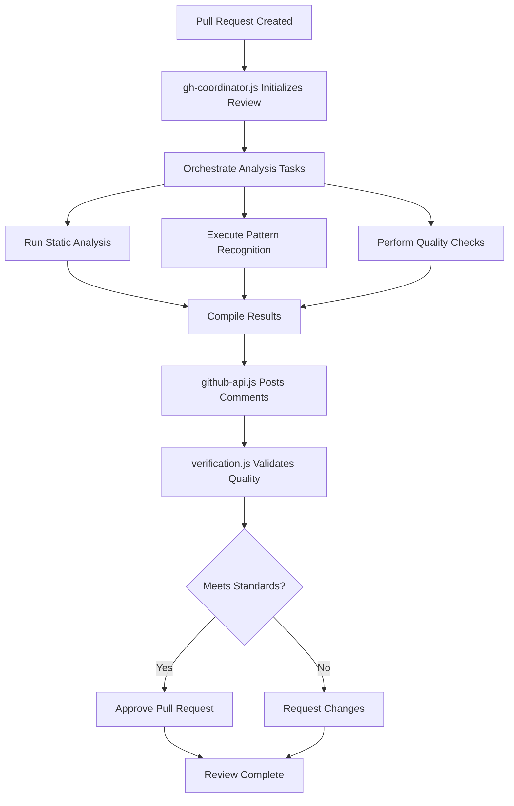
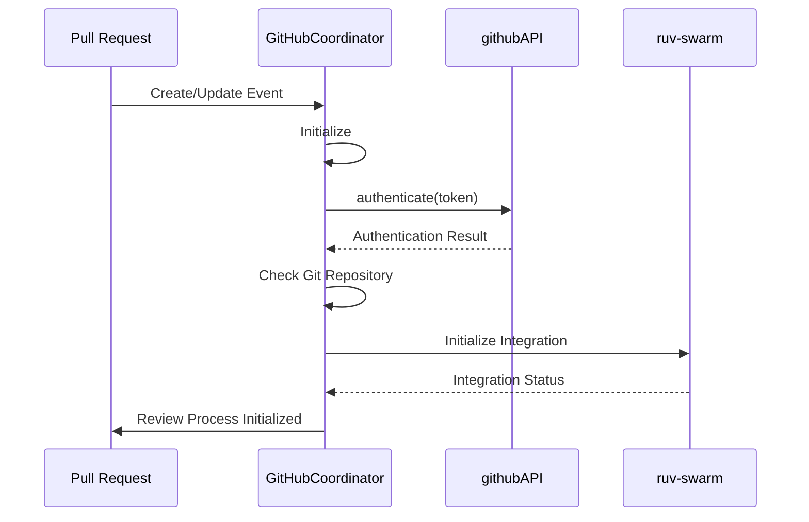

# Code Review

<cite>
**Referenced Files in This Document**   
- [gh-coordinator.js](file://src/cli/simple-commands/github/gh-coordinator.js#L0-L606)
- [github-api.js](file://src/cli/simple-commands/github/github-api.js#L0-L625)
- [verification.js](file://src/cli/simple-commands/verification.js#L0-L532)
</cite>

## Table of Contents
1. [Introduction](#introduction)
2. [Code Review Process Overview](#code-review-process-overview)
3. [Core Components](#core-components)
4. [Review Initiation with gh-coordinator.js](#review-initiation-with-gh-coordinatorjs)
5. [Comment Posting via github-api.js](#comment-posting-via-github-apijs)
6. [Code Quality Verification System](#code-quality-verification-system)
7. [Integration with External Systems](#integration-with-external-systems)
8. [Common Issues and Troubleshooting](#common-issues-and-troubleshooting)
9. [Best Practices and Configuration](#best-practices-and-configuration)
10. [Conclusion](#conclusion)

## Introduction

Claude-Flow implements an automated code review system that integrates with GitHub's pull request workflow to enforce quality standards, perform static analysis, and ensure code consistency. This document details the implementation of the code review sub-feature, focusing on how the system initiates reviews, posts comments, validates code quality, and integrates with other components. The system is designed to work seamlessly within the development workflow, providing immediate feedback while maintaining high code quality standards through automated verification and enforcement mechanisms.

**Section sources**
- [gh-coordinator.js](file://src/cli/simple-commands/github/gh-coordinator.js#L0-L606)
- [github-api.js](file://src/cli/simple-commands/github/github-api.js#L0-L625)
- [verification.js](file://src/cli/simple-commands/verification.js#L0-L532)

## Code Review Process Overview

The automated code review process in Claude-Flow follows a structured workflow that begins with pull request creation and concludes with quality gate enforcement. The system orchestrates multiple components to perform comprehensive code analysis, including static checks, pattern recognition, and quality validation. When a pull request is created or updated, the `gh-coordinator.js` module initiates the review process by coordinating with various analysis tools and services. The `github-api.js` component handles communication with the GitHub API to post review comments and manage pull request metadata. Finally, the `verification.js` system enforces quality gates by validating that code changes meet predefined standards before approval.

The process flow can be summarized as follows:
1. Pull request event triggers review initiation
2. Coordinator orchestrates analysis tasks
3. Various checks are performed (linting, testing, security)
4. Results are compiled and posted as comments
5. Quality verification determines approval eligibility
6. Final review status is set based on verification outcome



**Diagram sources**
- [gh-coordinator.js](file://src/cli/simple-commands/github/gh-coordinator.js#L0-L606)
- [github-api.js](file://src/cli/simple-commands/github/github-api.js#L0-L625)
- [verification.js](file://src/cli/simple-commands/verification.js#L0-L532)

## Core Components

The code review system consists of three primary components that work together to provide comprehensive code analysis and quality enforcement. The `gh-coordinator.js` serves as the orchestration layer, managing the overall review process and coordinating between different analysis tools. The `github-api.js` module provides the interface to GitHub's API, enabling the system to post comments, manage pull requests, and retrieve repository information. The `verification.js` component acts as the quality gate, validating that code changes meet predefined standards through a series of automated checks.

These components are designed with clear separation of concerns, allowing each to focus on its specific responsibilities while communicating through well-defined interfaces. The coordinator initiates the review process and manages workflow, the API client handles external communication, and the verification system enforces quality standards. This modular architecture enables easy maintenance and extension of the code review capabilities.

**Section sources**
- [gh-coordinator.js](file://src/cli/simple-commands/github/gh-coordinator.js#L0-L606)
- [github-api.js](file://src/cli/simple-commands/github/github-api.js#L0-L625)
- [verification.js](file://src/cli/simple-commands/verification.js#L0-L532)

## Review Initiation with gh-coordinator.js

The `gh-coordinator.js` file serves as the entry point for the automated code review process. This component is responsible for initializing the review workflow, authenticating with GitHub, and coordinating the various analysis tasks. When a pull request event is detected, the `GitHubCoordinator` class is instantiated and the `initialize` method is called to set up the review environment.

```javascript
class GitHubCoordinator {
  constructor() {
    this.api = githubAPI;
    this.workflows = new Map();
    this.activeCoordinations = new Map();
  }

  async initialize(options = {}) {
    printInfo('🚀 Initializing GitHub Coordinator...');

    // Authenticate with GitHub
    const authenticated = await this.api.authenticate(options.token);
    if (!authenticated) {
      throw new Error('Failed to authenticate with GitHub');
    }

    // Check if we're in a git repository
    try {
      const remoteUrl = execSync('git config --get remote.origin.url', { encoding: 'utf8' }).trim();
      const repoMatch = remoteUrl.match(/github\.com[:/]([^/]+)\/([^/]+?)(?:\.git)?$/);

      if (repoMatch) {
        this.currentRepo = { owner: repoMatch[1], repo: repoMatch[2] };
        printSuccess(`Connected to repository: ${this.currentRepo.owner}/${this.currentRepo.repo}`);
      }
    } catch (error) {
      printWarning('Not in a git repository or no GitHub remote found');
    }

    // Initialize swarm integration
    await this.initializeSwarmIntegration();

    printSuccess('✅ GitHub Coordinator initialized successfully');
  }
}
```

The coordinator also manages swarm integration, which allows for distributed analysis tasks across multiple agents. This is particularly useful for large codebases where parallel processing can significantly reduce review time. The `initializeSwarmIntegration` method checks for the availability of the ruv-swarm tool and sets up pre-task hooks to coordinate analysis activities.



**Diagram sources**
- [gh-coordinator.js](file://src/cli/simple-commands/github/gh-coordinator.js#L0-L606)

**Section sources**
- [gh-coordinator.js](file://src/cli/simple-commands/github/gh-coordinator.js#L0-L606)

## Comment Posting via github-api.js

The `github-api.js` file provides the interface for posting review comments to GitHub pull requests. This component wraps the GitHub REST API with additional functionality for rate limiting, error handling, and secure authentication. The `GitHubAPIClient` class contains methods for various GitHub operations, including creating and managing pull request reviews.

The API client uses a request method that handles authentication, rate limiting, and response parsing. When posting comments, the client ensures proper formatting and handles potential errors gracefully. The system also includes a safety wrapper for GitHub CLI commands, providing an alternative method for posting comments when direct API access is restricted.

```javascript
class GitHubAPIClient {
  constructor(token = null) {
    this.token = token || process.env.GITHUB_TOKEN;
    this.rateLimitRemaining = GITHUB_RATE_LIMIT;
    this.rateLimitResetTime = null;
    this.lastRequestTime = 0;
    this.requestQueue = [];
    this.isProcessingQueue = false;
    
    // Initialize GitHub CLI safety wrapper
    this.cliSafe = new GitHubCliSafe({
      timeout: 60000,
      maxRetries: 3,
      enableRateLimit: true,
      enableLogging: false
    });
  }

  async request(endpoint, options = {}) {
    await this.checkRateLimit();

    const url = endpoint.startsWith('http') ? endpoint : `${GITHUB_API_BASE}${endpoint}`;
    const headers = {
      Authorization: `token ${this.token}`,
      Accept: 'application/vnd.github.v3+json',
      'User-Agent': 'Claude-Flow-GitHub-Integration',
      ...options.headers,
    };

    const requestOptions = {
      method: options.method || 'GET',
      headers,
      ...options,
    };

    if (options.body) {
      requestOptions.body = JSON.stringify(options.body);
      headers['Content-Type'] = 'application/json';
    }

    try {
      const response = await fetch(url, requestOptions);
      this.updateRateLimitInfo(response.headers);

      const data = await response.json();

      if (!response.ok) {
        throw new Error(`GitHub API error: ${data.message || response.statusText}`);
      }

      return