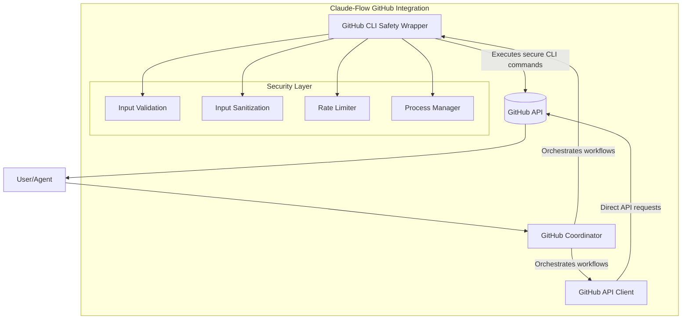
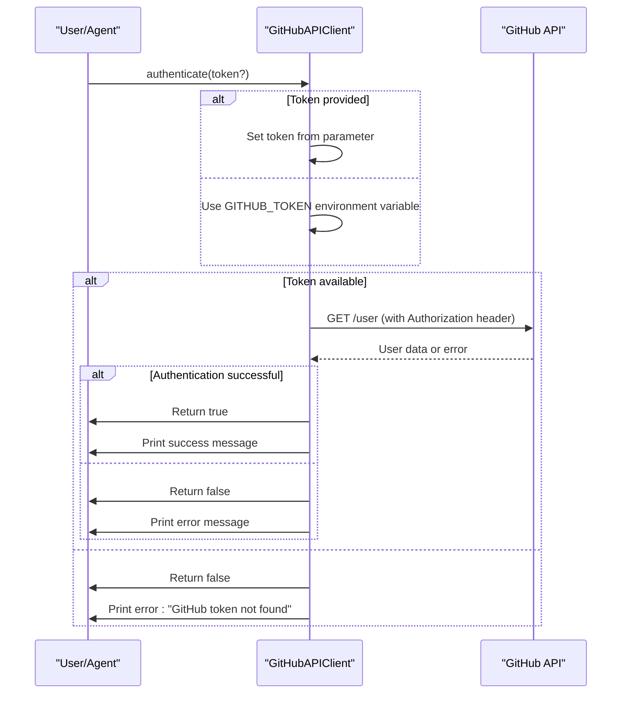
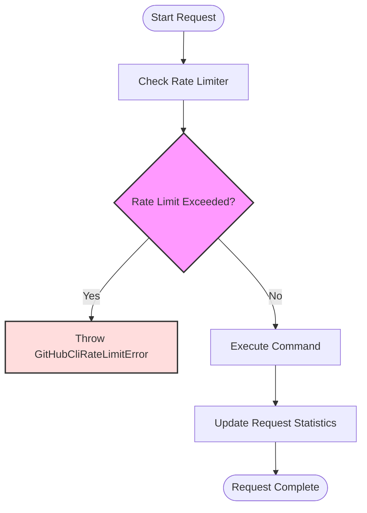
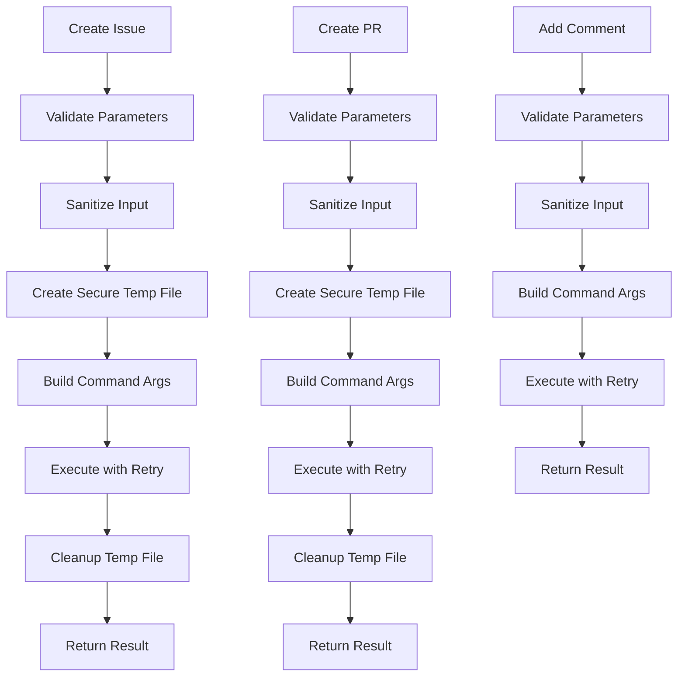
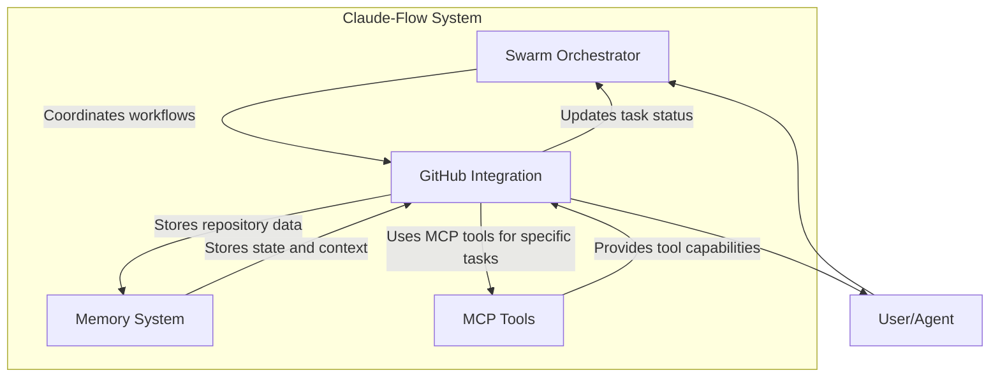

# GitHub Integration

<cite>
**Referenced Files in This Document**   
- [github-api.js](file://src/cli/simple-commands/github/github-api.js)
- [github-cli-safety-wrapper.js](file://src/utils/github-cli-safety-wrapper.js)
- [gh-coordinator.js](file://src/cli/simple-commands/github/gh-coordinator.js)
- [github.js](file://src/cli/simple-commands/github.js)
- [README.md](file://README.md)
</cite>

## Table of Contents
1. [Introduction](#introduction)
2. [GitHub Integration Architecture](#github-integration-architecture)
3. [Authentication Methods](#authentication-methods)
4. [Rate Limiting Implementation](#rate-limiting-implementation)
5. [Error Handling and Retry Mechanisms](#error-handling-and-retry-mechanisms)
6. [Security Measures](#security-measures)
7. [Core GitHub Operations](#core-github-operations)
8. [Integration with Other Components](#integration-with-other-components)
9. [Troubleshooting Common Issues](#troubleshooting-common-issues)
10. [Usage Examples](#usage-examples)

## Introduction

GitHub Integration in Claude-Flow enables comprehensive repository analysis, pull request management, issue tracking, release coordination, code review, and workflow automation within AI-powered development workflows. The integration provides a secure and reliable interface to GitHub's API and CLI tools, allowing the system to interact with repositories programmatically while maintaining robust security practices.

The integration layer consists of multiple components that work together to provide a seamless experience: a low-level GitHub CLI safety wrapper that ensures secure command execution, an API client for direct REST API interactions, and a coordinator that orchestrates complex workflows. These components are designed to handle authentication, rate limiting, error recovery, and security validation automatically.

**Section sources**
- [README.md](file://README.md#L1-L50)
- [github.js](file://src/cli/simple-commands/github.js#L1-L50)

## GitHub Integration Architecture

The GitHub integration architecture in Claude-Flow follows a layered approach with distinct components handling different aspects of the integration. At the core is the GitHub CLI Safety Wrapper, which provides a secure execution environment for GitHub CLI commands. This is complemented by the GitHub API Client for direct API interactions and the GitHub Coordinator for orchestrating complex workflows.



**Diagram sources**
- [github-cli-safety-wrapper.js](file://src/utils/github-cli-safety-wrapper.js#L1-L50)
- [github-api.js](file://src/cli/simple-commands/github/github-api.js#L1-L50)
- [gh-coordinator.js](file://src/cli/simple-commands/github/gh-coordinator.js#L1-L50)

**Section sources**
- [github-cli-safety-wrapper.js](file://src/utils/github-cli-safety-wrapper.js#L1-L100)
- [github-api.js](file://src/cli/simple-commands/github/github-api.js#L1-L100)

## Authentication Methods

The GitHub integration supports multiple authentication methods to ensure secure access to GitHub repositories. The primary authentication mechanism uses GitHub personal access tokens, which can be provided either through the `GITHUB_TOKEN` environment variable or passed directly to the authentication method.



The authentication process validates the token by making a request to the `/user` endpoint, which returns information about the authenticated user. If the request succeeds, the system confirms successful authentication and displays the username. The integration also supports webhook signature verification using the `GITHUB_WEBHOOK_SECRET` environment variable to ensure that incoming webhook events are genuinely from GitHub.

**Diagram sources**
- [github-api.js](file://src/cli/simple-commands/github/github-api.js#L36-L86)

**Section sources**
- [github-api.js](file://src/cli/simple-commands/github/github-api.js#L36-L86)
- [github-api.js](file://src/cli/simple-commands/github/github-api.js#L359-L406)

## Rate Limiting Implementation

The GitHub integration implements comprehensive rate limiting at multiple levels to prevent API abuse and ensure reliable operation. The system employs both client-side rate limiting for CLI commands and handles server-side rate limits for API requests.

For the GitHub CLI Safety Wrapper, a token bucket algorithm is implemented to limit the number of requests within a specified time window:



The rate limiter maintains a sliding window of requests and rejects new requests when the maximum number of requests per window is exceeded. The configuration allows customization of the maximum requests per window and the window duration.

For API requests, the integration monitors the `x-ratelimit-remaining` and `x-ratelimit-reset` headers returned by GitHub's API. When the remaining requests drop to one or fewer, the system automatically waits until the rate limit resets before proceeding:

```javascript
async checkRateLimit() {
  if (this.rateLimitRemaining <= 1) {
    const resetTime = new Date(this.rateLimitResetTime);
    const now = new Date();
    const waitTime = resetTime.getTime() - now.getTime();

    if (waitTime > 0) {
      printWarning(`Rate limit exceeded. Waiting ${Math.ceil(waitTime / 1000)}s...`);
      await this.sleep(waitTime);
    }
  }
}
```

**Diagram sources**
- [github-cli-safety-wrapper.js](file://src/utils/github-cli-safety-wrapper.js#L77-L124)
- [github-api.js](file://src/cli/simple-commands/github/github-api.js#L50-L65)

**Section sources**
- [github-cli-safety-wrapper.js](file://src/utils/github-cli-safety-wrapper.js#L77-L124)
- [github-api.js](file://src/cli/simple-commands/github/github-api.js#L50-L65)

## Error Handling and Retry Mechanisms

The GitHub integration features a robust error handling system with specialized error classes and automatic retry mechanisms for transient failures. The system implements a hierarchy of custom error classes that extend a base `GitHubCliError`:

```mermaid
classDiagram
class GitHubCliError {
+String message
+String code
+Object details
+String timestamp
+constructor(message, code, details)
}
class GitHubCliTimeoutError {
+Number timeout
+String command
+constructor(timeout, command)
}
class GitHubCliValidationError {
+String field
+String value
+constructor(message, field, value)
}
class GitHubCliRateLimitError {
+constructor(message)
}
class GitHubCliError <|-- GitHubCliTimeoutError
class GitHubCliError <|-- GitHubCliValidationError
class GitHubCliError <|-- GitHubCliRateLimitError
```

The retry mechanism uses exponential backoff to handle transient failures. The `withRetry` method automatically retries operations with increasing delays between attempts:

```javascript
async withRetry(operation, maxRetries = this.options.maxRetries) {
  let lastError;
  
  for (let attempt = 0; attempt <= maxRetries; attempt++) {
    try {
      if (attempt > 0) {
        this.stats.retriedRequests++;
        const delay = this.options.retryDelay * Math.pow(2, attempt - 1);
        await this.sleep(delay);
      }
      
      return await operation();
    } catch (error) {
      lastError = error;
      
      // Don't retry on validation errors or rate limits
      if (error instanceof GitHubCliValidationError || 
          error instanceof GitHubCliRateLimitError) {
        throw error;
      }
      
      if (attempt === maxRetries) {
        break;
      }
      
      if (this.options.enableLogging) {
        console.warn(`Attempt ${attempt + 1} failed, retrying:`, error.message);
      }
    }
  }
  
  throw lastError;
}
```

The system does not retry validation errors or rate limit errors, as these require user intervention to resolve. For other errors, it will retry up to the configured maximum number of attempts with exponentially increasing delays.

**Diagram sources**
- [github-cli-safety-wrapper.js](file://src/utils/github-cli-safety-wrapper.js#L40-L81)
- [github-cli-safety-wrapper.js](file://src/utils/github-cli-safety-wrapper.js#L346-L395)

**Section sources**
- [github-cli-safety-wrapper.js](file://src/utils/github-cli-safety-wrapper.js#L40-L81)
- [github-cli-safety-wrapper.js](file://src/utils/github-cli-safety-wrapper.js#L346-L395)

## Security Measures

The GitHub integration implements multiple security measures to protect against common vulnerabilities and ensure safe execution of GitHub operations. The primary security component is the GitHub CLI Safety Wrapper, which provides input validation, sanitization, and secure execution environments.

The system validates commands against an allowlist of permitted commands to prevent execution of potentially dangerous operations:

```javascript
validateCommand(command) {
  if (typeof command !== 'string' || !command.trim()) {
    throw new GitHubCliValidationError('Command must be a non-empty string', 'command', command);
  }

  const parts = command.trim().split(' ');
  const mainCommand = parts[0];
  
  if (!CONFIG.ALLOWED_COMMANDS.includes(mainCommand)) {
    throw new GitHubCliValidationError(
      `Command '${mainCommand}' is not allowed`, 
      'command', 
      mainCommand
    );
  }

  return command;
}
```

Input sanitization checks for dangerous patterns that could lead to command injection:

```javascript
sanitizeInput(input) {
  if (typeof input !== 'string') {
    input = String(input);
  }

  // Check for dangerous patterns
  for (const pattern of CONFIG.DANGEROUS_PATTERNS) {
    if (pattern.test(input)) {
      throw new GitHubCliValidationError(
        `Input contains potentially dangerous pattern: ${pattern}`,
        'input',
        input
      );
    }
  }

  return input;
}
```

The safety wrapper also creates temporary files with restricted permissions (600 - owner read/write only) and automatically cleans them up after use:

```javascript
async createSecureTempFile(content) {
  // Validate content size
  this.validateBodySize(content);
  
  // Create file with restricted permissions (600 - owner read/write only)
  await fs.writeFile(filepath, content, { mode: 0o600 });
  
  return filepath;
}
```

Process execution is secured by disabling shell interpretation and using restricted stdio configuration:

```javascript
const child = spawn('gh', args, {
  stdio: ['ignore', 'pipe', 'pipe'],
  shell: false, // Critical: prevent shell injection
  env: { ...process.env, ...options.env },
  cwd: options.cwd || process.cwd()
});
```

**Section sources**
- [github-cli-safety-wrapper.js](file://src/utils/github-cli-safety-wrapper.js#L123-L171)
- [github-cli-safety-wrapper.js](file://src/utils/github-cli-safety-wrapper.js#L200-L250)

## Core GitHub Operations

The GitHub integration provides high-level methods for common GitHub operations, abstracting away the complexity of direct API or CLI interactions. These methods are implemented in the GitHub CLI Safety Wrapper and provide a clean, consistent interface for creating and managing GitHub resources.



The core operations include:

- **Issue Management**: Create issues, add comments to issues
- **Pull Request Management**: Create pull requests, add comments to PRs
- **Release Management**: Create releases with tags, titles, and descriptions
- **General Operations**: Execute any allowed GitHub CLI command with safety features

Each operation follows a consistent pattern of validation, sanitization, secure execution, and cleanup, ensuring that all GitHub interactions are performed safely and reliably.

**Section sources**
- [github-cli-safety-wrapper.js](file://src/utils/github-cli-safety-wrapper.js#L427-L484)

## Integration with Other Components

The GitHub integration is designed to work seamlessly with other components in the Claude-Flow system, particularly the swarm orchestrator, memory system, and MCP tools. The GitHub Coordinator serves as the primary integration point, connecting GitHub operations with the broader workflow orchestration capabilities.



The integration with the swarm orchestrator allows GitHub operations to be coordinated as part of larger workflows. The GitHub Coordinator initializes swarm integration and can trigger swarm activities based on GitHub events. The memory system stores the state of GitHub operations, including active processes and request statistics, enabling persistence across sessions. MCP tools can leverage the GitHub integration to perform repository operations as part of their capabilities.

**Diagram sources**
- [gh-coordinator.js](file://src/cli/simple-commands/github/gh-coordinator.js#L1-L50)
- [github-cli-safety-wrapper.js](file://src/utils/github-cli-safety-wrapper.js#L1-L50)

**Section sources**
- [gh-coordinator.js](file://src/cli/simple-commands/github/gh-coordinator.js#L1-L50)
- [github-cli-safety-wrapper.js](file://src/utils/github-cli-safety-wrapper.js#L1-L50)

## Troubleshooting Common Issues

This section addresses common issues encountered when using the GitHub integration and provides guidance for resolution.

### Authentication Failures
**Symptoms**: "GitHub token not found" or "Authentication failed" messages.
**Solutions**:
1. Ensure the `GITHUB_TOKEN` environment variable is set with a valid GitHub personal access token
2. Verify the token has the necessary permissions for the operations you're attempting
3. Test token validity by running `gh auth status` manually
4. If using in a CI/CD environment, ensure the token is properly exposed to the build environment

### Rate Limiting Issues
**Symptoms**: "Rate limit exceeded" errors or slow response times.
**Solutions**:
1. Implement appropriate delays between operations to stay within rate limits
2. For API requests, monitor the `x-ratelimit-remaining` header and adjust request frequency accordingly
3. Consider using GitHub App authentication instead of personal access tokens for higher rate limits
4. Implement caching for frequently accessed data to reduce API calls

### API Changes and Compatibility
**Symptoms**: Unexpected errors or missing functionality.
**Solutions**:
1. Check the GitHub API documentation for any recent changes to endpoints or parameters
2. Update the Claude-Flow system to the latest version, which may include compatibility fixes
3. Use the GitHub CLI wrapper methods when possible, as they are more resilient to API changes
4. Implement proper error handling to gracefully handle deprecated or removed endpoints

### Process Management Issues
**Symptoms**: Hanging processes or resource leaks.
**Solutions**:
1. Ensure proper cleanup by calling the `cleanup()` method on exit
2. Monitor active process count using `getActiveProcessCount()`
3. Verify that temporary files are being properly cleaned up
4. Check system resource usage and adjust timeout settings if necessary

**Section sources**
- [github-api.js](file://src/cli/simple-commands/github/github-api.js#L36-L86)
- [github-cli-safety-wrapper.js](file://src/utils/github-cli-safety-wrapper.js#L77-L124)
- [gh-coordinator.js](file://src/cli/simple-commands/github/gh-coordinator.js#L1-L50)

## Usage Examples

This section provides concrete examples of using the GitHub integration for common scenarios.

### Creating an Issue
```javascript
const githubCli = new GitHubCliSafe();

try {
  const result = await githubCli.createIssue({
    title: 'Bug: Login fails with valid credentials',
    body: 'When attempting to log in with valid credentials, the system returns a 500 error.',
    labels: ['bug', 'high-priority'],
    assignees: ['developer1', 'developer2']
  });
  
  console.log('Issue created:', result);
} catch (error) {
  console.error('Failed to create issue:', error.message);
}
```

### Adding a Comment to a Pull Request
```javascript
// Using the legacy compatibility function
await gh.prComment(123, 'Thanks for the contribution! I\'ve reviewed the code and left some suggestions.');

// Or using the direct method
await githubCli.addPRComment(123, 'Additional feedback: consider optimizing the database query.');
```

### Creating a Release
```javascript
await githubCli.createRelease({
  tag: 'v1.2.0',
  title: 'Version 1.2.0 - Performance Improvements',
  body: 'This release includes several performance optimizations and bug fixes.',
  prerelease: false,
  draft: false
});
```

### Coordinating a CI/CD Pipeline
```javascript
const coordinator = new GitHubCoordinator();
await coordinator.initialize();

// This will automatically detect the current repository and set up coordination
await coordinator.coordinateCIPipeline();
```

These examples demonstrate the simplicity and power of the GitHub integration, allowing complex operations to be performed with minimal code while maintaining security and reliability.

**Section sources**
- [github-cli-safety-wrapper.js](file://src/utils/github-cli-safety-wrapper.js#L427-L484)
- [gh-coordinator.js](file://src/cli/simple-commands/github/gh-coordinator.js#L1-L50)
- [github.js](file://src/cli/simple-commands/github.js#L157-L207)