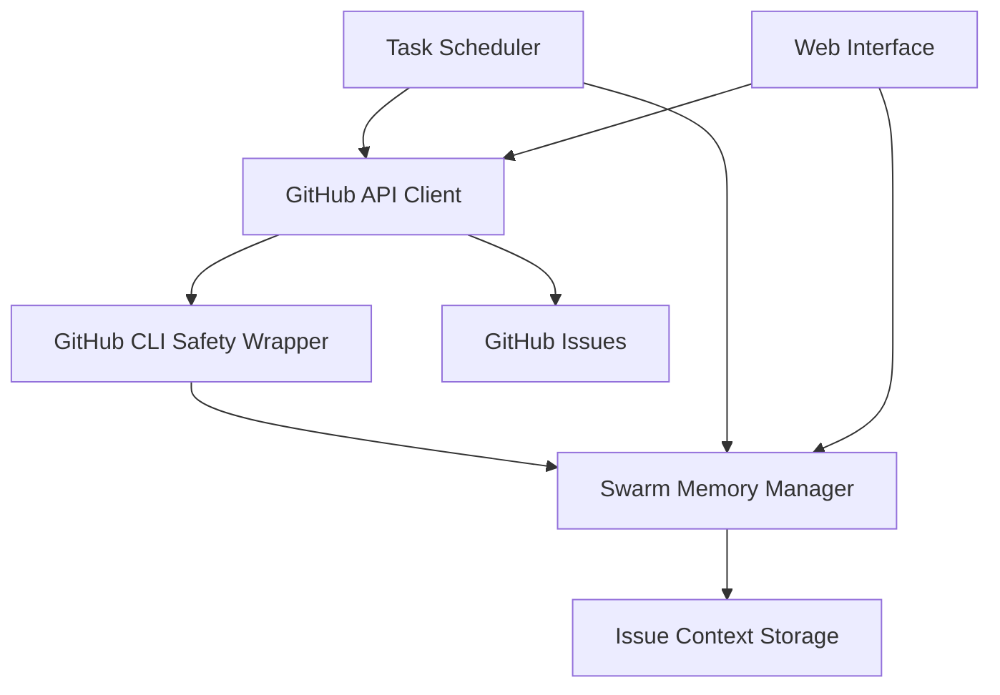
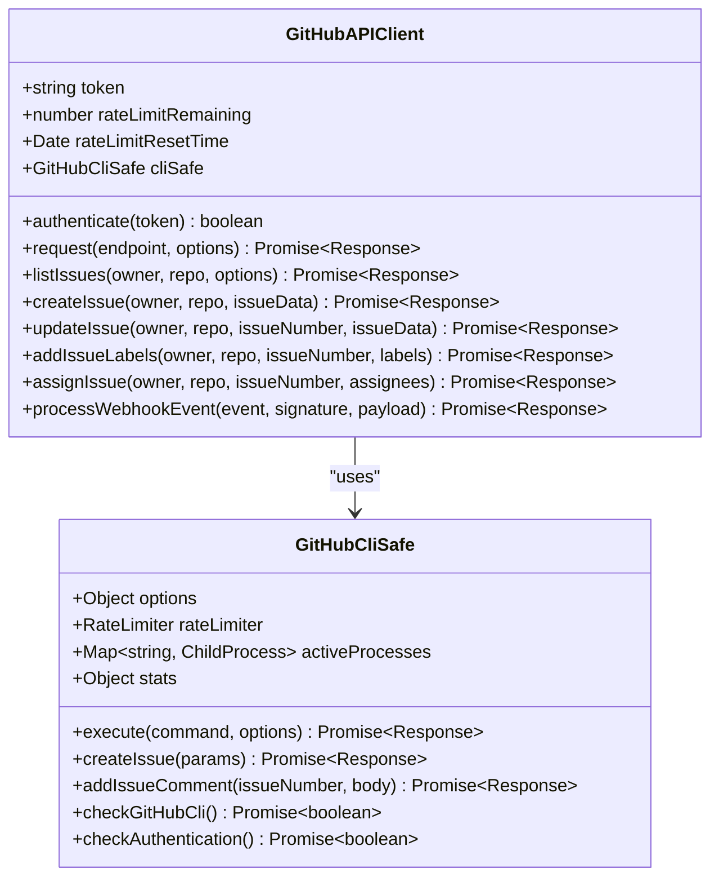
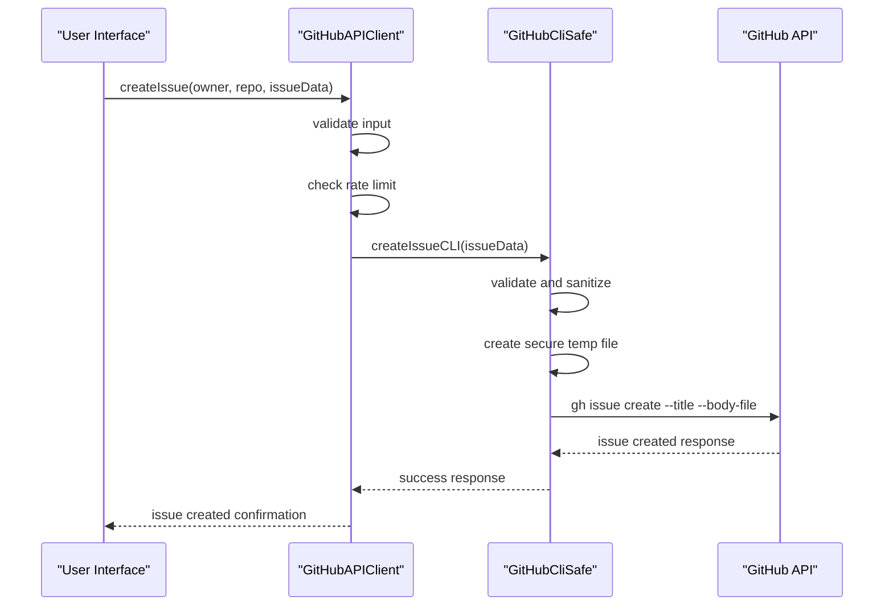
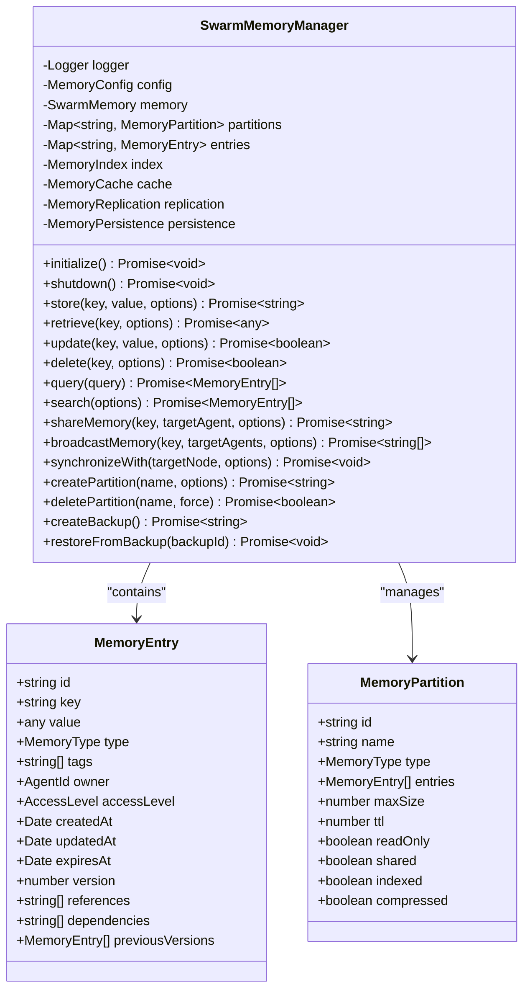
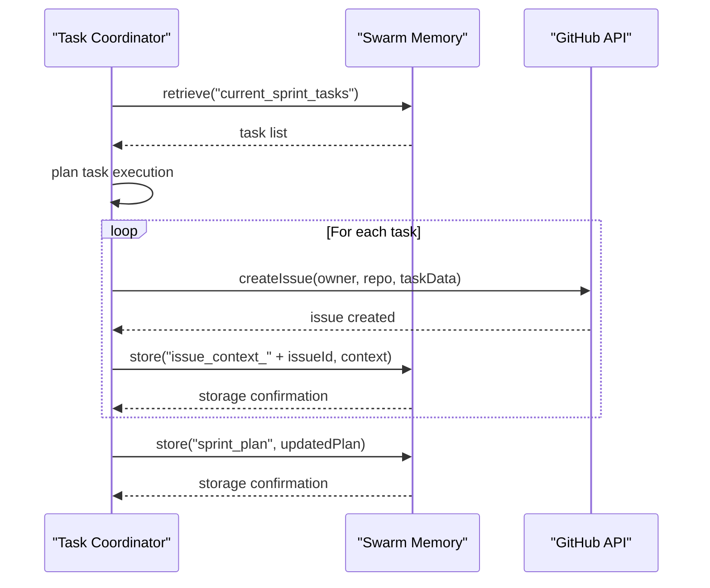

# Issue Tracking

<cite>
**Referenced Files in This Document**   
- [github-api.js](file://src/cli/simple-commands/github/github-api.js)
- [github-cli-safety-wrapper.js](file://src/utils/github-cli-safety-wrapper.js)
- [memory.ts](file://src/swarm/memory.ts)
- [coordinator.ts](file://src/cli/agents/coordinator.ts)
- [GitHubIntegrationView.js](file://src/ui/web-ui/views/GitHubIntegrationView.js)
</cite>

## Table of Contents
1. [Introduction](#introduction)
2. [Core Components](#core-components)
3. [GitHub API Integration](#github-api-integration)
4. [Issue Lifecycle Management](#issue-lifecycle-management)
5. [Memory System Integration](#memory-system-integration)
6. [Task Scheduling and Orchestration](#task-scheduling-and-orchestration)
7. [Web Interface Integration](#web-interface-integration)
8. [Error Handling and Troubleshooting](#error-handling-and-troubleshooting)
9. [Best Practices](#best-practices)

## Introduction
The Issue Tracking system in Claude-Flow provides comprehensive integration with GitHub Issues for managing tasks, bugs, and feature requests. This system enables seamless synchronization between swarm tasks and GitHub issues, allowing for efficient task management, progress tracking, and collaboration. The implementation leverages the GitHub API through a secure wrapper system and maintains context through a distributed memory system.

**Section sources**
- [github-api.js](file://src/cli/simple-commands/github/github-api.js)
- [memory.ts](file://src/swarm/memory.ts)

## Core Components

The Issue Tracking system consists of three main components:

1. **GitHub API Client**: Handles all communication with GitHub's REST API
2. **GitHub CLI Safety Wrapper**: Provides secure execution of GitHub CLI commands
3. **Swarm Memory Manager**: Stores and manages issue context and state

These components work together to create a robust issue tracking system that integrates seamlessly with the swarm architecture.



**Diagram sources**
- [github-api.js](file://src/cli/simple-commands/github/github-api.js)
- [github-cli-safety-wrapper.js](file://src/utils/github-cli-safety-wrapper.js)
- [memory.ts](file://src/swarm/memory.ts)

**Section sources**
- [github-api.js](file://src/cli/simple-commands/github/github-api.js#L1-L50)
- [github-cli-safety-wrapper.js](file://src/utils/github-cli-safety-wrapper.js#L1-L50)
- [memory.ts](file://src/swarm/memory.ts#L1-L50)

## GitHub API Integration

### API Client Implementation
The GitHubAPIClient class provides a comprehensive wrapper around GitHub's REST API with built-in rate limiting, authentication, and error handling.



**Diagram sources**
- [github-api.js](file://src/cli/simple-commands/github/github-api.js#L50-L200)
- [github-cli-safety-wrapper.js](file://src/utils/github-cli-safety-wrapper.js#L50-L200)

**Section sources**
- [github-api.js](file://src/cli/simple-commands/github/github-api.js#L1-L200)
- [github-cli-safety-wrapper.js](file://src/utils/github-cli-safety-wrapper.js#L1-L200)

### Issue Operations
The GitHubAPIClient provides comprehensive methods for managing GitHub issues:

- **listIssues**: Retrieve issues with filtering options
- **createIssue**: Create new issues with title, body, labels, and assignees
- **updateIssue**: Modify existing issues
- **addIssueLabels**: Add labels to issues
- **assignIssue**: Assign issues to users

```javascript
// Example: Creating an issue
async createIssue(owner, repo, issueData) {
    return await this.request(`/repos/${owner}/${repo}/issues`, {
        method: 'POST',
        body: issueData,
    });
}
```

**Section sources**
- [github-api.js](file://src/cli/simple-commands/github/github-api.js#L200-L300)

### GitHub CLI Safety Wrapper
The GitHubCliSafe class provides a secure wrapper around GitHub CLI commands with:

- Input validation and sanitization
- Rate limiting protection
- Timeout handling with graceful cleanup
- Process management and recovery
- Injection attack prevention

```javascript
// Example: Secure command execution
async execute(command, options = {}) {
    // Validate and sanitize command
    const validatedCommand = this.validateCommand(command);
    
    // Handle body content securely
    let tempFile = null;
    if (options.body) {
        const sanitizedBody = this.sanitizeInput(options.body);
        tempFile = await this.createSecureTempFile(sanitizedBody);
        args.push('--body-file', tempFile);
    }
    
    // Execute with retry logic
    return await this.withRetry(async () => {
        return await this.executeWithTimeout(validatedCommand, args.slice(1), options);
    });
}
```

**Section sources**
- [github-cli-safety-wrapper.js](file://src/utils/github-cli-safety-wrapper.js#L200-L400)

## Issue Lifecycle Management

### Issue Creation and Assignment
The system supports creating issues through both the GitHub API and CLI, with automatic assignment and labeling:



**Diagram sources**
- [github-api.js](file://src/cli/simple-commands/github/github-api.js#L300-L400)
- [github-cli-safety-wrapper.js](file://src/utils/github-cli-safety-wrapper.js#L400-L500)

**Section sources**
- [github-api.js](file://src/cli/simple-commands/github/github-api.js#L200-L400)
- [github-cli-safety-wrapper.js](file://src/utils/github-cli-safety-wrapper.js#L400-L500)

### Status Updates and Progress Tracking
Issues can be updated with new status, labels, and assignments:

```javascript
// Update issue status
async updateIssue(owner, repo, issueNumber, issueData) {
    return await this.request(`/repos/${owner}/${repo}/issues/${issueNumber}`, {
        method: 'PATCH',
        body: issueData,
    });
}

// Add labels to issue
async addIssueLabels(owner, repo, issueNumber, labels) {
    return await this.request(`/repos/${owner}/${repo}/issues/${issueNumber}/labels`, {
        method: 'POST',
        body: { labels },
    });
}

// Assign issue to users
async assignIssue(owner, repo, issueNumber, assignees) {
    return await this.request(`/repos/${owner}/${repo}/issues/${issueNumber}/assignees`, {
        method: 'POST',
        body: { assignees },
    });
}
```

**Section sources**
- [github-api.js](file://src/cli/simple-commands/github/github-api.js#L250-L300)

### Webhook Integration
The system can process incoming webhook events from GitHub:

```javascript
async processWebhookEvent(event, signature, payload) {
    if (!this.verifyWebhookSignature(signature, payload)) {
        throw new Error('Invalid webhook signature');
    }

    const eventData = JSON.parse(payload);

    switch (event) {
        case 'push':
            return this.handlePushEvent(eventData);
        case 'pull_request':
            return this.handlePullRequestEvent(eventData);
        case 'issues':
            return this.handleIssuesEvent(eventData);
        case 'release':
            return this.handleReleaseEvent(eventData);
        case 'workflow_run':
            return this.handleWorkflowRunEvent(eventData);
        default:
            printInfo(`Unhandled event type: ${event}`);
            return { handled: false, event };
    }
}
```

**Section sources**
- [github-api.js](file://src/cli/simple-commands/github/github-api.js#L350-L450)

## Memory System Integration

### Distributed Memory Architecture
The SwarmMemoryManager provides a distributed memory system for storing issue context and state:



**Diagram sources**
- [memory.ts](file://src/swarm/memory.ts#L50-L200)

**Section sources**
- [memory.ts](file://src/swarm/memory.ts#L1-L200)

### Memory Operations for Issue Tracking
The memory system stores issue context and enables collaboration between swarm agents:

```javascript
// Store issue context
async store(
    key: string,
    value: any,
    options: Partial<{
        partition: string;
        type: MemoryType;
        tags: string[];
        owner: AgentId;
        accessLevel: AccessLevel;
        ttl: number;
        metadata: Record<string, any>;
    }> = {}
): Promise<string> {
    // Create memory entry with issue context
    const entry: MemoryEntry = {
        id: generateId('mem'),
        key,
        value: await this.serializeValue(value),
        type: options.type || 'knowledge',
        tags: options.tags || [],
        owner: options.owner || { id: 'system', swarmId: '', type: 'coordinator', instance: 0 },
        accessLevel: options.accessLevel || 'team',
        createdAt: now,
        updatedAt: now,
        expiresAt: options.ttl ? new Date(now.getTime() + options.ttl) : undefined,
        version: 1,
        references: [],
        dependencies: [],
    };
    
    // Store entry and update index
    this.entries.set(entryId, entry);
    await this.index.addEntry(entry);
    
    return entryId;
}
```

**Section sources**
- [memory.ts](file://src/swarm/memory.ts#L200-L400)

### Memory Query and Search
Agents can retrieve issue context using flexible query and search capabilities:

```javascript
async query(query: MemoryQuery): Promise<MemoryEntry[]> {
    let results = Array.from(this.entries.values());

    // Apply filters based on query parameters
    if (query.partition) {
        const partition = this.partitions.get(query.partition);
        if (partition) {
            const entryIds = new Set(partition.entries.map((e) => e.id));
            results = results.filter((e) => entryIds.has(e.id));
        } else {
            return [];
        }
    }

    if (query.key) {
        results = results.filter((e) => e.key === query.key);
    }

    if (query.type) {
        results = results.filter((e) => e.type === query.type);
    }

    if (query.tags && query.tags.length > 0) {
        results = results.filter((e) => query.tags!.some((tag) => e.tags.includes(tag)));
    }

    // Sort and paginate results
    if (query.sortBy) {
        results.sort((a, b) => {
            let compareValue = 0;

            switch (query.sortBy) {
                case 'createdAt':
                    compareValue = a.createdAt.getTime() - b.createdAt.getTime();
                    break;
                case 'updatedAt':
                    compareValue = a.updatedAt.getTime() - b.updatedAt.getTime();
                    break;
                case 'key':
                    compareValue = a.key.localeCompare(b.key);
                    break;
                default:
                    compareValue = 0;
            }

            return query.sortOrder === 'desc' ? -compareValue : compareValue;
        });
    }

    const offset = query.offset || 0;
    const limit = query.limit || results.length;
    results = results.slice(offset, offset + limit);

    return results;
}
```

**Section sources**
- [memory.ts](file://src/swarm/memory.ts#L400-L600)

## Task Scheduling and Orchestration

### Coordinator Integration
The coordinator component integrates with the issue tracking system to manage task workflows:



**Diagram sources**
- [coordinator.ts](file://src/cli/agents/coordinator.ts#L183-L238)
- [memory.ts](file://src/swarm/memory.ts#L200-L400)

**Section sources**
- [coordinator.ts](file://src/cli/agents/coordinator.ts#L183-L238)
- [memory.ts](file://src/swarm/memory.ts#L200-L400)

### Progress Tracking
The system tracks progress on issues and tasks:

```typescript
private async trackProgress(task: TaskDefinition): Promise<any> {
    const project = task.parameters?.project;
    const timeframe = task.parameters?.timeframe || 'weekly';
    const metrics = task.parameters?.metrics || ['completion', 'velocity', 'quality'];

    this.logger.info('Tracking progress', {
        project,
        timeframe,
        metrics,
    });

    const progress = {
        project,
        timeframe,
        metrics,
        summary: {
            overall_progress: 0,
            tasks_completed: 0,
            tasks_in_progress: 0,
            tasks_pending: 0,
            blockers: 0,
        },
        velocity: {
            current: 0,
            average: 0,
            trend: 'stable',
        },
        quality_metrics: {
            defect_rate: 0,
            review_coverage: 0,
            test_coverage: 0,
        },
        timeline: {
            on_track: true,
            estimated_completion: new Date(),
            delays: [],
        },
        recommendations: [],
        timestamp: new Date(),
    };

    // Simulate progress tracking
    await this.delay(1500);

    return progress;
}
```

**Section sources**
- [coordinator.ts](file://src/cli/agents/coordinator.ts#L183-L238)

## Web Interface Integration

### GitHub Integration View
The web interface provides a user-friendly way to interact with GitHub issues:

```mermaid
flowchart TD
A[GitHub Integration View] --> B[Create Issue Button]
A --> C[Triage Issues Button]
A --> D[Track Progress Button]
A --> E[Issue Dashboard]
E --> F[Open Issues Count]
E --> G[In Progress Issues Count]
E --> H[Closed Issues Count]
E --> I[Issue Search]
E --> J[Issue Filter by Label]
B --> K[Call window.githubView.createIssue()]
C --> L[Call window.githubView.triageIssues()]
D --> M[Call window.githubView.trackIssues()]
```

**Diagram sources**
- [GitHubIntegrationView.js](file://src/ui/web-ui/views/GitHubIntegrationView.js#L296-L328)

**Section sources**
- [GitHubIntegrationView.js](file://src/ui/web-ui/views/GitHubIntegrationView.js#L296-L328)

### User Interface Elements
The interface includes key elements for issue management:

```html
<div class="github-controls">
    <button onclick="window.githubView.createIssue()" class="github-btn primary">
        ➕ Create Issue
    </button>
    <button onclick="window.githubView.triageIssues()" class="github-btn secondary">
        🏷️ Triage Issues
    </button>
    <button onclick="window.githubView.trackIssues()" class="github-btn secondary">
        📊 Track Progress
    </button>
</div>

<div class="issue-dashboard">
    <h3>📊 Issue Dashboard</h3>
    <div class="issue-stats">
        <div class="issue-stat">
            <span class="stat-label">Open</span>
            <span id="open-issues" class="stat-value">0</span>
        </div>
        <div class="issue-stat">
            <span class="stat-label">In Progress</span>
            <span id="progress-issues" class="stat-value">0</span>
        </div>
        <div class="issue-stat">
            <span class="stat-label">Closed</span>
            <span id="closed-issues" class="stat-value">0</span>
        </div>
    </div>
</div>
```

**Section sources**
- [GitHubIntegrationView.js](file://src/ui/web-ui/views/GitHubIntegrationView.js#L296-L328)

## Error Handling and Troubleshooting

### Common Issues and Solutions

#### Rate Limiting on Issue Creation
GitHub API has rate limits (5,000 requests per hour). The system handles this with:

```javascript
async checkRateLimit() {
    if (this.rateLimitRemaining <= 1) {
        const resetTime = new Date(this.rateLimitResetTime);
        const now = new Date();
        const waitTime = resetTime.getTime() - now.getTime();

        if (waitTime > 0) {
            printWarning(`Rate limit exceeded. Waiting ${Math.ceil(waitTime / 1000)}s...`);
            await this.sleep(waitTime);
        }
    }
}
```

**Solution**: Implement exponential backoff and retry logic.

**Section sources**
- [github-api.js](file://src/cli/simple-commands/github/github-api.js#L50-L100)

#### Label Management Conflicts
When multiple agents try to modify labels simultaneously:

**Solution**: Use atomic operations and implement locking mechanism in the memory system.

```javascript
// Use transaction-like pattern
async updateIssueWithLabels(owner, repo, issueNumber, issueData, labels) {
    // Start transaction
    await this.memory.store("issue_lock_" + issueNumber, true);
    
    try {
        // Update issue
        await this.updateIssue(owner, repo, issueNumber, issueData);
        
        // Update labels
        await this.addIssueLabels(owner, repo, issueNumber, labels);
        
    } finally {
        // Release lock
        await this.memory.delete("issue_lock_" + issueNumber);
    }
}
```

**Section sources**
- [github-api.js](file://src/cli/simple-commands/github/github-api.js#L250-L300)
- [memory.ts](file://src/swarm/memory.ts#L400-L600)

#### Webhook Delivery Failures
Ensure webhook signatures are verified and implement retry mechanism:

```javascript
async processWebhookEvent(event, signature, payload) {
    if (!this.verifyWebhookSignature(signature, payload)) {
        throw new Error('Invalid webhook signature');
    }

    // Process event with retry logic
    return await this.withRetry(async () => {
        return await this.handleEvent(event, payload);
    }, 3);
}
```

**Solution**: Implement retry queue and monitoring for failed deliveries.

**Section sources**
- [github-api.js](file://src/cli/simple-commands/github/github-api.js#L350-L450)

## Best Practices

### Issue Templating
Use consistent templates for different issue types:

```javascript
// Bug report template
const bugTemplate = {
    title: "Bug: [Brief description]",
    body: `## Description
    [Detailed description of the bug]
    
    ## Steps to Reproduce
    1. 
    2. 
    3. 
    
    ## Expected Behavior
    [What should happen]
    
    ## Actual Behavior
    [What actually happens]
    
    ## Environment
    - Version: 
    - OS: 
    - Browser: `,
    labels: ["bug", "needs-triage"]
};

// Feature request template
const featureTemplate = {
    title: "Feature: [Brief description]",
    body: `## Problem
    [Description of the problem being solved]
    
    ## Solution
    [Proposed solution]
    
    ## Alternatives
    [Considered alternatives]
    
    ## Additional Context
    [Any other relevant information]`,
    labels: ["enhancement", "needs-triage"]
};
```

### Automation Rules
Implement automation rules for efficient issue management:

```javascript
// Auto-label issues based on title keywords
function autoLabelIssue(title, body) {
    const labels = [];
    
    if (title.toLowerCase().includes("bug") || body.toLowerCase().includes("error")) {
        labels.push("bug");
    }
    
    if (title.toLowerCase().includes("feature") || title.toLowerCase().includes("enhancement")) {
        labels.push("enhancement");
    }
    
    if (body.toLowerCase().includes("performance")) {
        labels.push("performance");
    }
    
    if (body.toLowerCase().includes("security")) {
        labels.push("security");
    }
    
    return labels;
}
```

### Integration with Task Scheduler
Use issues as work items in the task scheduler:

```javascript
// Convert GitHub issues to swarm tasks
async function convertIssuesToTasks(owner, repo) {
    const issues = await githubAPI.listIssues(owner, repo, { state: "open" });
    
    const tasks = issues.data.map(issue => ({
        id: `issue-${issue.number}`,
        name: issue.title,
        description: issue.body,
        priority: issue.labels.some(l => l.name === "high-priority") ? "high" : "normal",
        estimated_duration: estimateDuration(issue.body),
        dependencies: extractDependencies(issue.body),
        parameters: {
            issueNumber: issue.number,
            issueUrl: issue.html_url,
            labels: issue.labels.map(l => l.name)
        }
    }));
    
    return tasks;
}
```

**Section sources**
- [github-api.js](file://src/cli/simple-commands/github/github-api.js)
- [memory.ts](file://src/swarm/memory.ts)