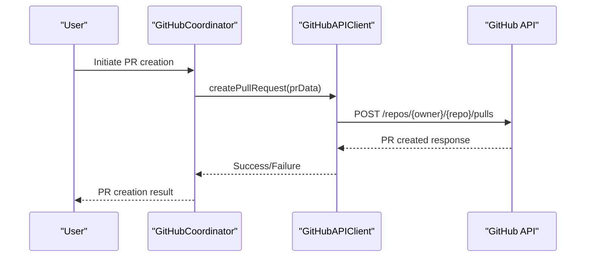
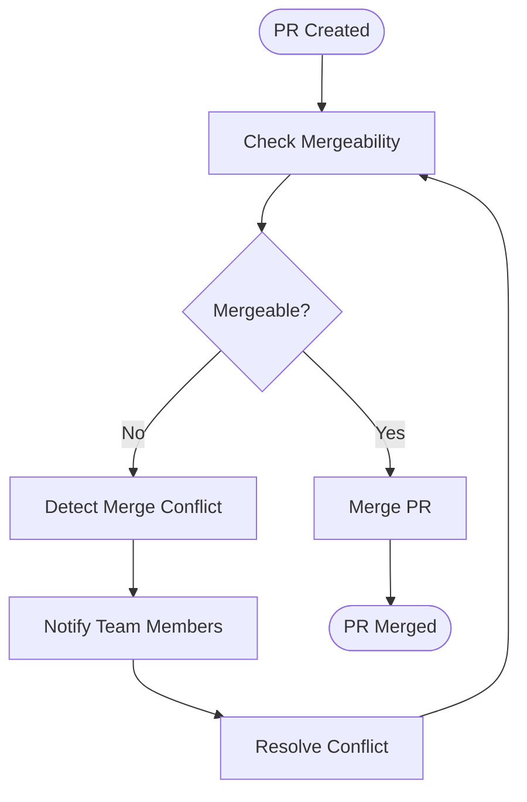

# Pull Request Management

<cite>
**Referenced Files in This Document**   
- [github-api.js](file://src/cli/simple-commands/github/github-api.js)
- [gh-coordinator.js](file://src/cli/simple-commands/github/gh-coordinator.js)
- [verification.js](file://src/cli/simple-commands/verification.js)
- [hooks.js](file://src/cli/simple-commands/hooks.js)
</cite>

## Table of Contents
1. [Introduction](#introduction)
2. [PR Lifecycle Management](#pr-lifecycle-management)
3. [GitHub API Integration](#github-api-integration)
4. [PR Workflow Coordination](#pr-workflow-coordination)
5. [Verification System Integration](#verification-system-integration)
6. [Notification and Alerting System](#notification-and-alerting-system)
7. [Common Issues and Troubleshooting](#common-issues-and-troubleshooting)
8. [Security Considerations](#security-considerations)

## Introduction

Pull Request Management in Claude-Flow is a comprehensive system that automates the creation, review, and merging of pull requests through the GitHub API. The system integrates with various components including verification, notification, and coordination modules to ensure a robust and secure development workflow. This document provides a detailed analysis of how Claude-Flow manages pull requests, from creation to merging, including integration with other systems and handling of common issues.

**Section sources**
- [github-api.js](file://src/cli/simple-commands/github/github-api.js)
- [gh-coordinator.js](file://src/cli/simple-commands/github/gh-coordinator.js)

## PR Lifecycle Management

The PR lifecycle in Claude-Flow consists of several stages: creation, review, verification, and merging. Each stage is managed by specific components that ensure the integrity and quality of the code changes.

### PR Creation

Pull requests are created through the `createPullRequest` method in the `GitHubAPIClient` class. This method sends a POST request to the GitHub API with the necessary PR data.



**Diagram sources**
- [github-api.js](file://src/cli/simple-commands/github/github-api.js#L130-L140)
- [gh-coordinator.js](file://src/cli/simple-commands/github/gh-coordinator.js#L300-L350)

### PR Review

The review process involves adding reviewers to the PR and requesting their feedback. The `requestPullRequestReview` method in `GitHubAPIClient` handles this functionality.

```javascript
async requestPullRequestReview(owner, repo, prNumber, reviewData) {
  return await this.request(`/repos/${owner}/${repo}/pulls/${prNumber}/requested_reviewers`, {
    method: 'POST',
    body: reviewData,
  });
}
```

This method sends a POST request to the GitHub API to add reviewers to the specified PR.

**Section sources**
- [github-api.js](file://src/cli/simple-commands/github/github-api.js#L150-L160)

### PR Merging

Once a PR is approved, it can be merged using the `mergePullRequest` method. This method sends a PUT request to the GitHub API to merge the PR.

```javascript
async mergePullRequest(owner, repo, prNumber, mergeData) {
  return await this.request(`/repos/${owner}/${repo}/pulls/${prNumber}/merge`, {
    method: 'PUT',
    body: mergeData,
  });
}
```

The merge process is automated and can be triggered based on certain conditions, such as successful verification and approval from reviewers.

**Section sources**
- [github-api.js](file://src/cli/simple-commands/github/github-api.js#L140-L150)

## GitHub API Integration

The `GitHubAPIClient` class provides a wrapper around the GitHub API, handling authentication, rate limiting, and API requests.

### Authentication

The client authenticates using a GitHub token, which can be provided as a parameter or set in the environment variable `GITHUB_TOKEN`.

```javascript
async authenticate(token = null) {
  if (token) {
    this.token = token;
  }

  if (!this.token) {
    printError('GitHub token not found. Set GITHUB_TOKEN environment variable or provide token.');
    return false;
  }

  try {
    const response = await this.request('/user');
    if (response.success) {
      printSuccess(`Authenticated as ${response.data.login}`);
      return true;
    }
    return false;
  } catch (error) {
    printError(`Authentication failed: ${error.message}`);
    return false;
  }
}
```

**Section sources**
- [github-api.js](file://src/cli/simple-commands/github/github-api.js#L40-L60)

### Rate Limiting

The client manages rate limiting by checking the remaining API calls and waiting if necessary.

```javascript
async checkRateLimit() {
  if (this.rateLimitRemaining <= 1) {
    const resetTime = new Date(this.rateLimitResetTime);
    const now = new Date();
    const waitTime = resetTime.getTime() - now.getTime();

    if (waitTime > 0) {
      printWarning(`Rate limit exceeded. Waiting ${Math.ceil(waitTime / 1000)}s...`);
      await this.sleep(waitTime);
    }
  }
}
```

**Section sources**
- [github-api.js](file://src/cli/simple-commands/github/github-api.js#L70-L85)

## PR Workflow Coordination

The `GitHubCoordinator` class orchestrates the PR workflow, integrating with the GitHub API and other components.

### Initialization

The coordinator initializes by authenticating with GitHub and checking the current repository context.

```javascript
async initialize(options = {}) {
  printInfo('🚀 Initializing GitHub Coordinator...');

  // Authenticate with GitHub
  const authenticated = await this.api.authenticate(options.token);
  if (!authenticated) {
    throw new Error('Failed to authenticate with GitHub');
  }

  // Check if we're in a git repository
  try {
    const remoteUrl = execSync('git config --get remote.origin.url', { encoding: 'utf8' }).trim();
    const repoMatch = remoteUrl.match(/github\.com[:/]([^/]+)\/([^/]+?)(?:\.git)?$/);

    if (repoMatch) {
      this.currentRepo = { owner: repoMatch[1], repo: repoMatch[2] };
      printSuccess(`Connected to repository: ${this.currentRepo.owner}/${this.currentRepo.repo}`);
    }
  } catch (error) {
    printWarning('Not in a git repository or no GitHub remote found');
  }

  // Initialize swarm integration
  await this.initializeSwarmIntegration();

  printSuccess('✅ GitHub Coordinator initialized successfully');
}
```

**Section sources**
- [gh-coordinator.js](file://src/cli/simple-commands/github/gh-coordinator.js#L20-L60)

### CI/CD Pipeline Setup

The coordinator can set up a CI/CD pipeline for the repository, including creating workflow files and configuring branch protection.

```javascript
async coordinateCIPipeline(options = {}) {
  printInfo('🔄 Coordinating CI/CD pipeline setup...');

  if (!this.currentRepo) {
    throw new Error('No GitHub repository context available');
  }

  const { owner, repo } = this.currentRepo;
  const pipeline = options.pipeline || 'nodejs';
  const autoApprove = options.autoApprove || false;

  // Create workflow coordination plan
  const coordinationPlan = {
    id: `ci-setup-${Date.now()}`,
    type: 'ci_pipeline_setup',
    repository: `${owner}/${repo}`,
    pipeline,
    steps: [
      'analyze_repository_structure',
      'create_workflow_files',
      'setup_environment_secrets',
      'configure_branch_protection',
      'test_pipeline_execution',
      'setup_notifications',
    ],
    status: 'planning',
  };

  this.activeCoordinations.set(coordinationPlan.id, coordinationPlan);

  // Execute coordination with swarm if available
  if (this.swarmEnabled) {
    await this.executeWithSwarm(coordinationPlan);
  } else {
    await this.executeCoordination(coordinationPlan);
  }

  return coordinationPlan;
}
```

**Section sources**
- [gh-coordinator.js](file://src/cli/simple-commands/github/gh-coordinator.js#L70-L120)

## Verification System Integration

The verification system ensures that PR changes meet quality standards before merging.

### Verification Process

The `VerificationSystem` class verifies tasks based on predefined requirements for different agent types.

```javascript
async verifyTask(taskId, agentType, claims) {
  console.log(`\n🔍 Verifying task ${taskId} (Agent: ${agentType})`);
  
  const requirements = AGENT_VERIFICATION[agentType] || ['basic-check'];
  const results = [];
  let totalScore = 0;

  for (const check of requirements) {
    const result = await this.runVerification(check, claims);
    results.push(result);
    totalScore += result.score;
    
    console.log(`   ${result.passed ? '✅' : '❌'} ${check}: ${result.score.toFixed(2)}`);
  }

  const averageScore = totalScore / requirements.length;
  const threshold = VERIFICATION_MODES[this.mode].threshold;
  const passed = averageScore >= threshold;

  const verification = {
    taskId,
    agentType,
    score: averageScore,
    passed,
    threshold,
    timestamp: new Date().toISOString(),
    results
  };

  this.verificationHistory.push(verification);
  await this.saveMemory();

  console.log(`\n📊 Verification Score: ${averageScore.toFixed(2)}/${threshold}`);
  console.log(`   Status: ${passed ? '✅ PASSED' : '❌ FAILED'}`);

  if (!passed && VERIFICATION_MODES[this.mode].autoRollback) {
    console.log('\n🔄 Auto-rollback triggered due to verification failure');
    await this.triggerRollback(taskId);
  }

  return verification;
}
```

**Section sources**
- [verification.js](file://src/cli/simple-commands/verification.js#L100-L150)

### Verification Checks

The system performs various checks such as compilation, testing, linting, and type checking.

```javascript
async runVerification(checkType, claims) {
  // Simulate different verification checks
  const verificationChecks = {
    'compile': async () => {
      try {
        const { stdout } = await execAsync('npm run typecheck 2>&1 || true');
        return { score: stdout.includes('error') ? 0.5 : 1.0, passed: !stdout.includes('error') };
      } catch {
        return { score: 0.5, passed: false };
      }
    },
    'test': async () => {
      try {
        const { stdout } = await execAsync('npm test 2>&1 || true');
        return { score: stdout.includes('PASS') ? 1.0 : 0.6, passed: stdout.includes('PASS') };
      } catch {
        return { score: 0.6, passed: false };
      }
    },
    'lint': async () => {
      try {
        const { stdout } = await execAsync('npm run lint 2>&1 || true');
        return { score: stdout.includes('warning') ? 0.8 : 1.0, passed: true };
      } catch {
        return { score: 0.7, passed: false };
      }
    },
    'typecheck': async () => {
      try {
        const { stdout } = await execAsync('npm run typecheck 2>&1 || true');
        return { score: stdout.includes('error') ? 0.6 : 1.0, passed: !stdout.includes('error') };
      } catch {
        return { score: 0.6, passed: false };
      }
    },
    'default': async () => {
      // Simulate verification based on claims
      const claimScore = claims && claims.success ? 0.85 : 0.65;
      return { score: claimScore, passed: claimScore >= 0.75 };
    }
  };

  const check = verificationChecks[checkType] || verificationChecks.default;
  return await check();
}
```

**Section sources**
- [verification.js](file://src/cli/simple-commands/verification.js#L150-L200)

## Notification and Alerting System

The notification system alerts team members about PR events and other important information.

### Notification Hooks

The `notifyCommand` function in `hooks.js` handles sending notifications.

```javascript
async function notifyCommand(subArgs, flags) {
  const options = flags;
  const message = options.message || subArgs.slice(1).join(' ');
  const level = options.level || 'info';
  const swarmStatus = options['swarm-status'] || 'active';

  console.log(`📢 Executing notify hook...`);
  console.log(`💬 Message: ${message}`);
  console.log(`📊 Level: ${level}`);

  try {
    const store = await getMemoryStore();
    const notificationData = {
      message,
      level,
      swarmStatus,
      timestamp: new Date().toISOString(),
      notifyId: generateId('notify'),
    };

    await store.store(`notification:${notificationData.notifyId}`, notificationData, {
      namespace: 'hooks:notify',
      metadata: { hookType: 'notify', level },
    });

    // Display notification
    const icon = level === 'error' ? '❌' : level === 'warning' ? '⚠️' : '✅';
    console.log(`\n${icon} NOTIFICATION:`);
    console.log(`  ${message}`);
    console.log(`  🐝 Swarm: ${swarmStatus}`);

    console.log(`\n  💾 Notification saved to .swarm/memory.db`);
    printSuccess(`✅ Notify hook completed`);
  } catch (err) {
    printError(`Notify hook failed: ${err.message}`);
  }
}
```

**Section sources**
- [hooks.js](file://src/cli/simple-commands/hooks.js#L1100-L1150)

### PR Event Handling

The system can handle various GitHub events, including pull request events.

```javascript
async handlePullRequestEvent(eventData) {
  const action = eventData.action;
  const pr = eventData.pull_request;
  printInfo(`Pull request ${action}: #${pr.number} - ${pr.title}`);
  return { handled: true, event: 'pull_request', action, data: eventData };
}
```

**Section sources**
- [github-api.js](file://src/cli/simple-commands/github/github-api.js#L350-L360)

## Common Issues and Troubleshooting

### Merge Conflicts

Merge conflicts occur when changes in the PR branch conflict with changes in the target branch. The system can detect merge conflicts and alert the user.



**Diagram sources**
- [github-api.js](file://src/cli/simple-commands/github/github-api.js#L140-L150)

### Approval Bottlenecks

Approval bottlenecks occur when PRs are not reviewed in a timely manner. The system can automatically request reviews from team members.

```javascript
async requestPullRequestReview(owner, repo, prNumber, reviewData) {
  return await this.request(`/repos/${owner}/${repo}/pulls/${prNumber}/requested_reviewers`, {
    method: 'POST',
    body: reviewData,
  });
}
```

**Section sources**
- [github-api.js](file://src/cli/simple-commands/github/github-api.js#L150-L160)

### Branch Protection Rules

Branch protection rules can prevent PRs from being merged until certain conditions are met, such as passing CI checks or having approvals.

```javascript
async configureBranchProtection(owner, repo) {
  printInfo('🔒 Configuring branch protection...');

  const protection = {
    required_status_checks: {
      strict: true,
      contexts: ['ci/circleci', 'codeclimate/test_coverage']
    },
    required_pull_request_reviews: {
      dismissal_restrictions: {
        users: [],
        teams: []
      },
      dismiss_stale_reviews: true,
      require_code_owner_reviews: true,
      required_approving_review_count: 1
    },
    restrictions: {
      users: [],
      teams: [],
      apps: []
    },
    enforce_admins: true
  };

  const response = await this.api.updateBranchProtection(owner, repo, 'main', protection);
  if (response.success) {
    printSuccess('✅ Branch protection configured');
  } else {
    throw new Error(`Failed to configure branch protection: ${response.error}`);
  }
}
```

**Section sources**
- [gh-coordinator.js](file://src/cli/simple-commands/github/gh-coordinator.js#L250-L280)

## Security Considerations

### Automated PR Merging

Automated PR merging should be carefully controlled to prevent unauthorized changes. The system uses verification and approval processes to ensure only approved changes are merged.

```javascript
async mergePullRequest(owner, repo, prNumber, mergeData) {
  return await this.request(`/repos/${owner}/${repo}/pulls/${prNumber}/merge`, {
    method: 'PUT',
    body: mergeData,
  });
}
```

**Section sources**
- [github-api.js](file://src/cli/simple-commands/github/github-api.js#L140-L150)

### Permission Management

The system uses GitHub tokens with specific permissions to perform actions. It is important to use tokens with the minimum required permissions.

```javascript
constructor(token = null) {
  this.token = token || process.env.GITHUB_TOKEN;
  this.rateLimitRemaining = GITHUB_RATE_LIMIT;
  this.rateLimitResetTime = null;
  this.lastRequestTime = 0;
  this.requestQueue = [];
  this.isProcessingQueue = false;
  
  // Initialize GitHub CLI safety wrapper
  this.cliSafe = new GitHubCliSafe({
    timeout: 60000,           // 1 minute timeout for CLI operations
    maxRetries: 3,
    enableRateLimit: true,
    enableLogging: false      // Can be enabled for debugging
  });
}
```

**Section sources**
- [github-api.js](file://src/cli/simple-commands/github/github-api.js#L20-L40)