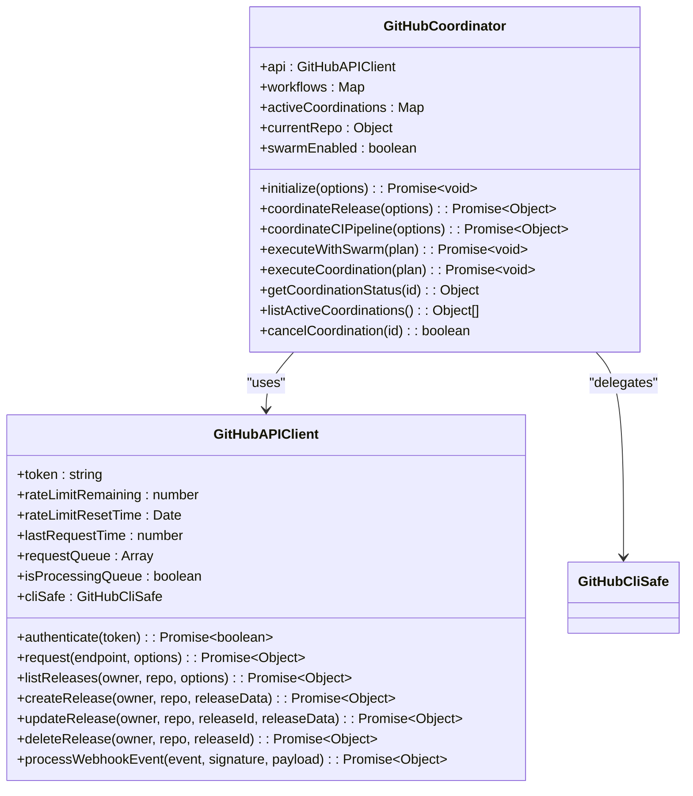
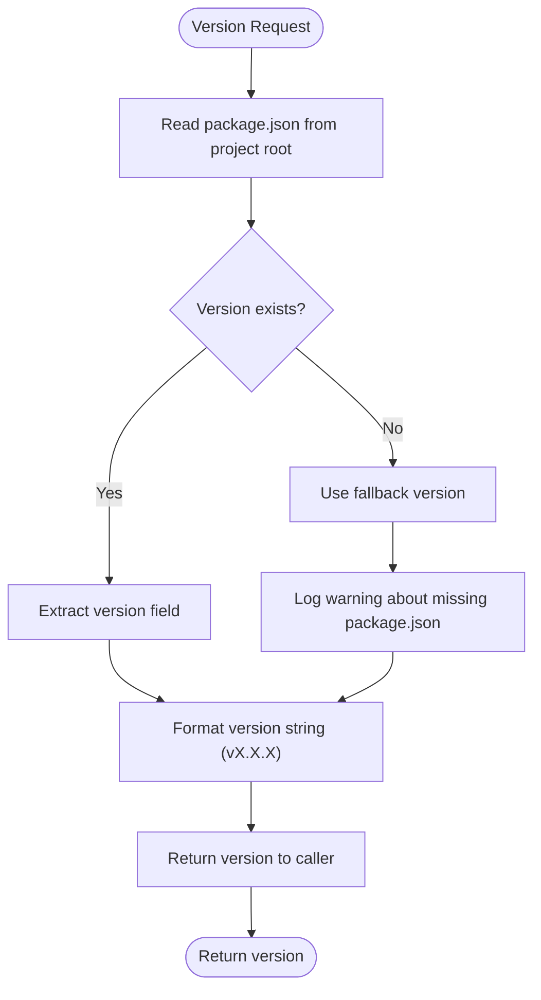
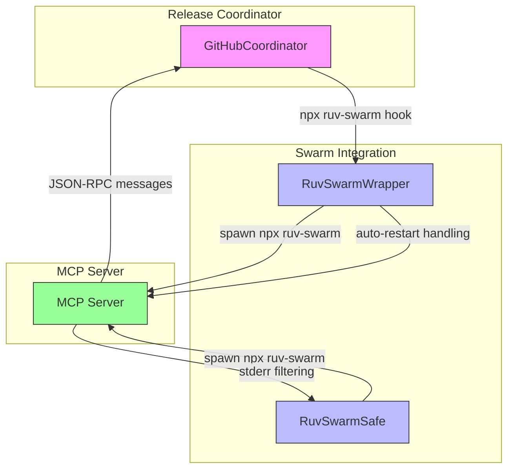

# Release Coordination

<cite>
**Referenced Files in This Document**   
- [gh-coordinator.js](file://src/cli/simple-commands/github/gh-coordinator.js)
- [github-api.js](file://src/cli/simple-commands/github/github-api.js)
- [version.js](file://src/core/version.js)
- [ruv-swarm-safe.js](file://scripts/ruv-swarm-safe.js)
- [ruv-swarm-wrapper.js](file://src/mcp/ruv-swarm-wrapper.js)
</cite>

## Table of Contents
1. [Introduction](#introduction)
2. [Core Components](#core-components)
3. [Release Workflow Implementation](#release-workflow-implementation)
4. [Semantic Versioning and Changelog Management](#semantic-versioning-and-changelog-management)
5. [Deployment Coordination and Asset Handling](#deployment-coordination-and-asset-handling)
6. [Integration with Version Control and Notification Systems](#integration-with-version-control-and-notification-systems)
7. [Common Issues and Troubleshooting](#common-issues-and-troubleshooting)
8. [Best Practices for Automated Release Pipelines](#best-practices-for-automated-release-pipelines)

## Introduction
The Release Coordination sub-feature in Claude-Flow provides a comprehensive system for managing GitHub releases through automated workflows. This system orchestrates version tagging, release notes generation, deployment coordination, and stakeholder notifications using a hierarchical coordination model. The implementation leverages both GitHub's REST API and CLI tools through a safety-wrapped interface, ensuring reliable and secure release operations. The coordination system integrates with swarm intelligence patterns for distributed task management and uses semantic versioning principles to maintain consistent release practices across projects.

**Section sources**
- [gh-coordinator.js](file://src/cli/simple-commands/github/gh-coordinator.js#L1-L606)
- [github-api.js](file://src/cli/simple-commands/github/github-api.js#L1-L625)

## Core Components

The release coordination system consists of several interconnected components that work together to manage the release process. The primary components include the GitHub Coordinator, GitHub API client, version management system, and swarm integration layer.

### GitHub Coordinator
The GitHub Coordinator serves as the central orchestrator for release processes, managing the workflow from preparation to completion. It implements a hierarchical coordination model with support for batch optimization and parallel operations.



**Diagram sources**
- [gh-coordinator.js](file://src/cli/simple-commands/github/gh-coordinator.js#L15-L606)
- [github-api.js](file://src/cli/simple-commands/github/github-api.js#L20-L625)

**Section sources**
- [gh-coordinator.js](file://src/cli/simple-commands/github/gh-coordinator.js#L15-L606)

## Release Workflow Implementation

The release workflow in Claude-Flow follows a structured sequence of steps designed to ensure reliability and consistency across releases. The coordinator manages this process through a well-defined execution plan.

### Release Coordination Sequence
The release process is orchestrated through a series of coordinated steps that ensure all necessary actions are completed in the correct order.

```mermaid
sequenceDiagram
participant User as "User"
participant Coordinator as "GitHubCoordinator"
participant API as "GitHubAPIClient"
participant CLI as "GitHubCliSafe"
participant Swarm as "RuvSwarm"
User->>Coordinator : coordinateRelease(options)
Coordinator->>Coordinator : initialize()
Coordinator->>API : authenticate(token)
API-->>Coordinator : success
Coordinator->>Coordinator : create coordination plan
Coordinator->>Swarm : check availability
Swarm-->>Coordinator : enabled
Coordinator->>Swarm : pre-task hook
Swarm-->>Coordinator : continue
Coordinator->>Coordinator : executeWithSwarm(plan)
loop For each step
Coordinator->>Swarm : pre-task hook
Swarm-->>Coordinator : continue
Coordinator->>Coordinator : executeCoordinationStep()
alt Step Type
case prepare_release_notes
Coordinator->>API : analyze repository structure
API-->>Coordinator : analysis data
case create_release_branch
Coordinator->>API : createBranch()
API-->>Coordinator : success
case run_release_tests
Coordinator->>API : listWorkflowRuns()
API-->>Coordinator : recent runs
case create_release_tag
Coordinator->>API : createRelease()
API-->>CLI : createReleaseCLI()
CLI-->>API : result
API-->>Coordinator : success
case publish_release
Coordinator->>API : updateRelease()
API-->>Coordinator : success
case notify_stakeholders
Coordinator->>Swarm : notification hook
Swarm-->>Coordinator : acknowledged
end
Coordinator->>Swarm : post-edit hook
Swarm-->>Coordinator : success
end
Coordinator->>Swarm : final notification
Swarm-->>Coordinator : completed
Coordinator-->>User : coordination plan
```

**Diagram sources**
- [gh-coordinator.js](file://src/cli/simple-commands/github/gh-coordinator.js#L480-L550)
- [github-api.js](file://src/cli/simple-commands/github/github-api.js#L300-L330)

**Section sources**
- [gh-coordinator.js](file://src/cli/simple-commands/github/gh-coordinator.js#L480-L550)

## Semantic Versioning and Changelog Management

The system implements semantic versioning principles to ensure consistent version numbering across releases. Version information is centrally managed and integrated with the release coordination process.

### Version Management System
The version management component reads version information from the project's package.json file, providing a single source of truth for version data.



**Diagram sources**
- [version.js](file://src/core/version.js#L1-L41)

**Section sources**
- [version.js](file://src/core/version.js#L1-L41)

## Deployment Coordination and Asset Handling

The deployment coordination system manages the complete release lifecycle, from preparation to publication. It handles version tagging, release creation, and asset attachment through both API and CLI interfaces.

### Release Creation Process
The system provides multiple pathways for creating releases, using both direct API calls and CLI wrappers for enhanced safety and functionality.

```mermaid
classDiagram
class GitHubAPIClient {
+createRelease(owner, repo, releaseData) : Promise~Object~
+createReleaseCLI(releaseData) : Promise~Object~
+checkCLIStatus() : Promise~boolean~
+getCLIStats() : Object
+cleanupCLI() : Promise~void~
}
class GitHubCliSafe {
+createRelease(options) : Promise~Object~
+checkGitHubCli() : Promise~boolean~
+checkAuthentication() : Promise~boolean~
+getStats() : Object
+cleanup() : Promise~void~
}
GitHubAPIClient --> GitHubCliSafe : "delegates"
GitHubCliSafe --> "gh CLI" : "executes"
```

**Diagram sources**
- [github-api.js](file://src/cli/simple-commands/github/github-api.js#L300-L330)
- [github-api.js](file://src/cli/simple-commands/github/github-api.js#L500-L530)

**Section sources**
- [github-api.js](file://src/cli/simple-commands/github/github-api.js#L300-L330)

## Integration with Version Control and Notification Systems

The release coordination system integrates with both version control and notification systems to provide a comprehensive release management solution. This integration ensures that all stakeholders are informed of release activities and that version control practices are properly enforced.

### Swarm Integration Architecture
The system uses ruv-swarm for event broadcasting and notification delivery, creating a distributed coordination network for release activities.



**Diagram sources**
- [gh-coordinator.js](file://src/cli/simple-commands/github/gh-coordinator.js#L90-L150)
- [ruv-swarm-safe.js](file://scripts/ruv-swarm-safe.js#L1-L74)
- [ruv-swarm-wrapper.js](file://src/mcp/ruv-swarm-wrapper.js#L1-L255)

**Section sources**
- [gh-coordinator.js](file://src/cli/simple-commands/github/gh-coordinator.js#L90-L150)
- [ruv-swarm-safe.js](file://scripts/ruv-swarm-safe.js#L1-L74)
- [ruv-swarm-wrapper.js](file://src/mcp/ruv-swarm-wrapper.js#L1-L255)

## Common Issues and Troubleshooting

The release coordination system may encounter various issues during operation. Understanding these common problems and their solutions is essential for maintaining reliable release processes.

### Known Issues and Solutions
The system addresses several common issues that can occur during release coordination:

**Authentication Failures**: When the GitHub token is missing or invalid, the system provides clear error messages and guidance for resolution. Ensure the GITHUB_TOKEN environment variable is set or provide a token through command-line options.

**Rate Limiting**: The GitHub API client implements rate limiting management to prevent exceeding GitHub's API limits. When the rate limit is approached, the system automatically waits until the limit resets before continuing.

**CLI Availability**: The system checks for the presence and authentication status of the GitHub CLI before attempting to use it. If the CLI is not available or not authenticated, the system falls back to API-only operations.

**Logger Issues in ruv-swarm**: The ruv-swarm integration includes error handling for known issues in version 1.0.8 where logger.logMemoryUsage is not a function. This is a non-critical error that does not affect functionality.

**Swarm Integration Failures**: If swarm integration is not available, the system continues with basic coordination features, providing a graceful degradation of functionality.

**Section sources**
- [github-api.js](file://src/cli/simple-commands/github/github-api.js#L50-L80)
- [ruv-swarm-safe.js](file://scripts/ruv-swarm-safe.js#L1-L74)
- [ruv-swarm-wrapper.js](file://src/mcp/ruv-swarm-wrapper.js#L1-L255)

## Best Practices for Automated Release Pipelines

Implementing effective automated release pipelines requires following several best practices to ensure reliability, security, and maintainability.

### Recommended Practices
1. **Environment Configuration**: Always set the GITHUB_TOKEN environment variable for authentication, or provide it through secure means during pipeline execution.

2. **Version Management**: Maintain version information in package.json and avoid hardcoding versions in multiple locations to ensure consistency.

3. **Error Handling**: Implement comprehensive error handling and logging to facilitate troubleshooting of release failures.

4. **Rate Limit Awareness**: Design pipelines to be aware of GitHub's rate limits, especially when coordinating multiple repositories or high-frequency operations.

5. **Security Practices**: Use the GitHub CLI safety wrapper for enhanced security when executing CLI commands, and validate webhook signatures when processing GitHub events.

6. **Rollback Procedures**: Implement clear rollback procedures for failed releases, including the ability to delete created releases and revert branch protection changes.

7. **Testing**: Always test release workflows in non-production environments before deploying to production repositories.

8. **Monitoring**: Use the built-in notification system to monitor release progress and receive alerts for successful completions or failures.

**Section sources**
- [gh-coordinator.js](file://src/cli/simple-commands/github/gh-coordinator.js#L1-L606)
- [github-api.js](file://src/cli/simple-commands/github/github-api.js#L1-L625)