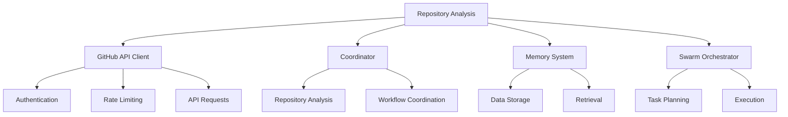
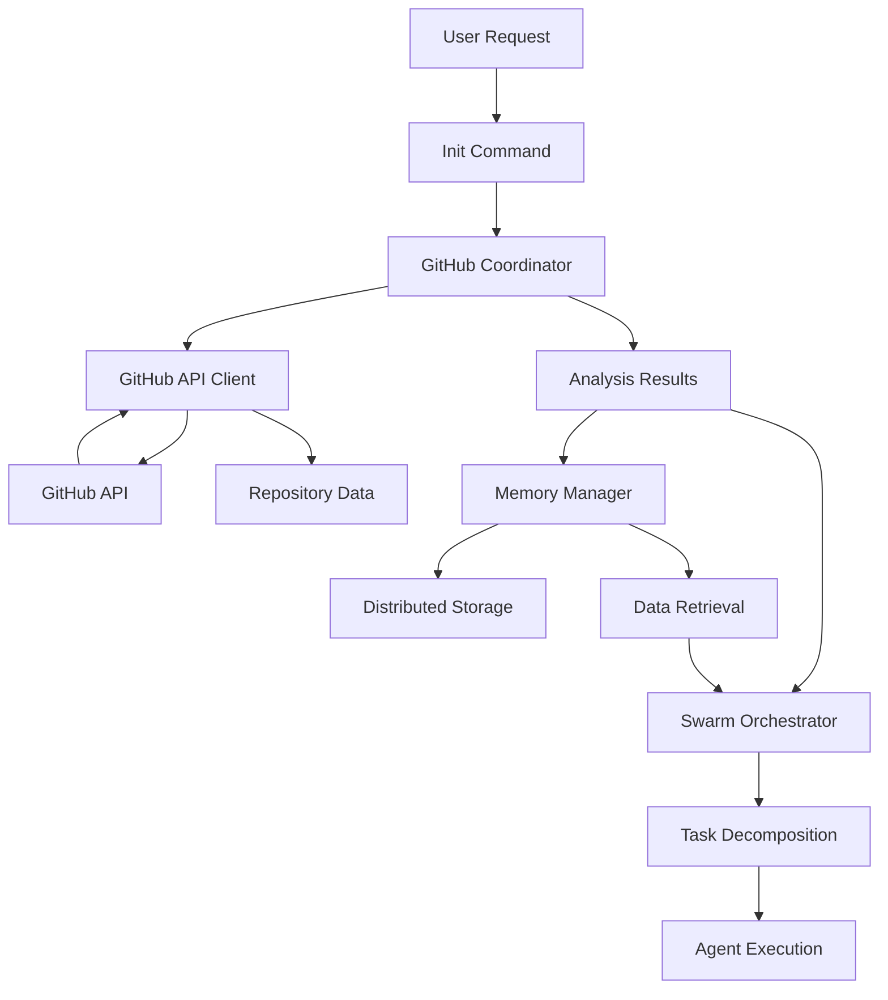
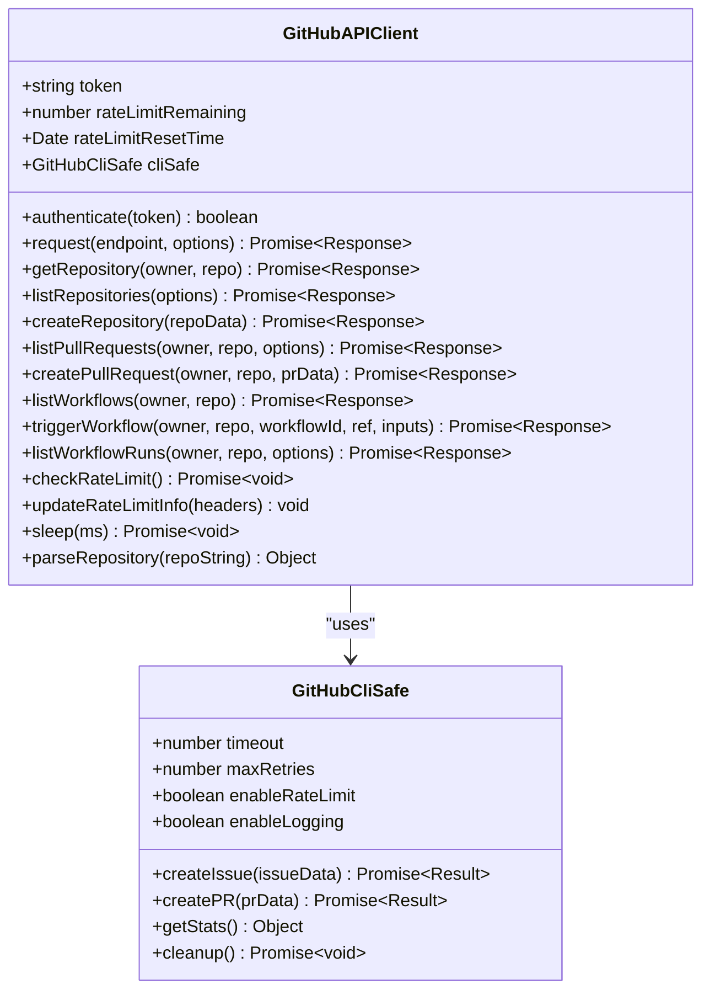
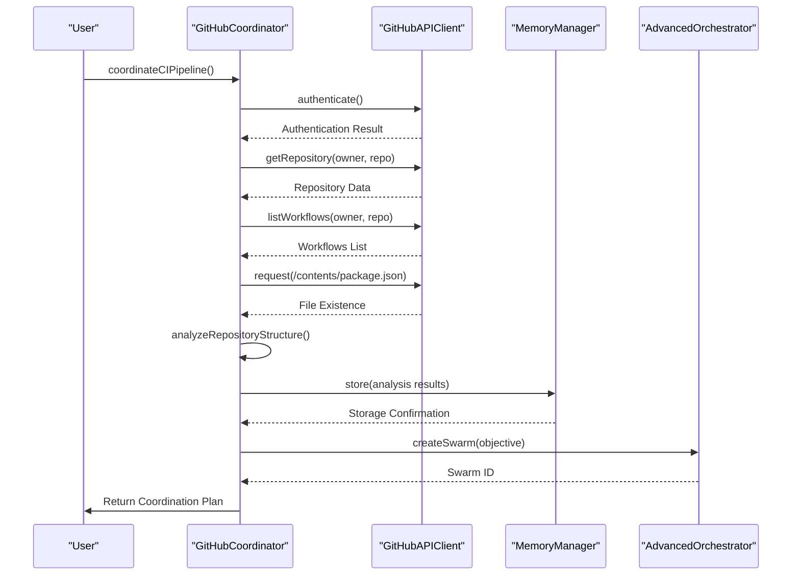
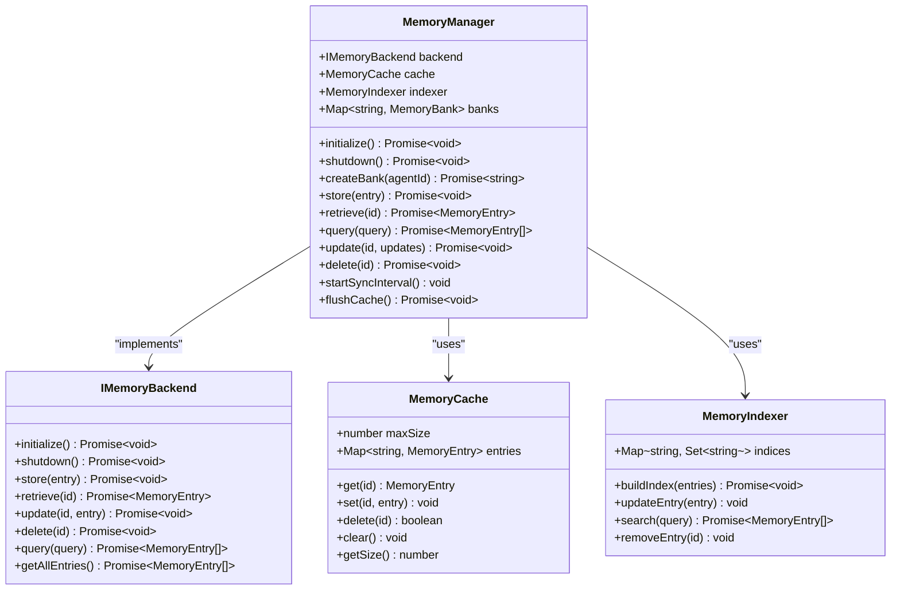
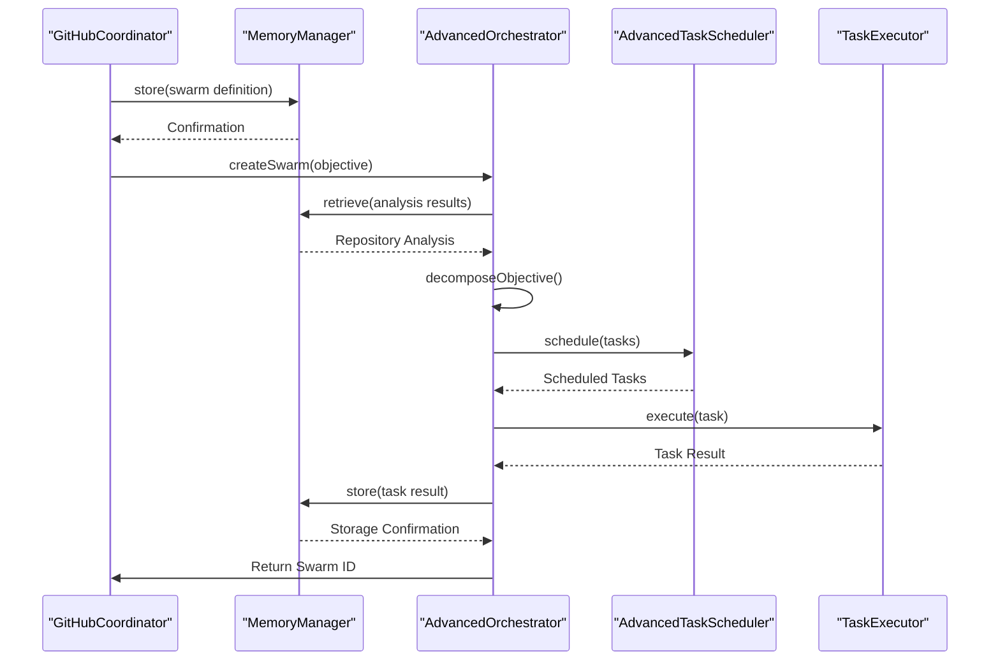
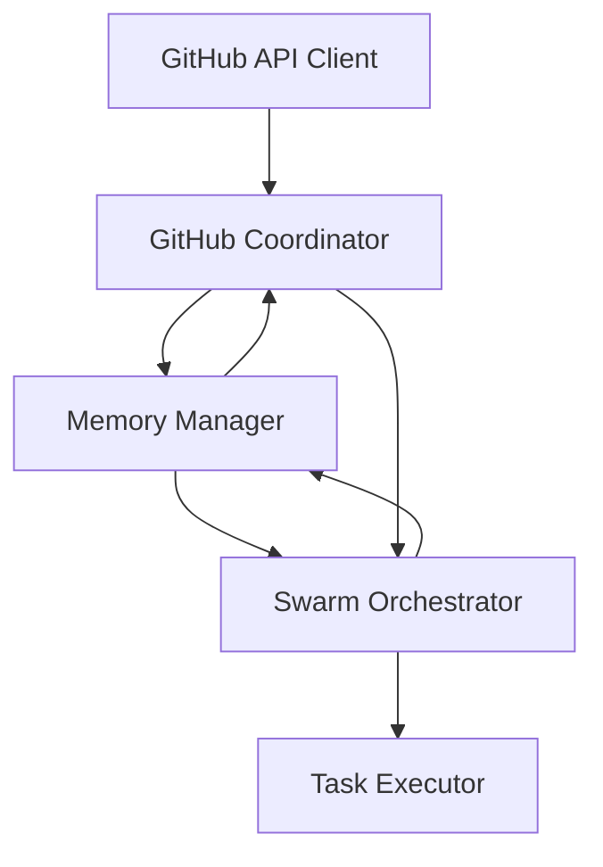

# Repository Analysis

<cite>
**Referenced Files in This Document**   
- [github-api.js](file://src/cli/simple-commands/github/github-api.js)
- [gh-coordinator.js](file://src/cli/simple-commands/github/gh-coordinator.js)
- [manager.ts](file://src/memory/manager.ts)
- [advanced-orchestrator.ts](file://src/swarm/advanced-orchestrator.ts)
</cite>

## Table of Contents
1. [Introduction](#introduction)
2. [Project Structure](#project-structure)
3. [Core Components](#core-components)
4. [Architecture Overview](#architecture-overview)
5. [Detailed Component Analysis](#detailed-component-analysis)
6. [Dependency Analysis](#dependency-analysis)
7. [Performance Considerations](#performance-considerations)
8. [Troubleshooting Guide](#troubleshooting-guide)
9. [Conclusion](#conclusion)

## Introduction
The Repository Analysis feature in Claude-Flow enables comprehensive analysis of GitHub repositories through API integration, metadata extraction, and code pattern recognition. This document details the implementation of repository analysis workflow, including authentication, data retrieval, storage mechanisms, and integration with swarm orchestration. The system retrieves repository metadata, analyzes file structures, identifies code patterns, and stores results for downstream processing by other components such as the swarm orchestrator and memory system.

## Project Structure
The repository analysis functionality is organized within the CLI commands directory, with specialized modules for GitHub API integration and workflow coordination. The core analysis components are located in the `src/cli/simple-commands/github/` directory, while memory management and swarm orchestration components are distributed across the `src/memory/` and `src/swarm/` directories respectively.

**Diagram sources**
- [github-api.js](file://src/cli/simple-commands/github/github-api.js)
- [gh-coordinator.js](file://src/cli/simple-commands/github/gh-coordinator.js)

**Section sources**
- [github-api.js](file://src/cli/simple-commands/github/github-api.js)
- [gh-coordinator.js](file://src/cli/simple-commands/github/gh-coordinator.js)

## Core Components
The repository analysis system comprises four main components: the GitHub API client for data retrieval, the coordinator for workflow execution, the memory manager for result storage, and the swarm orchestrator for task planning. These components work together to analyze repositories, store findings, and enable intelligent task decomposition based on analysis results.

**Section sources**
- [github-api.js](file://src/cli/simple-commands/github/github-api.js#L0-L625)
- [gh-coordinator.js](file://src/cli/simple-commands/github/gh-coordinator.js#L0-L606)
- [manager.ts](file://src/memory/manager.ts#L0-L500)
- [advanced-orchestrator.ts](file://src/swarm/advanced-orchestrator.ts#L0-L500)

## Architecture Overview
The repository analysis architecture follows a layered approach where the GitHub API client handles authentication and data retrieval, the coordinator manages the analysis workflow, the memory system stores results, and the swarm orchestrator uses these results for task planning. This modular design enables separation of concerns while maintaining tight integration between components.

**Diagram sources**
- [github-api.js](file://src/cli/simple-commands/github/github-api.js#L0-L625)
- [gh-coordinator.js](file://src/cli/simple-commands/github/gh-coordinator.js#L0-L606)
- [manager.ts](file://src/memory/manager.ts#L0-L500)
- [advanced-orchestrator.ts](file://src/swarm/advanced-orchestrator.ts#L0-L500)

## Detailed Component Analysis

### GitHub API Client Analysis
The GitHub API client provides a robust interface for interacting with GitHub's REST API, handling authentication, rate limiting, and request management. It serves as the foundation for all repository analysis operations.

#### Class Diagram

**Diagram sources**
- [github-api.js](file://src/cli/simple-commands/github/github-api.js#L0-L625)

**Section sources**
- [github-api.js](file://src/cli/simple-commands/github/github-api.js#L0-L625)

### Repository Analysis Workflow Analysis
The repository analysis workflow is orchestrated by the `GitHubCoordinator` class, which manages the complete analysis process from initialization to result storage. The workflow follows a structured sequence of steps to ensure comprehensive repository analysis.

#### Sequence Diagram

**Diagram sources**
- [gh-coordinator.js](file://src/cli/simple-commands/github/gh-coordinator.js#L0-L606)

**Section sources**
- [gh-coordinator.js](file://src/cli/simple-commands/github/gh-coordinator.js#L0-L606)

### Memory System Analysis
The memory system provides persistent storage for repository analysis results, enabling data retrieval and sharing across components. It implements a distributed architecture with caching, indexing, and persistence capabilities.

#### Class Diagram

**Diagram sources**
- [manager.ts](file://src/memory/manager.ts#L0-L500)

**Section sources**
- [manager.ts](file://src/memory/manager.ts#L0-L500)

### Swarm Orchestrator Analysis
The swarm orchestrator utilizes repository analysis results to plan and execute tasks through intelligent decomposition and agent coordination. It integrates with the memory system to access analysis data and create optimized task workflows.

#### Sequence Diagram

**Diagram sources**
- [advanced-orchestrator.ts](file://src/swarm/advanced-orchestrator.ts#L0-L500)

**Section sources**
- [advanced-orchestrator.ts](file://src/swarm/advanced-orchestrator.ts#L0-L500)

## Dependency Analysis
The repository analysis system demonstrates a well-defined dependency structure with clear separation of concerns. The GitHub API client serves as the foundational layer, providing data access capabilities to higher-level components. The coordinator depends on both the API client and memory system, orchestrating the analysis workflow and storing results. The swarm orchestrator depends on the memory system to access analysis results for task planning, creating a dependency chain from data retrieval to task execution.

**Diagram sources**
- [github-api.js](file://src/cli/simple-commands/github/github-api.js#L0-L625)
- [gh-coordinator.js](file://src/cli/simple-commands/github/gh-coordinator.js#L0-L606)
- [manager.ts](file://src/memory/manager.ts#L0-L500)
- [advanced-orchestrator.ts](file://src/swarm/advanced-orchestrator.ts#L0-L500)

**Section sources**
- [github-api.js](file://src/cli/simple-commands/github/github-api.js#L0-L625)
- [gh-coordinator.js](file://src/cli/simple-commands/github/gh-coordinator.js#L0-L606)
- [manager.ts](file://src/memory/manager.ts#L0-L500)
- [advanced-orchestrator.ts](file://src/swarm/advanced-orchestrator.ts#L0-L500)

## Performance Considerations
The repository analysis system incorporates several performance optimizations to handle large repositories and prevent API rate limiting. The GitHub API client implements rate limiting with automatic waiting when limits are approached, ensuring compliance with GitHub's API quotas. The memory system uses caching to reduce database access latency and implements background synchronization to prevent blocking operations. For large repositories, the system can be configured to selectively analyze specific file types or directories, reducing processing time and resource consumption.

The analysis workflow is designed to minimize API calls by batching related operations and caching results. When analyzing large repositories, the system prioritizes critical files such as configuration files, package manifests, and source code entry points. The memory manager's distributed architecture allows for horizontal scaling, enabling the system to handle increasing analysis loads by adding additional memory nodes.

## Troubleshooting Guide
Common issues in repository analysis typically relate to authentication, rate limiting, and network connectivity. Authentication failures occur when the GITHUB_TOKEN environment variable is not set or contains invalid credentials. These can be resolved by verifying the token's validity and ensuring it has the necessary permissions for repository access.

Rate limiting issues manifest as API request failures after extensive usage. The system automatically handles rate limiting by waiting for the reset period, but users can mitigate this by using personal access tokens with higher rate limits or by spacing out analysis requests. For private repositories, ensure the authentication token has appropriate access permissions.

Memory system issues may occur due to disk space limitations or database corruption. Regular maintenance tasks such as garbage collection and database optimization can prevent these issues. When integrating with the swarm orchestrator, ensure that analysis results are properly stored in memory before task planning begins, as missing data can lead to incomplete task decomposition.

**Section sources**
- [github-api.js](file://src/cli/simple-commands/github/github-api.js#L0-L625)
- [gh-coordinator.js](file://src/cli/simple-commands/github/gh-coordinator.js#L0-L606)
- [manager.ts](file://src/memory/manager.ts#L0-L500)

## Conclusion
The repository analysis system in Claude-Flow provides a comprehensive solution for analyzing GitHub repositories through a well-architected combination of API integration, workflow coordination, data storage, and task planning. By leveraging the GitHub API client for data retrieval, the coordinator for workflow management, the memory system for result persistence, and the swarm orchestrator for intelligent task decomposition, the system enables sophisticated analysis and automation capabilities. The modular design allows for easy extension and optimization, while the integrated error handling and performance considerations ensure reliable operation across various repository sizes and complexities.