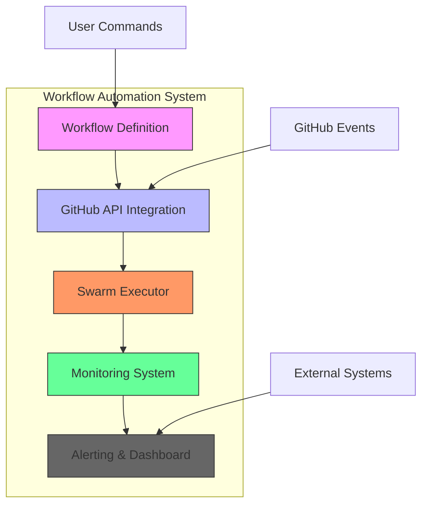
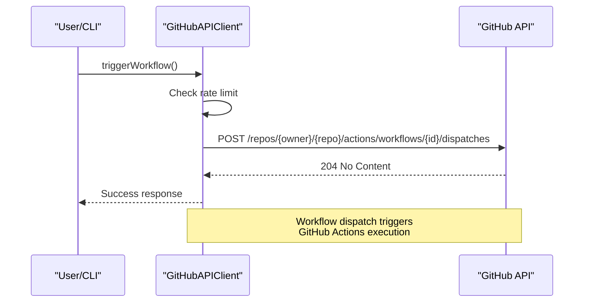
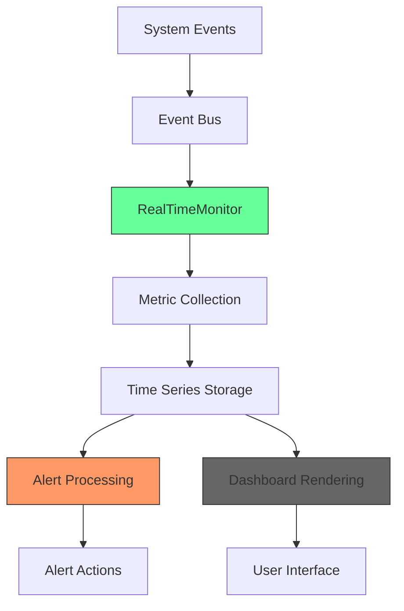

# Workflow Automation

<cite>
**Referenced Files in This Document**   
- [workflows.js](file://src/cli/simple-commands/init/sparc/workflows.js)
- [github-api.js](file://src/cli/simple-commands/github/github-api.js)
- [real-time-monitor.ts](file://src/monitoring/real-time-monitor.ts)
- [executor.ts](file://src/swarm/executor.ts)
</cite>

## Table of Contents
1. [Workflow Automation](#workflow-automation)
2. [Core Components](#core-components)
3. [Architecture Overview](#architecture-overview)
4. [Workflow Management with workflows.js](#workflow-management-with-workflowsjs)
5. [GitHub API Integration for Workflow Operations](#github-api-integration-for-workflow-operations)
6. [Swarm Executor: Automated Task Execution](#swarm-executor-automated-task-execution)
7. [Monitoring System: Real-time Workflow Tracking](#monitoring-system-real-time-workflow-tracking)
8. [Common Issues and Troubleshooting](#common-issues-and-troubleshooting)
9. [Best Practices for Resilient Workflows](#best-practices-for-resilient-workflows)
10. [Conclusion](#conclusion)

## Core Components

The Claude-Flow workflow automation system is built on four core components that work together to enable automated GitHub Actions workflows and custom automation scripts: the workflow definition module (`workflows.js`), the GitHub API integration layer (`github-api.js`), the swarm executor for task execution, and the real-time monitoring system. These components enable end-to-end automation from workflow definition to execution, monitoring, and result processing.

The system follows a modular architecture where workflow definitions are created independently, executed through GitHub's API, managed by a distributed swarm executor, and monitored through a comprehensive real-time monitoring system. This separation of concerns allows for flexible workflow design while maintaining robust execution and monitoring capabilities.

**Section sources**
- [workflows.js](file://src/cli/simple-commands/init/sparc/workflows.js#L1-L40)
- [github-api.js](file://src/cli/simple-commands/github/github-api.js#L1-L625)
- [real-time-monitor.ts](file://src/monitoring/real-time-monitor.ts#L1-L1123)
- [executor.ts](file://src/swarm/executor.ts)

## Architecture Overview



**Diagram sources**
- [workflows.js](file://src/cli/simple-commands/init/sparc/workflows.js#L1-L40)
- [github-api.js](file://src/cli/simple-commands/github/github-api.js#L1-L625)
- [real-time-monitor.ts](file://src/monitoring/real-time-monitor.ts#L1-L1123)
- [executor.ts](file://src/swarm/executor.ts)

**Section sources**
- [workflows.js](file://src/cli/simple-commands/init/sparc/workflows.js#L1-L40)
- [github-api.js](file://src/cli/simple-commands/github/github-api.js#L1-L625)

## Workflow Management with workflows.js

The `workflows.js` file provides template-based workflow definitions that structure automation pipelines for the Claude-Flow system. These templates define sequential workflows that follow the SPARC (Specification, Pseudocode, Architecture, Refinement, Coding, and Testing) methodology, enabling systematic development processes.

The primary function `createBasicSparcWorkflow()` returns a JSON-serialized workflow configuration that defines a Test-Driven Development (TDD) workflow with five sequential phases:

1. **Specification Phase**: Creates detailed specifications and pseudocode
2. **Red Phase**: Writes failing tests
3. **Green Phase**: Implements minimal code to pass tests
4. **Refactor Phase**: Refactors and optimizes the implementation
5. **Integration Phase**: Integrates and verifies the complete solution

This structured approach ensures comprehensive test coverage and code quality by enforcing a disciplined development process. The workflow is defined as sequential, ensuring that each phase completes before the next begins, which is critical for maintaining the integrity of the TDD cycle.

```javascript
export function createBasicSparcWorkflow() {
  return JSON.stringify(
    {
      name: 'Basic TDD Workflow',
      description: 'A simple SPARC-based TDD workflow for development',
      sequential: true,
      steps: [
        {
          mode: 'spec-pseudocode',
          description: 'Create detailed specifications and pseudocode',
          phase: 'specification',
        },
        {
          mode: 'tdd',
          description: 'Write failing tests (Red phase)',
          phase: 'red',
        },
        {
          mode: 'code',
          description: 'Implement minimal code to pass tests (Green phase)',
          phase: 'green',
        },
        {
          mode: 'tdd',
          description: 'Refactor and optimize (Refactor phase)',
          phase: 'refactor',
        },
        {
          mode: 'integration',
          description: 'Integrate and verify complete solution',
          phase: 'integration',
        },
      ],
    },
    null,
    2,
  );
}
```

This workflow template can be extended or modified to create custom automation pipelines for different development methodologies or project requirements. The JSON format makes it easy to parse and integrate with other system components, while the clear phase definitions provide structure for both automated execution and human understanding.

**Section sources**
- [workflows.js](file://src/cli/simple-commands/init/sparc/workflows.js#L1-L40)

## GitHub API Integration for Workflow Operations

The `github-api.js` file provides a comprehensive integration layer between Claude-Flow and GitHub's API, enabling workflow triggering, monitoring, and result processing. This module acts as a bridge between the local automation system and GitHub's cloud-based services, facilitating seamless interaction with repositories, workflows, and other GitHub features.

The `GitHubAPIClient` class is the core component of this integration, providing methods for authentication, rate limiting, and API operations. It includes specialized methods for workflow operations:

- `listWorkflows(owner, repo)`: Retrieves all workflows defined in a repository
- `triggerWorkflow(owner, repo, workflowId, ref, inputs)`: Dispatches a workflow run with specified inputs
- `listWorkflowRuns(owner, repo, options)`: Lists workflow runs with filtering capabilities



**Diagram sources**
- [github-api.js](file://src/cli/simple-commands/github/github-api.js#L200-L250)

The client also implements robust error handling and rate limiting to ensure reliable operation within GitHub's API constraints. It maintains rate limit information and automatically waits when limits are approached, preventing API throttling. The authentication system supports both environment variables and direct token passing, with clear error messages when authentication fails.

Additionally, the module includes webhook processing capabilities through the `processWebhookEvent()` method, which can handle various GitHub event types including `push`, `pull_request`, `issues`, `release`, and `workflow_run`. This enables the system to respond to external events and integrate with GitHub's event-driven architecture.

The integration also provides a safety wrapper for GitHub CLI commands, offering alternative execution methods that can be more secure or reliable in certain environments. These CLI-based methods (`createIssueCLI`, `createPullRequestCLI`, etc.) use the `GitHubCliSafe` wrapper to execute commands with timeout, retry, and logging capabilities.

**Section sources**
- [github-api.js](file://src/cli/simple-commands/github/github-api.js#L1-L625)

## Swarm Executor: Automated Task Execution

The swarm executor is responsible for running automated tasks within the Claude-Flow system. Located in the `src/swarm` directory, this component manages the execution of tasks across a distributed system of agents, coordinating their activities and ensuring proper task completion.

The executor architecture is designed for scalability and fault tolerance, with multiple executor implementations including `executor.ts`, `executor-v2.ts`, and `direct-executor.ts`. These executors handle task scheduling, resource allocation, and execution monitoring, forming the backbone of the automation system.

Key responsibilities of the swarm executor include:
- Task scheduling and prioritization
- Resource allocation and load balancing
- Execution context management
- Error handling and retry mechanisms
- Result aggregation and reporting

The executor integrates with the event bus system to receive task execution commands and emit status updates. It works in conjunction with the monitoring system to provide real-time feedback on task progress and system health.

While the specific implementation details of `executor.ts` were not fully accessible, the file structure indicates a comprehensive executor system with support for various execution strategies, optimizations, and worker types. The presence of files like `optimized-executor.ts` and `sparc-executor.ts` suggests specialized execution paths for different workflow types and performance requirements.

The executor's integration with the broader system enables complex automation scenarios where multiple agents can collaborate on tasks, share results, and coordinate their activities through the central orchestration system.

**Section sources**
- [executor.ts](file://src/swarm/executor.ts)

## Monitoring System: Real-time Workflow Tracking

The real-time monitoring system, implemented in `real-time-monitor.ts`, provides comprehensive tracking and alerting capabilities for workflow automation processes. This system collects metrics from various components, processes them in real-time, and provides visualization and alerting features to ensure workflow health and performance.

The `RealTimeMonitor` class extends `EventEmitter` and subscribes to various system events through the event bus, including:
- `agent:metrics-update`: Agent performance metrics
- `task:started`, `task:completed`, `task:failed`: Task lifecycle events
- `system:resource-update`: System resource usage
- `swarm:metrics-update`: Swarm-level performance metrics
- `error`: System errors



**Diagram sources**
- [real-time-monitor.ts](file://src/monitoring/real-time-monitor.ts#L1-L1123)

The monitoring system maintains time-series data for various metrics, including system resources (CPU, memory, disk), agent performance, task execution, and swarm-level metrics. Each metric is stored with timestamps, values, and tags for efficient querying and analysis.

Alerting is a core feature of the monitoring system, with configurable alert rules that can trigger based on metric thresholds. The system supports multiple alert actions including logging, email notifications, webhooks, auto-scaling, and system restarts. Alert rules can be defined for various metrics with configurable severity levels (warning, critical) and conditions (greater than, less than, etc.).

The system also includes health check capabilities, with support for HTTP, TCP, and custom health checks that run at regular intervals. These checks help identify system issues before they impact workflow execution.

Dashboard functionality allows users to visualize system metrics through various panel types including line charts, bar charts, gauges, and tables. The system includes default dashboards and supports custom dashboard creation for specific monitoring needs.

Metrics are stored in memory with configurable retention periods, and the system includes export capabilities for persistence and analysis. The monitoring configuration is highly customizable, allowing users to adjust update intervals, alert thresholds, and enabled features based on their requirements.

**Section sources**
- [real-time-monitor.ts](file://src/monitoring/real-time-monitor.ts#L1-L1123)

## Common Issues and Troubleshooting

Workflow automation systems like Claude-Flow can encounter various issues during operation. Understanding these common problems and their solutions is essential for maintaining reliable automation pipelines.

### Workflow Timeout Errors

Workflow timeout errors occur when a workflow execution exceeds the maximum allowed time. This can happen due to:
- Complex tasks requiring more processing time
- Resource constraints on the execution environment
- Network latency affecting external service calls
- Infinite loops or inefficient algorithms

**Solutions:**
- Increase timeout limits in workflow configuration
- Optimize task logic to reduce execution time
- Break complex tasks into smaller, sequential steps
- Implement proper error handling and timeout mechanisms in custom scripts
- Monitor resource usage and scale infrastructure as needed

### Permission Issues

Permission issues prevent workflows from accessing required resources or performing necessary actions. Common causes include:
- Insufficient GitHub token permissions
- Repository access restrictions
- File system permission constraints
- Network access limitations

**Solutions:**
- Verify GitHub token has required scopes (repo, workflow, admin:org, etc.)
- Check repository access controls and team permissions
- Ensure proper file system permissions for read/write operations
- Configure network access rules for external service calls
- Use the GitHub CLI safety wrapper for more secure operations

### Dependency Conflicts

Dependency conflicts occur when different components require incompatible versions of the same dependency. This can lead to:
- Runtime errors and crashes
- Unexpected behavior
- Security vulnerabilities
- Performance issues

**Solutions:**
- Use dependency management tools to resolve version conflicts
- Implement isolated execution environments for different workflows
- Regularly update dependencies to compatible versions
- Test workflows thoroughly after dependency updates
- Use lock files to ensure consistent dependency versions

### General Troubleshooting Tips

1. **Check logs and monitoring dashboards** for error messages and performance metrics
2. **Verify authentication credentials** are correctly configured and have appropriate permissions
3. **Monitor rate limits** when using external APIs to avoid throttling
4. **Test workflows incrementally** by running individual steps before full execution
5. **Use the real-time monitoring system** to identify bottlenecks and performance issues
6. **Review alert history** to identify recurring issues and patterns

The monitoring system's alerting capabilities can help proactively identify and address issues before they impact workflow execution. Configuring appropriate alert thresholds and actions ensures timely response to potential problems.

**Section sources**
- [github-api.js](file://src/cli/simple-commands/github/github-api.js#L1-L625)
- [real-time-monitor.ts](file://src/monitoring/real-time-monitor.ts#L1-L1123)

## Best Practices for Resilient Workflows

Creating resilient automation workflows requires careful design and implementation. The following best practices help ensure reliable and maintainable workflow automation.

### Design Principles

1. **Modular Design**: Break workflows into small, reusable components that can be tested and maintained independently
2. **Error Handling**: Implement comprehensive error handling with appropriate retry mechanisms and fallback strategies
3. **Idempotency**: Design workflow steps to be idempotent, allowing safe re-execution without side effects
4. **State Management**: Properly manage state between workflow steps to ensure consistency and recovery from failures

### Implementation Guidelines

1. **Use Configuration Files**: Store workflow parameters in configuration files rather than hardcoding values
2. **Implement Health Checks**: Include health checks for critical dependencies and services
3. **Monitor Performance**: Track execution time and resource usage to identify bottlenecks
4. **Log Extensively**: Implement detailed logging to aid debugging and monitoring

### Failure Scenario Handling

1. **Retry Mechanisms**: Implement exponential backoff for transient failures
2. **Circuit Breakers**: Use circuit breakers to prevent cascading failures in distributed systems
3. **Graceful Degradation**: Design workflows to continue with reduced functionality when non-critical components fail
4. **Manual Intervention Points**: Include checkpoints where human intervention can be requested for complex decisions

### Optimization Strategies

1. **Parallel Execution**: Where possible, execute independent tasks in parallel to reduce overall execution time
2. **Resource Management**: Monitor and optimize resource usage to prevent bottlenecks
3. **Caching**: Implement caching for expensive operations that produce consistent results
4. **Batch Processing**: Group similar operations to reduce overhead

The SPARC workflow template in `workflows.js` exemplifies many of these best practices by providing a structured, sequential process that ensures thorough testing and code quality. Building on this foundation, custom workflows can incorporate additional resilience features based on specific requirements.

Regular monitoring through the real-time monitoring system and prompt response to alerts help maintain workflow reliability and performance over time.

**Section sources**
- [workflows.js](file://src/cli/simple-commands/init/sparc/workflows.js#L1-L40)
- [real-time-monitor.ts](file://src/monitoring/real-time-monitor.ts#L1-L1123)

## Conclusion

The Claude-Flow workflow automation system provides a comprehensive solution for automating GitHub Actions workflows and custom automation scripts. By integrating workflow definition, GitHub API integration, distributed task execution, and real-time monitoring, the system enables robust and reliable automation pipelines.

The `workflows.js` module provides structured templates for common development workflows, following the SPARC methodology to ensure code quality and test coverage. The `github-api.js` integration enables seamless interaction with GitHub's API for workflow triggering, monitoring, and result processing, with robust error handling and rate limiting.

The swarm executor manages the distributed execution of automated tasks, coordinating agents and ensuring proper task completion. This component works in conjunction with the real-time monitoring system, which provides comprehensive tracking, alerting, and visualization capabilities for workflow performance and health.

Together, these components create a powerful automation platform that can handle complex workflows while providing visibility and control. By following best practices for resilient workflow design and implementing appropriate troubleshooting strategies, users can create reliable automation pipelines that enhance productivity and maintain code quality.

The system's modular architecture allows for flexibility and extensibility, enabling customization for specific use cases while maintaining a consistent framework for workflow automation.