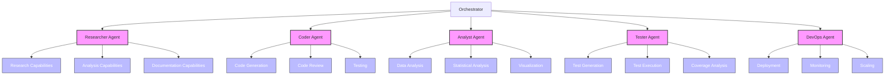
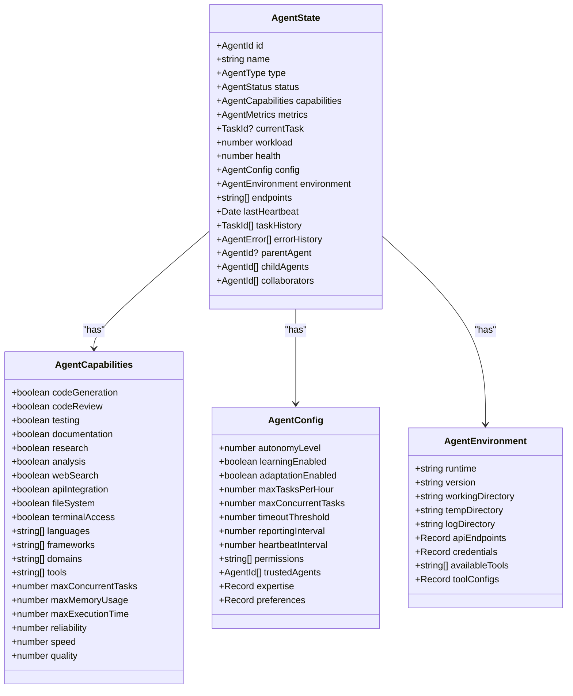
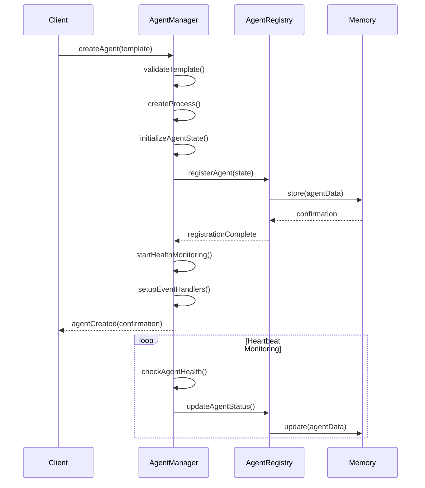
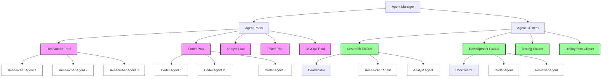
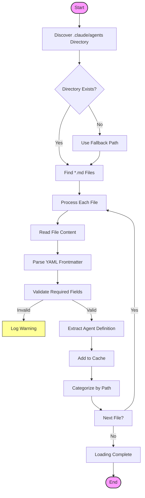
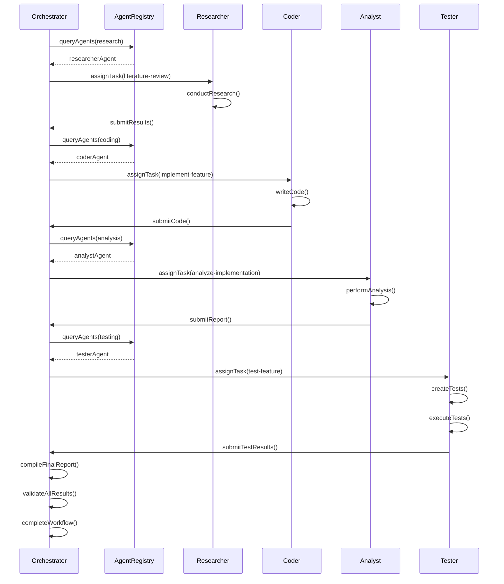
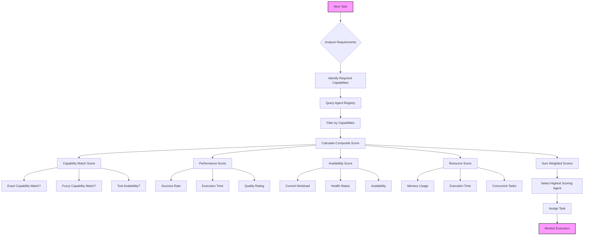

# Agent Specialization

<cite>
**Referenced Files in This Document**   
- [agent-registry.ts](file://src/agents/agent-registry.ts)
- [agent-manager.ts](file://src/agents/agent-manager.ts)
- [agent-loader.ts](file://src/agents/agent-loader.ts)
- [types.ts](file://src/swarm/types.ts)
- [research-config.json](file://examples/01-configurations/specialized/research-config.json)
- [testing-config.json](file://examples/01-configurations/specialized/testing-config.json)
- [machine-learning-workflow.json](file://examples/02-workflows/specialized/machine-learning-workflow.json)
</cite>

## Table of Contents
1. [Introduction](#introduction)
2. [Agent Specialization Overview](#agent-specialization-overview)
3. [Domain Model](#domain-model)
4. [Agent Creation and Management](#agent-creation-and-management)
5. [Specialization Hierarchies](#specialization-hierarchies)
6. [Dynamic Capability Loading](#dynamic-capability-loading)
7. [Agent Coordination System](#agent-coordination-system)
8. [Common Issues and Solutions](#common-issues-and-solutions)
9. [Configuration Examples](#configuration-examples)
10. [Conclusion](#conclusion)

## Introduction
The Agent Specialization sub-feature enables the creation of specialized worker agents with distinct capabilities within the hive-mind system. This document provides a comprehensive analysis of the implementation, covering the domain model, agent creation patterns, coordination mechanisms, and practical configuration examples. The system allows for the deployment of agents with specific expertise such as research, coding, analysis, and testing, enabling efficient task distribution and execution in complex workflows.

## Agent Specialization Overview
The agent specialization system implements a flexible architecture that allows for the creation of worker agents with specific capabilities tailored to different types of tasks. The system is designed around a hive-mind model where specialized agents collaborate under a coordination framework to accomplish complex objectives.

The specialization model is based on a multi-layered approach:
- **Capability-based specialization**: Agents are defined by their capabilities matrix
- **Type-based categorization**: Agents are grouped by functional types
- **Dynamic loading**: Agent definitions are loaded from configuration files
- **Hierarchical organization**: Agents can be organized into clusters and pools

This approach enables the system to efficiently assign tasks to the most appropriate agents based on their specialized capabilities, ensuring optimal performance and resource utilization.



**Diagram sources**
- [types.ts](file://src/swarm/types.ts#L60-L90)
- [agent-manager.ts](file://src/agents/agent-manager.ts#L50-L100)

**Section sources**
- [agent-manager.ts](file://src/agents/agent-manager.ts#L1-L200)
- [types.ts](file://src/swarm/types.ts#L50-L100)

## Domain Model
The domain model for agent specialization is centered around the AgentCapabilities interface, which defines the comprehensive set of capabilities that an agent can possess. This model enables fine-grained specialization and capability-based agent assignment.

### Agent Capabilities Matrix
The capabilities matrix is structured into several categories:

**Core Capabilities**
- codeGeneration: Ability to generate code
- codeReview: Ability to review and critique code
- testing: Ability to create and execute tests
- documentation: Ability to create documentation
- research: Ability to conduct research
- analysis: Ability to analyze data and information

**Communication Capabilities**
- webSearch: Ability to search the web
- apiIntegration: Ability to integrate with APIs
- fileSystem: Ability to access the file system
- terminalAccess: Ability to access the terminal

**Specialized Capabilities**
- languages: Array of supported programming languages
- frameworks: Array of supported frameworks and libraries
- domains: Array of domain expertise areas
- tools: Array of available tools

**Resource Limits**
- maxConcurrentTasks: Maximum number of concurrent tasks
- maxMemoryUsage: Maximum memory usage in bytes
- maxExecutionTime: Maximum execution time in milliseconds

**Performance Characteristics**
- reliability: 0-1 reliability score
- speed: Relative speed rating
- quality: Quality rating



**Diagram sources**
- [types.ts](file://src/swarm/types.ts#L60-L90)

**Section sources**
- [types.ts](file://src/swarm/types.ts#L50-L100)

## Agent Creation and Management
The agent creation and management system implements a factory pattern through the AgentManager class, which serves as the central component for creating, managing, and coordinating specialized agents.

### Factory Pattern Implementation
The AgentManager class implements a comprehensive factory pattern for agent creation and management. It provides methods for creating agents based on templates, managing agent lifecycles, and handling agent pools and clusters.

Key features of the factory implementation:
- **Template-based creation**: Agents are created from predefined templates
- **Lifecycle management**: Full control over agent startup, monitoring, and shutdown
- **Resource management**: Tracking and limiting resource usage
- **Health monitoring**: Continuous health checks and automatic recovery
- **Scaling policies**: Dynamic scaling based on workload and performance metrics

The factory pattern enables consistent agent creation while allowing for specialization through configuration templates.

### Agent Registry
The AgentRegistry class provides persistent storage and coordination for agent management. It maintains a registry of all active agents with their metadata and state, enabling efficient agent discovery and management.

Key features of the registry:
- **Persistent storage**: Agent information is stored in distributed memory
- **Caching**: Local caching for improved performance
- **Event emission**: Events for agent registration, updates, and unregistration
- **Query capabilities**: Flexible querying of agents by type, status, tags, etc.
- **Archiving**: Preservation of agent history when agents are unregistered



**Diagram sources**
- [agent-manager.ts](file://src/agents/agent-manager.ts#L1-L200)
- [agent-registry.ts](file://src/agents/agent-registry.ts#L1-L50)

**Section sources**
- [agent-manager.ts](file://src/agents/agent-manager.ts#L1-L200)
- [agent-registry.ts](file://src/agents/agent-registry.ts#L1-L100)

## Specialization Hierarchies
The system implements a hierarchical specialization model that allows for the organization of agents into logical groups based on their capabilities and roles.

### Agent Types
The system supports multiple agent types, each with specific specializations:

**Researcher Agents**
- Focus on information gathering and analysis
- Specialized in literature review, data analysis, and synthesis
- Equipped with research tools like search engines and citation managers
- Optimized for thorough analysis and accurate information gathering

**Coder Agents**
- Focus on code generation and modification
- Specialized in specific programming languages and frameworks
- Equipped with development tools and testing frameworks
- Optimized for code quality and best practices

**Analyst Agents**
- Focus on data analysis and insights
- Specialized in statistical analysis, visualization, and predictive modeling
- Equipped with data analysis tools and libraries
- Optimized for identifying patterns and trends

**Tester Agents**
- Focus on test creation and execution
- Specialized in unit testing, integration testing, and e2e testing
- Equipped with testing frameworks and coverage tools
- Optimized for comprehensive test coverage

**DevOps Agents**
- Focus on deployment and operations
- Specialized in containerization, orchestration, and monitoring
- Equipped with DevOps tools and platforms
- Optimized for reliability and scalability

### Agent Clusters and Pools
The system organizes agents into clusters and pools for efficient management:

**Agent Clusters**
- Groups of agents working together on specific tasks
- Have a coordinator agent for task orchestration
- Support different distribution strategies (round-robin, load-based, capability-based)
- Can scale automatically based on workload

**Agent Pools**
- Collections of agents of the same type
- Have minimum and maximum size limits
- Support auto-scaling based on demand
- Track available and busy agents separately



**Diagram sources**
- [agent-manager.ts](file://src/agents/agent-manager.ts#L150-L200)

**Section sources**
- [agent-manager.ts](file://src/agents/agent-manager.ts#L100-L200)

## Dynamic Capability Loading
The system implements dynamic capability loading through the AgentLoader class, which reads agent definitions from the .claude/agents directory. This enables flexible configuration and specialization without requiring code changes.

### Agent Definition Format
Agent definitions are stored in markdown files with YAML frontmatter that specifies the agent's properties:

```yaml
---
name: Research Assistant
type: researcher
color: "#3498db"
metadata:
  description: "Specialized in academic research and literature review"
  capabilities:
    - research
    - analysis
    - documentation
priority: high
hooks:
  pre: setup-research-environment.sh
  post: cleanup-research-data.sh
---
## Research Assistant

This agent specializes in conducting thorough academic research, analyzing scholarly articles, and synthesizing findings into comprehensive reports.
```

### Loading Process
The agent loading process follows these steps:

1. **Directory discovery**: The system searches for the .claude/agents directory by walking up the directory tree
2. **File discovery**: All markdown files in the agents directory are found using glob patterns
3. **Parsing**: Each file is parsed to extract the YAML frontmatter and markdown content
4. **Validation**: Required fields are validated (name, description)
5. **Caching**: Parsed agent definitions are cached for performance
6. **Categorization**: Agents are grouped by directory structure into categories

The system also supports legacy agent type mapping for backward compatibility, allowing older agent types to be resolved to their current equivalents.



**Diagram sources**
- [agent-loader.ts](file://src/agents/agent-loader.ts#L1-L200)

**Section sources**
- [agent-loader.ts](file://src/agents/agent-loader.ts#L1-L200)

## Agent Coordination System
The agent coordination system manages the interaction between specialized agents and ensures efficient task distribution and execution.

### Task Assignment
The system uses a capability-based task assignment strategy that matches tasks to agents based on their capabilities. When a task is submitted, the system:

1. Analyzes the task requirements
2. Queries the agent registry for agents with matching capabilities
3. Evaluates agent availability and workload
4. Selects the most appropriate agent based on capability match and performance metrics
5. Assigns the task to the selected agent

### Communication Patterns
Agents communicate through a message bus system that supports several patterns:

**Direct Messaging**
- One agent sends a message directly to another agent
- Used for task assignment and results reporting
- Supports request-response and fire-and-forget patterns

**Broadcast Messaging**
- One agent sends a message to all agents or a group of agents
- Used for system events and notifications
- Allows agents to subscribe to specific message types

**Event-Driven Communication**
- Agents emit events when significant state changes occur
- Other agents can subscribe to these events
- Enables reactive behavior and coordination

### Workflow Orchestration
The system supports complex workflows through the definition of task dependencies and execution modes. Workflows can be:

**Sequential**
- Tasks execute in a predefined order
- Each task waits for the previous task to complete
- Suitable for linear processes

**Parallel**
- Multiple tasks execute simultaneously
- Independent tasks can run in parallel
- Improves efficiency for independent operations

**Pipeline**
- Tasks are organized in a pipeline with input/output dependencies
- Output from one task becomes input to the next
- Enables data processing workflows



**Diagram sources**
- [agent-manager.ts](file://src/agents/agent-manager.ts#L200-L300)
- [agent-registry.ts](file://src/agents/agent-registry.ts#L100-L150)

**Section sources**
- [agent-manager.ts](file://src/agents/agent-manager.ts#L200-L300)

## Common Issues and Solutions
The agent specialization system addresses several common issues that arise in multi-agent systems.

### Capability Conflicts
**Issue**: Multiple agents with similar capabilities may compete for tasks, leading to inefficiency.

**Solution**: The system implements a capability scoring system that ranks agents based on their expertise in specific domains. When multiple agents can perform a task, the system selects the agent with the highest capability score for that specific task.

```typescript
// Example capability scoring
const expertise: Record<string, number> = {
  "machine-learning": 0.9,
  "data-analysis": 0.8,
  "web-development": 0.6
};
```

### Agent Overload
**Issue**: Agents may become overloaded with tasks, leading to degraded performance.

**Solution**: The system implements several overload prevention mechanisms:

- **Workload monitoring**: Tracks each agent's current workload (0-1 scale)
- **Capacity limits**: Enforces maximum concurrent tasks per agent
- **Auto-scaling**: Automatically creates additional agents when demand exceeds capacity
- **Task queuing**: Queues tasks when all agents are busy

### Skill Mismatch
**Issue**: Tasks may be assigned to agents without the necessary skills, resulting in poor quality output.

**Solution**: The system uses a comprehensive capability matching algorithm that:

1. Analyzes task requirements in detail
2. Compares requirements against agent capabilities
3. Requires exact matches for critical capabilities
4. Uses fuzzy matching for secondary capabilities
5. Validates tool availability for specialized tasks

### Optimal Agent Assignment
The system implements a multi-factor agent assignment algorithm that considers:

**Capability Match**
- Exact match for required capabilities
- Weighted scoring for preferred capabilities
- Tool availability verification

**Performance Metrics**
- Historical success rate
- Average execution time
- Quality ratings
- Reliability score

**Current State**
- Current workload (0-1 scale)
- Health status
- Availability

**Resource Constraints**
- Memory usage limits
- Execution time limits
- Concurrent task limits

The assignment algorithm calculates a composite score for each eligible agent and selects the agent with the highest score.



**Diagram sources**
- [agent-manager.ts](file://src/agents/agent-manager.ts#L500-L600)

**Section sources**
- [agent-manager.ts](file://src/agents/agent-manager.ts#L500-L600)

## Configuration Examples
The system provides several configuration examples that demonstrate how to set up specialized agents for different use cases.

### Research Configuration
The research configuration optimizes the system for research and analysis tasks:

```json
{
  "name": "Research Configuration",
  "description": "Optimized for research and analysis tasks",
  "orchestrator": {
    "timeout": 300000,
    "systemPrompt": "You are a research assistant focused on thorough analysis and accurate information gathering."
  },
  "agents": {
    "defaultCapabilities": ["research", "analysis", "documentation"],
    "specializations": {
      "literature-review": {
        "tools": ["search", "pdf-reader", "citation-manager"]
      },
      "data-analysis": {
        "tools": ["python", "statistics", "visualization"]
      },
      "synthesis": {
        "tools": ["markdown", "diagram-generator"]
      }
    }
  },
  "memory": {
    "backend": "sqlite",
    "location": "./research-memory.db",
    "schemas": {
      "papers": {
        "title": "string",
        "authors": "array",
        "year": "number",
        "doi": "string",
        "summary": "text",
        "relevance": "number"
      },
      "findings": {
        "source": "string",
        "claim": "text",
        "evidence": "text",
        "confidence": "number"
      }
    }
  },
  "tools": {
    "search": {
      "engines": ["google-scholar", "pubmed", "arxiv"],
      "maxResults": 50
    },
    "citation": {
      "style": "APA",
      "autoFormat": true
    }
  }
}
```

This configuration sets up agents with research-focused capabilities and configures specialized tools for academic research.

### Testing Configuration
The testing configuration optimizes the system for test generation and execution:

```json
{
  "name": "Testing Configuration",
  "description": "Configuration optimized for test generation and execution",
  "orchestrator": {
    "model": "claude-3-sonnet-20240229",
    "temperature": 0.2,
    "maxTokens": 4096,
    "timeout": 60000,
    "systemPrompt": "Generate comprehensive test suites with edge cases and good coverage."
  },
  "testing": {
    "framework": "jest",
    "coverage": {
      "threshold": 80,
      "reportFormats": ["text", "lcov", "html"]
    },
    "patterns": {
      "unit": "**/*.test.js",
      "integration": "**/*.integration.js",
      "e2e": "**/*.e2e.js"
    },
    "mockGeneration": {
      "enabled": true,
      "autoMock": ["database", "api", "filesystem"]
    }
  },
  "agents": {
    "testGenerator": {
      "capabilities": ["test-generation", "mock-creation"],
      "temperature": 0.1
    },
    "testRunner": {
      "capabilities": ["test-execution", "coverage-analysis"],
      "parallel": true,
      "maxWorkers": 4
    }
  }
}
```

This configuration sets up specialized test generation and execution agents with appropriate tools and settings.

### Machine Learning Workflow
The machine learning workflow demonstrates a complex multi-agent workflow:

```json
{
  "name": "Machine Learning Pipeline",
  "description": "End-to-end ML workflow from data preparation to model deployment",
  "agents": [
    {
      "id": "data-engineer",
      "name": "Data Engineer",
      "type": "analyzer",
      "capabilities": ["data-cleaning", "feature-engineering", "etl"],
      "tools": ["pandas", "numpy", "sklearn"]
    },
    {
      "id": "ml-researcher",
      "name": "ML Researcher",
      "type": "researcher",
      "capabilities": ["model-selection", "hyperparameter-tuning", "experimentation"],
      "tools": ["sklearn", "tensorflow", "pytorch"]
    },
    {
      "id": "ml-engineer",
      "name": "ML Engineer",
      "type": "developer",
      "capabilities": ["model-training", "optimization", "pipeline-creation"],
      "tools": ["mlflow", "kubeflow", "tensorflow"]
    },
    {
      "id": "evaluator",
      "name": "Model Evaluator",
      "type": "tester",
      "capabilities": ["model-evaluation", "metrics-analysis", "validation"],
      "tools": ["sklearn", "matplotlib", "seaborn"]
    },
    {
      "id": "deployer",
      "name": "ML Ops Engineer",
      "type": "devops",
      "capabilities": ["model-deployment", "monitoring", "scaling"],
      "tools": ["docker", "kubernetes", "prometheus"]
    }
  ],
  "tasks": [
    {
      "id": "data-preparation",
      "name": "Prepare and Clean Data",
      "agentId": "data-engineer",
      "type": "data-processing",
      "input": {
        "dataset": "customer_churn.csv",
        "operations": ["missing-values", "outliers", "normalization", "encoding"]
      }
    },
    {
      "id": "feature-engineering",
      "name": "Engineer Features",
      "agentId": "data-engineer",
      "type": "data-processing",
      "dependencies": ["data-preparation"]
    },
    {
      "id": "model-research",
      "name": "Research Best Models",
      "agentId": "ml-researcher",
      "type": "research",
      "dependencies": ["feature-engineering"],
      "parallel": true
    },
    {
      "id": "model-training",
      "name": "Train Final Model",
      "agentId": "ml-engineer",
      "type": "training",
      "dependencies": ["model-research"]
    },
    {
      "id": "model-evaluation",
      "name": "Evaluate Model Performance",
      "agentId": "evaluator",
      "type": "testing",
      "dependencies": ["model-training"]
    },
    {
      "id": "model-deployment",
      "name": "Deploy Model to Production",
      "agentId": "deployer",
      "type": "deployment",
      "dependencies": ["model-evaluation"]
    }
  ]
}
```

This workflow demonstrates how specialized agents collaborate in a pipeline to complete a complex machine learning project.

**Section sources**
- [research-config.json](file://examples/01-configurations/specialized/research-config.json)
- [testing-config.json](file://examples/01-configurations/specialized/testing-config.json)
- [machine-learning-workflow.json](file://examples/02-workflows/specialized/machine-learning-workflow.json)

## Conclusion
The Agent Specialization sub-feature provides a robust framework for creating and managing specialized worker agents within the hive-mind system. By implementing a comprehensive domain model, factory pattern for agent creation, and sophisticated coordination mechanisms, the system enables efficient task distribution and execution across agents with different capabilities.

Key strengths of the implementation include:
- **Flexible specialization**: Agents can be specialized for specific domains and tasks
- **Dynamic loading**: Agent definitions can be loaded and updated without code changes
- **Capability-based assignment**: Tasks are assigned to agents based on their specific capabilities
- **Hierarchical organization**: Agents can be organized into pools and clusters for efficient management
- **Comprehensive monitoring**: Agent health, performance, and resource usage are continuously monitored

The system effectively addresses common challenges in multi-agent systems, such as capability conflicts, agent overload, and skill mismatch, through sophisticated assignment algorithms and resource management strategies. The provided configuration examples demonstrate how the system can be tailored to different use cases, from research and testing to complex machine learning workflows.

This implementation provides a solid foundation for building intelligent, collaborative agent systems that can adapt to different tasks and domains while maintaining high performance and reliability.