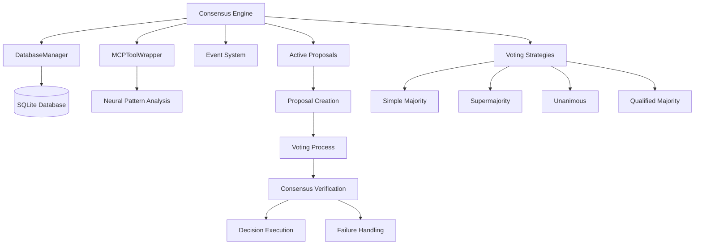
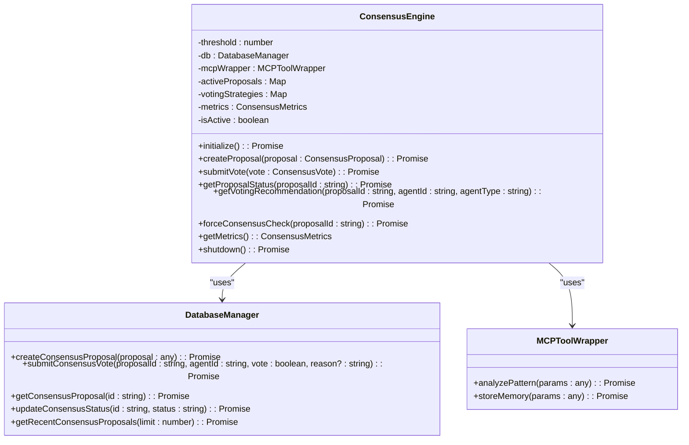
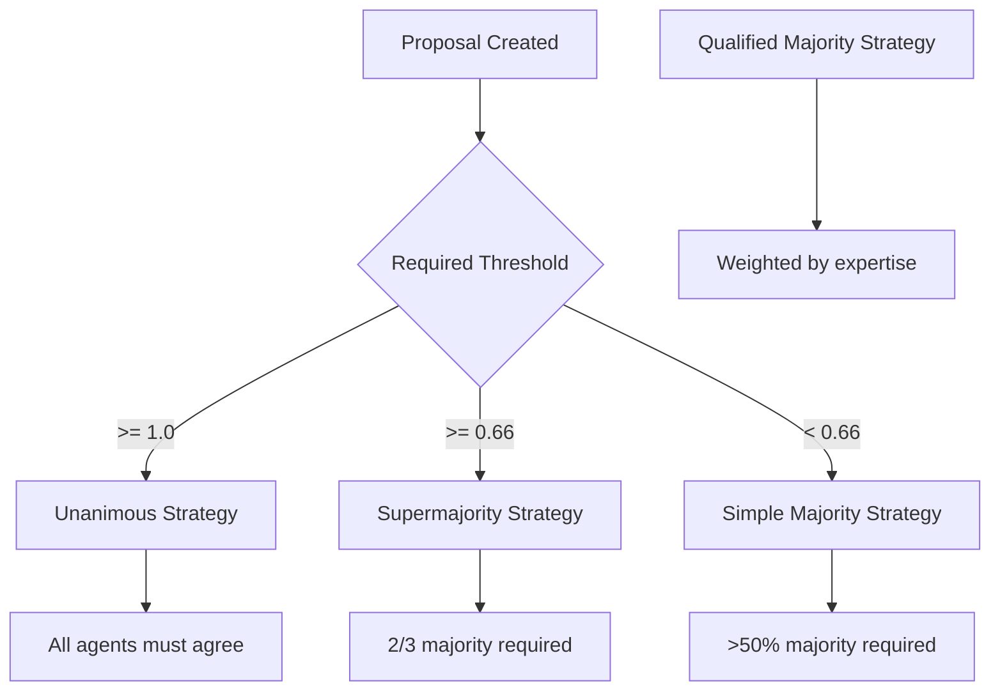
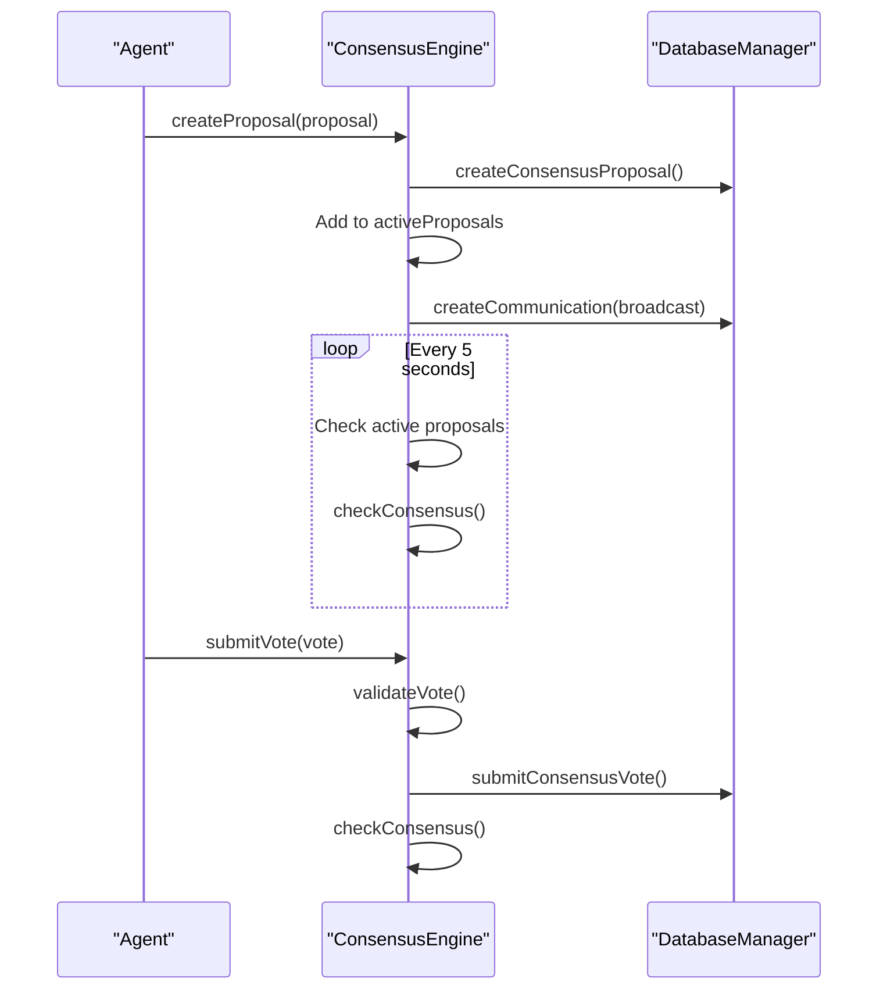
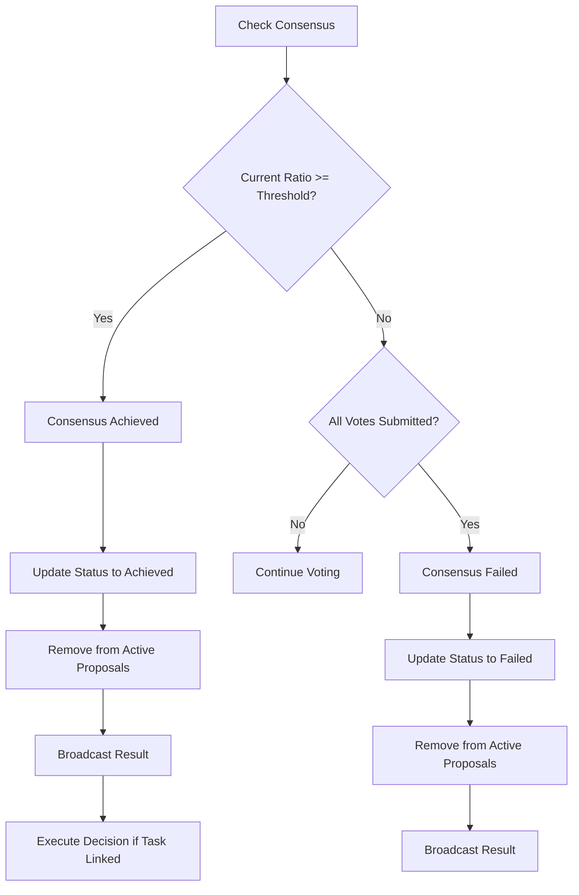
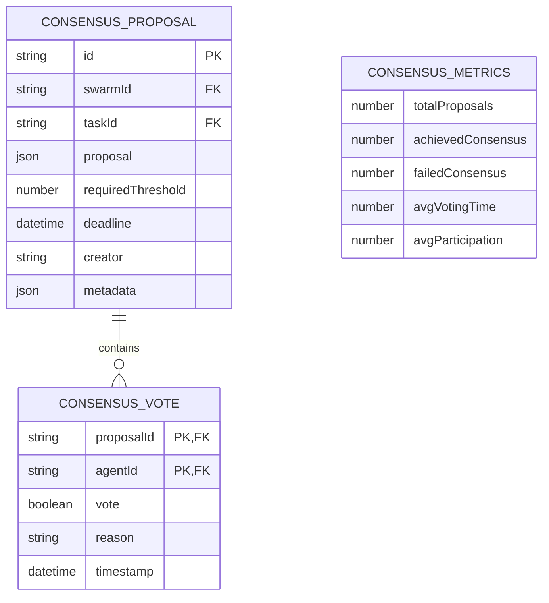
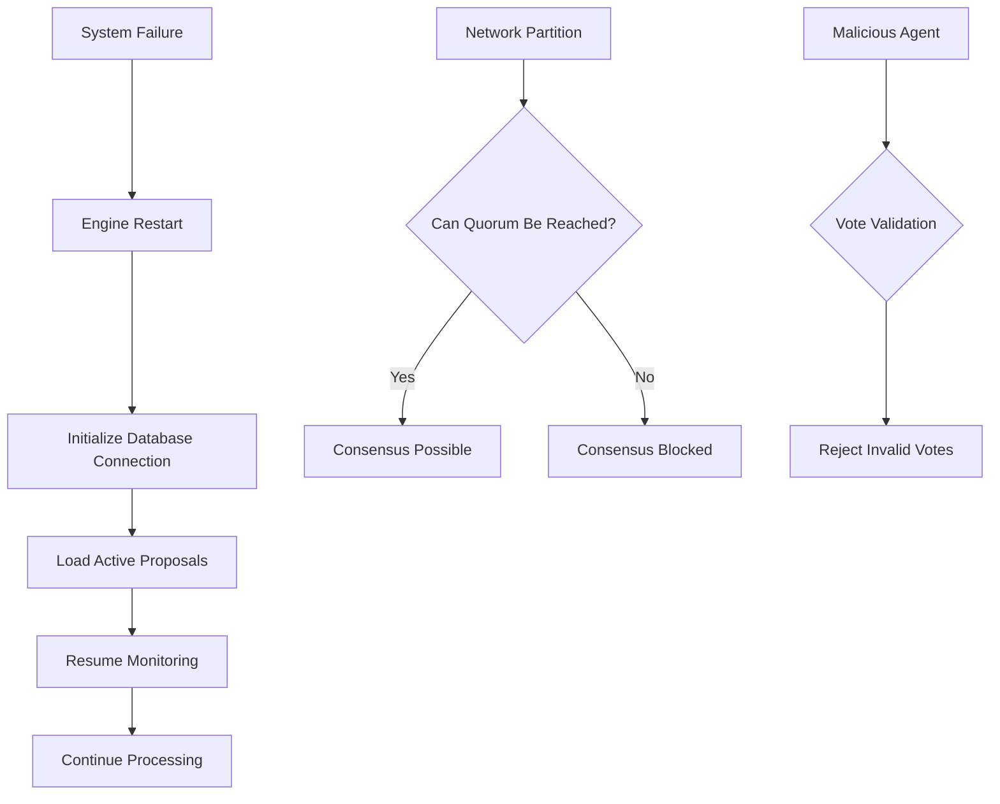
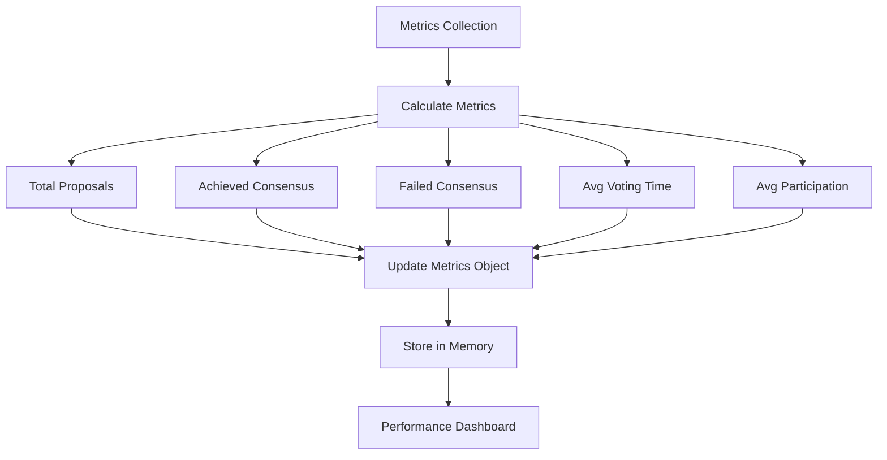

# Consensus Mechanisms

<cite>
**Referenced Files in This Document**   
- [ConsensusEngine.ts](file://src/hive-mind/integration/ConsensusEngine.ts)
- [types.ts](file://src/hive-mind/types.ts)
- [DatabaseManager.ts](file://src/hive-mind/core/DatabaseManager.ts)
</cite>

## Table of Contents
1. [Introduction](#introduction)
2. [Core Components](#core-components)
3. [Architecture Overview](#architecture-overview)
4. [Detailed Component Analysis](#detailed-component-analysis)
5. [Voting Protocols and Strategies](#voting-protocols-and-strategies)
6. [Proposal Lifecycle Management](#proposal-lifecycle-management)
7. [Agreement Verification and Execution](#agreement-verification-and-execution)
8. [Domain Model and Data Structures](#domain-model-and-data-structures)
9. [Failure Recovery and System Integrity](#failure-recovery-and-system-integrity)
10. [Performance and Metrics](#performance-and-metrics)

## Introduction
The Consensus Engine is a critical component of the Hive Mind swarm intelligence system, responsible for managing collective decision-making processes among distributed agents. This document provides a comprehensive analysis of the consensus implementation, detailing how the system achieves agreement on critical operations such as configuration changes, task prioritization, and conflict resolution. The engine implements multiple voting strategies with configurable thresholds to accommodate different decision types, from simple majority to unanimous agreement. The system is designed to maintain integrity even in challenging network conditions and provides robust mechanisms for handling failures and ensuring system consistency.

## Core Components
The Consensus Engine is implemented as a TypeScript class that extends EventEmitter, enabling an event-driven architecture for handling consensus-related events. The engine manages the complete lifecycle of consensus proposals, from creation through voting to final resolution. Key components include voting strategy management, proposal monitoring, deadline enforcement, and metrics collection. The engine integrates with the DatabaseManager for persistent storage of proposals and votes, and with the MCPToolWrapper for neural pattern analysis that informs voting recommendations. The system maintains active proposals in memory for performance while ensuring durability through database persistence.

**Section sources**
- [ConsensusEngine.ts](file://src/hive-mind/integration/ConsensusEngine.ts#L1-L50)

## Architecture Overview

**Diagram sources**
- [ConsensusEngine.ts](file://src/hive-mind/integration/ConsensusEngine.ts#L1-L570)

## Detailed Component Analysis

### Consensus Engine Implementation
The ConsensusEngine class serves as the central coordinator for all consensus activities within the swarm. It maintains several key state variables including the active proposals map, voting strategies collection, and consensus metrics. The engine is initialized asynchronously, establishing connections to the database and MCP tools before becoming active. Once initialized, it starts three background monitoring processes: proposal monitoring (checking every 5 seconds), timeout checking (every second), and metrics collection (every minute). These processes ensure timely processing of proposals and maintenance of system health metrics.

**Diagram sources**
- [ConsensusEngine.ts](file://src/hive-mind/integration/ConsensusEngine.ts#L1-L570)
- [DatabaseManager.ts](file://src/hive-mind/core/DatabaseManager.ts#L666-L865)

**Section sources**
- [ConsensusEngine.ts](file://src/hive-mind/integration/ConsensusEngine.ts#L1-L570)

## Voting Protocols and Strategies
The Consensus Engine implements four distinct voting strategies to accommodate different decision requirements. Each strategy is defined by a threshold value and a recommendation function that determines how agents should vote based on neural pattern analysis. The simple majority strategy requires more than 50% positive votes, while the supermajority strategy requires 66% or more. The unanimous strategy demands 100% agreement, and the qualified majority strategy uses weighted voting based on agent expertise. The engine automatically selects the appropriate strategy based on the proposal's required threshold, enabling flexible governance for different types of decisions.

**Diagram sources**
- [ConsensusEngine.ts](file://src/hive-mind/integration/ConsensusEngine.ts#L200-L256)

### Voting Strategy Implementation
The voting strategies are implemented as objects stored in a Map, with each strategy containing a name, description, threshold, and recommend function. The recommend function takes a proposal and neural pattern analysis as input and returns a voting recommendation with confidence level and reasoning. For example, the qualified majority strategy evaluates agent expertise alignment and votes positively only if the alignment exceeds 0.6. The supermajority strategy requires strong recommendations from the neural analysis, reflecting the higher stakes of critical decisions. These strategy implementations allow for sophisticated decision-making that goes beyond simple majority voting.

**Section sources**
- [ConsensusEngine.ts](file://src/hive-mind/integration/ConsensusEngine.ts#L200-L256)

## Proposal Lifecycle Management
The lifecycle of a consensus proposal begins with creation and ends with either achievement or failure of consensus. When a proposal is created, it is stored in the database, added to the active proposals collection, and broadcast to all eligible voters. The engine then monitors the proposal for votes and checks whether consensus has been achieved. Proposals can have optional deadlines, after which voting is automatically closed. The engine continuously monitors active proposals through a background process that runs every 5 seconds, ensuring timely processing even if individual votes don't trigger immediate checks.

**Diagram sources**
- [ConsensusEngine.ts](file://src/hive-mind/integration/ConsensusEngine.ts#L47-L97)
- [DatabaseManager.ts](file://src/hive-mind/core/DatabaseManager.ts#L670-L714)

### Proposal Creation and Broadcasting
When a new proposal is created, the engine first persists it to the database using the createConsensusProposal method. It then adds the proposal to the in-memory activeProposals map for quick access during the voting process. The engine updates its metrics to reflect the new proposal and initiates the voting process by broadcasting the proposal to all agents in the swarm. This broadcast is implemented as a communication record with a null to_agent_id, indicating a broadcast message. If the proposal has a deadline, the engine sets up a timeout to automatically close voting when the deadline is reached.

**Section sources**
- [ConsensusEngine.ts](file://src/hive-mind/integration/ConsensusEngine.ts#L47-L97)

## Agreement Verification and Execution
The consensus verification process evaluates whether a proposal has achieved sufficient support based on its required threshold. The engine calculates the current ratio of positive votes to total votes and compares it to the proposal's threshold. If the threshold is met, consensus is achieved; otherwise, it fails. For proposals linked to tasks, successful consensus triggers automatic execution of the decision, such as approving, modifying, or canceling a task. Failed consensus results in notification to all agents but no further action. The engine emits events at key points in this process, enabling other system components to react to consensus outcomes.

**Diagram sources**
- [ConsensusEngine.ts](file://src/hive-mind/integration/ConsensusEngine.ts#L256-L370)

### Decision Execution Process
When consensus is achieved for a proposal linked to a task, the engine automatically executes the decision based on the proposal's action type. The executeConsensusDecision method handles three primary actions: approve_task, modify_task, and cancel_task. For approval, the task status is updated to "approved"; for cancellation, to "cancelled"; and for modification, the task is updated with the specified changes. This automated execution ensures that collective decisions are promptly implemented, reducing latency between decision and action. The engine emits a consensusExecuted event after successful execution, allowing other components to respond to the completed action.

**Section sources**
- [ConsensusEngine.ts](file://src/hive-mind/integration/ConsensusEngine.ts#L424-L470)

## Domain Model and Data Structures
The consensus system is built around several key data structures that define the domain model. The ConsensusProposal interface represents a decision to be voted on, containing the proposal details, required threshold, and optional deadline. The ConsensusVote interface captures individual agent votes with the agent ID, vote value, and optional reasoning. The ConsensusResult interface summarizes the outcome of a voting process, including participation metrics and final ratios. The VotingStrategy interface defines how recommendations are generated, and the ConsensusMetrics interface tracks system-wide performance indicators.

**Diagram sources**
- [types.ts](file://src/hive-mind/types.ts#L242-L441)
- [DatabaseManager.ts](file://src/hive-mind/core/DatabaseManager.ts#L670-L714)

### Data Structure Definitions
The ConsensusProposal interface includes essential fields such as id, swarmId, and requiredThreshold, with optional fields for taskId, deadline, and creator. The proposal field is of type any, allowing flexibility in the content being voted on, from configuration changes to task modifications. The ConsensusVote interface ensures each vote is uniquely identified by proposalId and agentId, preventing duplicate voting. The ConsensusResult interface provides comprehensive outcome data, including both absolute counts and ratios for analysis. These well-defined interfaces enable type safety while maintaining the flexibility needed for diverse consensus scenarios.

**Section sources**
- [types.ts](file://src/hive-mind/types.ts#L242-L441)

## Failure Recovery and System Integrity
The consensus system includes multiple mechanisms to ensure system integrity and handle failures. The engine continuously monitors active proposals and enforces deadlines to prevent indefinite voting periods. If network partitions or agent failures occur, the system can still reach consensus as long as the quorum requirement is met by available agents. The database stores all proposals and votes, providing durability and enabling recovery after system restarts. The engine also handles split-brain scenarios by requiring a supermajority (66%) for critical decisions, making it unlikely that two partitions could independently achieve consensus on conflicting proposals.

**Diagram sources**
- [ConsensusEngine.ts](file://src/hive-mind/integration/ConsensusEngine.ts#L370-L569)

### Handling Edge Cases
The system includes specific handling for various edge cases that could compromise consensus integrity. Vote validation ensures that only valid votes from eligible agents are accepted and that agents cannot vote multiple times. Deadline enforcement prevents proposals from remaining open indefinitely, which could block progress. The engine also handles cases where all votes are in but consensus is not achieved, treating this as a failed consensus rather than leaving the proposal in a pending state. These edge case handlers ensure the system remains in a consistent state regardless of external conditions.

**Section sources**
- [ConsensusEngine.ts](file://src/hive-mind/integration/ConsensusEngine.ts#L256-L370)

## Performance and Metrics
The Consensus Engine collects comprehensive metrics to monitor system performance and effectiveness. Key metrics include total proposals, achieved consensus, failed consensus, average voting time, and average participation rate. These metrics are updated in real-time as proposals are processed and are stored in memory with a 30-day TTL. The engine collects metrics every minute, calculating the average voting time from recent proposals. This data provides valuable insights into the swarm's decision-making efficiency and can be used to optimize consensus parameters and identify potential bottlenecks in the decision process.

**Diagram sources**
- [ConsensusEngine.ts](file://src/hive-mind/integration/ConsensusEngine.ts#L470-L569)

### Metrics Implementation
The metrics collection process runs on a one-minute interval, querying the database for recent proposals to calculate the average voting time. The engine maintains running averages for participation rate, updating them with each completed proposal to avoid storing historical data for all proposals. The metrics are stored in the MCP memory system under the key "consensus-metrics" in the "performance-metrics" namespace, making them accessible to other system components for monitoring and optimization. This lightweight metrics system provides essential performance insights without imposing significant overhead on the consensus process.

**Section sources**
- [ConsensusEngine.ts](file://src/hive-mind/integration/ConsensusEngine.ts#L470-L569)