# Hive-Mind Architecture

<cite>
**Referenced Files in This Document**   
- [HiveMind.ts](file://src/hive-mind/core/HiveMind.ts)
- [Queen.ts](file://src/hive-mind/core/Queen.ts)
- [Agent.ts](file://src/agents/Agent.ts)
- [DatabaseManager.ts](file://src/db/DatabaseManager.ts)
- [MCPToolWrapper.ts](file://src/mcp/MCPToolWrapper.ts)
- [SwarmOrchestrator.ts](file://src/swarm/core/SwarmOrchestrator.ts)
- [ConsensusEngine.ts](file://src/swarm/core/ConsensusEngine.ts)
</cite>

## Table of Contents
1. [Introduction](#introduction)
2. [Project Structure](#project-structure)
3. [Core Components](#core-components)
4. [Architecture Overview](#architecture-overview)
5. [Detailed Component Analysis](#detailed-component-analysis)
6. [Component Interactions and Data Flows](#component-interactions-and-data-flows)
7. [Design Patterns and Architectural Principles](#design-patterns-and-architectural-principles)
8. [Infrastructure and Deployment](#infrastructure-and-deployment)
9. [Cross-Cutting Concerns](#cross-cutting-concerns)
10. [Technology Stack](#technology-stack)
11. [Conclusion](#conclusion)

## Introduction

The Hive-Mind Architecture represents a sophisticated queen-led swarm intelligence system designed to coordinate multiple autonomous agents in solving complex tasks through collaborative intelligence. This architecture implements a distributed problem-solving approach where a central Queen orchestrates a swarm of specialized agents, enabling adaptive, scalable, and resilient task execution. The system combines event-driven architecture with advanced coordination patterns, creating a robust framework for distributed AI agent collaboration. This document provides a comprehensive analysis of the architectural design, component interactions, and technical implementation of the Hive-Mind system.

## Project Structure

The Hive-Mind system is organized within a well-structured repository that follows a modular, feature-based organization. The core components are located in the `src/hive-mind` directory, with supporting systems distributed across other modules. The architecture separates concerns into distinct layers including core swarm logic, agent management, communication systems, and data persistence.

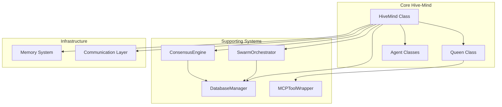

**Diagram sources**
- [HiveMind.ts](file://src/hive-mind/core/HiveMind.ts)
- [Queen.ts](file://src/hive-mind/core/Queen.ts)

## Core Components

The Hive-Mind Architecture consists of several core components that work together to create a cohesive swarm intelligence system. The primary components include the HiveMind class as the central orchestrator, the Queen class as the strategic decision-maker, Agent classes as the execution units, DatabaseManager for persistence, MCPToolWrapper for neural capabilities, SwarmOrchestrator for task management, and ConsensusEngine for agreement protocols. These components follow a layered architecture with clear separation of concerns, enabling independent development and testing of each subsystem while maintaining tight integration for coordinated operation.

**Section sources**
- [HiveMind.ts](file://src/hive-mind/core/HiveMind.ts)
- [Queen.ts](file://src/hive-mind/core/Queen.ts)
- [Agent.ts](file://src/agents/Agent.ts)

## Architecture Overview

The Hive-Mind Architecture implements a queen-led swarm intelligence model with a hierarchical yet adaptive structure. At the highest level, the HiveMind class serves as the container and coordinator for the entire swarm, managing lifecycle, configuration, and cross-component integration. The Queen acts as the strategic brain of the swarm, making high-level decisions about task allocation, agent coordination, and strategy selection. Individual agents function as specialized workers with distinct capabilities, executing tasks assigned by the Queen. The architecture follows an event-driven model using the EventEmitter pattern, enabling asynchronous communication and loose coupling between components.

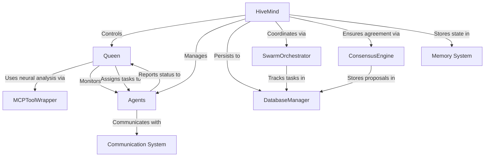

**Diagram sources**
- [HiveMind.ts](file://src/hive-mind/core/HiveMind.ts#L28-L540)
- [Queen.ts](file://src/hive-mind/core/Queen.ts#L28-L773)

## Detailed Component Analysis

### HiveMind Class Analysis

The HiveMind class serves as the central orchestrator of the swarm intelligence system, implementing the container pattern to manage all swarm components. It follows a singleton-like initialization through the load pattern, allowing restoration of existing swarms from persistent storage. The class implements comprehensive lifecycle management with initialize and shutdown methods that coordinate the startup and teardown of all subsystems.

#### Class Diagram for HiveMind
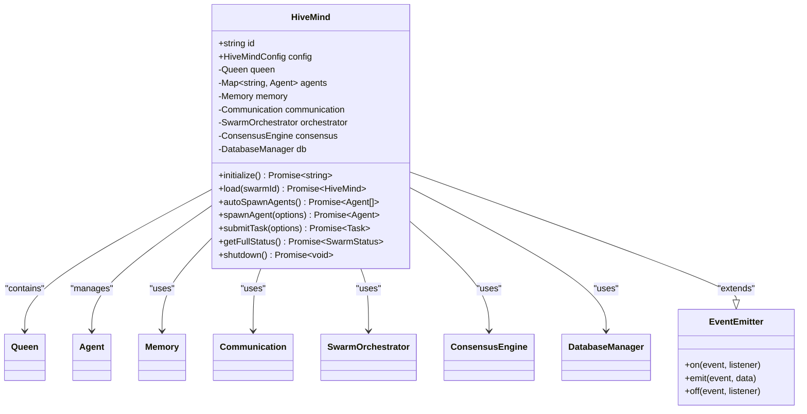

**Diagram sources**
- [HiveMind.ts](file://src/hive-mind/core/HiveMind.ts#L28-L540)

**Section sources**
- [HiveMind.ts](file://src/hive-mind/core/HiveMind.ts#L28-L540)

### Queen Class Analysis

The Queen class represents the strategic decision-making component of the swarm intelligence system, functioning as the central coordinator and planner. It implements advanced decision-making capabilities through integration with the MCPToolWrapper for neural pattern analysis. The Queen maintains awareness of all agents in the swarm and incoming tasks, making strategic decisions about task assignment, agent coordination, and execution strategy.

#### Class Diagram for Queen
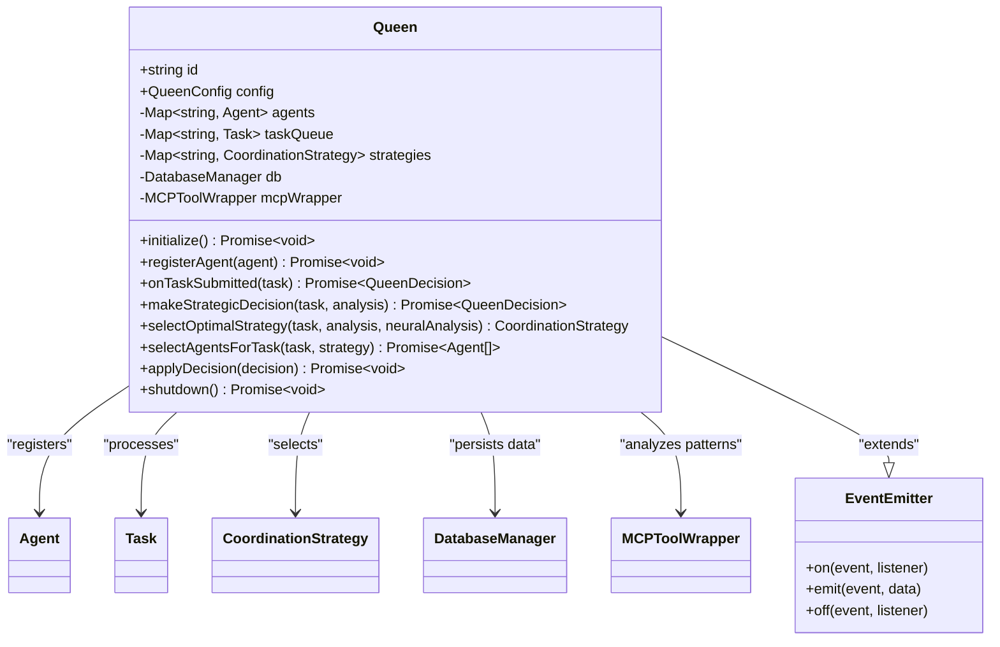

**Diagram sources**
- [Queen.ts](file://src/hive-mind/core/Queen.ts#L28-L773)

**Section sources**
- [Queen.ts](file://src/hive-mind/core/Queen.ts#L28-L773)

### Agent Classes Analysis

The Agent classes represent the execution units within the swarm intelligence system, each specializing in particular types of tasks based on their capabilities. Agents are dynamically spawned and managed by the HiveMind, registered with the Queen, and assigned tasks based on their capabilities and current workload. The agent system supports various types including coordinators, researchers, coders, analysts, architects, testers, reviewers, optimizers, documenters, monitors, and specialists, each with specific capabilities tailored to their role.

#### Agent Capabilities Mapping
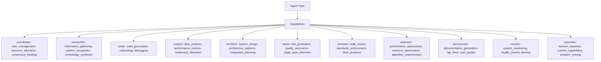

**Section sources**
- [HiveMind.ts](file://src/hive-mind/core/HiveMind.ts#L470-L508)

## Component Interactions and Data Flows

The Hive-Mind Architecture features complex interactions between components that enable the swarm intelligence capabilities. The system follows an event-driven architecture where components communicate through emitted events and direct method calls, creating a responsive and loosely coupled system.

### Task Submission and Execution Flow

The primary workflow in the Hive-Mind system involves task submission, strategic decision-making, agent assignment, and execution monitoring. This sequence demonstrates the coordinated interaction between the core components.

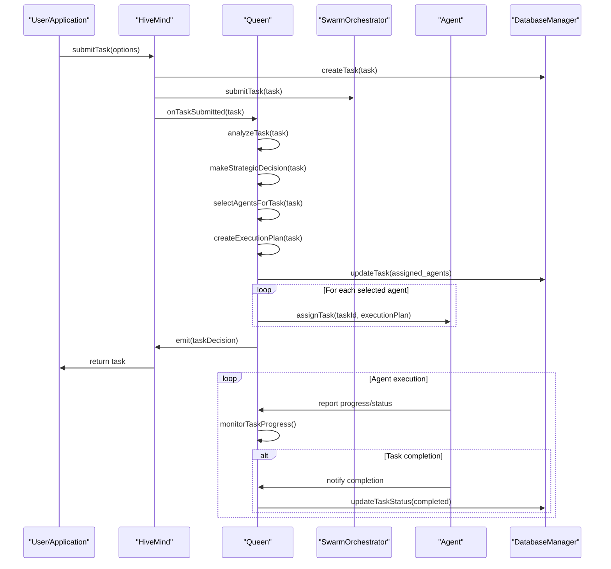

**Diagram sources**
- [HiveMind.ts](file://src/hive-mind/core/HiveMind.ts#L340-L375)
- [Queen.ts](file://src/hive-mind/core/Queen.ts#L100-L200)

### Agent Lifecycle Management

The system manages the complete lifecycle of agents from spawning to shutdown, ensuring proper registration, task assignment, and cleanup.

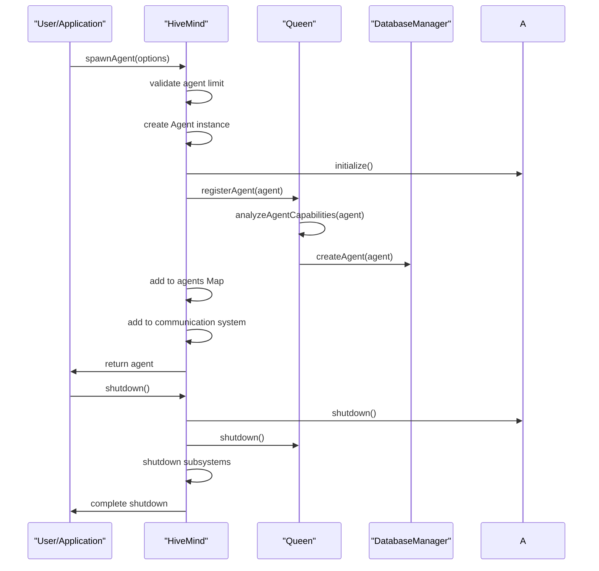

**Diagram sources**
- [HiveMind.ts](file://src/hive-mind/core/HiveMind.ts#L280-L335)
- [Queen.ts](file://src/hive-mind/core/Queen.ts#L80-L95)

## Design Patterns and Architectural Principles

The Hive-Mind Architecture incorporates several well-known design patterns and architectural principles to achieve its goals of scalability, maintainability, and robustness.

### Event-Driven Architecture with EventEmitter Pattern

The system extensively uses the EventEmitter pattern to enable loose coupling between components. The HiveMind and Queen classes both extend EventEmitter, allowing other components to listen for important events such as initialization, task submission, agent spawning, and errors.

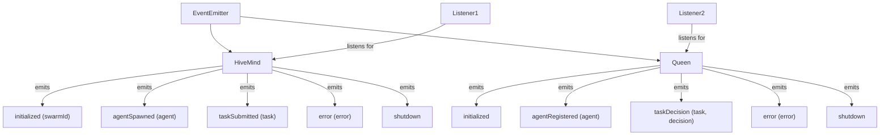

**Section sources**
- [HiveMind.ts](file://src/hive-mind/core/HiveMind.ts#L28)
- [Queen.ts](file://src/hive-mind/core/Queen.ts#L28)

### Plugin System for MCP Tools

The architecture implements a plugin system through the MCPToolWrapper, allowing integration of various neural and analytical capabilities. This design enables extensibility without modifying core swarm logic.

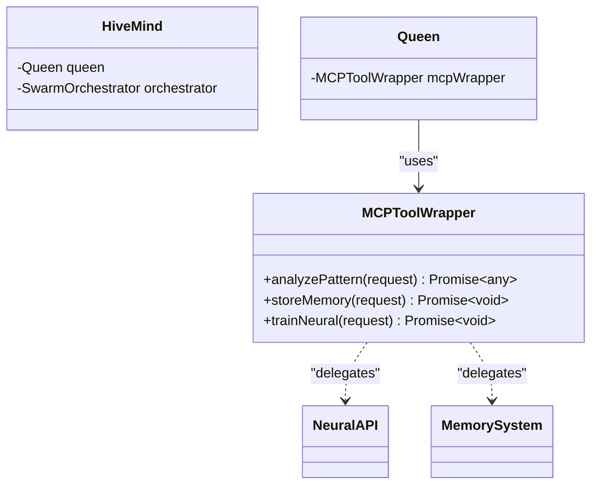

**Section sources**
- [Queen.ts](file://src/hive-mind/core/Queen.ts#L42)
- [Queen.ts](file://src/hive-mind/core/Queen.ts#L140-L145)

### Layered Architecture with Separation of Concerns

The system follows a layered architecture with clear separation of concerns, dividing responsibilities into distinct components that handle specific aspects of swarm intelligence.

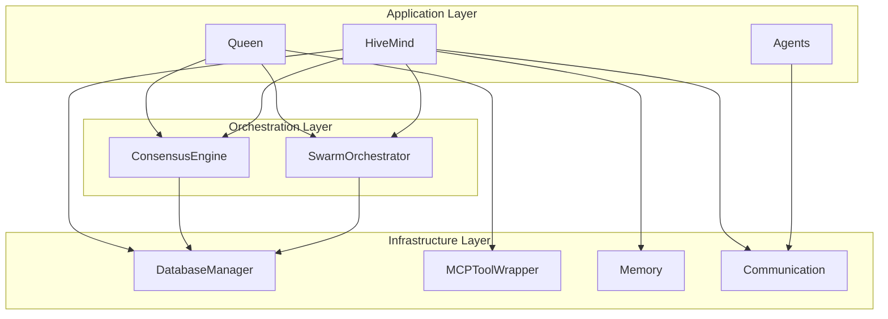

**Section sources**
- [HiveMind.ts](file://src/hive-mind/core/HiveMind.ts#L30-L38)

### Singleton Pattern for Database Manager

The DatabaseManager implements a singleton pattern through the getInstance method, ensuring a single shared instance across the application for efficient database connection management.

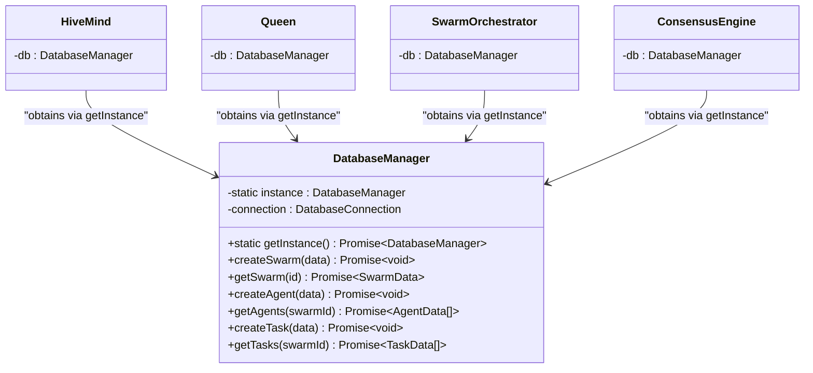

**Diagram sources**
- [HiveMind.ts](file://src/hive-mind/core/HiveMind.ts#L60)
- [DatabaseManager.ts](file://src/db/DatabaseManager.ts)

### Factory Pattern for Agent Creation

The HiveMind class implements a factory pattern for agent creation through the spawnAgent method, encapsulating the instantiation and initialization logic for agents.

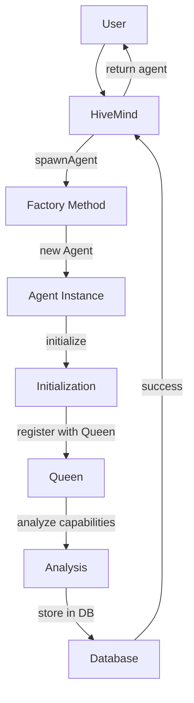

**Section sources**
- [HiveMind.ts](file://src/hive-mind/core/HiveMind.ts#L280-L335)

## Infrastructure and Deployment

The Hive-Mind Architecture is designed with scalability and deployment considerations in mind, supporting various swarm topologies and operational modes.

### Supported Swarm Topologies

The system supports multiple swarm topologies that determine how agents are organized and coordinate with each other:

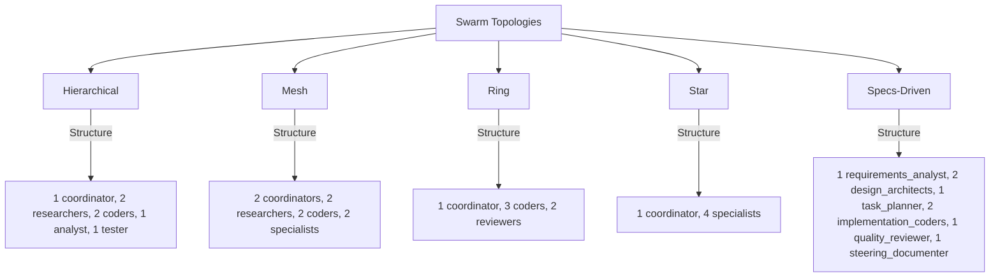

**Section sources**
- [HiveMind.ts](file://src/hive-mind/core/HiveMind.ts#L150-L195)

### Deployment Topology

The architecture supports both centralized and distributed deployment models, allowing adaptation to different infrastructure requirements.

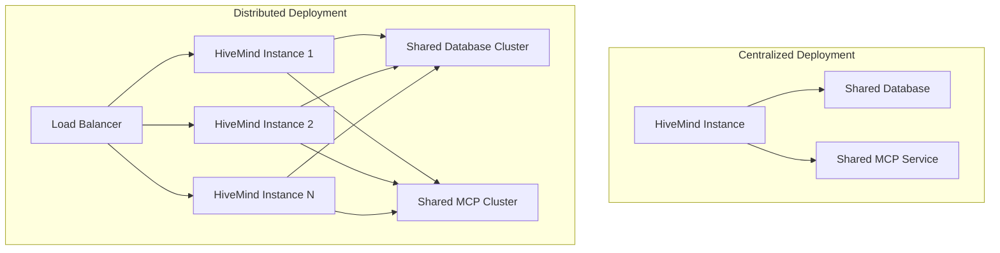

## Cross-Cutting Concerns

The Hive-Mind Architecture addresses several cross-cutting concerns essential for a production-ready swarm intelligence system.

### Security Considerations

The system implements security through authentication, authorization, and secure communication patterns, though specific implementation details would be in dedicated security modules.

### Monitoring and Observability

The architecture includes comprehensive monitoring capabilities through the getFullStatus method, which collects metrics from all components:

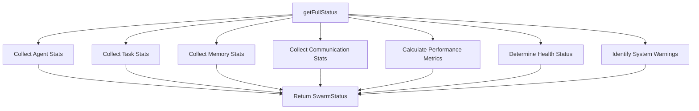

**Section sources**
- [HiveMind.ts](file://src/hive-mind/core/HiveMind.ts#L400-L535)

### Disaster Recovery

The system supports disaster recovery through persistent storage of swarm state, enabling restoration of swarms after failures:

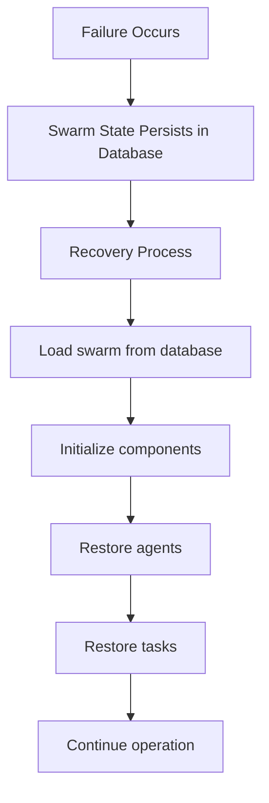

**Section sources**
- [HiveMind.ts](file://src/hive-mind/core/HiveMind.ts#L220-L275)

## Technology Stack

The Hive-Mind Architecture is built on a modern technology stack designed for scalability and maintainability:

- **Primary Language**: TypeScript
- **Runtime**: Node.js
- **Package Manager**: npm/pnpm
- **Testing Framework**: Jest/Vitest
- **Database**: Likely SQL-based (inferred from DatabaseManager)
- **Communication**: EventEmitter pattern for intra-process, database for inter-process
- **Neural Integration**: MCP (Modular Cognitive Platform) tools
- **Containerization**: Docker (inferred from docker directory)
- **CI/CD**: GitHub Actions (inferred from .github/workflows)

The system leverages TypeScript's strong typing for enhanced code quality and maintainability, with asynchronous programming patterns throughout for non-blocking operations.

## Conclusion

The Hive-Mind Architecture presents a sophisticated implementation of queen-led swarm intelligence, combining multiple design patterns and architectural principles to create a robust, scalable system for coordinating AI agents. The architecture effectively balances centralized control through the Queen with distributed execution through specialized agents, enabling efficient task completion through strategic coordination. Key strengths include the event-driven design, clear separation of concerns, and support for multiple swarm topologies. The system demonstrates thoughtful consideration of production requirements with features for monitoring, persistence, and disaster recovery. Future enhancements could include more sophisticated load balancing, enhanced security features, and improved fault tolerance mechanisms. Overall, the architecture provides a solid foundation for building complex, collaborative AI systems capable of tackling challenging problems through swarm intelligence.