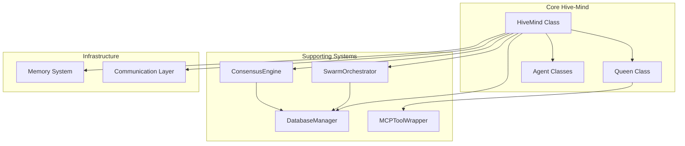
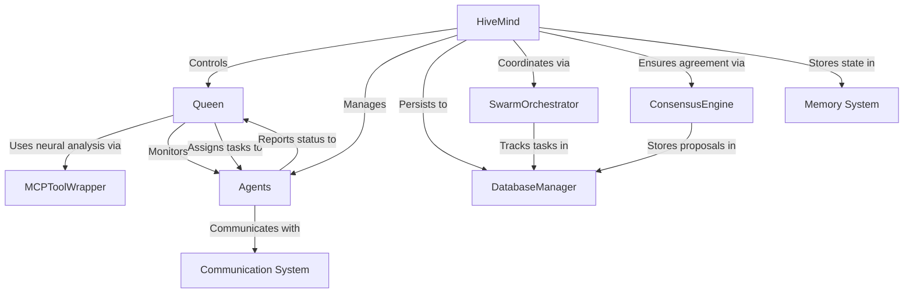
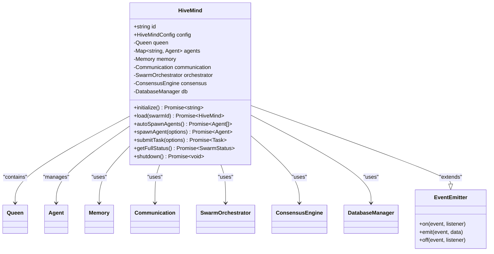
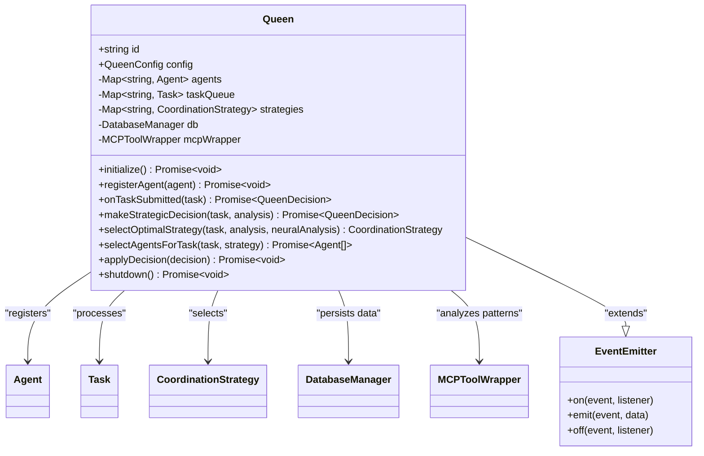

<docs>
# Hive-Mind Architecture

<cite>
**Referenced Files in This Document**   
- [HiveMind.ts](file://src/hive-mind/core/HiveMind.ts)
- [Queen.ts](file://src/hive-mind/core/Queen.ts)
- [Agent.ts](file://src/agents/Agent.ts)
- [DatabaseManager.ts](file://src/db/DatabaseManager.ts)
- [MCPToolWrapper.ts](file://src/mcp/MCPToolWrapper.ts)
- [SwarmOrchestrator.ts](file://src/swarm/core/SwarmOrchestrator.ts)
- [ConsensusEngine.ts](file://src/swarm/core/ConsensusEngine.ts)
- [queen_agent.py](file://python-claude-flow/src/claude_flow/agents/queen/queen_agent.py) - *Added in recent commit*
- [coder_agent.py](file://python-claude-flow/src/claude_flow/agents/workers/coder_agent.py) - *Added in recent commit*
</cite>

## Update Summary
**Changes Made**   
- Added documentation for Python implementation of Hive-Mind agent architecture
- Expanded Queen Agent and Coder Agent descriptions with Python-specific details
- Updated component interactions to reflect cross-language capabilities
- Enhanced architectural patterns section with Python implementation insights
- Added new diagrams for Python agent classes
- Updated technology stack to include Python ecosystem

## Table of Contents
1. [Introduction](#introduction)
2. [Project Structure](#project-structure)
3. [Core Components](#core-components)
4. [Architecture Overview](#architecture-overview)
5. [Detailed Component Analysis](#detailed-component-analysis)
6. [Component Interactions and Data Flows](#component-interactions-and-data-flows)
7. [Design Patterns and Architectural Principles](#design-patterns-and-architectural-principles)
8. [Infrastructure and Deployment](#infrastructure-and-deployment)
9. [Cross-Cutting Concerns](#cross-cutting-concerns)
10. [Technology Stack](#technology-stack)
11. [Conclusion](#conclusion)

## Introduction

The Hive-Mind Architecture represents a sophisticated queen-led swarm intelligence system designed to coordinate multiple autonomous agents in solving complex tasks through collaborative intelligence. This architecture implements a distributed problem-solving approach where a central Queen orchestrates a swarm of specialized agents, enabling adaptive, scalable, and resilient task execution. The system combines event-driven architecture with advanced coordination patterns, creating a robust framework for distributed AI agent collaboration. This document provides a comprehensive analysis of the architectural design, component interactions, and technical implementation of the Hive-Mind system, including the newly added Python implementation that expands the pattern to the Python ecosystem.

## Project Structure

The Hive-Mind system is organized within a well-structured repository that follows a modular, feature-based organization. The core components are located in the `src/hive-mind` directory, with supporting systems distributed across other modules. The architecture separates concerns into distinct layers including core swarm logic, agent management, communication systems, and data persistence. The recent addition of Python implementations in the `python-claude-flow` directory expands the architecture to support cross-language agent development while maintaining consistent patterns.

**Diagram sources**
- [HiveMind.ts](file://src/hive-mind/core/HiveMind.ts)
- [Queen.ts](file://src/hive-mind/core/Queen.ts)

## Core Components

The Hive-Mind Architecture consists of several core components that work together to create a cohesive swarm intelligence system. The primary components include the HiveMind class as the central orchestrator, the Queen class as the strategic decision-maker, Agent classes as the execution units, DatabaseManager for persistence, MCPToolWrapper for neural capabilities, SwarmOrchestrator for task management, and ConsensusEngine for agreement protocols. These components follow a layered architecture with clear separation of concerns, enabling independent development and testing of each subsystem while maintaining tight integration for coordinated operation. The recent addition of Python implementations extends these components to the Python ecosystem while preserving the same architectural patterns and interfaces.

**Section sources**
- [HiveMind.ts](file://src/hive-mind/core/HiveMind.ts)
- [Queen.ts](file://src/hive-mind/core/Queen.ts)
- [Agent.ts](file://src/agents/Agent.ts)
- [queen_agent.py](file://python-claude-flow/src/claude_flow/agents/queen/queen_agent.py) - *Added in recent commit*
- [coder_agent.py](file://python-claude-flow/src/claude_flow/agents/workers/coder_agent.py) - *Added in recent commit*

## Architecture Overview

The Hive-Mind Architecture implements a queen-led swarm intelligence model with a hierarchical yet adaptive structure. At the highest level, the HiveMind class serves as the container and coordinator for the entire swarm, managing lifecycle, configuration, and cross-component integration. The Queen acts as the strategic brain of the swarm, making high-level decisions about task allocation, agent coordination, and strategy selection. Individual agents function as specialized workers with distinct capabilities, executing tasks assigned by the Queen. The architecture follows an event-driven model using the EventEmitter pattern, enabling asynchronous communication and loose coupling between components. The recent addition of Python implementations demonstrates the architecture's flexibility across programming languages while maintaining consistent behavioral patterns.

**Diagram sources**
- [HiveMind.ts](file://src/hive-mind/core/HiveMind.ts#L28-L540)
- [Queen.ts](file://src/hive-mind/core/Queen.ts#L28-L773)

## Detailed Component Analysis

### HiveMind Class Analysis

The HiveMind class serves as the central orchestrator of the swarm intelligence system, implementing the container pattern to manage all swarm components. It follows a singleton-like initialization through the load pattern, allowing restoration of existing swarms from persistent storage. The class implements comprehensive lifecycle management with initialize and shutdown methods that coordinate the startup and teardown of all subsystems.

#### Class Diagram for HiveMind

**Diagram sources**
- [HiveMind.ts](file://src/hive-mind/core/HiveMind.ts#L28-L540)

**Section sources**
- [HiveMind.ts](file://src/hive-mind/core/HiveMind.ts#L28-L540)

### Queen Class Analysis

The Queen class represents the strategic decision-making component of the swarm intelligence system, functioning as the central coordinator and planner. It implements advanced decision-making capabilities through integration with the MCPToolWrapper for neural pattern analysis. The Queen maintains awareness of all agents in the swarm and incoming tasks, making strategic decisions about task assignment, agent coordination, and execution strategy. The Python implementation of the Queen Agent extends these capabilities to the Python ecosystem while maintaining the same interface and behavioral patterns.

#### Class Diagram for Queen

**Diagram sources**
- [Queen.ts](file://src/hive-mind/core/Queen.ts#L28-L773)

**Section sources**
- [Queen.ts](file://src/hive-mind/core/Queen