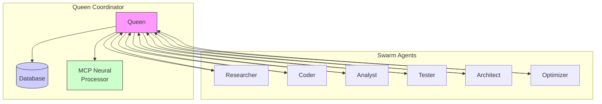
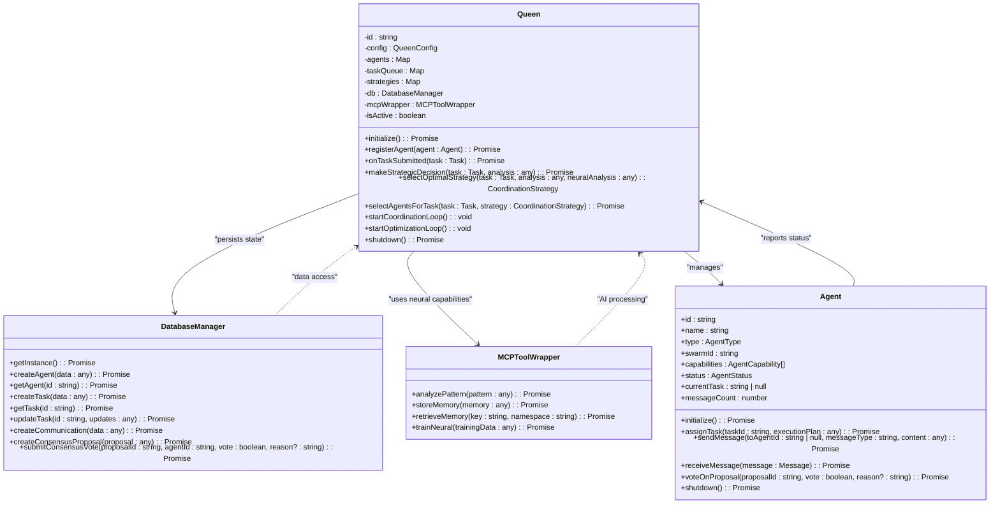
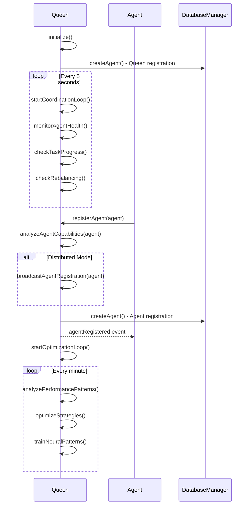
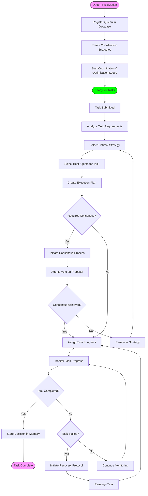
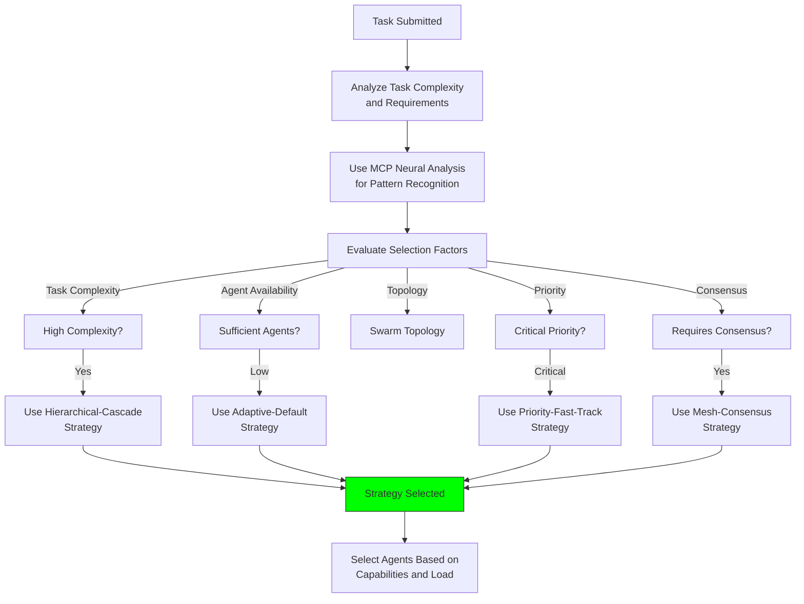
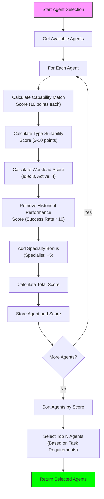
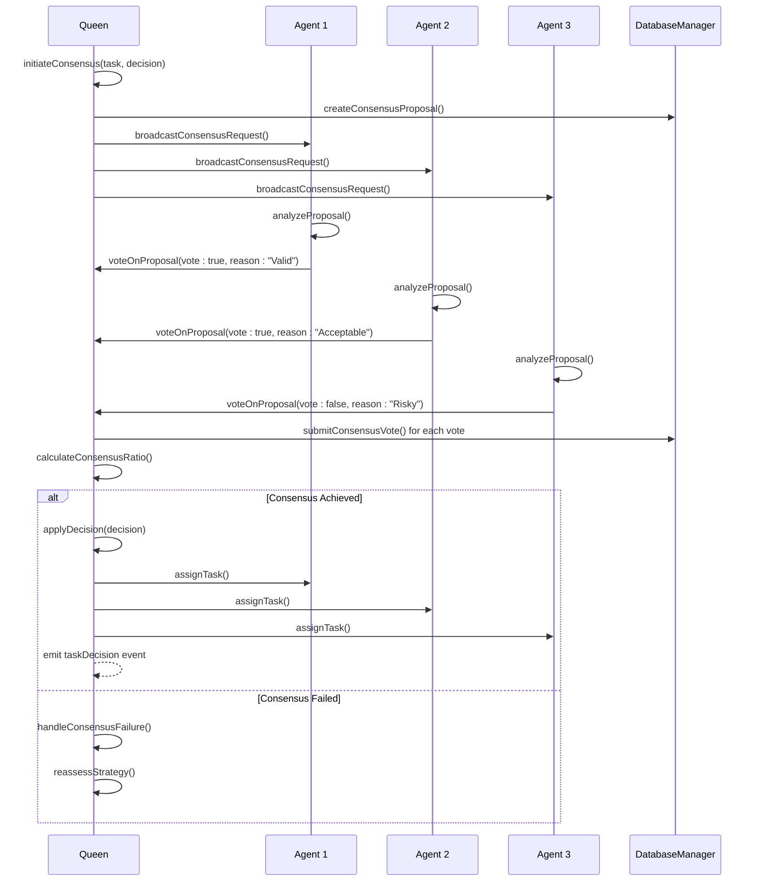
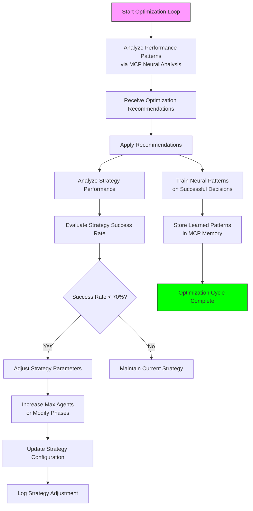
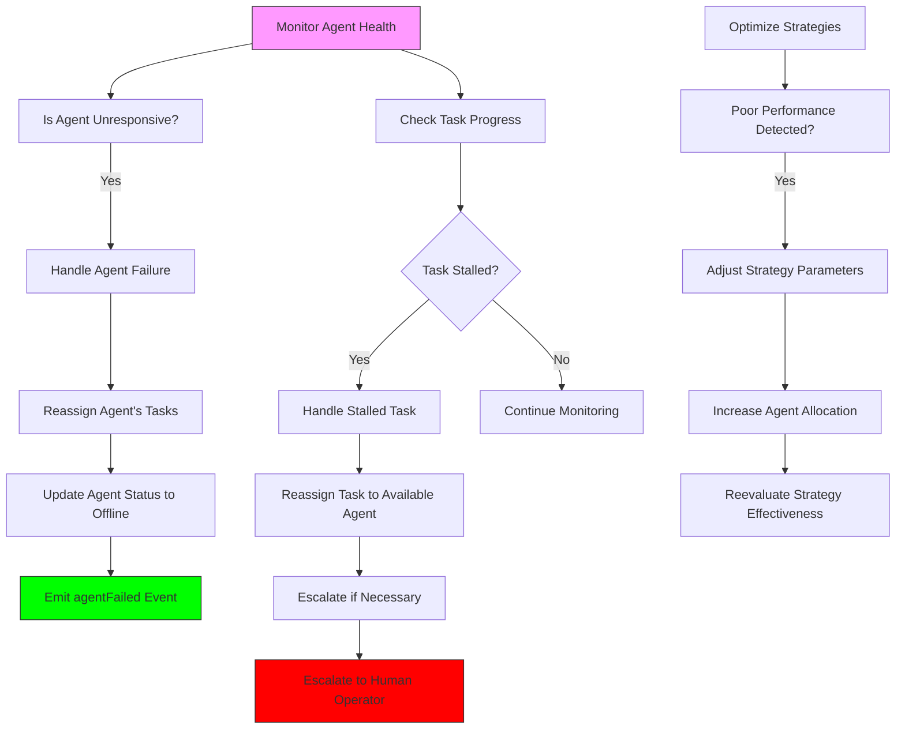

# Queen Coordination

<cite>
**Referenced Files in This Document**   
- [Queen.ts](file://src/hive-mind/core/Queen.ts)
- [Agent.ts](file://src/hive-mind/core/Agent.ts)
- [DatabaseManager.ts](file://src/hive-mind/core/DatabaseManager.ts)
- [types.ts](file://src/hive-mind/types.ts)
- [MCPToolWrapper.js](file://src/hive-mind/integration/MCPToolWrapper.js)
</cite>

## Table of Contents
1. [Introduction](#introduction)
2. [Core Components](#core-components)
3. [Architecture Overview](#architecture-overview)
4. [Detailed Component Analysis](#detailed-component-analysis)
5. [Coordination Workflow](#coordination-workflow)
6. [Task Management and Delegation](#task-management-and-delegation)
7. [Consensus and Decision Making](#consensus-and-decision-making)
8. [Performance Optimization](#performance-optimization)
9. [Error Handling and Fault Tolerance](#error-handling-and-fault-tolerance)
10. [Integration Points](#integration-points)

## Introduction
The Queen Coordination system represents the central intelligence and strategic decision-making component within the Hive Mind swarm architecture. As the primary coordinator, the Queen class orchestrates agent activities, manages task delegation, and ensures optimal swarm performance through sophisticated coordination strategies. This documentation provides a comprehensive analysis of the Queen's implementation, detailing its role in swarm intelligence, interaction patterns with other components, and the underlying mechanisms that enable effective distributed coordination. The Queen operates as a singleton coordinator that leverages neural pattern analysis, strategic planning, and real-time optimization to manage complex workflows across diverse agent types.

## Core Components

The Queen Coordination system comprises several interconnected components that work together to enable intelligent swarm management. At its core, the Queen class serves as the central coordinator, interfacing with agents, the database, and neural processing systems to maintain swarm state and make strategic decisions. The system relies on well-defined interfaces and data structures to facilitate communication and coordination across the swarm.

**Section sources**
- [Queen.ts](file://src/hive-mind/core/Queen.ts#L0-L775)
- [types.ts](file://src/hive-mind/types.ts#L0-L442)

## Architecture Overview

The Queen Coordination architecture follows a centralized control pattern with distributed execution capabilities. The Queen acts as the central decision-making authority while delegating task execution to specialized worker agents. This hierarchical structure enables efficient resource utilization and strategic oversight of swarm activities.



**Diagram sources**
- [Queen.ts](file://src/hive-mind/core/Queen.ts#L0-L775)
- [Agent.ts](file://src/hive-mind/core/Agent.ts#L0-L675)

## Detailed Component Analysis

### Queen Class Implementation

The Queen class serves as the central coordinator in the swarm intelligence system, implementing strategic decision-making, agent management, and task delegation. As an EventEmitter, it facilitates event-driven communication with other system components.



**Diagram sources**
- [Queen.ts](file://src/hive-mind/core/Queen.ts#L0-L775)
- [Agent.ts](file://src/hive-mind/core/Agent.ts#L0-L675)
- [DatabaseManager.ts](file://src/hive-mind/core/DatabaseManager.ts#L0-L866)
- [MCPToolWrapper.js](file://src/hive-mind/integration/MCPToolWrapper.js)

**Section sources**
- [Queen.ts](file://src/hive-mind/core/Queen.ts#L0-L775)

### Agent Management System

The Queen maintains a registry of all active agents within the swarm, tracking their capabilities, status, and availability. This enables intelligent task assignment based on agent specialization and current workload.



**Diagram sources**
- [Queen.ts](file://src/hive-mind/core/Queen.ts#L0-L775)
- [Agent.ts](file://src/hive-mind/core/Agent.ts#L0-L675)
- [DatabaseManager.ts](file://src/hive-mind/core/DatabaseManager.ts#L0-L866)

**Section sources**
- [Queen.ts](file://src/hive-mind/core/Queen.ts#L0-L775)

## Coordination Workflow

The Queen's coordination workflow follows a systematic process for managing swarm activities, from initialization to task completion and performance optimization. This workflow ensures consistent and reliable coordination across diverse swarm configurations.



**Diagram sources**
- [Queen.ts](file://src/hive-mind/core/Queen.ts#L0-L775)
- [Agent.ts](file://src/hive-mind/core/Agent.ts#L0-L675)

**Section sources**
- [Queen.ts](file://src/hive-mind/core/Queen.ts#L0-L775)

## Task Management and Delegation

The Queen's task management system employs a sophisticated algorithm for task analysis, agent selection, and execution planning. This ensures optimal resource utilization and successful task completion across the swarm.

### Task Analysis and Strategy Selection

When a task is submitted, the Queen performs comprehensive analysis to determine the optimal coordination strategy based on multiple factors including task complexity, priority, and required capabilities.



**Diagram sources**
- [Queen.ts](file://src/hive-mind/core/Queen.ts#L0-L775)
- [types.ts](file://src/hive-mind/types.ts#L0-L442)

**Section sources**
- [Queen.ts](file://src/hive-mind/core/Queen.ts#L0-L775)

### Agent Selection Algorithm

The Queen employs a multi-factor scoring system to select the most suitable agents for each task, considering capabilities, type suitability, current workload, and historical performance.



**Diagram sources**
- [Queen.ts](file://src/hive-mind/core/Queen.ts#L0-L775)
- [types.ts](file://src/hive-mind/types.ts#L0-L442)

**Section sources**
- [Queen.ts](file://src/hive-mind/core/Queen.ts#L0-L775)

## Consensus and Decision Making

The Queen implements a robust consensus mechanism for critical decisions, ensuring agreement among swarm members before proceeding with high-impact tasks.



**Diagram sources**
- [Queen.ts](file://src/hive-mind/core/Queen.ts#L0-L775)
- [Agent.ts](file://src/hive-mind/core/Agent.ts#L0-L675)
- [DatabaseManager.ts](file://src/hive-mind/core/DatabaseManager.ts#L0-L866)

**Section sources**
- [Queen.ts](file://src/hive-mind/core/Queen.ts#L0-L775)

## Performance Optimization

The Queen continuously monitors and optimizes swarm performance through regular analysis loops and adaptive strategy adjustment.



**Diagram sources**
- [Queen.ts](file://src/hive-mind/core/Queen.ts#L0-L775)
- [MCPToolWrapper.js](file://src/hive-mind/integration/MCPToolWrapper.js)

**Section sources**
- [Queen.ts](file://src/hive-mind/core/Queen.ts#L0-L775)

## Error Handling and Fault Tolerance

The Queen implements comprehensive error handling and fault tolerance mechanisms to ensure swarm resilience and high availability.



**Diagram sources**
- [Queen.ts](file://src/hive-mind/core/Queen.ts#L0-L775)
- [Agent.ts](file://src/hive-mind/core/Agent.ts#L0-L675)

**Section sources**
- [Queen.ts](file://src/hive-mind/core/Queen.ts#L0-L775)

## Integration Points

The Queen class integrates with several key components to provide comprehensive swarm coordination capabilities.

### Database Integration

The Queen uses DatabaseManager for persistent storage of swarm state, agent information, tasks, and communication records.

```mermaid
classDiagram
class Queen {
+initialize() : Promise<void>
+registerAgent(agent : Agent) : Promise<void>
+onTaskSubmitted(task : Task) : Promise<QueenDecision>
}
class DatabaseManager {
+createAgent(data : any) : Promise<void>
+getAgent(id : string) : Promise<any>
+createTask(data : any) : Promise<void>
+updateTask(id : string, updates : any) : Promise<void>
+createCommunication(data : any) : Promise<void>
+createConsensusProposal(proposal : any) : Promise<void>
+submitConsensusVote(proposalId : string, agentId : string, vote : boolean, reason? : string) : Promise<void>
+getSwarmStats(swarmId : string) : Promise<any>
+getStrategyPerformance(swarmId : string) : Promise<any>
+getSuccessfulDecisions(swarmId : string) : Promise<any[]>
}
Queen --> DatabaseManager : "uses"
note right of Queen
The Queen persists its state and manages
swarm data through the DatabaseManager,
ensuring data consistency and availability
across system restarts.
end note
```

**Diagram sources**
- [Queen.ts](file://src/hive-mind/core/Queen.ts#L0-L775)
- [DatabaseManager.ts](file://src/hive-mind/core/DatabaseManager.ts#L0-L866)

**Section sources**
- [Queen.ts](file://src/hive-mind/core/Queen.ts#L0-L775)

### Neural Processing Integration

The Queen leverages MCPToolWrapper for advanced pattern recognition, decision analysis, and machine learning capabilities.

```mermaid
sequenceDiagram
participant Q as Queen
participant MCP as MCPToolWrapper
Q->>MCP : analyzePattern() - Task Strategy
MCP-->>Q : Neural Analysis Results
Q->>MCP : analyzePattern() - Task Analysis
MCP-->>Q : Task Complexity Assessment
Q->>MCP : storeMemory() - Decision Storage
Q->>MCP : storeMemory() - Agent Capabilities
Q->>MCP : trainNeural() - Performance Patterns
Q->>MCP : retrieveMemory() - Historical Data
note right of MCP
The MCPToolWrapper provides neural
processing capabilities that enable
the Queen to make intelligent decisions
based on pattern recognition and
machine learning.
end note
```

**Diagram sources**
- [Queen.ts](file://src/hive-mind/core/Queen.ts#L0-L775)
- [MCPToolWrapper.js](file://src/hive-mind/integration/MCPToolWrapper.js)

**Section sources**
- [Queen.ts](file://src/hive-mind/core/Queen.ts#L0-L775)