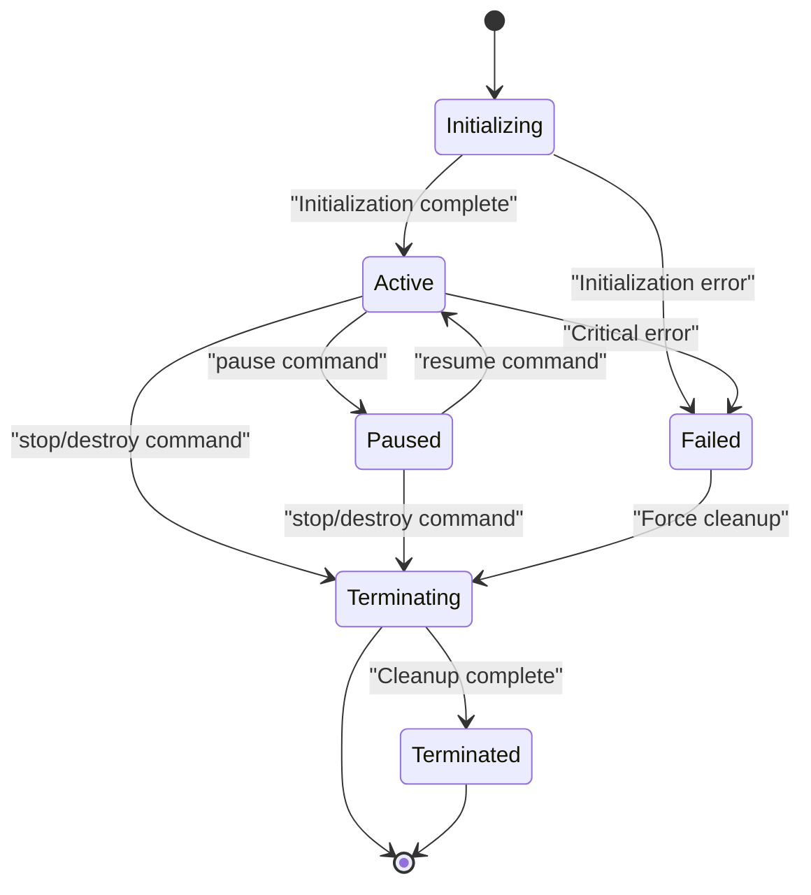
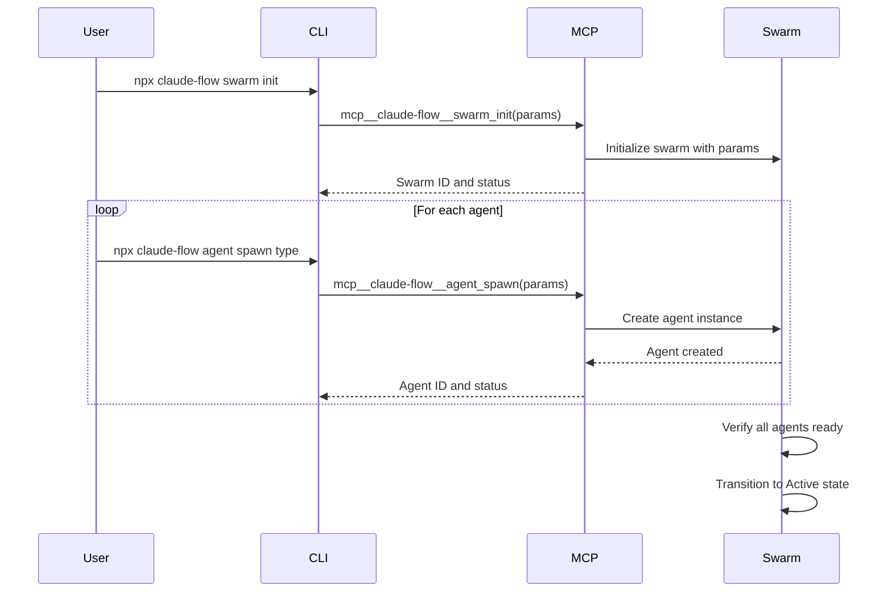

# Swarm Lifecycle Management

<cite>
**Referenced Files in This Document**   
- [mcp-error-wrapper.js](file://ruv-swarm/npm/src/mcp-error-wrapper.js)
- [MCP_TOOLS.md](file://docs/MCP_TOOLS.md)
- [advanced-orchestrator.ts](file://src/swarm/advanced-orchestrator.ts)
- [mcp-integration-wrapper.ts](file://src/swarm/mcp-integration-wrapper.ts)
- [CLAUDE.md](file://CLAUDE.md)
- [CHANGELOG.md](file://CHANGELOG.md)
</cite>

## Table of Contents
1. [Introduction](#introduction)
2. [Swarm Lifecycle Overview](#swarm-lifecycle-overview)
3. [Core Lifecycle Commands](#core-lifecycle-commands)
4. [Swarm States and State Transitions](#swarm-states-and-state-transitions)
5. [Initialization Process](#initialization-process)
6. [Operation and Monitoring](#operation-and-monitoring)
7. [Termination and Resource Cleanup](#termination-and-resource-cleanup)
8. [Common Issues and Solutions](#common-issues-and-solutions)
9. [Best Practices](#best-practices)

## Introduction
Swarm Lifecycle Management is a critical subsystem within the Hive-Mind architecture that governs the creation, operation, and termination of agent swarms. This document provides a comprehensive overview of the swarm lifecycle management implementation, detailing the interfaces, state model, and operational patterns that enable reliable coordination of distributed agent collectives. The system provides programmatic control over swarm initialization, scaling, monitoring, and graceful shutdown, ensuring resource efficiency and system stability.

**Section sources**
- [advanced-orchestrator.ts](file://src/swarm/advanced-orchestrator.ts#L1-L10)

## Swarm Lifecycle Overview
The Swarm Lifecycle Management system implements a stateful orchestration model that manages agent collectives through well-defined phases: initialization, active operation, potential pausing, and controlled termination. The lifecycle is exposed through a set of standardized MCP (Modular Control Protocol) tools that provide consistent interfaces for swarm manipulation. Each swarm operates as an isolated unit with its own topology, agent composition, and resource allocation, enabling parallel execution of multiple independent workflows.

The lifecycle management system ensures proper resource accounting, state persistence, and error recovery throughout the swarm's existence. It coordinates between the orchestration layer, agent execution environment, and monitoring systems to maintain system-wide consistency and prevent resource leaks.



**Diagram sources**
- [mcp-error-wrapper.js](file://ruv-swarm/npm/src/mcp-error-wrapper.js#L249-L284)
- [MCP_TOOLS.md](file://docs/MCP_TOOLS.md#L198-L213)

## Core Lifecycle Commands
The swarm lifecycle is controlled through a set of standardized MCP commands that provide atomic operations for managing swarm state. These commands are implemented as wrapper functions that provide validation, error handling, and timeout management around the core operations.

### Initialization Commands
The initialization phase begins with the `swarm_init` command, which establishes the foundational configuration for a new swarm instance.

```javascript
async swarm_init(params = {}) {
    return await this.executeValidatedOperation('swarm_init', params, async (validatedParams) => {
        // Pre-operation checks
        await this.preOperationChecks('swarm_init');
        
        const result = await this.withTimeout(
            this.baseMCP.swarm_init(validatedParams),
            this.operationTimeouts.swarm_init,
            'swarm_init'
        );
        
        // Post-operation validation
        this.validateSwarmInitResult(result);
        
        return result;
    });
}
```

The `agent_spawn` command is used to create individual agents within an initialized swarm, with parameters specifying the agent type and configuration.

```javascript
async agent_spawn(params = {}) {
    return await this.executeValidatedOperation('agent_spawn', params, async (validatedParams) => {
        await this.preOperationChecks('agent_spawn');
        
        const result = await this.withTimeout(
            this.baseMCP.agent_spawn(validatedParams),
            this.operationTimeouts.agent_spawn,
            'agent_spawn'
        );
        
        this.validateAgentSpawnResult(result);
        
        return result;
    });
}
```

**Section sources**
- [mcp-error-wrapper.js](file://ruv-swarm/npm/src/mcp-error-wrapper.js#L249-L284)

## Swarm States and State Transitions
The swarm lifecycle management system maintains a finite state machine that tracks the operational status of each swarm. The state model ensures that operations are only permitted when appropriate and provides visibility into the current condition of the swarm.

### State Definitions
- **Initializing**: The swarm is being created and configured. Agents are being spawned and initialized.
- **Active**: The swarm is fully operational and processing tasks. All agents are responsive.
- **Paused**: The swarm has been temporarily suspended. Agents retain their state but do not process new tasks.
- **Terminating**: The swarm is in the process of shutting down. Agents are completing current tasks and releasing resources.
- **Terminated**: The swarm has been completely shut down and resources released.
- **Failed**: The swarm encountered a critical error and cannot continue operation.

### State Transition Rules
Transitions between states are governed by strict rules to prevent invalid state changes and ensure system consistency:

1. **Initializing → Active**: Occurs when all initialization steps complete successfully
2. **Initializing → Failed**: Occurs when initialization encounters an unrecoverable error
3. **Active → Paused**: Triggered by explicit pause command
4. **Paused → Active**: Triggered by resume command
5. **Active → Terminating**: Triggered by stop or destroy command
6. **Paused → Terminating**: Triggered by stop or destroy command
7. **Terminating → Terminated**: Occurs when all cleanup operations complete
8. **Any state → Failed**: Occurs when a critical system error is detected

The state transitions are enforced by the orchestration layer, which validates the current state before allowing any state-changing operation to proceed.

**Section sources**
- [mcp-error-wrapper.js](file://ruv-swarm/npm/src/mcp-error-wrapper.js#L881-L969)
- [mcp-integration-wrapper.ts](file://src/swarm/mcp-integration-wrapper.ts#L638)

## Initialization Process
The swarm initialization process follows a structured sequence to ensure proper setup and configuration before agents begin operation.

### Step-by-Step Initialization
1. **Swarm Creation**: The `swarm_init` command creates a new swarm instance with specified topology and configuration parameters.
2. **Resource Allocation**: System resources (memory, CPU limits, network access) are allocated to the swarm.
3. **Agent Spawning**: Individual agents are created using the `agent_spawn` command with specific types and roles.
4. **Topology Establishment**: Communication channels and coordination protocols are established between agents.
5. **Health Verification**: Each agent reports readiness, and the system verifies connectivity and responsiveness.
6. **State Transition**: Once all agents are ready, the swarm state transitions from Initializing to Active.

The initialization process includes comprehensive validation at each step, with rollback procedures available if any phase fails. This ensures that swarms only become active when fully configured and operational.



**Diagram sources**
- [CLAUDE.md](file://CLAUDE.md#L154-L183)
- [CHANGELOG.md](file://CHANGELOG.md#L1148-L1183)

## Operation and Monitoring
During active operation, the swarm lifecycle management system provides monitoring and control capabilities to maintain optimal performance and respond to changing conditions.

### Monitoring Commands
The system exposes two primary monitoring commands:

- **swarm_status**: Returns the current state and basic health information for a swarm
- **swarm_monitor**: Provides detailed real-time metrics and agent-level status

```javascript
async swarm_status(params = {}) {
    return await this.executeValidatedOperation('swarm_status', params, 
        async (p) => await this.withTimeout(
            this.baseMCP.swarm_status(p), 
            this.operationTimeouts.swarm_status, 
            'swarm_status'
        )
    );
}

async swarm_monitor(params = {}) {
    return await this.executeValidatedOperation('swarm_monitor', params,
        async (p) => await this.withTimeout(
            this.baseMCP.swarm_monitor(p),
            15000,
            'swarm_monitor'
        )
    );
}
```

These commands enable external systems to track swarm health, detect performance issues, and make informed decisions about scaling or intervention.

### State Management During Operation
The system maintains continuous health monitoring of all agents and the overall swarm. If an agent becomes unresponsive, the system can automatically attempt recovery or alert operators. The state management system ensures that the reported swarm state accurately reflects the actual operational condition, accounting for partial failures and degraded performance.

**Section sources**
- [mcp-error-wrapper.js](file://ruv-swarm/npm/src/mcp-error-wrapper.js#L881-L969)

## Termination and Resource Cleanup
The termination process ensures that swarms are shut down in a controlled manner, preventing resource leaks and data corruption.

### Graceful Shutdown
The `swarm_destroy` command implements a comprehensive termination process with configurable parameters:

**Function**: Safely terminate a swarm and clean up all associated resources  
**Parameters**:
- `swarmId` (string): Target swarm identifier
- `preserveData` (boolean): Keep swarm data for analysis
- `graceful` (boolean): Allow agents to complete current tasks

The termination process follows these steps:
1. **Pre-shutdown notification**: Agents are notified of impending shutdown
2. **Task completion**: If graceful, agents complete current tasks before shutting down
3. **Resource release**: Memory, file handles, and network connections are released
4. **State persistence**: Final state and metrics are saved if preserveData is true
5. **Process termination**: Agent processes are terminated
6. **Cleanup verification**: System verifies all resources have been released
7. **State update**: Swarm state transitions to Terminated

This structured approach prevents the common issue of incomplete shutdowns and ensures that system resources are properly reclaimed.

**Section sources**
- [MCP_TOOLS.md](file://docs/MCP_TOOLS.md#L198-L213)

## Common Issues and Solutions
The swarm lifecycle management system addresses several common challenges in distributed agent coordination.

### Incomplete Shutdowns
**Issue**: Agents fail to terminate properly, leaving orphaned processes and resource leaks.  
**Solution**: The system implements timeout-based forced termination if graceful shutdown exceeds configured limits. The `withTimeout` wrapper ensures that no operation hangs indefinitely.

### Resource Leaks
**Issue**: Memory, file handles, or network connections are not properly released during termination.  
**Solution**: The termination process includes explicit resource cleanup steps, and the system maintains resource accounting to verify complete release.

### State Corruption
**Issue**: Inconsistent state between the orchestration layer and actual agent conditions.  
**Solution**: The system implements health checking and state validation at each transition point, with reconciliation procedures to resolve discrepancies.

### Scaling Challenges
**Issue**: Performance degradation when rapidly scaling swarms up and down.  
**Solution**: The system uses connection pooling and optimized resource allocation patterns to minimize overhead during initialization and termination.

**Section sources**
- [mcp-error-wrapper.js](file://ruv-swarm/npm/src/mcp-error-wrapper.js#L249-L284)
- [mcp-integration-wrapper.ts](file://src/swarm/mcp-integration-wrapper.ts#L638)

## Best Practices
To ensure reliable swarm lifecycle management, follow these best practices:

1. **Always use graceful termination** when possible to allow agents to complete critical tasks
2. **Monitor swarm status** regularly to detect and address issues early
3. **Implement proper error handling** around all lifecycle commands to manage failures
4. **Use descriptive swarm IDs** to facilitate tracking and debugging
5. **Preserve data** during termination for post-mortem analysis of issues
6. **Test initialization sequences** thoroughly to identify configuration issues
7. **Implement health checks** in agent code to ensure accurate status reporting

Following these practices ensures reliable operation and simplifies troubleshooting when issues arise.

**Section sources**
- [CLAUDE.md](file://CLAUDE.md#L154-L183)
- [CHANGELOG.md](file://CHANGELOG.md#L1148-L1221)