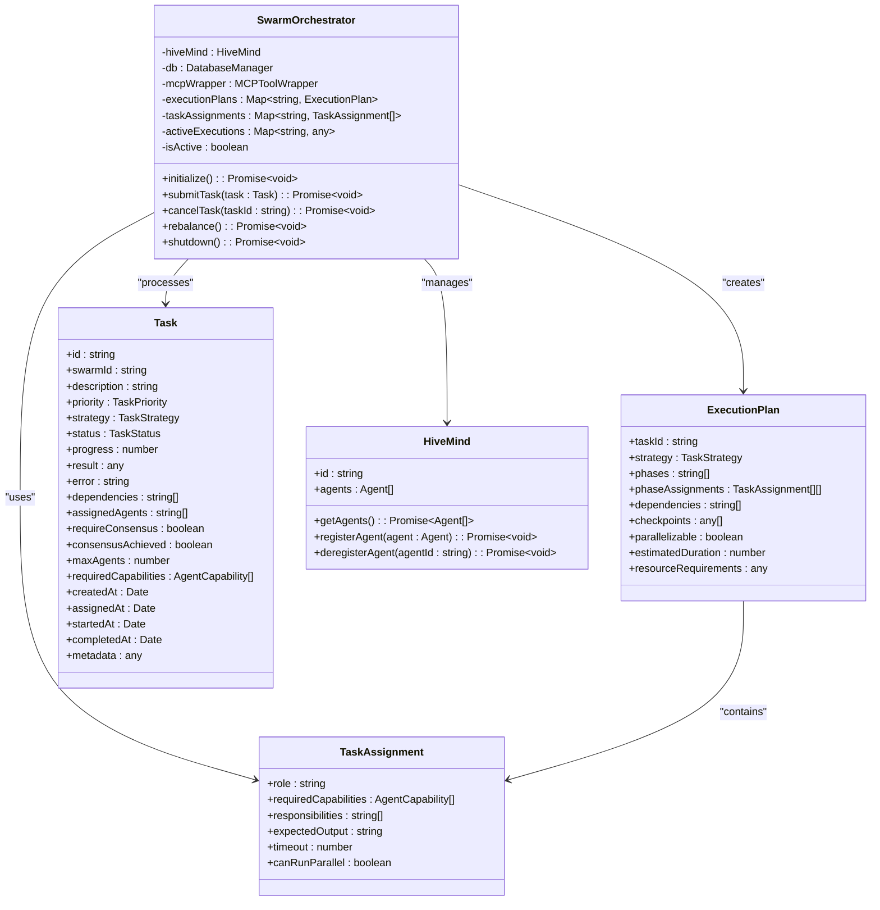
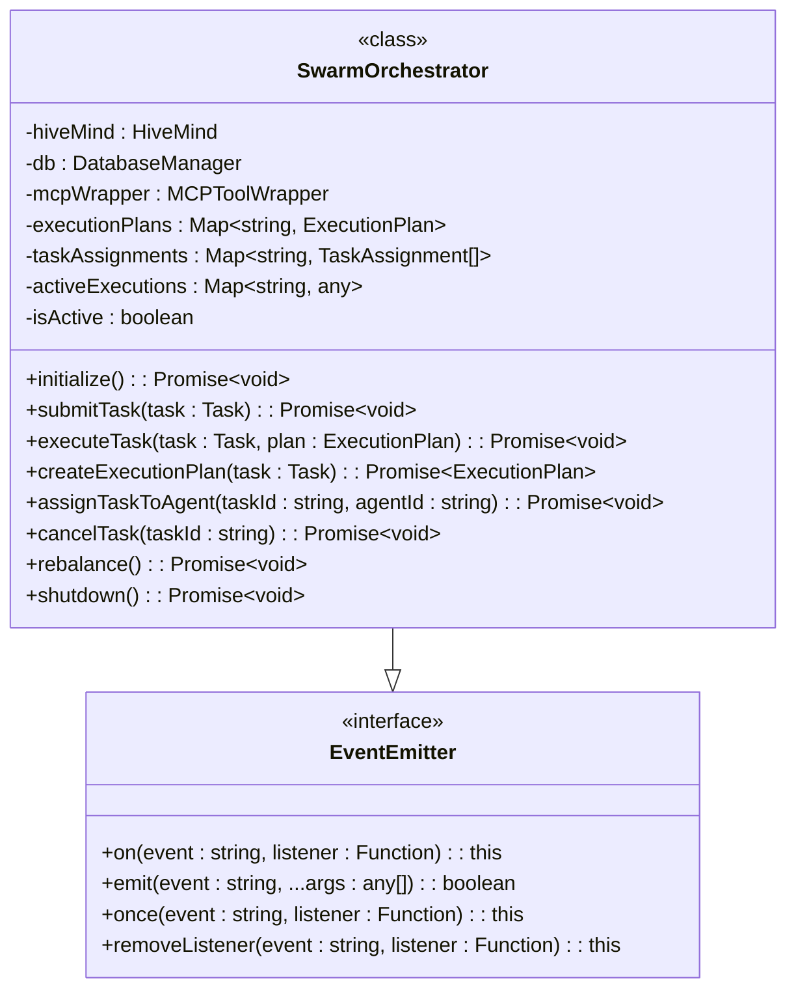
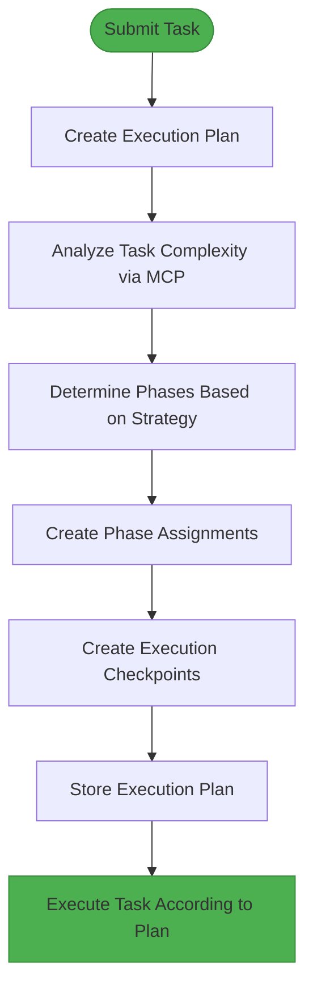
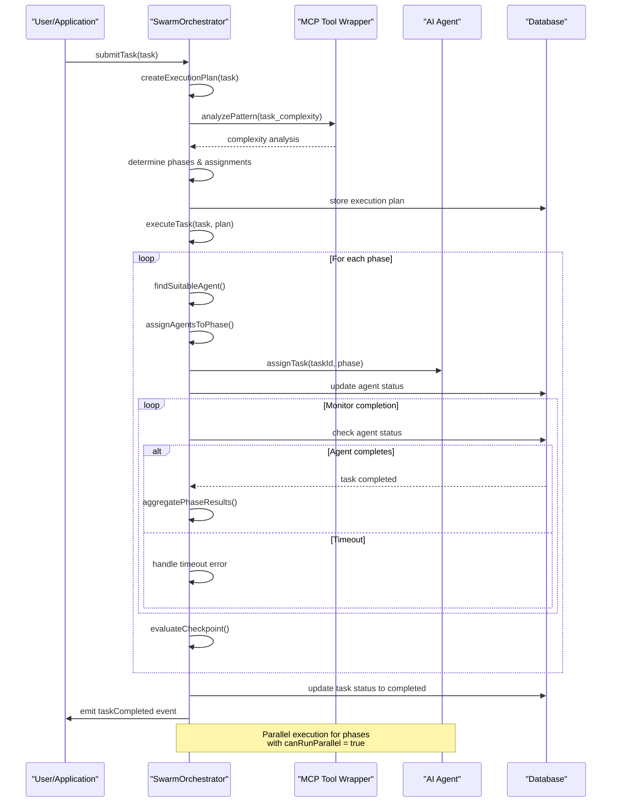
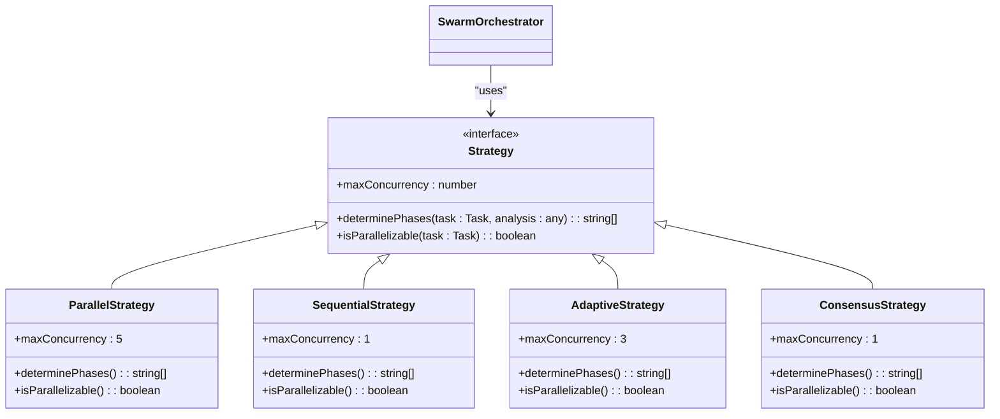
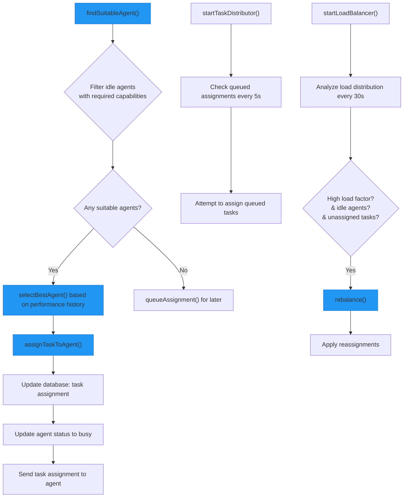
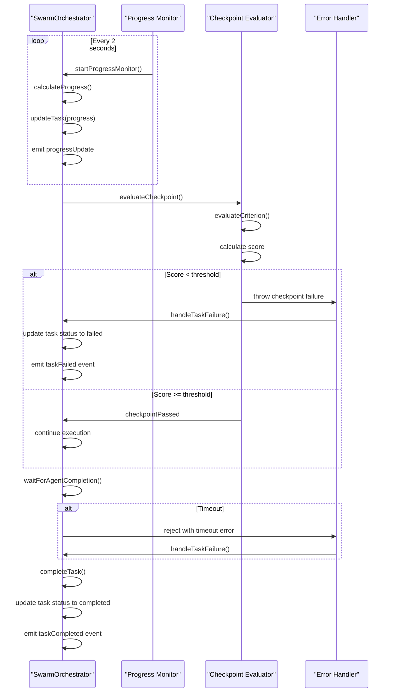
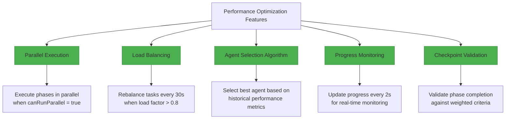

# Swarm Orchestration

<cite>
**Referenced Files in This Document**   
- [SwarmOrchestrator.ts](file://src/hive-mind/integration/SwarmOrchestrator.ts#L20-L904)
- [types.ts](file://src/hive-mind/types.ts#L130-L151)
- [types.ts](file://src/hive-mind/types.ts#L165-L172)
- [types.ts](file://src/hive-mind/types.ts#L325-L335)
- [HiveMind.ts](file://src/hive-mind/core/HiveMind.ts#L15-L850)
</cite>

## Table of Contents
1. [Introduction](#introduction)
2. [Core Components](#core-components)
3. [Architecture Overview](#architecture-overview)
4. [Detailed Component Analysis](#detailed-component-analysis)
5. [Task Orchestration Workflow](#task-orchestration-workflow)
6. [Execution Strategies](#execution-strategies)
7. [Agent Management](#agent-management)
8. [Fault Tolerance and Monitoring](#fault-tolerance-and-monitoring)
9. [Performance Optimization](#performance-optimization)
10. [Conclusion](#conclusion)

## Introduction
The Swarm Orchestration system is a sophisticated framework designed to coordinate multiple AI agents in completing complex tasks through intelligent task distribution, load balancing, and execution monitoring. This document provides a comprehensive analysis of the SwarmOrchestrator class, which serves as the central coordination mechanism for managing swarm operations across multiple AI agents. The system implements advanced patterns for distributed task orchestration, enabling parallel execution, adaptive strategy selection, and robust fault tolerance. By leveraging the MCP (Management Control Panel) tools and integrating with the HiveMind system, the orchestrator creates execution plans, assigns tasks to specialized agents, monitors progress, and ensures reliable completion of complex workflows.

**Section sources**
- [SwarmOrchestrator.ts](file://src/hive-mind/integration/SwarmOrchestrator.ts#L20-L904)

## Core Components
The Swarm Orchestration system consists of several key components that work together to manage distributed task execution. The core components include the SwarmOrchestrator class, ExecutionPlan interface, TaskAssignment interface, and integration with the HiveMind system. These components form a cohesive architecture that enables intelligent coordination of multiple AI agents.

**Diagram sources**
- [SwarmOrchestrator.ts](file://src/hive-mind/integration/SwarmOrchestrator.ts#L20-L904)
- [types.ts](file://src/hive-mind/types.ts#L130-L151)
- [types.ts](file://src/hive-mind/types.ts#L165-L172)
- [types.ts](file://src/hive-mind/types.ts#L325-L335)
- [HiveMind.ts](file://src/hive-mind/core/HiveMind.ts#L15-L850)

**Section sources**
- [SwarmOrchestrator.ts](file://src/hive-mind/integration/SwarmOrchestrator.ts#L20-L904)
- [types.ts](file://src/hive-mind/types.ts#L130-L151)
- [types.ts](file://src/hive-mind/types.ts#L165-L172)
- [types.ts](file://src/hive-mind/types.ts#L325-L335)

## Architecture Overview
The Swarm Orchestration system follows a centralized coordination architecture where the SwarmOrchestrator acts as the central controller that manages all aspects of task execution across multiple AI agents. The orchestrator integrates with the HiveMind system to access available agents and their capabilities, uses a database to persist task states, and leverages MCP tools for advanced orchestration capabilities.

```mermaid
graph TD
subgraph "Swarm Orchestration System"
Orchestrator[SwarmOrchestrator]
HiveMind[HiveMind]
Database[(Database)]
MCP[MCP Tool Wrapper]
end
subgraph "AI Agents"
Agent1[Agent 1]
Agent2[Agent 2]
Agent3[Agent 3]
AgentN[Agent N]
end
User --> |Submit Task| Orchestrator
Orchestrator --> |Get Agents| HiveMind
Orchestrator --> |Store/Retrieve| Database
Orchestrator --> |Orchestrate| MCP
Orchestrator --> |Assign Tasks| Agent1
Orchestrator --> |Assign Tasks| Agent2
Orchestrator --> |Assign Tasks| Agent3
Orchestrator --> |Assign Tasks| AgentN
Agent1 --> |Report Status| Orchestrator
Agent2 --> |Report Status| Orchestrator
Agent3 --> |Report Status| Orchestrator
AgentN --> |Report Status| Orchestrator
Orchestrator --> |Update Status| Database
Orchestrator --> |Notify Completion| User
style Orchestrator fill:#4CAF50,stroke:#388E3C
style HiveMind fill:#2196F3,stroke:#1976D2
style Database fill:#FF9800,stroke:#F57C00
style MCP fill:#9C27B0,stroke:#7B1FA2
style Agent1 fill:#607D8B,stroke:#455A64
style Agent2 fill:#607D8B,stroke:#455A64
style Agent3 fill:#607D8B,stroke:#455A64
style AgentN fill:#607D8B,stroke:#455A64
```

**Diagram sources**
- [SwarmOrchestrator.ts](file://src/hive-mind/integration/SwarmOrchestrator.ts#L20-L904)
- [HiveMind.ts](file://src/hive-mind/core/HiveMind.ts#L15-L850)

## Detailed Component Analysis

### SwarmOrchestrator Class Analysis
The SwarmOrchestrator class is the central component of the swarm orchestration system, responsible for managing the entire lifecycle of task execution across multiple AI agents. It extends EventEmitter to provide event-driven notifications for various orchestration events.

**Diagram sources**
- [SwarmOrchestrator.ts](file://src/hive-mind/integration/SwarmOrchestrator.ts#L20-L904)

**Section sources**
- [SwarmOrchestrator.ts](file://src/hive-mind/integration/SwarmOrchestrator.ts#L20-L904)

### Execution Plan Creation
The orchestrator creates detailed execution plans for each task based on the specified strategy and task complexity analysis. The plan defines the phases of execution, assignments for each phase, checkpoints, and resource requirements.

**Diagram sources**
- [SwarmOrchestrator.ts](file://src/hive-mind/integration/SwarmOrchestrator.ts#L20-L904)

**Section sources**
- [SwarmOrchestrator.ts](file://src/hive-mind/integration/SwarmOrchestrator.ts#L20-L904)

## Task Orchestration Workflow
The task orchestration workflow follows a systematic process from task submission to completion, with comprehensive monitoring and error handling throughout the execution lifecycle.

**Diagram sources**
- [SwarmOrchestrator.ts](file://src/hive-mind/integration/SwarmOrchestrator.ts#L20-L904)

**Section sources**
- [SwarmOrchestrator.ts](file://src/hive-mind/integration/SwarmOrchestrator.ts#L20-L904)

## Execution Strategies
The SwarmOrchestrator supports multiple execution strategies that determine how tasks are broken down and executed across agents. Each strategy defines the phases of execution and whether parallel execution is possible.

**Diagram sources**
- [SwarmOrchestrator.ts](file://src/hive-mind/integration/SwarmOrchestrator.ts#L20-L904)

**Section sources**
- [SwarmOrchestrator.ts](file://src/hive-mind/integration/SwarmOrchestrator.ts#L20-L904)

## Agent Management
The orchestrator implements sophisticated agent management capabilities, including agent discovery, assignment, load balancing, and lifecycle management.

**Diagram sources**
- [SwarmOrchestrator.ts](file://src/hive-mind/integration/SwarmOrchestrator.ts#L20-L904)

**Section sources**
- [SwarmOrchestrator.ts](file://src/hive-mind/integration/SwarmOrchestrator.ts#L20-L904)

## Fault Tolerance and Monitoring
The system implements comprehensive fault tolerance mechanisms and continuous monitoring to ensure reliable task execution and quick recovery from failures.

**Diagram sources**
- [SwarmOrchestrator.ts](file://src/hive-mind/integration/SwarmOrchestrator.ts#L20-L904)

**Section sources**
- [SwarmOrchestrator.ts](file://src/hive-mind/integration/SwarmOrchestrator.ts#L20-L904)

## Performance Optimization
The orchestrator implements several performance optimization techniques to maximize efficiency and resource utilization across the swarm.

**Diagram sources**
- [SwarmOrchestrator.ts](file://src/hive-mind/integration/SwarmOrchestrator.ts#L20-L904)

**Section sources**
- [SwarmOrchestrator.ts](file://src/hive-mind/integration/SwarmOrchestrator.ts#L20-L904)

## Conclusion
The Swarm Orchestration system provides a robust framework for coordinating multiple AI agents in completing complex tasks through intelligent task distribution, adaptive execution strategies, and comprehensive monitoring. The SwarmOrchestrator class serves as the central coordination mechanism, managing the entire lifecycle of task execution from submission to completion. By leveraging the MCP tools for complexity analysis and strategy determination, the orchestrator creates detailed execution plans that optimize resource utilization and ensure reliable task completion. The system's support for multiple execution strategies, parallel processing, load balancing, and fault tolerance makes it well-suited for managing complex workflows across distributed AI agents. The integration with the HiveMind system enables dynamic agent discovery and management, while the event-driven architecture provides real-time monitoring and notification capabilities. This comprehensive approach to swarm orchestration enables efficient coordination of multiple AI agents, making it possible to tackle complex problems that require specialized capabilities and collaborative problem-solving.