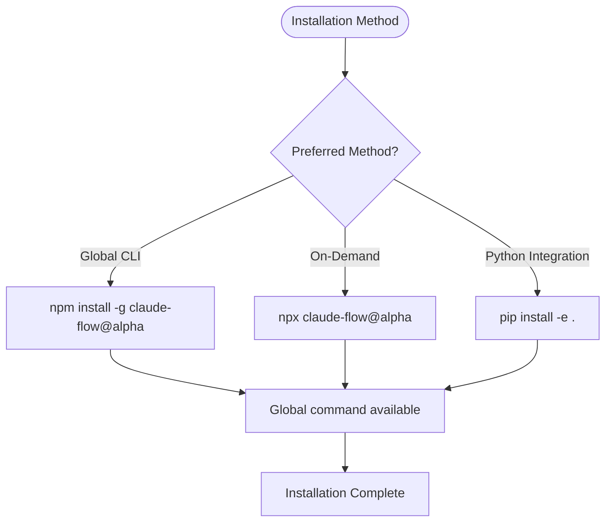
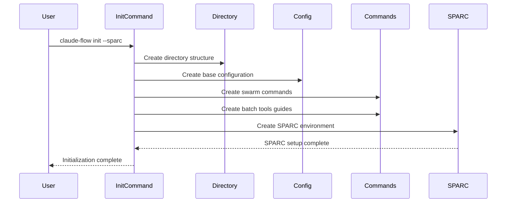

# Installation and Setup

<cite>
**Referenced Files in This Document**   
- [README.md](file://README.md)
- [package.json](file://package.json)
- [python-claude-flow/README.md](file://python-claude-flow/README.md)
- [python-claude-flow/install.py](file://python-claude-flow/install.py)
- [python-claude-flow/install.sh](file://python-claude-flow/install.sh)
- [python-claude-flow/install.bat](file://python-claude-flow/install.bat)
- [src/cli/simple-commands/init/help.js](file://src/cli/simple-commands/init/help.js)
- [src/cli/command-registry.js](file://src/cli/command-registry.js)
- [src/cli/init/index.ts](file://src/cli/init/index.ts)
- [src/config/config-manager.ts](file://src/config/config-manager.ts)
- [python-claude-flow/src/claude_flow/core/config.py](file://python-claude-flow/src/claude_flow/core/config.py)
</cite>

## Table of Contents
1. [System Requirements](#system-requirements)
2. [Installation Methods](#installation-methods)
3. [Initialization Process](#initialization-process)
4. [Configuration Setup](#configuration-setup)
5. [Authentication and Environment Variables](#authentication-and-environment-variables)
6. [Common Issues and Troubleshooting](#common-issues-and-troubleshooting)
7. [Verification of Installation](#verification-of-installation)

## System Requirements

The Claude-Flow environment has specific system requirements to ensure proper functionality across its various components. These requirements differ slightly between the Node.js and Python implementations.

### Node.js Requirements
- **Node.js**: Version 18 or higher (LTS recommended)
- **npm**: Version 9 or higher, or equivalent package manager (yarn, pnpm)
- **Claude Code**: Must be installed globally via `npm install -g @anthropic-ai/claude-code`

### Python Requirements
- **Python**: Version 3.8 or higher (3.11+ recommended)
- **pip**: Python package manager for dependency installation
- **Claude API Key**: Required for authentication with Anthropic's services

### Platform-Specific Notes
- **Windows Users**: May encounter SQLite errors; the system will automatically fallback to in-memory storage. For persistent storage, refer to the Windows installation guide.
- **Linux/macOS Users**: Standard installation procedures apply with no special requirements.

**Section sources**
- [README.md](file://README.md)
- [python-claude-flow/README.md](file://python-claude-flow/README.md)

## Installation Methods

Claude-Flow can be installed through multiple methods, catering to different use cases and preferences. The primary installation methods include npm, npx, and the Python wrapper.

### npm Installation (Global)
For users who prefer a globally available CLI tool, install Claude-Flow using npm:

```bash
npm install -g claude-flow@alpha
```

This method installs the `claude-flow` command globally, making it available system-wide. This approach is recommended for frequent users who work on multiple projects.

### npx Installation (On-Demand)
For temporary or one-time usage without global installation, use npx to execute commands directly:

```bash
npx claude-flow@alpha init --force
```

This method downloads and runs the specified version of Claude-Flow without installing it globally, ideal for testing or isolated tasks.

### Python Wrapper Installation
The Python implementation provides a native Python interface to Claude-Flow functionality. Installation can be done from source:

```bash
# Install in development mode
pip install -e .

# Or install with all dependencies
pip install -e ".[dev,ui]"
```

Alternatively, install only the required dependencies:
```bash
pip install -r requirements.txt
```

Platform-specific installation scripts are provided:
- **Linux/macOS**: Use `install.sh`
- **Windows**: Use `install.bat`

These scripts handle dependency installation, package installation, and basic validation.



**Diagram sources**
- [README.md](file://README.md)
- [python-claude-flow/README.md](file://python-claude-flow/README.md)
- [python-claude-flow/install.py](file://python-claude-flow/install.py)

**Section sources**
- [README.md](file://README.md)
- [python-claude-flow/README.md](file://python-claude-flow/README.md)
- [python-claude-flow/install.py](file://python-claude-flow/install.py)
- [python-claude-flow/install.sh](file://python-claude-flow/install.sh)
- [python-claude-flow/install.bat](file://python-claude-flow/install.bat)

## Initialization Process

The initialization process sets up the necessary files and configurations for Claude-Flow to operate effectively. This is accomplished through the `claude-flow init` command, which creates the required directory structure and configuration files.

### Basic Initialization
The default initialization command:
```bash
claude-flow init
```

This command creates essential files and directories for Claude-Flow integration, including configuration files and command directories.

### SPARC Environment Initialization
For a complete development environment with specialized modes:
```bash
npx claude-flow@latest init --sparc
```

This creates:
- `.roomodes` file with 17 specialized SPARC modes
- `CLAUDE.md` for AI-readable project instructions
- Pre-configured modes: architect, code, tdd, debug, security, and more

### Alternative Initialization Modes
Several options are available for customized initialization:

- **Basic**: `init --basic` - Pre-v2.0.0 behavior
- **Minimal**: `init --minimal` - Create minimal configuration files
- **Force Overwrite**: `init --force` - Overwrite existing files
- **Dry Run**: `init --dry-run` - Preview changes without applying them
- **Skip MCP**: `init --skip-mcp` - Skip automatic MCP server setup

### Initialization Phases
The initialization process follows a structured sequence:

1. **Directory Structure Creation**: Establishes the necessary folder hierarchy
2. **Configuration Creation**: Generates base configuration files
3. **Swarm Commands Setup**: Creates command files for swarm operations
4. **Batch Tools Configuration**: Sets up batch processing tools
5. **SPARC Environment Setup**: Creates specialized development modes (when `--sparc` is used)



**Diagram sources**
- [src/cli/init/index.ts](file://src/cli/init/index.ts)
- [src/cli/simple-commands/init/help.js](file://src/cli/simple-commands/init/help.js)

**Section sources**
- [src/cli/init/index.ts](file://src/cli/init/index.ts)
- [src/cli/simple-commands/init/help.js](file://src/cli/simple-commands/init/help.js)
- [src/cli/command-registry.js](file://src/cli/command-registry.js)

## Configuration Setup

Proper configuration is essential for Claude-Flow to function correctly. The system uses a combination of configuration files and environment variables to manage settings.

### Configuration Files
The initialization process creates several key configuration files:

- **`.claude/settings.json`**: Main Claude Code configuration with hooks
- **`.claude/settings.local.json`**: Pre-approved MCP permissions (eliminates prompts)
- **`.mcp.json`**: Project-scoped MCP server configuration
- **`claude-flow.config.json`**: Claude Flow features and performance settings
- **`.claude/commands/`**: Directory containing over 20 Claude Code slash commands

### Default Configuration Structure
The default configuration includes settings for various subsystems:

```json
{
  "agents": {
    "maxAgents": 8,
    "resourceLimits": {
      "memory": 2048,
      "cpu": 2
    }
  },
  "memory": {
    "backend": "sqlite",
    "path": ".swarm/memory.db"
  },
  "orchestrator": {
    "maxConcurrentTasks": 5,
    "taskTimeout": 300000
  },
  "mcp": {
    "transport": "stdio",
    "port": 3000,
    "tlsEnabled": false
  },
  "logging": {
    "level": "info",
    "format": "json",
    "destination": "console"
  },
  "ruvSwarm": {
    "enabled": true,
    "defaultTopology": "mesh",
    "maxAgents": 8,
    "defaultStrategy": "adaptive"
  },
  "claude": {
    "model": "claude-3-sonnet-20240229",
    "temperature": 0.7,
    "maxTokens": 4096
  }
}
```

### Configuration Management Commands
Claude-Flow provides CLI commands to manage configuration:

```bash
# Display current configuration
claude-flow config show

# Get specific configuration value
claude-flow config get agents.maxAgents

# Set configuration value
claude-flow config set agents.maxAgents 10

# Validate configuration
claude-flow config validate

# Reset to defaults
claude-flow config reset --force
```

**Section sources**
- [src/config/config-manager.ts](file://src/config/config-manager.ts)
- [src/cli/simple-commands/config.js](file://src/cli/simple-commands/config.js)

## Authentication and Environment Variables

Authentication and service integration are managed through environment variables and API keys, ensuring secure access to external services.

### Claude API Key Setup
Authentication with Anthropic's Claude service requires an API key. This can be configured in multiple ways:

#### Environment Variable
```bash
export CLAUDE_API_KEY="your_api_key_here"
```

#### Environment File
Create a `.env` file with your credentials:
```bash
# Copy the template
cp .env.example .env

# Edit with your API key
CLAUDE_API_KEY=your_api_key_here
```

### Environment Variable Configuration
The system supports various environment variables for configuration:

- **`CLAUDE_API_KEY`**: Authentication key for Claude services
- **`LOG_LEVEL`**: Logging verbosity (info, debug, warning, error)
- **`ENVIRONMENT`**: Environment type (development, production, staging)
- **`DEBUG`**: Enable debug mode (true/false)
- **`CLAUDE_WORKING_DIR`**: Working directory for Claude operations

### Python Configuration Loading
In the Python implementation, configuration is loaded from environment variables:

```python
def load_from_env(self) -> None:
    """Load configuration from environment variables"""
    # API key
    if api_key := os.getenv("CLAUDE_API_KEY"):
        self.api.key = api_key
    
    # Database path
    if db_path := os.getenv("CLAUDE_FLOW_DB_PATH"):
        self.database.path = db_path
    
    # Logging configuration
    if log_level := os.getenv("LOG_LEVEL"):
        self.logging.level = log_level.upper()
    
    # Environment
    if env := os.getenv("ENVIRONMENT"):
        self.environment = env
    
    # Debug mode
    if debug := os.getenv("DEBUG"):
        self.debug = debug.lower() in ("true", "1", "yes")
```

### Security Best Practices
- Never commit API keys to version control
- Use environment files with `.gitignore` for local development
- Rotate API keys periodically
- Use different keys for development and production environments
- Limit permissions to the minimum required scope

**Section sources**
- [python-claude-flow/README.md](file://python-claude-flow/README.md)
- [python-claude-flow/src/claude_flow/core/config.py](file://python-claude-flow/src/claude_flow/core/config.py)
- [src/core/config.ts](file://src/core/config.ts)

## Common Issues and Troubleshooting

During installation and setup, users may encounter various issues. This section addresses common problems and their solutions.

### Permission Errors
**Symptom**: Installation fails with EACCES or permission denied errors.

**Solutions**:
- Use `sudo` for global npm installation (not recommended for security reasons)
- Fix npm permissions by changing the default directory
- Use npx instead of global installation
- On Windows, run terminal as administrator

### Network Issues
**Symptom**: Installation fails due to network timeouts or connection errors.

**Solutions**:
- Check internet connection
- Configure npm proxy settings if behind a corporate firewall
- Use a different registry: `npm config set registry https://registry.npmjs.org/`
- Retry installation during off-peak hours

### Dependency Conflicts
**Symptom**: Conflicting versions of dependencies or peer dependency warnings.

**Solutions**:
- Clear npm cache: `npm cache clean --force`
- Remove node_modules and package-lock.json, then reinstall
- Use the exact version specified in the documentation
- For Python, create a virtual environment to isolate dependencies

### Platform-Specific Issues
**Windows SQLite Errors**:
- The system automatically falls back to in-memory storage
- For persistent storage, install SQLite3 development libraries
- Ensure proper file permissions on the working directory

**Python Version Issues**:
- Verify Python version: `python --version`
- Ensure Python 3.8 or higher is installed
- Use virtual environments to manage Python versions

### Installation Validation Script
The Python wrapper includes comprehensive error handling in its installation script:

```python
def main():
    print("🌊 Claude-Flow Python Installation")
    
    # Check Python version
    if sys.version_info < (3, 8):
        print("❌ Python 3.8+ is required")
        sys.exit(1)
    
    # Install dependencies
    if not install_dependencies():
        print("❌ Failed to install dependencies")
        sys.exit(1)
    
    # Install package
    if not install_package():
        print("❌ Failed to install package")
        sys.exit(1)
    
    # Test installation
    if not test_installation():
        print("❌ Installation test failed")
        sys.exit(1)
    
    print("\n🎉 Installation completed successfully!")
```

**Section sources**
- [python-claude-flow/install.py](file://python-claude-flow/install.py)
- [python-claude-flow/install.sh](file://python-claude-flow/install.sh)
- [python-claude-flow/install.bat](file://python-claude-flow/install.bat)

## Verification of Installation

After installation and setup, verify that Claude-Flow is properly configured and functioning.

### Version Verification
Check the installed version to confirm successful installation:
```bash
claude-flow --version
```
Expected output: `2.0.0-alpha.53` or similar version number.

### Configuration Validation
Verify that configuration files were created correctly:
```bash
claude-flow config validate
```

This command checks the configuration file structure and reports any issues.

### Functional Testing
Test core functionality with basic commands:
```bash
# Show help to verify CLI is working
claude-flow --help

# Check memory system
claude-flow memory stats

# Test swarm coordination
claude-flow swarm "test connection" --dry-run
```

### Expected Directory Structure
After successful initialization, the following directory structure should be present:

```
.project-root/
├── .claude/
│   ├── settings.json
│   ├── settings.local.json
│   └── commands/
├── .mcp.json
├── claude-flow.config.json
├── CLAUDE.md
└── .roomodes (if --sparc was used)
```

### Successful Setup Output
A successful initialization should display output similar to:

```
Initializing Claude-Flow project...

📁 Phase 1: Creating directory structure...
✅ Directory structure created

⚙️  Phase 2: Creating configuration...
✅ Configuration files created

🤖 Phase 3: Creating swarm commands...
✅ Swarm commands created

🔧 Phase 4: Creating batch tools guides...
✅ Batch tools guides created

🎉 Initialization complete! Run 'claude-flow --help' to get started.
```

**Section sources**
- [README.md](file://README.md)
- [src/cli/init/index.ts](file://src/cli/init/index.ts)
- [src/cli/simple-commands/init/help.js](file://src/cli/simple-commands/init/help.js)