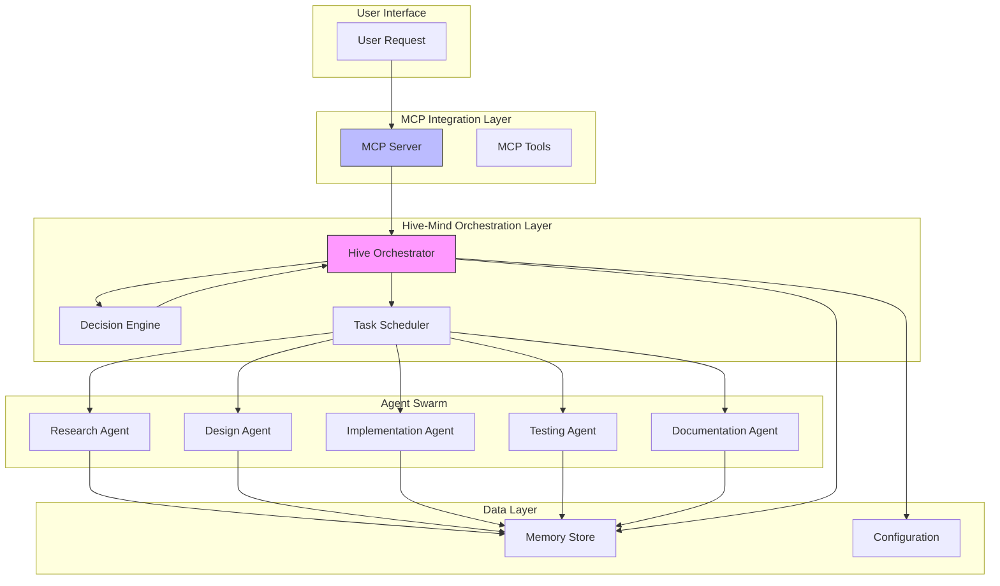
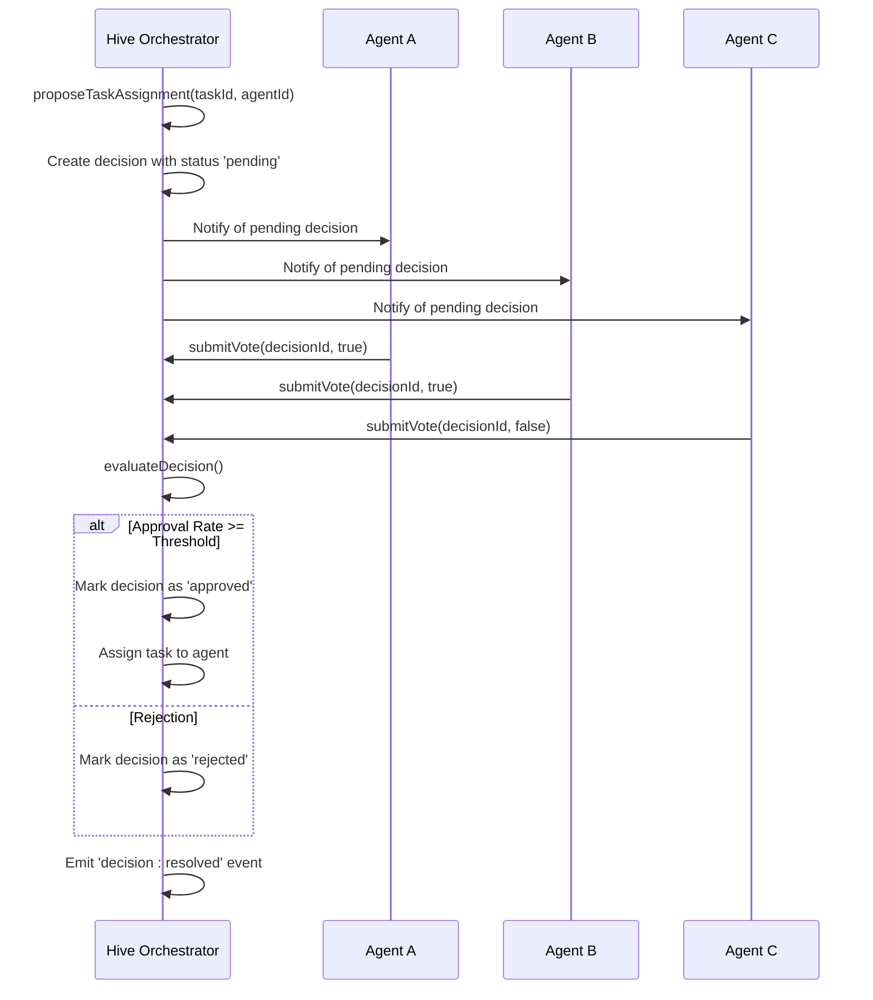
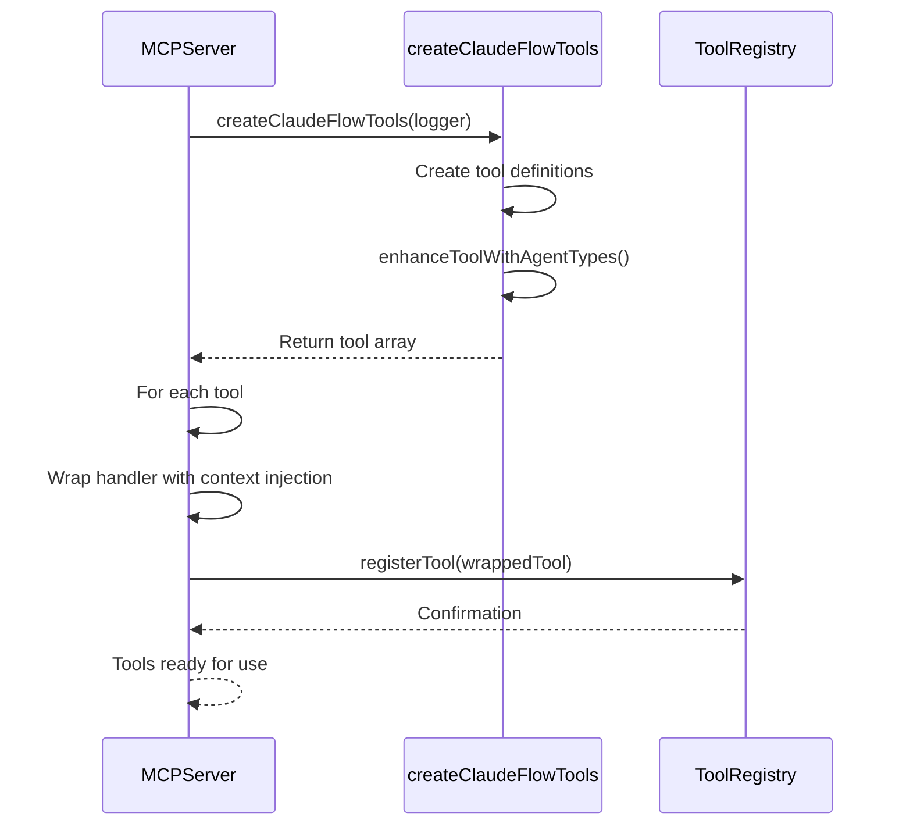
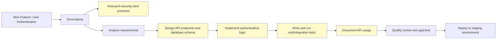
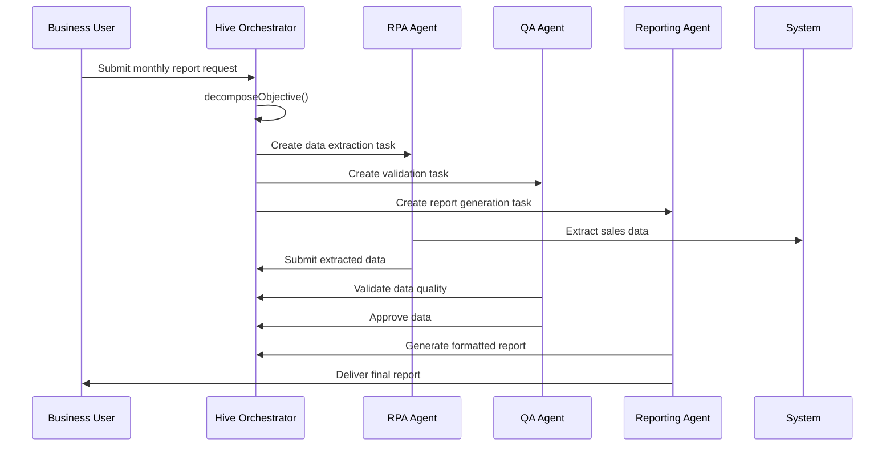
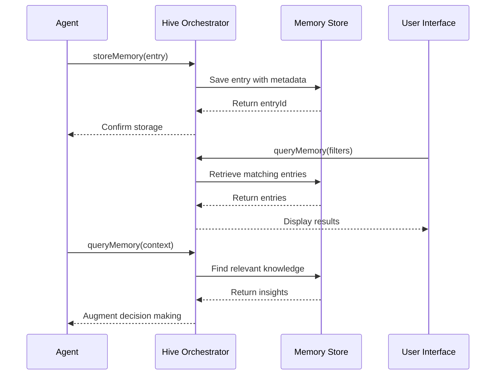

# Introduction

<cite>
**Referenced Files in This Document**   
- [hive-orchestrator.ts](file://src/coordination/hive-orchestrator.ts#L0-L422)
- [server.ts](file://src/mcp/server.ts#L0-L647)
- [claude-flow-tools.ts](file://src/mcp/claude-flow-tools.ts#L0-L1324)
- [types.js](file://src/utils/types.js)
- [index.js](file://src/index.js)
</cite>

## Table of Contents
1. [Introduction](#introduction)
2. [Architecture Overview](#architecture-overview)
3. [Core Components](#core-components)
4. [Swarm Intelligence and Coordination](#swarm-intelligence-and-coordination)
5. [MCP Tools and Integration](#mcp-tools-and-integration)
6. [Practical Use Cases](#practical-use-cases)
7. [System Data Flow](#system-data-flow)

## Architecture Overview

The Claude-Flow platform is an AI orchestration system that implements queen-led swarm intelligence to coordinate multiple AI agents in accomplishing complex tasks. The architecture follows a hierarchical model where a central orchestrator (the "queen") manages a swarm of specialized agents, coordinates task execution, and ensures consensus-based decision making.

The system is built around three primary architectural layers:
- **Hive-Mind Orchestration Layer**: Central coordination and task management
- **MCP (Model Context Protocol) Integration Layer**: Tool exposure and external environment integration
- **Neural Processing Layer**: Agent execution and cognitive processing

The platform leverages a microservices-inspired design with loosely coupled components that communicate through well-defined interfaces and event-driven patterns. This allows for scalability, fault tolerance, and dynamic reconfiguration of the agent swarm based on task requirements.



**Diagram sources**
- [hive-orchestrator.ts](file://src/coordination/hive-orchestrator.ts#L0-L422)
- [server.ts](file://src/mcp/server.ts#L0-L647)

**Section sources**
- [hive-orchestrator.ts](file://src/coordination/hive-orchestrator.ts#L0-L422)
- [server.ts](file://src/mcp/server.ts#L0-L647)

## Core Components

The Claude-Flow platform consists of several core components that work together to enable sophisticated AI orchestration:

### Hive Orchestrator
The Hive Orchestrator serves as the "queen" in the swarm intelligence model, responsible for high-level coordination, task decomposition, and consensus decision-making. It implements a hierarchical topology by default but supports alternative topologies including mesh, ring, and star configurations.

Key responsibilities include:
- **Task Decomposition**: Breaking down complex objectives into coordinated subtasks
- **Agent Registration**: Managing agent capabilities and availability
- **Consensus Voting**: Facilitating voting processes for task assignment and quality checks
- **Dependency Management**: Ensuring proper execution order based on task dependencies
- **Performance Monitoring**: Tracking swarm metrics and execution efficiency

The orchestrator uses a priority-based ordering system with configurable consensus thresholds (default: 60%) and requires 80% participation in voting processes.

### MCP Server
The MCP (Model Context Protocol) Server acts as the integration layer between the Claude-Flow platform and external environments, particularly the Claude Code environment. It exposes 87 specialized tools through standardized endpoints and manages session state, authentication, and load balancing.

Key features include:
- **Transport Flexibility**: Support for both stdio and HTTP transports
- **Tool Registry**: Dynamic registration and management of MCP tools
- **Session Management**: Tracking of active sessions and client contexts
- **Load Balancing**: Rate limiting and circuit breaker patterns for stability
- **Health Monitoring**: Comprehensive system status and metrics reporting

### Agent System
The agent system comprises specialized AI agents with distinct capabilities optimized for different task types. Agents are spawned dynamically based on task requirements and can be customized with specific system prompts, capabilities, and environmental configurations.

Agent types include:
- **Research Agents**: Specialized in information gathering and analysis
- **Design Agents**: Focused on system architecture and component design
- **Implementation Agents**: Optimized for code generation and development
- **Testing Agents**: Dedicated to validation, quality assurance, and testing
- **Documentation Agents**: Responsible for technical writing and knowledge preservation

```mermaid
classDiagram
class HiveOrchestrator {
-tasks : Map<string, HiveTask>
-decisions : Map<string, HiveDecision>
-agentCapabilities : Map<string, Set<string>>
-consensusThreshold : number
-topology : string
+registerAgentCapabilities(agentId, capabilities) : void
+decomposeObjective(objective) : Promise<HiveTask[]>
+proposeTaskAssignment(taskId, agentId) : Promise<HiveDecision>
+submitVote(decisionId, agentId, vote) : void
+getOptimalAgent(taskId) : string | null
+updateTaskStatus(taskId, status, result?) : void
+getPerformanceMetrics() : Object
+getTaskGraph() : Object
}
class MCPServer {
-transport : ITransport
-toolRegistry : ToolRegistry
-router : RequestRouter
-sessionManager : ISessionManager
-authManager : IAuthManager
-loadBalancer : ILoadBalancer
+start() : Promise<void>
+stop() : Promise<void>
+registerTool(tool : MCPTool) : void
+getHealthStatus() : Promise<Object>
+getMetrics() : MCPMetrics
+handleRequest(request : MCPRequest) : Promise<MCPResponse>
+registerBuiltInTools() : void
}
class MCPTool {
+name : string
+description : string
+inputSchema : Object
+handler : Function
}
class HiveTask {
+id : string
+type : string
+description : string
+priority : string
+dependencies : string[]
+assignedTo? : string
+status : string
+votes : Map<string, {approve : boolean, confidence : number}>
+result? : any
}
class HiveDecision {
+id : string
+type : string
+proposal : any
+votes : Map<string, boolean>
+result : string
+timestamp : number
}
HiveOrchestrator --> "1" HiveTask : manages
HiveOrchestrator --> "1" HiveDecision : manages
MCPServer --> "1..*" MCPTool : exposes
HiveOrchestrator --> MCPServer : integrates with
```

**Diagram sources**
- [hive-orchestrator.ts](file://src/coordination/hive-orchestrator.ts#L0-L422)
- [server.ts](file://src/mcp/server.ts#L0-L647)

**Section sources**
- [hive-orchestrator.ts](file://src/coordination/hive-orchestrator.ts#L0-L422)
- [server.ts](file://src/mcp/server.ts#L0-L647)

## Swarm Intelligence and Coordination

The Claude-Flow platform implements a sophisticated swarm intelligence model inspired by natural hive systems, where a queen (the orchestrator) leads a swarm of specialized agents to accomplish complex objectives through coordinated action.

### Task Decomposition and Workflow
When presented with an objective, the Hive Orchestrator decomposes it into a graph of interdependent tasks. The decomposition process analyzes the objective for keywords that indicate required capabilities:

```mermaid
flowchart TD
Start([Objective Received]) --> Analyze["Analyze Objective Keywords"]
Analyze --> Research{"Contains 'research' or 'analyze'?"}
Research --> |Yes| CreateResearch["Create Research Task"]
Research --> |No| SkipResearch
Analyze --> Design{"Contains 'build', 'create', or 'develop'?"}
Design --> |Yes| CreateAnalysis["Create Analysis Task"]
Design --> |Yes| CreateDesign["Create Design Task"]
Design --> |No| SkipDesign
CreateDesign --> Implementation{"Contains 'implement'?"}
Implementation --> |Yes| CreateImpl["Create Implementation Task"]
Implementation --> |Yes| CreateTest["Create Testing Task"]
CreateImpl --> CreateTest
Analyze --> AlwaysDoc["Create Documentation Task"]
AlwaysDoc --> Order["Apply Topology Ordering"]
Order --> Output["Return Task Graph"]
classDef default fill:#f0f8ff,stroke:#333;
class Start,Output class default;
```

**Diagram sources**
- [hive-orchestrator.ts](file://src/coordination/hive-orchestrator.ts#L100-L199)

**Section sources**
- [hive-orchestrator.ts](file://src/coordination/hive-orchestrator.ts#L0-L422)

### Consensus-Based Decision Making
The platform employs a consensus mechanism for critical decisions such as task assignment. When a task assignment is proposed, agents vote on the proposal, and a decision is approved if the approval rate meets or exceeds the configured consensus threshold.

The decision process follows these steps:
1. A task assignment is proposed
2. Eligible agents submit votes (approve/reject)
3. Once 80% of agents have voted, the decision is evaluated
4. If approval rate ≥ consensus threshold (default: 60%), the decision is approved
5. The task is assigned to the proposed agent



**Diagram sources**
- [hive-orchestrator.ts](file://src/coordination/hive-orchestrator.ts#L200-L300)

**Section sources**
- [hive-orchestrator.ts](file://src/coordination/hive-orchestrator.ts#L0-L422)

### Agent Capability Matching
The orchestrator uses a scoring system to match tasks with the most suitable agents based on their capabilities. Different task types have different capability weightings:

| Task Type | Primary Capability | Secondary Capabilities | Score Weight |
|-----------|-------------------|----------------------|------------|
| Research | research (5) | analysis (3), exploration (2) | 10 |
| Design | architecture (5) | design (4), planning (3) | 12 |
| Implementation | coding (5) | implementation (4), building (3) | 12 |
| Testing | testing (5) | validation (4), quality (3) | 12 |
| Documentation | documentation (5) | writing (3) | 8 |

The optimal agent is selected based on the highest calculated score, ensuring that tasks are assigned to the most qualified agents within the swarm.

## MCP Tools and Integration

The MCP (Model Context Protocol) framework provides a comprehensive set of tools that expose the Claude-Flow platform's capabilities to external environments, enabling seamless integration with development workflows and AI assistants.

### Tool Categories
The 87 MCP tools are organized into several functional categories:

#### Agent Management Tools
- `agents/spawn`: Create new agents with specified configurations
- `agents/list`: List active agents with filtering options
- `agents/terminate`: Terminate specific agents gracefully
- `agents/info`: Retrieve detailed information about agents

#### Task Management Tools
- `tasks/create`: Create new tasks with dependencies and priorities
- `tasks/list`: List tasks with status filtering
- `tasks/status`: Get detailed status of specific tasks
- `tasks/cancel`: Cancel pending or running tasks
- `tasks/assign`: Assign tasks to specific agents

#### Memory Management Tools
- `memory/query`: Search and filter memory entries by type, tags, and time
- `memory/store`: Store new memory entries with context and metadata
- `memory/delete`: Remove specific memory entries
- `memory/export`: Export memory to various formats (JSON, CSV, Markdown)
- `memory/import`: Import memory from external files

#### System Monitoring Tools
- `system/status`: Get comprehensive system status
- `system/metrics`: Retrieve performance metrics
- `system/health`: Perform health checks with optional deep testing

#### Configuration Tools
- `config/get`: Retrieve current configuration settings
- `config/update`: Modify system configuration with optional restart
- `config/validate`: Validate configuration changes

```mermaid
graph TD
MCP[MCP Server] --> AM[Agent Management]
MCP --> TM[Task Management]
MCP --> MM[Memory Management]
MCP --> SM[System Monitoring]
MCP --> CM[Configuration]
MCP --> WM[Workflow Management]
MCP --> TT[Terminal Tools]
AM --> spawn["agents/spawn"]
AM --> list["agents/list"]
AM --> terminate["agents/terminate"]
AM --> info["agents/info"]
TM --> create["tasks/create"]
TM --> listT["tasks/list"]
TM --> status["tasks/status"]
TM --> cancel["tasks/cancel"]
TM --> assign["tasks/assign"]
MM --> query["memory/query"]
MM --> store["memory/store"]
MM --> delete["memory/delete"]
MM --> export["memory/export"]
MM --> import["memory/import"]
SM --> statusS["system/status"]
SM --> metrics["system/metrics"]
SM --> health["system/health"]
CM --> get["config/get"]
CM --> update["config/update"]
CM --> validate["config/validate"]
class AM, TM, MM, SM, CM, WM, TT class toolCategory;
classDef toolCategory fill:#e8f5e8,stroke:#2e8b57;
```

**Diagram sources**
- [claude-flow-tools.ts](file://src/mcp/claude-flow-tools.ts#L0-L1324)

**Section sources**
- [claude-flow-tools.ts](file://src/mcp/claude-flow-tools.ts#L0-L1324)
- [server.ts](file://src/mcp/server.ts#L0-L647)

### Tool Registration and Context Injection
MCP tools are registered dynamically with the server, and their handlers are wrapped to inject appropriate context objects. This allows tools to access the orchestrator, swarm coordinator, and other system components:



**Diagram sources**
- [server.ts](file://src/mcp/server.ts#L500-L600)
- [claude-flow-tools.ts](file://src/mcp/claude-flow-tools.ts#L0-L200)

**Section sources**
- [server.ts](file://src/mcp/server.ts#L0-L647)
- [claude-flow-tools.ts](file://src/mcp/claude-flow-tools.ts#L0-L1324)

## Practical Use Cases

The Claude-Flow platform enables a wide range of sophisticated AI-powered workflows across various domains.

### AI-Powered Software Development
For software development projects, the platform can coordinate a complete development lifecycle:



**Section sources**
- [hive-orchestrator.ts](file://src/coordination/hive-orchestrator.ts#L100-L199)

### Research and Analysis
For research-intensive tasks, the platform coordinates specialized agents to gather, analyze, and synthesize information:

1. **Information Gathering**: Research agents collect data from various sources
2. **Data Analysis**: Analysis agents identify patterns and insights
3. **Hypothesis Generation**: Design agents propose theories and models
4. **Validation**: Testing agents verify findings through experimentation
5. **Reporting**: Documentation agents produce comprehensive reports

### Security Auditing
The platform can perform comprehensive security audits by coordinating specialized agents:

- **Vulnerability Scanning**: Implementation agents scan for known vulnerabilities
- **Penetration Testing**: Testing agents attempt controlled exploits
- **Code Review**: Design agents analyze code for security flaws
- **Compliance Checking**: Documentation agents verify regulatory compliance
- **Report Generation**: Documentation agents produce audit reports

### Workflow Automation
Complex business processes can be automated through coordinated agent swarms:



**Section sources**
- [hive-orchestrator.ts](file://src/coordination/hive-orchestrator.ts#L0-L422)

## System Data Flow

The Claude-Flow platform follows a well-defined data flow pattern that ensures efficient coordination and information sharing across the agent swarm.

### Request Processing Flow
When a user request is received through the MCP interface:

```mermaid
flowchart TD
Request["User Request via MCP"] --> Transport["Transport Layer (stdio/HTTP)"]
Transport --> Server["MCP Server"]
Server --> Session["Session Manager"]
Session --> Auth["Authentication Check"]
Auth --> LB["Load Balancer Check"]
LB --> Router["Request Router"]
Router --> Tool["MCP Tool Handler"]
Tool --> Orchestrator["Hive Orchestrator"]
Orchestrator --> Task["Task Decomposition"]
Task --> Assign["Agent Assignment"]
Assign --> Execute["Agent Execution"]
Execute --> Memory["Memory Store Update"]
Memory --> Response["Response Generation"]
Response --> Server
Server --> User["Return Response to User"]
class Request,User class user;
class Transport,Server,Router,Tool class server;
class Orchestrator,Task,Assign,Execute class orchestrator;
class Memory class data;
classDef user fill:#d0f0c0,stroke:#333;
classDef server fill:#f0e68c,stroke:#333;
classDef orchestrator fill:#dda0dd,stroke:#333;
classDef data fill:#add8e6,stroke:#333;
```

**Diagram sources**
- [server.ts](file://src/mcp/server.ts#L200-L400)
- [hive-orchestrator.ts](file://src/coordination/hive-orchestrator.ts#L0-L422)

### Memory Management Flow
The platform maintains a shared memory system that allows agents to collaborate effectively:



**Diagram sources**
- [claude-flow-tools.ts](file://src/mcp/claude-flow-tools.ts#L600-L700)
- [hive-orchestrator.ts](file://src/coordination/hive-orchestrator.ts#L350-L400)

**Section sources**
- [claude-flow-tools.ts](file://src/mcp/claude-flow-tools.ts#L0-L1324)
- [hive-orchestrator.ts](file://src/coordination/hive-orchestrator.ts#L0-L422)