# Integration Architecture

<cite>
**Referenced Files in This Document**   
- [server.ts](file://src/mcp/server.ts#L0-L647)
- [tools.ts](file://src/mcp/tools.ts#L0-L553)
- [orchestration-integration.ts](file://src/mcp/orchestration-integration.ts#L0-L877)
- [lifecycle-manager.ts](file://src/mcp/lifecycle-manager.ts#L0-L463)
- [types.js](file://src/utils/types.js)
- [claude-flow-tools.js](file://src/mcp/claude-flow-tools.js)
- [swarm-tools.js](file://src/mcp/swarm-tools.js)
- [ruv-swarm-tools.js](file://src/mcp/ruv-swarm-tools.js)
</cite>

## Table of Contents
1. [Introduction](#introduction)
2. [System Architecture Overview](#system-architecture-overview)
3. [Core Components](#core-components)
4. [MCP Server Implementation](#mcp-server-implementation)
5. [Tool Integration and Registration](#tool-integration-and-registration)
6. [Orchestration and Component Integration](#orchestration-and-component-integration)
7. [Lifecycle Management](#lifecycle-management)
8. [Data Flow and Request Processing](#data-flow-and-request-processing)
9. [Error Handling and Monitoring](#error-handling-and-monitoring)
10. [Security and Authentication](#security-and-authentication)
11. [Performance and Scalability](#performance-and-scalability)
12. [Conclusion](#conclusion)

## Introduction

The Integration Architecture in Claude-Flow is designed to provide a robust, scalable, and secure interface between the AI swarm and over 87 MCP (Model Context Protocol) tools. This architecture enables seamless communication, tool discovery, and execution within a distributed system. The MCP Integration Layer serves as the central nervous system that coordinates interactions between the Queen coordinator, specialized worker agents, and various system components including memory, resources, and monitoring systems.

The architecture follows a service-oriented design with event-driven communication patterns, enabling loose coupling between components while maintaining high performance and reliability. The system supports multiple transport protocols (stdio and HTTP), implements comprehensive health monitoring, and provides sophisticated tool discovery and capability negotiation features.

This document provides a comprehensive analysis of the integration architecture, detailing component interactions, data flows, technical decisions, and cross-cutting concerns such as error handling, authentication, and monitoring.

**Section sources**
- [server.ts](file://src/mcp/server.ts#L0-L50)
- [types.js](file://src/utils/types.js#L0-L100)

## System Architecture Overview

The MCP Integration Architecture follows a layered approach with clear separation of concerns. At its core is the MCPServer, which acts as the central integration point for all tool interactions. The architecture is designed around several key principles: modularity, extensibility, and resilience.

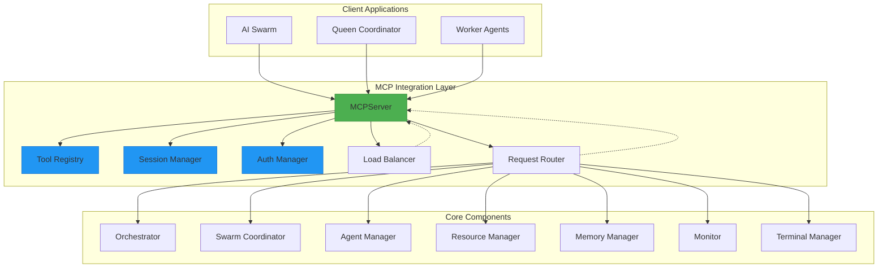

**Diagram sources**
- [server.ts](file://src/mcp/server.ts#L0-L100)
- [tools.ts](file://src/mcp/tools.ts#L0-L100)

**Section sources**
- [server.ts](file://src/mcp/server.ts#L0-L100)
- [tools.ts](file://src/mcp/tools.ts#L0-L100)

## Core Components

The MCP Integration Architecture consists of several core components that work together to provide a comprehensive integration solution:

- **MCPServer**: The central server implementation that handles incoming requests, manages sessions, and routes tool invocations
- **ToolRegistry**: A sophisticated registry that manages tool discovery, capability negotiation, and execution metrics
- **LifecycleManager**: Responsible for server lifecycle operations including start, stop, restart, and health monitoring
- **OrchestrationIntegration**: Manages connections and health checks for various system components
- **SessionManager**: Tracks active sessions, their state, and authentication status
- **AuthManager**: Handles authentication and authorization for tool access
- **LoadBalancer**: Provides rate limiting, circuit breaking, and request queuing capabilities

These components work together to create a resilient integration layer that can handle high volumes of tool invocations while maintaining system stability and security.

**Section sources**
- [server.ts](file://src/mcp/server.ts#L0-L100)
- [tools.ts](file://src/mcp/tools.ts#L0-L100)
- [lifecycle-manager.ts](file://src/mcp/lifecycle-manager.ts#L0-L100)

## MCP Server Implementation

The MCPServer class serves as the primary entry point for the integration layer, implementing the IMCPServer interface and providing the core functionality for handling tool invocations.

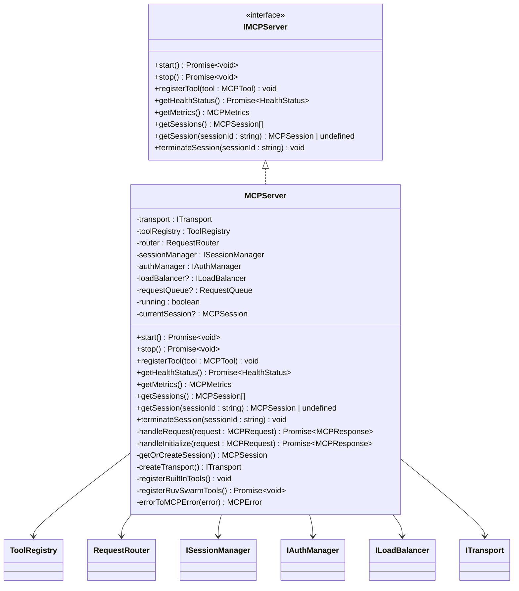

**Diagram sources**
- [server.ts](file://src/mcp/server.ts#L0-L100)

**Section sources**
- [server.ts](file://src/mcp/server.ts#L0-L100)

### Server Initialization and Configuration

The MCPServer is initialized with configuration parameters and references to core system components. During construction, it sets up the transport layer, tool registry, session manager, auth manager, and request router. The server supports multiple transport protocols (stdio and HTTP) and can be configured with load balancing capabilities.

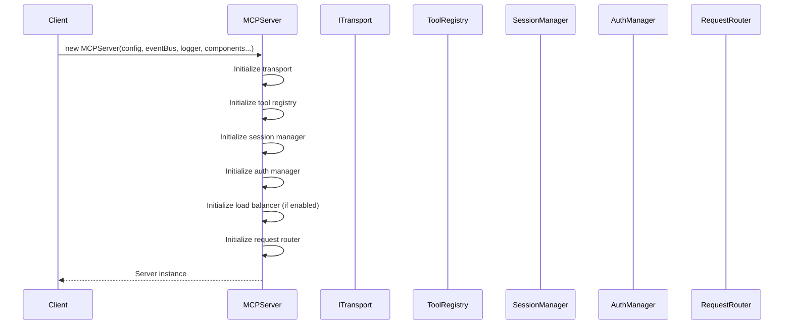

**Diagram sources**
- [server.ts](file://src/mcp/server.ts#L100-L200)

**Section sources**
- [server.ts](file://src/mcp/server.ts#L100-L200)

## Tool Integration and Registration

The ToolRegistry class provides a sophisticated mechanism for managing tools, their capabilities, and execution metrics. It implements capability negotiation, input validation, and comprehensive metrics tracking.

```mermaid
classDiagram
class ToolRegistry {
-tools : Map~string, MCPTool~
-capabilities : Map~string, ToolCapability~
-metrics : Map~string, ToolMetrics~
-categories : Set~string~
-tags : Set~string~
+register(tool : MCPTool, capability? : ToolCapability) void
+unregister(name : string) void
+getTool(name : string) MCPTool | undefined
+listTools() {name, description}[]
+getToolCount() number
+executeTool(name : string, input : unknown, context? : any) Promise~unknown~
-validateTool(tool : MCPTool) void
-validateInput(tool : MCPTool, input : unknown) void
-checkType(value : unknown, type : string) boolean
-registerCapability(toolName : string, capability : ToolCapability) void
-extractCategory(toolName : string) string
-extractTags(tool : MCPTool) string[]
-checkToolCapabilities(toolName : string, context? : any) Promise~void~
-isProtocolVersionCompatible(client : MCPProtocolVersion, supported : MCPProtocolVersion) boolean
-discoverTools(query : ToolDiscoveryQuery) {tool, capability}[]
}
class ToolCapability {
+name : string
+version : string
+description : string
+category : string
+tags : string[]
+requiredPermissions? : string[]
+supportedProtocolVersions : MCPProtocolVersion[]
+dependencies? : string[]
+deprecated? : boolean
+deprecationMessage? : string
}
class ToolMetrics {
+name : string
+totalInvocations : number
+successfulInvocations : number
+failedInvocations : number
+averageExecutionTime : number
+lastInvoked? : Date
+totalExecutionTime : number
}
class ToolDiscoveryQuery {
+category? : string
+tags? : string[]
+capabilities? : string[]
+protocolVersion? : MCPProtocolVersion
+includeDeprecated? : boolean
+permissions? : string[]
}
ToolRegistry --> ToolCapability
ToolRegistry --> ToolMetrics
ToolRegistry --> ToolDiscoveryQuery
```

**Diagram sources**
- [tools.ts](file://src/mcp/tools.ts#L0-L100)

**Section sources**
- [tools.ts](file://src/mcp/tools.ts#L0-L100)

### Tool Registration Process

The tool registration process involves several steps to ensure tools are properly integrated and secured:

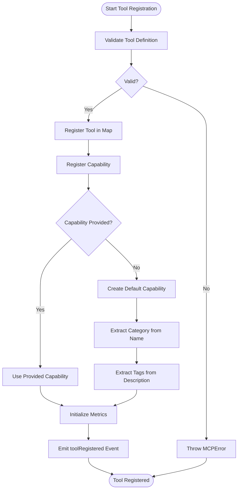

**Diagram sources**
- [tools.ts](file://src/mcp/tools.ts#L100-L200)

**Section sources**
- [tools.ts](file://src/mcp/tools.ts#L100-L200)

### Built-in and Specialized Tools

The MCPServer registers several built-in tools during initialization, including system information, health checks, and tool discovery capabilities. Additionally, it registers specialized tools based on available system components:

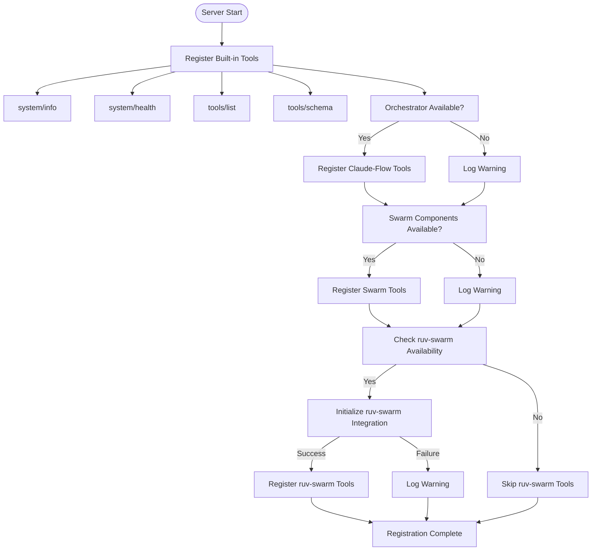

**Diagram sources**
- [server.ts](file://src/mcp/server.ts#L400-L600)

**Section sources**
- [server.ts](file://src/mcp/server.ts#L400-L600)

## Orchestration and Component Integration

The OrchestrationIntegration class manages connections and health monitoring for various system components, ensuring reliable communication between the MCP server and core services.

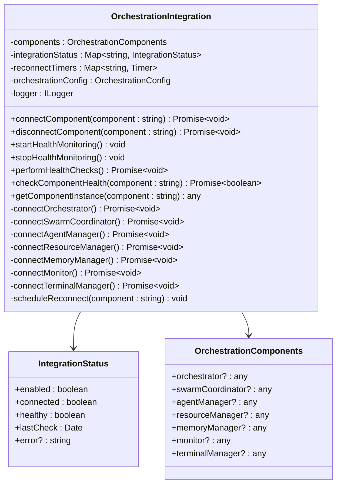

**Diagram sources**
- [orchestration-integration.ts](file://src/mcp/orchestration-integration.ts#L0-L100)

**Section sources**
- [orchestration-integration.ts](file://src/mcp/orchestration-integration.ts#L0-L100)

### Component Connection and Health Monitoring

The orchestration system implements a comprehensive health monitoring solution that automatically reconnects components when they become unavailable:

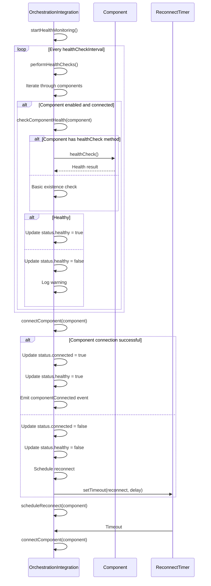

**Diagram sources**
- [orchestration-integration.ts](file://src/mcp/orchestration-integration.ts#L100-L300)

**Section sources**
- [orchestration-integration.ts](file://src/mcp/orchestration-integration.ts#L100-L300)

## Lifecycle Management

The MCPLifecycleManager class provides comprehensive control over the server lifecycle, including startup, shutdown, restart, and health monitoring operations.

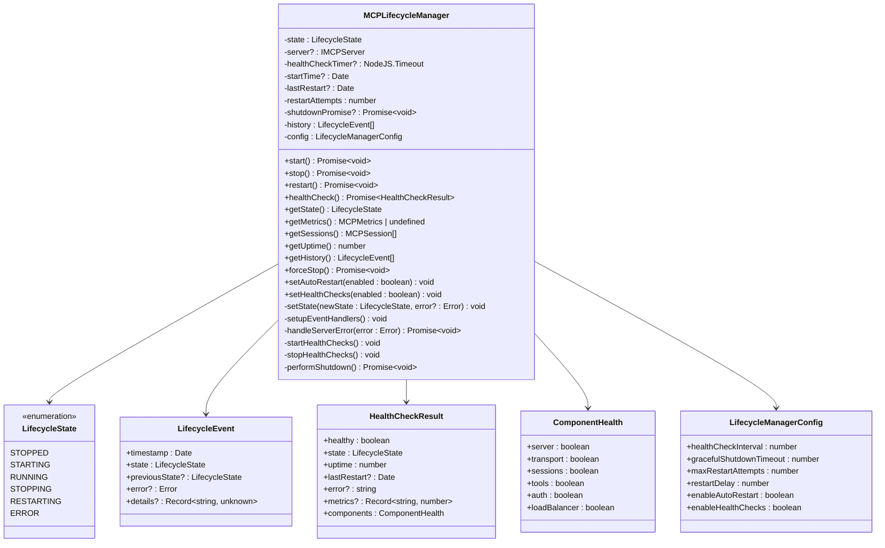

**Diagram sources**
- [lifecycle-manager.ts](file://src/mcp/lifecycle-manager.ts#L0-L100)

**Section sources**
- [lifecycle-manager.ts](file://src/mcp/lifecycle-manager.ts#L0-L100)

### State Transitions and Error Handling

The lifecycle manager implements a robust state machine with automatic recovery capabilities:

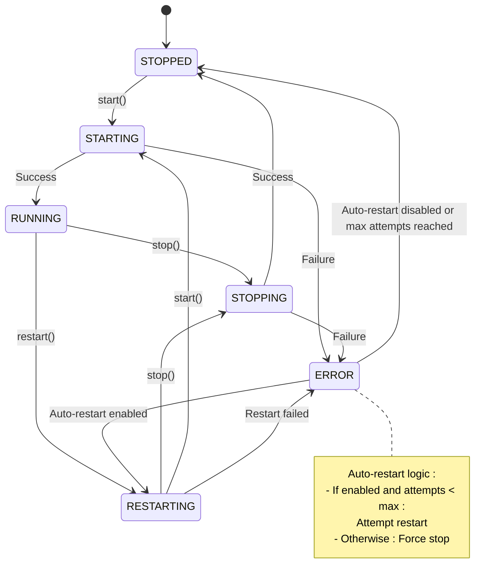

**Diagram sources**
- [lifecycle-manager.ts](file://src/mcp/lifecycle-manager.ts#L200-L400)

**Section sources**
- [lifecycle-manager.ts](file://src/mcp/lifecycle-manager.ts#L200-L400)

## Data Flow and Request Processing

The MCP server implements a sophisticated request processing pipeline that handles tool invocations, session management, and load balancing.

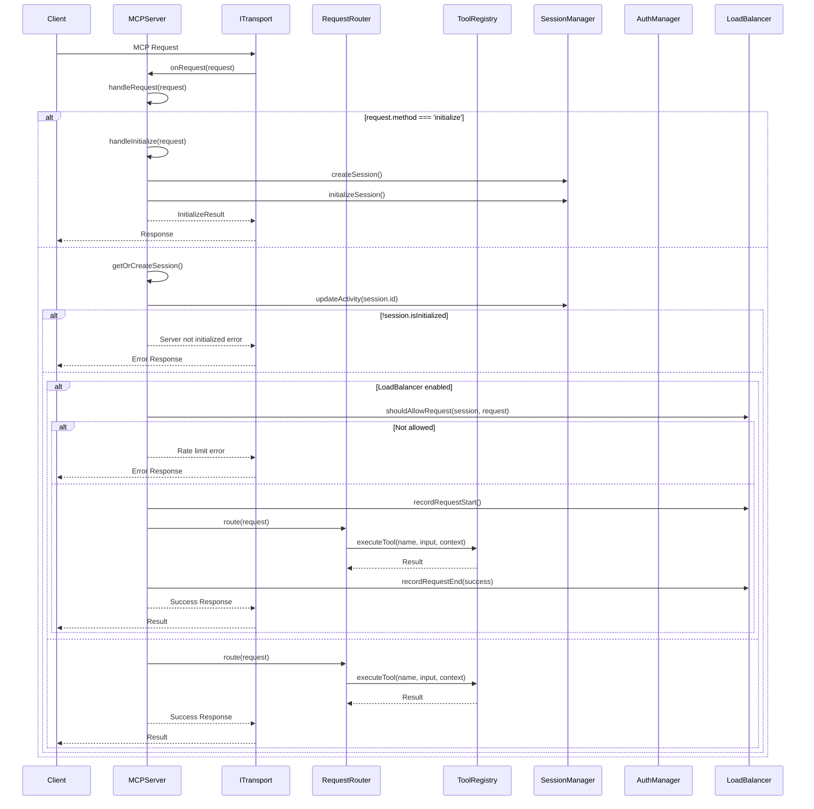

**Diagram sources**
- [server.ts](file://src/mcp/server.ts#L200-L400)

**Section sources**
- [server.ts](file://src/mcp/server.ts#L200-L400)

## Error Handling and Monitoring

The integration architecture implements comprehensive error handling and monitoring across all components.

### Error Handling Strategy

The system uses a layered error handling approach with specific error types and standardized responses:

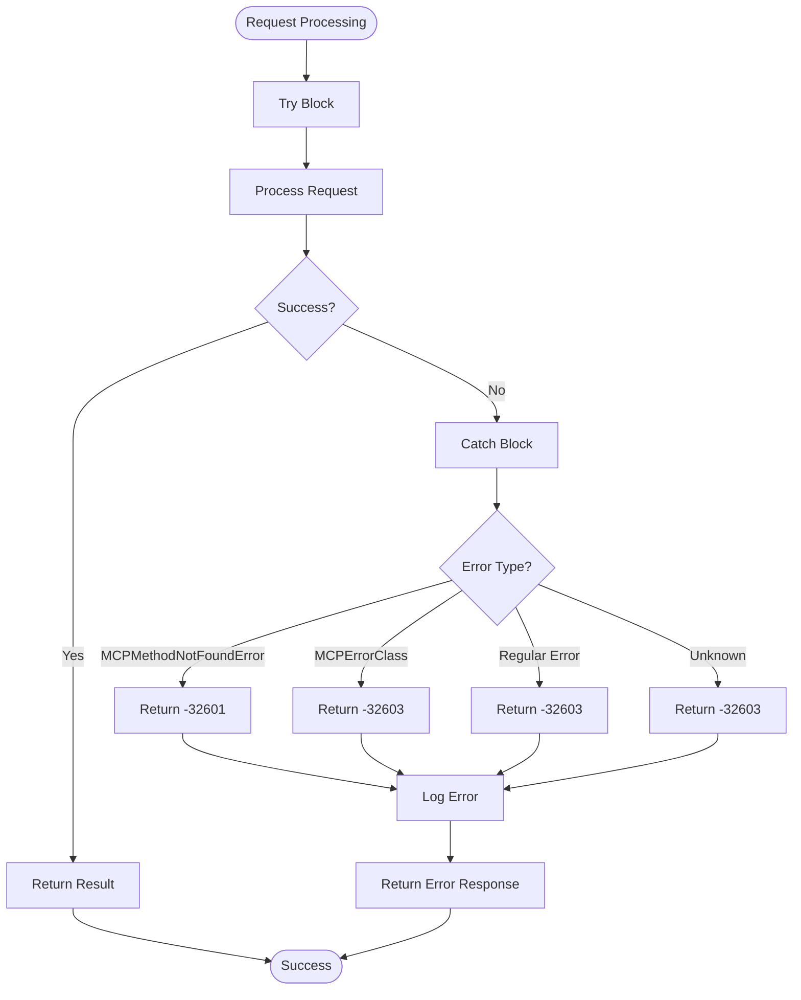

**Diagram sources**
- [server.ts](file://src/mcp/server.ts#L600-L647)

**Section sources**
- [server.ts](file://src/mcp/server.ts#L600-L647)

### Health Check Integration

The health monitoring system integrates with the lifecycle manager to provide automatic recovery:

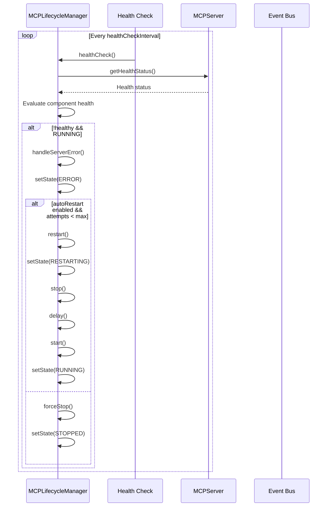

**Diagram sources**
- [lifecycle-manager.ts](file://src/mcp/lifecycle-manager.ts#L400-L463)

**Section sources**
- [lifecycle-manager.ts](file://src/mcp/lifecycle-manager.ts#L400-L463)

## Security and Authentication

The integration architecture implements several security measures to protect tool access and system integrity.

### Authentication Flow

The system uses token-based authentication with configurable security policies:

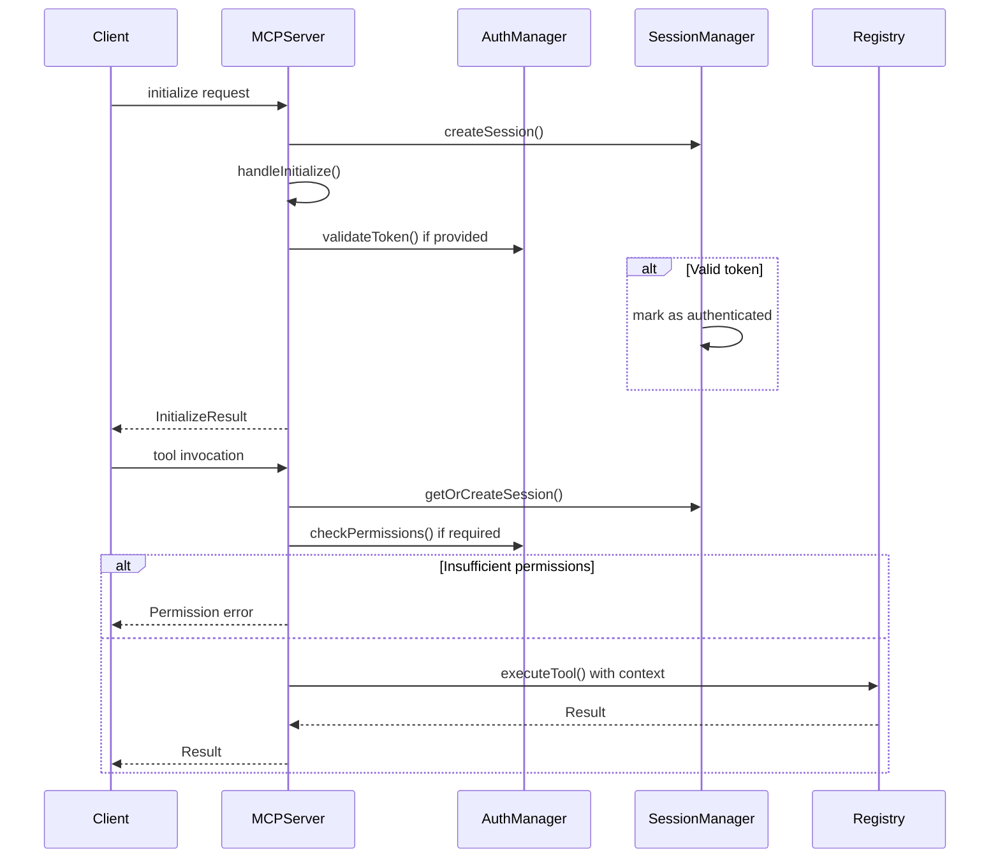

**Section sources**
- [server.ts](file://src/mcp/server.ts#L400-L600)
- [auth.js](file://src/mcp/auth.js#L0-L100)

## Performance and Scalability

The integration architecture includes several features designed to ensure high performance and scalability under load.

### Load Balancing and Rate Limiting

The system implements request queuing, rate limiting, and circuit breaking to prevent overload:

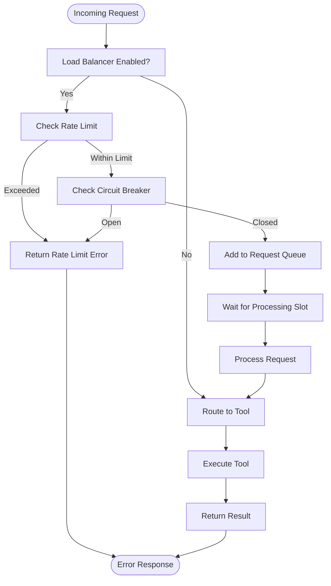

**Section sources**
- [server.ts](file://src/mcp/server.ts#L200-L400)
- [load-balancer.js](file://src/mcp/load-balancer.js#L0-L100)

### Performance Characteristics

The architecture is designed with the following performance considerations:

- **Low Latency**: Direct tool invocation with minimal overhead
- **High Throughput**: Asynchronous processing and non-blocking I/O
- **Resource Efficiency**: Connection pooling and object reuse
- **Scalability**: Horizontal scaling through multiple server instances
- **Resilience**: Circuit breaking and graceful degradation

The system metrics include comprehensive performance monitoring:
- Request processing times
- Tool execution durations
- Concurrent session counts
- Resource utilization
- Error rates by type

These metrics are exposed through the health check endpoint and can be integrated with external monitoring systems.

**Section sources**
- [server.ts](file://src/mcp/server.ts#L200-L400)
- [tools.ts](file://src/mcp/tools.ts#L200-L400)

## Conclusion

The MCP Integration Architecture in Claude-Flow provides a robust, scalable, and secure foundation for connecting AI agents with a wide array of tools and services. The architecture successfully balances flexibility with performance, security with accessibility, and complexity with maintainability.

Key architectural strengths include:
- **Modular Design**: Clear separation of concerns between components
- **Extensibility**: Easy integration of new tools and services
- **Resilience**: Comprehensive health monitoring and automatic recovery
- **Security**: Authentication, authorization, and capability negotiation
- **Performance**: Efficient request processing and load management

The integration layer effectively serves as the central nervous system for the AI swarm, enabling seamless communication between the Queen coordinator, specialized worker agents, and the 87+ MCP tools. The event-driven communication patterns and service-oriented architecture ensure loose coupling while maintaining high performance and reliability.

Future enhancements could include:
- Enhanced tool discovery with semantic search capabilities
- Dynamic scaling based on workload patterns
- Advanced analytics for tool usage and performance optimization
- Improved error recovery with machine learning-based prediction

The current implementation provides a solid foundation for building sophisticated AI-driven applications that can leverage diverse tool ecosystems effectively and securely.