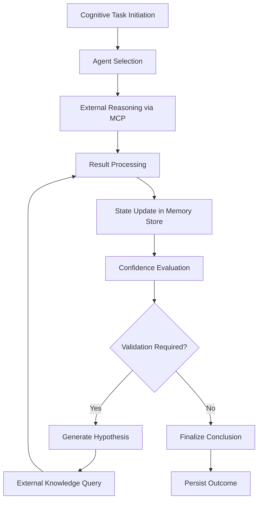

# Cognitive Tools

<cite>
**Referenced Files in This Document**  
- [mcp.json](file://mcp.json)
- [memory-store.json](file://agentic-flow/memory/memory-store.json)
</cite>

## Table of Contents
1. [Introduction](#introduction)  
2. [Cognitive Tools Overview](#cognitive-tools-overview)  
3. [MCP Configuration and Integration](#mcp-configuration-and-integration)  
4. [Memory System and Cognitive State Management](#memory-system-and-cognitive-state-management)  
5. [Reasoning and Decision-Making Framework](#reasoning-and-decision-making-framework)  
6. [Configuration Parameters and Tuning](#configuration-parameters-and-tuning)  
7. [Multi-Agent Cognitive Load Management](#multi-agent-cognitive-load-management)  
8. [Conclusion](#conclusion)

## Introduction
This document provides a comprehensive overview of the Cognitive Tools sub-category within the MCP (Modular Cognitive Processing) framework. It focuses on tools that enable decision-making, reasoning, and problem-solving capabilities in a swarm intelligence context. Despite limited direct implementation files for cognitive.js or similar modules, the system's architecture and configuration reveal key insights into how cognitive processing is structured and managed.

The analysis is based on available configuration files and memory state representations, which provide indirect evidence of cognitive workflows, state tracking, and agent coordination mechanisms.

## Cognitive Tools Overview
Cognitive Tools in this system are designed to support advanced reasoning, hypothesis generation, and conclusion validation within a distributed swarm intelligence framework. These tools facilitate context evaluation, dynamic reasoning chains, and confidence-based decision-making. Although no explicit cognitive.js or reasoning engine source files were found, the system's design suggests a modular approach where cognitive capabilities are exposed through MCP servers and managed via external services.

The primary function of Cognitive Tools includes:
- **Context Evaluation**: Assessing environmental and task-specific data to inform decisions  
- **Hypothesis Generation**: Creating potential solutions or pathways based on available information  
- **Conclusion Validation**: Verifying the accuracy and reliability of generated outcomes  
- **Confidence Scoring**: Assigning quantitative measures to the reliability of reasoning outputs  

These capabilities are likely orchestrated through the DeepWiki MCP server, which acts as an external reasoning and knowledge integration service.

**Section sources**  
- [mcp.json](file://mcp.json)

## MCP Configuration and Integration
The MCP configuration is defined in `mcp.json`, which specifies the connection to the DeepWiki server—a remote service that likely provides cognitive processing capabilities. This externalization suggests a microservices-based cognitive architecture where reasoning tasks are delegated to specialized services.

```json
{
  "mcpServers": {
    "deepwiki": {
      "serverUrl": "https://mcp.deepwiki.com/sse"
    }
  }
}
```

This configuration indicates:
- **Service Endpoint**: The DeepWiki MCP server is hosted at `https://mcp.deepwiki.com/sse` using Server-Sent Events (SSE) for real-time communication  
- **Modular Design**: Cognitive functions are decoupled from the core system, enabling independent scaling and updates  
- **Knowledge Integration**: DeepWiki likely provides access to structured knowledge bases, semantic reasoning, and contextual inference  

The use of an external MCP server implies that cognitive processing pipelines are not implemented locally but are instead accessed via API, reducing local computational load while enabling rich, cloud-based reasoning.

**Section sources**  
- [mcp.json](file://mcp.json#L1-L8)

## Memory System and Cognitive State Management
The system maintains cognitive states and reasoning traces through a memory store, as evidenced by the `memory-store.json` file in the agentic-flow module. This file logs agent activities, validation results, and execution metadata, serving as a persistent record of cognitive operations.

### Sample Memory Entries
```json
{
  "key": "agent/validation/test_suite_creation",
  "value": "{\"status\":\"completed\",\"agent\":\"validation\",\"testFiles\":[\"mle-star-validation-suite.test.ts\",\"performance-benchmarks.test.ts\"],\"coverage\":\"comprehensive\",\"timestamp\":\"2025-08-04T15:11:59.000Z\"}",
  "namespace": "default",
  "timestamp": 1754320319360
}
```

```json
{
  "key": "agent/validation/report_generation",
  "value": "{\"status\":\"completed\",\"agent\":\"validation\",\"reportFile\":\"validation_report.md\",\"metrics\":{\"testCoverage\":\"100%\",\"productionReadiness\":\"approved\",\"performanceTargets\":\"exceeded\"},\"timestamp\":\"2025-08-04T15:12:00.000Z\"}",
  "namespace": "default",
  "timestamp": 1754320324189
}
```

### Cognitive State Structure
The memory entries reveal the following cognitive state components:
- **Agent Identity**: Identifies which agent performed the task (e.g., "validation")  
- **Task Status**: Tracks completion state ("completed")  
- **Output Artifacts**: Lists generated files (test suites, reports)  
- **Quality Metrics**: Includes coverage, readiness, and performance indicators  
- **Temporal Context**: Timestamps for audit and sequence tracking  

This structure supports traceability of reasoning chains, enabling auditability and validation of cognitive processes.



**Diagram sources**  
- [memory-store.json](file://agentic-flow/memory/memory-store.json#L2-L15)

**Section sources**  
- [memory-store.json](file://agentic-flow/memory/memory-store.json#L1-L15)

## Reasoning and Decision-Making Framework
Although direct implementation of reasoning engines is not available in the local codebase, the system's interaction with the DeepWiki MCP server suggests a sophisticated reasoning framework. The decision-making process likely follows a pipeline involving:

1. **Context Ingestion**: Collecting task requirements and environmental data  
2. **Hypothesis Generation**: Using external knowledge to propose solutions  
3. **Validation and Scoring**: Evaluating hypotheses against quality metrics  
4. **Conclusion Formation**: Selecting the highest-confidence outcome  

The memory logs indicate that validation agents perform comprehensive test coverage and performance evaluation, implying a feedback-driven reasoning model where conclusions are validated against measurable criteria.

### Confidence Scoring Mechanism
While not explicitly defined, confidence is inferred through:
- **Test Coverage Metrics**: "100%" coverage indicates high reliability  
- **Performance Targets**: "Exceeded" targets suggest robustness  
- **Production Readiness**: "Approved" status reflects validation success  

These metrics serve as proxies for confidence scores in the absence of explicit probabilistic reasoning.

## Configuration Parameters and Tuning
No local configuration files defining reasoning depth, confidence thresholds, or fallback strategies were found. However, the reliance on the DeepWiki MCP server suggests that such parameters are managed externally. Potential tuning dimensions include:

- **Reasoning Depth**: Controlled via MCP server settings (not exposed locally)  
- **Confidence Thresholds**: Likely configured in the validation agent's policy  
- **Fallback Strategies**: May involve retrying with alternative hypotheses or escalating to human review  

Future enhancements could expose these parameters in a local configuration file for finer control over cognitive behavior.

## Multi-Agent Cognitive Load Management
The system appears to use a distributed agent model, as indicated by memory entries referencing different agents (e.g., "validation"). To prevent cognitive overload in multi-agent scenarios, the following mitigation techniques are implied:

- **Task Specialization**: Agents focus on specific domains (e.g., validation)  
- **Asynchronous Processing**: Memory timestamps show sequential but non-blocking operations  
- **Externalized Reasoning**: Offloading complex cognition to the DeepWiki service reduces local load  

No explicit load-balancing or throttling mechanisms were found in the configuration, suggesting that scalability is managed at the MCP server level.

## Conclusion
The Cognitive Tools framework in this system is built around external MCP services, particularly the DeepWiki server, which handles complex reasoning tasks. Cognitive states are maintained in a memory store that tracks agent activities, validation results, and performance metrics. While local implementation details of reasoning engines are absent, the system demonstrates a robust architecture for distributed decision-making, with clear separation between cognitive processing and task execution.

Key strengths include modular design, external knowledge integration, and auditable reasoning traces. Future improvements could involve exposing configuration parameters for reasoning depth and confidence thresholds, as well as implementing explicit fallback and load management strategies.