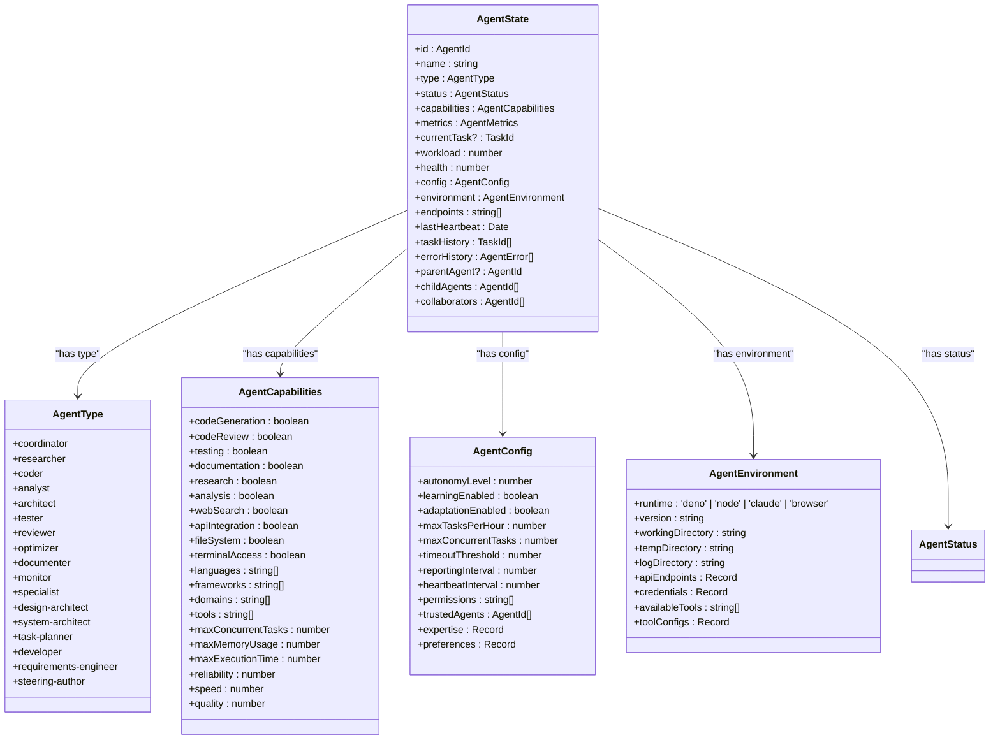
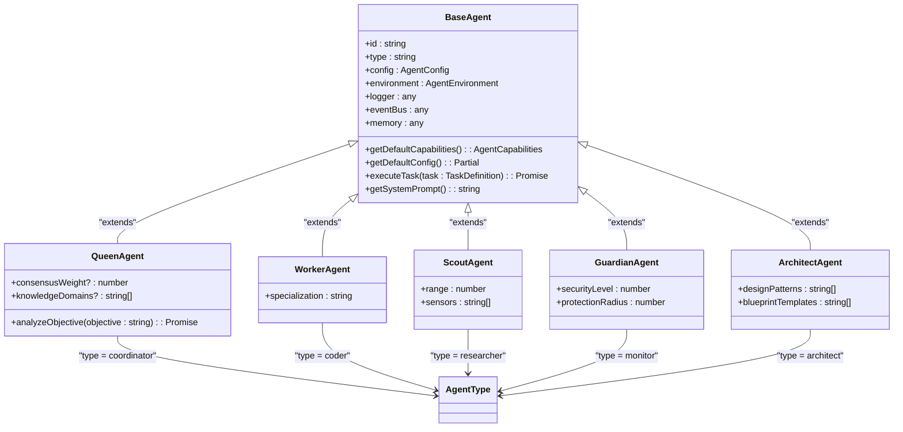
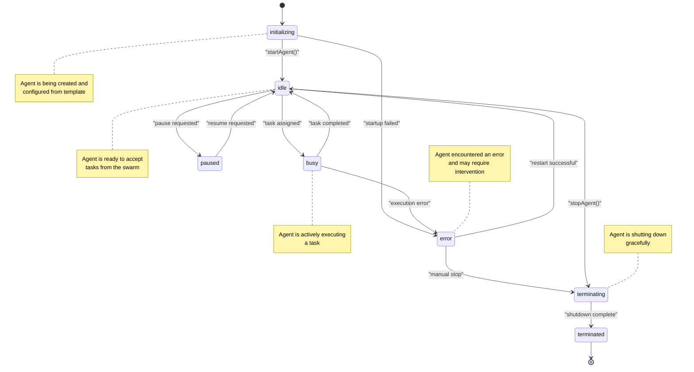
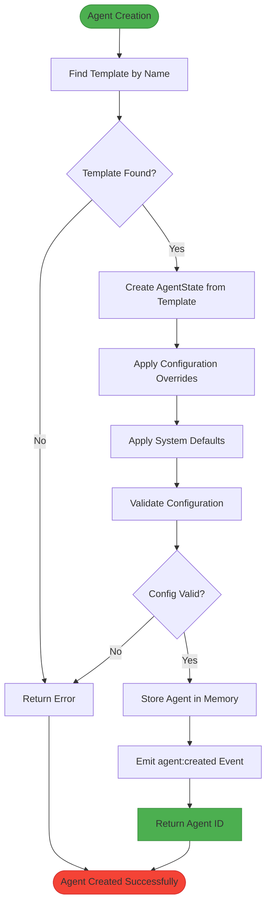
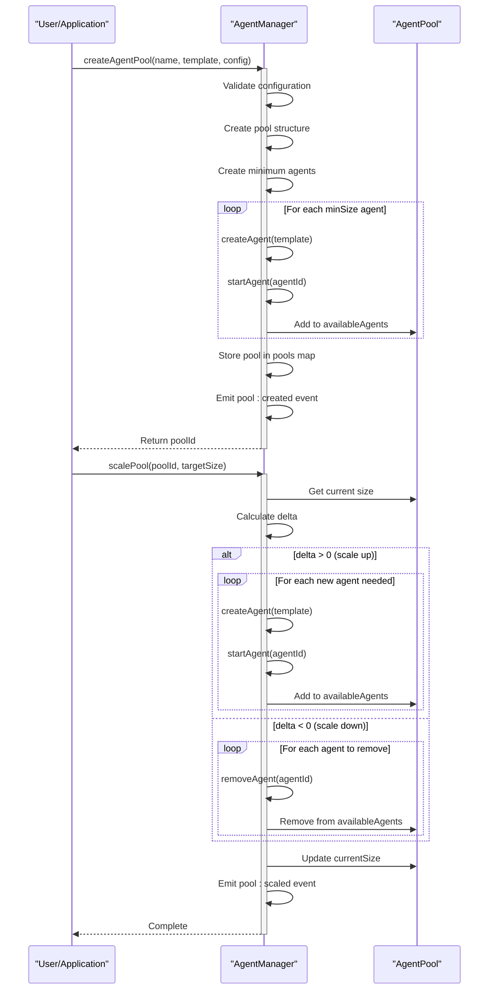
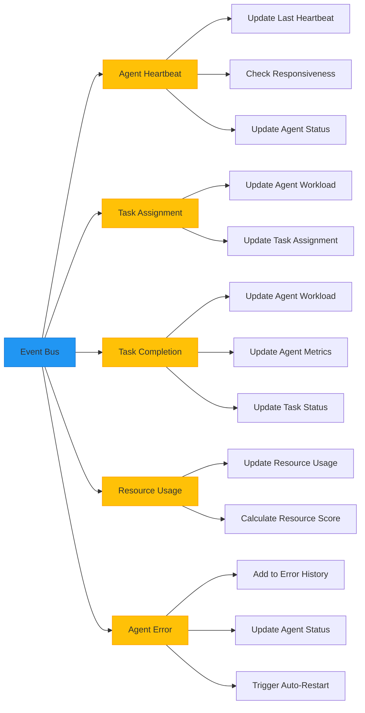
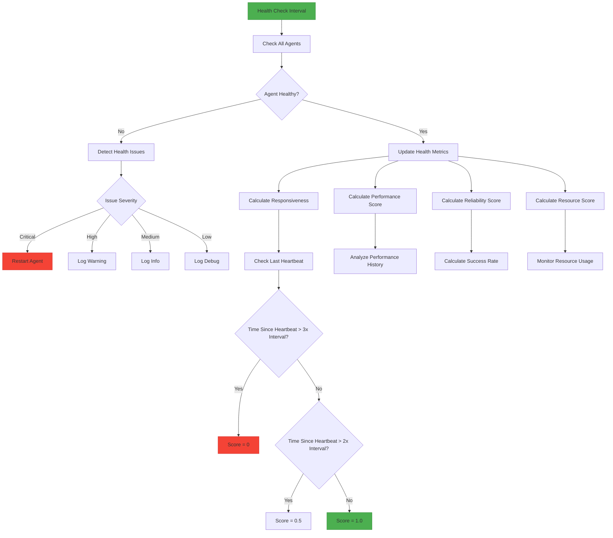
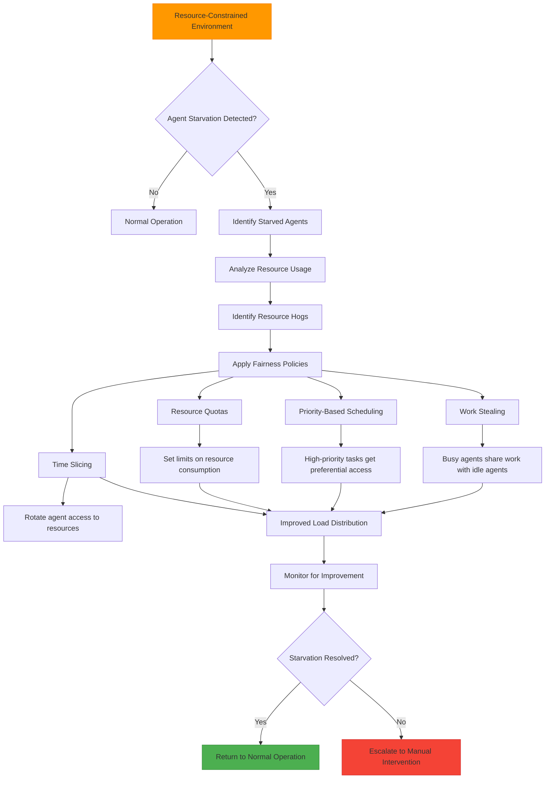

# Dynamic Agent Architecture (DAA) Tools

<cite>
**Referenced Files in This Document**   
- [agent-manager.ts](file://src/agents/agent-manager.ts)
- [types.ts](file://src/swarm/types.ts)
- [hive-agents.ts](file://src/cli/agents/hive-agents.ts)
</cite>

## Table of Contents
1. [Introduction](#introduction)
2. [Domain Model](#domain-model)
3. [Agent Lifecycle Management](#agent-lifecycle-management)
4. [Agent Specialization and Templates](#agent-specialization-and-templates)
5. [Dynamic Reconfiguration and Coordination](#dynamic-reconfiguration-and-coordination)
6. [Resource Management and Load Balancing](#resource-management-and-load-balancing)
7. [Implementation Examples](#implementation-examples)
8. [Troubleshooting and Optimization](#troubleshooting-and-optimization)

## Introduction
The Dynamic Agent Architecture (DAA) Tools provide a comprehensive framework for managing agent lifecycle, specialization, and coordination within a swarm intelligence system. This document details the implementation of agent creation, capability assignment, and dynamic reconfiguration as seen in the `agent-manager.ts` implementation. The system enables the instantiation of specialized agents such as researchers, coders, and analysts for specific tasks, with configurable templates, resource allocation, and specialization rules. The architecture supports capability-based access control and hot-swapping of agent implementations, making it suitable for both beginners and experienced developers.

**Section sources**
- [agent-manager.ts](file://src/agents/agent-manager.ts#L1-L50)
- [types.ts](file://src/swarm/types.ts#L1-L50)

## Domain Model

### Agent Types and Capabilities
The DAA system implements a rich domain model for agent types and capabilities. Agents are specialized entities with distinct roles and capabilities within the swarm intelligence system. The system defines multiple agent types, each with specific capabilities and responsibilities.



**Diagram sources**
- [types.ts](file://src/swarm/types.ts#L50-L200)

**Section sources**
- [types.ts](file://src/swarm/types.ts#L50-L200)

### Role Inheritance Hierarchy
The agent system implements a role inheritance hierarchy that allows for specialization and extension of capabilities. Base agent types provide fundamental capabilities, while specialized agents inherit and extend these capabilities for specific domains.



**Diagram sources**
- [hive-agents.ts](file://src/cli/agents/hive-agents.ts#L1-L100)

**Section sources**
- [hive-agents.ts](file://src/cli/agents/hive-agents.ts#L1-L100)

## Agent Lifecycle Management

### Agent Creation and Initialization
The AgentManager class provides comprehensive lifecycle management for agents within the swarm system. The creation process involves template-based instantiation with configurable overrides for specific requirements.

```mermaid
sequenceDiagram
participant User as "User/Application"
participant AgentManager as "AgentManager"
participant Memory as "DistributedMemorySystem"
participant EventBus as "EventBus"
User->>AgentManager : createAgent(templateName, overrides)
activate AgentManager
AgentManager->>AgentManager : Validate agent limit
AgentManager->>AgentManager : Find template by name
alt Template not found
AgentManager-->>User : Error : Template not found
deactivate AgentManager
else Template found
AgentManager->>AgentManager : Generate agent ID
AgentManager->>AgentManager : Create AgentState from template
AgentManager->>AgentManager : Apply configuration overrides
AgentManager->>Memory : Store agent state
AgentManager->>EventBus : Emit agent : created event
AgentManager-->>User : Return agentId
deactivate AgentManager
end
```

**Diagram sources**
- [agent-manager.ts](file://src/agents/agent-manager.ts#L300-L350)

**Section sources**
- [agent-manager.ts](file://src/agents/agent-manager.ts#L300-L350)

### Agent State Transitions
The agent lifecycle follows a well-defined state transition model, ensuring predictable behavior and proper resource management throughout the agent's existence.



**Diagram sources**
- [types.ts](file://src/swarm/types.ts#L100-L150)
- [agent-manager.ts](file://src/agents/agent-manager.ts#L500-L600)

**Section sources**
- [types.ts](file://src/swarm/types.ts#L100-L150)
- [agent-manager.ts](file://src/agents/agent-manager.ts#L500-L600)

## Agent Specialization and Templates

### Template-Based Agent Configuration
The DAA system uses templates to define standardized configurations for different agent types. These templates provide default capabilities, configurations, and environments that can be customized for specific use cases.



**Diagram sources**
- [agent-manager.ts](file://src/agents/agent-manager.ts#L300-L400)

**Section sources**
- [agent-manager.ts](file://src/agents/agent-manager.ts#L300-L400)

### Specialized Agent Templates
The system includes a comprehensive set of pre-configured templates for specialized agents, each optimized for specific roles within the swarm intelligence system.

```typescript
// Researcher Agent Template
{
  name: "Research Agent",
  type: "researcher",
  capabilities: {
    codeGeneration: false,
    codeReview: false,
    testing: false,
    documentation: true,
    research: true,
    analysis: true,
    webSearch: true,
    apiIntegration: true,
    fileSystem: true,
    terminalAccess: false,
    languages: [],
    frameworks: [],
    domains: ["research", "analysis", "information-gathering"],
    tools: ["web-search", "document-analysis", "data-extraction"],
    maxConcurrentTasks: 5,
    maxMemoryUsage: 256 * 1024 * 1024,
    maxExecutionTime: 600000,
    reliability: 0.9,
    speed: 0.8,
    quality: 0.9
  },
  config: {
    autonomyLevel: 0.8,
    learningEnabled: true,
    adaptationEnabled: true,
    maxTasksPerHour: 20,
    maxConcurrentTasks: 5,
    timeoutThreshold: 600000,
    reportingInterval: 30000,
    heartbeatInterval: 10000,
    permissions: ["web-access", "file-read"],
    trustedAgents: [],
    expertise: { research: 0.9, analysis: 0.8, documentation: 0.7 },
    preferences: { verbose: true, detailed: true }
  }
}

// Coder Agent Template
{
  name: "Developer Agent",
  type: "coder",
  capabilities: {
    codeGeneration: true,
    codeReview: true,
    testing: true,
    documentation: true,
    research: false,
    analysis: true,
    webSearch: false,
    apiIntegration: true,
    fileSystem: true,
    terminalAccess: true,
    languages: ["typescript", "javascript", "python", "rust"],
    frameworks: ["deno", "node", "react", "svelte"],
    domains: ["web-development", "backend", "api-design"],
    tools: ["git", "editor", "debugger", "linter", "formatter"],
    maxConcurrentTasks: 3,
    maxMemoryUsage: 512 * 1024 * 1024,
    maxExecutionTime: 1200000,
    reliability: 0.95,
    speed: 0.7,
    quality: 0.95
  },
  config: {
    autonomyLevel: 0.6,
    learningEnabled: true,
    adaptationEnabled: true,
    maxTasksPerHour: 10,
    maxConcurrentTasks: 3,
    timeoutThreshold: 1200000,
    reportingInterval: 60000,
    heartbeatInterval: 15000,
    permissions: ["file-read", "file-write", "terminal-access", "git-access"],
    trustedAgents: [],
    expertise: { coding: 0.95, testing: 0.8, debugging: 0.9 },
    preferences: { codeStyle: "functional", testFramework: "deno-test" }
  }
}
```

**Section sources**
- [agent-manager.ts](file://src/agents/agent-manager.ts#L150-L250)

## Dynamic Reconfiguration and Coordination

### Agent Pool Management
The DAA system supports dynamic agent pools that can be scaled based on workload requirements. This enables efficient resource utilization and load balancing across the swarm.



**Diagram sources**
- [agent-manager.ts](file://src/agents/agent-manager.ts#L800-L900)

**Section sources**
- [agent-manager.ts](file://src/agents/agent-manager.ts#L800-L900)

### Event-Driven Coordination
The system uses an event-driven architecture for agent coordination, enabling real-time communication and state synchronization across the swarm.



**Diagram sources**
- [agent-manager.ts](file://src/agents/agent-manager.ts#L100-L150)

**Section sources**
- [agent-manager.ts](file://src/agents/agent-manager.ts#L100-L150)

## Resource Management and Load Balancing

### Health Monitoring System
The DAA tools include a comprehensive health monitoring system that continuously evaluates agent performance and reliability.



**Diagram sources**
- [agent-manager.ts](file://src/agents/agent-manager.ts#L1000-L1200)

**Section sources**
- [agent-manager.ts](file://src/agents/agent-manager.ts#L1000-L1200)

### Load Balancing Strategies
The system implements multiple load balancing strategies to optimize agent utilization and prevent resource starvation.

```typescript
// Load balancing strategies available in the system
export type LoadBalancingStrategy =
  | 'work-stealing' // Agents steal work from busy agents
  | 'work-sharing' // Work is proactively shared
  | 'centralized' // Central dispatcher
  | 'distributed' // Distributed load balancing
  | 'predictive' // Predict and prevent overload
  | 'reactive'; // React to overload conditions

// Example of work-stealing implementation
class WorkStealingBalancer {
  private agentManager: AgentManager;
  
  constructor(agentManager: AgentManager) {
    this.agentManager = agentManager;
  }
  
  async balanceLoad(): Promise<void> {
    const busyAgents = this.agentManager.getAgentsByStatus('busy');
    const idleAgents = this.agentManager.getAgentsByStatus('idle');
    
    for (const busyAgent of busyAgents) {
      // Check if agent is overloaded
      if (busyAgent.workload > 0.8) {
        // Find idle agents with compatible capabilities
        const compatibleAgents = idleAgents.filter(agent => 
          this.hasCompatibleCapabilities(busyAgent, agent)
        );
        
        if (compatibleAgents.length > 0) {
          // Transfer some tasks to idle agents
          const tasksToSteal = this.selectTasksToSteal(busyAgent);
          const targetAgent = this.selectTargetAgent(compatibleAgents);
          
          await this.transferTasks(tasksToSteal, targetAgent);
        }
      }
    }
  }
  
  private hasCompatibleCapabilities(source: AgentState, target: AgentState): boolean {
    // Check if target agent has required capabilities for source agent's tasks
    return source.capabilities.languages.some(lang => 
      target.capabilities.languages.includes(lang)
    );
  }
  
  private selectTasksToSteal(agent: AgentState): TaskId[] {
    // Select longest-running tasks for stealing
    return agent.taskHistory
      .slice(-3) // Last 3 tasks
      .map(task => task.id);
  }
  
  private selectTargetAgent(agents: AgentState[]): AgentState {
    // Select agent with lowest current workload
    return agents.reduce((prev, current) => 
      prev.workload < current.workload ? prev : current
    );
  }
  
  private async transferTasks(tasks: TaskId[], targetAgent: AgentState): Promise<void> {
    // Reassign tasks to target agent
    for (const task of tasks) {
      await this.agentManager.reassignTask(task, targetAgent.id);
    }
  }
}
```

**Section sources**
- [types.ts](file://src/swarm/types.ts#L500-L550)
- [agent-manager.ts](file://src/agents/agent-manager.ts#L1000-L1200)

## Implementation Examples

### Creating Specialized Agents
The following example demonstrates how to create specialized agents using the DAA tools, based on the implementation in `hive-agents.ts`.

```typescript
// Example: Creating a Queen Agent (Orchestrator)
const queenAgent = new QueenAgent(
  "queen-001",
  {
    autonomyLevel: 0.8,
    learningEnabled: true,
    adaptationEnabled: true,
    maxTasksPerHour: 20,
    maxConcurrentTasks: 5,
    timeoutThreshold: 30000,
    reportingInterval: 5000,
    heartbeatInterval: 10000,
    permissions: ["orchestrate", "delegate", "consensus"],
    expertise: { orchestration: 0.95, coordination: 0.9, decisionMaking: 0.85 },
    preferences: { communicationStyle: "authoritative", decisionSpeed: "strategic" }
  },
  {
    runtime: "deno",
    version: "1.40.0",
    workingDirectory: "./agents/queen",
    tempDirectory: "./tmp/queen",
    logDirectory: "./logs/queen",
    apiEndpoints: {},
    credentials: {},
    availableTools: ["consensus-engine", "task-delegator"],
    toolConfigs: {}
  },
  logger,
  eventBus,
  memory
);

// Example: Creating a Worker Agent (Implementation)
const workerAgent = new WorkerAgent(
  "worker-001",
  {
    autonomyLevel: 0.7,
    learningEnabled: true,
    adaptationEnabled: true,
    maxTasksPerHour: 15,
    maxConcurrentTasks: 3,
    timeoutThreshold: 60000,
    reportingInterval: 10000,
    heartbeatInterval: 15000,
    permissions: ["code", "test", "debug", "build"],
    expertise: { implementation: 0.9, testing: 0.8, debugging: 0.85 },
    preferences: { codingStyle: "functional", testCoverage: "comprehensive" }
  },
  {
    runtime: "deno",
    version: "1.40.0",
    workingDirectory: "./agents/worker",
    tempDirectory: "./tmp/worker",
    logDirectory: "./logs/worker",
    apiEndpoints: {},
    credentials: {},
    availableTools: ["code-generator", "test-runner", "debugger"],
    toolConfigs: {}
  },
  logger,
  eventBus,
  memory,
  "fullstack" // Specialization
);

// Example: Using AgentManager to create agents from templates
const agentManager = new AgentManager(config, logger, eventBus, memory);

// Create a researcher agent from template
const researcherId = await agentManager.createAgent("researcher", {
  name: "Research Specialist",
  config: {
    expertise: { research: 0.95, analysis: 0.9 }
  }
});

// Create a coder agent from template
const coderId = await agentManager.createAgent("coder", {
  name: "Senior Developer",
  config: {
    expertise: { coding: 0.98, testing: 0.95 }
  }
});

// Create an analyst agent from template
const analystId = await agentManager.createAgent("analyst", {
  name: "Data Analyst",
  config: {
    expertise: { analysis: 0.95, visualization: 0.9 }
  }
});
```

**Section sources**
- [hive-agents.ts](file://src/cli/agents/hive-agents.ts#L100-L300)
- [agent-manager.ts](file://src/agents/agent-manager.ts#L300-L400)

### Configuration Options
The DAA system provides extensive configuration options for agent templates, resource allocation, and specialization rules.

```typescript
// Agent template configuration options
interface AgentTemplate {
  name: string; // Descriptive name for the template
  type: AgentType; // Agent type (researcher, coder, analyst, etc.)
  capabilities: AgentCapabilities; // Capabilities matrix
  config: Partial<AgentConfig>; // Configuration overrides
  environment: Partial<AgentEnvironment>; // Environment settings
  startupScript?: string; // Custom startup script
  dependencies?: string[]; // Required dependencies
}

// Resource allocation configuration
const resourceLimits = {
  memory: 512 * 1024 * 1024, // 512MB
  cpu: 1.0, // 1 CPU core
  disk: 1024 * 1024 * 1024, // 1GB
};

// Specialization rules configuration
const specializationRules = {
  // Domain-specific specializations
  domains: {
    research: {
      requiredCapabilities: ["research", "analysis", "webSearch"],
      preferredTools: ["web-search", "document-analysis"],
      resourceAllocation: {
        memory: 256 * 1024 * 1024,
        maxConcurrentTasks: 5,
      }
    },
    development: {
      requiredCapabilities: ["codeGeneration", "testing", "codeReview"],
      preferredTools: ["git", "editor", "debugger"],
      resourceAllocation: {
        memory: 512 * 1024 * 1024,
        maxConcurrentTasks: 3,
      }
    },
    analysis: {
      requiredCapabilities: ["analysis", "visualization", "statistical-analysis"],
      preferredTools: ["data-processor", "chart-generator"],
      resourceAllocation: {
        memory: 1024 * 1024 * 1024,
        maxConcurrentTasks: 4,
      }
    }
  },
  
  // Capability-based access control
  accessControl: {
    permissions: {
      "web-access": ["researcher", "analyst"],
      "file-write": ["coder", "documenter"],
      "terminal-access": ["coder", "tester"],
      "git-access": ["coder", "reviewer"],
    },
    
    capabilityInheritance: {
      "researcher": ["research", "analysis", "documentation"],
      "coder": ["codeGeneration", "testing", "codeReview"],
      "analyst": ["analysis", "visualization", "statistical-analysis"],
    }
  }
};

// Example: Creating a custom agent template
const customTemplate: AgentTemplate = {
  name: "Machine Learning Specialist",
  type: "analyst",
  capabilities: {
    codeGeneration: true,
    codeReview: true,
    testing: true,
    documentation: true,
    research: true,
    analysis: true,
    webSearch: true,
    apiIntegration: true,
    fileSystem: true,
    terminalAccess: true,
    languages: ["python", "r", "julia"],
    frameworks: ["tensorflow", "pytorch", "scikit-learn"],
    domains: ["machine-learning", "data-science", "ai-research"],
    tools: ["model-trainer", "data-processor", "visualization-tool"],
    maxConcurrentTasks: 2,
    maxMemoryUsage: 2048 * 1024 * 1024, // 2GB
    maxExecutionTime: 1800000, // 30 minutes
    reliability: 0.9,
    speed: 0.7,
    quality: 0.95,
  },
  config: {
    autonomyLevel: 0.75,
    learningEnabled: true,
    adaptationEnabled: true,
    maxTasksPerHour: 8,
    maxConcurrentTasks: 2,
    timeoutThreshold: 1800000,
    reportingInterval: 60000,
    heartbeatInterval: 15000,
    permissions: ["file-read", "file-write", "terminal-access", "gpu-access"],
    trustedAgents: [],
    expertise: { "machine-learning": 0.95, "data-science": 0.9, "ai-research": 0.85 },
    preferences: { modelType: "neural-network", optimization: "accuracy" },
  },
  environment: {
    runtime: "python",
    version: "3.9",
    workingDirectory: "./agents/ml-specialist",
    tempDirectory: "./tmp/ml-specialist",
    logDirectory: "./logs/ml-specialist",
    apiEndpoints: {
      "ml-api": "http://localhost:8080/api",
    },
    credentials: {
      "ml-api-key": "secret-key-123",
    },
    availableTools: ["model-trainer", "data-processor", "gpu-compute"],
    toolConfigs: {
      "gpu-compute": {
        "device": "cuda",
        "memory": "16GB",
      },
    },
  },
  startupScript: "./scripts/start-ml-specialist.py",
};

// Register the custom template with the agent manager
agentManager.templates.set("ml-specialist", customTemplate);
```

**Section sources**
- [agent-manager.ts](file://src/agents/agent-manager.ts#L150-L250)
- [types.ts](file://src/swarm/types.ts#L200-L400)

## Troubleshooting and Optimization

### Addressing Agent Starvation
Agent starvation can occur in resource-constrained environments when certain agents monopolize resources. The following strategies can mitigate this issue:



**Diagram sources**
- [agent-manager.ts](file://src/agents/agent-manager.ts#L1000-L1200)

**Section sources**
- [agent-manager.ts](file://src/agents/agent-manager.ts#L1000-L1200)

### Load Balancing Solutions
The DAA system provides multiple load balancing solutions to optimize agent utilization and prevent resource bottlenecks.

```typescript
// Implementation of different load balancing strategies

// Centralized Load Balancer
class CentralizedLoadBalancer {
  private agentManager: AgentManager;
  private taskQueue: TaskDefinition[] = [];
  
  constructor(agentManager: AgentManager) {
    this.agentManager = agentManager;
  }
  
  async assignTask(task: TaskDefinition): Promise<AgentId> {
    // Find the best agent for the task
    const suitableAgents = this.findSuitableAgents(task);
    
    if (suitableAgents.length === 0) {
      // No suitable agents, add to queue
      this.taskQueue.push(task);
      throw new Error("No suitable agents available");
    }
    
    // Select agent with lowest workload
    const selectedAgent = suitableAgents.reduce((prev, current) => 
      prev.workload < current.workload ? prev : current
    );
    
    // Assign task to agent
    await this.agentManager.assignTask(task.id, selectedAgent.id);
    
    return selectedAgent.id;
  }
  
  private findSuitableAgents(task: TaskDefinition): AgentState[] {
    return this.agentManager.getAllAgents().filter(agent => {
      // Check if agent has required capabilities
      const hasCapabilities = task.requirements.capabilities.every(cap => 
        agent.capabilities[cap as keyof AgentCapabilities]
      );
      
      // Check if agent has required permissions
      const hasPermissions = task.requirements.permissions.every(perm => 
        agent.config.permissions.includes(perm)
      );
      
      // Check if agent is available
      const isAvailable = agent.status === 'idle';
      
      return hasCapabilities && hasPermissions && isAvailable;
    });
  }
  
  // Process queued tasks when agents become available
  processQueue(): void {
    const availableAgents = this.agentManager.getAgentsByStatus('idle');
    
    if (availableAgents.length === 0 || this.taskQueue.length === 0) {
      return;
    }
    
    // Try to assign queued tasks
    const remainingTasks: TaskDefinition[] = [];
    
    for (const task of this.taskQueue) {
      try {
        this.assignTask(task);
      } catch (error) {
        // Task still can't be assigned, keep in queue
        remainingTasks.push(task);
      }
    }
    
    this.taskQueue = remainingTasks;
  }
}

// Work Stealing Load Balancer
class WorkStealingLoadBalancer {
  private agentManager: AgentManager;
  
  constructor(agentManager: AgentManager) {
    this.agentManager = agentManager;
  }
  
  async balanceLoad(): Promise<void> {
    const agents = this.agentManager.getAllAgents();
    
    // Identify overloaded and underloaded agents
    const overloadedAgents = agents.filter(a => a.workload > 0.8);
    const underloadedAgents = agents.filter(a => a.workload < 0.3);
    
    for (const overloadedAgent of overloadedAgents) {
      // Find compatible underloaded agents
      const compatibleAgents = underloadedAgents.filter(underloaded => 
        this.isCapabilityCompatible(overloadedAgent, underloaded)
      );
      
      if (compatibleAgents.length === 0) {
        continue;
      }
      
      // Select target agent with lowest workload
      const targetAgent = compatibleAgents.reduce((prev, current) => 
        prev.workload < current.workload ? prev : current
      );
      
      // Transfer some tasks
      await this.stealWork(overloadedAgent, targetAgent);
    }
  }
  
  private isCapabilityCompatible(source: AgentState, target: AgentState): boolean {
    // Check if target agent can handle source agent's tasks
    // This is a simplified check - in practice, this would be more complex
    return source.capabilities.languages.some(lang => 
      target.capabilities.languages.includes(lang)
    );
  }
  
  private async stealWork(source: AgentState, target: AgentState): Promise<void> {
    // Get tasks that can be transferred
    const transferableTasks = source.taskHistory.filter(task => 
      this.canTransferTask(task, target)
    ).slice(0, 2); // Transfer at most 2 tasks
    
    for (const task of transferableTasks) {
      await this.agentManager.reassignTask(task.id, target.id);
    }
  }
  
  private canTransferTask(task: TaskId, target: AgentState): boolean {
    // Check if target agent has required capabilities for the task
    // This would require access to task definition
    return true; // Simplified for example
  }
}

// Adaptive Load Balancer
class AdaptiveLoadBalancer {
  private agentManager: AgentManager;
  private performanceHistory: Map<string, number[]> = new Map();
  private strategy: 'centralized' | 'work-stealing' = 'centralized';
  
  constructor(agentManager: AgentManager) {
    this.agentManager = agentManager;
  }
  
  async assignTask(task: TaskDefinition): Promise<AgentId> {
    // Monitor system performance
    this.monitorPerformance();
    
    // Adapt strategy based on current conditions
    this.adaptStrategy();
    
    // Use appropriate load balancing strategy
    if (this.strategy === 'centralized') {
      const balancer = new CentralizedLoadBalancer(this.agentManager);
      return await balancer.assignTask(task);
    } else {
      const balancer = new WorkStealingLoadBalancer(this.agentManager);
      await balancer.balanceLoad();
      
      // Fall back to centralized assignment
      const centralBalancer = new CentralizedLoadBalancer(this.agentManager);
      return await centralBalancer.assignTask(task);
    }
  }
  
  private monitorPerformance(): void {
    const agents = this.agentManager.getAllAgents();
    
    for (const agent of agents) {
      const history = this.performanceHistory.get(agent.id.id) || [];
      history.push(agent.workload);
      
      // Keep last 10 measurements
      if (history.length > 10) {
        history.shift();
      }
      
      this.performanceHistory.set(agent.id.id, history);
    }
  }
  
  private adaptStrategy(): void {
    const agents = this.agentManager.getAllAgents();
    const averageWorkload = agents.reduce((sum, a) => sum + a.workload, 0) / agents.length;
    
    // Switch strategies based on workload distribution
    if (averageWorkload > 0.7) {
      // High overall workload - use work stealing to distribute load
      this.strategy = 'work-stealing';
    } else {
      // Lower workload - use centralized for better control
      this.strategy = 'centralized';
    }
  }
}
```

**Section sources**
- [agent-manager.ts](file://src/agents/agent-manager.ts#L1000-L1200)