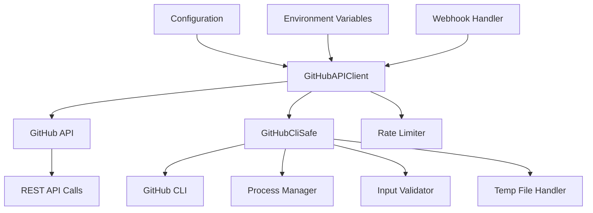
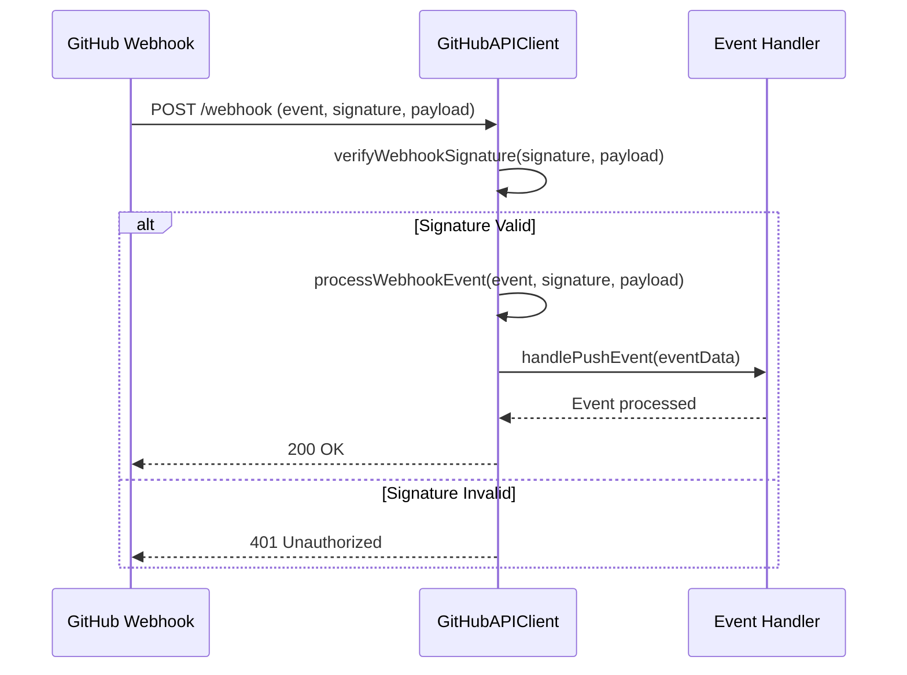
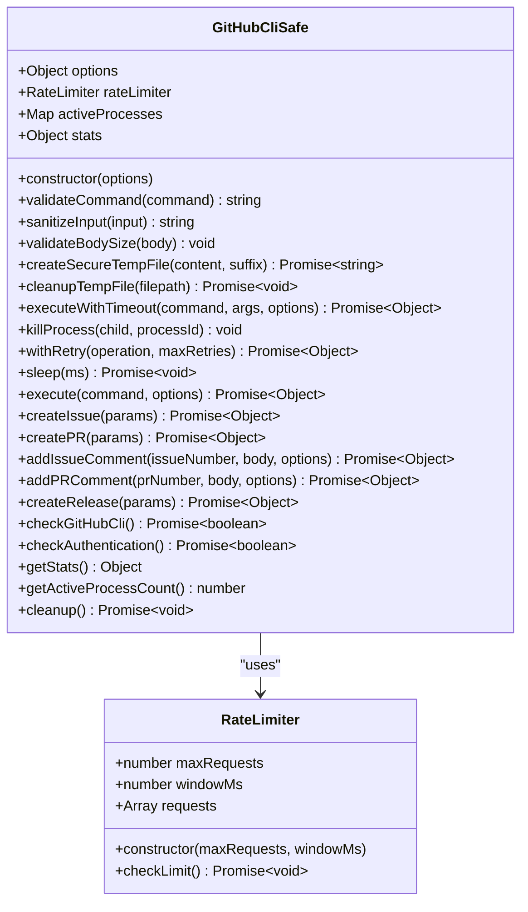
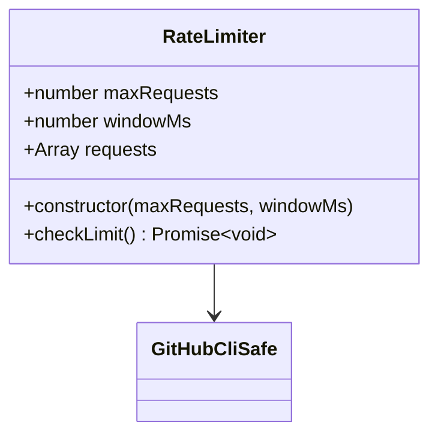

# GitHub Integration Tools

<cite>
**Referenced Files in This Document**   
- [github-api.js](file://src/cli/simple-commands/github/github-api.js)
- [github-cli-safety-wrapper.js](file://src/utils/github-cli-safety-wrapper.js)
- [config.js](file://src/cli/simple-commands/config.js)
</cite>

## Table of Contents
1. [Introduction](#introduction)
2. [Core Architecture](#core-architecture)
3. [GitHub API Client Implementation](#github-api-client-implementation)
4. [Authentication and Security](#authentication-and-security)
5. [Repository Operations](#repository-operations)
6. [Pull Request Management](#pull-request-management)
7. [Issue Tracking System](#issue-tracking-system)
8. [CI/CD Pipeline Integration](#cicd-pipeline-integration)
9. [Webhook Processing](#webhook-processing)
10. [GitHub CLI Safety Wrapper](#github-cli-safety-wrapper)
11. [Configuration Parameters](#configuration-parameters)
12. [Rate Limiting and Retry Strategies](#rate-limiting-and-retry-strategies)
13. [Usage Examples](#usage-examples)
14. [Troubleshooting Guide](#troubleshooting-guide)

## Introduction

The GitHub Integration Tools provide a comprehensive suite of utilities for seamless interaction with GitHub repositories, enabling automated code submission, pull request management, issue tracking, and CI/CD pipeline integration. This documentation details the implementation of the `github-api.js` module and its supporting components, focusing on the MCP tools that facilitate these interactions.

The integration system is built around a robust API client that handles authentication, rate limiting, and various GitHub operations through both direct API calls and secure CLI execution. The architecture emphasizes security, reliability, and ease of use, making it accessible to both beginners and advanced users.

**Section sources**
- [github-api.js](file://src/cli/simple-commands/github/github-api.js#L1-L50)

## Core Architecture

The GitHub integration system follows a layered architecture with clear separation of concerns between API operations, security handling, and utility functions. The core components work together to provide a reliable interface to GitHub services.



**Diagram sources**
- [github-api.js](file://src/cli/simple-commands/github/github-api.js#L1-L50)
- [github-cli-safety-wrapper.js](file://src/utils/github-cli-safety-wrapper.js#L1-L50)

**Section sources**
- [github-api.js](file://src/cli/simple-commands/github/github-api.js#L1-L100)

## GitHub API Client Implementation

The `GitHubAPIClient` class serves as the primary interface for all GitHub operations, providing methods for repository management, pull requests, issues, releases, workflows, and webhooks. The client handles authentication, rate limiting, and request processing with comprehensive error handling.

```mermaid
classDiagram
class GitHubAPIClient {
+string token
+number rateLimitRemaining
+Date rateLimitResetTime
+number lastRequestTime
+Array requestQueue
+boolean isProcessingQueue
+GitHubCliSafe cliSafe
+constructor(token)
+authenticate(token) Promise~boolean~
+checkRateLimit() Promise~void~
+updateRateLimitInfo(headers) void
+request(endpoint, options) Promise~Object~
+getRepository(owner, repo) Promise~Object~
+listRepositories(options) Promise~Object~
+createRepository(repoData) Promise~Object~
+listPullRequests(owner, repo, options) Promise~Object~
+createPullRequest(owner, repo, prData) Promise~Object~
+updatePullRequest(owner, repo, prNumber, prData) Promise~Object~
+mergePullRequest(owner, repo, prNumber, mergeData) Promise~Object~
+requestPullRequestReview(owner, repo, prNumber, reviewData) Promise~Object~
+listIssues(owner, repo, options) Promise~Object~
+createIssue(owner, repo, issueData) Promise~Object~
+updateIssue(owner, repo, issueNumber, issueData) Promise~Object~
+addIssueLabels(owner, repo, issueNumber, labels) Promise~Object~
+assignIssue(owner, repo, issueNumber, assignees) Promise~Object~
+listReactions(owner, repo, contentId, contentType) Promise~Object~
+addReaction(owner, repo, contentId, contentType, content) Promise~Object~
+listReleases(owner, repo, options) Promise~Object~
+createRelease(owner, repo, releaseData) Promise~Object~
+updateRelease(owner, repo, releaseId, releaseData) Promise~Object~
+deleteRelease(owner, repo, releaseId) Promise~Object~
+listWorkflows(owner, repo) Promise~Object~
+triggerWorkflow(owner, repo, workflowId, ref, inputs) Promise~Object~
+listWorkflowRuns(owner, repo, options) Promise~Object~
+listBranches(owner, repo) Promise~Object~
+createBranch(owner, repo, branchName, sha) Promise~Object~
+getBranchProtection(owner, repo, branch) Promise~Object~
+updateBranchProtection(owner, repo, branch, protection) Promise~Object~
+listWebhooks(owner, repo) Promise~Object~
+createWebhook(owner, repo, webhookData) Promise~Object~
+updateWebhook(owner, repo, hookId, webhookData) Promise~Object~
+deleteWebhook(owner, repo, hookId) Promise~Object~
+processWebhookEvent(event, signature, payload) Promise~Object~
+verifyWebhookSignature(signature, payload) boolean
+handlePushEvent(eventData) Promise~Object~
+handlePullRequestEvent(eventData) Promise~Object~
+handleIssuesEvent(eventData) Promise~Object~
+handleReleaseEvent(eventData) Promise~Object~
+handleWorkflowRunEvent(eventData) Promise~Object~
+sleep(ms) Promise~void~
+parseRepository(repoString) Object
+formatDate(dateString) string
+formatFileSize(bytes) string
+createIssueCLI(issueData) Promise~Object~
+createPullRequestCLI(prData) Promise~Object~
+addIssueCommentCLI(issueNumber, body) Promise~Object~
+addPRCommentCLI(prNumber, body) Promise~Object~
+createReleaseCLI(releaseData) Promise~Object~
+checkCLIStatus() Promise~boolean~
+getCLIStats() Object
+cleanupCLI() Promise~void~
}
class GitHubCliSafe {
+Object options
+RateLimiter rateLimiter
+Map activeProcesses
+Object stats
+constructor(options)
+validateCommand(command) string
+sanitizeInput(input) string
+validateBodySize(body) void
+createSecureTempFile(content, suffix) Promise~string~
+cleanupTempFile(filepath) Promise~void~
+executeWithTimeout(command, args, options) Promise~Object~
+killProcess(child, processId) void
+withRetry(operation, maxRetries) Promise~Object~
+sleep(ms) Promise~void~
+execute(command, options) Promise~Object~
+createIssue(params) Promise~Object~
+createPR(params) Promise~Object~
+addIssueComment(issueNumber, body, options) Promise~Object~
+addPRComment(prNumber, body, options) Promise~Object~
+createRelease(params) Promise~Object~
+checkGitHubCli() Promise~boolean~
+checkAuthentication() Promise~boolean~
+getStats() Object
+getActiveProcessCount() number
+cleanup() Promise~void~
}
GitHubAPIClient --> GitHubCliSafe : "uses"
```



**Diagram sources**
- [github-api.js](file://src/cli/simple-commands/github/github-api.js#L50-L100)
- [github-cli-safety-wrapper.js](file://src/utils/github-cli-safety-wrapper.js#L150-L200)

**Section sources**
- [github-api.js](file://src/cli/simple-commands/github/github-api.js#L50-L100)

## Authentication and Security

The GitHub integration system implements robust authentication and security measures to protect sensitive operations and data. Authentication is handled through personal access tokens, with support for both environment variables and direct token provision.

### Authentication Methods

The system supports multiple authentication methods, with the primary approach using the `GITHUB_TOKEN` environment variable. The `authenticate` method validates the token by making a request to the `/user` endpoint:

```javascript
async authenticate(token = null) {
    if (token) {
        this.token = token;
    }

    if (!this.token) {
        printError('GitHub token not found. Set GITHUB_TOKEN environment variable or provide token.');
        return false;
    }

    try {
        const response = await this.request('/user');
        if (response.success) {
            printSuccess(`Authenticated as ${response.data.login}`);
            return true;
        }
        return false;
    } catch (error) {
        printError(`Authentication failed: ${error.message}`);
        return false;
    }
}
```

### Webhook Security

Webhook security is implemented through signature verification using HMAC-SHA256. The system validates incoming webhook payloads against a secret key stored in the `GITHUB_WEBHOOK_SECRET` environment variable:

```javascript
verifyWebhookSignature(signature, payload) {
    if (!GITHUB_WEBHOOK_SECRET) {
        printWarning('GITHUB_WEBHOOK_SECRET not set. Skipping signature verification.');
        return true;
    }

    const crypto = require('crypto');
    const hmac = crypto.createHmac('sha256', GITHUB_WEBHOOK_SECRET);
    hmac.update(payload);
    const expectedSignature = `sha256=${hmac.digest('hex')}`;

    return crypto.timingSafeEqual(Buffer.from(signature), Buffer.from(expectedSignature));
}
```

The security implementation includes a fallback mechanism that allows webhook processing to continue if the secret is not configured, though this is not recommended for production environments.

**Section sources**
- [github-api.js](file://src/cli/simple-commands/github/github-api.js#L100-L150)
- [github-api.js](file://src/cli/simple-commands/github/github-api.js#L390-L400)

## Repository Operations

The GitHub integration tools provide comprehensive repository management capabilities, allowing users to create, retrieve, and list repositories through both API calls and CLI commands.

### Repository Creation

Repositories can be created programmatically using the `createRepository` method, which accepts repository configuration data:

```javascript
async createRepository(repoData) {
    return await this.request('/user/repos', {
        method: 'POST',
        body: repoData,
    });
}
```

The `repoData` object can include properties such as:
- **name**: Repository name
- **description**: Repository description
- **private**: Boolean indicating if repository is private
- **auto_init**: Boolean to initialize repository with README
- **gitignore_template**: Name of .gitignore template to use
- **license_template**: Name of license template to use

### Repository Retrieval

Existing repositories can be retrieved using the `getRepository` and `listRepositories` methods:

```javascript
async getRepository(owner, repo) {
    return await this.request(`/repos/${owner}/${repo}`);
}

async listRepositories(options = {}) {
    const params = new URLSearchParams({
        sort: options.sort || 'updated',
        direction: options.direction || 'desc',
        per_page: options.perPage || 30,
        page: options.page || 1,
    });

    return await this.request(`/user/repos?${params}`);
}
```

The `listRepositories` method supports filtering and pagination through the options parameter, allowing users to customize the results based on sort order, direction, and page size.

**Section sources**
- [github-api.js](file://src/cli/simple-commands/github/github-api.js#L150-L180)

## Pull Request Management

The pull request management system provides a complete set of tools for creating, updating, merging, and reviewing pull requests, with support for both API and CLI-based operations.

### Pull Request Creation

Pull requests can be created using the `createPullRequest` method:

```javascript
async createPullRequest(owner, repo, prData) {
    return await this.request(`/repos/${owner}/${repo}/pulls`, {
        method: 'POST',
        body: prData,
    });
}
```

The `prData` object should include:
- **title**: Pull request title
- **head**: Branch name to merge from
- **base**: Branch name to merge into (default: main)
- **body**: Pull request description
- **draft**: Boolean indicating if PR is a draft

### Pull Request CLI Alternative

For enhanced security, the system also provides a CLI-based method for creating pull requests:

```javascript
async createPullRequestCLI(prData) {
    try {
        const result = await this.cliSafe.createPR({
            title: prData.title,
            body: prData.body,
            base: prData.base || 'main',
            head: prData.head,
            draft: prData.draft || false
        });
        
        printSuccess(`PR created via CLI: ${prData.title}`);
        return { success: true, data: result };
    } catch (error) {
        printError(`Failed to create PR via CLI: ${error.message}`);
        return { success: false, error: error.message };
    }
}
```

This method uses the GitHub CLI safety wrapper to execute the `gh pr create` command with proper input validation and security measures.

### Pull Request Review and Merge

The system supports requesting reviews and merging pull requests:

```javascript
async requestPullRequestReview(owner, repo, prNumber, reviewData) {
    return await this.request(`/repos/${owner}/${repo}/pulls/${prNumber}/requested_reviewers`, {
        method: 'POST',
        body: reviewData,
    });
}

async mergePullRequest(owner, repo, prNumber, mergeData) {
    return await this.request(`/repos/${owner}/${repo}/pulls/${prNumber}/merge`, {
        method: 'PUT',
        body: mergeData,
    });
}
```

The `reviewData` object can specify users and teams to request reviews from, while `mergeData` can include merge strategy (merge, squash, or rebase) and commit message.

**Section sources**
- [github-api.js](file://src/cli/simple-commands/github/github-api.js#L180-L220)

## Issue Tracking System

The issue tracking system provides comprehensive tools for managing GitHub issues, including creation, updating, labeling, and assignment.

### Issue Creation and Management

Issues can be created and managed through the following methods:

```javascript
async createIssue(owner, repo, issueData) {
    return await this.request(`/repos/${owner}/${repo}/issues`, {
        method: 'POST',
        body: issueData,
    });
}

async updateIssue(owner, repo, issueNumber, issueData) {
    return await this.request(`/repos/${owner}/${repo}/issues/${issueNumber}`, {
        method: 'PATCH',
        body: issueData,
    });
}
```

The `issueData` object can include:
- **title**: Issue title
- **body**: Issue description
- **labels**: Array of label names
- **assignees**: Array of user logins to assign
- **milestone**: Milestone number
- **state**: Issue state (open or closed)

### Issue Labeling and Assignment

Issues can be labeled and assigned to specific users:

```javascript
async addIssueLabels(owner, repo, issueNumber, labels) {
    return await this.request(`/repos/${owner}/${repo}/issues/${issueNumber}/labels`, {
        method: 'POST',
        body: { labels },
    });
}

async assignIssue(owner, repo, issueNumber, assignees) {
    return await this.request(`/repos/${owner}/${repo}/issues/${issueNumber}/assignees`, {
        method: 'POST',
        body: { assignees },
    });
}
```

These methods allow for programmatic organization and delegation of issues within a repository.

**Section sources**
- [github-api.js](file://src/cli/simple-commands/github/github-api.js#L220-L250)

## CI/CD Pipeline Integration

The integration tools provide robust support for CI/CD pipeline operations, enabling workflow triggering, monitoring, and release management.

### Workflow Operations

The system can interact with GitHub Actions workflows:

```javascript
async listWorkflows(owner, repo) {
    return await this.request(`/repos/${owner}/${repo}/actions/workflows`);
}

async triggerWorkflow(owner, repo, workflowId, ref = 'main', inputs = {}) {
    return await this.request(
        `/repos/${owner}/${repo}/actions/workflows/${workflowId}/dispatches`,
        {
            method: 'POST',
            body: { ref, inputs },
        },
    );
}

async listWorkflowRuns(owner, repo, options = {}) {
    const params = new URLSearchParams({
        per_page: options.perPage || 30,
        page: options.page || 1,
    });

    if (options.status) {
        params.append('status', options.status);
    }

    return await this.request(`/repos/${owner}/${repo}/actions/runs?${params}`);
}
```

The `triggerWorkflow` method allows for programmatic execution of workflows with custom inputs, enabling integration with external systems and automated deployment processes.

### Release Management

The system supports comprehensive release management:

```javascript
async createRelease(owner, repo, releaseData) {
    return await this.request(`/repos/${owner}/${repo}/releases`, {
        method: 'POST',
        body: releaseData,
    });
}
```

The `releaseData` object can include:
- **tag_name**: Git tag for the release
- **name**: Release name
- **body**: Release description
- **prerelease**: Boolean indicating if release is a pre-release
- **draft**: Boolean indicating if release is a draft

**Section sources**
- [github-api.js](file://src/cli/simple-commands/github/github-api.js#L250-L300)

## Webhook Processing

The webhook processing system handles incoming GitHub webhook events with proper security validation and event routing.

### Event Processing Flow



**Diagram sources**
- [github-api.js](file://src/cli/simple-commands/github/github-api.js#L380-L400)

**Section sources**
- [github-api.js](file://src/cli/simple-commands/github/github-api.js#L380-L400)

### Event Handlers

The system supports multiple event types with dedicated handlers:

```javascript
async processWebhookEvent(event, signature, payload) {
    if (!this.verifyWebhookSignature(signature, payload)) {
        throw new Error('Invalid webhook signature');
    }

    const eventData = JSON.parse(payload);

    switch (event) {
        case 'push':
            return this.handlePushEvent(eventData);
        case 'pull_request':
            return this.handlePullRequestEvent(eventData);
        case 'issues':
            return this.handleIssuesEvent(eventData);
        case 'release':
            return this.handleReleaseEvent(eventData);
        case 'workflow_run':
            return this.handleWorkflowRunEvent(eventData);
        default:
            printInfo(`Unhandled event type: ${event}`);
            return { handled: false, event };
    }
}
```

Each event handler logs relevant information and returns structured data about the processed event, enabling integration with monitoring and notification systems.

**Section sources**
- [github-api.js](file://src/cli/simple-commands/github/github-api.js#L380-L400)

## GitHub CLI Safety Wrapper

The `GitHubCliSafe` class provides a secure wrapper around GitHub CLI commands, preventing injection attacks and ensuring reliable execution.

### Security Features

The safety wrapper implements multiple security measures:



**Diagram sources**
- [github-cli-safety-wrapper.js](file://src/utils/github-cli-safety-wrapper.js#L150-L200)

**Section sources**
- [github-cli-safety-wrapper.js](file://src/utils/github-cli-safety-wrapper.js#L150-L200)

### Input Validation

The wrapper validates commands and input to prevent injection attacks:

```javascript
validateCommand(command) {
    if (typeof command !== 'string' || !command.trim()) {
        throw new GitHubCliValidationError('Command must be a non-empty string', 'command', command);
    }

    const parts = command.trim().split(' ');
    const mainCommand = parts[0];
    
    if (!CONFIG.ALLOWED_COMMANDS.includes(mainCommand)) {
        throw new GitHubCliValidationError(
            `Command '${mainCommand}' is not allowed`, 
            'command', 
            mainCommand
        );
    }

    return command;
}

sanitizeInput(input) {
    if (typeof input !== 'string') {
        input = String(input);
    }

    // Check for dangerous patterns
    for (const pattern of CONFIG.DANGEROUS_PATTERNS) {
        if (pattern.test(input)) {
            throw new GitHubCliValidationError(
                `Input contains potentially dangerous pattern: ${pattern}`,
                'input',
                input
            );
        }
    }

    return input;
}
```

The validation system checks for command injection patterns such as command substitution, backtick execution, and command chaining.

### Process Management

The wrapper manages CLI processes with timeout protection and graceful cleanup:

```javascript
async executeWithTimeout(command, args, options = {}) {
    const timeout = Math.min(options.timeout || this.options.timeout, CONFIG.MAX_TIMEOUT);
    const processId = randomBytes(8).toString('hex');
    
    return new Promise((resolve, reject) => {
        const startTime = performance.now();
        
        const child = spawn('gh', args, {
            stdio: ['ignore', 'pipe', 'pipe'],
            shell: false, // Critical: prevent shell injection
            env: { ...process.env, ...options.env },
            cwd: options.cwd || process.cwd()
        });

        this.activeProcesses.set(processId, child);
        
        let stdout = '';
        let stderr = '';
        let isTimedOut = false;
        let isResolved = false;

        // Timeout handler
        const timer = setTimeout(() => {
            if (!isResolved) {
                isTimedOut = true;
                this.killProcess(child, processId);
                this.stats.timeoutRequests++;
                reject(new GitHubCliTimeoutError(timeout, `gh ${args.join(' ')}`));
            }
        }, timeout);
        
        // Process completion handler
        child.on('close', (code, signal) => {
            if (isResolved) return;
            
            isResolved = true;
            clearTimeout(timer);
            this.activeProcesses.delete(processId);
            
            const duration = performance.now() - startTime;
            
            if (isTimedOut) {
                return; // Already handled by timeout
            }

            if (signal === 'SIGKILL' || signal === 'SIGTERM') {
                reject(new GitHubCliError(
                    `Process terminated by signal ${signal}`,
                    'PROCESS_TERMINATED',
                    { signal, code, duration }
                ));
                return;
            }

            if (code !== 0) {
                this.stats.failedRequests++;
                reject(new GitHubCliError(
                    `Command failed with exit code ${code}: ${stderr || 'No error details'}`,
                    'COMMAND_FAILED',
                    { code, stderr, stdout, duration, command: `gh ${args.join(' ')}` }
                ));
                return;
            }

            this.stats.successfulRequests++;
            resolve({
                stdout: stdout.trim(),
                stderr: stderr.trim(),
                code,
                duration,
                command: `gh ${args.join(' ')}`,
                processId
            });
        });
    });
}
```

This implementation ensures that CLI processes cannot run indefinitely and are properly cleaned up even in error conditions.

**Section sources**
- [github-cli-safety-wrapper.js](file://src/utils/github-cli-safety-wrapper.js#L200-L300)

## Configuration Parameters

The GitHub integration system uses environment variables for configuration, with fallback to direct parameter passing.

### Authentication Configuration

The primary authentication parameters are:

- **GITHUB_TOKEN**: Personal access token for API authentication
- **GITHUB_WEBHOOK_SECRET**: Secret key for webhook signature verification

These values are accessed through environment variables:

```javascript
constructor(token = null) {
    this.token = token || process.env.GITHUB_TOKEN;
    // ...
}

const GITHUB_WEBHOOK_SECRET = process.env.GITHUB_WEBHOOK_SECRET;
```

### CLI Configuration

The GitHub CLI safety wrapper accepts configuration options:

```javascript
constructor(options = {}) {
    this.options = {
        timeout: options.timeout || CONFIG.DEFAULT_TIMEOUT,
        maxRetries: options.maxRetries || CONFIG.MAX_RETRIES,
        retryDelay: options.retryDelay || CONFIG.RETRY_BASE_DELAY,
        enableRateLimit: options.enableRateLimit !== false,
        enableLogging: options.enableLogging !== false,
        tempDir: options.tempDir || tmpdir(),
        ...options
    };
    // ...
}
```

Available configuration options include:
- **timeout**: Command timeout in milliseconds (default: 30,000)
- **maxRetries**: Maximum number of retry attempts (default: 3)
- **retryDelay**: Base delay for exponential backoff (default: 1,000ms)
- **enableRateLimit**: Enable rate limiting (default: true)
- **enableLogging**: Enable logging (default: false)
- **tempDir**: Directory for temporary files (default: OS temp directory)

**Section sources**
- [github-api.js](file://src/cli/simple-commands/github/github-api.js#L14-L18)
- [github-cli-safety-wrapper.js](file://src/utils/github-cli-safety-wrapper.js#L150-L180)

## Rate Limiting and Retry Strategies

The system implements comprehensive rate limiting and retry strategies to handle API constraints and transient failures.

### API Rate Limiting

The GitHub API client manages rate limits by tracking remaining requests and reset times:

```javascript
async checkRateLimit() {
    if (this.rateLimitRemaining <= 1) {
        const resetTime = new Date(this.rateLimitResetTime);
        const now = new Date();
        const waitTime = resetTime.getTime() - now.getTime();

        if (waitTime > 0) {
            printWarning(`Rate limit exceeded. Waiting ${Math.ceil(waitTime / 1000)}s...`);
            await this.sleep(waitTime);
        }
    }
}

updateRateLimitInfo(headers) {
    this.rateLimitRemaining = parseInt(headers['x-ratelimit-remaining'] || '0');
    this.rateLimitResetTime = new Date((parseInt(headers['x-ratelimit-reset']) || 0) * 1000);
}
```

The system automatically waits when the rate limit is exhausted, preventing API errors.

### CLI Rate Limiting

The GitHub CLI safety wrapper implements its own rate limiting to prevent abuse:



**Diagram sources**
- [github-cli-safety-wrapper.js](file://src/utils/github-cli-safety-wrapper.js#L100-L120)

**Section sources**
- [github-cli-safety-wrapper.js](file://src/utils/github-cli-safety-wrapper.js#L100-L120)

The rate limiter allows up to 50 requests per minute by default, preventing excessive API usage.

### Retry Strategy with Exponential Backoff

The system implements retry logic with exponential backoff for transient failures:

```javascript
async withRetry(operation, maxRetries = this.options.maxRetries) {
    let lastError;
    
    for (let attempt = 0; attempt <= maxRetries; attempt++) {
        try {
            if (attempt > 0) {
                this.stats.retriedRequests++;
                const delay = this.options.retryDelay * Math.pow(2, attempt - 1);
                await this.sleep(delay);
            }
            
            return await operation();
        } catch (error) {
            lastError = error;
            
            // Don't retry on validation errors or rate limits
            if (error instanceof GitHubCliValidationError || 
                error instanceof GitHubCliRateLimitError) {
                throw error;
            }
            
            if (attempt === maxRetries) {
                break;
            }
            
            if (this.options.enableLogging) {
                console.warn(`Attempt ${attempt + 1} failed, retrying:`, error.message);
            }
        }
    }
    
    throw lastError;
}
```

The retry strategy uses exponential backoff, doubling the delay between attempts (1s, 2s, 4s, etc.), which helps prevent overwhelming the API during periods of high load.

**Section sources**
- [github-api.js](file://src/cli/simple-commands/github/github-api.js#L120-L150)
- [github-cli-safety-wrapper.js](file://src/utils/github-cli-safety-wrapper.js#L300-L350)

## Usage Examples

### Basic Pull Request Creation

Here's a step-by-step example of creating a pull request using the GitHub API client:

```javascript
import { githubAPI } from './github-api.js';

// Initialize the GitHub API client
const client = githubAPI;

// Authenticate with GitHub
const authenticated = await client.authenticate();
if (!authenticated) {
    console.error('Authentication failed');
    process.exit(1);
}

// Create a pull request
const prData = {
    title: 'Add new feature',
    head: 'feature/new-feature',
    base: 'main',
    body: 'This PR adds a new feature to improve user experience.\n\n## Changes\n- Added new component\n- Updated documentation\n- Fixed related bugs'
};

const result = await client.createPullRequest('organization', 'repository', prData);

if (result.success) {
    console.log(`Pull request created: ${result.data.html_url}`);
} else {
    console.error(`Failed to create pull request: ${result.error}`);
}
```

### Automated Issue Creation

Creating issues programmatically for bug tracking:

```javascript
// Create an issue for a bug report
const issueData = {
    title: 'Fix login authentication error',
    body: `## Description\nUsers are unable to log in when using special characters in passwords.\n\n## Steps to Reproduce\n1. Enter email and password with special characters\n2. Click login\n3. Error message appears\n\n## Expected Behavior\nUser should be able to log in successfully`,
    labels: ['bug', 'high-priority'],
    assignees: ['developer1', 'developer2']
};

const result = await client.createIssue('organization', 'repository', issueData);

if (result.success) {
    console.log(`Issue created: ${result.data.html_url}`);
} else {
    console.error(`Failed to create issue: ${result.error}`);
}
```

### CI/CD Pipeline Integration

Triggering a workflow for deployment:

```javascript
// Trigger a deployment workflow
const workflowResult = await client.triggerWorkflow(
    'organization', 
    'repository', 
    'deploy.yml', 
    'main', 
    {
        environment: 'production',
        version: '1.2.3'
    }
);

if (workflowResult.success) {
    console.log('Deployment workflow triggered successfully');
} else {
    console.error(`Failed to trigger workflow: ${workflowResult.error}`);
}
```

### Webhook Event Processing

Setting up a webhook handler for automated responses:

```javascript
// Express.js webhook endpoint
app.post('/webhook', async (req, res) => {
    const event = req.headers['x-github-event'];
    const signature = req.headers['x-hub-signature-256'];
    const payload = req.body;
    
    try {
        // Process the webhook event
        const result = await client.processWebhookEvent(event, signature, JSON.stringify(payload));
        
        if (result.handled) {
            res.status(200).json({ status: 'success', event: result.event });
        } else {
            res.status(200).json({ status: 'ignored', event: result.event });
        }
    } catch (error) {
        console.error('Webhook processing error:', error);
        res.status(401).json({ status: 'error', message: 'Invalid signature' });
    }
});
```

**Section sources**
- [github-api.js](file://src/cli/simple-commands/github/github-api.js#L180-L220)
- [github-api.js](file://src/cli/simple-commands/github/github-api.js#L220-L250)

## Troubleshooting Guide

### Common Issues and Solutions

#### Authentication Failed

**Symptom**: "GitHub token not found" error message

**Solution**: Ensure the `GITHUB_TOKEN` environment variable is set:
```bash
export GITHUB_TOKEN=your_personal_access_token
```

Or pass the token directly to the authenticate method:
```javascript
await client.authenticate('your_personal_access_token');
```

#### Rate Limit Exceeded

**Symptom**: "Rate limit exceeded" warning with long wait times

**Solution**: Implement proper rate limiting in your application or use the built-in rate limiting. For high-volume applications, consider using GitHub App authentication which has higher rate limits.

#### Webhook Signature Verification Failed

**Symptom**: "Invalid webhook signature" error

**Solution**: Ensure the `GITHUB_WEBHOOK_SECRET` environment variable matches the secret configured in your GitHub repository settings.

#### GitHub CLI Not Found

**Symptom**: "GitHub CLI is not installed or not in PATH" warning

**Solution**: Install the GitHub CLI:
```bash
# macOS
brew install gh

# Windows
winget install GitHub.cli

# Linux
curl -fsSL https://cli.github.com/packages/githubcli-archive-keyring.gpg | sudo gpg --dearmor -o /usr/share/keyrings/githubcli-archive-keyring.gpg
echo "deb [arch=$(dpkg --print-architecture) signed-by=/usr/share/keyrings/githubcli-archive-keyring.gpg] https://cli.github.com/packages stable main" | sudo tee /etc/apt/sources.list.d/github-cli.list > /dev/null
sudo apt update
sudo apt install gh
```

Then authenticate:
```bash
gh auth login
```

### Debugging Tips

1. **Enable verbose logging** by setting environment variables:
```bash
export DEBUG_GITHUB_API=1
export DEBUG_GITHUB_CLI=1
```

2. **Check API rate limit status**:
```javascript
console.log('Rate limit remaining:', client.rateLimitRemaining);
console.log('Rate limit reset time:', client.rateLimitResetTime);
```

3. **Test GitHub CLI availability**:
```javascript
const cliReady = await client.checkCLIStatus();
if (cliReady) {
    console.log('GitHub CLI is ready');
    console.log('CLI Stats:', client.getCLIStats());
}
```

4. **Validate configuration**:
```javascript
// Check if required environment variables are set
if (!process.env.GITHUB_TOKEN) {
    console.error('GITHUB_TOKEN environment variable is not set');
}
```

**Section sources**
- [github-api.js](file://src/cli/simple-commands/github/github-api.js#L40-L50)
- [github-api.js](file://src/cli/simple-commands/github/github-api.js#L390-L400)
- [github-cli-safety-wrapper.js](file://src/utils/github-cli-safety-wrapper.js#L500-L550)