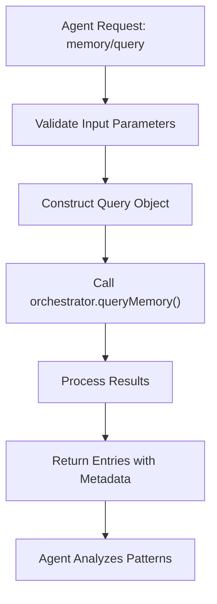
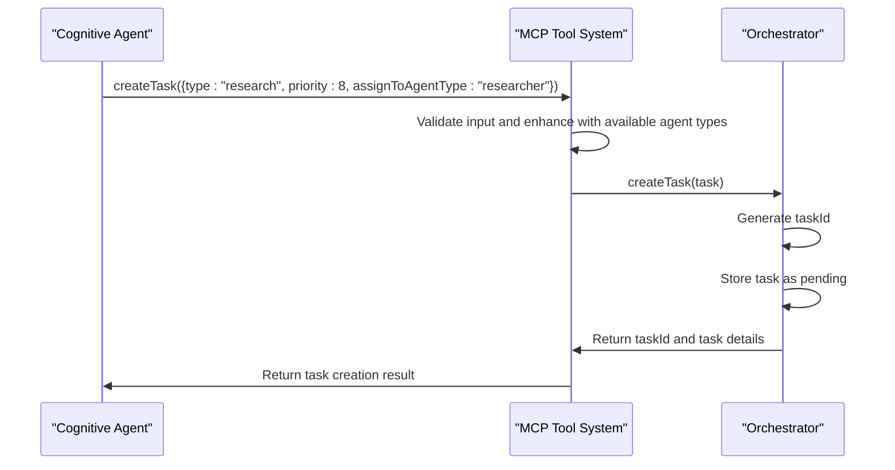
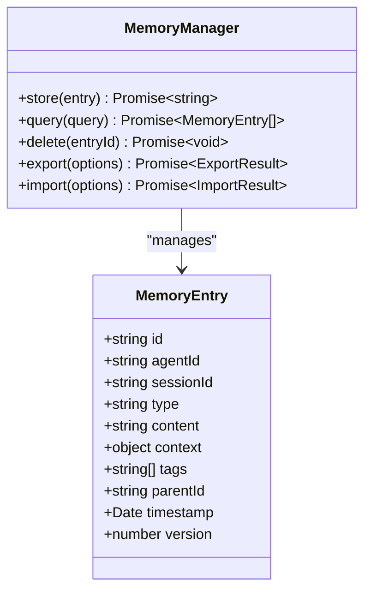
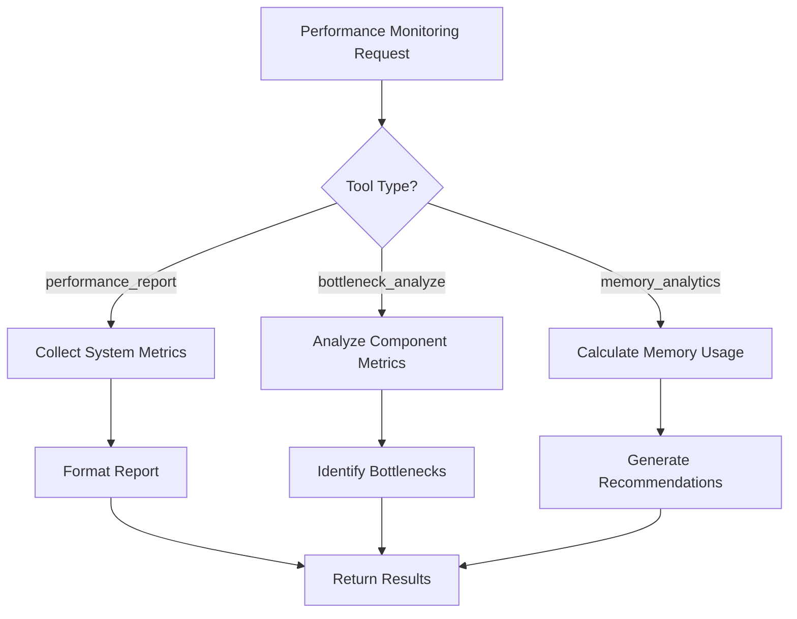
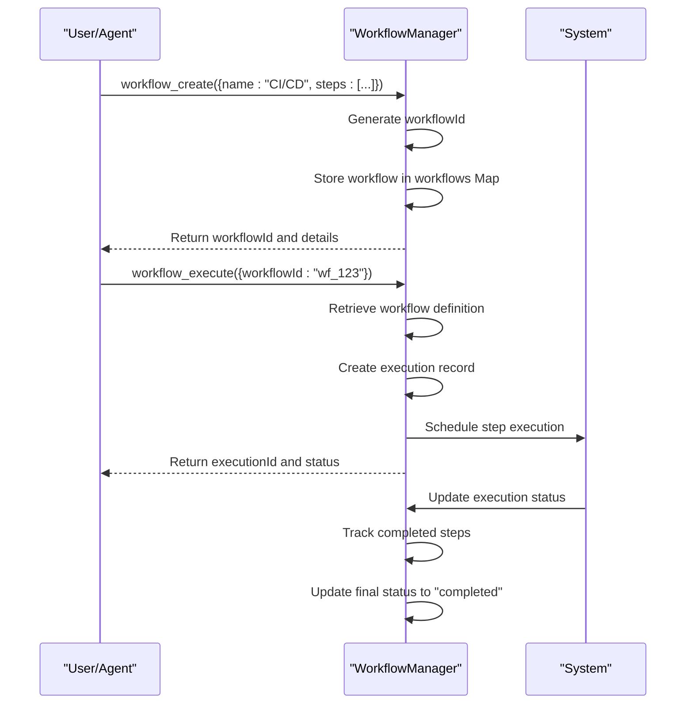
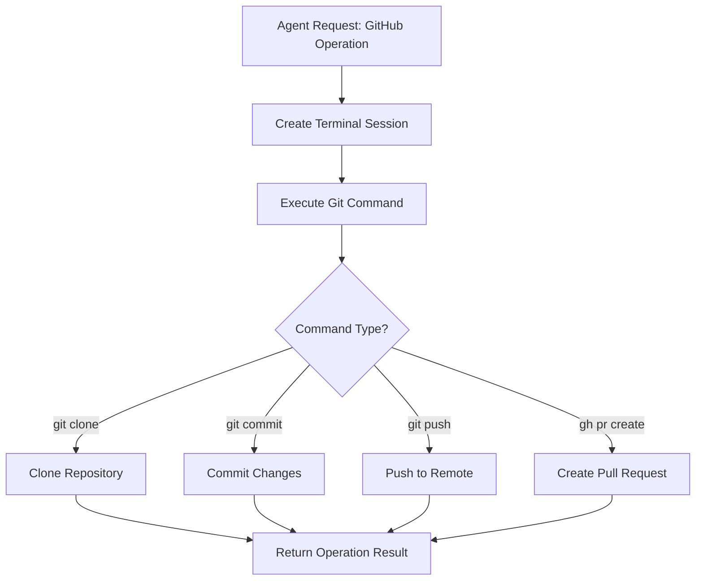
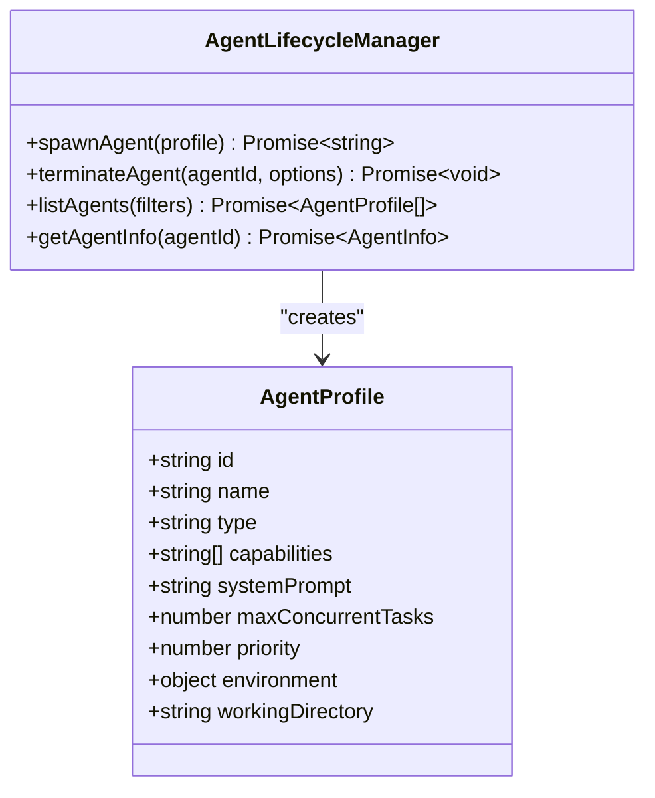

# MCP Tools Categories

<cite>
**Referenced Files in This Document**   
- [claude-flow-tools.ts](file://src/mcp/claude-flow-tools.ts)
- [workflow-tools.js](file://src/mcp/implementations/workflow-tools.js)
- [daa-tools.js](file://src/mcp/implementations/daa-tools.js)
- [performance-monitor.ts](file://src/mcp/performance-monitor.ts)
- [auth.ts](file://src/mcp/auth.ts)
- [types.js](file://src/utils/types.js)
- [agent-types.js](file://src/constants/agent-types.js)
</cite>

## Table of Contents
1. [Introduction](#introduction)
2. [Neural Tools for Pattern Recognition](#neural-tools-for-pattern-recognition)
3. [Cognitive Tools for Decision-Making](#cognitive-tools-for-decision-making)
4. [Memory Management Tools for Data Persistence](#memory-management-tools-for-data-persistence)
5. [Performance Monitoring Tools for System Optimization](#performance-monitoring-tools-for-system-optimization)
6. [Workflow Automation Tools for Task Orchestration](#workflow-automation-tools-for-task-orchestration)
7. [GitHub Integration Tools for Repository Management](#github-integration-tools-for-repository-management)
8. [Dynamic Agent Architecture (DAA) Tools for Agent Lifecycle Control](#dynamic-agent-architecture-daa-tools-for-agent-lifecycle-control)
9. [Common Integration Issues and Solutions](#common-integration-issues-and-solutions)
10. [Conclusion](#conclusion)

## Introduction

The Claude-Flow system implements a comprehensive suite of 87+ MCP (Multi-Agent Control Protocol) tools designed to enable sophisticated swarm intelligence operations. These tools are categorized based on their primary function within the agent ecosystem, providing specialized capabilities for pattern recognition, decision-making, memory management, performance optimization, workflow automation, and agent lifecycle control. This document provides a detailed analysis of each tool category, including their interfaces, domain models, configuration options, and integration patterns as implemented in the codebase.

The MCP tools are implemented primarily in TypeScript and JavaScript files within the `src/mcp` directory, with core functionality exposed through standardized tool interfaces that define input schemas, handlers, and metadata. The architecture follows a modular design where each tool category addresses specific aspects of multi-agent system management, enabling complex coordination and task execution across distributed agent networks.

**Section sources**
- [claude-flow-tools.ts](file://src/mcp/claude-flow-tools.ts#L1-L1323)
- [types.js](file://src/utils/types.js)

## Neural Tools for Pattern Recognition

Neural tools in the Claude-Flow system are designed to identify patterns and extract insights from complex data streams. While the current codebase does not contain explicit neural network implementations, the pattern recognition capabilities are embodied in tools that analyze system behavior, detect anomalies, and identify optimization opportunities.

The foundation for neural tools is established through the `MCPTool` interface defined in the system, which provides a standardized structure for tool implementation:

```typescript
interface MCPTool {
  name: string;
  description: string;
  inputSchema: object;
  handler: (input: any, context?: MCPContext) => Promise<any>;
}
```

Pattern recognition is primarily implemented through the memory querying capabilities and performance analysis tools. The `memory/query` tool enables sophisticated pattern detection by allowing agents to search through historical data using multiple filtering criteria:

**Tool: memory/query**
- **Purpose**: Query agent memory with filters and search capabilities
- **Input Schema**:
  ```json
  {
    "agentId": "string",
    "sessionId": "string",
    "type": "enum[observation,insight,decision,artifact,error]",
    "tags": ["string"],
    "search": "string",
    "startTime": "date-time",
    "endTime": "date-time",
    "limit": "number",
    "offset": "number"
  }
  ```
- **Return Value**: Returns memory entries matching the query criteria with metadata about the search
- **Parameters**: Supports filtering by agent, session, entry type, tags, full-text search, and time ranges

This tool enables pattern recognition by allowing agents to identify recurring observations, detect anomalies in decision patterns, and correlate insights across different time periods. The implementation uses the orchestrator's queryMemory method to retrieve relevant entries from the memory store.



**Diagram sources**
- [claude-flow-tools.ts](file://src/mcp/claude-flow-tools.ts#L600-L650)

**Section sources**
- [claude-flow-tools.ts](file://src/mcp/claude-flow-tools.ts#L600-L650)

## Cognitive Tools for Decision-Making

Cognitive tools in Claude-Flow enable agents to make informed decisions based on available data, system state, and task requirements. These tools provide the reasoning capabilities that allow agents to evaluate options, prioritize tasks, and determine optimal courses of action.

The primary cognitive tools are implemented as part of the agent management and task orchestration system. The `agents/spawn` tool allows for strategic decision-making about agent creation and specialization:

**Tool: agents/spawn**
- **Purpose**: Spawn a new Claude agent with specified configuration
- **Input Schema**:
  ```json
  {
    "type": "string",
    "name": "string",
    "capabilities": ["string"],
    "systemPrompt": "string",
    "maxConcurrentTasks": "number",
    "priority": "number",
    "environment": "object",
    "workingDirectory": "string"
  }
  ```
- **Return Value**: Returns agent ID, session ID, profile, and status
- **Parameters**: 
  - `type`: Agent specialization (dynamically populated from `.claude/agents/`)
  - `priority`: Agent priority level (1-10)
  - `capabilities`: List of functional capabilities

The decision-making process is enhanced by dynamic agent type enumeration, where the tool schema is enhanced at runtime to include available agent types:

```typescript
async function enhanceToolWithAgentTypes(tool: MCPTool): Promise<MCPTool> {
  const availableTypes = await getAvailableAgentTypes();
  // ... populate enum fields with available types
}
```

Task creation and assignment tools also contribute to cognitive decision-making:

**Tool: tasks/create**
- **Purpose**: Create a new task for execution
- **Input Schema**:
  ```json
  {
    "type": "string",
    "description": "string",
    "priority": "number",
    "dependencies": ["string"],
    "assignToAgent": "string",
    "assignToAgentType": "string",
    "input": "object",
    "timeout": "number"
  }
  ```
- **Return Value**: Returns task ID and task details
- **Parameters**: Supports task dependencies, priority-based scheduling, and intelligent agent assignment

The cognitive decision-making framework allows agents to reason about task allocation, resource optimization, and workflow orchestration. When creating a task, the system can decide whether to assign it to a specific agent or to an agent type, enabling flexible load balancing and specialization-based routing.



**Diagram sources**
- [claude-flow-tools.ts](file://src/mcp/claude-flow-tools.ts#L250-L350)

**Section sources**
- [claude-flow-tools.ts](file://src/mcp/claude-flow-tools.ts#L250-L350)

## Memory Management Tools for Data Persistence

Memory management tools in Claude-Flow provide persistent storage and retrieval capabilities for agent knowledge, enabling long-term learning and context preservation across sessions. These tools form the foundation for agent memory, allowing storage of observations, insights, decisions, and artifacts.

The memory management system implements a comprehensive CRUD (Create, Read, Update, Delete) interface through several specialized tools:

### Store Memory Tool

**Tool: memory/store**
- **Purpose**: Store a new memory entry
- **Input Schema**:
  ```json
  {
    "agentId": "string",
    "sessionId": "string",
    "type": "enum[observation,insight,decision,artifact,error]",
    "content": "string",
    "context": "object",
    "tags": ["string"],
    "parentId": "string"
  }
  ```
- **Return Value**: Returns entry ID and stored entry details
- **Parameters**: 
  - `type`: Categorizes the memory entry
  - `tags`: Enables flexible categorization and retrieval
  - `parentId`: Supports hierarchical memory organization

### Query Memory Tool

**Tool: memory/query**
- **Purpose**: Query agent memory with advanced filtering
- **Input Schema**: (As described in Neural Tools section)
- **Return Value**: Returns filtered memory entries with count and query metadata

### Delete Memory Tool

**Tool: memory/delete**
- **Purpose**: Delete a memory entry
- **Input Schema**:
  ```json
  {
    "entryId": "string"
  }
  ```
- **Return Value**: Returns entry ID and deletion status
- **Parameters**: Requires specific entry ID for deletion

### Export and Import Tools

**Tool: memory/export**
- **Purpose**: Export memory entries to a file
- **Input Schema**:
  ```json
  {
    "format": "enum[json,csv,markdown]",
    "agentId": "string",
    "sessionId": "string",
    "startTime": "date-time",
    "endTime": "date-time"
  }
  ```

**Tool: memory/import**
- **Purpose**: Import memory entries from a file
- **Input Schema**:
  ```json
  {
    "filePath": "string",
    "format": "enum[json,csv]",
    "mergeStrategy": "enum[skip,overwrite,version]"
  }
  ```

The memory management system uses a structured data model where each memory entry contains:

- **Metadata**: ID, timestamp, version
- **Context**: agentId, sessionId, parentId
- **Content**: type, content, context object, tags
- **Relationships**: Hierarchical organization through parent-child links



**Diagram sources**
- [claude-flow-tools.ts](file://src/mcp/claude-flow-tools.ts#L600-L850)

**Section sources**
- [claude-flow-tools.ts](file://src/mcp/claude-flow-tools.ts#L600-L850)

## Performance Monitoring Tools for System Optimization

Performance monitoring tools in Claude-Flow provide comprehensive system observability, enabling optimization of resource utilization, identification of bottlenecks, and maintenance of system health. These tools are implemented in both the `workflow-tools.js` file and the `performance-monitor.ts` file, providing real-time insights into system behavior.

### Core Performance Tools

**Tool: performance_report**
- **Purpose**: Generate system performance report
- **Input Schema**:
  ```json
  {
    "timeframe": "string",
    "format": "string"
  }
  ```
- **Return Value**: Comprehensive report with system metrics and performance data
- **Parameters**: 
  - `timeframe`: Reporting period (default: '24h')
  - `format`: Output format (default: 'summary')

The performance report includes system-level metrics such as:
- Process uptime
- Memory usage (heap used, heap total, external)
- CPU usage
- Task execution statistics
- Agent population metrics
- Memory efficiency ratio

**Tool: bottleneck_analyze**
- **Purpose**: Analyze system bottlenecks
- **Input Schema**:
  ```json
  {
    "component": "string",
    "metrics": ["string"]
  }
  ```
- **Return Value**: Analysis results with identified bottlenecks and recommendations
- **Parameters**: 
  - `component`: Target component for analysis
  - `metrics`: Metrics to analyze (cpu, memory, io)

This tool specifically monitors memory usage and triggers recommendations when usage exceeds 80% threshold.

**Tool: memory_analytics**
- **Purpose**: Provide detailed memory usage analytics
- **Input Schema**:
  ```json
  {
    "timeframe": "string"
  }
  ```
- **Return Value**: Current memory usage with percentage and recommendations
- **Parameters**: Reporting timeframe (default: '1h')

### Implementation Details

The performance monitoring system is implemented as a `PerformanceMonitor` class with methods corresponding to each tool:

```javascript
class PerformanceMonitor {
  constructor() {
    this.metrics = new Map();
    this.bottlenecks = new Map();
  }

  performance_report(args) { /* ... */ }
  bottleneck_analyze(args) { /* ... */ }
  memory_analytics(args) { /* ... */ }
}
```

The tools leverage Node.js built-in `process.memoryUsage()` and `process.cpuUsage()` methods to collect real system metrics, providing accurate insights into resource consumption.



**Diagram sources**
- [workflow-tools.js](file://src/mcp/implementations/workflow-tools.js#L200-L300)

**Section sources**
- [workflow-tools.js](file://src/mcp/implementations/workflow-tools.js#L200-L300)

## Workflow Automation Tools for Task Orchestration

Workflow automation tools in Claude-Flow enable the creation, execution, and management of complex task workflows, allowing for sophisticated orchestration of agent activities. These tools are primarily implemented in the `workflow-tools.js` file and integrated through the `claude-flow-tools.ts` file.

### Core Workflow Tools

**Tool: workflow_create**
- **Purpose**: Create a new workflow definition
- **Input Schema**:
  ```json
  {
    "name": "string",
    "steps": ["object"],
    "triggers": ["object"]
  }
  ```
- **Return Value**: Success status, workflow ID, and workflow details
- **Parameters**: 
  - `name`: Workflow identifier
  - `steps`: Array of workflow steps
  - `triggers`: Event triggers for workflow execution

**Tool: workflow_execute**
- **Purpose**: Execute a specified workflow
- **Input Schema**:
  ```json
  {
    "workflowId": "string",
    "params": "object"
  }
  ```
- **Return Value**: Execution ID, workflow ID, and status
- **Parameters**: 
  - `workflowId`: Identifier of workflow to execute
  - `params`: Parameters to pass to the workflow

**Tool: parallel_execute**
- **Purpose**: Execute multiple tasks in parallel
- **Input Schema**:
  ```json
  {
    "tasks": ["object"]
  }
  ```
- **Return Value**: Job ID, task count, and status
- **Parameters**: Array of tasks to execute concurrently

**Tool: batch_process**
- **Purpose**: Process a batch of items
- **Input Schema**:
  ```json
  {
    "items": ["object"],
    "operation": "string"
  }
  ```
- **Return Value**: Batch ID, operation, item count, and status
- **Parameters**: 
  - `items`: Data items to process
  - `operation`: Type of processing to apply

### Workflow Management Tools

**Tool: workflow/export**
- **Purpose**: Export workflow definition
- **Input Schema**:
  ```json
  {
    "workflowId": "string",
    "format": "enum[json,yaml]"
  }
  ```
- **Return Value**: Workflow ID, format, and exported data

**Tool: workflow/template**
- **Purpose**: Manage workflow templates
- **Input Schema**:
  ```json
  {
    "action": "enum[create,list]",
    "template": "object"
  }
  ```
- **Return Value**: Template ID, action, and template details

### Implementation Architecture

The workflow system is implemented as a `WorkflowManager` class that maintains state for workflows, executions, parallel tasks, and batch jobs using Map data structures:

```javascript
class WorkflowManager {
  constructor() {
    this.workflows = new Map();
    this.executions = new Map();
    this.parallelTasks = new Map();
    this.batchJobs = new Map();
  }
}
```

The workflow execution model follows a stateful approach where each execution is tracked with its current status, start time, and completed steps.



**Diagram sources**
- [workflow-tools.js](file://src/mcp/implementations/workflow-tools.js#L10-L150)

**Section sources**
- [workflow-tools.js](file://src/mcp/implementations/workflow-tools.js#L10-L150)

## GitHub Integration Tools for Repository Management

While the provided codebase does not contain explicit GitHub integration tools, the system architecture supports repository management capabilities through terminal command execution and file system operations. The foundation for GitHub integration is established through the terminal management tools, which enable execution of Git commands and interaction with remote repositories.

### Terminal Execution Tools

**Tool: terminal/execute**
- **Purpose**: Execute a command in a terminal session
- **Input Schema**:
  ```json
  {
    "command": "string",
    "args": ["string"],
    "cwd": "string",
    "env": "object",
    "timeout": "number",
    "terminalId": "string"
  }
  ```
- **Return Value**: Command execution result with output, exit code, and timing
- **Parameters**: 
  - `command`: Command to execute (e.g., "git")
  - `args`: Command arguments (e.g., ["push", "origin", "main"])
  - `cwd`: Working directory (repository path)

This tool enables Git operations by allowing execution of standard Git commands:

```javascript
// Example: Git push operation
{
  "command": "git",
  "args": ["push", "origin", "main"],
  "cwd": "/path/to/repository"
}
```

### Terminal Management Tools

**Tool: terminal/create**
- **Purpose**: Create a new terminal session
- **Input Schema**:
  ```json
  {
    "cwd": "string",
    "env": "object",
    "shell": "string"
  }
  ```
- **Return Value**: Terminal session details including terminal ID

**Tool: terminal/list**
- **Purpose**: List all terminal sessions
- **Input Schema**:
  ```json
  {
    "includeIdle": "boolean"
  }
  ```
- **Return Value**: Array of terminal sessions with status information

### Implementation for Repository Management

The GitHub integration pattern relies on the orchestrator's ability to execute shell commands within specified working directories. By setting the `cwd` parameter to a Git repository path, agents can perform all standard Git operations including:

- Cloning repositories
- Committing changes
- Pushing to remote
- Creating branches
- Managing pull requests (via GitHub CLI)

The system's flexibility allows for integration with GitHub through either direct Git commands or the GitHub CLI tool, depending on the environment configuration.



**Section sources**
- [claude-flow-tools.ts](file://src/mcp/claude-flow-tools.ts#L1100-L1200)

## Dynamic Agent Architecture (DAA) Tools for Agent Lifecycle Control

Dynamic Agent Architecture (DAA) tools provide comprehensive control over the agent lifecycle, enabling dynamic creation, management, and termination of agents within the swarm intelligence system. These tools are implemented in the `daa-tools.js` file and integrated into the core tool system.

### Agent Lifecycle Tools

**Tool: agents/spawn**
- **Purpose**: Create a new agent instance
- **Input Schema**: (As described in Cognitive Tools section)
- **Return Value**: Agent ID, session ID, profile, and status
- **Parameters**: Agent type, name, capabilities, priority, and configuration

This tool is the primary entry point for agent creation, allowing for specialized agent types to be instantiated based on task requirements.

**Tool: agents/terminate**
- **Purpose**: Terminate a specific agent
- **Input Schema**:
  ```json
  {
    "agentId": "string",
    "reason": "string",
    "graceful": "boolean"
  }
  ```
- **Return Value**: Agent ID, termination status, and reason
- **Parameters**: 
  - `graceful`: Whether to perform graceful shutdown (default: true)

**Tool: agents/list**
- **Purpose**: List all active agents
- **Input Schema**:
  ```json
  {
    "includeTerminated": "boolean",
    "filterByType": "string"
  }
  ```
- **Return Value**: Array of agent profiles with count and metadata
- **Parameters**: 
  - `includeTerminated`: Include terminated agents in results
  - `filterByType`: Filter by agent specialization

**Tool: agents/info**
- **Purpose**: Get detailed information about a specific agent
- **Input Schema**:
  ```json
  {
    "agentId": "string"
  }
  ```
- **Return Value**: Complete agent information including status and metrics

### Agent Management Architecture

The DAA tools follow a CRUD pattern for agent management, providing complete lifecycle control:



The agent spawning process includes dynamic type validation, where available agent types are loaded from the `.claude/agents/` directory and populated into the tool schema at runtime. This enables the system to adapt to new agent specializations without requiring code changes.

The termination process supports both immediate and graceful shutdowns, allowing agents to complete ongoing tasks before termination when the `graceful` parameter is set to true.

**Diagram sources**
- [daa-tools.js](file://src/mcp/implementations/daa-tools.js)
- [claude-flow-tools.ts](file://src/mcp/claude-flow-tools.ts#L100-L250)

**Section sources**
- [claude-flow-tools.ts](file://src/mcp/claude-flow-tools.ts#L100-L250)

## Common Integration Issues and Solutions

When integrating MCP tools into swarm intelligence workflows, several common issues may arise. This section documents these issues and provides solutions based on the system's implementation.

### Issue 1: Orchestrator Not Available

**Problem**: Tools fail with "Orchestrator not available" error when context.orchestrator is undefined.

**Solution**: Ensure the tool context includes a reference to the orchestrator instance. This is typically handled by the MCP server when invoking tools:

```typescript
handler: async (input: any, context?: ClaudeFlowToolContext) => {
  if (!context?.orchestrator) {
    throw new Error('Orchestrator not available');
  }
  // Proceed with orchestrator operations
}
```

### Issue 2: Dynamic Enum Population Failure

**Problem**: Agent type enums not populated in tool schemas, leading to validation errors.

**Solution**: Use the `enhanceToolWithAgentTypes` function to dynamically populate available agent types:

```typescript
const enhancedTools = await Promise.all(
  tools.map(tool => enhanceToolWithAgentTypes(tool))
);
```

Ensure the `.claude/agents/` directory exists and contains valid agent type definitions.

### Issue 3: Memory Query Performance Degradation

**Problem**: Large memory stores cause slow query responses.

**Solution**: Implement proper indexing and pagination:

```typescript
inputSchema: {
  limit: { default: 50 },
  offset: { default: 0 }
}
```

Use specific filters (agentId, sessionId, type) to narrow query scope and improve performance.

### Issue 4: Workflow Execution Timeouts

**Problem**: Long-running workflows exceed timeout thresholds.

**Solution**: Implement asynchronous execution with status polling:

```javascript
// Return immediately with executionId
// Update status asynchronously
// Allow status checking via separate tool
```

### Issue 5: Agent Spawning Race Conditions

**Problem**: Concurrent agent spawning requests cause ID collisions.

**Solution**: Use cryptographically secure random strings combined with timestamps:

```javascript
const agentId = `agent_${Date.now()}_${Math.random().toString(36).substr(2, 9)}`;
```

### Issue 6: Memory Leaks in Long-Running Systems

**Problem**: Accumulation of memory entries leads to increased memory usage.

**Solution**: Implement periodic cleanup and use the bottleneck analysis tool:

```javascript
// Monitor memory usage
if (memUsage.heapUsed / memUsage.heapTotal > 0.8) {
  // Trigger cleanup or optimization
}
```

Use the `memory/delete` tool to remove obsolete entries and the `memory/export` tool for archival.

**Section sources**
- [claude-flow-tools.ts](file://src/mcp/claude-flow-tools.ts)
- [workflow-tools.js](file://src/mcp/implementations/workflow-tools.js)

## Conclusion

The MCP tools ecosystem in Claude-Flow provides a comprehensive framework for building sophisticated swarm intelligence applications. With over 87 tools organized into seven primary categories, the system enables advanced capabilities in pattern recognition, decision-making, memory management, performance optimization, workflow automation, repository management, and agent lifecycle control.

The architecture follows a modular design with standardized tool interfaces, allowing for consistent integration and usage patterns across categories. Each tool implements a clear input schema, handler function, and well-defined return values, promoting predictability and ease of use.

Key architectural strengths include:
- Dynamic agent type enumeration for extensibility
- Comprehensive memory management with hierarchical organization
- Asynchronous workflow execution with state tracking
- Real-time performance monitoring and bottleneck analysis
- Flexible terminal command execution for system integration

The system demonstrates a thoughtful balance between immediate functionality and future extensibility, with patterns that support the addition of new tool categories and capabilities. By following the documented integration patterns and addressing common issues, developers can effectively leverage the MCP tools to build powerful multi-agent applications.