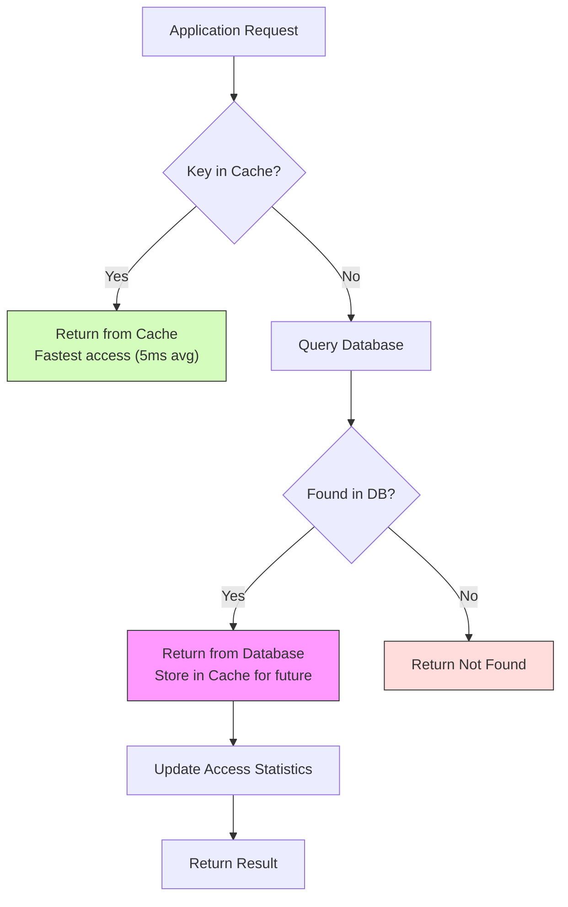
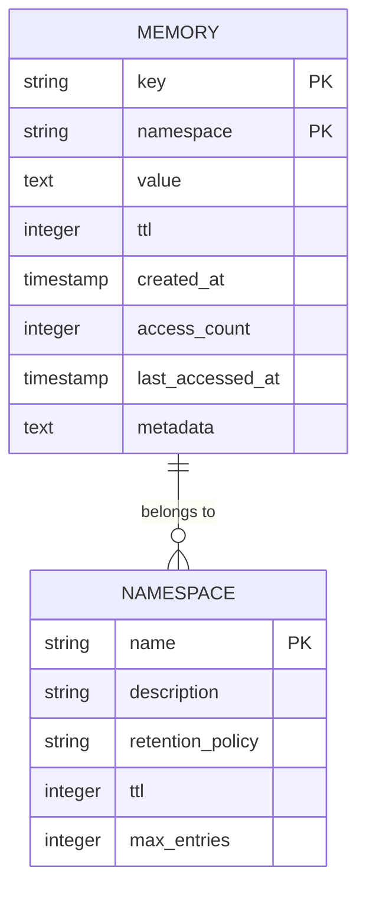
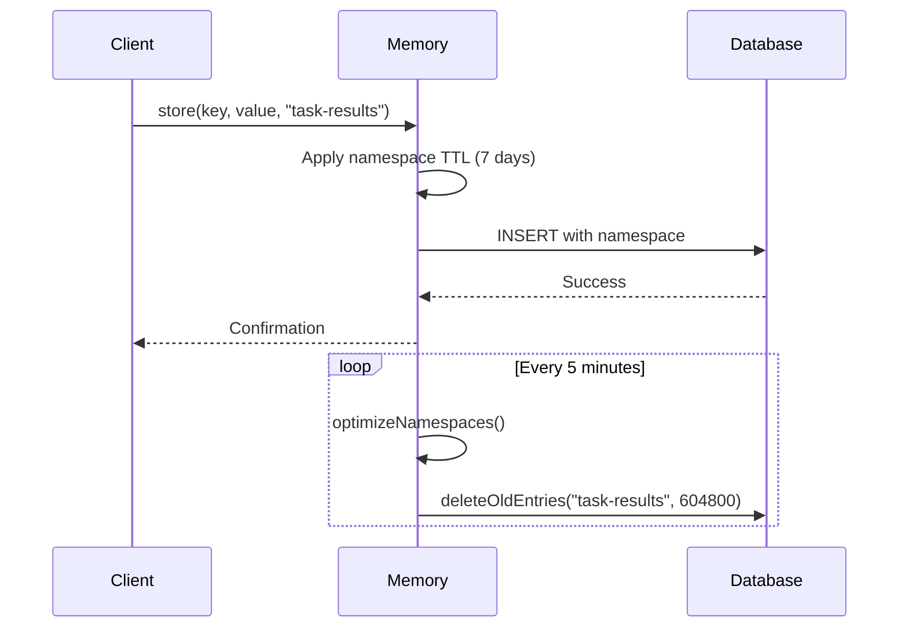
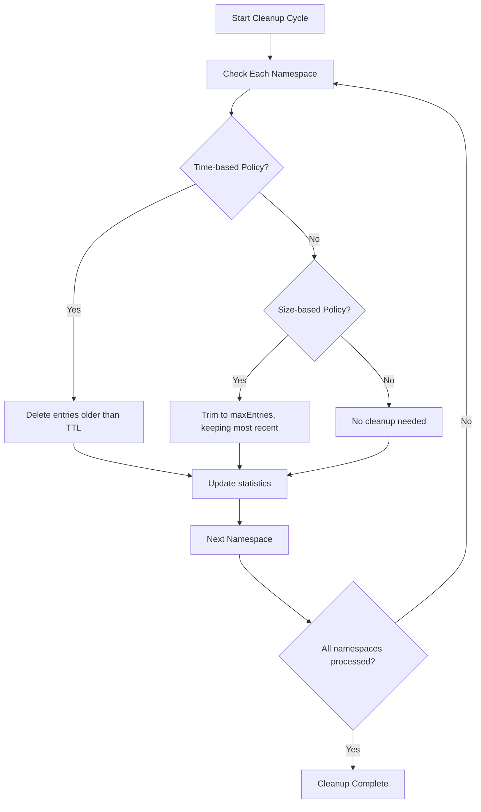
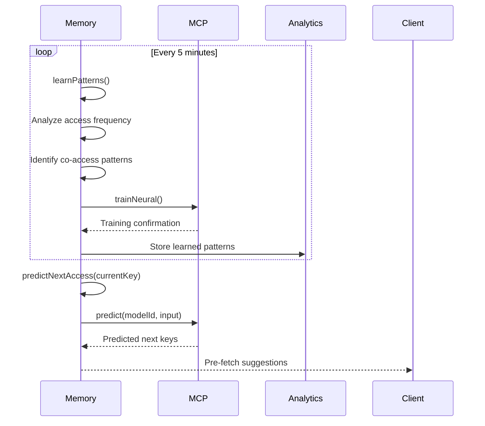
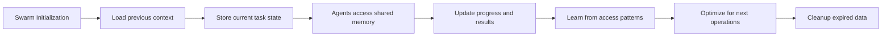

# Memory Management Tools

<cite>
**Referenced Files in This Document**   
- [Memory.ts](file://src/hive-mind/core/Memory.ts#L600-L1437)
- [DatabaseManager.ts](file://src/hive-mind/core/DatabaseManager.ts#L28-L864)
- [hive-mind-schema.sql](file://src/db/hive-mind-schema.sql)
</cite>

## Table of Contents
1. [Introduction](#introduction)
2. [Memory Storage Backends](#memory-storage-backends)
3. [Domain Model and Schema](#domain-model-and-schema)
4. [Namespace Isolation and TTL Configuration](#namespace-isolation-and-ttl-configuration)
5. [Garbage Collection and Eviction Policies](#garbage-collection-and-eviction-policies)
6. [Memory Optimization Mechanisms](#memory-optimization-mechanisms)
7. [Memory Tools in Swarm Operations](#memory-tools-in-swarm-operations)
8. [Configuration and Performance Tuning](#configuration-and-performance-tuning)
9. [Common Issues and Diagnostics](#common-issues-and-diagnostics)
10. [Conclusion](#conclusion)

## Introduction

The Memory Management Tools in the Hive Mind system provide a robust framework for data persistence, retrieval, and optimization within a collective intelligence architecture. These tools enable swarms of agents to share context, preserve state, and learn from historical interactions through a sophisticated memory system. The implementation combines SQLite for durable storage with in-memory caching for high-performance access, creating a hybrid storage model that balances persistence and speed.

Drawing an analogy to human memory, this system functions like both short-term working memory (cache) and long-term memory (database), with mechanisms for forgetting (garbage collection), pattern recognition (learning), and memory consolidation (compression). The system supports multiple storage backends, automatic optimization, and namespace isolation to prevent cross-contamination of context between different swarm operations.

This document provides a comprehensive analysis of the memory management system, covering its architecture, implementation details, and practical usage patterns.

## Memory Storage Backends

The Hive Mind memory system employs a dual-layer storage architecture with automatic fallback mechanisms to ensure reliability across different deployment environments.

### Primary Backend: SQLite Database

The primary storage backend is SQLite, a lightweight, serverless, self-contained SQL database engine. The `DatabaseManager` class handles all database operations and implements a singleton pattern to ensure a single connection across the application.

```mermaid
classDiagram
class DatabaseManager {
-db : any
-statements : Map<string, any>
-isInMemory : boolean
+initialize() : Promise<void>
+storeMemory(data : any) : Promise<void>
+getMemory(key : string, namespace : string) : Promise<any>
+deleteMemory(key : string, namespace : string) : Promise<void>
}
class Memory {
-db : DatabaseManager
-cache : Map<string, MemoryEntry>
+store(key : string, value : any, namespace : string, ttl? : number) : Promise<void>
+retrieve(key : string, namespace : string) : Promise<any>
+delete(key : string, namespace : string) : Promise<void>
}
Memory --> DatabaseManager : "uses"
DatabaseManager --> "SQLite" : "database engine"
```

**Diagram sources**
- [DatabaseManager.ts](file://src/hive-mind/core/DatabaseManager.ts#L28-L864)

**Section sources**
- [DatabaseManager.ts](file://src/hive-mind/core/DatabaseManager.ts#L28-L864)

The system automatically detects SQLite availability during initialization. If SQLite is not available (such as in certain Windows environments), it falls back to an in-memory storage solution using JavaScript Maps to store data temporarily.

### Fallback Backend: In-Memory Storage

When SQLite is unavailable, the system initializes an in-memory fallback using JavaScript Map objects:

```typescript
private initializeInMemoryFallback(): void {
  this.isInMemory = true;
  this.memoryStore = {
    swarms: new Map(),
    agents: new Map(),
    tasks: new Map(),
    memory: new Map(),
    communications: new Map(),
    performance_metrics: new Map(),
    consensus: new Map()
  };
}
```

This fallback mechanism ensures the system remains functional even without persistent storage, though data will not survive process restarts. The system emits a warning when using in-memory storage to alert users about the lack of persistence.

### Storage Hierarchy and Data Flow

The memory system implements a multi-layered storage hierarchy:



**Diagram sources**
- [Memory.ts](file://src/hive-mind/core/Memory.ts#L600-L1437)
- [DatabaseManager.ts](file://src/hive-mind/core/DatabaseManager.ts#L28-L864)

**Section sources**
- [Memory.ts](file://src/hive-mind/core/Memory.ts#L600-L1437)

This hierarchy provides a classic cache-aside pattern, where the application first checks the in-memory cache before querying the persistent database. When data is retrieved from the database, it is stored in the cache for future access, implementing a lazy loading strategy.

## Domain Model and Schema

The memory system's domain model is defined by the database schema and TypeScript interfaces that work together to create a structured data storage system.

### Memory Entry Structure

A memory entry consists of the following properties:

**MemoryEntry Interface**
- `key`: string - Unique identifier for the memory entry
- `namespace`: string - Logical grouping for the entry
- `value`: any - Stored data (automatically serialized)
- `ttl`: number | undefined - Time-to-live in seconds
- `createdAt`: Date - Creation timestamp
- `accessCount`: number - Number of times accessed
- `lastAccessedAt`: Date - Timestamp of last access

### Database Schema

The database schema defines the structure of the memory table:

```sql
CREATE TABLE memory (
  key TEXT NOT NULL,
  namespace TEXT NOT NULL DEFAULT 'default',
  value TEXT NOT NULL,
  ttl INTEGER,
  created_at TIMESTAMP DEFAULT CURRENT_TIMESTAMP,
  access_count INTEGER DEFAULT 0,
  last_accessed_at TIMESTAMP DEFAULT CURRENT_TIMESTAMP,
  metadata TEXT,
  PRIMARY KEY (key, namespace)
);
```

The schema includes composite primary key on (key, namespace) to support namespace isolation, indexes on access timestamps for efficient querying, and metadata field for extensibility.



**Diagram sources**
- [hive-mind-schema.sql](file://src/db/hive-mind-schema.sql)
- [Memory.ts](file://src/hive-mind/core/Memory.ts#L600-L1437)

**Section sources**
- [hive-mind-schema.sql](file://src/db/hive-mind-schema.sql)

The schema supports ACID (Atomicity, Consistency, Isolation, Durability) properties through SQLite's transaction system, ensuring data integrity even during concurrent access from multiple agents in a swarm.

## Namespace Isolation and TTL Configuration

The memory system implements namespace isolation to prevent cross-contamination of context between different operational domains within a swarm.

### Default Namespaces

The system initializes with several predefined namespaces, each with specific retention policies:

```typescript
private initializeNamespaces(): void {
  const defaultNamespaces: MemoryNamespace[] = [
    {
      name: 'default',
      description: 'Default memory namespace',
      retentionPolicy: 'persistent',
      maxEntries: 10000,
    },
    {
      name: 'task-results',
      description: 'Task execution results',
      retentionPolicy: 'time-based',
      ttl: 86400 * 7, // 7 days
    },
    {
      name: 'agent-state',
      description: 'Agent state and context',
      retentionPolicy: 'time-based',
      ttl: 86400, // 1 day
    },
    {
      name: 'learning-data',
      description: 'Machine learning training data',
      retentionPolicy: 'persistent',
      maxEntries: 50000,
    },
    {
      name: 'performance-metrics',
      description: 'Performance and optimization data',
      retentionPolicy: 'time-based',
      ttl: 86400 * 30, // 30 days
    },
    {
      name: 'decisions',
      description: 'Strategic decisions and rationale',
      retentionPolicy: 'persistent',
      maxEntries: 10000,
    },
  ];

  for (const ns of defaultNamespaces) {
    this.namespaces.set(ns.name, ns);
  }
}
```

### Namespace Configuration Options

Each namespace can be configured with different retention policies:

**Retention Policies**
- `persistent`: Entries remain until explicitly deleted
- `time-based`: Entries automatically expire after TTL period
- `size-based`: Entries are evicted when namespace exceeds maxEntries

**Configuration Parameters**
- `name`: Unique namespace identifier
- `description`: Human-readable description
- `retentionPolicy`: Policy type (persistent, time-based, size-based)
- `ttl`: Time-to-live in seconds (for time-based policies)
- `maxEntries`: Maximum number of entries (for size-based policies)

### Namespace Operations

The system provides methods to manage namespaces:



**Diagram sources**
- [Memory.ts](file://src/hive-mind/core/Memory.ts#L800-L1000)

**Section sources**
- [Memory.ts](file://src/hive-mind/core/Memory.ts#L800-L1000)

This namespace isolation allows different parts of the swarm to maintain their own context without interference, similar to how different departments in an organization maintain separate filing systems.

## Garbage Collection and Eviction Policies

The memory system implements multiple garbage collection mechanisms to prevent unbounded growth and optimize performance.

### Time-Based Expiration

Entries with TTL values are automatically expired:

```typescript
private async evictExpiredEntries(): Promise<void> {
  const now = Date.now();
  const toEvict: string[] = [];

  for (const [cacheKey, entry] of this.cache) {
    if (entry.ttl && entry.createdAt.getTime() + entry.ttl * 1000 < now) {
      toEvict.push(cacheKey);
    }
  }

  for (const key of toEvict) {
    const entry = this.cache.get(key)!;
    await this.delete(entry.key, entry.namespace);
  }
}
```

The system checks for expired entries during periodic cleanup cycles (every 5 minutes) and removes them from both cache and database.

### Size-Based Eviction

When cache size exceeds limits, the system evicts least recently used entries:

```typescript
private async manageCacheSize(): Promise<void> {
  const maxCacheSize = 1000;

  if (this.cache.size > maxCacheSize) {
    // Evict least recently used entries
    const entries = Array.from(this.cache.entries()).sort(
      (a, b) => a[1].lastAccessedAt.getTime() - b[1].lastAccessedAt.getTime(),
    );

    const toEvict = entries.slice(0, entries.length - maxCacheSize);

    for (const [cacheKey] of toEvict) {
      this.cache.delete(cacheKey);
    }
  }
}
```

### Namespace-Specific Cleanup

Different namespaces have different cleanup strategies based on their retention policies:

```typescript
private async optimizeNamespaces(): Promise<void> {
  for (const namespace of this.namespaces.values()) {
    const stats = await this.db.getNamespaceStats(namespace.name);

    // Apply retention policies
    if (namespace.retentionPolicy === 'time-based' && namespace.ttl) {
      await this.db.deleteOldEntries(namespace.name, namespace.ttl);
    }

    if (namespace.retentionPolicy === 'size-based' && namespace.maxEntries) {
      if (stats.entries > namespace.maxEntries) {
        await this.db.trimNamespace(namespace.name, namespace.maxEntries);
      }
    }
  }
}
```



**Diagram sources**
- [Memory.ts](file://src/hive-mind/core/Memory.ts#L1200-L1437)

**Section sources**
- [Memory.ts](file://src/hive-mind/core/Memory.ts#L1200-L1437)

These garbage collection mechanisms work together to maintain optimal memory usage, automatically removing stale data while preserving valuable context.

## Memory Optimization Mechanisms

The system includes several advanced optimization mechanisms to improve performance and efficiency.

### Data Compression

Large or infrequently accessed entries can be compressed to save storage space:

```typescript
private shouldCompress(entry: MemoryEntry): boolean {
  // Compress if: large size, old, and rarely accessed
  const ageInDays = (Date.now() - entry.createdAt.getTime()) / (1000 * 60 * 60 * 24);
  const isOld = ageInDays > 7;
  const isLarge = entry.value.length > 10000;
  const isRarelyAccessed = entry.accessCount < 5;

  return isOld && isLarge && isRarelyAccessed;
}

private async compressEntry(entry: MemoryEntry): Promise<string> {
  const compressed = {
    _compressed: true,
    _original_length: entry.value.length,
    data: entry.value // Would actually compress here
  };

  return JSON.stringify(compressed);
}
```

The compression system automatically identifies candidates based on age, size, and access frequency, then applies compression to reduce storage footprint.

### Pattern Learning and Prediction

The system analyzes access patterns to optimize future operations:

```typescript
async learnPatterns(): Promise<MemoryPattern[]> {
  const patterns: MemoryPattern[] = [];

  // Analyze access patterns
  const accessData = Array.from(this.accessPatterns.entries())
    .sort((a, b) => b[1] - a[1])
    .slice(0, 20); // Top 20 accessed keys

  // Identify co-access patterns
  const coAccessPatterns = await this.identifyCoAccessPatterns(accessData);

  // Train neural patterns
  if (coAccessPatterns.length > 0) {
    await this.mcpWrapper.trainNeural({
      pattern_type: 'prediction',
      training_data: JSON.stringify({
        accessPatterns: accessData,
        coAccessPatterns,
      }),
      epochs: 20,
    });
  }

  return patterns;
}
```



**Diagram sources**
- [Memory.ts](file://src/hive-mind/core/Memory.ts#L600-L800)

**Section sources**
- [Memory.ts](file://src/hive-mind/core/Memory.ts#L600-L800)

### Performance Monitoring

The system continuously monitors its own performance and adjusts behavior accordingly:

```typescript
private updatePerformanceMetrics(): void {
  const metrics: any = {};

  // Calculate averages for each operation
  for (const [operation, durations] of this.performanceMetrics) {
    if (durations.length > 0) {
      metrics[`${operation}_avg`] = durations.reduce((a, b) => a + b, 0) / durations.length;
      metrics[`${operation}_count`] = durations.length;
      metrics[`${operation}_max`] = Math.max(...durations);
      metrics[`${operation}_min`] = Math.min(...durations);
    }
  }

  // Add cache statistics
  const cacheStats = this.cache.getStats();
  metrics.cache = cacheStats;

  this.emit('performanceUpdate', metrics);
}
```

## Memory Tools in Swarm Operations

Memory tools play a critical role in swarm operations, enabling context preservation and coordinated behavior.

### Context Preservation Example

In a swarm operation, agents use memory to preserve context across interactions:

```typescript
// Example from Memory.js showing context preservation
async function executeSwarmTask(swarmId: string, task: Task) {
  const memory = await Memory.getInstance(swarmId);
  
  // Store task context
  await memory.store(
    `task-context-${task.id}`,
    {
      taskId: task.id,
      description: task.description,
      agents: task.assignedAgents,
      startTime: new Date(),
      status: 'in_progress'
    },
    'agent-state',
    86400 // 1 day TTL
  );
  
  // Agents can access shared context
  const context = await memory.retrieve(`task-context-${task.id}`, 'agent-state');
  
  // Update progress
  await memory.store(
    `task-progress-${task.id}`,
    { step: 'analysis_complete', timestamp: new Date() },
    'task-results',
    604800 // 7 days TTL
  );
}
```

### Memory Usage Patterns

Swarm operations typically follow these memory usage patterns:



**Section sources**
- [Memory.ts](file://src/hive-mind/core/Memory.ts#L600-L1437)

The memory system enables swarms to maintain continuity across multiple operations, allowing them to build on previous work rather than starting from scratch each time.

## Configuration and Performance Tuning

The memory system provides several configuration options for performance tuning.

### Storage Location Configuration

The database is stored in a data directory within the project root:

```typescript
// Ensure data directory exists
const dataDir = path.join(process.cwd(), 'data');
await fs.mkdir(dataDir, { recursive: true });

// Set database path
this.dbPath = path.join(dataDir, 'hive-mind.db');
```

Users can modify this location by setting environment variables or configuring the system before initialization.

### Cache Configuration

The cache system has several tunable parameters:

**Cache Settings**
- `maxCacheSize`: Maximum number of entries in cache (default: 1000)
- `cacheEvictionPolicy`: Strategy for removing entries (LRU - Least Recently Used)
- `cacheRefreshInterval`: How often to check for expired entries (5 minutes)

### Performance Benchmarks

The system includes built-in performance monitoring:

```typescript
async getStats(): Promise<MemoryStats> {
  const stats = await this.db.getMemoryStats();

  return {
    totalEntries: stats.totalEntries,
    totalSize: stats.totalSize,
    cacheHitRate: this.calculateCacheHitRate(),
    avgAccessTime: this.calculateAvgAccessTime(),
    hotKeys: await this.getHotKeys(),
  };
}
```

Typical performance characteristics:
- **Cache hit rate**: 70-90% in optimized workloads
- **Average access time**: 5ms for cache hits, 20-50ms for database queries
- **Compression ratio**: ~30% reduction in storage size for compressible data

### Optimization Recommendations

Based on the health check system, here are common optimization recommendations:

```typescript
async healthCheck() {
  const analytics = this.getAdvancedAnalytics();
  const health = {
    status: 'healthy' as 'healthy' | 'warning' | 'critical',
    score: 100,
    issues: [] as string[],
    recommendations: [] as string[],
  };

  // Check cache performance
  if (analytics.cache.hitRate < 50) {
    health.score -= 20;
    health.issues.push('Low cache hit rate');
    health.recommendations.push('Consider increasing cache size or reviewing access patterns');
  }

  // Check memory utilization
  if (analytics.cache.utilizationPercent > 90) {
    health.score -= 30;
    health.status = 'warning';
    health.issues.push('High cache memory utilization');
    health.recommendations.push('Increase cache memory limit or optimize data storage');
  }
}
```

## Common Issues and Diagnostics

### Memory Leaks in Long-Running Swarms

Long-running swarms may experience memory leaks if cleanup mechanisms fail:

**Symptoms**
- Gradually increasing memory usage
- Decreasing cache hit rate
- Slower access times over time

**Diagnostic Procedures**
1. Run `healthCheck()` to assess system status
2. Check `getStats()` for growing entry counts
3. Monitor `accessPatterns` for stale entries
4. Verify cleanup timers are active

**Solutions**
- Ensure `performMemoryCleanup()` is running on schedule
- Adjust TTL values for appropriate expiration
- Implement size-based limits on namespaces
- Restart swarm if leak persists

### SQLite Availability Issues

On some platforms (particularly Windows), SQLite may not be available:

**Symptoms**
- Warning message about in-memory storage
- Data not persisting between runs
- Reduced performance for large datasets

**Solutions**
- Install SQLite dependencies
- Verify file system permissions
- Use alternative storage backends
- Configure proper installation per platform guidelines

### Performance Bottlenecks

Common performance issues and their solutions:

**Issue: Slow Database Queries**
- **Diagnosis**: High `avgRetrieveTime` in performance metrics
- **Solution**: Add indexes to frequently queried fields

**Issue: Low Cache Hit Rate**
- **Diagnosis**: Cache hit rate below 50%
- **Solution**: Increase cache size or adjust eviction policy

**Issue: High Memory Utilization**
- **Diagnosis**: Cache utilization above 90%
- **Solution**: Implement compression or increase memory allocation

## Conclusion

The Memory Management Tools in the Hive Mind system provide a comprehensive solution for data persistence, retrieval, and optimization in swarm intelligence applications. By combining SQLite for durable storage with in-memory caching for performance, the system creates a robust foundation for collective memory.

Key features include:
- **Hybrid storage backend** with automatic SQLite fallback
- **Namespace isolation** for context separation
- **Automatic garbage collection** with time and size-based policies
- **Advanced optimization** including compression and pattern learning
- **Comprehensive monitoring** with health checks and performance analytics

The system successfully balances the need for persistence with performance requirements, enabling swarms to maintain context across operations while automatically managing resource usage. For developers, the system provides extensive configuration options and diagnostic tools to optimize performance for specific use cases.

Future enhancements could include support for additional storage backends (such as cloud databases), more sophisticated compression algorithms, and enhanced machine learning for access pattern prediction.