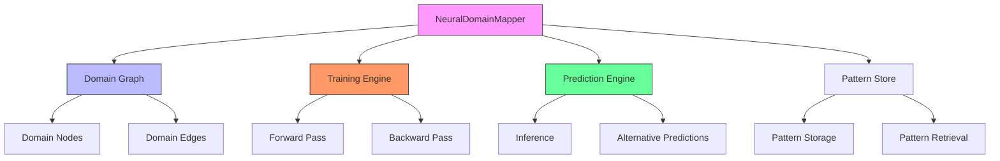
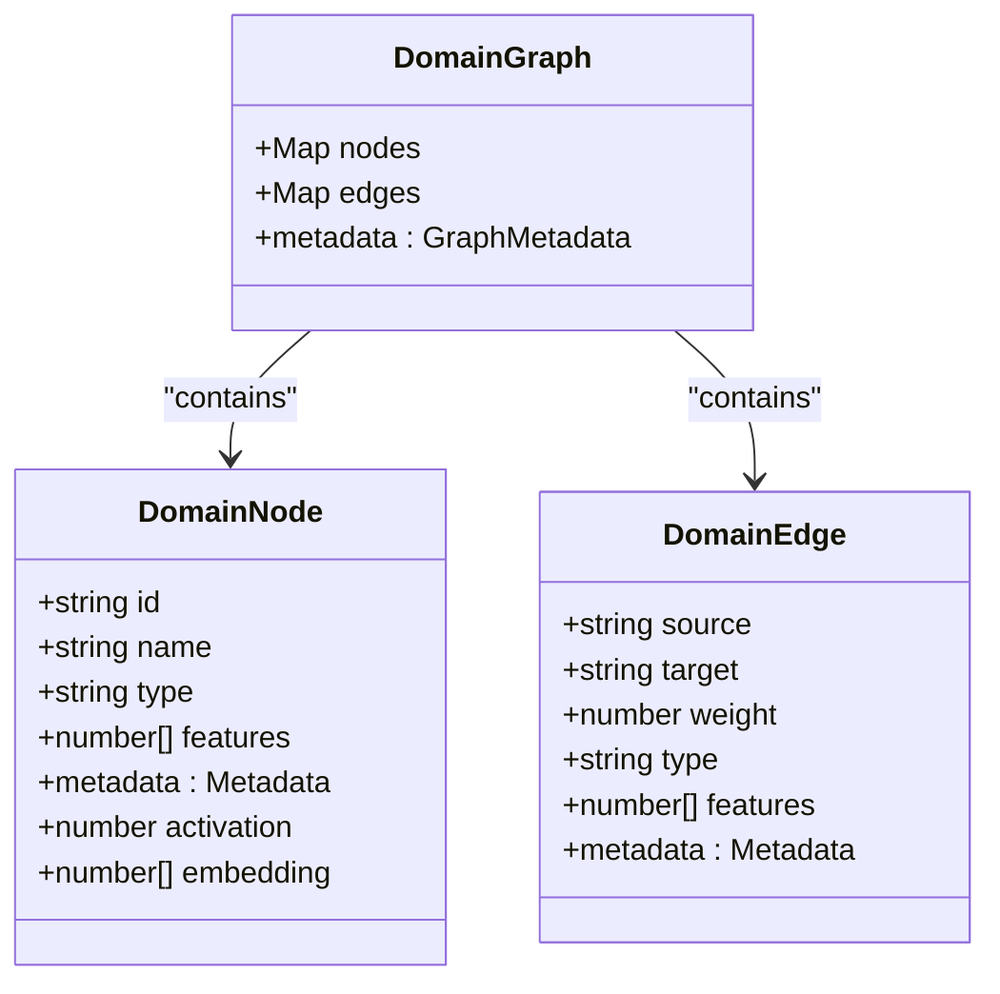
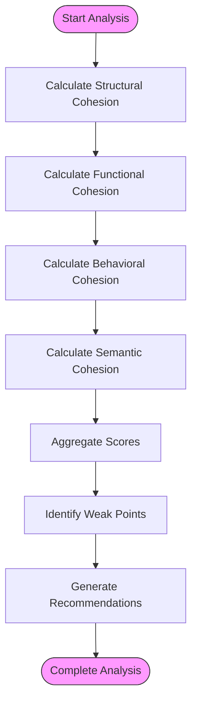
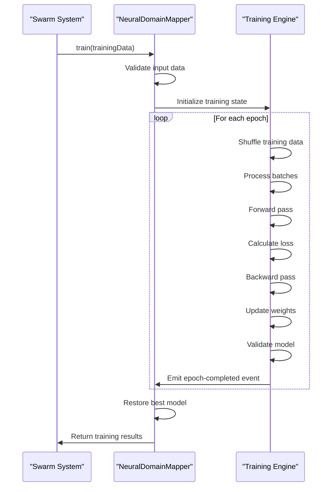
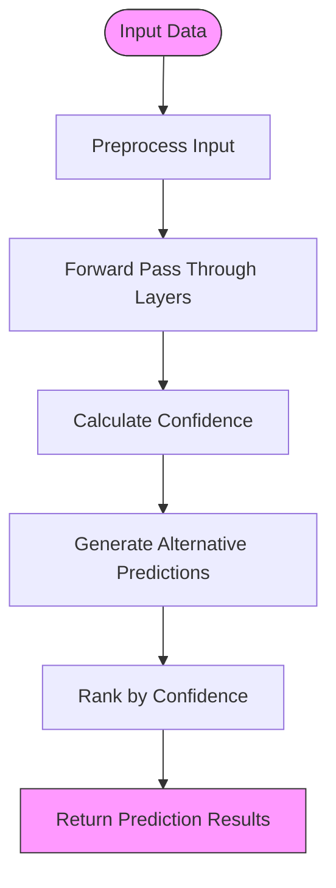
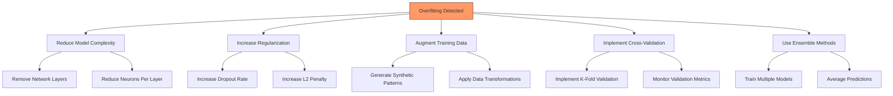
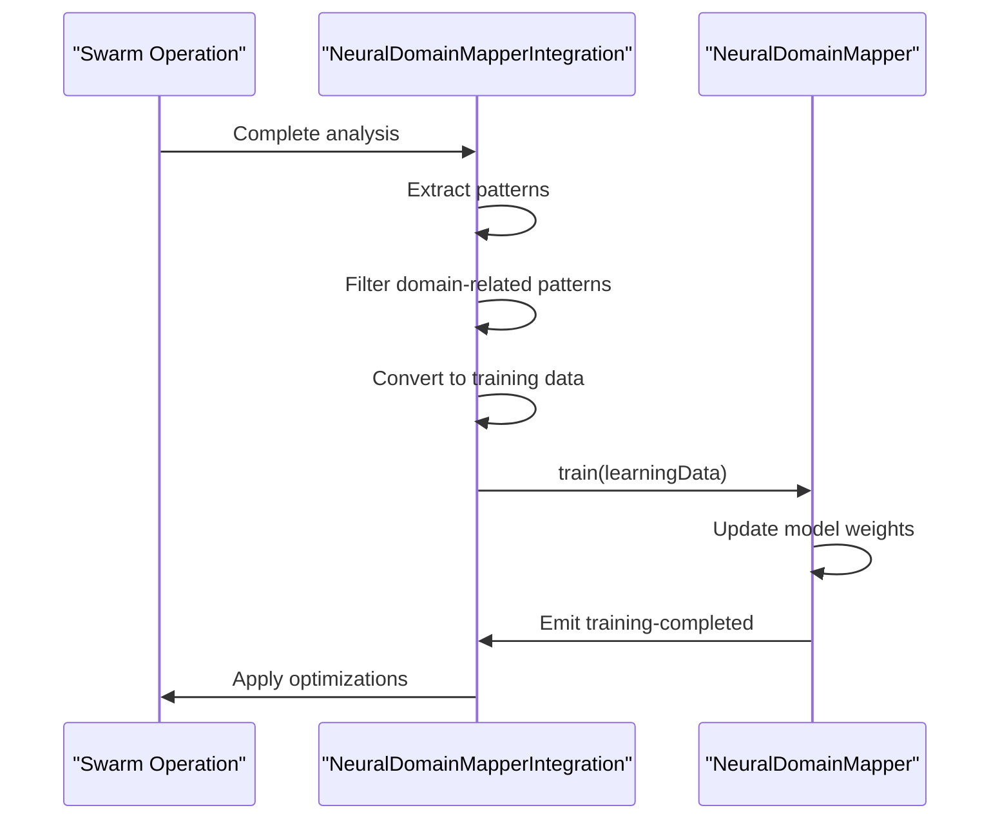

# Neural Tools

<cite>
**Referenced Files in This Document**   
- [NeuralDomainMapper.ts](file://src/neural/NeuralDomainMapper.ts#L1-L1679)
- [integration.ts](file://src/neural/integration.ts#L1-L826)
</cite>

## Table of Contents
1. [Introduction](#introduction)
2. [Core Architecture](#core-architecture)
3. [Domain Model](#domain-model)
4. [Neural Pattern Detection](#neural-pattern-detection)
5. [Model Training Workflows](#model-training-workflows)
6. [Prediction Engine](#prediction-engine)
7. [Configuration Options](#configuration-options)
8. [Common Issues and Optimization Strategies](#common-issues-and-optimization-strategies)
9. [Integration with Swarm Operations](#integration-with-swarm-operations)
10. [Performance Characteristics](#performance-characteristics)

## Introduction
The Neural Tools sub-category within the Claude-Flow swarm intelligence system provides advanced capabilities for pattern recognition, adaptive learning, and cognitive computing. These tools leverage Graph Neural Network (GNN) architecture to analyze domain relationships, calculate cohesion scores, identify cross-domain dependencies, and provide predictive boundary optimization. The system enables intelligent task routing and dynamic domain boundary management based on learned patterns from swarm operations.

The NeuralDomainMapper class serves as the core component, implementing sophisticated neural network algorithms to process domain structures and relationships. It transforms complex system architectures into graph representations that can be analyzed, optimized, and used for predictive modeling. This documentation provides comprehensive details on the implementation, configuration, and usage of these neural tools within the swarm intelligence framework.

## Core Architecture
The Neural Tools architecture follows a modular design with clear separation of concerns between data representation, processing logic, and integration points. The system is built around the NeuralDomainMapper class which extends EventEmitter to support event-driven communication with other components in the swarm.



**Diagram sources**
- [NeuralDomainMapper.ts](file://src/neural/NeuralDomainMapper.ts#L254-L1665)

**Section sources**
- [NeuralDomainMapper.ts](file://src/neural/NeuralDomainMapper.ts#L1-L1679)

## Domain Model
The domain model implemented in the Neural Tools system represents software architecture components as graph structures with rich metadata. This model enables sophisticated analysis of domain relationships and system cohesion.

### Domain Entities
The system defines several key interfaces that form the foundation of the domain model:

**DomainNode**: Represents individual domains within the system architecture
- **id**: Unique identifier for the domain
- **name**: Human-readable domain name
- **type**: Classification (functional, technical, business, integration, data, ui, api)
- **features**: Numerical feature vector for neural processing
- **metadata**: Domain-specific attributes including size, complexity, stability
- **activation**: Current activation state in the neural network
- **embedding**: Learning parameters for the node

**DomainEdge**: Represents relationships between domains
- **source**: Source domain ID
- **target**: Target domain ID
- **weight**: Relationship strength (0-1)
- **type**: Relationship classification (dependency, communication, data-flow, inheritance, composition, aggregation)
- **features**: Numerical features for neural processing
- **metadata**: Relationship attributes including frequency, latency, reliability

**DomainGraph**: Container for the complete domain structure
- **nodes**: Collection of DomainNode objects
- **edges**: Collection of DomainEdge objects
- **metadata**: Graph-level information including creation time, training status, cohesion score



**Diagram sources**
- [NeuralDomainMapper.ts](file://src/neural/NeuralDomainMapper.ts#L50-L150)

**Section sources**
- [NeuralDomainMapper.ts](file://src/neural/NeuralDomainMapper.ts#L50-L150)

## Neural Pattern Detection
The neural pattern detection system analyzes domain structures and relationships to identify meaningful patterns that can inform system optimization and decision-making.

### Pattern Recognition Process
The pattern detection workflow follows these steps:

1. Convert domain structure to graph format using `convertToGraph()`
2. Extract numerical features from domains and relationships
3. Calculate multi-dimensional cohesion scores
4. Identify cross-domain dependencies and potential issues
5. Generate optimization suggestions based on analysis

The system uses a combination of structural, functional, behavioral, and semantic analysis to evaluate domain cohesion:



**Diagram sources**
- [NeuralDomainMapper.ts](file://src/neural/NeuralDomainMapper.ts#L500-L750)

**Section sources**
- [NeuralDomainMapper.ts](file://src/neural/NeuralDomainMapper.ts#L500-L750)

### Feature Extraction
The system extracts numerical features from domain definitions to enable neural processing:

**Domain Features** (64-dimensional vector):
- One-hot encoding of domain type (7 dimensions)
- Size, complexity, and stability metrics
- Normalized dependency count
- Domain age (days since last update)

**Edge Features** (32-dimensional vector):
- One-hot encoding of relationship type (6 dimensions)
- Frequency, latency, reliability, and bandwidth metrics
- Direction indicator (unidirectional vs. bidirectional)

The `extractDomainFeatures()` and `extractEdgeFeatures()` methods handle this transformation, padding vectors to ensure consistent dimensions across all inputs.

## Model Training Workflows
The Neural Tools system implements a comprehensive training workflow that enables the model to learn from domain relationship patterns and improve its analytical capabilities over time.

### Training Configuration
The training process is controlled by the TrainingConfig interface which defines key parameters:

- **learningRate**: Initial learning rate (default: 0.001)
- **batchSize**: Number of samples per training batch (default: 32)
- **epochs**: Maximum training iterations (default: 100)
- **optimizer**: Optimization algorithm (adam, sgd, rmsprop, adamw)
- **lossFunction**: Loss calculation method (mse, cross-entropy, contrastive, triplet)
- **regularization**: L1, L2, and dropout parameters
- **earlyStoping**: Conditions for early termination
- **validationSplit**: Proportion of data reserved for validation



**Diagram sources**
- [NeuralDomainMapper.ts](file://src/neural/NeuralDomainMapper.ts#L1000-L1300)

**Section sources**
- [NeuralDomainMapper.ts](file://src/neural/NeuralDomainMapper.ts#L1000-L1300)

### Training Process
The training workflow follows these steps:

1. **Initialization**: Set up training state and emit `training-started` event
2. **Epoch Loop**: Iterate through specified number of epochs
3. **Data Shuffling**: Randomize training data order
4. **Batch Processing**: Process data in batches according to batchSize
5. **Forward Pass**: Compute predictions through the network layers
6. **Loss Calculation**: Measure prediction error using configured loss function
7. **Backward Pass**: Calculate gradients and update weights via backpropagation
8. **Validation**: Evaluate model performance on validation set
9. **Early Stopping**: Check for convergence and potentially terminate early
10. **Learning Rate Scheduling**: Adjust learning rate periodically
11. **Completion**: Restore best model and emit `training-completed` event

The system implements early stopping to prevent overfitting, monitoring validation accuracy and halting training if improvements fall below a threshold for a specified number of epochs.

## Prediction Engine
The prediction engine enables the Neural Tools system to make intelligent inferences about domain relationships and optimal system configurations.

### Inference Process
The prediction workflow involves several key components:

**Forward Pass**: Data flows through the network layers:
1. Input preprocessing to extract features
2. Processing through each GNN layer (GCN, GAT, etc.)
3. Application of activation functions (ReLU, Tanh, etc.)
4. Dropout regularization during training
5. Generation of output predictions

**Confidence Calculation**: The system assesses prediction certainty based on output variance:
- Higher range between maximum and minimum output values indicates greater confidence
- Confidence score is normalized to 0-1 range

**Alternative Predictions**: To provide robust recommendations, the system generates multiple alternatives:
- Noise injection into input data
- Multiple forward passes with different perturbations
- Ranking of alternatives by confidence score



**Diagram sources**
- [NeuralDomainMapper.ts](file://src/neural/NeuralDomainMapper.ts#L1500-L1600)

**Section sources**
- [NeuralDomainMapper.ts](file://src/neural/NeuralDomainMapper.ts#L1500-L1600)

### Weight Management
The system implements sophisticated weight management to ensure effective learning:

**Initialization**: Uses Xavier/Glorot initialization for optimal starting weights:
- Calculates limit based on input and output dimensions
- Generates random weights within calculated range
- Initializes biases to zero

**Update Mechanism**: Applies gradient descent with regularization:
- Computes gradients via backpropagation
- Updates weights considering learning rate and L2 regularization
- Updates biases using learning rate only
- Applies optimizer-specific adjustments

**Storage**: Maintains weights and biases in Map structures:
- Keys follow "layer_X" naming convention
- Enables efficient retrieval during forward and backward passes
- Supports model persistence and restoration

## Configuration Options
The Neural Tools system provides extensive configuration options to tailor behavior to specific use cases and performance requirements.

### Model Complexity
The neural network architecture can be customized through the layers configuration:

```typescript
this.layers = [
  {
    type: 'gcn',
    inputDim: 64,
    outputDim: 128,
    dropout: 0.1,
    activation: 'relu',
    normalization: 'batch',
  },
  {
    type: 'gat',
    inputDim: 128,
    outputDim: 64,
    numHeads: 8,
    dropout: 0.1,
    activation: 'relu',
    normalization: 'layer',
  },
  {
    type: 'gcn',
    inputDim: 64,
    outputDim: 32,
    dropout: 0.05,
    activation: 'tanh',
  },
];
```

Key parameters:
- **type**: Layer architecture (gcn, gat, sage, gin, transformer)
- **inputDim/outputDim**: Feature dimensionality
- **numHeads**: Attention heads for GAT layers
- **dropout**: Regularization rate
- **activation**: Non-linear transformation
- **normalization**: Batch or layer normalization

### Training Parameters
The TrainingConfig interface allows fine-tuning of the learning process:

**Epochs**: Controls training duration
- Higher values allow more learning but increase computation time
- Default: 100 epochs
- Can be reduced for simpler patterns or increased for complex relationships

**Batch Size**: Affects training stability and speed
- Larger batches provide more stable gradients but require more memory
- Default: 32 samples per batch
- Smaller batches (8-16) for memory-constrained environments
- Larger batches (64-128) for stable, parallelized training

**Learning Rate**: Controls step size in parameter space
- Default: 0.001 (Adam optimizer)
- Higher rates (0.01) for faster initial learning
- Lower rates (0.0001) for fine-tuning and convergence

**Regularization**: Prevents overfitting
- L1/L2: Weight penalties to encourage sparsity or small weights
- Dropout: Random neuron deactivation during training
- Early stopping: Halts training when validation performance plateaus

### Inference Thresholds
The system uses various thresholds to determine prediction quality and actionability:

**Confidence Threshold**: Minimum confidence for actionable predictions
- Default: System determines based on output variance
- Can be configured externally to filter low-confidence recommendations

**Cohesion Threshold**: Domain quality assessment
- > 0.8: High cohesion (well-structured)
- 0.6-0.8: Moderate cohesion (acceptable)
- < 0.6: Low cohesion (requires improvement)

**Optimization Priority**: Action urgency based on system health
- Critical: Immediate action required (cohesion < 0.3)
- High: Significant improvements possible (score > 0.7)
- Medium: Beneficial improvements (score > 0.4)
- Low: Minor optimizations

## Common Issues and Optimization Strategies
The Neural Tools system addresses common challenges in pattern recognition and adaptive learning through built-in mechanisms and recommended practices.

### Overfitting in Pattern Recognition
Overfitting occurs when the model learns noise rather than generalizable patterns, leading to poor performance on new data.

**Symptoms**:
- High training accuracy but low validation accuracy
- Excessive model complexity relative to data size
- Poor generalization to unseen domain configurations

**Built-in Prevention**:
- **Early Stopping**: Monitors validation performance and halts training when improvements cease
- **Dropout**: Randomly deactivates neurons during training to prevent co-adaptation
- **L1/L2 Regularization**: Penalizes large weights to encourage simpler models
- **Validation Split**: Reserves portion of data for unbiased performance assessment

**Optimization Strategies**:
1. **Reduce Model Complexity**: Decrease network depth or width
2. **Increase Regularization**: Raise dropout rate or L2 penalty
3. **Data Augmentation**: Generate additional training samples through pattern variation
4. **Cross-Validation**: Use k-fold validation for more robust performance estimates
5. **Ensemble Methods**: Combine multiple models to reduce variance



**Diagram sources**
- [NeuralDomainMapper.ts](file://src/neural/NeuralDomainMapper.ts#L1000-L1300)

**Section sources**
- [NeuralDomainMapper.ts](file://src/neural/NeuralDomainMapper.ts#L1000-L1300)

### Performance Optimization
To ensure efficient operation in swarm environments:

**Memory Management**:
- Use streaming data processing for large datasets
- Implement pattern pruning based on age and relevance
- Optimize graph storage with efficient data structures

**Computational Efficiency**:
- Batch processing of similar operations
- Parallel execution of independent analyses
- Caching of frequent calculations and results

**Scalability Considerations**:
- Distributed training across multiple nodes
- Incremental learning to avoid retraining from scratch
- Model quantization for reduced memory footprint

## Integration with Swarm Operations
The Neural Tools integrate with swarm operations through the NeuralDomainMapperIntegration class, enabling adaptive learning from swarm activities.

### Pattern-Based Learning
The integration system converts swarm analysis results into training data:



**Diagram sources**
- [integration.ts](file://src/neural/integration.ts#L600-L825)

**Section sources**
- [integration.ts](file://src/neural/integration.ts#L600-L825)

The `learnFromAnalysis()` method processes domain analysis results, extracting relevant patterns and converting them to training data. Only patterns with domain context are considered, ensuring focused learning on architectural concerns.

### Feature Extraction from Patterns
Patterns are transformed into numerical features for training:

**Input Features** (32-dimensional):
- One-hot encoding of pattern type (success, failure, optimization, behavior)
- Confidence score and logarithmic occurrence count
- Context metrics (complexity, size, frequency)
- Zero-padding to ensure consistent dimensionality

**Target Vector**:
- Quality score (pattern confidence)
- Success/failure indicators
- Frequency score (normalized occurrences)

This transformation enables the neural network to learn from qualitative swarm experiences and apply this knowledge to future architectural decisions.

## Performance Characteristics
The Neural Tools system exhibits specific performance characteristics that inform deployment and usage decisions.

### Computational Complexity
**Time Complexity**:
- Graph construction: O(V + E) where V is vertices and E is edges
- Cohesion analysis: O(V × E) for comprehensive evaluation
- Training: O(E × epochs × batch_size) for full training cycle
- Prediction: O(L × D²) where L is layers and D is dimensionality

**Space Complexity**:
- Graph storage: O(V + E) for nodes and edges
- Model parameters: O(L × D_in × D_out) for weights and biases
- Training data: O(N × D) for N samples and D dimensions

### Resource Utilization
The system's resource consumption varies by operation:

**Memory**: 
- Small systems (< 100 domains): < 100MB
- Medium systems (100-1000 domains): 100MB-1GB
- Large systems (> 1000 domains): 1GB+

**CPU**: 
- Analysis operations: Moderate utilization
- Training: High utilization, benefits from parallelization
- Prediction: Low to moderate utilization

**Latency**:
- Real-time analysis: < 100ms for small graphs
- Comprehensive analysis: 1-5 seconds for medium graphs
- Full training cycle: Minutes to hours depending on data size

### Scalability Considerations
For optimal performance in swarm environments:

**Horizontal Scaling**: Distribute analysis across multiple instances
**Vertical Scaling**: Increase resources for complex analyses
**Caching**: Store frequent analysis results to avoid recomputation
**Incremental Updates**: Update model with new patterns rather than full retraining
**Asynchronous Processing**: Offload intensive operations to background workers

The system is designed to balance analytical depth with operational efficiency, providing valuable insights while maintaining responsiveness in dynamic swarm environments.