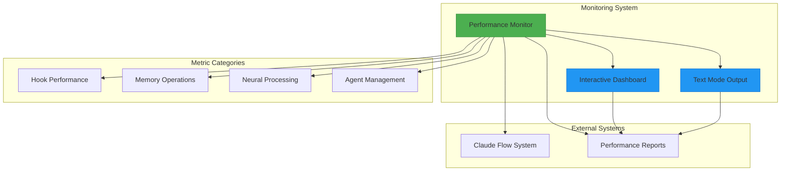
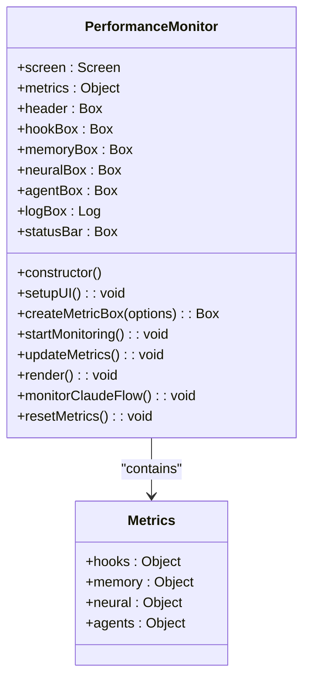
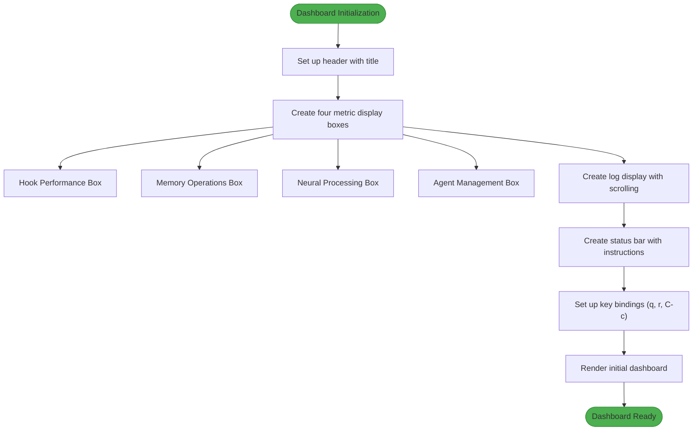
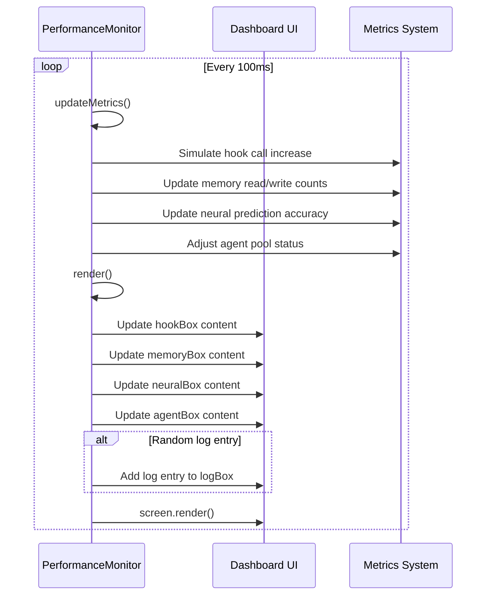
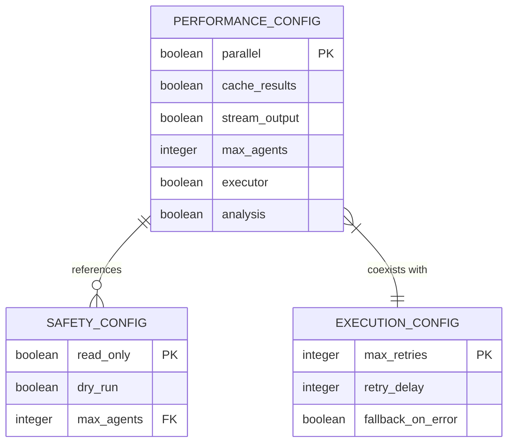
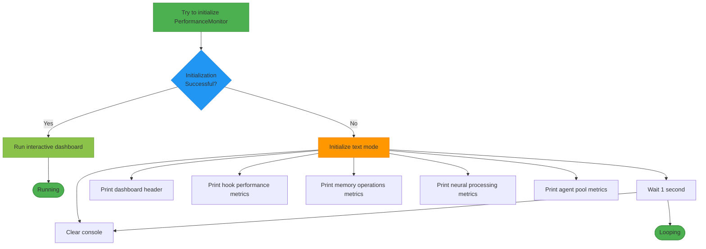

# Performance Monitoring Tools

<cite>
**Referenced Files in This Document**   
- [performance-monitor.js](file://scripts/performance-monitor.js#L1-L263)
- [non_interactive_defaults.yaml](file://benchmark/config/non_interactive_defaults.yaml#L1-L47)
- [performance-1753893818551.html](file://analysis-reports/performance-1753893818551.html)
- [bottleneck-1753893960802.json](file://analysis-reports/bottleneck-1753893960802.json)
</cite>

## Table of Contents
1. [Introduction](#introduction)
2. [Core Components](#core-components)
3. [Architecture Overview](#architecture-overview)
4. [Detailed Component Analysis](#detailed-component-analysis)
5. [Performance Configuration](#performance-configuration)
6. [Reporting and Visualization](#reporting-and-visualization)
7. [Troubleshooting Guide](#troubleshooting-guide)

## Introduction
The Performance Monitoring Tools sub-category provides real-time visibility into system performance across the swarm intelligence network. These tools track key metrics such as hook execution, memory operations, neural processing, and agent management. The implementation focuses on providing both interactive dashboard visualization and fallback text-based monitoring for environments where graphical interfaces are unavailable. The system is designed to help identify performance bottlenecks, track resource utilization, and support optimization decisions in the agentic workflow environment.

## Core Components
The performance monitoring system consists of a primary monitoring script that collects and displays metrics from various components of the Claude Flow system. The core functionality includes real-time metric collection, interactive dashboard rendering, and fallback text-based output. The system monitors four main categories of performance metrics: hook performance, memory operations, neural processing, and agent management. Each category tracks specific KPIs that reflect the health and efficiency of the corresponding system component.

**Section sources**
- [performance-monitor.js](file://scripts/performance-monitor.js#L1-L263)

## Architecture Overview

**Diagram sources**
- [performance-monitor.js](file://scripts/performance-monitor.js#L1-L263)

## Detailed Component Analysis

### Performance Monitor Class Analysis
The PerformanceMonitor class serves as the central component of the monitoring system, handling UI setup, metric collection, and real-time updates. It uses the blessed library to create an interactive terminal-based dashboard that displays performance metrics in real-time.

**Diagram sources**
- [performance-monitor.js](file://scripts/performance-monitor.js#L15-L263)

#### UI Components
The monitoring dashboard is composed of several UI components that display different aspects of system performance. The header provides the title, while four metric boxes show specific performance data. A log box displays real-time activity, and a status bar provides user instructions.

**Diagram sources**
- [performance-monitor.js](file://scripts/performance-monitor.js#L30-L100)

#### Metric Update Process
The system updates metrics at regular intervals, simulating real-time data collection. In a production implementation, these values would be sourced from actual system monitoring, but the current implementation uses randomization to demonstrate the visualization capabilities.

**Diagram sources**
- [performance-monitor.js](file://scripts/performance-monitor.js#L150-L200)

## Performance Configuration
The system's performance characteristics can be influenced by configuration settings, particularly in the non_interactive_defaults.yaml file. These settings affect how the system behaves in terms of parallel execution, caching, and resource limits.

**Diagram sources**
- [non_interactive_defaults.yaml](file://benchmark/config/non_interactive_defaults.yaml#L1-L47)

### Configuration Parameters
The performance monitoring and system behavior are controlled by several key configuration parameters:

**:performance.parallel:** Enables parallel execution where possible, allowing multiple operations to run concurrently for improved throughput.

**:performance.cache_results:** When enabled, stores results of previous operations to avoid redundant processing and improve response times.

**:safety.max_agents:** Limits the number of agents that can be spawned simultaneously, preventing resource exhaustion during high-load scenarios.

**:execution.max_retries:** Specifies the maximum number of retry attempts for failed operations before considering them permanently failed.

**:execution.retry_delay:** Defines the delay in seconds between retry attempts, allowing time for transient issues to resolve.

**:performance.stream_output:** When enabled, outputs results as they become available rather than waiting for complete processing, providing faster feedback.

**Section sources**
- [non_interactive_defaults.yaml](file://benchmark/config/non_interactive_defaults.yaml#L1-L47)

## Reporting and Visualization

### Dashboard Visualization
The performance monitoring system provides an interactive dashboard that displays metrics in a user-friendly format. The dashboard is divided into sections that correspond to different aspects of system performance.

```mermaid
graph TB
Dashboard[Performance Dashboard] --> Header
Dashboard --> HookSection
Dashboard --> MemorySection
Dashboard --> NeuralSection
Dashboard --> AgentSection
Dashboard --> LogSection
Dashboard --> StatusSection
Header --> Title["Claude Flow Performance Monitor"]
HookSection --> Calls["Total Calls: X"]
HookSection --> AvgTime["Avg Time: Y ms"]
HookSection --> ErrorRate["Error Rate: Z%"]
HookSection --> Throughput["Throughput: W/s"]
MemorySection --> Reads["Reads: A"]
MemorySection --> Writes["Writes: B"]
MemorySection --> CacheHits["Cache Hits: C"]
MemorySection --> HitRate["Hit Rate: D%"]
NeuralSection --> Predictions["Predictions: E"]
NeuralSection --> Trainings["Trainings: F"]
NeuralSection --> Accuracy["Accuracy: G%"]
NeuralSection --> WASM["WASM: Enabled"]
AgentSection --> Active["Active: H"]
AgentSection --> Pooled["Pooled: I"]
AgentSection --> TotalSpawns["Total Spawns: J"]
AgentSection --> Efficiency["Pool Efficiency: K%"]
LogSection --> Activity["Live Activity Log"]
Activity --> HookExec["✓ Hook executed"]
Activity --> MemoryWrite["✓ Memory write"]
Activity --> NeuralPred["✓ Neural prediction"]
Activity --> AgentSpawn["⚡ Agent spawned"]
Activity --> CacheHit["↻ Cache hit"]
Activity --> BatchProc["✓ Parallel batch processed"]
StatusSection --> Instructions["Press q to quit | r to reset metrics | Space to pause"]
style Dashboard fill:#2196F3,stroke:#1976D2
style Header fill:#607D8B,stroke:#455A64
style HookSection fill:#8BC34A,stroke:#689F38
style MemorySection fill:#8BC34A,stroke:#689F38
style NeuralSection fill:#8BC34A,stroke:#689F38
style AgentSection fill:#8BC34A,stroke:#689F38
style LogSection fill:#8BC34A,stroke:#689F38
style StatusSection fill:#607D8B,stroke:#455A64
```

**Diagram sources**
- [performance-monitor.js](file://scripts/performance-monitor.js#L30-L150)

### Fallback Text Mode
When the blessed library is not available, the system provides a fallback text-based monitoring mode that displays essential performance metrics in a console-friendly format.

**Diagram sources**
- [performance-monitor.js](file://scripts/performance-monitor.js#L240-L263)

## Troubleshooting Guide
The performance monitoring system may encounter issues related to missing dependencies or configuration problems. The most common issue is the absence of the blessed library, which is required for the interactive dashboard.

**:Missing blessed library:** When the blessed library is not installed, the system automatically falls back to text mode. Users should install the library using "npm install blessed" to enable the interactive dashboard.

**:No real metrics data:** The current implementation simulates metrics using randomization. In a production environment, the monitorClaudeFlow method would need to be implemented to connect to actual Claude Flow metrics sources.

**:Configuration conflicts:** Ensure that the non_interactive_defaults.yaml configuration does not conflict with performance monitoring requirements, particularly regarding parallel execution and agent limits.

**:Resource limitations:** The max_agents setting in the safety configuration may limit the system's ability to scale during high-load scenarios. Adjust this value based on available system resources.

**:Cache performance issues:** If cache hit rates are lower than expected, verify that cache_results is enabled in the performance configuration and that the system has sufficient memory for caching.

**Section sources**
- [performance-monitor.js](file://scripts/performance-monitor.js#L1-L263)
- [non_interactive_defaults.yaml](file://benchmark/config/non_interactive_defaults.yaml#L1-L47)