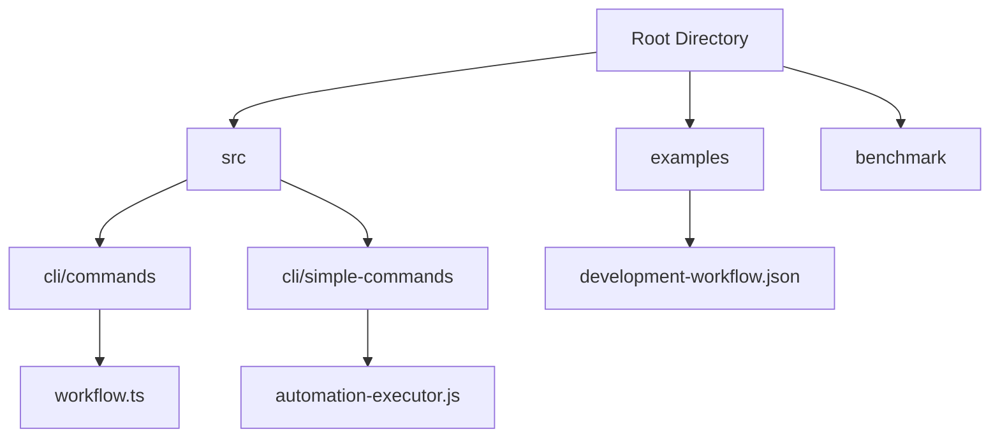
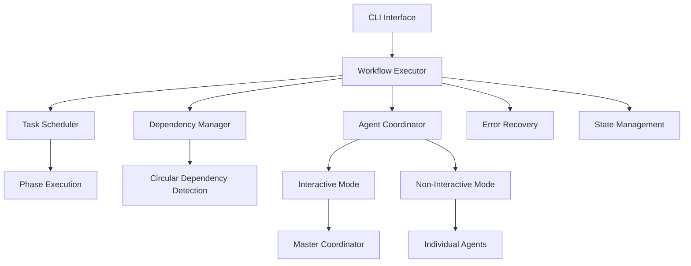
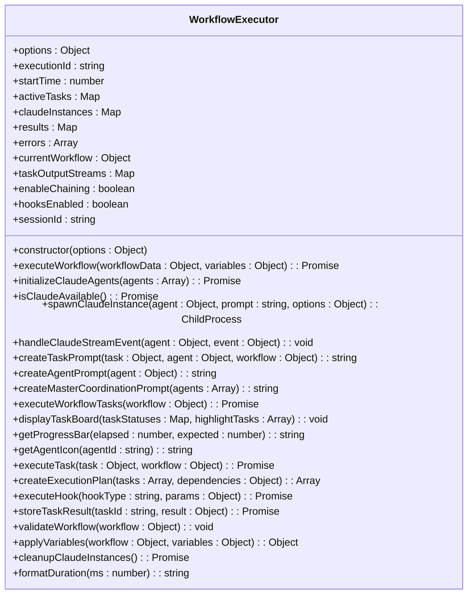
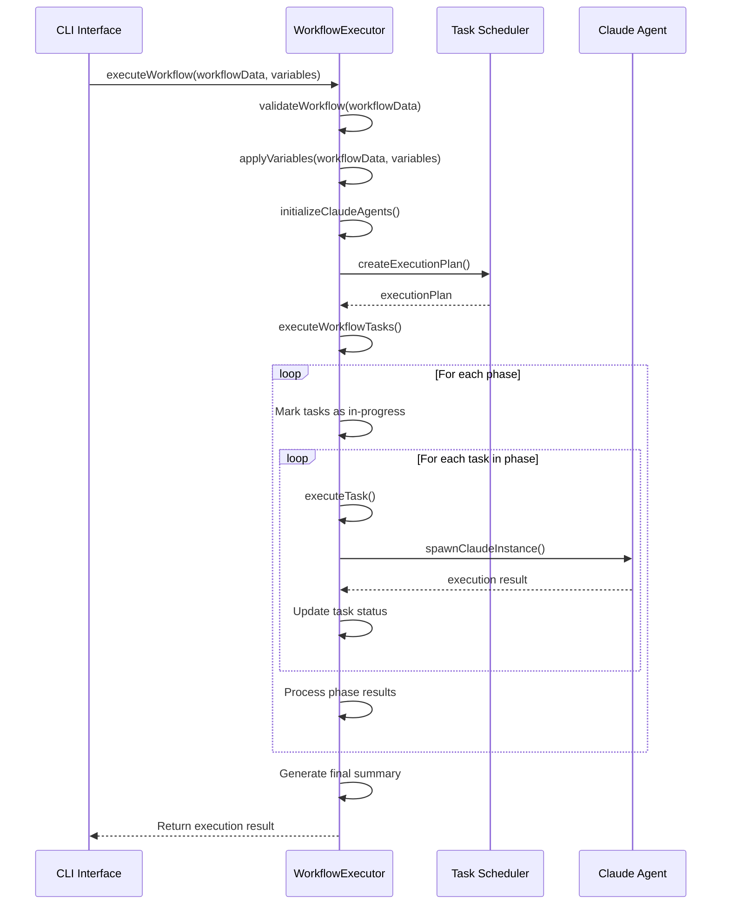
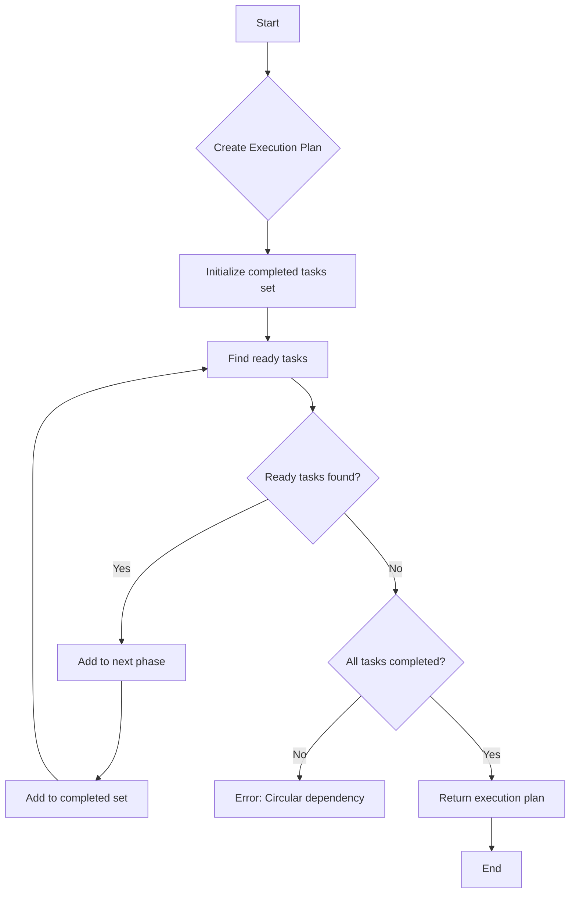
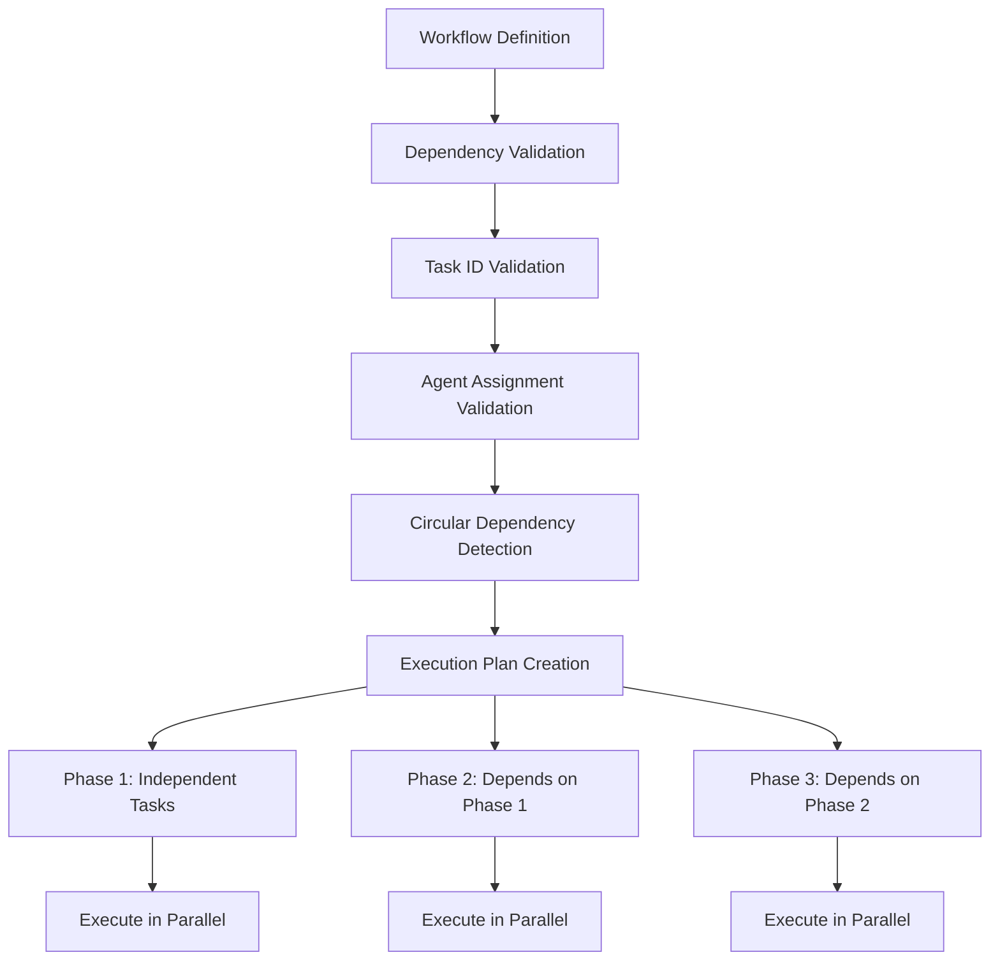

# Workflow Automation Tools

<cite>
**Referenced Files in This Document**   
- [workflow.ts](file://src/cli/commands/workflow.ts)
- [automation-executor.js](file://src/cli/simple-commands/automation-executor.js)
- [development-workflow.json](file://examples/development-workflow.json)
</cite>

## Table of Contents
1. [Introduction](#introduction)
2. [Project Structure](#project-structure)
3. [Core Components](#core-components)
4. [Architecture Overview](#architecture-overview)
5. [Detailed Component Analysis](#detailed-component-analysis)
6. [Dependency Analysis](#dependency-analysis)
7. [Performance Considerations](#performance-considerations)
8. [Troubleshooting Guide](#troubleshooting-guide)
9. [Conclusion](#conclusion)

## Introduction
Workflow Automation Tools are designed to orchestrate complex task sequences, manage dependencies, and ensure reliable execution across distributed agents. This document provides a comprehensive analysis of the workflow engine implementation, task scheduling mechanisms, and error recovery strategies as seen in the `automation-executor.js` and `workflow.ts` files. The system enables coordination of multi-phase development processes through well-defined workflow definitions, task dependencies, and state management. Configuration options for retry policies, timeout settings, and parallel execution limits are explored, along with resolution strategies for common integration issues such as circular dependencies.

## Project Structure
The project structure reveals a modular architecture focused on workflow orchestration and agent coordination. Key directories include `src/cli/commands` for workflow management interfaces, `src/cli/simple-commands` for core execution logic, and `examples` for workflow definition templates. The structure supports both interactive and non-interactive execution modes, with clear separation between command-line interfaces, execution engines, and configuration management.

**Diagram sources**
- [workflow.ts](file://src/cli/commands/workflow.ts)
- [automation-executor.js](file://src/cli/simple-commands/automation-executor.js)
- [development-workflow.json](file://examples/development-workflow.json)

**Section sources**
- [workflow.ts](file://src/cli/commands/workflow.ts)
- [automation-executor.js](file://src/cli/simple-commands/automation-executor.js)

## Core Components
The core components of the workflow automation system include the WorkflowExecutor class, workflow definition parser, task scheduler, and dependency manager. The WorkflowExecutor orchestrates the entire execution process, managing state transitions, agent coordination, and error handling. Workflow definitions are structured JSON objects that specify tasks, agents, dependencies, and execution settings. The task scheduler implements a phase-based execution model that respects dependency constraints while maximizing parallelism.

**Section sources**
- [automation-executor.js](file://src/cli/simple-commands/automation-executor.js#L21-L1513)
- [workflow.ts](file://src/cli/commands/workflow.ts#L200-L780)

## Architecture Overview
The workflow automation architecture follows a modular design with clear separation between the command interface, execution engine, and workflow definition layers. The system supports both interactive and non-interactive execution modes, with different coordination patterns for each. In interactive mode, a master coordinator agent manages all sub-agents through concurrent streams, while non-interactive mode spawns individual Claude instances for each task.

**Diagram sources**
- [automation-executor.js](file://src/cli/simple-commands/automation-executor.js#L21-L1513)
- [workflow.ts](file://src/cli/commands/workflow.ts#L200-L780)

## Detailed Component Analysis

### Workflow Executor Analysis
The WorkflowExecutor class serves as the central orchestration engine, managing the complete lifecycle of workflow execution from initialization to completion. It handles configuration, state tracking, agent management, and result aggregation.

#### Class Diagram

**Diagram sources**
- [automation-executor.js](file://src/cli/simple-commands/automation-executor.js#L21-L1513)

**Section sources**
- [automation-executor.js](file://src/cli/simple-commands/automation-executor.js#L21-L1513)

### Workflow Definition and Execution Analysis
The workflow execution system processes JSON-based workflow definitions that specify tasks, agents, dependencies, and execution settings. The system validates these definitions, resolves dependencies, and executes tasks in an optimized sequence.

#### Sequence Diagram

**Diagram sources**
- [automation-executor.js](file://src/cli/simple-commands/automation-executor.js#L21-L1513)
- [workflow.ts](file://src/cli/commands/workflow.ts#L200-L780)

### Task Scheduling and Dependency Management
The task scheduling system implements a phase-based execution model that maximizes parallelism while respecting dependency constraints. Tasks are grouped into phases based on their dependency relationships, with each phase containing tasks that can be executed concurrently.

#### Flowchart

**Diagram sources**
- [automation-executor.js](file://src/cli/simple-commands/automation-executor.js#L21-L1513)

**Section sources**
- [automation-executor.js](file://src/cli/simple-commands/automation-executor.js#L21-L1513)

## Dependency Analysis
The workflow system implements a comprehensive dependency management system that validates task dependencies, detects circular dependencies, and ensures proper execution ordering. The dependency graph is analyzed to create an optimal execution plan that maximizes parallelism while respecting dependency constraints.

**Diagram sources**
- [automation-executor.js](file://src/cli/simple-commands/automation-executor.js#L21-L1513)
- [workflow.ts](file://src/cli/commands/workflow.ts#L200-L780)

**Section sources**
- [automation-executor.js](file://src/cli/simple-commands/automation-executor.js#L21-L1513)
- [workflow.ts](file://src/cli/commands/workflow.ts#L200-L780)

## Performance Considerations
The workflow automation system incorporates several performance optimization strategies, including parallel execution, efficient resource management, and optimized I/O operations. The system supports configurable parallel execution limits through the `maxConcurrency` setting, allowing users to balance performance with resource utilization. For ML-intensive workflows, the system automatically increases timeout values to accommodate longer processing times.

The task scheduler implements a phase-based execution model that maximizes parallelism by grouping independent tasks into concurrent execution phases. Stream chaining is supported for workflows that require data to be passed between tasks, reducing I/O overhead and improving throughput. The system also implements efficient memory management through the use of Maps for tracking execution state, ensuring O(1) lookup times for task status queries.

## Troubleshooting Guide
Common issues in workflow automation typically involve configuration errors, dependency problems, and execution failures. The system provides comprehensive validation and error reporting to help diagnose and resolve these issues.

### Circular Dependencies
Circular dependencies occur when tasks depend on each other in a loop, preventing execution from starting. The system detects circular dependencies during workflow validation using a depth-first search algorithm with a recursion stack.

**Resolution Strategy:**
1. Review the workflow definition to identify the circular dependency chain
2. Restructure tasks to eliminate the circular reference
3. Consider combining interdependent tasks into a single task
4. Use intermediate outputs or shared state to break the dependency cycle

### Task Execution Failures
Task failures can occur due to various reasons including timeout, agent errors, or invalid configurations. The system supports configurable failure policies through the `failurePolicy` setting.

**Configuration Options:**
- **fail-fast**: Stop workflow execution immediately on first failure
- **continue**: Continue executing independent tasks after a failure
- **retry**: Automatically retry failed tasks with exponential backoff

**Error Recovery Mechanisms:**
1. Implement proper error handling in task definitions
2. Use appropriate timeout values for different task types
3. Configure retry policies based on task criticality
4. Monitor execution logs for early detection of issues

**Section sources**
- [automation-executor.js](file://src/cli/simple-commands/automation-executor.js#L21-L1513)
- [workflow.ts](file://src/cli/commands/workflow.ts#L200-L780)

## Conclusion
The Workflow Automation Tools provide a robust framework for orchestrating complex task sequences across distributed agents. The system combines a flexible workflow definition model with sophisticated dependency management and execution optimization. Key features include support for both interactive and non-interactive execution modes, comprehensive error handling, and performance optimization through parallel execution. The architecture enables reliable automation of multi-phase development processes, making it suitable for complex software engineering workflows. Future enhancements could include more sophisticated retry strategies, improved resource allocation algorithms, and enhanced monitoring capabilities.