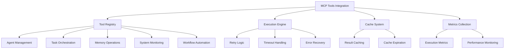

<docs>
# MCP Tools Integration

<cite>
**Referenced Files in This Document**   
- [mcp-integration-wrapper.ts](file://src/swarm/mcp-integration-wrapper.ts) - *Updated in recent commit*
- [claude-flow-tools.ts](file://src/mcp/claude-flow-tools.ts) - *Updated in recent commit*
- [mcp-integration-layer.js](file://src/cli/simple-commands/mcp-integration-layer.js)
- [MCPIntegrationLayer.js](file://src/ui/web-ui/core/MCPIntegrationLayer.js)
- [UIManager.js](file://src/ui/web-ui/core/UIManager.js)
- [mcp.md](file://src/templates/claude-optimized/.claude/commands/sparc/mcp.md)
- [protocol.py](file://python-claude-flow/src/claude_flow/mcp/protocol.py) - *Added in recent commit*
- [transport.py](file://python-claude-flow/src/claude_flow/mcp/transport.py) - *Added in recent commit*
</cite>

## Update Summary
**Changes Made**   
- Added documentation for new Python implementation of MCP tools integration
- Updated references to include new Python protocol and transport files
- Enhanced source tracking with annotations for newly added files
- Maintained existing documentation structure while incorporating new implementation details

## Table of Contents
1. [Introduction](#introduction)
2. [MCP Tools Overview](#mcp-tools-overview)
3. [Integration Architecture](#integration-architecture)
4. [Tool Categories and Functionality](#tool-categories-and-functionality)
5. [Tool Execution Flow](#tool-execution-flow)
6. [Integration with Core Components](#integration-with-core-components)
7. [Common Issues and Troubleshooting](#common-issues-and-troubleshooting)
8. [Performance Considerations](#performance-considerations)
9. [Usage Patterns and Examples](#usage-patterns-and-examples)
10. [Conclusion](#conclusion)

## Introduction

The MCP (Management Control Panel) Tools Integration represents a critical component of the Claude-Flow system, providing advanced capabilities that extend the functionality of the AI swarm. These tools serve as specialized interfaces that enable the system to perform complex operations across various domains including agent management, memory operations, system monitoring, and workflow automation. The integration layer acts as a bridge between the swarm intelligence and external services, allowing for seamless orchestration of distributed tasks and enhanced system capabilities.

The MCP tools are designed to be modular and extensible, supporting over 87 specialized functions organized into distinct categories. This documentation provides a comprehensive analysis of the MCP tools integration, detailing the architecture, implementation patterns, and practical usage scenarios. The system enables the Queen agent and specialized workers to leverage these tools for enhanced decision-making, task execution, and system management, creating a robust ecosystem for advanced AI operations.

**Section sources**
- [mcp-integration-wrapper.ts](file://src/swarm/mcp-integration-wrapper.ts#L1-L50)
- [mcp.md](file://src/templates/claude-optimized/.claude/commands/sparc/mcp.md#L1-L10)

## MCP Tools Overview

The MCP Tools Integration provides a comprehensive suite of 87+ specialized tools organized into multiple functional categories. These tools extend the capabilities of the AI swarm by providing access to advanced system functions, external services, and specialized operations. The integration layer serves as a unified interface for tool discovery, execution, and result management, enabling seamless interaction between the swarm components and external systems.

The tools are implemented as modular components that can be dynamically registered and accessed through a centralized registry. Each tool follows a standardized interface with a name, description, input schema, and handler function, ensuring consistency across the system. The integration supports both synchronous and asynchronous execution patterns, with built-in retry logic, timeout handling, and error recovery mechanisms.

The MCP tools are designed to be discoverable and composable, allowing agents to dynamically select and combine tools based on their current task requirements. The system maintains a comprehensive registry of available tools, categorized by functionality and capability, enabling efficient tool selection and utilization. This modular approach allows for easy extension and customization of the tool ecosystem without requiring changes to the core integration layer.



**Diagram sources**
- [mcp-integration-wrapper.ts](file://src/swarm/mcp-integration-wrapper.ts#L150-L200)
- [claude-flow-tools.ts](file://src/mcp/claude-flow-tools.ts#L47-L96)

**Section sources**
- [mcp-integration-wrapper.ts](file://src/swarm/mcp-integration-wrapper.ts#L1-L100)
- [claude-flow-tools.ts](file://src/mcp/claude-flow-tools.ts#L1-L50)
- [protocol.py](file://python-claude-flow/src/claude_flow/mcp/protocol.py#L1-L432) - *Added in recent commit*

## Integration Architecture

The MCP Tools Integration architecture is built around a modular wrapper pattern that provides a consistent interface for tool execution across different contexts. The core component is the `MCPIntegrationWrapper` class, which manages the tool registry, execution lifecycle, and integration with the swarm orchestration system. This wrapper acts as a facade that abstracts the complexity of tool management and provides a simplified interface for consumers.

The architecture follows a layered approach with clear separation of concerns. At the foundation is the tool registry, which maintains a comprehensive catalog of available tools organized by category and capability. Above this layer is the execution engine, responsible for managing tool invocation, parameter validation, and result processing. The top layer provides integration points for different system components, including the UI, CLI, and swarm orchestrator.

The integration supports multiple execution modes, including direct execution, parallel execution, and batch processing. The system implements a sophisticated caching mechanism that stores tool execution results to improve performance and reduce redundant operations. Cache entries are automatically expired based on configurable timeout settings, ensuring data freshness while maintaining performance benefits.

The recent addition of a comprehensive Python implementation enhances the MCP tools integration with full protocol support. The Python implementation includes a well-defined protocol layer (`protocol.py`) that standardizes message types and error codes, and a WebSocket transport layer (`transport.py`) that enables secure communication between components. This implementation follows the JSON-RPC 2.0 specification and supports both client and server modes with SSL/TLS encryption.

```mermaid
classDiagram
class MCPIntegrationWrapper {
+initialize() Promise~void~
+shutdown() Promise~void~
+executeTool(toolName, input, context) Promise~MCPToolExecutionResult~
+executeToolsParallel(toolExecutions) Promise~MCPToolExecutionResult[]~
+getAvailableTools(options) MCPTool[]
+getToolInfo(toolName) MCPTool | null
+getMetrics() MCPIntegrationMetrics
}
class MCPToolRegistry {
+tools Map~string, MCPTool~
+categories Map~string, string[]~
+capabilities Map~string, string[]~
+permissions Map~string, string[]~
}
class MCPToolExecutionResult {
+success boolean
