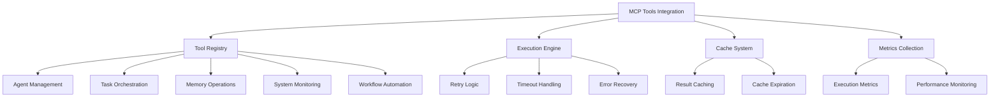
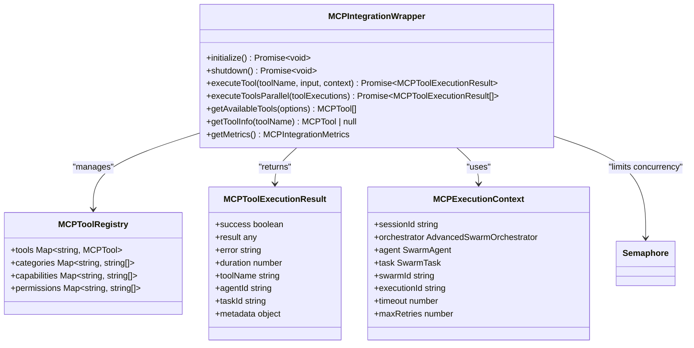
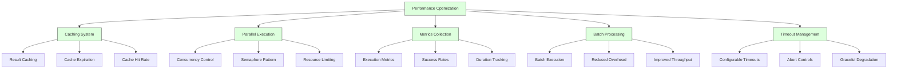
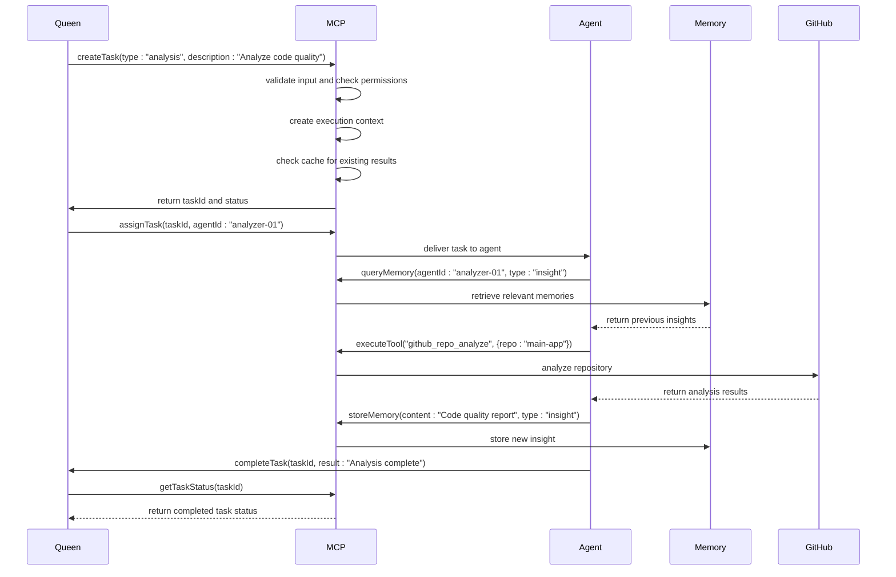

# MCP Tools Integration

<cite>
**Referenced Files in This Document**   
- [mcp-integration-wrapper.ts](file://src/swarm/mcp-integration-wrapper.ts)
- [claude-flow-tools.ts](file://src/mcp/claude-flow-tools.ts)
- [mcp-integration-layer.js](file://src/cli/simple-commands/mcp-integration-layer.js)
- [MCPIntegrationLayer.js](file://src/ui/web-ui/core/MCPIntegrationLayer.js)
- [UIManager.js](file://src/ui/web-ui/core/UIManager.js)
- [mcp.md](file://src/templates/claude-optimized/.claude/commands/sparc/mcp.md)
</cite>

## Table of Contents
1. [Introduction](#introduction)
2. [MCP Tools Overview](#mcp-tools-overview)
3. [Integration Architecture](#integration-architecture)
4. [Tool Categories and Functionality](#tool-categories-and-functionality)
5. [Tool Execution Flow](#tool-execution-flow)
6. [Integration with Core Components](#integration-with-core-components)
7. [Common Issues and Troubleshooting](#common-issues-and-troubleshooting)
8. [Performance Considerations](#performance-considerations)
9. [Usage Patterns and Examples](#usage-patterns-and-examples)
10. [Conclusion](#conclusion)

## Introduction

The MCP (Management Control Panel) Tools Integration represents a critical component of the Claude-Flow system, providing advanced capabilities that extend the functionality of the AI swarm. These tools serve as specialized interfaces that enable the system to perform complex operations across various domains including agent management, memory operations, system monitoring, and workflow automation. The integration layer acts as a bridge between the swarm intelligence and external services, allowing for seamless orchestration of distributed tasks and enhanced system capabilities.

The MCP tools are designed to be modular and extensible, supporting over 87 specialized functions organized into distinct categories. This documentation provides a comprehensive analysis of the MCP tools integration, detailing the architecture, implementation patterns, and practical usage scenarios. The system enables the Queen agent and specialized workers to leverage these tools for enhanced decision-making, task execution, and system management, creating a robust ecosystem for advanced AI operations.

**Section sources**
- [mcp-integration-wrapper.ts](file://src/swarm/mcp-integration-wrapper.ts#L1-L50)
- [mcp.md](file://src/templates/claude-optimized/.claude/commands/sparc/mcp.md#L1-L10)

## MCP Tools Overview

The MCP Tools Integration provides a comprehensive suite of 87+ specialized tools organized into multiple functional categories. These tools extend the capabilities of the AI swarm by providing access to advanced system functions, external services, and specialized operations. The integration layer serves as a unified interface for tool discovery, execution, and result management, enabling seamless interaction between the swarm components and external systems.

The tools are implemented as modular components that can be dynamically registered and accessed through a centralized registry. Each tool follows a standardized interface with a name, description, input schema, and handler function, ensuring consistency across the system. The integration supports both synchronous and asynchronous execution patterns, with built-in retry logic, timeout handling, and error recovery mechanisms.

The MCP tools are designed to be discoverable and composable, allowing agents to dynamically select and combine tools based on their current task requirements. The system maintains a comprehensive registry of available tools, categorized by functionality and capability, enabling efficient tool selection and utilization. This modular approach allows for easy extension and customization of the tool ecosystem without requiring changes to the core integration layer.



**Diagram sources**
- [mcp-integration-wrapper.ts](file://src/swarm/mcp-integration-wrapper.ts#L150-L200)
- [claude-flow-tools.ts](file://src/mcp/claude-flow-tools.ts#L47-L96)

**Section sources**
- [mcp-integration-wrapper.ts](file://src/swarm/mcp-integration-wrapper.ts#L1-L100)
- [claude-flow-tools.ts](file://src/mcp/claude-flow-tools.ts#L1-L50)

## Integration Architecture

The MCP Tools Integration architecture is built around a modular wrapper pattern that provides a consistent interface for tool execution across different contexts. The core component is the `MCPIntegrationWrapper` class, which manages the tool registry, execution lifecycle, and integration with the swarm orchestration system. This wrapper acts as a facade that abstracts the complexity of tool management and provides a simplified interface for consumers.

The architecture follows a layered approach with clear separation of concerns. At the foundation is the tool registry, which maintains a comprehensive catalog of available tools organized by category and capability. Above this layer is the execution engine, responsible for managing tool invocation, parameter validation, and result processing. The top layer provides integration points for different system components, including the UI, CLI, and swarm orchestrator.

The integration supports multiple execution modes, including direct execution, parallel execution, and batch processing. The system implements a sophisticated caching mechanism that stores tool execution results to improve performance and reduce redundant operations. Cache entries are automatically expired based on configurable timeout settings, ensuring data freshness while maintaining performance benefits.



**Diagram sources**
- [mcp-integration-wrapper.ts](file://src/swarm/mcp-integration-wrapper.ts#L100-L150)
- [mcp-integration-wrapper.ts](file://src/swarm/mcp-integration-wrapper.ts#L200-L250)

**Section sources**
- [mcp-integration-wrapper.ts](file://src/swarm/mcp-integration-wrapper.ts#L1-L300)

## Tool Categories and Functionality

The MCP tools are organized into several functional categories, each addressing specific aspects of system operation and agent capabilities. These categories include neural processing, cognitive functions, memory management, performance monitoring, workflow automation, GitHub integration, and Dynamic Agent Architecture (DAA) operations. Each category contains specialized tools designed to perform specific tasks within their domain.

The agent management category includes tools for spawning, terminating, and monitoring agents, enabling dynamic scaling of the swarm based on workload requirements. Task orchestration tools provide capabilities for creating, assigning, and tracking tasks across the swarm, ensuring efficient workload distribution. Memory operations tools enable persistent storage and retrieval of agent memories, supporting long-term learning and context preservation.

System monitoring tools provide comprehensive insights into system performance, resource utilization, and health status, enabling proactive issue detection and resolution. Workflow automation tools support the creation and execution of complex workflows, allowing for the composition of multiple operations into cohesive processes. GitHub integration tools facilitate seamless interaction with GitHub repositories, enabling automated code reviews, issue tracking, and release coordination.

```mermaid
graph TD
A[Tool Categories] --> B[Agent Management]
A --> C[Task Orchestration]
A --> D[Memory Operations]
A --> E[System Monitoring]
A --> F[Workflow Automation]
A --> G[GitHub Integration]
A --> H[DAA Operations]
B --> B1[Spawn Agent]
B --> B2[Terminate Agent]
B --> B3[List Agents]
B --> B4[Agent Info]
C --> C1[Create Task]
C --> C2[Assign Task]
C --> C3[Task Status]
C --> C4[Cancel Task]
D --> D1[Query Memory]
D --> D2[Store Memory]
D --> D3[Delete Memory]
D --> D4[Export Memory]
D --> D5[Import Memory]
E --> E1[System Status]
E --> E2[Metrics]
E --> E3[Health Check]
F --> F1[Execute Workflow]
F --> F2[Create Workflow]
F --> F3[List Workflows]
G --> G1[Repo Analysis]
G --> G2[PR Management]
G --> G3[Issue Tracking]
G --> G4[Code Review]
H --> H1[Agent Creation]
H --> H2[Resource Allocation]
H --> H3[Lifecycle Management]
H --> H4[Communication]
```



**Diagram sources**
- [claude-flow-tools.ts](file://src/mcp/claude-flow-tools.ts#L47-L96)
- [mcp-integration-wrapper.ts](file://src/swarm/mcp-integration-wrapper.ts#L400-L450)

**Section sources**
- [claude-flow-tools.ts](file://src/mcp/claude-flow-tools.ts#L1-L100)
- [mcp-integration-wrapper.ts](file://src/swarm/mcp-integration-wrapper.ts#L400-L500)

## Tool Execution Flow

The tool execution flow in the MCP integration follows a well-defined sequence of steps that ensures reliable and efficient tool invocation. When a tool execution request is received, the system first validates the request parameters against the tool's input schema, ensuring that all required fields are present and properly formatted. The system then checks the execution context to verify that the requesting agent has the necessary permissions to execute the requested tool.

If result caching is enabled, the system first checks the cache for a valid result before proceeding with execution. This optimization prevents redundant operations and improves overall system performance. If no cached result is available, the system creates a new execution context with a unique execution ID and establishes timeout and abort controls to prevent runaway operations.

The actual tool execution is wrapped in a retry mechanism that automatically handles transient failures. The system implements exponential backoff between retry attempts, with configurable maximum retry limits. After successful execution, the result is stored in the cache (if enabled) and metrics are updated to reflect the execution outcome. The final result is then returned to the caller with comprehensive metadata including execution duration, timestamp, and success status.

```mermaid
sequenceDiagram
participant Caller
participant MCPWrapper
participant ToolRegistry
participant Cache
participant ToolHandler
Caller->>MCPWrapper : executeTool(toolName, input, context)
MCPWrapper->>MCPWrapper : Validate input against schema
MCPWrapper->>MCPWrapper : Check agent permissions
MCPWrapper->>Cache : Check for cached result
alt Cached result available
Cache-->>MCPWrapper : Return cached result
MCPWrapper-->>Caller : Return result
else No cached result
MCPWrapper->>MCPWrapper : Create execution context
MCPWrapper->>MCPWrapper : Set up timeout and abort controls
loop Retry attempts
MCPWrapper->>ToolRegistry : Get tool handler
MCPWrapper->>ToolHandler : Execute tool with input and context
alt Execution successful
ToolHandler-->>MCPWrapper : Return result
break Success
else Execution failed
MCPWrapper->>MCPWrapper : Log warning and wait for backoff
end
end
MCPWrapper->>Cache : Store result in cache
MCPWrapper->>MCPWrapper : Update execution metrics
MCPWrapper-->>Caller : Return result
end
```

**Diagram sources**
- [mcp-integration-wrapper.ts](file://src/swarm/mcp-integration-wrapper.ts#L200-L300)
- [mcp-integration-wrapper.ts](file://src/swarm/mcp-integration-wrapper.ts#L500-L600)

**Section sources**
- [mcp-integration-wrapper.ts](file://src/swarm/mcp-integration-wrapper.ts#L200-L600)

## Integration with Core Components

The MCP tools integration is tightly coupled with several core components of the Claude-Flow system, including the Queen agent, specialized workers, and the memory system. The Queen agent serves as the primary orchestrator of MCP tool usage, making strategic decisions about which tools to employ based on the current task requirements and system state. Specialized workers leverage MCP tools to perform their specific functions, accessing domain-specific capabilities through the standardized tool interface.

The memory system integration is particularly important, as MCP tools provide both direct access to memory operations and indirect influence on memory content through their execution results. When a tool is executed, its results are automatically stored in the memory system with appropriate metadata, creating a persistent record of system operations. This integration enables agents to build upon previous tool executions and maintain context across multiple interactions.

The integration layer also provides event-driven communication between components, emitting events when tools are executed or fail. These events can be subscribed to by other system components, enabling reactive behaviors and real-time monitoring. The UI components leverage these events to provide live updates on tool execution status, while monitoring systems use them to track system health and performance metrics.

```mermaid
flowchart TD
A[Queen Agent] --> |Orchestrates| B[MCP Integration Layer]
C[Specialized Workers] --> |Utilize| B
D[Memory System] < --> |Store/Retrieve| B
B --> |Emits Events| E[Event Bus]
E --> F[UI Components]
E --> G[Monitoring System]
E --> H[Logging System]
B --> |Stores Results| D
B --> |Retrieves Context| D
I[Configuration System] --> |Provides Settings| B
J[Authentication System] --> |Verifies Permissions| B
style A fill:#f9f,stroke:#333
style C fill:#f9f,stroke:#333
style D fill:#bbf,stroke:#333
style B fill:#f96,stroke:#333
style E fill:#6f9,stroke:#333
```

**Diagram sources**
- [mcp-integration-wrapper.ts](file://src/swarm/mcp-integration-wrapper.ts#L1-L100)
- [UIManager.js](file://src/ui/web-ui/core/UIManager.js#L327-L375)
- [MCPIntegrationLayer.js](file://src/ui/web-ui/core/MCPIntegrationLayer.js#L369-L419)

**Section sources**
- [mcp-integration-wrapper.ts](file://src/swarm/mcp-integration-wrapper.ts#L1-L100)
- [UIManager.js](file://src/ui/web-ui/core/UIManager.js#L327-L375)
- [MCPIntegrationLayer.js](file://src/ui/web-ui/core/MCPIntegrationLayer.js#L369-L419)

## Common Issues and Troubleshooting

Several common issues can arise when working with the MCP tools integration, primarily related to configuration, permissions, and execution failures. One frequent issue is tool availability, where the MCP server is not properly initialized or the required tools are not registered in the system. This typically manifests as "Tool not found" errors when attempting to execute a specific tool.

Permission-related issues occur when an agent attempts to execute a tool for which it lacks the necessary permissions. The system implements a capability-based permission model, where agents must possess specific capabilities to access certain tools. These issues can be diagnosed by checking the agent's capability list and comparing it with the required permissions for the target tool.

Execution failures can stem from various causes, including invalid input parameters, system timeouts, or transient service issues. The integration layer provides comprehensive error handling with detailed error messages and retry mechanisms. For persistent failures, the system logs detailed execution information that can be used for debugging. Monitoring the execution metrics and cache hit rates can also help identify performance bottlenecks and optimization opportunities.

```mermaid
flowchart TD
A[Common Issues] --> B[Tool Not Found]
A --> C[Permission Denied]
A --> D[Execution Timeout]
A --> E[Invalid Parameters]
A --> F[Caching Issues]
B --> B1[Check MCP server status]
B --> B2[Verify tool registration]
B --> B3[Validate configuration]
C --> C1[Check agent capabilities]
C --> C2[Verify tool permissions]
C --> C3[Review role assignments]
D --> D1[Increase timeout setting]
D --> D2[Optimize tool performance]
D --> D3[Check system resources]
E --> E1[Validate input schema]
E --> E2[Check parameter types]
E --> E3[Review required fields]
F --> F1[Verify cache configuration]
F --> F2[Check cache expiration]
F --> F3[Monitor cache hit rate]
style A fill:#fdd,stroke:#333
style B fill:#fdd,stroke:#333
style C fill:#fdd,stroke:#333
style D fill:#fdd,stroke:#333
style E fill:#fdd,stroke:#333
style F fill:#fdd,stroke:#333
```



**Diagram sources**
- [mcp-integration-wrapper.ts](file://src/swarm/mcp-integration-wrapper.ts#L600-L700)
- [mcp-integration-layer.js](file://src/cli/simple-commands/mcp-integration-layer.js#L147-L193)

**Section sources**
- [mcp-integration-wrapper.ts](file://src/swarm/mcp-integration-wrapper.ts#L600-L700)
- [mcp-integration-layer.js](file://src/cli/simple-commands/mcp-integration-layer.js#L147-L193)

## Performance Considerations

The MCP tools integration incorporates several performance optimization strategies to ensure efficient operation in high-load scenarios. The caching system plays a crucial role in performance optimization by storing the results of expensive operations and serving them on subsequent requests. The cache uses a time-based expiration policy, with configurable timeout settings that balance data freshness with performance benefits.

Parallel execution is supported for scenarios where multiple tools need to be invoked simultaneously. The system implements a semaphore-based concurrency control mechanism that limits the number of concurrent executions to prevent resource exhaustion. This allows for efficient utilization of system resources while maintaining stability under heavy load.

The integration also includes comprehensive metrics collection that tracks key performance indicators such as execution duration, success rates, and cache hit ratios. These metrics can be used to identify performance bottlenecks and optimize tool usage patterns. The system supports configurable timeout settings for individual tools, preventing long-running operations from impacting overall system responsiveness.

For high-throughput scenarios, the batch processing capabilities allow multiple tool executions to be grouped and processed efficiently. This reduces overhead and improves overall throughput, particularly for operations that involve external service calls or database operations.



**Diagram sources**
- [mcp-integration-wrapper.ts](file://src/swarm/mcp-integration-wrapper.ts#L265-L313)
- [mcp-integration-wrapper.ts](file://src/swarm/mcp-integration-wrapper.ts#L700-L800)

**Section sources**
- [mcp-integration-wrapper.ts](file://src/swarm/mcp-integration-wrapper.ts#L265-L313)
- [mcp-integration-wrapper.ts](file://src/swarm/mcp-integration-wrapper.ts#L700-L800)

## Usage Patterns and Examples

The MCP tools integration supports several common usage patterns that address different operational scenarios. One prevalent pattern is the agent lifecycle management workflow, where tools are used to spawn specialized agents, assign tasks to them, monitor their status, and terminate them when their work is complete. This pattern enables dynamic scaling of the swarm based on workload requirements.

Another common pattern is the memory-augmented decision making process, where agents query the memory system for relevant context before making decisions or taking actions. This pattern leverages the memory query and store tools to create a continuous learning loop, where each interaction contributes to the system's collective knowledge base.

The workflow automation pattern combines multiple tools into cohesive processes that accomplish complex objectives. For example, a deployment workflow might combine GitHub integration tools with system monitoring tools to automate the entire deployment process from code commit to production release. These workflows can be triggered automatically based on specific conditions or executed on demand.



**Diagram sources**
- [claude-flow-tools.ts](file://src/mcp/claude-flow-tools.ts#L47-L96)
- [mcp-integration-wrapper.ts](file://src/swarm/mcp-integration-wrapper.ts#L200-L300)

**Section sources**
- [claude-flow-tools.ts](file://src/mcp/claude-flow-tools.ts#L47-L96)
- [mcp-integration-wrapper.ts](file://src/swarm/mcp-integration-wrapper.ts#L200-L300)

## Conclusion

The MCP Tools Integration represents a sophisticated and comprehensive system for extending the capabilities of the Claude-Flow AI swarm. By providing over 87 specialized tools across multiple functional categories, the integration enables advanced operations in agent management, task orchestration, memory operations, system monitoring, and workflow automation. The modular architecture and standardized interface make it easy to extend and customize the tool ecosystem while maintaining consistency and reliability.

The integration's robust execution model, with built-in retry logic, timeout handling, and error recovery, ensures reliable operation even in challenging conditions. The caching system and parallel execution capabilities provide significant performance benefits, while the comprehensive metrics collection enables continuous optimization and monitoring. The tight integration with core components like the Queen agent, specialized workers, and memory system creates a cohesive ecosystem where tools can be leveraged effectively to accomplish complex objectives.

As the system continues to evolve, the MCP tools integration provides a solid foundation for adding new capabilities and enhancing existing ones. The extensible architecture supports the addition of new tool categories and integration with external services, ensuring that the system can adapt to changing requirements and emerging technologies. This integration represents a critical component of the overall Claude-Flow system, enabling sophisticated AI operations and advanced swarm intelligence capabilities.

**Section sources**
- [mcp-integration-wrapper.ts](file://src/swarm/mcp-integration-wrapper.ts#L1-L860)
- [claude-flow-tools.ts](file://src/mcp/claude-flow-tools.ts#L1-L1324)