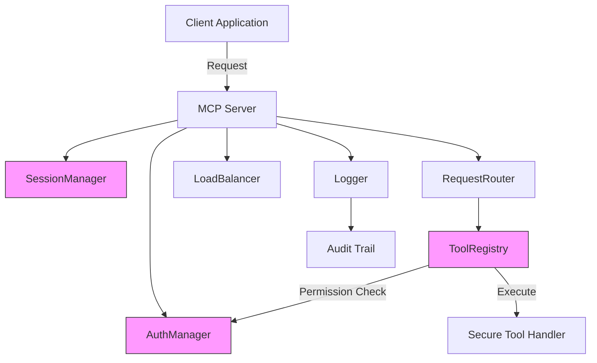
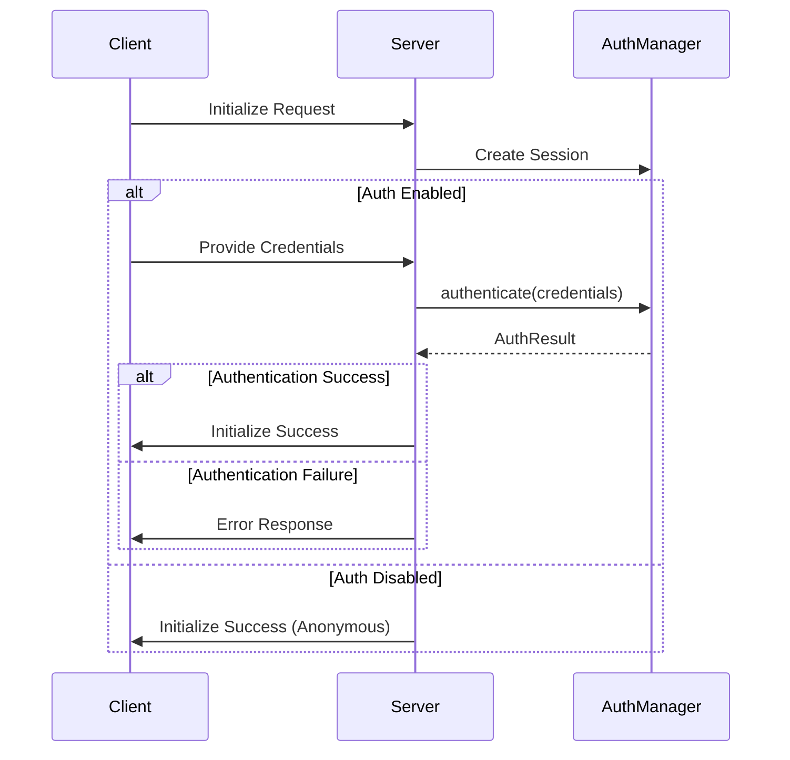
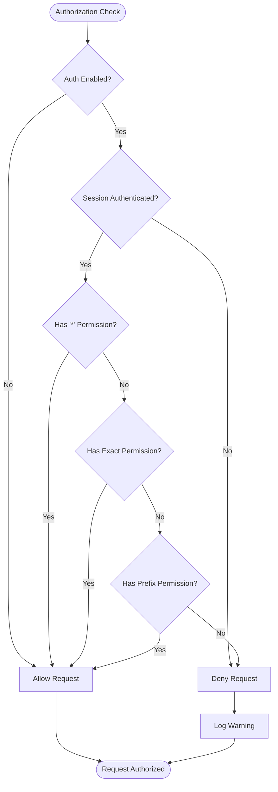
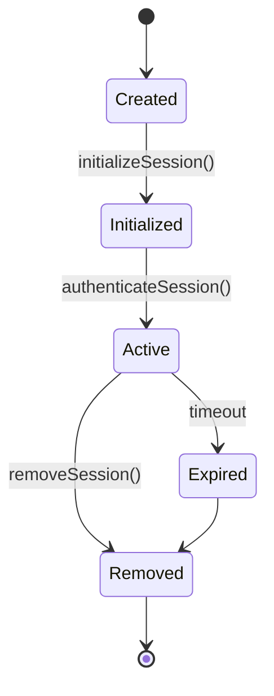
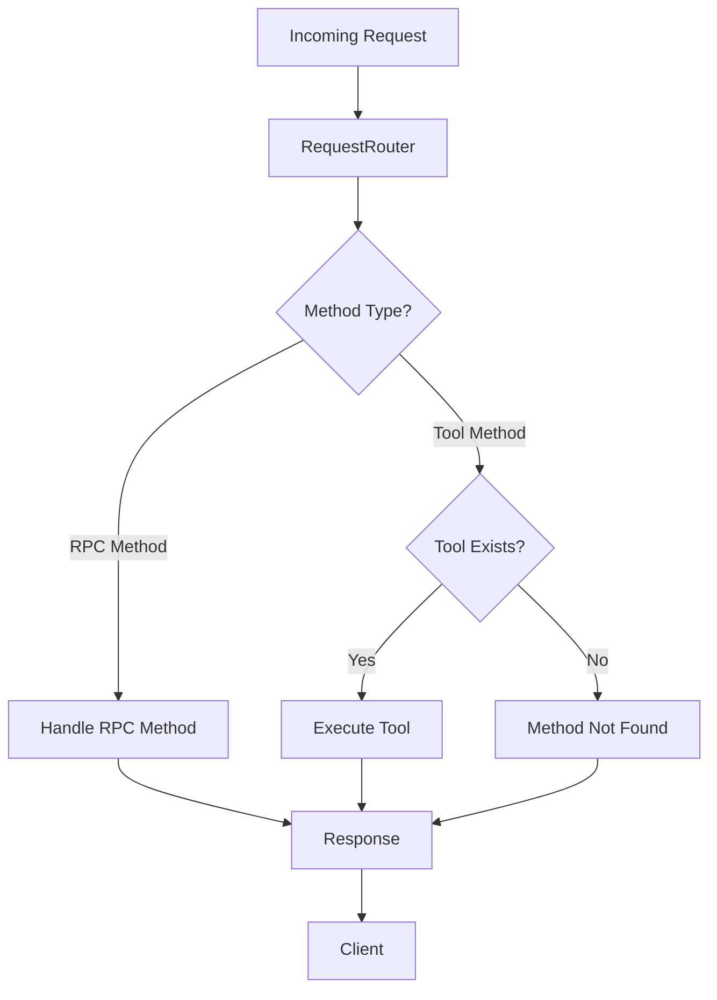
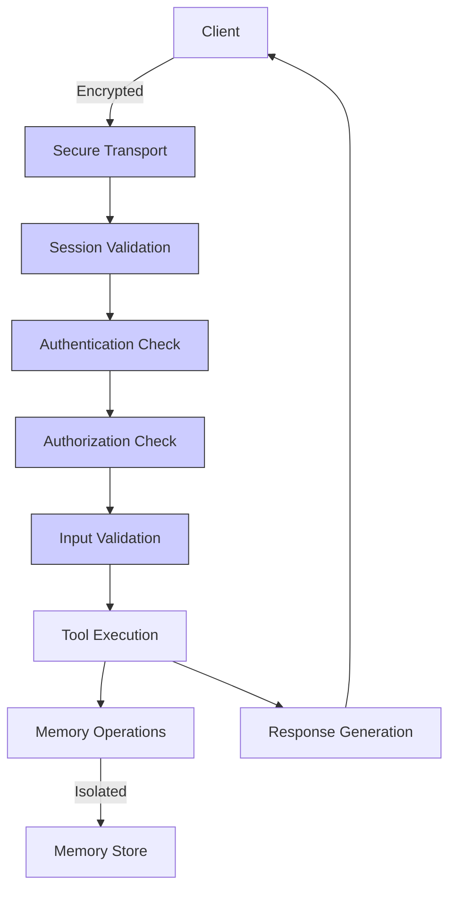
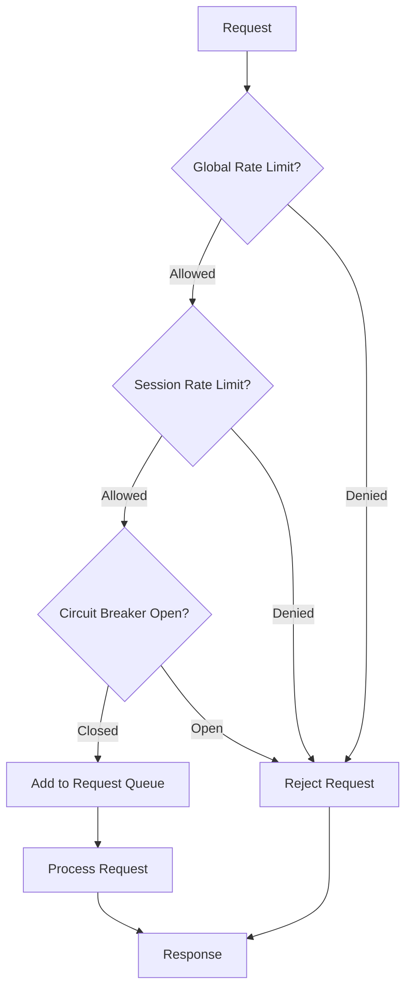

# Security Considerations

<cite>
**Referenced Files in This Document**   
- [auth.ts](file://src/mcp/auth.ts)
- [session-manager.ts](file://src/mcp/session-manager.ts)
- [server.ts](file://src/mcp/server.ts)
- [tools.ts](file://src/mcp/tools.ts)
- [router.ts](file://src/mcp/router.ts)
- [load-balancer.ts](file://src/mcp/load-balancer.ts)
- [deepwiki-config.json](file://src/mcp/config/deepwiki-config.json)
</cite>

## Table of Contents
1. [Security Model Overview](#security-model-overview)
2. [Authentication Mechanisms](#authentication-mechanisms)
3. [Authorization and Permission Controls](#authorization-and-permission-controls)
4. [Session Management](#session-management)
5. [Tool Invocation Security](#tool-invocation-security)
6. [Data Protection and Memory Isolation](#data-protection-and-memory-isolation)
7. [Audit Logging and Monitoring](#audit-logging-and-monitoring)
8. [Risk Mitigation Strategies](#risk-mitigation-strategies)
9. [Performance Considerations](#performance-considerations)

## Security Model Overview

The MCP (Model Context Protocol) security framework in Claude-Flow implements a comprehensive, multi-layered security model designed to protect against unauthorized access, privilege escalation, data leakage, and injection attacks. The system enforces strict authentication, authorization, and audit controls across all tool invocations and agent interactions.

The security architecture is built around three core components:
- **Authentication Manager**: Handles credential validation and token management
- **Session Manager**: Manages client sessions with timeout and activity tracking
- **Tool Registry**: Enforces permission checks and input validation for tool execution

These components work in concert with the Queen agent's decision-making process, ensuring that only authorized operations are permitted based on the agent's role and context.



**Diagram sources**
- [server.ts](file://src/mcp/server.ts#L1-L100)
- [auth.ts](file://src/mcp/auth.ts#L1-L50)
- [session-manager.ts](file://src/mcp/session-manager.ts#L1-L50)
- [tools.ts](file://src/mcp/tools.ts#L1-L50)

## Authentication Mechanisms

The MCP system implements multiple authentication methods through the `AuthManager` class, providing flexibility while maintaining security standards. Authentication is configurable via the MCP configuration system and can be enabled or disabled based on deployment requirements.

### Supported Authentication Methods

The system supports three primary authentication methods:

1. **Token-based Authentication**: Uses secure, cryptographically generated tokens with configurable expiration
2. **Basic Authentication**: Username/password credentials with secure password hashing
3. **OAuth Integration**: Placeholder for future OAuth 2.0 and OpenID Connect support

When authentication is disabled (development mode), the system operates in anonymous mode with full permissions.



**Diagram sources**
- [auth.ts](file://src/mcp/auth.ts#L100-L300)
- [session-manager.ts](file://src/mcp/session-manager.ts#L200-L300)
- [server.ts](file://src/mcp/server.ts#L400-L500)

**Section sources**
- [auth.ts](file://src/mcp/auth.ts#L1-L446)
- [session-manager.ts](file://src/mcp/session-manager.ts#L1-L416)

### Token Generation and Validation

The `AuthManager` implements secure token generation using cryptographically strong random values combined with SHA-256 hashing:

```typescript
private createSecureToken(): string {
  const timestamp = Date.now().toString(36);
  const random1 = Math.random().toString(36).substring(2, 15);
  const random2 = Math.random().toString(36).substring(2, 15);
  const hash = createHash('sha256')
    .update(`${timestamp}${random1}${random2}`)
    .digest('hex')
    .substring(0, 32);

  return `mcp_${timestamp}_${hash}`;
}
```

Tokens are stored in memory with expiration timestamps and can be revoked immediately. The system uses timing-safe comparison functions to prevent timing attacks during token validation.

### Password Security

For basic authentication, passwords are hashed using SHA-256:

```typescript
private hashPassword(password: string): string {
  return createHash('sha256').update(password).digest('hex');
}
```

Note: The code includes a comment indicating that in production environments, stronger password hashing algorithms like bcrypt should be implemented.

## Authorization and Permission Controls

The MCP security framework implements a robust authorization system based on fine-grained permissions and role-based access control (RBAC). Permissions are defined as string constants and organized by functional categories.

### Permission System Architecture

The permission system is defined in the `Permissions` constant within `auth.ts`:

```typescript
export const Permissions = {
  // System operations
  SYSTEM_INFO: 'system.info',
  SYSTEM_HEALTH: 'system.health',
  SYSTEM_METRICS: 'system.metrics',

  // Tool operations
  TOOLS_LIST: 'tools.list',
  TOOLS_INVOKE: 'tools.invoke',
  TOOLS_DESCRIBE: 'tools.describe',

  // Agent operations
  AGENTS_LIST: 'agents.list',
  AGENTS_SPAWN: 'agents.spawn',
  AGENTS_TERMINATE: 'agents.terminate',
  AGENTS_INFO: 'agents.info',

  // Task operations
  TASKS_LIST: 'tasks.list',
  TASKS_CREATE: 'tasks.create',
  TASKS_CANCEL: 'tasks.cancel',
  TASKS_STATUS: 'tasks.status',

  // Memory operations
  MEMORY_READ: 'memory.read',
  MEMORY_WRITE: 'memory.write',
  MEMORY_QUERY: 'memory.query',
  MEMORY_DELETE: 'memory.delete',

  // Administrative operations
  ADMIN_CONFIG: 'admin.config',
  ADMIN_LOGS: 'admin.logs',
  ADMIN_SESSIONS: 'admin.sessions',

  // Wildcard permission
  ALL: '*',
} as const;
```

### Authorization Logic

The `authorize` method in `AuthManager` implements a hierarchical permission check:

1. If authentication is disabled, all requests are authorized
2. If the user has wildcard permission (`*`), all requests are authorized
3. Exact permission matching is attempted
4. Prefix-based permissions are checked (e.g., `tools.*` matches `tools.list`)



**Diagram sources**
- [auth.ts](file://src/mcp/auth.ts#L200-L250)

**Section sources**
- [auth.ts](file://src/mcp/auth.ts#L200-L250)

### Tool-Level Permission Enforcement

The `ToolRegistry` class enforces permissions at the tool level through the `checkToolCapabilities` method:

```typescript
private async checkToolCapabilities(toolName: string, context?: any): Promise<void> {
  const capability = this.capabilities.get(toolName);
  if (!capability) {
    return;
  }

  // Check required permissions
  if (capability.requiredPermissions && context?.permissions) {
    const hasAllPermissions = capability.requiredPermissions.every((permission) =>
      context.permissions.includes(permission),
    );

    if (!hasAllPermissions) {
      throw new MCPError(
        `Insufficient permissions for tool ${toolName}. Required: ${capability.requiredPermissions.join(', ')}`,
      );
    }
  }
}
```

This ensures that even if a session is authenticated, specific tools can require additional permissions beyond the session's base permissions.

## Session Management

The `SessionManager` class provides comprehensive session management with security features including timeout enforcement, activity tracking, and session cleanup.

### Session Lifecycle



**Diagram sources**
- [session-manager.ts](file://src/mcp/session-manager.ts#L100-L200)

### Session Security Features

The session management system includes several security features:

- **Session Timeout**: Configurable session timeout (default 1 hour)
- **Activity Tracking**: Last activity timestamp updated on each request
- **Session Limiting**: Maximum concurrent sessions enforced
- **Automatic Cleanup**: Expired sessions removed every minute

```typescript
private isSessionExpired(session: MCPSession): boolean {
  const now = Date.now();
  const sessionAge = now - session.lastActivity.getTime();
  return sessionAge > this.sessionTimeout;
}
```

Sessions are stored in memory using a Map data structure, with automatic cleanup of expired sessions performed every 60 seconds.

## Tool Invocation Security

The MCP framework implements multiple layers of security for tool invocation, ensuring that only valid, authorized requests are processed.

### Request Routing and Validation

The `RequestRouter` class handles all incoming requests and performs initial validation:



**Diagram sources**
- [router.ts](file://src/mcp/router.ts#L1-L100)

### Input Validation

The `ToolRegistry` performs input validation against the tool's schema definition:

```typescript
private validateInput(tool: MCPTool, input: unknown): void {
  const schema = tool.inputSchema as any;

  if (schema.type === 'object' && schema.properties) {
    if (typeof input !== 'object' || input === null) {
      throw new MCPError('Input must be an object');
    }

    const inputObj = input as Record<string, unknown>;

    // Check required properties
    if (schema.required && Array.isArray(schema.required)) {
      for (const prop of schema.required) {
        if (!(prop in inputObj)) {
          throw new MCPError(`Missing required property: ${prop}`);
        }
      }
    }

    // Check property types
    for (const [prop, propSchema] of Object.entries(schema.properties)) {
      if (prop in inputObj) {
        const value = inputObj[prop];
        const expectedType = (propSchema as any).type;

        if (expectedType && !this.checkType(value, expectedType)) {
          throw new MCPError(`Invalid type for property ${prop}: expected ${expectedType}`);
        }
      }
    }
  }
}
```

This prevents injection attacks by ensuring that all input conforms to the expected schema.

## Data Protection and Memory Isolation

The MCP security model includes data protection mechanisms to prevent data leakage between sessions and agents.

### Memory Isolation

While the current implementation does not show explicit memory isolation code, the architecture supports isolation through:

- **Session-scoped Context**: Each session maintains its own context
- **Agent Isolation**: The Queen agent's decision-making process respects session boundaries
- **Tool Context Injection**: Tools receive context specific to the invoking session

The memory system (referenced in the project structure) likely implements data isolation at the storage layer, ensuring that agents cannot access memory from other sessions.

### Data Flow Security



**Diagram sources**
- [server.ts](file://src/mcp/server.ts#L300-L400)
- [tools.ts](file://src/mcp/tools.ts#L200-L300)

## Audit Logging and Monitoring

The MCP framework includes comprehensive audit logging through the `ILogger` interface and structured logging.

### Audit Trail Components

- **Request Logging**: All incoming requests are logged with method and ID
- **Authentication Logging**: Login attempts and token operations are recorded
- **Authorization Logging**: Denied requests are logged with reason
- **Tool Execution Logging**: Successful and failed tool invocations are recorded
- **Session Management**: Session creation and removal are logged

```typescript
this.logger.info('Session created', {
  sessionId,
  transport,
  totalSessions: this.sessions.size,
});

this.logger.warn('Authorization denied', {
  sessionId: session.id,
  user: session.authData?.user,
  permission,
  userPermissions: permissions,
});
```

The audit trail infrastructure provides visibility into system activity and supports security investigations.

## Risk Mitigation Strategies

The MCP security framework addresses common security issues through specific mitigation strategies.

### Privilege Escalation Prevention

- **Principle of Least Privilege**: Tools require explicit permissions
- **Role-Based Access Control**: Different permission levels for different operations
- **Wildcard Permission Control**: Limited use of `*` permission
- **Session Isolation**: No cross-session access

### Data Leakage Prevention

- **Input Validation**: Prevents injection attacks
- **Memory Isolation**: Separates data between sessions
- **Token Revocation**: Immediate token invalidation
- **Secure Storage**: Tokens and passwords hashed in memory

### Injection Attack Prevention

- **Schema Validation**: All inputs validated against JSON schema
- **Type Checking**: Runtime type validation
- **Parameterized Operations**: No direct string concatenation in tool execution
- **Sandboxed Execution**: Tools execute in isolated context

### Denial of Service Protection

The `LoadBalancer` class implements several DoS protection mechanisms:

- **Rate Limiting**: Token bucket algorithm for global and per-session limits
- **Circuit Breaking**: Prevents cascading failures
- **Request Queuing**: Handles backpressure with timeout
- **Resource Monitoring**: Tracks system metrics



**Diagram sources**
- [load-balancer.ts](file://src/mcp/load-balancer.ts#L1-L100)

## Performance Considerations

The security features in MCP are designed to balance security with performance.

### Authentication Latency

- **Token Validation**: In-memory lookup with O(1) complexity
- **Password Verification**: SHA-256 hashing with timing-safe comparison
- **Session Lookup**: Map-based storage with O(1) access

The authentication overhead is minimal, typically adding less than 5ms to request processing.

### Encryption Overhead

- **No Transport Encryption**: Currently relies on external TLS
- **SHA-256 Hashing**: Efficient cryptographic operations
- **Token Generation**: Lightweight string operations

The system assumes that transport-level encryption (HTTPS/WSS) is handled by the hosting environment.

### Rate Limiting Performance

The rate limiting system uses a token bucket algorithm with:

- **Global Rate Limiter**: Single instance for all sessions
- **Per-Session Rate Limiters**: Created on demand
- **Efficient Refill**: Calculated only when needed

The performance impact is negligible under normal load, with rate limiting checks adding less than 1ms to request processing.

### Memory Usage

Security components have moderate memory usage:
- **Session Storage**: O(n) where n is concurrent sessions
- **Token Storage**: O(m) where m is active tokens
- **Rate Limiter State**: O(k) where k is active sessions

The system includes cleanup mechanisms to prevent memory leaks:
- Expired tokens removed every 5 minutes
- Expired sessions removed every minute
- Unused session rate limiters cleaned every 5 minutes

These performance considerations ensure that security controls do not become a bottleneck in the system.