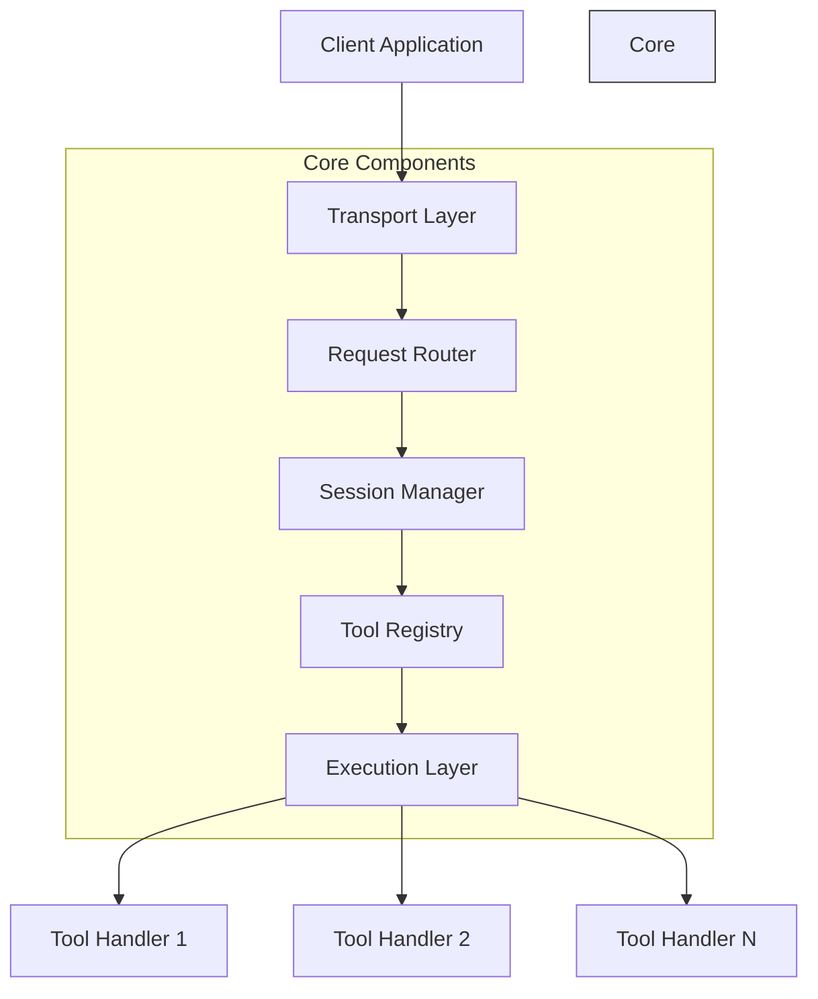
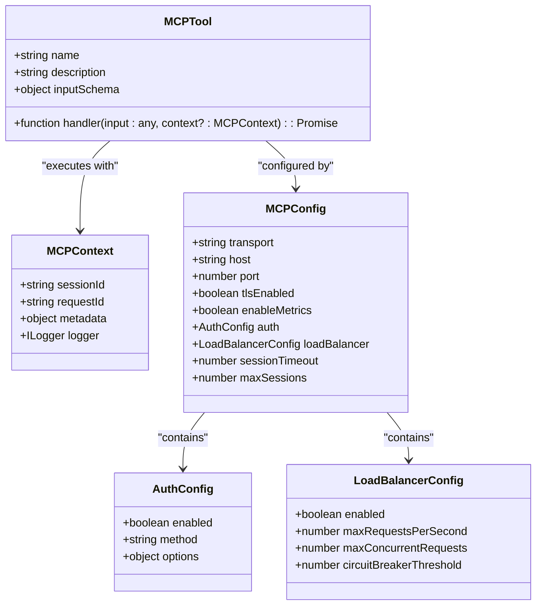
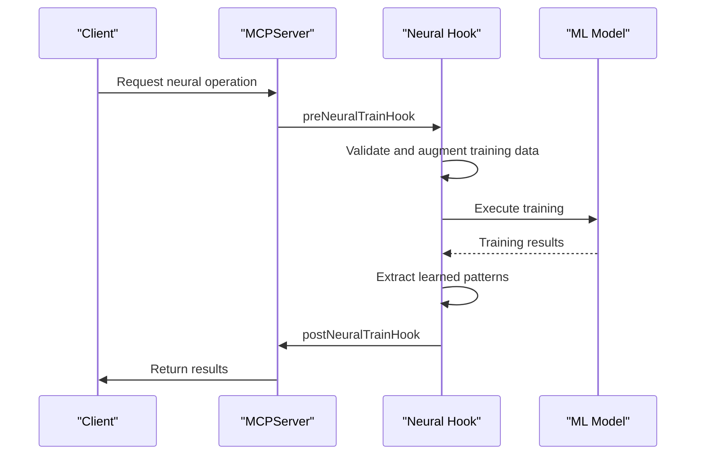
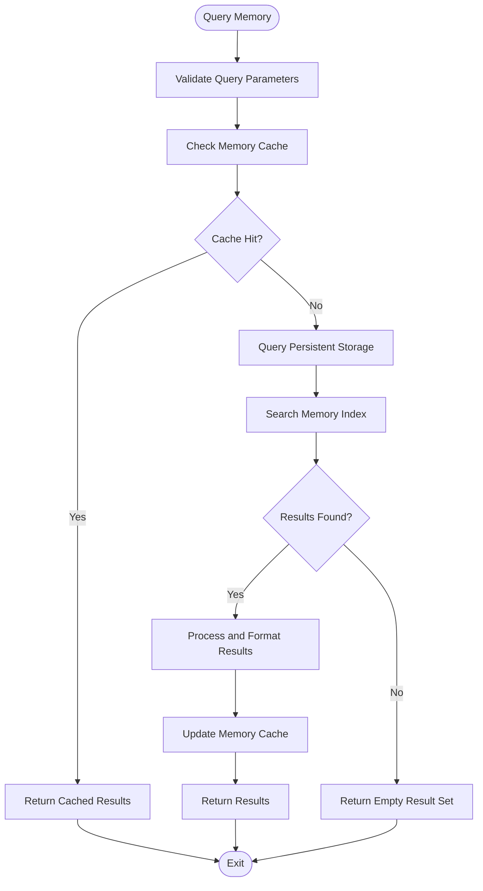
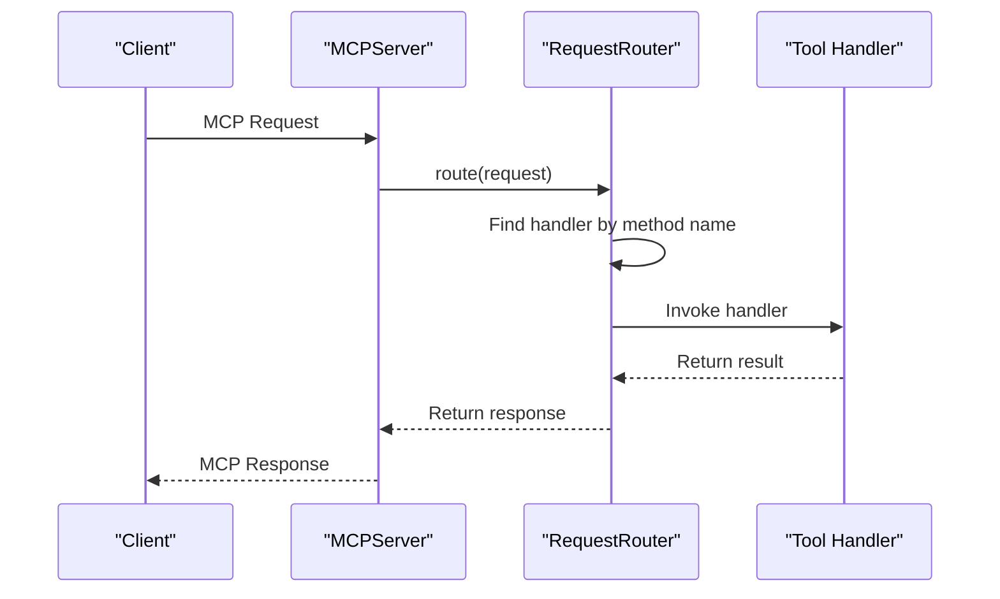
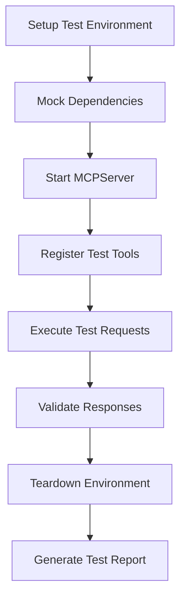

# Tool Development and Extension

<cite>
**Referenced Files in This Document**   
- [server.ts](file://src/mcp/server.ts)
- [index.ts](file://src/mcp/index.ts)
- [claude-flow-tools.ts](file://src/mcp/claude-flow-tools.ts)
- [swarm-tools.ts](file://src/mcp/swarm-tools.ts)
- [ruv-swarm-tools.ts](file://src/mcp/ruv-swarm-tools.ts)
- [workflow-tools.js](file://src/mcp/implementations/workflow-tools.js)
- [daa-tools.js](file://src/mcp/implementations/daa-tools.js)
- [neural-hooks.ts](file://src/services/agentic-flow-hooks/neural-hooks.ts)
- [memory-tools.js](file://src/mcp/implementations/memory-tools.js)
</cite>

## Table of Contents
1. [Introduction](#introduction)
2. [MCP Tool Framework Architecture](#mcp-tool-framework-architecture)
3. [Tool Domain Model and Configuration](#tool-domain-model-and-configuration)
4. [Core Tool Categories and Implementation Examples](#core-tool-categories-and-implementation-examples)
5. [Tool Registration and Lifecycle Management](#tool-registration-and-lifecycle-management)
6. [Integration with Core System Components](#integration-with-core-system-components)
7. [Advanced Extension Patterns](#advanced-extension-patterns)
8. [Common Development Issues and Best Practices](#common-development-issues-and-best-practices)
9. [Testing and Validation](#testing-and-validation)
10. [Conclusion](#conclusion)

## Introduction

This document provides comprehensive guidance on developing and extending MCP (Model Context Protocol) tools within the Claude-Flow system. It covers the complete tool development framework, from basic implementation patterns to advanced integration techniques. The documentation is designed to be accessible to developers with varying levels of experience, providing both foundational knowledge for beginners and deep technical insights for experienced developers. MCP tools serve as the primary interface between the Claude-Flow orchestration system and various functional components, enabling extensible capabilities in agent management, swarm coordination, memory operations, and specialized domain functions.

## MCP Tool Framework Architecture

The MCP tool framework in Claude-Flow follows a modular, extensible architecture that enables seamless integration of new capabilities. At its core, the framework is built around the MCPServer class, which manages tool registration, request routing, and execution lifecycle. The server acts as a central hub that coordinates between incoming MCP requests and registered tools, providing a consistent interface for tool invocation regardless of the underlying implementation.

The architecture employs a layered approach with clear separation of concerns:
- **Transport Layer**: Handles communication protocols (stdio, HTTP) and request/response serialization
- **Routing Layer**: Directs incoming requests to appropriate tools based on method names
- **Session Layer**: Manages client sessions, authentication, and context persistence
- **Tool Registry**: Maintains a catalog of available tools with their metadata and handlers
- **Execution Layer**: Invokes tool handlers with proper context and error handling

This layered design enables developers to focus on tool functionality without needing to manage lower-level concerns like network communication or session management. The framework automatically handles request parsing, parameter validation against input schemas, and response formatting according to the MCP specification.



**Diagram sources**
- [server.ts](file://src/mcp/server.ts#L200-L400)
- [index.ts](file://src/mcp/index.ts#L1-L100)

**Section sources**
- [server.ts](file://src/mcp/server.ts#L1-L647)
- [index.ts](file://src/mcp/index.ts#L1-L317)

## Tool Domain Model and Configuration

The MCP tool domain model defines a standardized structure for tool definition, configuration, and execution. Each tool is represented as an object with specific properties that describe its interface and behavior. The core components of the tool domain model include:

**Tool Interface Specification**
- `name`: Unique identifier for the tool (string)
- `description`: Human-readable description of tool functionality (string)
- `inputSchema`: JSON Schema defining expected input parameters
- `handler`: Asynchronous function that implements the tool's logic

**Configuration Options**
- `transport`: Communication protocol (stdio, http)
- `enableMetrics`: Flag for performance monitoring
- `auth`: Authentication configuration
- `loadBalancer`: Rate limiting and circuit breaker settings
- `sessionTimeout`: Duration before inactive sessions expire

**Parameter Specifications**
The inputSchema property uses JSON Schema to define the structure and constraints of tool parameters. This enables automatic validation of incoming requests before tool execution. The schema supports various data types, required fields, default values, and enumerated options.

**Return Value Specifications**
Tools return structured responses that conform to the MCP protocol specification. Successful executions return a result object, while errors are communicated through standardized error codes and messages. The framework automatically wraps tool outputs in the appropriate MCP response format.



**Diagram sources**
- [server.ts](file://src/mcp/server.ts#L500-L600)
- [index.ts](file://src/mcp/index.ts#L100-L200)

**Section sources**
- [server.ts](file://src/mcp/server.ts#L1-L647)
- [index.ts](file://src/mcp/index.ts#L1-L317)

## Core Tool Categories and Implementation Examples

The Claude-Flow system organizes MCP tools into several functional categories, each addressing specific domains of operation. These categories provide a framework for understanding the different types of capabilities that can be extended through tool development.

### Neural and Cognitive Tools

Neural tools leverage machine learning models and cognitive processing capabilities. The system implements neural functionality through hooks that intercept and enhance model training processes. These hooks enable adaptive learning from multi-model responses, pattern detection, and performance optimization.



**Diagram sources**
- [neural-hooks.ts](file://src/services/agentic-flow-hooks/neural-hooks.ts#L1-L200)

The neural hooks system provides lifecycle events for neural operations, allowing developers to inject custom logic at various stages of model training and inference. This enables capabilities like data augmentation, performance monitoring, and automatic model promotion based on accuracy thresholds.

### Cognitive Agent Management Tools

Agent management tools enable the creation, monitoring, and control of specialized cognitive agents. These tools follow a consistent pattern with dynamic schema enhancement to support runtime-determined agent types.

```typescript
function createSpawnAgentTool(logger: ILogger): MCPTool {
  return {
    name: 'agents/spawn',
    description: 'Spawn a new Claude agent with specified configuration',
    inputSchema: {
      type: 'object',
      properties: {
        type: {
          type: 'string',
          description: 'Type of specialized agent to spawn (loaded dynamically from .claude/agents/)',
        },
        name: {
          type: 'string',
          description: 'Display name for the agent',
        },
        capabilities: {
          type: 'array',
          items: { type: 'string' },
          description: 'List of capabilities for the agent',
        },
      },
      required: ['type', 'name'],
    },
    handler: async (input: any, context?: ClaudeFlowToolContext) => {
      if (!context?.orchestrator) {
        throw new Error('Orchestrator not available');
      }

      const profile: AgentProfile = {
        id: `agent_${Date.now()}_${Math.random().toString(36).substr(2, 9)}`,
        name: input.name,
        type: input.type,
        capabilities: input.capabilities || [],
      };

      const sessionId = await context.orchestrator.spawnAgent(profile);

      return {
        agentId: profile.id,
        sessionId,
        profile,
        status: 'spawned',
        timestamp: new Date().toISOString(),
      };
    },
  };
}
```

The agent management system uses dynamic schema enhancement to populate enum values for agent types at runtime, allowing the tool interface to adapt to the available agent configurations in the `.claude/agents/` directory.

### Memory Management Tools

Memory tools provide persistent storage and retrieval capabilities for agent state and knowledge. These tools enable long-term memory operations that support complex, multi-step workflows.



**Diagram sources**
- [memory-tools.js](file://src/mcp/implementations/memory-tools.js#L1-L100)

The memory system implements a multi-layered storage architecture with caching for improved performance. Tools support operations like querying, storing, and deleting memory entries, with configurable time-to-live (TTL) settings for automatic expiration of stale data.

### Workflow and Automation Tools

Workflow tools enable the creation and execution of complex, multi-step processes. These tools support both sequential and parallel execution patterns, allowing for sophisticated automation scenarios.

```typescript
class WorkflowManager {
  workflow_create(args) {
    const workflowId = `workflow_${Date.now()}_${Math.random().toString(36).substr(2, 6)}`;
    const workflow = {
      id: workflowId,
      name: args.name,
      steps: args.steps || [],
      triggers: args.triggers || [],
      created: new Date().toISOString(),
      status: 'active',
    };

    this.workflows.set(workflowId, workflow);

    return {
      success: true,
      workflowId: workflowId,
      workflow: workflow,
    };
  }

  parallel_execute(args) {
    const tasks = args.tasks || [];
    const jobId = `parallel_${Date.now()}_${Math.random().toString(36).substr(2, 6)}`;
    
    const job = {
      id: jobId,
      tasks: tasks.map((task, index) => ({
        id: `task_${index}`,
        ...task,
        status: 'pending',
      })),
      status: 'running',
    };

    this.parallelTasks.set(jobId, job);

    // Simulate parallel execution
    job.tasks.forEach((task, index) => {
      setTimeout(() => {
        task.status = 'completed';
        task.completedAt = new Date().toISOString();
        job.completedTasks++;
        
        if (job.completedTasks === job.totalTasks) {
          job.status = 'completed';
        }
      }, 50 * (index + 1));
    });

    return {
      success: true,
      jobId: jobId,
      taskCount: tasks.length,
      status: 'running',
    };
  }
}
```

The workflow system supports various execution strategies including sequential, parallel, and adaptive approaches. It also provides batch processing capabilities for handling large volumes of similar operations efficiently.

**Section sources**
- [claude-flow-tools.ts](file://src/mcp/claude-flow-tools.ts#L1-L200)
- [workflow-tools.js](file://src/mcp/implementations/workflow-tools.js#L1-L200)
- [daa-tools.js](file://src/mcp/implementations/daa-tools.js#L1-L200)
- [neural-hooks.ts](file://src/services/agentic-flow-hooks/neural-hooks.ts#L1-L200)
- [memory-tools.js](file://src/mcp/implementations/memory-tools.js#L1-L100)

## Tool Registration and Lifecycle Management

The tool registration process in Claude-Flow follows a systematic pattern that ensures tools are properly integrated into the system. The MCPServer class provides a registerTool method that adds tools to the internal registry and makes them available for invocation.

### Built-in Tool Registration

The server automatically registers several built-in tools during initialization, including system information, health checks, and tool discovery functions:

```typescript
private registerBuiltInTools(): void {
  // System information tool
  this.registerTool({
    name: 'system/info',
    description: 'Get system information',
    inputSchema: { type: 'object', properties: {} },
    handler: async () => {
      return {
        version: '1.0.0',
        platform: platform(),
        arch: arch(),
        runtime: 'Node.js',
      };
    },
  });

  // Health check tool
  this.registerTool({
    name: 'system/health',
    description: 'Get system health status',
    inputSchema: { type: 'object', properties: {} },
    handler: async () => {
      return await this.getHealthStatus();
    },
  });

  // List tools
  this.registerTool({
    name: 'tools/list',
    description: 'List all available tools',
    inputSchema: { type: 'object', properties: {} },
    handler: async () => {
      return this.toolRegistry.listTools();
    },
  });
}
```

### Context-Aware Tool Registration

For tools that require access to system components, the framework uses context injection to provide necessary dependencies. This pattern wraps the original handler function with additional context parameters:

```typescript
if (this.orchestrator) {
  const claudeFlowTools = createClaudeFlowTools(this.logger);

  for (const tool of claudeFlowTools) {
    // Wrap the handler to inject orchestrator context
    const originalHandler = tool.handler;
    tool.handler = async (input: unknown, context?: MCPContext) => {
      const claudeFlowContext: ClaudeFlowToolContext = {
        ...context,
        orchestrator: this.orchestrator,
      } as ClaudeFlowToolContext;

      return await originalHandler(input, claudeFlowContext);
    };

    this.registerTool(tool);
  }
}
```

This approach maintains separation of concerns while providing tools with access to the system components they need to function.

### Dynamic Tool Discovery

The framework supports dynamic discovery of specialized tools based on available system components. For example, swarm tools are only registered when swarm coordination components are available:

```typescript
if (this.swarmCoordinator || this.agentManager || this.resourceManager) {
  const swarmTools = createSwarmTools(this.logger);

  for (const tool of swarmTools) {
    // Wrap the handler to inject swarm context
    const originalHandler = tool.handler;
    tool.handler = async (input: unknown, context?: MCPContext) => {
      const swarmContext: SwarmToolContext = {
        ...context,
        swarmCoordinator: this.swarmCoordinator,
        agentManager: this.agentManager,
        resourceManager: this.resourceManager,
      } as SwarmToolContext;

      return await originalHandler(input, swarmContext);
    };

    this.registerTool(tool);
  }
}
```

This conditional registration pattern ensures that tools are only available when their required dependencies are present, preventing errors from attempting to use unavailable functionality.

**Section sources**
- [server.ts](file://src/mcp/server.ts#L500-L600)
- [claude-flow-tools.ts](file://src/mcp/claude-flow-tools.ts#L1-L50)
- [swarm-tools.ts](file://src/mcp/swarm-tools.ts#L1-L50)

## Integration with Core System Components

MCP tools integrate with various core system components to provide enhanced functionality and maintain system integrity. These integrations ensure that tools operate within the broader context of the Claude-Flow ecosystem.

### Command Registry Integration

The command registry serves as the central routing mechanism for MCP requests. When a tool is registered, its name is added to the registry, enabling the router to direct incoming requests to the appropriate handler. The RequestRouter class manages this mapping and handles the execution flow:



**Diagram sources**
- [server.ts](file://src/mcp/server.ts#L300-L400)
- [index.ts](file://src/mcp/index.ts#L150-L160)

### Permission System Integration

The authentication and authorization system controls access to MCP tools based on security policies. Tools can be protected by requiring specific permissions, and the framework automatically validates these permissions before tool execution:

```typescript
export {
  AuthManager,
  type IAuthManager,
  type AuthContext,
  type AuthResult,
  type TokenInfo,
  type TokenGenerationOptions,
  type AuthSession,
  Permissions,
} from './auth.js';
```

The permission system supports various authentication methods and can be configured to enable or disable security features based on deployment requirements. This allows for flexible security policies that can be adjusted for development, testing, and production environments.

### Logging Infrastructure Integration

All tool operations are integrated with the centralized logging infrastructure, providing comprehensive visibility into system behavior. The framework injects a logger instance into the execution context, enabling tools to record important events and diagnostic information:

```typescript
handler: async (input: any, context?: ClaudeFlowToolContext) => {
  logger.info('Spawning agent', { input, sessionId: context?.sessionId });
  
  // Tool logic here
  
  logger.info('Agent spawned successfully', { agentId: profile.id });
  
  return {
    agentId: profile.id,
    status: 'spawned',
  };
}
```

The logging system supports structured logging with metadata, enabling advanced filtering and analysis of tool execution patterns. Logs include contextual information such as session IDs, request IDs, and timestamps, facilitating troubleshooting and performance analysis.

**Section sources**
- [server.ts](file://src/mcp/server.ts#L100-L200)
- [index.ts](file://src/mcp/index.ts#L20-L50)
- [claude-flow-tools.ts](file://src/mcp/claude-flow-tools.ts#L100-L150)

## Advanced Extension Patterns

The MCP framework supports several advanced extension patterns that enable sophisticated integration scenarios and enhanced functionality.

### External Command Integration

The ruv-swarm tools demonstrate a pattern for integrating with external command-line tools through shell execution. This approach allows Claude-Flow to leverage functionality from external packages:

```typescript
async function executeRuvSwarmCommand(
  command: string,
  args: string[] = [],
  context?: RuvSwarmToolContext,
  logger?: ILogger,
): Promise<RuvSwarmResponse> {
  try {
    const workDir = context?.workingDirectory || process.cwd();
    const fullCommand = `npx ruv-swarm ${command} ${args.join(' ')}`;

    logger?.debug('Executing ruv-swarm command', { command: fullCommand, workDir });

    const result = await execAsync(fullCommand, { cwd: workDir });

    // Parse JSON response if possible
    let data;
    try {
      data = JSON.parse(result.stdout);
    } catch {
      data = { output: result.stdout, stderr: result.stderr };
    }

    return {
      success: true,
      data,
      metadata: {
        timestamp: Date.now(),
        swarmId: context?.swarmId,
        sessionId: context?.sessionId,
      },
    };
  } catch (error) {
    logger?.error('ruv-swarm command failed', {
      command,
      error: error instanceof Error ? error.message : String(error),
    });

    return {
      success: false,
      error: error instanceof Error ? error.message : String(error),
    };
  }
}
```

This pattern enables Claude-Flow to extend its capabilities by integrating with specialized external tools, creating a hybrid system that combines internal functionality with external expertise.

### Dynamic Schema Enhancement

The framework supports dynamic enhancement of tool schemas at runtime, allowing for adaptive interfaces that respond to system state. The enhanceToolWithAgentTypes function demonstrates this pattern:

```typescript
async function enhanceToolWithAgentTypes(tool: MCPTool): Promise<MCPTool> {
  const availableTypes = await getAvailableAgentTypes();
  
  // Clone the tool to avoid modifying the original
  const enhancedTool = JSON.parse(JSON.stringify(tool));
  
  // Find and populate enum fields for agent types
  function addEnumToAgentTypeFields(obj: any) {
    if (typeof obj !== 'object' || obj === null) return;
    
    for (const [key, value] of Object.entries(obj)) {
      if (typeof value === 'object' && value !== null) {
        // Check if this is an agent type field
        if (key === 'type' || key === 'filterByType' || key === 'assignToAgentType') {
          const field = value as any;
          if (field.type === 'string' && field.description?.includes('loaded dynamically from .claude/agents/')) {
            field.enum = availableTypes;
          }
        }
        addEnumToAgentTypeFields(value);
      }
    }
  }
  
  addEnumToAgentTypeFields(enhancedTool.inputSchema);
  return enhancedTool;
}
```

This pattern enables tools to adapt their interfaces based on available system resources, providing a more intuitive user experience and preventing invalid parameter values.

**Section sources**
- [ruv-swarm-tools.ts](file://src/mcp/ruv-swarm-tools.ts#L1-L100)
- [claude-flow-tools.ts](file://src/mcp/claude-flow-tools.ts#L50-L100)

## Common Development Issues and Best Practices

Developing MCP tools presents several common challenges that can be addressed through established best practices and solutions.

### Dependency Management

One common issue is managing dependencies between tools and system components. The context injection pattern provides a clean solution:

```typescript
// Good: Use context injection
tool.handler = async (input: unknown, context?: MCPContext) => {
  const enhancedContext: ClaudeFlowToolContext = {
    ...context,
    orchestrator: this.orchestrator,
  } as ClaudeFlowToolContext;

  return await originalHandler(input, enhancedContext);
};

// Avoid: Direct dependency references
// This creates tight coupling and testing difficulties
```

Best practices for dependency management include:
- Use dependency injection rather than direct imports
- Make dependencies optional when possible
- Provide clear error messages when dependencies are missing
- Document required dependencies in tool descriptions

### Error Handling

Proper error handling is critical for maintaining system stability. The framework provides standardized error codes and messages:

```typescript
private errorToMCPError(error): MCPError {
  if (error instanceof MCPMethodNotFoundError) {
    return {
      code: -32601,
      message: error instanceof Error ? error.message : String(error),
      data: error.details,
    };
  }

  if (error instanceof MCPErrorClass) {
    return {
      code: -32603,
      message: error instanceof Error ? error.message : String(error),
      data: error.details,
    };
  }

  if (error instanceof Error) {
    return {
      code: -32603,
      message: error instanceof Error ? error.message : String(error),
    };
  }

  return {
    code: -32603,
    message: 'Internal error',
    data: error,
  };
}
```

Best practices for error handling include:
- Use standardized error codes from the MCP specification
- Provide descriptive error messages that aid troubleshooting
- Include relevant context in error data
- Log errors with sufficient detail for diagnosis
- Gracefully handle missing dependencies and network failures

### Performance Optimization

Performance considerations are essential for tools that may be called frequently or handle large data volumes:

```typescript
// Implement caching for expensive operations
const cache = new Map<string, any>();
const CACHE_TTL = 5 * 60 * 1000; // 5 minutes

// Use streaming for large data transfers
// Implement pagination for list operations
// Optimize database queries with proper indexing
// Use efficient data structures and algorithms
```

Best practices for performance optimization include:
- Implement caching for expensive or frequently accessed data
- Use streaming for large data transfers to minimize memory usage
- Implement pagination for list operations to avoid overwhelming responses
- Optimize database queries with proper indexing and query planning
- Use efficient data structures and algorithms appropriate for the use case
- Monitor performance metrics and set up alerts for degradation

**Section sources**
- [server.ts](file://src/mcp/server.ts#L600-L647)
- [claude-flow-tools.ts](file://src/mcp/claude-flow-tools.ts#L150-L200)

## Testing and Validation

Effective testing is crucial for ensuring the reliability and correctness of MCP tools. The framework supports various testing approaches and provides utilities for validation.

### Unit Testing

Unit tests should verify the core functionality of each tool in isolation:

```typescript
// Example test structure
describe('agents/spawn tool', () => {
  it('should spawn an agent with valid parameters', async () => {
    const tool = createSpawnAgentTool(logger);
    const result = await tool.handler({
      type: 'researcher',
      name: 'Test Agent',
    }, context);
    
    expect(result.success).toBe(true);
    expect(result.agentId).toBeDefined();
  });
  
  it('should reject invalid parameters', async () => {
    const tool = createSpawnAgentTool(logger);
    await expect(tool.handler({}, context)).rejects.toThrow();
  });
});
```

### Integration Testing

Integration tests verify that tools work correctly within the full system context:



**Diagram sources**
- [test-mcp.ts](file://scripts/test-mcp.ts#L1-L50)

Integration tests should cover:
- Tool registration and discovery
- Request routing and execution
- Error handling and recovery
- Performance under load
- Security and permission enforcement

### Validation Utilities

The framework provides utilities for validating tool implementations:

```typescript
// Use MCPUtils for common operations
import { MCPUtils } from './index.js';

// Validate protocol versions
if (!MCPUtils.isValidProtocolVersion(version)) {
  throw new Error('Invalid protocol version');
}

// Generate standardized IDs
const sessionId = MCPUtils.generateSessionId();
const requestId = MCPUtils.generateRequestId();
```

Best practices for testing include:
- Write comprehensive unit tests for all tool functionality
- Perform integration testing with realistic scenarios
- Test error conditions and edge cases
- Validate against the MCP specification
- Use automated testing in CI/CD pipelines
- Monitor test coverage and aim for high percentages

**Section sources**
- [test-mcp.ts](file://scripts/test-mcp.ts#L1-L100)
- [index.ts](file://src/mcp/index.ts#L250-L300)

## Conclusion

The MCP tool development framework in Claude-Flow provides a robust and extensible platform for creating specialized capabilities that enhance the system's functionality. By following the patterns and best practices outlined in this document, developers can create tools that integrate seamlessly with the core system while maintaining reliability, performance, and security.

The framework's modular architecture, standardized interfaces, and comprehensive integration points make it accessible to developers of all skill levels. From basic tool creation to advanced extension patterns, the system supports a wide range of use cases and complexity levels.

Key takeaways for successful tool development include:
- Leverage the provided infrastructure rather than reimplementing common functionality
- Follow established patterns for dependency management and error handling
- Prioritize performance and scalability in tool design
- Implement comprehensive testing to ensure reliability
- Document tool interfaces and behavior clearly for users

By adhering to these principles, developers can create powerful, maintainable tools that extend the capabilities of the Claude-Flow system and enable new applications and workflows.