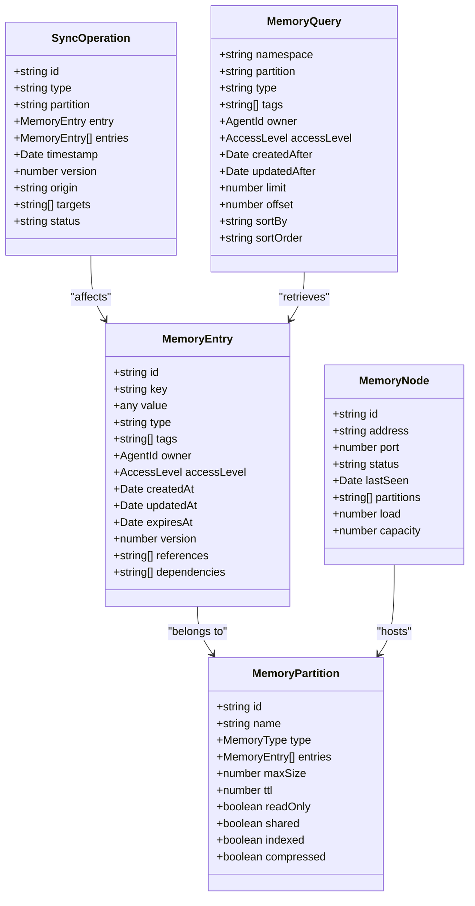
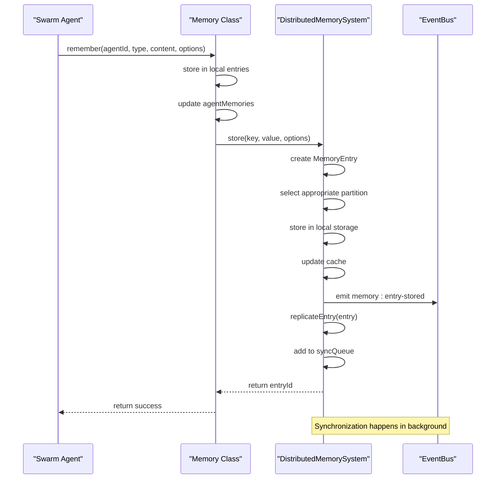
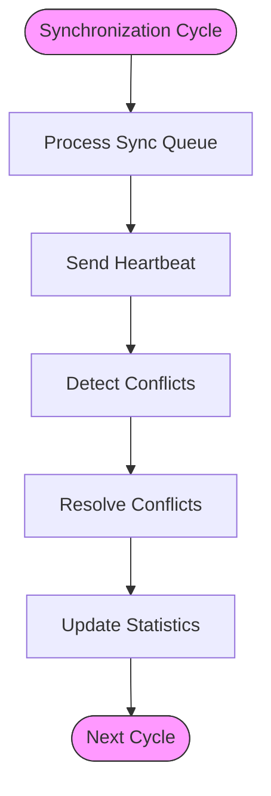
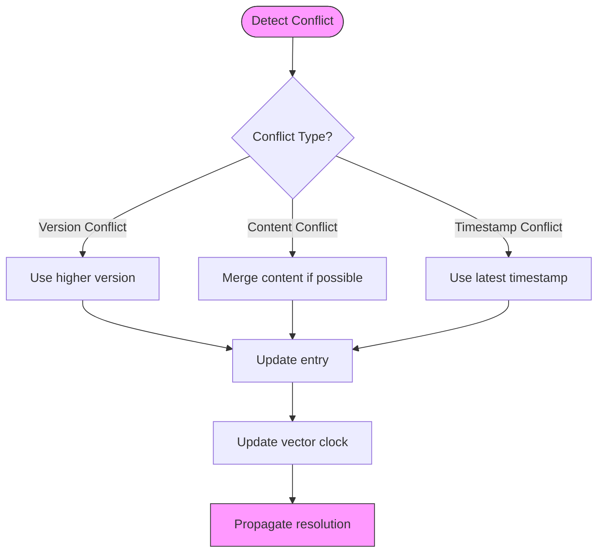

# Cross-Session Memory

<cite>
**Referenced Files in This Document**   
- [swarm-memory.ts](file://src/memory/swarm-memory.ts)
- [distributed-memory.ts](file://src/memory/distributed-memory.ts)
</cite>

## Table of Contents
1. [Introduction](#introduction)
2. [Domain Model for Cross-Session Data Sharing](#domain-model-for-cross-session-data-sharing)
3. [Memory Class and Distributed Components Invocation](#memory-class-and-distributed-components-invocation)
4. [Synchronization Mechanisms](#synchronization-mechanisms)
5. [Consistency Models and Conflict Resolution](#consistency-models-and-conflict-resolution)
6. [Cross-Session Memory Operations Interface](#cross-session-memory-operations-interface)
7. [Common Issues and Solutions](#common-issues-and-solutions)
8. [Usage Patterns for Coordinated Swarm Behavior](#usage-patterns-for-coordinated-swarm-behavior)

## Introduction
Cross-Session Memory is a critical sub-feature in the swarm intelligence system that enables memory sharing and maintenance across multiple sessions. This capability allows swarm agents to coordinate their activities, maintain state consistency, and build upon collective knowledge regardless of session boundaries. The implementation combines local memory management with distributed synchronization to ensure data availability and consistency across the swarm network.

**Section sources**
- [swarm-memory.ts](file://src/memory/swarm-memory.ts)
- [distributed-memory.ts](file://src/memory/distributed-memory.ts)

## Domain Model for Cross-Session Data Sharing

The cross-session memory system is built around several core entities that define how data is structured, stored, and shared across sessions:

- **MemoryEntry**: Represents individual pieces of stored information with metadata including timestamps, access levels, and versioning
- **MemoryPartition**: Logical grouping of memory entries by type or purpose (e.g., knowledge, state, cache)
- **MemoryNode**: Represents a participating node in the distributed memory network
- **SyncOperation**: Tracks synchronization operations between nodes
- **MemoryQuery**: Defines criteria for retrieving memory entries

The domain model supports hierarchical organization of memory through partitions while maintaining global accessibility. Each memory entry contains comprehensive metadata that enables sophisticated querying, access control, and lifecycle management.



**Diagram sources**
- [distributed-memory.ts](file://src/memory/distributed-memory.ts#L20-L150)

**Section sources**
- [distributed-memory.ts](file://src/memory/distributed-memory.ts#L20-L150)

## Memory Class and Distributed Components Invocation

The Memory class serves as the primary interface for memory operations, while the DistributedMemorySystem handles cross-session synchronization. The invocation relationship between these components follows a layered architecture where the Memory class delegates distributed operations to the DistributedMemorySystem.

When a memory operation requires cross-session coordination, the Memory class invokes the appropriate method on the DistributedMemorySystem, which then manages the distribution, replication, and synchronization of the data across nodes.



**Diagram sources**
- [swarm-memory.ts](file://src/memory/swarm-memory.ts#L434-633)
- [distributed-memory.ts](file://src/memory/distributed-memory.ts#L200-399)

**Section sources**
- [swarm-memory.ts](file://src/memory/swarm-memory.ts#L434-633)
- [distributed-memory.ts](file://src/memory/distributed-memory.ts#L200-399)

## Synchronization Mechanisms

The cross-session memory system employs several synchronization mechanisms to maintain data consistency across sessions:

### State Persistence and Loading
The Memory class implements persistence through file-based storage, saving memory state to JSON files and loading them on initialization:

```typescript
private async saveMemoryState(): Promise<void> {
  try {
    // Save entries
    const entriesArray = Array.from(this.entries.values());
    const entriesFile = path.join(this.config.persistencePath, 'entries.json');
    await fs.writeFile(entriesFile, JSON.stringify(entriesArray, null, 2));

    // Save knowledge bases
    const kbArray = Array.from(this.knowledgeBases.values());
    const kbFile = path.join(this.config.persistencePath, 'knowledge-bases.json');
    await fs.writeFile(kbFile, JSON.stringify(kbArray, null, 2));
  } catch (error) {
    this.logger.error('Error saving memory state:', error);
  }
}
```

### Distributed Synchronization
The DistributedMemorySystem uses a periodic synchronization mechanism that processes a queue of operations:

```typescript
private startSynchronization(): void {
  this.syncInterval = setInterval(() => {
    this.performSync();
  }, this.config.syncInterval);
}

private async performSync(): Promise<void> {
  try {
    // Process pending sync operations
    await this.processSyncQueue();

    // Send heartbeat to other nodes
    await this.sendHeartbeat();

    // Check for conflicts and resolve them
    await this.detectAndResolveConflicts();

    // Update statistics
    this.updateStatistics();
  } catch (error) {
    this.logger.error('Sync error', error);
  }
}
```

The synchronization process includes:
- Processing pending operations in the sync queue
- Sending heartbeats to maintain node connectivity
- Detecting and resolving conflicts
- Updating system statistics



**Diagram sources**
- [swarm-memory.ts](file://src/memory/swarm-memory.ts#L580-600)
- [distributed-memory.ts](file://src/memory/distributed-memory.ts#L700-750)

**Section sources**
- [swarm-memory.ts](file://src/memory/swarm-memory.ts#L580-600)
- [distributed-memory.ts](file://src/memory/distributed-memory.ts#L700-750)

## Consistency Models and Conflict Resolution

The distributed memory system supports multiple consistency levels, with eventual consistency as the default model. The system uses vector clocks to track the causal ordering of operations and detect conflicts.

### Consistency Levels
The system supports different consistency models through the ConsistencyLevel enum:
- **Eventual**: Default model where updates propagate asynchronously
- **Strong**: Ensures all nodes see the same data at the same time
- **Session**: Consistency within a single session

### Conflict Detection and Resolution
When conflicts are detected, the system uses a conflict resolver function to determine the correct state:

```typescript
private async detectAndResolveConflicts(): Promise<void> {
  // Check vector clocks for inconsistencies
  const conflicts = this.findConflicts();
  
  for (const conflict of conflicts) {
    const resolvedEntry = this.conflictResolver 
      ? this.conflictResolver(conflict.local, conflict.remote)
      : this.defaultConflictResolution(conflict.local, conflict.remote);
      
    await this.applyResolvedEntry(resolvedEntry);
  }
}
```

The default conflict resolution strategy favors the entry with the higher version number, but custom resolvers can be provided for specific use cases.



**Diagram sources**
- [distributed-memory.ts](file://src/memory/distributed-memory.ts#L750-800)

**Section sources**
- [distributed-memory.ts](file://src/memory/distributed-memory.ts#L750-800)

## Cross-Session Memory Operations Interface

The cross-session memory system provides a comprehensive interface for memory operations with well-defined parameters and return values.

### Public API Methods

#### Store Operation
```typescript
async store(
  key: string,
  value: any,
  options: {
    type?: string;
    tags?: string[];
    owner?: AgentId;
    accessLevel?: AccessLevel;
    partition?: string;
    ttl?: number;
    replicate?: boolean;
  } = {}
): Promise<string>
```
- **Parameters**: 
  - `key`: Unique identifier for the memory entry
  - `value`: Data to store
  - `options`: Additional configuration for the entry
- **Return**: Entry ID as string
- **Throws**: Error if operation fails

#### Retrieve Operation
```typescript
async retrieve(
  key: string,
  options: {
    partition?: string;
    consistency?: ConsistencyLevel;
    maxAge?: number;
  } = {}
): Promise<MemoryEntry | null>
```
- **Parameters**:
  - `key`: Identifier of the entry to retrieve
  - `options`: Retrieval configuration
- **Return**: MemoryEntry object or null if not found

#### Query Operation
```typescript
async query(query: MemoryQuery): Promise<MemoryEntry[]>
```
- **Parameters**: MemoryQuery object with filtering criteria
- **Return**: Array of matching MemoryEntry objects

#### Update Operation
```typescript
async update(
  key: string,
  value: any,
  options: {
    partition?: string;
    merge?: boolean;
    version?: number;
  } = {}
): Promise<boolean>
```
- **Parameters**:
  - `key`: Identifier of entry to update
  - `value`: New value to set
  - `options`: Update configuration
- **Return**: Boolean indicating success

#### Delete Operation
```typescript
async deleteEntry(entryId: string): Promise<boolean>
```
- **Parameters**: Entry ID to delete
- **Return**: Boolean indicating success

**Section sources**
- [distributed-memory.ts](file://src/memory/distributed-memory.ts#L200-599)

## Common Issues and Solutions

### Memory Limit Enforcement
The system automatically enforces memory limits to prevent resource exhaustion:

```typescript
private async enforceMemoryLimits(): Promise<void> {
  if (this.entries.size <= this.config.maxEntries) return;

  // Remove oldest entries that are not marked as important
  const entries = Array.from(this.entries.values())
    .filter((e) => (e.metadata.priority || 1) <= 1) // Only remove low priority
    .sort((a, b) => a.timestamp.getTime() - b.timestamp.getTime());

  const toRemove = entries.slice(0, this.entries.size - this.config.maxEntries);
  
  for (const entry of toRemove) {
    this.entries.delete(entry.id);
    // Remove from agent memory
    const agentEntries = this.agentMemories.get(entry.agentId);
    if (agentEntries) {
      agentEntries.delete(entry.id);
    }
  }
}
```

### Cache Management
The system implements LRU (Least Recently Used) cache eviction to manage memory usage:

```typescript
private evictCache(): void {
  // Simple LRU eviction - remove oldest entries
  const entries = Array.from(this.cache.entries());
  entries.sort((a, b) => a[1].expiry - b[1].expiry);

  const toRemove = entries.slice(0, Math.floor(this.config.cacheSize * 0.1));
  toRemove.forEach(([key]) => this.cache.delete(key));
}
```

### Error Handling
The system includes comprehensive error handling for distributed operations:

```typescript
private async processSyncQueue(): Promise<void> {
  const pendingOps = this.syncQueue.filter((op) => op.status === 'pending');

  for (const operation of pendingOps) {
    try {
      operation.status = 'in_progress';
      await this.executeSyncOperation(operation);
      operation.status = 'completed';
      this.statistics.syncOperations.completed++;
    } catch (error) {
      operation.status = 'failed';
      this.statistics.syncOperations.failed++;
      this.logger.error('Sync operation failed', { operation, error });
    }
  }
}
```

**Section sources**
- [swarm-memory.ts](file://src/memory/swarm-memory.ts#L600-633)
- [distributed-memory.ts](file://src/memory/distributed-memory.ts#L600-799)

## Usage Patterns for Coordinated Swarm Behavior

### Knowledge Sharing
Agents can share knowledge across sessions by storing information in shared partitions:

```typescript
// Agent A stores knowledge
await memory.remember('agent-a', 'knowledge', {
  topic: 'API design',
  bestPractices: ['RESTful patterns', 'consistent naming']
}, {
  tags: ['api', 'design'],
  shareLevel: 'team'
});

// Agent B retrieves and builds upon knowledge
const knowledge = await memory.recall({ tags: ['api', 'design'] });
```

### State Synchronization
The system enables coordinated state management across multiple agents:

```typescript
// Multiple agents working on the same task
await memory.store('task-123:status', 'in-progress', {
  owner: 'agent-a',
  partition: 'state',
  replicate: true
});

// Other agents can monitor and respond to state changes
const status = await memory.retrieve('task-123:status');
if (status.value === 'completed') {
  // Trigger next step in workflow
}
```

### Collective Learning
Agents can contribute to and benefit from a shared knowledge base:

```typescript
// Create a shared knowledge base
const kbId = await memory.createKnowledgeBase('best-practices', {
  description: 'Team best practices',
  visibility: 'team'
});

// Agents add to the knowledge base
await memory.addToKnowledgeBase(kbId, {
  practice: 'code reviews',
  benefits: ['quality improvement', 'knowledge sharing'],
  implementation: 'mandatory for all PRs'
});

// New agents can access accumulated knowledge
const practices = await memory.queryByType('best-practice');
```

These usage patterns enable sophisticated swarm behaviors where agents can coordinate their activities, build upon each other's work, and maintain consistent state across sessions.

**Section sources**
- [swarm-memory.ts](file://src/memory/swarm-memory.ts)
- [distributed-memory.ts](file://src/memory/distributed-memory.ts)