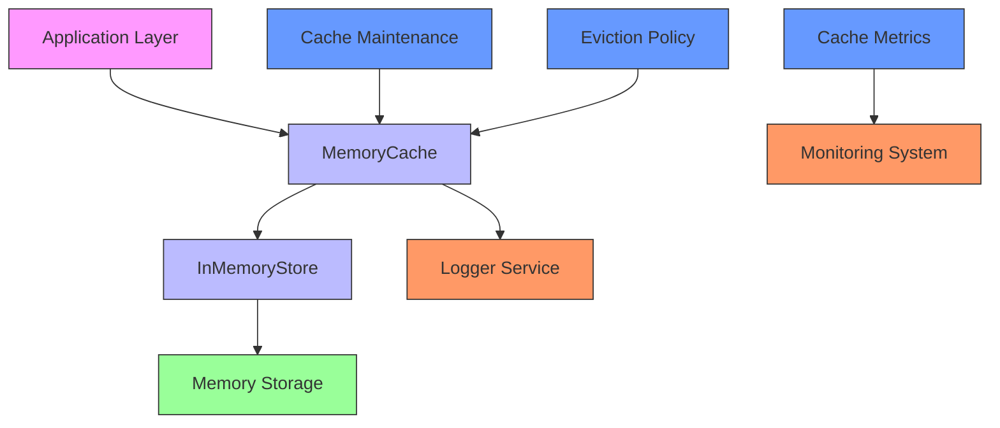
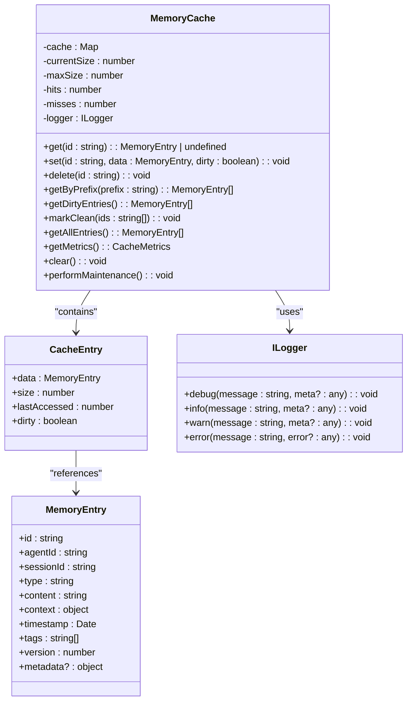
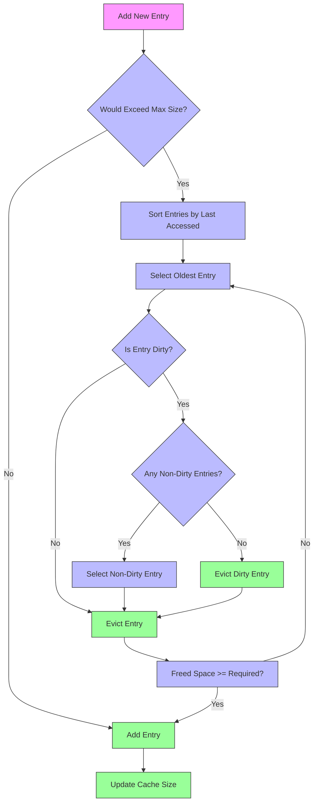
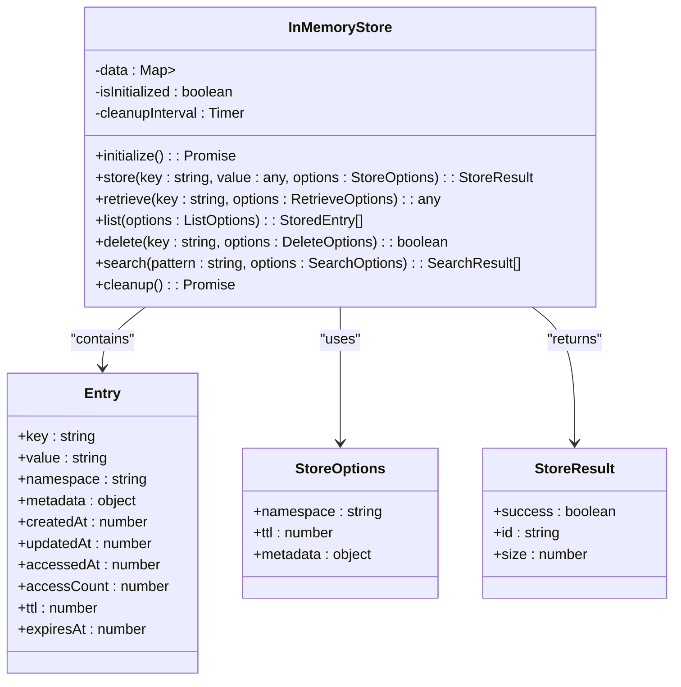
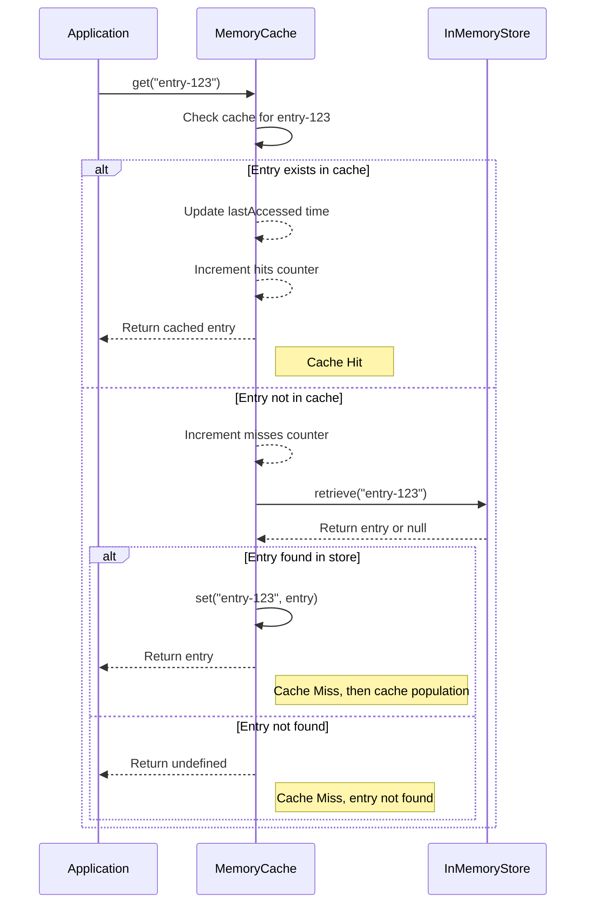

# Memory Caching

<cite>
**Referenced Files in This Document**   
- [cache.ts](file://src/memory/cache.ts)
- [in-memory-store.js](file://src/memory/in-memory-store.js)
- [types.ts](file://src/utils/types.ts)
- [logger.ts](file://src/core/logger.ts)
- [manager.ts](file://src/memory/manager.ts)
</cite>

## Table of Contents
1. [Introduction](#introduction)
2. [Caching Architecture Overview](#caching-architecture-overview)
3. [Core Components](#core-components)
4. [Cache Implementation Details](#cache-implementation-details)
5. [In-Memory Store Implementation](#in-memory-store-implementation)
6. [Domain Model for Cache Operations](#domain-model-for-cache-operations)
7. [Cache Interfaces and Methods](#cache-interfaces-and-methods)
8. [Cache Coherence and Invalidation](#cache-coherence-and-invalidation)
9. [Performance Considerations](#performance-considerations)
10. [Common Issues and Solutions](#common-issues-and-solutions)
11. [Best Practices for Swarm Operations](#best-practices-for-swarm-operations)

## Introduction

Memory caching is a critical performance optimization layer in the Claude-Flow system that sits between the application and persistent storage. This caching sub-feature implements a sophisticated in-memory caching mechanism designed to accelerate access to frequently used memory entries, reduce database load, and improve overall system responsiveness. The implementation combines a Least Recently Used (LRU) eviction policy with size-based constraints and dirty entry tracking to ensure optimal cache utilization.

The caching system is designed to handle the high-throughput requirements of swarm operations, where multiple agents concurrently access and modify memory entries. It provides mechanisms for cache coherence, performance monitoring, and graceful degradation when cache limits are reached. The system is built with extensibility in mind, allowing for different storage backends while maintaining a consistent interface.

**Section sources**
- [cache.ts](file://src/memory/cache.ts#L1-L240)
- [in-memory-store.js](file://src/memory/in-memory-store.js#L1-L217)

## Caching Architecture Overview

The memory caching architecture consists of two primary components: the MemoryCache class that implements the caching logic and the InMemoryStore class that provides the underlying storage mechanism. These components work together to create a high-performance caching layer that optimizes access to frequently used data.



**Diagram sources**
- [cache.ts](file://src/memory/cache.ts#L1-L240)
- [in-memory-store.js](file://src/memory/in-memory-store.js#L1-L217)

**Section sources**
- [cache.ts](file://src/memory/cache.ts#L1-L240)
- [in-memory-store.js](file://src/memory/in-memory-store.js#L1-L217)

## Core Components

The memory caching system comprises two core components: the MemoryCache class that implements the caching logic and the InMemoryStore class that provides the underlying storage. The MemoryCache serves as the primary interface for cache operations, handling eviction policies, size tracking, and performance metrics, while the InMemoryStore manages the actual data storage with TTL (Time-to-Live) support and periodic cleanup.

The integration between these components is designed to be seamless, with the MemoryCache potentially using the InMemoryStore as its backing store for certain operations. This layered architecture allows for flexibility in storage implementations while maintaining a consistent caching interface.

**Section sources**
- [cache.ts](file://src/memory/cache.ts#L1-L240)
- [in-memory-store.js](file://src/memory/in-memory-store.js#L1-L217)

## Cache Implementation Details

### MemoryCache Class

The MemoryCache implementation uses a Map-based storage system with LRU (Least Recently Used) eviction policy based on access time. The cache tracks both the logical size of entries and their memory footprint to make informed eviction decisions.



**Diagram sources**
- [cache.ts](file://src/memory/cache.ts#L1-L240)
- [types.ts](file://src/utils/types.ts#L1-L585)
- [logger.ts](file://src/core/logger.ts#L1-L314)

**Section sources**
- [cache.ts](file://src/memory/cache.ts#L1-L240)

### Eviction Policy

The cache implements a size-based eviction policy that triggers when adding a new entry would exceed the maximum cache size. The eviction process follows these steps:

1. Sort entries by last accessed time (oldest first)
2. Iterate through entries, evicting the least recently used items
3. Prioritize evicting clean entries over dirty ones when possible
4. Continue until sufficient space is freed for the new entry

This approach ensures that frequently accessed entries remain in the cache while older, less-used entries are removed. The system also gives preference to keeping dirty entries (those that have been modified but not yet persisted) in the cache to minimize data loss risk.



**Diagram sources**
- [cache.ts](file://src/memory/cache.ts#L200-L238)

**Section sources**
- [cache.ts](file://src/memory/cache.ts#L200-L238)

## In-Memory Store Implementation

The InMemoryStore provides a non-persistent storage solution for environments where SQLite is not available. It implements a namespace-based storage system with TTL (Time-to-Live) support and automatic cleanup of expired entries.



**Diagram sources**
- [in-memory-store.js](file://src/memory/in-memory-store.js#L1-L217)

**Section sources**
- [in-memory-store.js](file://src/memory/in-memory-store.js#L1-L217)

The store uses a nested Map structure where the outer Map keys are namespaces and the inner Maps contain key-value pairs for stored entries. Each entry includes metadata such as creation time, update time, access statistics, and expiration information. The store automatically initializes itself and starts a cleanup interval that runs every minute to remove expired entries.

## Domain Model for Cache Operations

### Cache Hits and Misses

The caching system tracks performance through hit and miss counters. A cache hit occurs when a requested entry is found in the cache, while a cache miss occurs when the entry must be retrieved from the underlying storage.



**Diagram sources**
- [cache.ts](file://src/memory/cache.ts#L30-L50)
- [in-memory-store.js](file://src/memory/in-memory-store.js#L60-L80)

**Section sources**
- [cache.ts](file://src/memory/cache.ts#L30-L50)
- [in-memory-store.js](file://src/memory/in-memory-store.js#L60-L80)

### Cache Invalidation Patterns

The system implements several cache invalidation patterns to maintain data consistency:

1. **Explicit Deletion**: Entries can be removed from the cache using the delete method
2. **Size-Based Eviction**: Entries are automatically removed when the cache exceeds its maximum size
3. **Dirty Entry Management**: Modified entries are marked as dirty and can be identified for persistence
4. **Periodic Maintenance**: The performMaintenance method logs cache metrics and could be extended to handle other maintenance tasks

## Cache Interfaces and Methods

### MemoryCache Interface

The MemoryCache class exposes the following methods for cache operations:

**get(id: string): MemoryEntry | undefined**
- **Parameters**: 
  - id: string - The unique identifier of the memory entry
- **Returns**: MemoryEntry | undefined - The cached memory entry or undefined if not found
- **Description**: Retrieves a memory entry from the cache by its ID. Updates the entry's last accessed time and increments the hit counter if found, or increments the miss counter if not found.

**set(id: string, data: MemoryEntry, dirty = true): void**
- **Parameters**:
  - id: string - The unique identifier of the memory entry
  - data: MemoryEntry - The memory entry data to store
  - dirty: boolean - Whether the entry has been modified (default: true)
- **Returns**: void
- **Description**: Stores a memory entry in the cache. If the cache would exceed its maximum size, evicts entries using the LRU policy. Updates the cache size and marks the entry as dirty if specified.

**delete(id: string): void**
- **Parameters**:
  - id: string - The unique identifier of the memory entry to remove
- **Returns**: void
- **Description**: Removes a memory entry from the cache if it exists. Adjusts the current cache size accordingly.

**getByPrefix(prefix: string): MemoryEntry[]**
- **Parameters**:
  - prefix: string - The prefix to match against entry IDs
- **Returns**: MemoryEntry[] - Array of memory entries whose IDs start with the specified prefix
- **Description**: Retrieves all memory entries whose IDs start with the given prefix. Updates the last accessed time for each returned entry.

**getDirtyEntries(): MemoryEntry[]**
- **Parameters**: None
- **Returns**: MemoryEntry[] - Array of all dirty memory entries in the cache
- **Description**: Retrieves all memory entries that have been marked as dirty (modified but not yet persisted).

**markClean(ids: string[]): void**
- **Parameters**:
  - ids: string[] - Array of memory entry IDs to mark as clean
- **Returns**: void
- **Description**: Marks the specified memory entries as clean (persisted), removing their dirty status.

**getMetrics(): CacheMetrics**
- **Parameters**: None
- **Returns**: CacheMetrics - Object containing cache performance metrics
- **Description**: Returns an object with current cache metrics including size, number of entries, hit rate, and maximum size.

```typescript
interface CacheMetrics {
  size: number;           // Current cache size in bytes
  entries: number;        // Number of entries in cache
  hitRate: number;        // Cache hit rate (0-1)
  maxSize: number;        // Maximum allowed cache size
}
```

**Section sources**
- [cache.ts](file://src/memory/cache.ts#L30-L190)

## Cache Coherence and Invalidation

The caching system implements several mechanisms to maintain cache coherence and handle invalidation:

### Dirty Entry Tracking

The system uses a dirty flag to track which entries have been modified but not yet persisted to permanent storage. This allows the system to identify which entries need to be written back to the database during synchronization operations.

```mermaid
flowchart TD
A[Application Updates Entry] --> B[Cache.set() with dirty=true]
B --> C[Entry Marked as Dirty]
C --> D[Periodic Sync Process]
D --> E{Are there dirty entries?}
E --> |Yes| F[Get Dirty Entries]
F --> G[Persist to Database]
G --> H[Mark Clean]
H --> I[cache.markClean(ids)]
I --> J[Entries Now Clean]
E --> |No| K[No Action Needed]
style A fill:#f9f,stroke:#333
style B fill:#bbf,stroke:#333
style C fill:#bbf,stroke:#333
style D fill:#69f,stroke:#333
style E fill:#bbf,stroke:#333
style F fill:#bbf,stroke:#333
style G fill:#9f9,stroke:#333
style H fill:#bbf,stroke:#333
style I fill:#bbf,stroke:#333
style J fill:#9f9,stroke:#333
style K fill:#9f9,stroke:#333
```

**Diagram sources**
- [cache.ts](file://src/memory/cache.ts#L100-L120)

**Section sources**
- [cache.ts](file://src/memory/cache.ts#L100-L120)

### Cache Maintenance

The performMaintenance method provides a hook for periodic cache maintenance operations. Currently, it logs cache metrics, but it could be extended to handle other tasks such as:

- Removing expired entries (if TTL support is added)
- Compacting the cache
- Reporting cache statistics to monitoring systems
- Triggering background persistence of dirty entries

## Performance Considerations

### Memory Size Calculation

The cache uses a sophisticated size calculation method to estimate the memory footprint of each entry:

```mermaid
flowchart TD
A[Calculate Entry Size] --> B[String Fields]
B --> C[id.length * 2]
B --> D[agentId.length * 2]
B --> E[sessionId.length * 2]
B --> F[type.length * 2]
B --> G[content.length * 2]
A --> H[Tags]
H --> I[Sum of tag.length * 2]
A --> J[JSON Objects]
J --> K[JSON.stringify(context).length * 2]
J --> L[JSON.stringify(metadata).length * 2]
A --> M[Fixed Size Fields]
M --> N[8 bytes for timestamp]
M --> O[4 bytes for version]
M --> P[100 bytes overhead]
C --> Q[Sum All Components]
D --> Q
E --> Q
F --> Q
G --> Q
I --> Q
K --> Q
L --> Q
N --> Q
O --> Q
P --> Q
Q --> R[Total Estimated Size]
style A fill:#f9f,stroke:#333
style B fill:#bbf,stroke:#333
style C fill:#bbf,stroke:#333
style D fill:#bbf,stroke:#333
style E fill:#bbf,stroke:#333
style F fill:#bbf,stroke:#333
style G fill:#bbf,stroke:#333
style H fill:#bbf,stroke:#333
style I fill:#bbf,stroke:#333
style J fill:#bbf,stroke:#333
style K fill:#bbf,stroke:#333
style L fill:#bbf,stroke:#333
style M fill:#bbf,stroke:#333
style N fill:#bbf,stroke:#333
style O fill:#bbf,stroke:#333
style P fill:#bbf,stroke:#333
style Q fill:#69f,stroke:#333
style R fill:#9f9,stroke:#333
```

**Diagram sources**
- [cache.ts](file://src/memory/cache.ts#L190-L200)

**Section sources**
- [cache.ts](file://src/memory/cache.ts#L190-L200)

The size calculation accounts for UTF-16 string encoding (2 bytes per character), JSON serialization overhead, and estimated object overhead. This allows the cache to make more accurate eviction decisions based on actual memory usage rather than just the number of entries.

### Performance Metrics

The cache tracks several key performance metrics:

- **Hit Rate**: The ratio of cache hits to total requests, indicating cache effectiveness
- **Cache Size**: Current memory usage of the cache
- **Number of Entries**: Total entries stored in the cache
- **Hit and Miss Counts**: Absolute numbers of cache hits and misses

These metrics can be accessed via the getMetrics() method and are logged during maintenance operations to help monitor cache performance.

## Common Issues and Solutions

### Cache Size Management

One common issue in caching systems is uncontrolled growth leading to memory exhaustion. The MemoryCache implementation addresses this through:

1. **Maximum Size Limit**: Configurable maximum cache size prevents unbounded growth
2. **Proactive Eviction**: Entries are evicted before adding new ones when size limits are approached
3. **Accurate Size Tracking**: Detailed size calculation prevents underestimation of memory usage

### Cache Inconsistency

Cache inconsistency can occur when data in the cache diverges from the source of truth. The system mitigates this through:

1. **Dirty Flagging**: Modified entries are marked as dirty to ensure they are properly persisted
2. **Explicit Invalidation**: Entries can be explicitly removed from the cache when known to be stale
3. **Size-Based Eviction**: Less frequently accessed entries are automatically removed, reducing the window for inconsistency

### Performance Bottlenecks

Potential performance bottlenecks and their solutions:

1. **Eviction Overhead**: The eviction process sorts entries by access time, which could be expensive for large caches. Solution: The system only evicts what's necessary and could be optimized with a priority queue.
2. **Synchronization**: In multi-threaded environments, cache access would need synchronization. Solution: JavaScript's single-threaded nature with event loop avoids this issue in the current implementation.
3. **Memory Overhead**: The cache stores additional metadata. Solution: The size calculation accounts for this overhead in eviction decisions.

## Best Practices for Swarm Operations

When using the memory caching system in swarm operations, consider the following best practices:

### Cache Key Design

Use consistent and meaningful cache keys that reflect the data's purpose and scope. For swarm operations, consider including agent ID, session ID, and data type in the key structure to avoid collisions.

### Appropriate Cache Sizing

Configure the cache size based on available system memory and expected data volume. Monitor the hit rate to determine if the cache is appropriately sized - a low hit rate may indicate the cache is too small, while excessive memory usage may indicate it's too large.

### Efficient Cache Usage

- **Batch Operations**: When possible, retrieve multiple related entries together using getByPrefix
- **Selective Caching**: Cache only frequently accessed data, not every piece of data
- **Proper Invalidation**: Ensure stale data is removed from the cache when updated
- **Monitor Metrics**: Regularly check cache hit rates and adjust strategies as needed

### Swarm-Specific Considerations

In swarm operations with multiple agents:
- Coordinate cache access patterns to minimize contention
- Consider using separate cache instances or namespaces for different agent types
- Implement cache warming strategies for frequently used data
- Monitor cache performance across the swarm to identify bottlenecks

The memory caching system provides a robust foundation for optimizing performance in the Claude-Flow system, particularly in swarm operations where rapid access to shared memory is critical for efficiency.

**Section sources**
- [cache.ts](file://src/memory/cache.ts#L1-L240)
- [in-memory-store.js](file://src/memory/in-memory-store.js#L1-L217)
- [manager.ts](file://src/memory/manager.ts#L1-L100)