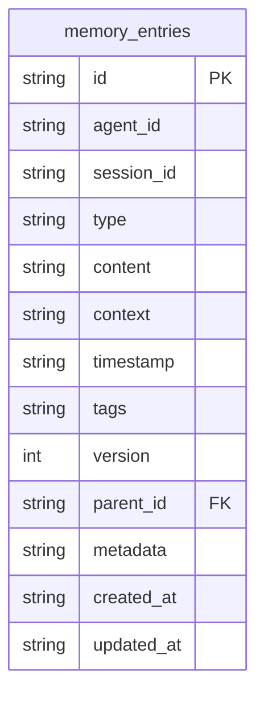
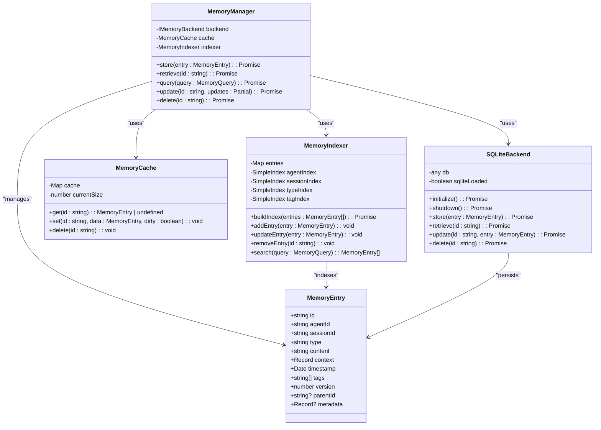
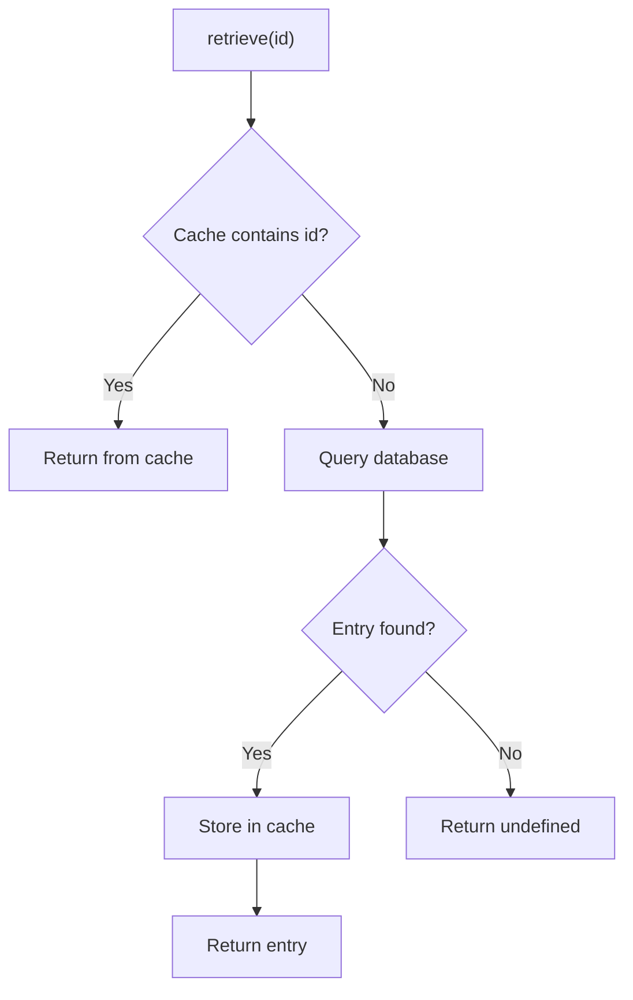
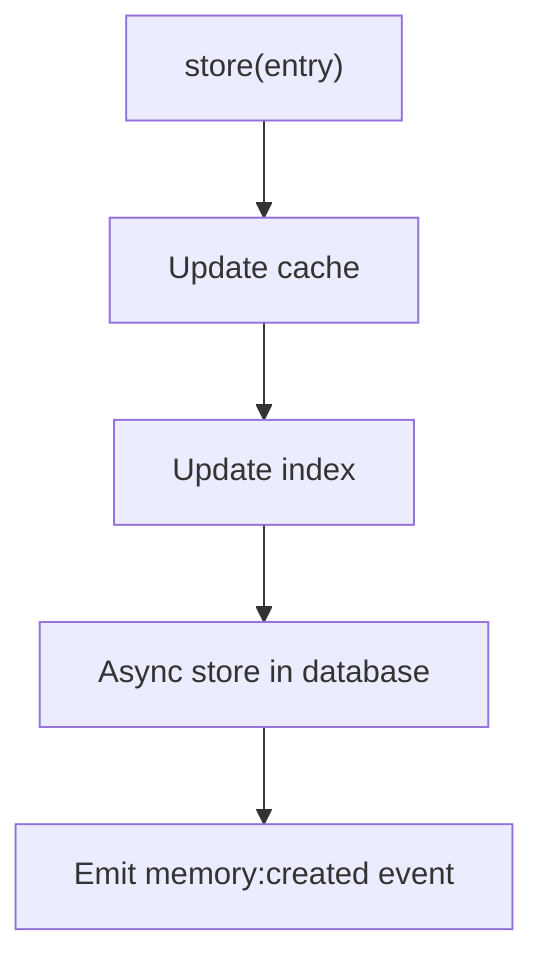
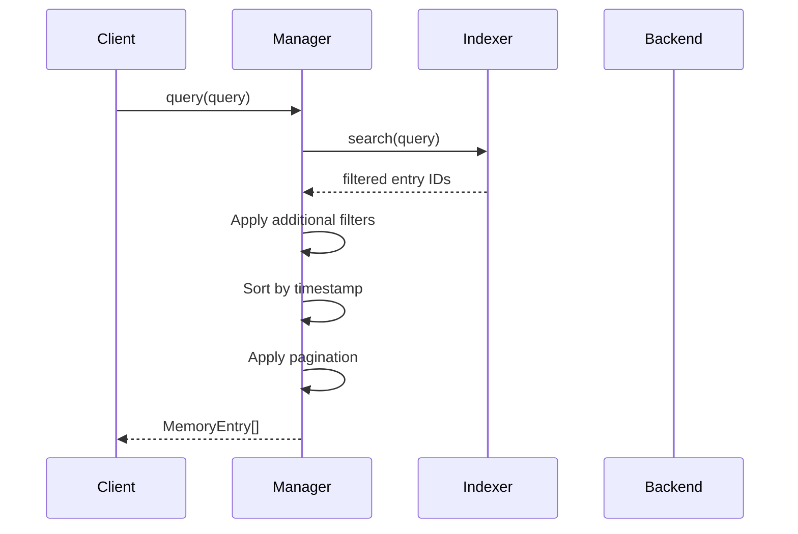
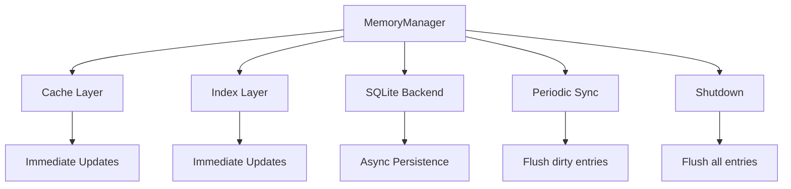
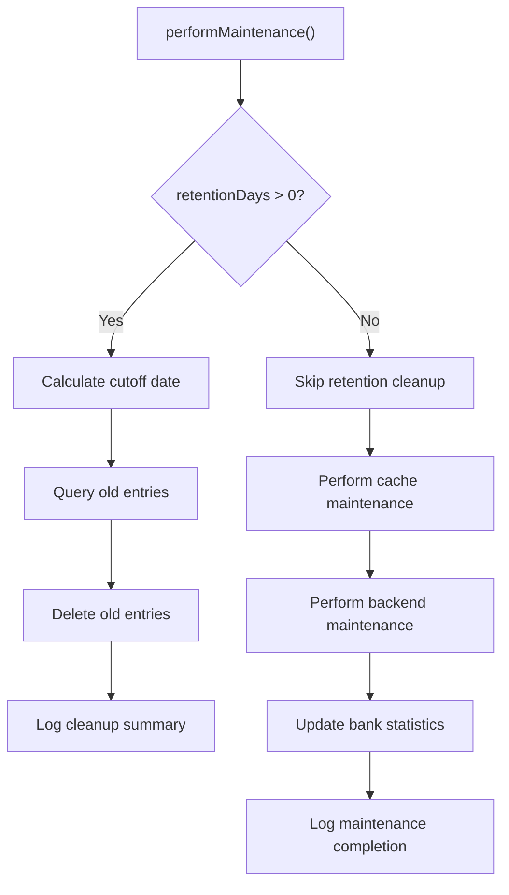
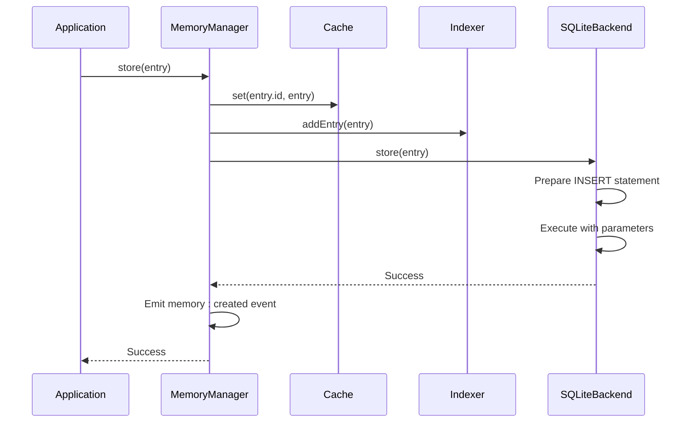

# Memory Persistence

<cite>
**Referenced Files in This Document**   
- [sqlite.ts](file://src/memory/backends/sqlite.ts)
- [manager.ts](file://src/memory/manager.ts)
- [types.ts](file://src/utils/types.ts)
- [base.ts](file://src/memory/backends/base.ts)
- [cache.ts](file://src/memory/cache.ts)
- [indexer.ts](file://src/memory/indexer.ts)
- [enhanced-schema.sql](file://src/memory/enhanced-schema.sql)
</cite>

## Table of Contents
1. [Introduction](#introduction)
2. [Database Schema](#database-schema)
3. [Entity Relationships](#entity-relationships)
4. [Data Validation and Constraints](#data-validation-and-constraints)
5. [Data Access Patterns](#data-access-patterns)
6. [Transaction Management](#transaction-management)
7. [Data Lifecycle and Retention](#data-lifecycle-and-retention)
8. [Schema Migration and Versioning](#schema-migration-and-versioning)
9. [Security and Access Control](#security-and-access-control)
10. [Implementation Examples](#implementation-examples)

## Introduction

The Memory Persistence system provides a robust storage solution for agent memory entries in the Claude-Flow framework. Built on SQLite as the primary backend, the system offers reliable, persistent storage with efficient querying capabilities. The architecture combines a database layer with in-memory caching and indexing to optimize performance while maintaining data integrity. This documentation details the comprehensive data model, storage mechanisms, and operational patterns that enable persistent memory management across agent sessions and workflows.

**Section sources**
- [manager.ts](file://src/memory/manager.ts#L0-L50)
- [sqlite.ts](file://src/memory/backends/sqlite.ts#L0-L50)

## Database Schema

The SQLite backend implements a normalized schema designed for efficient storage and retrieval of memory entries. The primary table, `memory_entries`, contains all persistent memory data with carefully selected data types and constraints to ensure data integrity.

### Table: memory_entries

| Column Name | Data Type | Constraints | Description |
|-------------|-----------|-----------|-------------|
| **id** | TEXT | PRIMARY KEY | Unique identifier for the memory entry |
| **agent_id** | TEXT | NOT NULL | Identifier of the agent that created the entry |
| **session_id** | TEXT | NOT NULL | Identifier of the agent session |
| **type** | TEXT | NOT NULL | Type of memory entry (observation, insight, decision, artifact, error) |
| **content** | TEXT | NOT NULL | Main content of the memory entry |
| **context** | TEXT | NOT NULL | JSON-serialized context metadata |
| **timestamp** | TEXT | NOT NULL | ISO 8601 timestamp of entry creation |
| **tags** | TEXT | NOT NULL | JSON-serialized array of tags for categorization |
| **version** | INTEGER | NOT NULL | Version number for optimistic concurrency control |
| **parent_id** | TEXT | NULLABLE | Reference to parent memory entry for hierarchical relationships |
| **metadata** | TEXT | NULLABLE | JSON-serialized additional metadata |
| **created_at** | TEXT | DEFAULT CURRENT_TIMESTAMP | Timestamp of record creation |
| **updated_at** | TEXT | DEFAULT CURRENT_TIMESTAMP | Timestamp of last record update |



**Diagram sources**
- [sqlite.ts](file://src/memory/backends/sqlite.ts#L250-L270)

**Section sources**
- [sqlite.ts](file://src/memory/backends/sqlite.ts#L250-L270)

## Entity Relationships

The memory persistence system establishes relationships between memory entries through foreign key references and indexing mechanisms. These relationships enable hierarchical organization of memories and efficient retrieval based on various criteria.

### Primary Entity: MemoryEntry

The `MemoryEntry` interface defines the structure of memory entries in the application layer, which maps directly to the `memory_entries` database table.

```typescript
interface MemoryEntry {
  id: string;
  agentId: string;
  sessionId: string;
  type: 'observation' | 'insight' | 'decision' | 'artifact' | 'error';
  content: string;
  context: Record<string, unknown>;
  timestamp: Date;
  tags: string[];
  version: number;
  parentId?: string;
  metadata?: Record<string, unknown>;
}
```

### Relationship Types

1. **Hierarchical Relationships**: Memory entries can form parent-child hierarchies through the `parentId` field, enabling the creation of memory trees for complex reasoning processes.

2. **Agent Relationships**: All memory entries are associated with a specific agent via the `agentId` field, allowing for agent-specific memory isolation and retrieval.

3. **Session Relationships**: Entries are grouped by session through the `sessionId` field, facilitating the reconstruction of agent workflows and thought processes.



**Diagram sources**
- [types.ts](file://src/utils/types.ts#L150-L170)
- [manager.ts](file://src/memory/manager.ts#L50-L100)
- [sqlite.ts](file://src/memory/backends/sqlite.ts#L20-L40)
- [cache.ts](file://src/memory/cache.ts#L10-L30)
- [indexer.ts](file://src/memory/indexer.ts#L50-L70)

**Section sources**
- [types.ts](file://src/utils/types.ts#L150-L170)
- [manager.ts](file://src/memory/manager.ts#L50-L100)

## Data Validation and Constraints

The memory persistence system implements multiple layers of data validation and constraints to ensure data integrity during CRUD operations. These validations occur at both the application and database levels.

### Application-Level Validation

The `MemoryManager` class performs validation before persisting entries to the backend:

1. **Initialization Check**: All operations verify that the memory manager is initialized before proceeding.
2. **Entry Existence**: Update and delete operations validate that the target entry exists.
3. **Type Safety**: The TypeScript interface ensures type correctness at compile time.
4. **Version Management**: Update operations automatically increment the version number for optimistic concurrency control.

### Database-Level Constraints

The SQLite schema enforces data integrity through the following constraints:

1. **Primary Key**: The `id` column serves as the primary key, ensuring uniqueness.
2. **NOT NULL Constraints**: Critical fields like `agent_id`, `session_id`, `type`, `content`, `context`, `timestamp`, `tags`, and `version` cannot be null.
3. **Data Type Enforcement**: SQLite enforces appropriate data types for each column.
4. **Default Values**: The `created_at` and `updated_at` columns automatically populate with timestamps.

### Data Integrity Rules

- **Immutable ID**: The `id` field cannot be changed during updates.
- **Version Increment**: Each update increases the `version` field by 1.
- **Timestamp Updates**: The `timestamp` field is updated on each modification.
- **JSON Serialization**: Complex objects (`context`, `tags`, `metadata`) are stored as JSON strings.

**Section sources**
- [manager.ts](file://src/memory/manager.ts#L264-L315)
- [sqlite.ts](file://src/memory/backends/sqlite.ts#L100-L150)

## Data Access Patterns

The memory persistence system implements optimized data access patterns that combine database operations with in-memory caching and indexing for high performance.

### Read Operations

Read operations follow a multi-layered approach to maximize efficiency:

1. **Cache First**: The `retrieve` method first checks the in-memory cache.
2. **Database Fallback**: If not found in cache, the entry is retrieved from the SQLite database.
3. **Cache Population**: Retrieved entries are added to the cache for future access.



**Diagram sources**
- [manager.ts](file://src/memory/manager.ts#L200-L229)

### Write Operations

Write operations follow an asynchronous persistence pattern:

1. **Immediate Cache Update**: The entry is immediately stored in the in-memory cache.
2. **Index Update**: The memory indexer is updated to reflect the new entry.
3. **Asynchronous Database Storage**: The entry is stored in the SQLite database in the background.



**Diagram sources**
- [manager.ts](file://src/memory/manager.ts#L180-L229)

### Query Operations

Query operations leverage the memory indexer for fast searches:

1. **Index-Based Filtering**: The indexer uses specialized indexes for agent_id, session_id, type, and tags.
2. **In-Memory Sorting**: Results are sorted by timestamp in memory.
3. **Pagination**: Results are paginated according to the query parameters.



**Diagram sources**
- [manager.ts](file://src/memory/manager.ts#L230-L263)
- [indexer.ts](file://src/memory/indexer.ts#L150-L200)

**Section sources**
- [manager.ts](file://src/memory/manager.ts#L180-L315)
- [indexer.ts](file://src/memory/indexer.ts#L150-L200)

## Transaction Management

The memory persistence system implements transaction management at multiple levels to ensure data consistency.

### Database Transactions

The SQLite backend uses SQLite's built-in transaction capabilities:

- **WAL Mode**: Write-Ahead Logging mode is enabled for better concurrency.
- **Atomic Operations**: Each CRUD operation is atomic within the database.
- **Automatic Transactions**: SQLite automatically manages transactions for individual statements.

### Application-Level Transactions

The system implements a transaction-like pattern through the following mechanisms:

1. **Cache Synchronization**: A periodic sync interval (configurable) flushes dirty cache entries to the database.
2. **Error Handling**: Failed database operations are logged but don't prevent cache updates, ensuring application responsiveness.
3. **Shutdown Flushing**: During shutdown, all cached entries are flushed to the database.



**Section sources**
- [manager.ts](file://src/memory/manager.ts#L450-L500)

## Data Lifecycle and Retention

The memory persistence system implements a comprehensive data lifecycle management strategy with configurable retention policies.

### Data Lifecycle Stages

1. **Creation**: Entries are created with a version of 1 and current timestamps.
2. **Modification**: Updates increment the version and update timestamps.
3. **Retrieval**: Entries can be queried using various criteria.
4. **Expiration**: Entries older than the retention period are automatically cleaned up.
5. **Deletion**: Entries are permanently removed from all storage layers.

### Retention Policies

The system supports configurable retention policies through the `retentionDays` configuration parameter:

- **Infinite Retention**: When `retentionDays` is 0 or negative, entries are retained indefinitely.
- **Time-Based Retention**: When `retentionDays` is positive, entries older than the specified number of days are automatically deleted.

### Maintenance Operations

The `performMaintenance` method executes periodic cleanup tasks:

1. **Expired Entry Cleanup**: Removes entries that exceed the retention period.
2. **Cache Maintenance**: Performs cache optimization tasks.
3. **Backend Maintenance**: Executes backend-specific maintenance operations.
4. **Bank Statistics Update**: Refreshes memory bank statistics.



**Diagram sources**
- [manager.ts](file://src/memory/manager.ts#L400-L450)

**Section sources**
- [manager.ts](file://src/memory/manager.ts#L400-L450)

## Schema Migration and Versioning

The memory persistence system supports schema evolution through a migration framework.

### Current Schema Version

The system uses a single table schema that can evolve through SQLite's ALTER TABLE commands. The current schema is defined in the `createTables` method of the `SQLiteBackend` class.

### Migration Strategy

The system implements a forward-only migration strategy:

1. **Schema Creation**: The `createTables` method uses `CREATE TABLE IF NOT EXISTS` to safely create tables.
2. **Index Management**: The `createIndexes` method uses `CREATE INDEX IF NOT EXISTS` to safely create indexes.
3. **Backward Compatibility**: The application layer maintains backward compatibility with older schema versions when possible.

### Future Migration Considerations

Potential future migrations might include:

- **Column Additions**: Adding new columns for enhanced metadata.
- **Index Optimization**: Creating composite indexes for common query patterns.
- **Partitioning**: Implementing table partitioning for very large datasets.
- **Encryption**: Adding encrypted columns for sensitive data.

**Section sources**
- [sqlite.ts](file://src/memory/backends/sqlite.ts#L250-L270)

## Security and Access Control

The memory persistence system implements security measures at multiple levels to protect stored data.

### Data Security

1. **File System Permissions**: The SQLite database file inherits the permissions of the parent directory.
2. **Process Isolation**: Database access is restricted to the application process.
3. **No Built-in Encryption**: The current implementation does not include database-level encryption.

### Access Control

The system implements access control through:

1. **Agent Isolation**: Memory entries are scoped to specific agents via the `agentId` field.
2. **Session Isolation**: Entries are further scoped to specific sessions via the `sessionId` field.
3. **Application-Level Authorization**: The `MemoryManager` validates operations based on the current context.

### Security Considerations

- **Sensitive Data**: The system should not store sensitive information without additional encryption.
- **Backup Security**: Database backups should be protected with appropriate security measures.
- **Access Logging**: Critical operations are logged for audit purposes.

**Section sources**
- [manager.ts](file://src/memory/manager.ts#L50-L100)
- [sqlite.ts](file://src/memory/backends/sqlite.ts#L50-L100)

## Implementation Examples

This section provides practical examples from the codebase showing how persistence is implemented and integrated.

### MemoryManager Initialization

The `MemoryManager` class serves as the primary interface for memory operations:

```typescript
class MemoryManager implements IMemoryManager {
  private backend: IMemoryBackend;
  private cache: MemoryCache;
  private indexer: MemoryIndexer;

  constructor(
    private config: MemoryConfig,
    private eventBus: IEventBus,
    private logger: ILogger,
  ) {
    this.backend = this.createBackend();
    this.cache = new MemoryCache(this.config.cacheSizeMB * 1024 * 1024, this.logger);
    this.indexer = new MemoryIndexer(this.logger);
  }

  async initialize(): Promise<void> {
    await this.backend.initialize();
    const allEntries = await this.backend.getAllEntries();
    await this.indexer.buildIndex(allEntries);
    this.startSyncInterval();
    this.initialized = true;
  }
}
```

**Section sources**
- [manager.ts](file://src/memory/manager.ts#L50-L150)

### SQLite Backend Implementation

The `SQLiteBackend` class provides the concrete implementation for SQLite persistence:

```typescript
export class SQLiteBackend implements IMemoryBackend {
  private db?: any;
  private sqliteLoaded: boolean = false;

  async initialize(): Promise<void> {
    const module = await import('../sqlite-wrapper.js');
    createDatabase = module.createDatabase;
    isSQLiteAvailable = module.isSQLiteAvailable;
    
    this.db = await createDatabase(this.dbPath);
    this.db.pragma('journal_mode = WAL');
    this.db.pragma('synchronous = NORMAL');
    
    this.createTables();
    this.createIndexes();
  }

  private createTables(): void {
    const sql = `
      CREATE TABLE IF NOT EXISTS memory_entries (
        id TEXT PRIMARY KEY,
        agent_id TEXT NOT NULL,
        session_id TEXT NOT NULL,
        type TEXT NOT NULL,
        content TEXT NOT NULL,
        context TEXT NOT NULL,
        timestamp TEXT NOT NULL,
        tags TEXT NOT NULL,
        version INTEGER NOT NULL,
        parent_id TEXT,
        metadata TEXT,
        created_at TEXT DEFAULT CURRENT_TIMESTAMP,
        updated_at TEXT DEFAULT CURRENT_TIMESTAMP
      )
    `;
    this.db!.exec(sql);
  }
}
```

**Section sources**
- [sqlite.ts](file://src/memory/backends/sqlite.ts#L20-L100)

### Memory Entry Creation Flow

The complete flow for creating a memory entry demonstrates the integration between components:



**Diagram sources**
- [manager.ts](file://src/memory/manager.ts#L180-L229)
- [sqlite.ts](file://src/memory/backends/sqlite.ts#L100-L150)

**Section sources**
- [manager.ts](file://src/memory/manager.ts#L180-L229)
- [sqlite.ts](file://src/memory/backends/sqlite.ts#L100-L150)