# Memory System

<cite>
**Referenced Files in This Document**   
- [memory-manager.ts](file://archive/legacy-memory-system/src/core/memory-manager.ts)
- [types.ts](file://archive/legacy-memory-system/src/types.ts)
- [sqlite-backend.ts](file://archive/legacy-memory-system/src/backends/sqlite-backend.ts)
- [memory-cache.ts](file://archive/legacy-memory-system/src/cache/memory-cache.ts)
- [memory-indexer.ts](file://archive/legacy-memory-system/src/indexer/memory-indexer.ts)
- [replication-manager.ts](file://archive/legacy-memory-system/src/replication/replication-manager.ts)
- [namespace-manager.ts](file://archive/legacy-memory-system/src/namespaces/namespace-manager.ts)
- [memory-store.json](file://memory/memory-store.json)
- [README.md](file://archive/legacy-memory-system/README.md)
- [memory-bank.md](file://archive/legacy-memory-system/memory-bank.md)
</cite>

## Table of Contents
1. [Introduction](#introduction)
2. [Data Model and Schema](#data-model-and-schema)
3. [Database Schema and Storage](#database-schema-and-storage)
4. [Caching Strategies](#caching-strategies)
5. [Indexing and Search](#indexing-and-search)
6. [Distributed Replication](#distributed-replication)
7. [Namespace Isolation and Access Control](#namespace-isolation-and-access-control)
8. [Data Lifecycle and Retention](#data-lifecycle-and-retention)
9. [Data Access Patterns](#data-access-patterns)
10. [Security and Privacy](#security-and-privacy)
11. [Practical Examples in Swarm Operations](#practical-examples-in-swarm-operations)
12. [Conclusion](#conclusion)

## Introduction

The Memory System is a sophisticated persistent memory solution designed for multi-agent collaborative development within the Claude-Flow ecosystem. Built on the SPARC methodology (Specification, Pseudocode, Architecture, Refinement, Completion), this system enables multiple AI agents to share knowledge, coordinate tasks, and maintain context across concurrent development processes. The system provides hybrid storage backends, CRDT-based conflict resolution, advanced indexing, distributed replication, and namespace isolation with fine-grained permissions.

The Memory System serves as the central nervous system for agent coordination, allowing for persistent storage of workflow states, agent communications, task progress, and shared knowledge. It supports both SQLite for high-performance operations and Markdown for human-readable storage, making it suitable for both automated processes and manual inspection.

**Section sources**
- [README.md](file://archive/legacy-memory-system/README.md#L1-L50)
- [memory-bank.md](file://archive/legacy-memory-system/memory-bank.md#L1-L50)

## Data Model and Schema

The Memory System's data model is centered around the `MemoryItem` entity, which represents the fundamental unit of stored information. Each memory item contains structured data with flexible metadata, enabling rich contextual storage and retrieval.

### Entity Relationships

The data model consists of several interconnected entities that work together to provide comprehensive memory management:

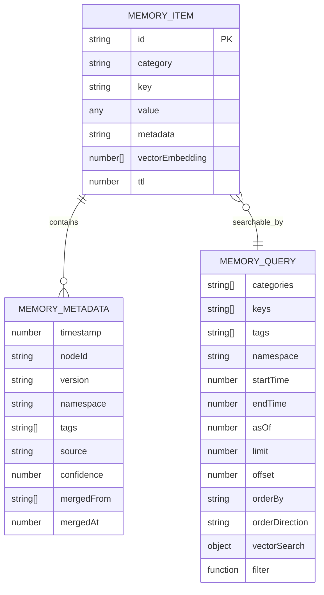

**Diagram sources**
- [types.ts](file://archive/legacy-memory-system/src/types.ts#L1-L50)

### Field Definitions

#### MemoryItem
The core entity in the system, representing a single memory entry with the following fields:

- **id**: Unique identifier for the memory item (string)
- **category**: Classification of the memory item (string)
- **key**: Key identifier within the category (string)
- **value**: The actual data being stored (any type)
- **metadata**: Additional contextual information (MemoryMetadata object)
- **vectorEmbedding**: Numerical representation for semantic search (number array)
- **ttl**: Time-to-live in milliseconds (number)

#### MemoryMetadata
Contains contextual information about a memory item:

- **timestamp**: Creation or last update time (number)
- **nodeId**: Identifier of the node that created the item (string)
- **version**: Version identifier for conflict resolution (string)
- **namespace**: Logical grouping for access control (string)
- **tags**: Array of descriptive tags for categorization (string array)
- **source**: Origin of the memory item (string)
- **confidence**: Confidence level in the accuracy of the information (number)
- **mergedFrom**: Array of IDs from which this item was merged (string array)
- **mergedAt**: Timestamp when merging occurred (number)

#### MemoryQuery
Defines the parameters for querying memory items:

- **categories**: Filter by specific categories (string array)
- **keys**: Filter by specific keys (string array)
- **tags**: Filter by tags (string array)
- **namespace**: Filter by namespace (string)
- **startTime**: Filter by minimum timestamp (number)
- **endTime**: Filter by maximum timestamp (number)
- **asOf**: Time-travel query to retrieve state at a specific time (number)
- **limit**: Maximum number of results to return (number)
- **offset**: Number of results to skip (number)
- **orderBy**: Field to sort by (string)
- **orderDirection**: Sort direction ('asc' or 'desc')
- **vectorSearch**: Parameters for semantic search (object)
- **filter**: Custom filtering function (function)

**Section sources**
- [types.ts](file://archive/legacy-memory-system/src/types.ts#L1-L100)

## Database Schema and Storage

The Memory System implements a robust SQLite database schema with comprehensive indexing and versioning capabilities to ensure data integrity and efficient querying.

### Database Schema Diagram

```mermaid
erDiagram
MEMORY_ITEMS {
string id PK
string category
string key
text value
text metadata
blob vector_embedding
integer ttl
integer created_at
integer updated_at
string version
string namespace
}
MEMORY_VERSIONS {
integer id PK
string item_id FK
string category
string key
text value
text metadata
string version
integer timestamp
string operation
}
MEMORY_ITEMS ||--o{ MEMORY_VERSIONS : version_history
INDEX idx_category ON MEMORY_ITEMS(category)
INDEX idx_key ON MEMORY_ITEMS(key)
INDEX idx_namespace ON MEMORY_ITEMS(namespace)
INDEX idx_created_at ON MEMORY_ITEMS(created_at)
INDEX idx_category_key ON MEMORY_ITEMS(category, key)
INDEX idx_namespace_category ON MEMORY_ITEMS(namespace, category)
INDEX idx_versions_item_id ON MEMORY_VERSIONS(item_id)
INDEX idx_versions_timestamp ON MEMORY_VERSIONS(timestamp)
```

**Diagram sources**
- [sqlite-backend.ts](file://archive/legacy-memory-system/src/backends/sqlite-backend.ts#L50-L150)

### Schema Details

The database schema consists of two primary tables:

#### memory_items
The main table storing current memory entries with the following columns:

- **id**: Primary key, unique identifier (TEXT)
- **category**: Category classification (TEXT, NOT NULL)
- **key**: Key identifier (TEXT, NOT NULL)
- **value**: Serialized JSON data (TEXT, NOT NULL)
- **metadata**: Serialized JSON metadata (TEXT)
- **vector_embedding**: Binary representation of vector embeddings (BLOB)
- **ttl**: Time-to-live in milliseconds (INTEGER)
- **created_at**: Creation timestamp (INTEGER, NOT NULL)
- **updated_at**: Last update timestamp (INTEGER, NOT NULL)
- **version**: Version identifier for conflict resolution (TEXT)
- **namespace**: Logical grouping for access control (TEXT, DEFAULT 'default')

The table includes a unique constraint on the combination of category, key, and namespace to prevent duplicate entries.

#### memory_versions
A history table that maintains version history for time-travel queries:

- **id**: Auto-incrementing primary key (INTEGER)
- **item_id**: Foreign key referencing memory_items.id (TEXT, NOT NULL)
- **category**: Category at time of version (TEXT, NOT NULL)
- **key**: Key at time of version (TEXT, NOT NULL)
- **value**: Serialized JSON value at time of version (TEXT, NOT NULL)
- **metadata**: Serialized JSON metadata at time of version (TEXT)
- **version**: Version identifier (TEXT, NOT NULL)
- **timestamp**: When the version was created (INTEGER, NOT NULL)
- **operation**: Type of operation (TEXT, NOT NULL)

### Indexes and Performance

The system implements multiple indexes to optimize query performance:

- **Category index**: Speeds up queries filtering by category
- **Key index**: Optimizes lookups by key
- **Namespace index**: Improves performance for namespace-based queries
- **Created_at index**: Enables efficient time-range queries
- **Composite category-key index**: Optimizes queries filtering by both category and key
- **Composite namespace-category index**: Enhances performance for namespace and category queries
- **Version history indexes**: Supports efficient retrieval of historical data

Additionally, the system uses FTS5 (Full-Text Search) virtual tables for advanced text search capabilities, with triggers automatically maintaining synchronization between the main table and the FTS table.

**Section sources**
- [sqlite-backend.ts](file://archive/legacy-memory-system/src/backends/sqlite-backend.ts#L50-L200)

## Caching Strategies

The Memory System implements a sophisticated caching layer to improve performance and reduce database load. The cache uses different eviction strategies based on configuration, providing flexibility for various use cases.

### Cache Architecture

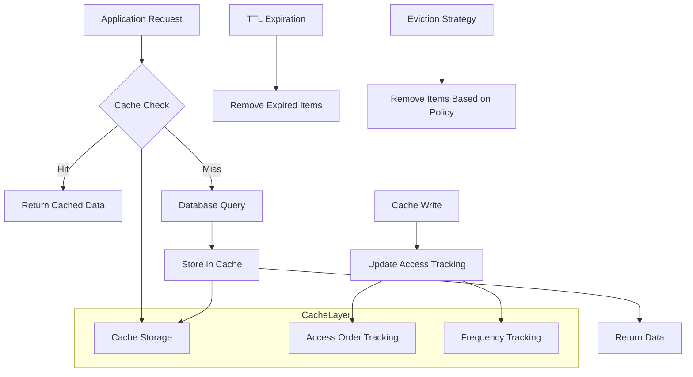

**Diagram sources**
- [memory-cache.ts](file://archive/legacy-memory-system/src/cache/memory-cache.ts#L1-L50)

### Eviction Strategies

The system supports three primary eviction strategies:

#### LRU (Least Recently Used)
Removes the least recently accessed items when the cache reaches capacity. This strategy is ideal for workloads where recently accessed items are likely to be accessed again.

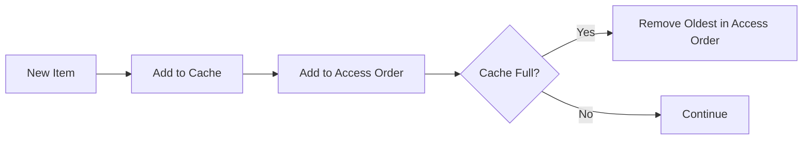

#### LFU (Least Frequently Used)
Removes the least frequently accessed items, tracking access frequency. This strategy works well when certain items are accessed much more frequently than others.

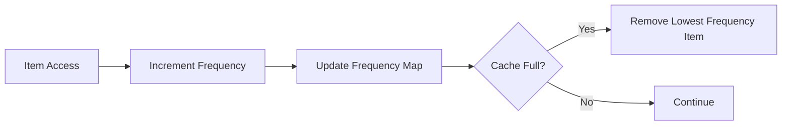

#### FIFO (First In, First Out)
Removes the oldest items regardless of access patterns. This strategy provides predictable behavior and is simple to implement.

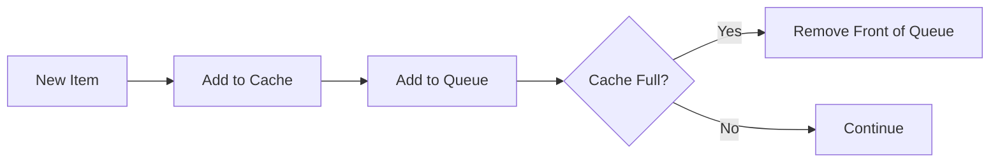

### Cache Configuration

The cache can be configured with the following parameters:

- **maxSize**: Maximum number of items in the cache
- **ttl**: Time-to-live for cache entries in milliseconds
- **strategy**: Eviction strategy ('lru', 'lfu', or 'fifo')
- **onEvict**: Callback function triggered when an item is evicted

The system automatically performs periodic cleanup of expired items and updates hit/miss statistics to monitor cache effectiveness.

**Section sources**
- [memory-cache.ts](file://archive/legacy-memory-system/src/cache/memory-cache.ts#L1-L200)

## Indexing and Search

The Memory System provides advanced indexing capabilities to enable fast and flexible querying of stored memory items. The indexing system supports both traditional field-based queries and semantic vector search.

### Indexing Architecture

```mermaid
classDiagram
class MemoryIndexer {
+index(item : MemoryItem)
+remove(category : string, key : string)
+query(query : MemoryQuery)
+vectorSearch(query : MemoryQuery)
+rebuildIndex()
+processUpdateQueue()
}
class Index {
+byCategory : Map<string, Set<string>>
+byTag : Map<string, Set<string>>
+byNamespace : Map<string, Set<string>>
+byTimestamp : Array<{id : string, timestamp : number}>
+vectors : VectorIndex
}
class VectorIndex {
+dimensions : number
+vectors : Map<string, Float32Array>
+metadata : Map<string, {category : string, key : string}>
}
MemoryIndexer --> Index : contains
Index --> VectorIndex : optional
MemoryIndexer --> MemoryBackend : queries
```

**Diagram sources**
- [memory-indexer.ts](file://archive/legacy-memory-system/src/indexer/memory-indexer.ts#L1-L50)

### Index Types

The system maintains several types of indexes to optimize different query patterns:

#### Category Index
Maps categories to sets of item IDs, enabling fast retrieval of all items within a specific category.

#### Tag Index
Maps tags to sets of item IDs, allowing for efficient filtering by multiple tags.

#### Namespace Index
Maps namespaces to sets of item IDs, supporting namespace-based isolation and queries.

#### Timestamp Index
Maintains a sorted array of items by timestamp, facilitating time-range queries and chronological operations.

#### Vector Index
Stores vector embeddings for semantic search, with support for cosine similarity calculations.

### Search Capabilities

The system supports multiple search methods:

#### Traditional Queries
Supports filtering by categories, keys, tags, namespaces, and time ranges with sorting and pagination.

#### Full-Text Search
Leverages SQLite's FTS5 extension for efficient text search within item values and metadata.

#### Vector Search
Enables semantic search by comparing vector embeddings using cosine similarity:

```typescript
const results = await memory.query({
  vectorSearch: {
    embedding: queryEmbedding,
    threshold: 0.8,
    topK: 10
  }
});
```

The vector search returns results sorted by similarity score, allowing for contextually relevant memory retrieval.

**Section sources**
- [memory-indexer.ts](file://archive/legacy-memory-system/src/indexer/memory-indexer.ts#L1-L200)

## Distributed Replication

The Memory System includes a robust replication framework that enables distributed memory synchronization across multiple nodes, supporting both master-slave and peer-to-peer architectures.

### Replication Architecture

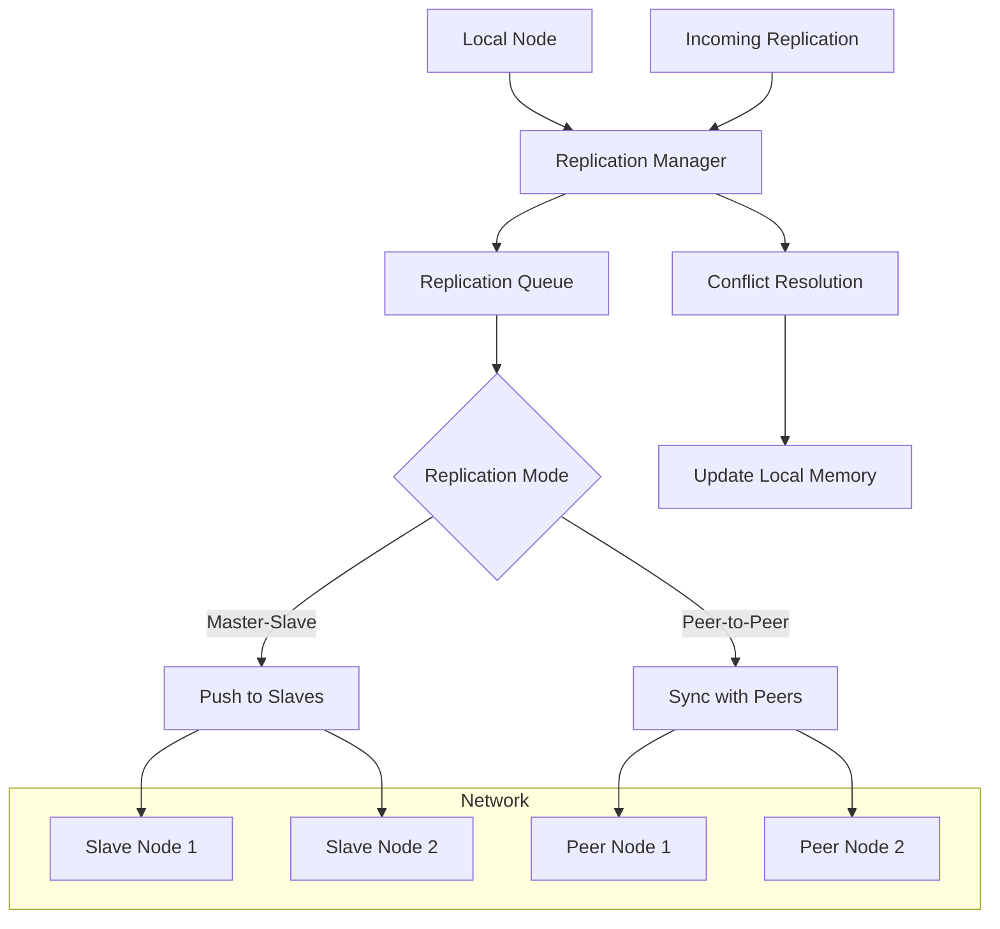

**Diagram sources**
- [replication-manager.ts](file://archive/legacy-memory-system/src/replication/replication-manager.ts#L1-L50)

### Replication Modes

#### Master-Slave
In this mode, one node acts as the master, accepting all writes and propagating changes to slave nodes. This provides strong consistency and is suitable for scenarios where a single source of truth is required.

#### Peer-to-Peer
All nodes are equal and synchronize changes with each other. This mode provides higher availability and fault tolerance, as any node can accept writes and continue operating if others fail.

### Conflict Resolution

The system uses CRDT (Conflict-Free Replicated Data Type) based conflict resolution to handle concurrent modifications:

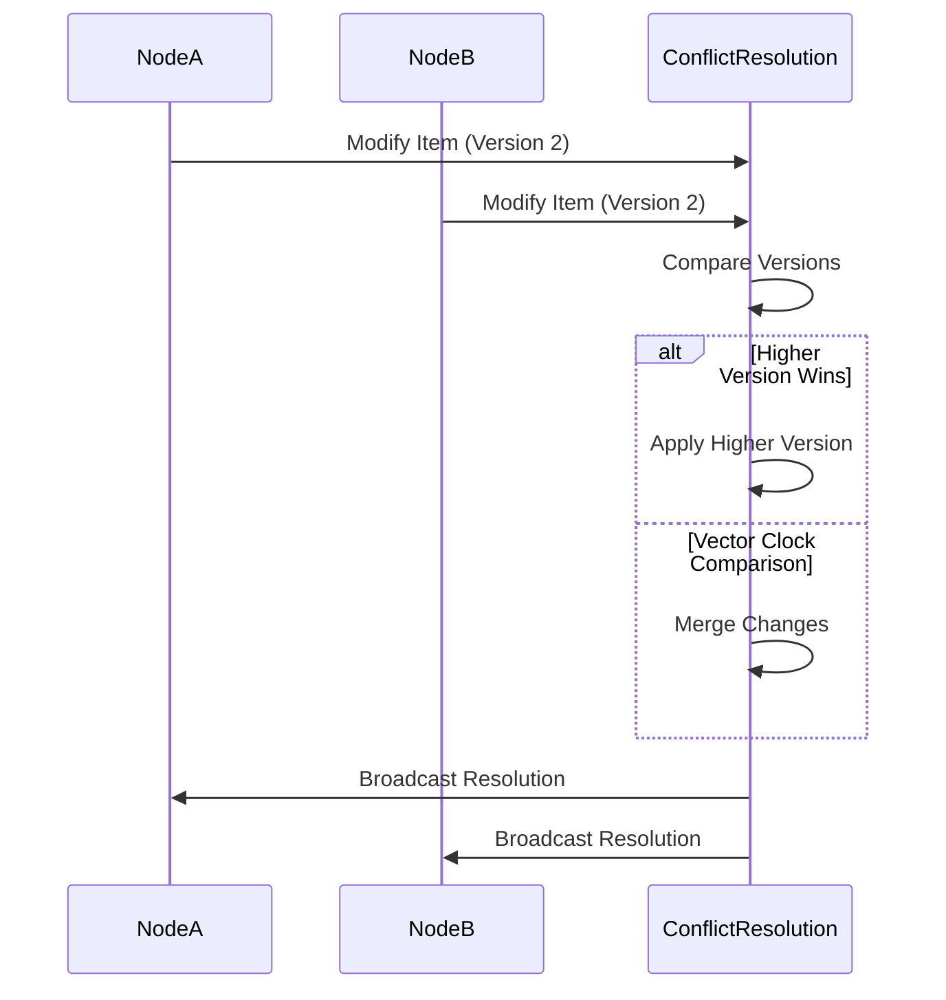

**Diagram sources**
- [memory-manager.ts](file://archive/legacy-memory-system/src/core/memory-manager.ts#L1-L50)

The conflict resolution system supports multiple strategies:
- Last-write-wins based on timestamps
- Vector clocks for causal ordering
- Custom resolution logic for complex scenarios

Replication messages include source node identifiers, timestamps, and digital signatures to ensure message integrity and prevent replay attacks.

**Section sources**
- [replication-manager.ts](file://archive/legacy-memory-system/src/replication/replication-manager.ts#L1-L200)

## Namespace Isolation and Access Control

The Memory System implements namespace-based isolation to provide multi-tenancy and access control, allowing different agents, sessions, or projects to maintain separate memory spaces.

### Namespace Architecture

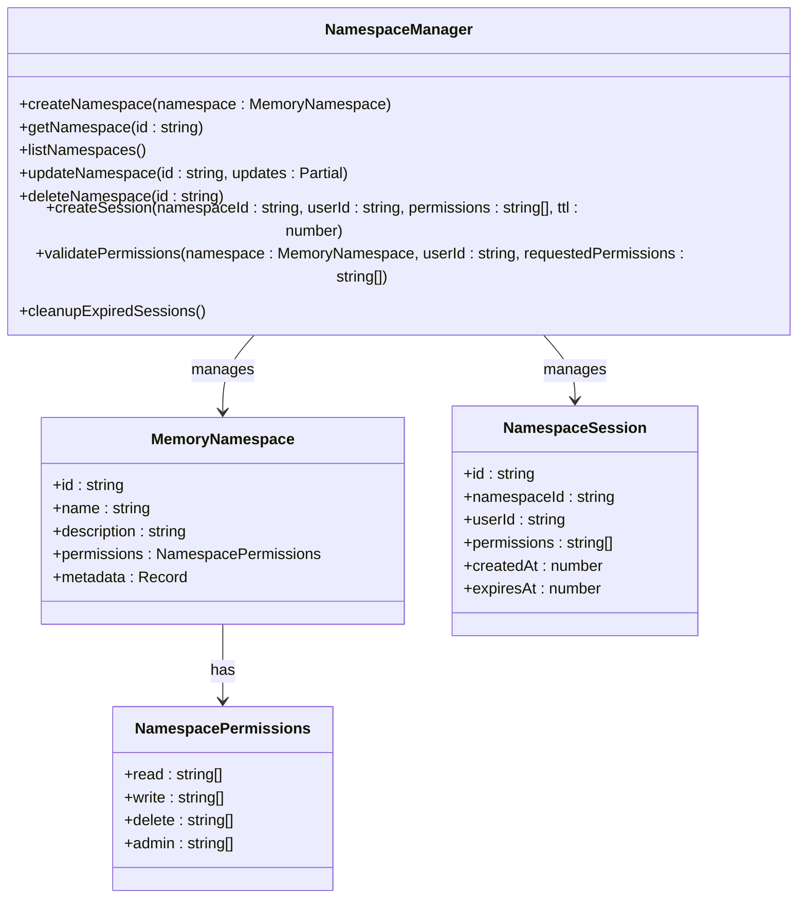

**Diagram sources**
- [namespace-manager.ts](file://archive/legacy-memory-system/src/namespaces/namespace-manager.ts#L1-L50)

### Namespace Structure

Each namespace has a unique identifier and contains the following properties:

- **id**: Unique identifier for the namespace
- **name**: Human-readable name
- **description**: Detailed description of the namespace purpose
- **permissions**: Fine-grained access control rules
- **metadata**: Additional configuration and properties

### Access Control Model

The system implements a comprehensive access control model with four permission levels:

#### Read
Allows retrieval of memory items within the namespace.

#### Write
Allows creation and modification of memory items.

#### Delete
Allows removal of memory items.

#### Admin
Allows management of the namespace itself, including modifying permissions and deleting the namespace.

Permissions are assigned to specific users or roles, enabling granular control over namespace access. The system also supports wildcard permissions using the '*' symbol.

### Session Management

The system uses session-based access control, where users obtain a session token with specific permissions for a namespace:

```typescript
// Create a session with read and write permissions
const sessionId = namespaceManager.createSession(
  'project-alpha',
  'user123',
  ['read', 'write'],
  3600000 // 1 hour TTL
);

// Use session for memory operations
await memory.store(item, 'project-alpha', sessionId);
```

Sessions automatically expire based on their TTL, and the system performs periodic cleanup of expired sessions to maintain security.

**Section sources**
- [namespace-manager.ts](file://archive/legacy-memory-system/src/namespaces/namespace-manager.ts#L1-L200)

## Data Lifecycle and Retention

The Memory System implements comprehensive data lifecycle management with configurable retention policies, archival rules, and data migration capabilities.

### Data Lifecycle Stages

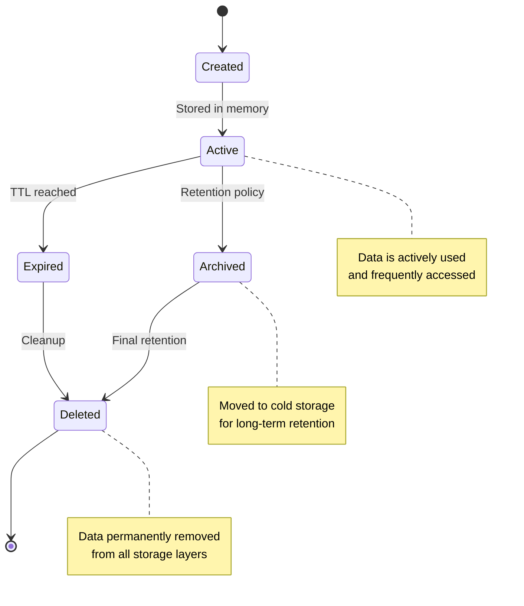

**Diagram sources**
- [memory-manager.ts](file://archive/legacy-memory-system/src/core/memory-manager.ts#L1-L50)

### Retention Policies

The system supports multiple retention mechanisms:

#### Time-to-Live (TTL)
Individual memory items can be assigned a TTL value in milliseconds, after which they are automatically expired and removed from active storage.

#### Namespace-Level Retention
Entire namespaces can have retention policies that determine how long data is kept before archival or deletion.

#### Version History Retention
Historical versions are retained for a configurable period, enabling time-travel queries and point-in-time recovery.

### Archival Rules

When data reaches the end of its active lifecycle, it can be archived according to configurable rules:

- **Automated Archival**: Data is automatically moved to cold storage based on age or access patterns
- **Manual Archival**: Users can explicitly archive data for long-term retention
- **Compliance Archival**: Data is archived to meet regulatory requirements

Archived data is stored in compressed, encrypted format to minimize storage costs while maintaining accessibility.

### Data Migration

The system includes robust data migration capabilities for schema changes:

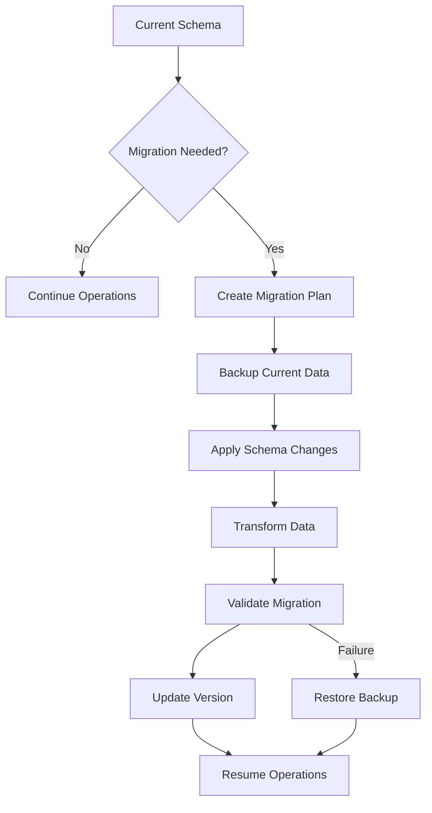

**Diagram sources**
- [memory-manager.ts](file://archive/legacy-memory-system/src/core/memory-manager.ts#L1-L50)

Migration paths include:
- Schema versioning with automatic detection of required migrations
- Backward compatibility for reading older data formats
- Data transformation functions for field mapping and type conversion
- Rollback procedures for failed migrations

**Section sources**
- [memory-manager.ts](file://archive/legacy-memory-system/src/core/memory-manager.ts#L1-L200)

## Data Access Patterns

The Memory System supports various data access patterns optimized for different use cases in swarm operations.

### Common Access Patterns

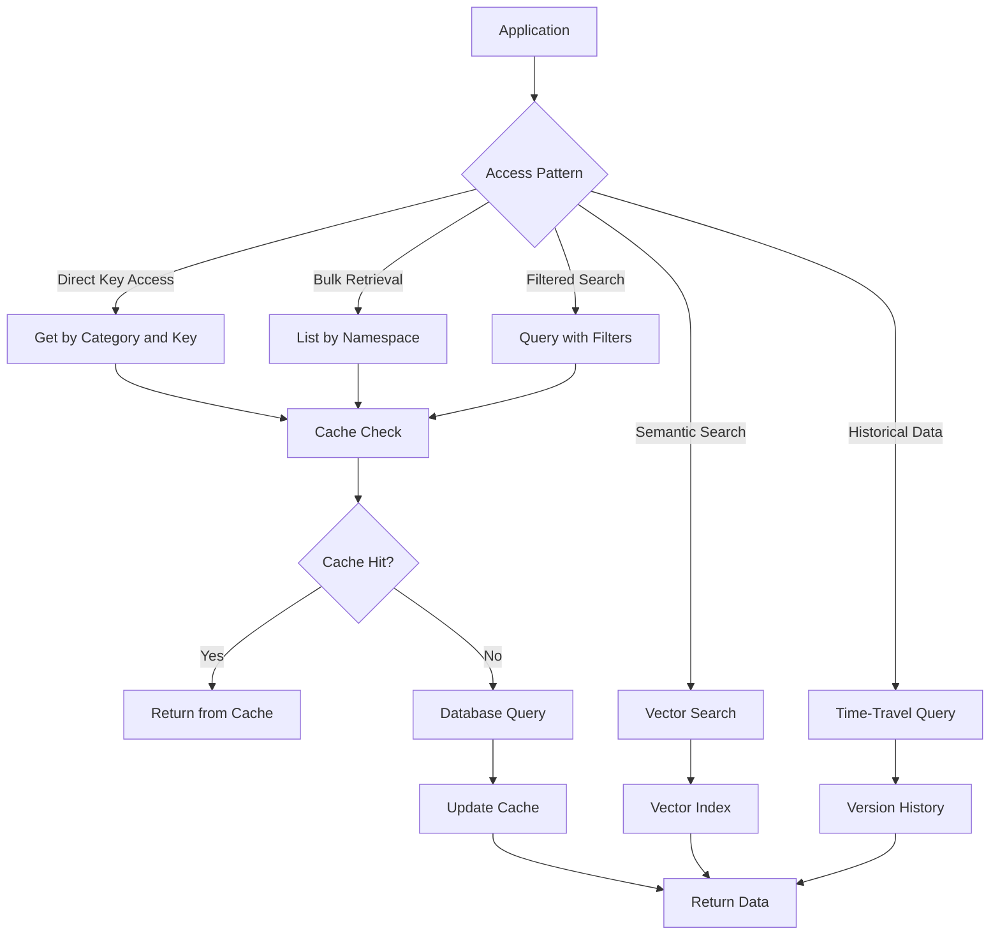

**Diagram sources**
- [memory-manager.ts](file://archive/legacy-memory-system/src/core/memory-manager.ts#L1-L50)

### Performance Considerations

The system implements several optimizations for high-performance memory operations:

#### Read Optimization
- Multi-level caching with LRU/LFU/FIFO strategies
- Index-based query optimization
- Batch retrieval for related items
- Asynchronous operations for non-critical paths

#### Write Optimization
- Write buffering and batching
- Asynchronous persistence
- Optimistic locking for concurrent writes
- Background compaction and maintenance

#### Memory Management
- Configurable cache sizes to balance performance and memory usage
- Automatic cleanup of expired items
- Memory pressure monitoring and adaptive behavior
- Efficient serialization and deserialization

The system also provides detailed statistics and monitoring capabilities to track performance metrics such as cache hit rates, query latencies, and memory usage patterns.

**Section sources**
- [memory-manager.ts](file://archive/legacy-memory-system/src/core/memory-manager.ts#L1-L200)

## Security and Privacy

The Memory System implements comprehensive security and privacy measures to protect sensitive data and ensure compliance with data protection regulations.

### Security Architecture

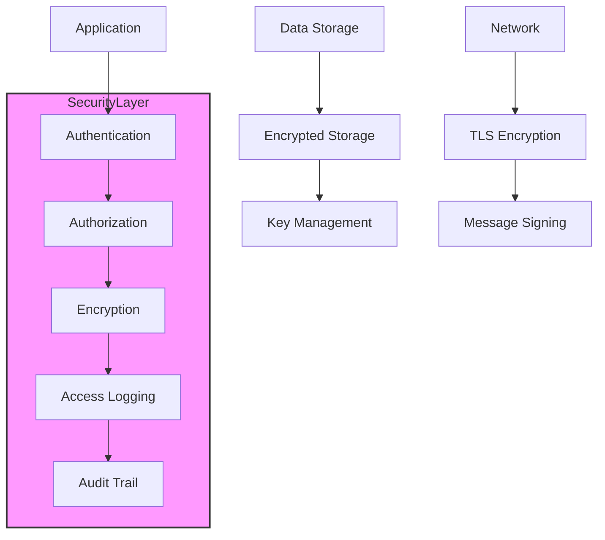

**Diagram sources**
- [memory-manager.ts](file://archive/legacy-memory-system/src/core/memory-manager.ts#L1-L50)

### Access Control

The system implements a multi-layered access control model:

#### Authentication
- Session-based authentication with time-limited tokens
- Secure token generation and validation
- Support for integration with external identity providers

#### Authorization
- Role-based access control (RBAC) with fine-grained permissions
- Namespace-level permission management
- Attribute-based access control (ABAC) for complex scenarios

### Data Protection

#### Encryption
- At-rest encryption for stored data
- In-transit encryption using TLS
- End-to-end encryption for sensitive data
- Client-side encryption options

#### Privacy Features
- Data anonymization and pseudonymization
- Right to be forgotten implementation
- Data minimization principles
- Consent management

### Audit and Compliance

The system maintains comprehensive audit logs that record all access and modification operations:

- **Access Logs**: Track who accessed what data and when
- **Modification Logs**: Record all changes to memory items
- **Security Events**: Log authentication attempts and security-related events
- **Compliance Reports**: Generate reports for regulatory compliance

These logs are protected against tampering and can be exported for external audit purposes.

**Section sources**
- [memory-manager.ts](file://archive/legacy-memory-system/src/core/memory-manager.ts#L1-L200)

## Practical Examples in Swarm Operations

The Memory System plays a crucial role in swarm operations, enabling coordination and knowledge sharing among multiple AI agents.

### Workflow Coordination

In a typical swarm workflow, agents use the memory system to coordinate their activities:

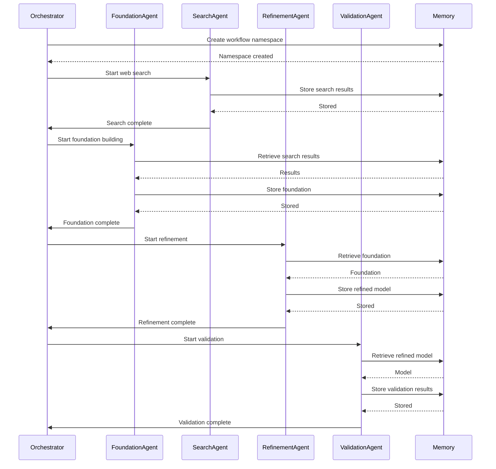

**Diagram sources**
- [memory-store.json](file://memory/memory-store.json#L1-L50)

### Sample Data from Swarm Operations

The memory store contains real examples of swarm operations, such as workflow execution records:

```json
{
  "key": "workflow/workflow-exec-1754319459673-96rujiytv/dataset_analysis",
  "value": "{\"status\":\"completed\",\"agent\":\"foundation_agent\",\"executionTime\":5065,\"metadata\":{\"timestamp\":\"2025-08-04T14:57:49.366Z\",\"executionId\":\"workflow-exec-1754319459673-96rujiytv\"}}",
  "namespace": "default",
  "timestamp": 1754319470862
}
```

This entry shows a completed dataset analysis phase, including the agent that performed it, execution time, and metadata.

### Agent Communication

Agents use the memory system to communicate and hand off tasks:

```json
{
  "key": "agent/search_agent/handoff",
  "value": "{\"from\":\"search_agent\",\"to\":\"foundation_agent\",\"workflow\":\"workflow-exec-1754319839721-454uw778d\",\"status\":\"ready_for_foundation_phase\",\"message\":\"Web search phase completed. Ready for foundation model building based on discovered approaches.\",\"timestamp\":\"2025-08-04T15:06:15.645Z\"}",
  "namespace": "default",
  "timestamp": 1754319988561
}
```

This handoff message indicates that the search agent has completed its work and is ready for the foundation agent to begin.

### Pattern Recognition

The system stores neural patterns and their performance metrics:

```json
{
  "key": "pattern/ablation_analysis/strategy",
  "value": "{\"phase\":\"ablation_analysis\",\"components\":[\"preprocessing\",\"feature_engineering\",\"model_architecture\",\"hyperparameters\"],\"strategy\":\"component_impact_ranking\",\"timestamp\":\"2025-08-04T15:05:33Z\"}",
  "namespace": "default",
  "timestamp": 1754319975290
}
```

This pattern shows the strategy used for ablation analysis, which can be reused in future workflows.

**Section sources**
- [memory-store.json](file://memory/memory-store.json#L1-L200)

## Conclusion

The Memory System provides a comprehensive solution for persistent memory management in multi-agent systems. Its hybrid storage architecture, advanced indexing capabilities, and distributed replication features make it well-suited for complex swarm operations. The system's support for namespaces, access control, and data lifecycle management ensures that memory can be organized and secured according to specific requirements.

Key strengths of the system include:
- Flexible storage backends (SQLite and Markdown)
- CRDT-based conflict resolution for distributed scenarios
- Advanced caching with multiple eviction strategies
- Vector search for semantic querying
- Namespace isolation with fine-grained permissions
- Comprehensive data lifecycle management

The system has been successfully used in various swarm operations, demonstrating its effectiveness in coordinating multiple agents and maintaining persistent knowledge across workflows. Future enhancements could include improved machine learning integration, enhanced privacy features, and expanded analytics capabilities.