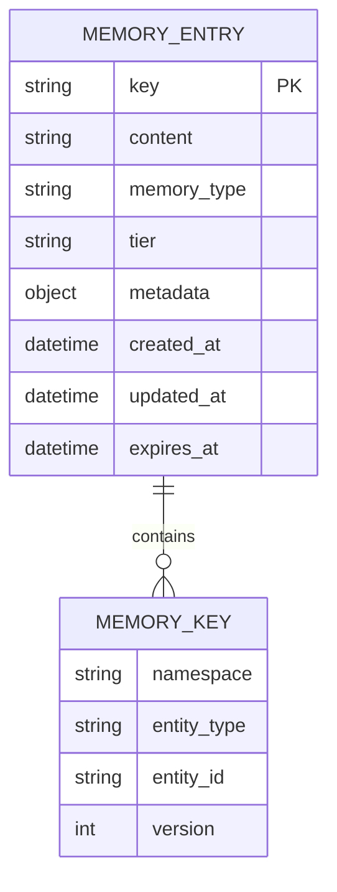
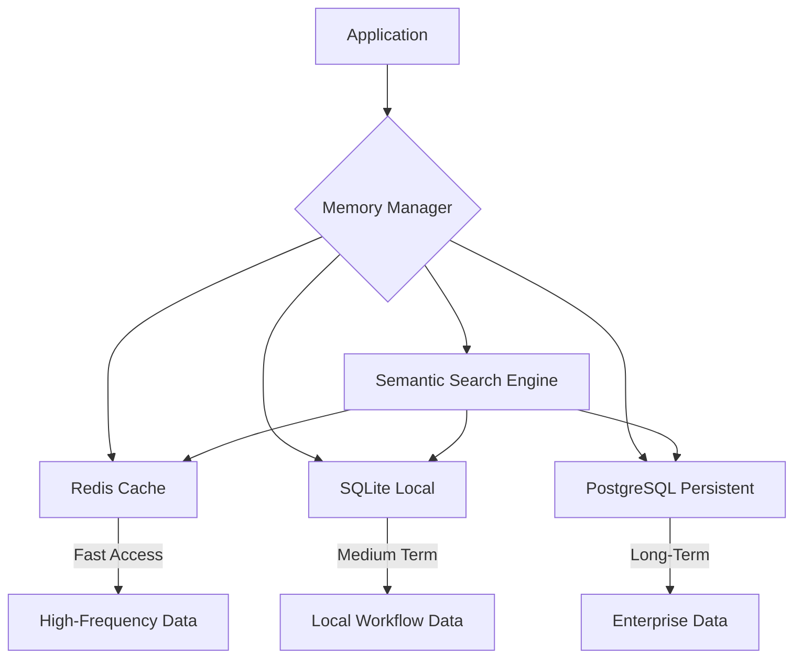
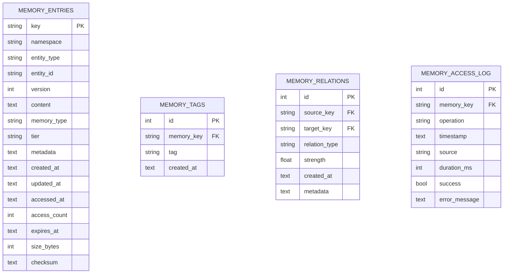
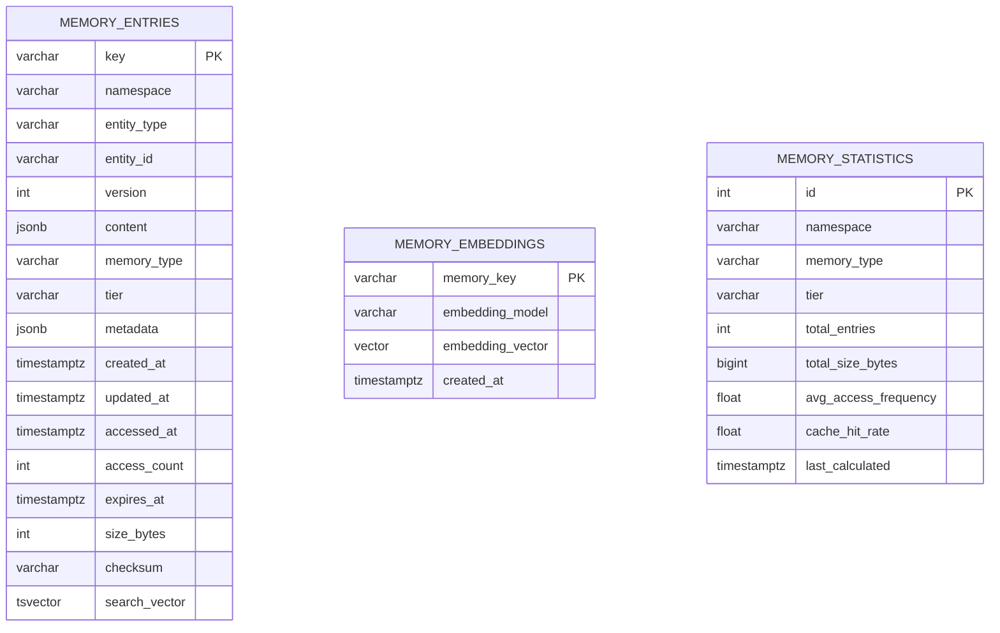
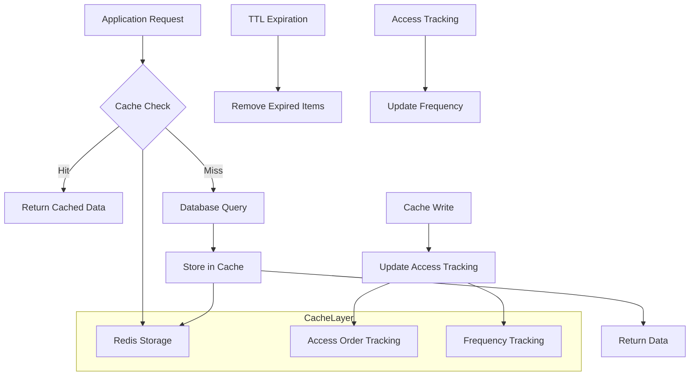
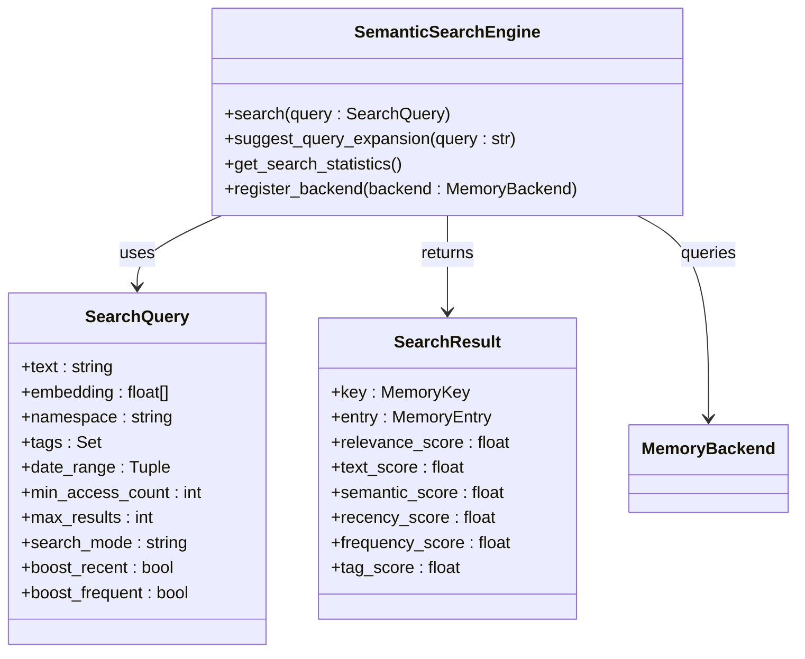
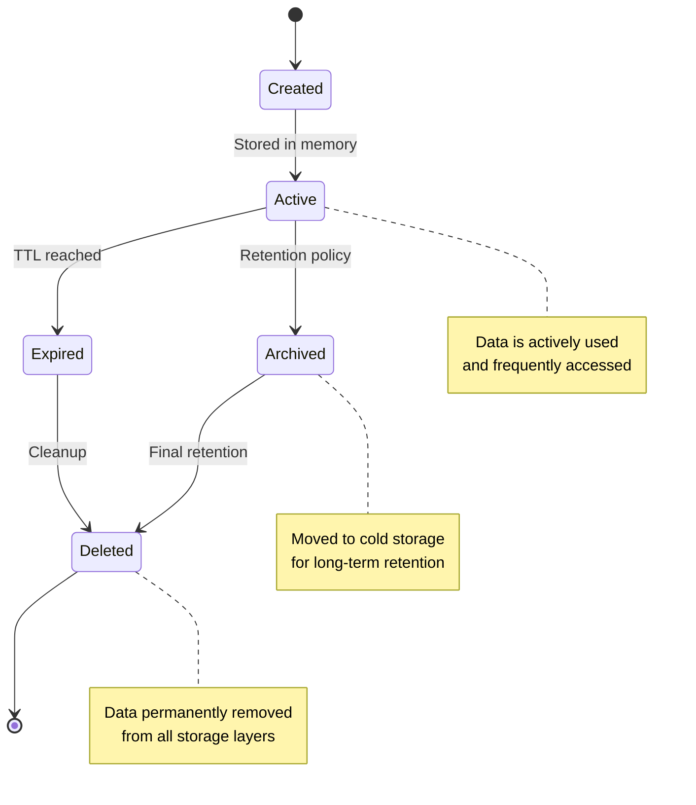

<docs>
# Memory System

<cite>
**Referenced Files in This Document**   
- [memory_manager.py](file://python-claude-flow\src\claude_flow\memory\memory_manager.py) - *Updated in recent commit*
- [sqlite_backend.py](file://python-claude-flow\src\claude_flow\memory\backends\sqlite_backend.py) - *Updated in recent commit*
- [redis_backend.py](file://python-claude-flow\src\claude_flow\memory\backends\redis_backend.py) - *Updated in recent commit*
- [postgresql_backend.py](file://python-claude-flow\src\claude_flow\memory\backends\postgresql_backend.py) - *Updated in recent commit*
- [schema.py](file://python-claude-flow\src\claude_flow\memory\schema.py) - *Updated in recent commit*
- [semantic_search.py](file://python-claude-flow\src\claude_flow\memory\semantic_search.py) - *Updated in recent commit*
- [memory-store.json](file://memory\memory-store.json) - *Sample data*
</cite>

## Update Summary
**Changes Made**   
- Updated data model and schema to reflect new multi-tier architecture
- Added comprehensive documentation for new Python implementation
- Updated database schema and storage section with new backend details
- Added new section on multi-tier memory management
- Updated caching strategies with Redis implementation
- Added new section on semantic search capabilities
- Updated practical examples with new code patterns
- Removed outdated references to legacy memory system

## Table of Contents
1. [Introduction](#introduction)
2. [Data Model and Schema](#data-model-and-schema)
3. [Multi-Tier Memory Management](#multi-tier-memory-management)
4. [Database Schema and Storage](#database-schema-and-storage)
5. [Caching Strategies](#caching-strategies)
6. [Semantic Search](#semantic-search)
7. [Data Lifecycle and Retention](#data-lifecycle-and-retention)
8. [Data Access Patterns](#data-access-patterns)
9. [Security and Privacy](#security-and-privacy)
10. [Practical Examples in Swarm Operations](#practical-examples-in-swarm-operations)
11. [Conclusion](#conclusion)

## Introduction

The Memory System is a sophisticated multi-tier persistent memory solution designed for AI agent collaboration within the Claude-Flow ecosystem. The system implements a comprehensive architecture with three distinct storage tiers: Redis for distributed caching, SQLite for local storage, and PostgreSQL for enterprise-grade persistence. This multi-tier approach enables intelligent data placement based on access patterns, size, and retention requirements.

The Memory System serves as the central nervous system for agent coordination, allowing for persistent storage of workflow states, agent communications, task progress, and shared knowledge. The system's architecture supports hybrid storage backends, advanced semantic search, and intelligent tier assignment strategies. The Python implementation provides a robust foundation for scalable memory operations across distributed environments.

**Section sources**
- [memory_manager.py](file://python-claude-flow\src\claude_flow\memory\memory_manager.py#L1-L50)

## Data Model and Schema

The Memory System's data model is centered around the `MemoryEntry` entity, which represents the fundamental unit of stored information. Each memory entry contains structured data with flexible metadata, enabling rich contextual storage and retrieval across multiple storage tiers.

### Entity Relationships

The data model consists of several interconnected entities that work together to provide comprehensive memory management:

**Diagram sources**
- [schema.py](file://python-claude-flow\src\claude_flow\memory\schema.py#L55-L79)

### Field Definitions

#### MemoryEntry
The core entity in the system, representing a single memory entry with the following fields:

- **key**: Unique identifier for the memory entry (string)
- **content**: The actual data being stored (dictionary)
- **memory_type**: Classification of the memory entry (MemoryType enum)
- **tier**: Storage tier for the entry (MemoryTier enum)
- **metadata**: Additional contextual information (dictionary)
- **created_at**: Creation timestamp (datetime)
- **updated_at**: Last update timestamp (datetime)
- **expires_at**: Expiration timestamp (datetime, optional)

#### MemoryKey
Contains the addressing information for a memory entry:

- **namespace**: Logical grouping for access control (string)
- **entity_type**: Type of entity being stored (string)
- **entity_id**: Unique identifier for the entity (string)
- **version**: Version identifier for conflict resolution (integer, optional)

#### MemoryType
Enumeration of memory content types:

- **TASK_CONTEXT**: Task-specific context and state
- **AGENT_STATE**: Agent internal state and configuration
- **SESSION_DATA**: Session-specific information
- **LEARNING_DATA**: Learned patterns and insights
- **PATTERN_DATA**: Reusable patterns and templates
- **CONVERSATION**: Conversation history and context
- **KNOWLEDGE_BASE**: Domain knowledge and facts
- **METRICS**: Performance metrics and statistics
- **CACHE**: Temporary cache entries

#### MemoryTier
Enumeration of storage tiers:

- **LOCAL**: SQLite - Fast local access for medium-term storage
- **DISTRIBUTED**: Redis - Shared cache for distributed environments
- **PERSISTENT**: PostgreSQL - Long-term storage for enterprise data

**Section sources**
- [schema.py](file://python-claude-flow\src\claude_flow\memory\schema.py#L24-L28)
- [schema.py](file://python-claude-flow\src\claude_flow\memory\schema.py#L70-L79)

## Multi-Tier Memory Management

The Memory System implements a sophisticated multi-tier architecture that intelligently assigns memory entries to different storage tiers based on access patterns, size, and retention requirements.

### Tier Architecture

**Diagram sources**
- [memory_manager.py](file://python-claude-flow\src\claude_flow\memory\memory_manager.py#L39-L551)

### Tier Assignment Strategies

The system supports multiple strategies for assigning memory entries to tiers:

#### Access-Based Strategy
Assigns entries based on access frequency:
- High-frequency access: Redis cache
- Medium-frequency access: SQLite local storage
- Low-frequency access: PostgreSQL persistent storage

#### Size-Based Strategy
Assigns entries based on size:
- Small entries (< 1MB): Redis cache
- Medium entries (1-10MB): SQLite local storage
- Large entries (> 10MB): PostgreSQL persistent storage

#### TTL-Based Strategy
Assigns entries based on expiration time:
- Short TTL (< 1 hour): Redis cache
- Medium TTL (1 hour - 7 days): SQLite local storage
- Long TTL or permanent: PostgreSQL persistent storage

#### Hybrid Strategy
Combines multiple factors with weighted scoring:
- Access frequency (weight: 3)
- Entry size (weight: 2)
- TTL (weight: 2)
- Returns tier with highest total score

**Section sources**
- [memory_manager.py](file://python-claude-flow\src\claude_flow\memory\memory_manager.py#L31-L36)

## Database Schema and Storage

The Memory System implements robust database schemas for each storage tier, optimized for specific access patterns and performance requirements.

### SQLite Schema

**Diagram sources**
- [schema.py](file://python-claude-flow\src\claude_flow\memory\schema.py#L110-L150)

### PostgreSQL Schema

**Diagram sources**
- [schema.py](file://python-claude-flow\src\claude_flow\memory\schema.py#L151-L190)

### Schema Details

The system implements different schemas for each storage tier, optimized for their specific use cases:

#### SQLite Schema
The SQLite schema is optimized for local storage with the following characteristics:
- Text fields for all timestamp values
- Simple indexing strategy
- No native JSON support (stored as text)
- Optimized for single-node access

#### PostgreSQL Schema
The PostgreSQL schema is optimized for enterprise persistence with the following characteristics:
- Native JSONB support for efficient JSON storage and querying
- TSVECTOR for full-text search capabilities
- Vector type for embedding storage
- Partitioning by memory type for performance
- Advanced indexing with GIN indexes

#### Redis Data Structures
The Redis schema uses specialized data structures:
- Hash: Memory entries (key-value pairs)
- Set: Namespace membership
- Sorted Set: Expiry tracking and access frequency
- Hash: Memory relations

**Section sources**
- [schema.py](file://python-claude-flow\src\claude_flow\memory\schema.py#L110-L350)

## Caching Strategies

The Memory System implements a sophisticated caching layer using Redis to improve performance and reduce database load.

### Cache Architecture

**Diagram sources**
- [redis_backend.py](file://python-claude-flow\src\claude_flow\memory\backends\redis_backend.py#L1-L50)

### Redis Cache Implementation

The Redis backend provides distributed caching with the following features:

#### Data Structures
- **Hash**: Stores memory entry data with fields for content, metadata, and timestamps
- **Set**: Tracks memory keys by namespace for efficient filtering
- **Sorted Set**: Maintains access frequency for LRU/LFU eviction
- **Pub/Sub**: Provides real-time notifications for memory operations

#### Eviction Policies
The system supports multiple Redis eviction policies:
- **volatile-lru**: Evict using LRU among keys with expire set
- **allkeys-lru**: Evict any key using LRU
- **volatile-ttl**: Evict based on shortest remaining TTL
- **volatile-random**: Randomly evict keys with expire set

#### Performance Features
- Connection pooling for high concurrency
- Pipeline operations for batch processing
- Compression for large values
- Automatic failover and reconnection

**Section sources**
- [redis_backend.py](file://python-claude-flow\src\claude_flow\memory\backends\redis_backend.py#L39-L765)

## Semantic Search

The Memory System provides advanced semantic search capabilities that combine text search with vector similarity for contextually relevant results.

### Search Architecture

**Diagram sources**
- [semantic_search.py](file://python-claude-flow\src\claude_flow\memory\semantic_search.py#L26-L69)

### Search Capabilities

The system supports multiple search modes:

#### Text Search
Traditional keyword-based search with full-text capabilities:
- Case-insensitive matching
- Wildcard support
- Boolean operators
- Field-specific searching

#### Semantic Search
Vector-based similarity search using embeddings:
- Cosine similarity calculations
- Contextual relevance scoring
- Neural network-based embeddings
- Support for multiple embedding models

#### Hybrid Search
Combines text and semantic search with weighted scoring:
- Configurable weights for text vs. semantic components
- Boosting for recency and frequency
- Tag-based filtering and scoring
- Result ranking and pagination

### Search Query Parameters

#### SearchQuery
Defines the parameters for searching memory entries:

- **text**: Search text (string)
- **embedding**: Vector embedding for semantic search (float array, optional)
- **namespace**: Filter by namespace (string, optional)
- **tags**: Filter by tags (Set<string>, optional)
- **date_range**: Filter by date range (Tuple<datetime, datetime>, optional)
- **min_access_count**: Minimum access count (int)
- **max_results**: Maximum number of results (int)
- **include_expired**: Include expired entries (bool)
- **search_mode**: Search mode ('text', 'semantic', 'hybrid')
- **boost_recent**: Boost recent entries (bool)
- **boost_frequent**: Boost frequently accessed entries (bool)

#### SearchResult
Represents a search result with detailed scoring:

- **key**: Memory key (MemoryKey)
- **entry**: Memory entry (MemoryEntry)
- **relevance_score**: Overall relevance score (float)
- **text_score**: Text search score (float)
- **semantic_score**: Semantic similarity score (float)
- **recency_score**: Recency boost score (float)
- **frequency_score**: Frequency boost score (float)
- **tag_score**: Tag matching score (float)

**Section sources**
- [semantic_search.py](file://python-claude-flow\src\claude_flow\memory\semantic_search.py#L26-L69)

## Data Lifecycle and Retention

The Memory System implements comprehensive data lifecycle management with configurable retention policies, archival rules, and automatic cleanup.

### Data Lifecycle Stages

**Diagram sources**
- [memory_manager.py](file://python-claude-flow\src\claude_flow\memory\memory_manager.py#L39-L551)

### Retention Policies

The system supports multiple retention mechanisms:

#### Time-to-Live (TTL)
Individual memory entries can be assigned a TTL value, after which they are automatically expired and removed from active storage.

#### Tier-Based Retention
Different storage tiers have different retention characteristics:
- **Cache**: Short-term retention (up to 1 hour)
- **Local**: Medium-term retention (up to 7 days)
- **Persistent**: Long-term retention (indefinite)

#### Automatic Migration
The system automatically migrates data between tiers based on access patterns:
- Frequently accessed data moves to cache tier
- Infrequently accessed data moves