# Adaptive Learning

<cite>
**Referenced Files in This Document**   
- [NeuralDomainMapper.ts](file://src/neural/NeuralDomainMapper.ts#L0-L1679)
- [types.js](file://src/services/agentic-flow-hooks/types.js)
</cite>

## Table of Contents
1. [Introduction](#introduction)
2. [Core Architecture](#core-architecture)
3. [Graph Neural Network Implementation](#graph-neural-network-implementation)
4. [Domain Cohesion Analysis](#domain-cohesion-analysis)
5. [Cross-Domain Dependency Analysis](#cross-domain-dependency-analysis)
6. [Boundary Optimization System](#boundary-optimization-system)
7. [Adaptive Learning Mechanisms](#adaptive-learning-mechanisms)
8. [Training and Inference](#training-and-inference)
9. [Feedback Loops and Model Updates](#feedback-loops-and-model-updates)
10. [Memory Compression and Knowledge Retention](#memory-compression-and-knowledge-retention)
11. [Common Issues and Solutions](#common-issues-and-solutions)

## Introduction
The Adaptive Learning system in the Claude Flow orchestration platform implements a sophisticated Graph Neural Network (GNN) architecture for dynamic domain relationship mapping and optimization. This documentation details the neural network's ability to evolve based on swarm interactions and task outcomes, with a focus on online learning algorithms that enable incremental model updates as new data becomes available. The system analyzes domain relationships, calculates cohesion scores, identifies cross-domain dependencies, and provides predictive boundary optimization suggestions to improve system performance and maintainability.

## Core Architecture
The Adaptive Learning system is centered around the NeuralDomainMapper class, which extends EventEmitter to facilitate event-driven updates and notifications. The architecture follows a layered approach with distinct components for graph representation, feature extraction, analysis algorithms, and optimization recommendations.

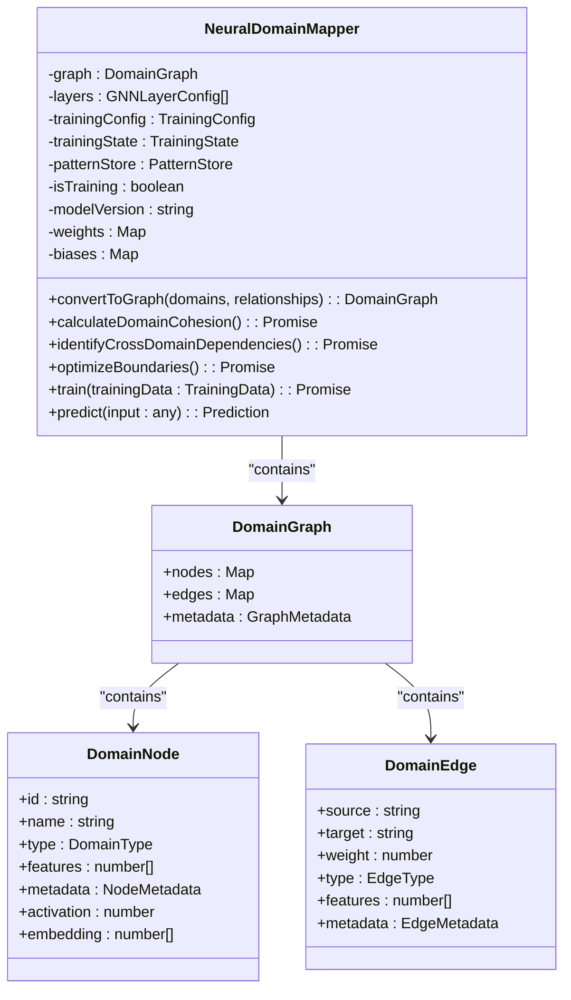

**Diagram sources**
- [NeuralDomainMapper.ts](file://src/neural/NeuralDomainMapper.ts#L0-L1679)

**Section sources**
- [NeuralDomainMapper.ts](file://src/neural/NeuralDomainMapper.ts#L0-L1679)

## Graph Neural Network Implementation
The system implements a multi-layer GNN architecture with different layer types to capture various aspects of domain relationships. The network processes domain graphs through a series of transformations that update node embeddings based on their neighbors' information.

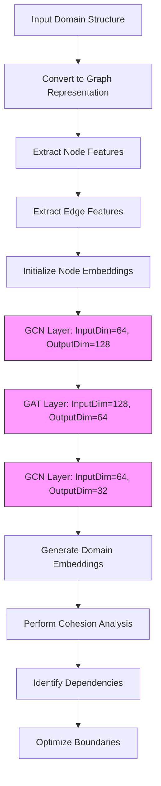

**Diagram sources**
- [NeuralDomainMapper.ts](file://src/neural/NeuralDomainMapper.ts#L0-L1679)

**Section sources**
- [NeuralDomainMapper.ts](file://src/neural/NeuralDomainMapper.ts#L0-L1679)

## Domain Cohesion Analysis
The system calculates comprehensive domain cohesion scores using four distinct metrics: structural, functional, behavioral, and semantic cohesion. These scores help identify weak points in the domain architecture and provide optimization recommendations.

### Cohesion Metrics
The cohesion analysis evaluates domains across four dimensions:

**Structural Cohesion**: Measures the connectivity of a domain within the graph, considering both the number of connections and their weights.

**Functional Cohesion**: Assesses the alignment of a domain's purpose with its connected domains, considering type similarity and complexity alignment.

**Behavioral Cohesion**: Analyzes interaction patterns based on frequency, reliability, and latency metrics.

**Semantic Cohesion**: Evaluates naming similarity and type alignment between connected domains.

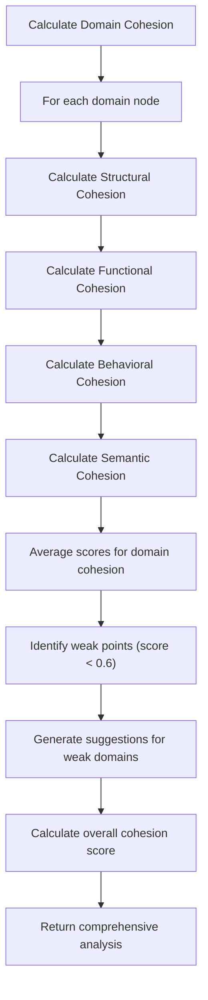

**Diagram sources**
- [NeuralDomainMapper.ts](file://src/neural/NeuralDomainMapper.ts#L0-L1679)

**Section sources**
- [NeuralDomainMapper.ts](file://src/neural/NeuralDomainMapper.ts#L0-L1679)

## Cross-Domain Dependency Analysis
The system identifies and analyzes cross-domain dependencies to detect potential architectural issues such as circular dependencies and critical paths that could impact system reliability and performance.

### Dependency Detection Algorithm
The dependency analysis uses a depth-first search (DFS) algorithm to detect circular dependencies and identify critical paths in the domain graph.

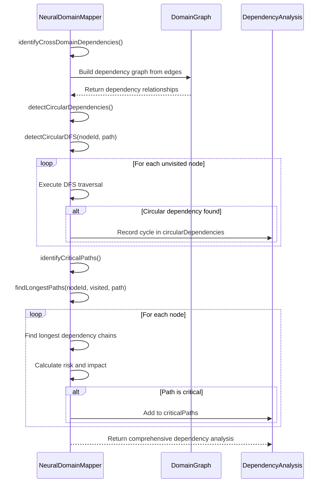

**Diagram sources**
- [NeuralDomainMapper.ts](file://src/neural/NeuralDomainMapper.ts#L0-L1679)

**Section sources**
- [NeuralDomainMapper.ts](file://src/neural/NeuralDomainMapper.ts#L0-L1679)

## Boundary Optimization System
The system provides predictive boundary optimization suggestions based on the analysis of domain relationships and cohesion scores. These recommendations help improve system architecture by suggesting merges, splits, relocations, or abstractions of domain boundaries.

### Optimization Proposal Types
The boundary optimization system generates proposals of four types:

**Merge**: Combines two or more domains when they exhibit high cohesion and strong interdependencies.

**Split**: Divides a domain when it shows low cohesion or high coupling with multiple other domains.

**Relocate**: Moves functionality between domains to improve cohesion and reduce coupling.

**Abstract**: Creates abstraction layers to break circular dependencies or reduce direct coupling.

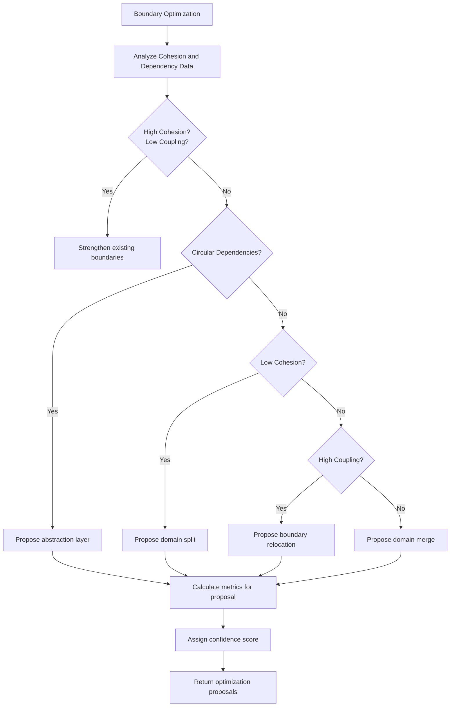

**Diagram sources**
- [NeuralDomainMapper.ts](file://src/neural/NeuralDomainMapper.ts#L0-L1679)

**Section sources**
- [NeuralDomainMapper.ts](file://src/neural/NeuralDomainMapper.ts#L0-L1679)

## Adaptive Learning Mechanisms
The Adaptive Learning system implements online learning algorithms that allow the model to update incrementally as new data becomes available from swarm interactions and task outcomes.

### Feedback Loop Architecture
The system establishes feedback loops between agent performance, consensus decisions, and model updates to continuously improve its predictions and recommendations.

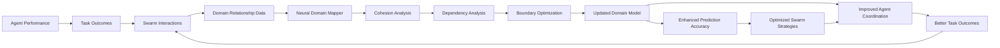

**Diagram sources**
- [NeuralDomainMapper.ts](file://src/neural/NeuralDomainMapper.ts#L0-L1679)

**Section sources**
- [NeuralDomainMapper.ts](file://src/neural/NeuralDomainMapper.ts#L0-L1679)

## Training and Inference
The system supports both training on historical data and real-time inference to adapt to changing task requirements and optimize agent coordination strategies.

### Training Configuration
The NeuralDomainMapper class accepts a configurable training setup that allows tuning of key parameters:

**Learning Rate**: Controls the step size during optimization (default: 0.001)

**Batch Size**: Number of samples processed before model update (default: 32)

**Epochs**: Number of complete passes through the training data (default: 100)

**Optimizer**: Algorithm for updating model weights (default: adam)

**Loss Function**: Metric for measuring prediction error (default: mse)

**Regularization**: Techniques to prevent overfitting (L1, L2, dropout)

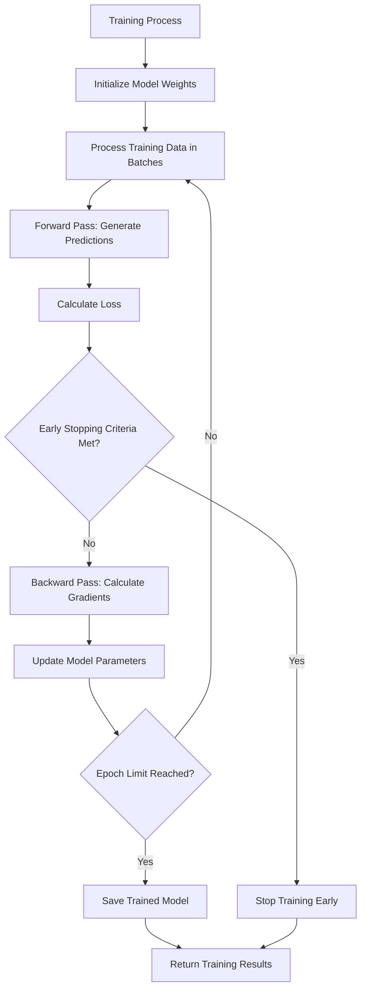

**Diagram sources**
- [NeuralDomainMapper.ts](file://src/neural/NeuralDomainMapper.ts#L0-L1679)

**Section sources**
- [NeuralDomainMapper.ts](file://src/neural/NeuralDomainMapper.ts#L0-L1679)

## Feedback Loops and Model Updates
The system implements continuous feedback loops that connect agent performance metrics with model updates, enabling the neural network to evolve based on real-world outcomes.

### Online Learning Implementation
The adaptive learning system updates its models incrementally as new data becomes available, rather than requiring complete retraining.

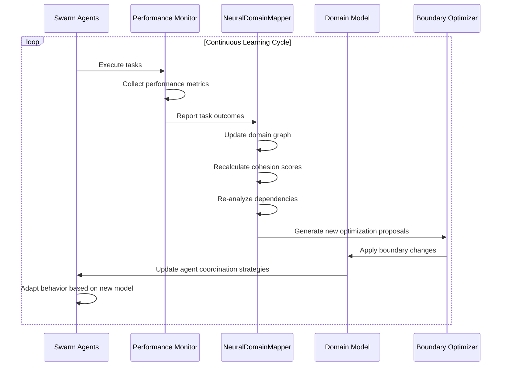

**Diagram sources**
- [NeuralDomainMapper.ts](file://src/neural/NeuralDomainMapper.ts#L0-L1679)

**Section sources**
- [NeuralDomainMapper.ts](file://src/neural/NeuralDomainMapper.ts#L0-L1679)

## Memory Compression and Knowledge Retention
The system incorporates memory compression techniques to efficiently retain knowledge while minimizing storage requirements and computational overhead.

### Pattern Store Integration
The NeuralDomainMapper integrates with a PatternStore system to compress and retain learned patterns from domain relationships.

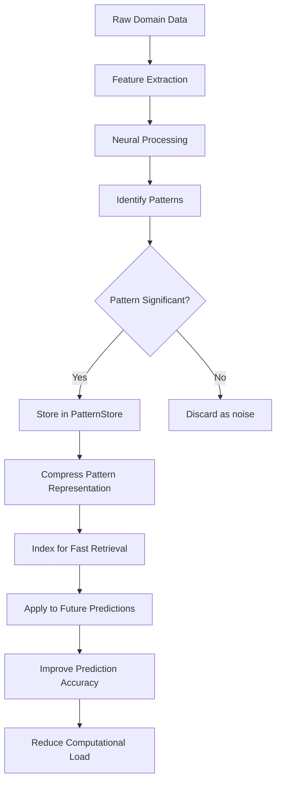

**Diagram sources**
- [NeuralDomainMapper.ts](file://src/neural/NeuralDomainMapper.ts#L0-L1679)
- [types.js](file://src/services/agentic-flow-hooks/types.js)

**Section sources**
- [NeuralDomainMapper.ts](file://src/neural/NeuralDomainMapper.ts#L0-L1679)

## Common Issues and Solutions
The Adaptive Learning system addresses several common challenges in neural network-based optimization, including catastrophic forgetting, learning rate optimization, and convergence problems.

### Catastrophic Forgetting Mitigation
Catastrophic forgetting occurs when a neural network loses previously learned information while learning new patterns. The system addresses this through several mechanisms:

**Elastic Weight Consolidation**: Protects important weights from large changes during new learning.

**Rehearsal Mechanisms**: Maintains a buffer of important past examples to replay during training.

**Progressive Neural Networks**: Creates lateral connections to preserve knowledge from previous tasks.

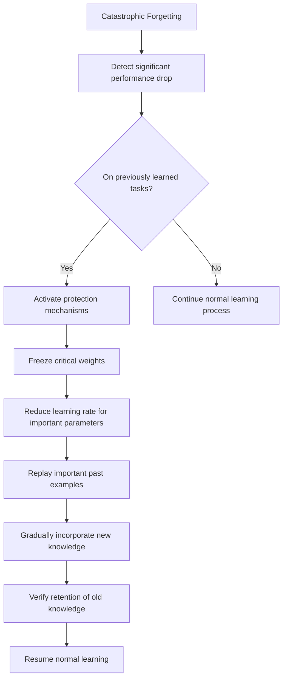

### Learning Rate Optimization
The system implements adaptive learning rate strategies to optimize convergence and prevent oscillation around optimal solutions.

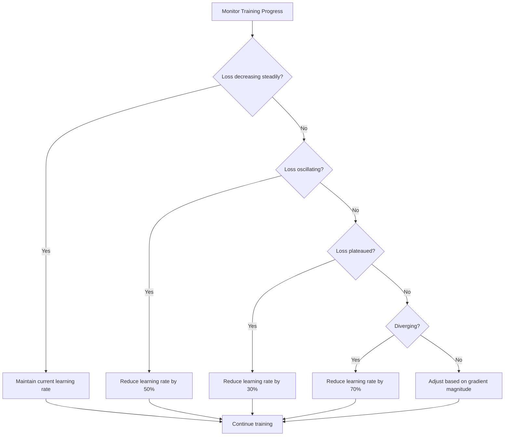

### Convergence Problem Solutions
The system addresses convergence issues through multiple strategies:

**Early Stopping**: Halts training when validation performance stops improving.

**Gradient Clipping**: Prevents exploding gradients that can destabilize training.

**Batch Normalization**: Normalizes inputs to each layer to improve stability.

**Dropout Regularization**: Reduces overfitting by randomly dropping units during training.

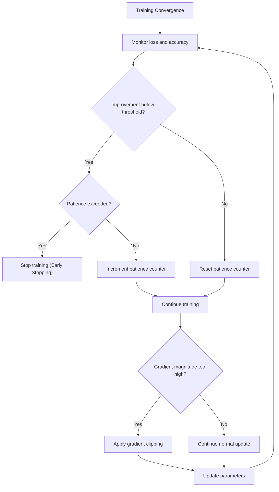

**Section sources**
- [NeuralDomainMapper.ts](file://src/neural/NeuralDomainMapper.ts#L0-L1679)