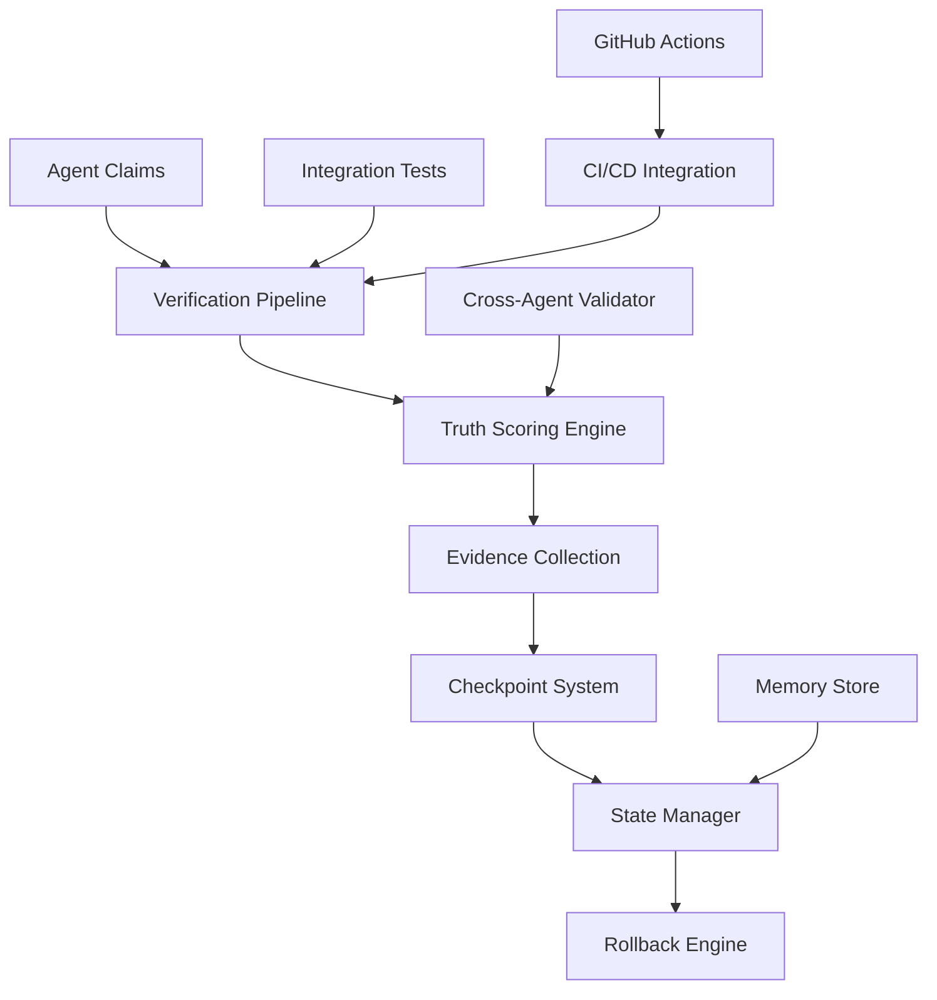
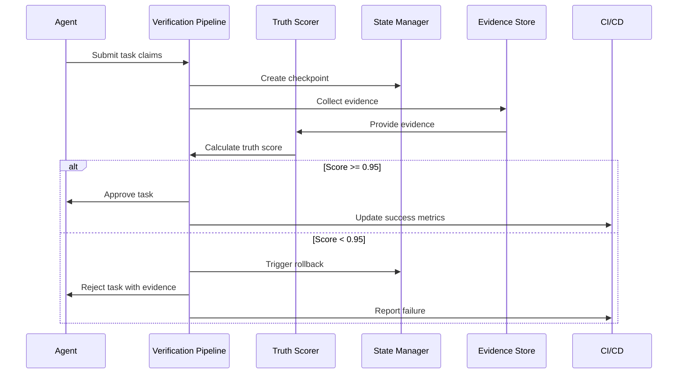
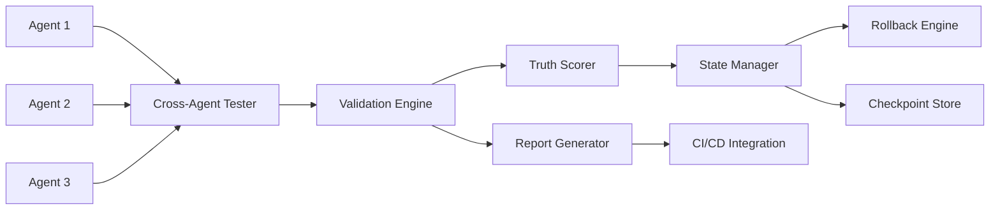

# Explainable AI

<cite>
**Referenced Files in This Document**   
- [README.md](file://src/verification/README.md)
- [architecture.md](file://src/verification/architecture.md)
</cite>

## Table of Contents
1. [Introduction](#introduction)
2. [Explainable AI in the Verification System](#explainable-ai-in-the-verification-system)
3. [Truth Scoring as Explanation](#truth-scoring-as-explanation)
4. [Evidence-Based Decision Transparency](#evidence-based-decision-transparency)
5. [Checkpoint System for Decision Tracing](#checkpoint-system-for-decision-tracing)
6. [Cross-Agent Validation and Coordination Explanations](#cross-agent-validation-and-coordination-explanations)
7. [Rollback and State Management Explanations](#rollback-and-state-management-explanations)
8. [Integration with CI/CD for Auditable Explanations](#integration-with-cicd-for-auditable-explanations)
9. [Performance and Fidelity Considerations](#performance-and-fidelity-considerations)
10. [Best Practices for Interpretation](#best-practices-for-interpretation)

## Introduction
The Explainable AI system within the Claude Flow swarm architecture is implemented through a comprehensive verification and truth enforcement framework. Rather than traditional explainable AI techniques like attention mechanisms or decision trees, the system achieves transparency and interpretability through a rigorous verification pipeline that ensures all agent decisions are evidence-based, auditable, and explainable through concrete validation processes. This document details how the system provides human-readable explanations for swarm decisions, task prioritization, and agent coordination strategies through its verification architecture.

## Explainable AI in the Verification System
The Explainable AI capabilities in the swarm system are primarily implemented through the verification subsystem, which enforces transparency by requiring all agent claims to be verified against reality with a minimum 95% accuracy threshold. The system provides explanations not through post-hoc analysis of neural network decisions, but through proactive validation of all agent actions and claims. This approach ensures that every decision made by the swarm can be explained through the evidence collected during the verification process.

The verification architecture implements transparency through several key mechanisms:
- Mandatory checkpoints at pre-execution, during-execution, and post-execution phases
- Truth scoring system that evaluates agent claims against measurable evidence
- Cross-agent integration testing framework that validates coordination strategies
- State management with rollback capabilities for error recovery
- Full CI/CD integration for continuous verification

This approach to explainability focuses on ensuring decision integrity rather than interpreting black-box model outputs, providing a more robust foundation for trust in the swarm system.

**Diagram sources**
- [architecture.md](file://src/verification/architecture.md#L30-L40)

**Section sources**
- [README.md](file://src/verification/README.md)
- [architecture.md](file://src/verification/architecture.md)

## Truth Scoring as Explanation
The truth scoring system serves as the primary mechanism for explaining model predictions and agent decisions within the swarm. Rather than using feature importance analysis or attention mechanisms, the system calculates a truth score based on multiple dimensions of evidence, providing a comprehensive explanation of why a particular decision is considered valid.

The truth scoring system evaluates agent claims across five key dimensions:
- **Test verification (30%)**: Unit, integration, and end-to-end test results
- **Integration verification (25%)**: Cross-agent test outcomes
- **Code quality verification (30%)**: Linting, type checking, and security scan results
- **Build and deployment verification (10%)**: Build success and deployment status
- **Performance verification (5%)**: Performance metrics and resource usage

Each dimension contributes to the final truth score, which must exceed a 0.95 threshold for a decision to be accepted. This scoring system provides a transparent explanation of decision quality, showing exactly how and why a particular agent claim was validated or rejected.

**Diagram sources**
- [architecture.md](file://src/verification/architecture.md#L480-L505)

**Section sources**
- [architecture.md](file://src/verification/architecture.md#L100-L150)

## Evidence-Based Decision Transparency
The system generates human-readable explanations for swarm decisions through its comprehensive evidence collection framework. Instead of providing abstract explanations of neural network reasoning, the system documents exactly what evidence supports each decision, making the rationale transparent and verifiable.

The evidence collection framework captures data across four key domains:

**Test verification evidence:**
- Unit test results
- Integration test outcomes
- End-to-end test results
- Cross-agent test results

**Code quality evidence:**
- Linting results
- Type checking outcomes
- Code complexity metrics
- Security scan results

**System health evidence:**
- Build results
- Deployment status
- Performance metrics
- Resource usage data

**Agent coordination evidence:**
- Communication logs
- State consistency validation
- Task dependency verification

This evidence-based approach to explainability ensures that every decision can be traced back to concrete, measurable data, enhancing trust in the system and facilitating debugging of swarm behavior. Users can validate AI-generated solutions by examining the collected evidence, providing a level of transparency that exceeds traditional explainable AI methods.

**Section sources**
- [architecture.md](file://src/verification/architecture.md#L150-L200)

## Checkpoint System for Decision Tracing
The checkpoint system provides a critical explanation capability by capturing the state of the swarm at key decision points, enabling complete traceability of the decision-making process. This system serves as a form of "decision provenance," documenting exactly how and why the swarm arrived at particular conclusions.

Checkpoints are enforced at three critical stages:

**Pre-Execution Checkpoints:**
- Agent capability validation
- Resource availability verification
- Dependency validation
- State consistency checks

**During-Execution Checkpoints:**
- Progress validation against expectations
- Resource usage monitoring
- Cross-agent consistency verification
- Real-time truth scoring

**Post-Execution Checkpoints:**
- Result verification against specifications
- System integrity checks
- Performance metric validation
- Final truth score assessment

Each checkpoint captures a comprehensive state snapshot including agent states, system state, task states, memory state, file system state, and database state. This detailed record enables users to understand the context of each decision and trace the evolution of the swarm's state throughout a task. The checkpoint system also facilitates debugging by allowing developers to identify exactly when and where decision errors occur.

**Section sources**
- [architecture.md](file://src/verification/architecture.md#L60-L100)

## Cross-Agent Validation and Coordination Explanations
The cross-agent integration testing framework provides explanations for agent coordination strategies by validating how agents interact and collaborate on tasks. This system documents the swarm's coordination logic through concrete test scenarios that verify expected interaction patterns.

Key coordination scenarios that generate explanatory insights include:

**Task coordination handoff:**
- Coordinator assigns task to coder
- Coder implements solution
- Tester validates implementation
- Coordinator verifies completion

**Parallel execution:**
- Researcher, analyst, and optimizer work concurrently
- Results are synchronized
- Data consistency is validated
- Resource conflicts are prevented

**Error recovery:**
- Monitor detects failure
- Recovery agent initiates rollback
- Coordinator reassigns task
- System integrity is restored

These test scenarios serve as executable documentation of the swarm's coordination strategies, providing clear explanations of how agents work together. The validation rules associated with each scenario (e.g., message delivery time < 1000ms, agent response accuracy > 95%) provide quantitative metrics for evaluating coordination effectiveness, making the rationale for coordination decisions transparent and measurable.

**Diagram sources**
- [architecture.md](file://src/verification/architecture.md#L510-L525)

**Section sources**
- [architecture.md](file://src/verification/architecture.md#L200-L250)

## Rollback and State Management Explanations
The rollback engine and state management system provide explanations for error recovery and decision correction by documenting exactly how the swarm responds to invalid decisions. This capability enhances trust in the system by demonstrating its ability to detect and correct its own mistakes.

The rollback process generates explanatory information through several mechanisms:

**Checkpoint creation:**
- Captures system state before potentially risky operations
- Documents the rationale for creating the checkpoint
- Records agent states and task assignments
- Stores memory and file system snapshots

**Rollback execution:**
- Validates that rollback is safe before proceeding
- Suspends all agents to prevent conflicts
- Restores agent, system, and task states
- Resumes normal operation after restoration

**Rollback verification:**
- Confirms that the system has returned to the expected state
- Validates that all agents are functioning correctly
- Checks that task assignments are consistent
- Ensures data integrity across all components

This rollback capability serves as a form of "negative explanation," showing not only why correct decisions are made but also how incorrect decisions are identified and corrected. The detailed logs and validation checks associated with rollback operations provide valuable insights into the swarm's error detection and recovery mechanisms.

**Section sources**
- [architecture.md](file://src/verification/architecture.md#L250-L300)

## Integration with CI/CD for Auditable Explanations
The integration with GitHub Actions and CI/CD pipelines provides a comprehensive framework for generating auditable explanations of swarm decisions. This integration ensures that all explanations are automatically documented, version-controlled, and accessible for review.

The CI/CD verification workflow consists of four key stages:

**Pre-Execution Verification:**
- Validates agent capabilities
- Checks system prerequisites
- Verifies agent configurations
- Ensures all dependencies are met

**Truth Score Validation:**
- Runs unit and integration tests
- Executes cross-agent tests
- Calculates truth score
- Validates against 0.95 threshold

**State Management Validation:**
- Creates test checkpoints
- Simulates state changes
- Tests rollback capability
- Validates state consistency

**Deployment Verification:**
- Deploys to staging environment
- Runs end-to-end tests
- Validates production readiness
- Generates verification report

This automated pipeline generates comprehensive verification reports that serve as formal explanations of the swarm's decisions and actions. The reports include detailed information about test results, truth scores, checkpoint data, and rollback capabilities, providing a complete audit trail of the decision-making process. By integrating these explanations into the CI/CD workflow, the system ensures that transparency is maintained throughout the development lifecycle.

**Section sources**
- [architecture.md](file://src/verification/architecture.md#L300-L350)

## Performance and Fidelity Considerations
The verification-based approach to explainable AI involves important trade-offs between explanation fidelity, computational overhead, and complexity that must be carefully managed.

**Explanation fidelity:**
The system achieves high explanation fidelity by basing explanations on concrete evidence rather than post-hoc interpretations of model behavior. However, this approach requires that all decisions be verifiable through automated tests and measurable metrics, which may not capture all aspects of complex decision-making processes.

**Computational overhead:**
The verification pipeline introduces significant computational overhead due to:
- Running comprehensive test suites
- Collecting and storing evidence
- Calculating truth scores
- Creating and managing checkpoints
- Executing cross-agent integration tests

This overhead is mitigated through several optimization strategies:
- Concurrent processing of verification tasks
- Intelligent caching of frequently accessed data
- Load balancing across multiple nodes
- Efficient implementation of cryptographic operations

**Complexity of explanations:**
While the evidence-based approach provides high-fidelity explanations, the resulting documentation can be complex and voluminous. The system addresses this challenge by:
- Organizing evidence into clear categories
- Providing summary truth scores
- Highlighting critical discrepancies
- Generating structured verification reports

These considerations demonstrate that the system prioritizes explanation accuracy and trustworthiness over simplicity, accepting increased computational cost to ensure that explanations are grounded in verifiable reality rather than abstract interpretations.

**Section sources**
- [architecture.md](file://src/verification/architecture.md#L350-L400)

## Best Practices for Interpretation
To effectively interpret the explanations generated by the verification system, users should follow these best practices:

**Focus on truth score components:**
- Examine the contribution of each verification dimension to the overall truth score
- Investigate any components with low scores to understand specific weaknesses
- Track changes in component scores over time to identify improvement areas

**Review evidence comprehensively:**
- Examine test results to understand functional correctness
- Analyze code quality metrics to assess maintainability
- Review performance data to evaluate efficiency
- Check system health indicators to ensure stability

**Utilize checkpoint data:**
- Compare state snapshots across checkpoints to trace decision evolution
- Use checkpoint information to debug coordination issues
- Leverage rollback logs to understand error recovery processes

**Monitor cross-agent interactions:**
- Analyze communication patterns between agents
- Validate that task handoffs occur correctly
- Ensure that parallel execution avoids resource conflicts
- Verify that error recovery procedures work as expected

**Leverage CI/CD integration:**
- Review verification reports as part of code review
- Use truth score trends to assess overall system health
- Monitor verification pipeline performance to detect bottlenecks
- Incorporate verification insights into development planning

By following these practices, users can maximize the value of the system's explainability features, gaining deep insights into swarm behavior while maintaining high standards of trust and accountability.

**Section sources**
- [README.md](file://src/verification/README.md)
- [architecture.md](file://src/verification/architecture.md)